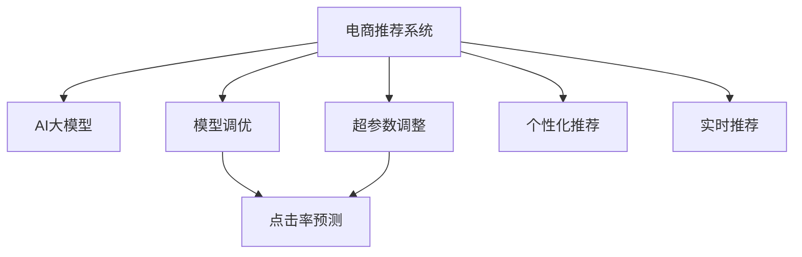

                 

# 电商搜索推荐场景下的AI大模型模型调优技巧

> 关键词：电商搜索、推荐系统、AI大模型、模型调优、深度学习、自然语言处理、点击率预测、个性化推荐、超参数调整

## 1. 背景介绍

### 1.1 问题由来
在当今电子商务飞速发展的背景下，用户通过电商平台进行搜索和购买商品时，往往面临海量商品信息的选择压力。推荐系统旨在通过个性化推荐，提升用户体验，提高转化率。而在大数据和AI技术逐渐成熟的环境中，越来越多的电商平台开始使用AI大模型进行推荐决策，以提升推荐系统的精准度和效率。

然而，大模型的应用也带来了新的挑战。首先是模型训练和推理的计算资源需求巨大，同时模型参数多，调优复杂，如何高效利用计算资源、减少模型计算负担、提升推荐系统性能，成为电商推荐系统面临的重要问题。

## 2. 核心概念与联系

### 2.1 核心概念概述

为更好地理解电商搜索推荐场景下的大模型调优方法，本节将介绍几个密切相关的核心概念：

- 电商推荐系统：基于用户的浏览、购买行为数据，通过机器学习算法，预测用户可能感兴趣的商品并推荐给用户，提升用户满意度和转化率。

- AI大模型：以深度神经网络为代表的超大规模预训练模型，如BERT、GPT等。这些模型通过在海量无标签数据上进行预训练，具备强大的通用语言理解和生成能力，能够显著提升推荐系统的效果。

- 模型调优：指在预训练模型的基础上，通过调整模型参数或结构，优化模型在特定任务上的性能。在电商推荐场景中，主要关注的是如何通过调优提升模型的点击率和个性化推荐效果。

- 超参数调整：指在模型训练前，调整模型中需要手动设置的参数，如学习率、批大小、优化器等，以提升模型性能。

- 点击率预测（CTR Prediction）：推荐系统中的核心任务之一，预测用户对推荐结果的点击概率，为个性化推荐提供依据。

- 个性化推荐：根据用户的历史行为和属性，以及当前的市场趋势，推荐符合用户兴趣和需求的商品，提升用户体验。

- 实时推荐：指在用户浏览网页的过程中，根据实时数据动态调整推荐内容，实现更加灵活、个性化的推荐。

这些核心概念之间的逻辑关系可以通过以下Mermaid流程图来展示：



这个流程图展示了大模型在电商推荐系统中的应用逻辑：

1. 电商推荐系统将AI大模型作为初始化参数。
2. 通过模型调优，优化模型在特定任务上的性能，如点击率预测。
3. 通过超参数调整，进一步提升模型性能。
4. 通过个性化推荐和实时推荐，实现更加灵活的推荐策略。

## 3. 核心算法原理 & 具体操作步骤
### 3.1 算法原理概述

基于电商搜索推荐场景的AI大模型调优，核心目标是提升模型的点击率预测和个性化推荐效果。主要包括以下两个步骤：

1. **模型训练**：使用电商平台的点击率数据进行模型训练，优化模型的预测能力。
2. **模型调优**：通过超参数调整和模型结构优化，进一步提升模型在电商推荐任务上的效果。

### 3.2 算法步骤详解

#### 3.2.1 数据准备
电商平台的推荐系统数据通常包括用户浏览记录、商品信息、用户行为等。对于推荐系统的模型训练，需要准备以下数据：

- 用户浏览记录：包括用户浏览商品的时间、停留时长、点击行为等。
- 商品信息：包括商品名称、描述、价格、类别等信息。
- 用户行为：包括用户的购买行为、评分、评论等。

数据预处理包括以下步骤：

1. **数据清洗**：去除重复、缺失或异常数据，保证数据的质量。
2. **特征工程**：从原始数据中提取有意义的特征，如用户ID、商品ID、类别等，并将文本信息转换为数值型特征。
3. **数据划分**：将数据划分为训练集、验证集和测试集，用于模型训练、调优和评估。

#### 3.2.2 模型训练
电商平台的推荐系统通常采用深度神经网络模型进行训练。以下以基于深度神经网络模型的点击率预测模型为例，给出模型训练的详细步骤：

1. **选择模型架构**：常用的模型架构包括线性模型、多层感知机（MLP）、深度神经网络（DNN）、卷积神经网络（CNN）、循环神经网络（RNN）等。
2. **设计损失函数**：常用的损失函数包括二元交叉熵（Binary Cross-Entropy）、均方误差（Mean Squared Error）等。
3. **数据准备**：将用户浏览记录和商品信息转换为适合模型的输入格式，包括将文本信息转换为数值型特征。
4. **模型训练**：使用训练集数据进行模型训练，最小化损失函数。常用的优化器包括随机梯度下降（SGD）、Adam等。
5. **模型验证**：使用验证集数据评估模型性能，通过早停策略（Early Stopping）防止过拟合。

#### 3.2.3 模型调优
在初步训练完成后，通过调整超参数和优化模型结构，进一步提升模型性能。超参数调整包括以下步骤：

1. **选择超参数**：包括学习率、批大小、优化器等，这些超参数会直接影响模型的训练效果。
2. **超参数调优**：通过网格搜索、随机搜索等方法，寻找最优超参数组合。
3. **模型验证**：使用验证集数据评估超参数调整后的模型性能。

#### 3.2.4 模型部署
完成模型训练和调优后，将模型部署到生产环境中，实现实时推荐。模型部署包括以下步骤：

1. **模型加载**：将训练好的模型加载到目标环境中，如服务器或云平台。
2. **模型推理**：使用测试集数据进行模型推理，评估模型性能。
3. **实时推荐**：根据用户行为数据，实时调整推荐内容，实现个性化推荐。

### 3.3 算法优缺点

电商搜索推荐场景下的AI大模型调优方法具有以下优点：

1. **预测能力强**：大模型具备强大的通用语言理解能力，能够更好地处理电商数据中的文本信息。
2. **灵活性高**：通过模型调优和超参数调整，可以灵活应对不同电商平台的推荐需求。
3. **提升转化率**：通过优化模型性能，提高推荐系统的点击率和转化率，提升用户满意度。

同时，该方法也存在一定的局限性：

1. **计算资源需求高**：大模型训练和推理的计算资源需求巨大，需要高性能的硬件设备和丰富的计算资源。
2. **调优复杂**：模型参数多，调优复杂，需要大量的实验和优化。
3. **泛化能力有限**：当电商平台的推荐需求发生较大变化时，模型的泛化能力可能受限。
4. **实时性要求高**：电商推荐系统需要实时更新推荐内容，对模型的计算速度和响应时间有较高要求。

尽管存在这些局限性，但就目前而言，基于大模型的电商推荐系统调优方法仍是最主流范式。未来相关研究的重点在于如何进一步降低计算资源需求，提高模型调优效率，同时兼顾模型的实时性和泛化能力。

### 3.4 算法应用领域

基于大模型的电商搜索推荐系统调优方法，在电子商务领域已经得到了广泛的应用，主要应用于以下场景：

1. **个性化推荐**：根据用户的历史行为和属性，推荐符合用户兴趣和需求的商品，提升用户体验。
2. **实时推荐**：根据用户实时浏览行为，动态调整推荐内容，实现更加灵活的推荐策略。
3. **点击率预测**：预测用户对推荐结果的点击概率，为个性化推荐提供依据。
4. **搜索排序**：优化搜索结果排序算法，提高搜索结果的相关性和用户满意度。
5. **商品分类**：对商品进行分类和标签标注，提升推荐系统的精准度。

除了这些经典应用外，大模型调优技术还被创新性地应用于更多场景中，如跨平台推荐、用户画像构建、广告投放优化等，为电商技术的发展带来了新的突破。

## 4. 数学模型和公式 & 详细讲解 & 举例说明
### 4.1 数学模型构建

以下以点击率预测模型为例，构建基于大模型的电商推荐系统。假设点击率预测模型为 $M_{\theta}$，其中 $\theta$ 为模型参数，$x$ 为输入特征，$y$ 为输出标签。模型的输入特征包括用户ID、商品ID、商品类别等，输出标签为0或1，表示用户是否点击了该商品。

### 4.2 公式推导过程

假设模型 $M_{\theta}$ 的损失函数为 $\ell(\theta)$，则经验风险为：

$$
\mathcal{L}(\theta) = \frac{1}{N}\sum_{i=1}^N \ell(M_{\theta}(x_i), y_i)
$$

其中 $\ell$ 为损失函数，通常为二元交叉熵或均方误差。点击率预测模型的损失函数为：

$$
\ell(M_{\theta}(x), y) = -y\log(M_{\theta}(x)) - (1-y)\log(1-M_{\theta}(x))
$$

该损失函数的梯度为：

$$
\nabla_{\theta}\ell(M_{\theta}(x), y) = -\frac{y}{M_{\theta}(x)} + \frac{1-y}{1-M_{\theta}(x)}\nabla_{\theta}M_{\theta}(x)
$$

其中 $\nabla_{\theta}M_{\theta}(x)$ 可以通过反向传播算法高效计算。

### 4.3 案例分析与讲解

以Click-Through Rate（CTR）预测模型为例，说明模型训练和调优的具体流程。

假设电商平台收集了1000个用户浏览记录和对应的商品ID，使用其中800个样本进行模型训练，剩余200个样本进行模型验证和测试。

1. **模型选择**：选择深度神经网络模型（DNN）作为点击率预测模型，并设计二元交叉熵作为损失函数。
2. **数据预处理**：将用户浏览记录和商品ID转换为数值型特征，并进行标准化处理。
3. **模型训练**：使用训练集数据进行模型训练，最小化损失函数。
4. **模型验证**：使用验证集数据评估模型性能，通过早停策略（Early Stopping）防止过拟合。
5. **模型调优**：通过超参数调整，如调整学习率、批大小等，进一步提升模型性能。
6. **模型测试**：使用测试集数据评估模型性能，并对比训练前后的效果。

## 5. 项目实践：代码实例和详细解释说明
### 5.1 开发环境搭建

在进行电商搜索推荐系统调优的实践前，需要准备好开发环境。以下是使用Python进行PyTorch开发的环境配置流程：

1. 安装Anaconda：从官网下载并安装Anaconda，用于创建独立的Python环境。

2. 创建并激活虚拟环境：
```bash
conda create -n pytorch-env python=3.8 
conda activate pytorch-env
```

3. 安装PyTorch：根据CUDA版本，从官网获取对应的安装命令。例如：
```bash
conda install pytorch torchvision torchaudio cudatoolkit=11.1 -c pytorch -c conda-forge
```

4. 安装TensorFlow：如果需要在TensorFlow上训练模型，可以使用以下命令进行安装：
```bash
pip install tensorflow==2.7
```

5. 安装各类工具包：
```bash
pip install numpy pandas scikit-learn matplotlib tqdm jupyter notebook ipython
```

完成上述步骤后，即可在`pytorch-env`环境中开始电商推荐系统的调优实践。

### 5.2 源代码详细实现

以下以深度神经网络模型为例，给出使用PyTorch进行电商推荐系统调优的PyTorch代码实现。

```python
import torch
import torch.nn as nn
import torch.optim as optim
import numpy as np
import pandas as pd

# 准备数据
train_data = pd.read_csv('train.csv')
test_data = pd.read_csv('test.csv')

# 数据预处理
train_X = np.array(train_data[['user_id', 'item_id', 'category']])
train_y = np.array(train_data['clicked'])
test_X = np.array(test_data[['user_id', 'item_id', 'category']])
test_y = np.array(test_data['clicked'])

# 定义模型
class DNN(nn.Module):
    def __init__(self, input_dim, hidden_dim, output_dim):
        super(DNN, self).__init__()
        self.fc1 = nn.Linear(input_dim, hidden_dim)
        self.fc2 = nn.Linear(hidden_dim, hidden_dim)
        self.fc3 = nn.Linear(hidden_dim, output_dim)

    def forward(self, x):
        x = torch.relu(self.fc1(x))
        x = torch.relu(self.fc2(x))
        x = torch.sigmoid(self.fc3(x))
        return x

# 定义模型参数和超参数
input_dim = 3
hidden_dim = 64
output_dim = 1
learning_rate = 0.001
batch_size = 128
epochs = 10

# 定义模型
model = DNN(input_dim, hidden_dim, output_dim)

# 定义优化器
optimizer = optim.Adam(model.parameters(), lr=learning_rate)

# 模型训练
def train_epoch(model, data, batch_size, optimizer, criterion):
    total_loss = 0
    model.train()
    for i in range(0, len(data), batch_size):
        x = data[i:i+batch_size]
        y = data[i:i+batch_size, -1]
        optimizer.zero_grad()
        outputs = model(x)
        loss = criterion(outputs, y)
        loss.backward()
        optimizer.step()
        total_loss += loss.item()
    return total_loss / len(data)

# 模型验证
def validate(model, data, batch_size, criterion):
    total_loss = 0
    model.eval()
    with torch.no_grad():
        for i in range(0, len(data), batch_size):
            x = data[i:i+batch_size]
            y = data[i:i+batch_size, -1]
            outputs = model(x)
            loss = criterion(outputs, y)
            total_loss += loss.item()
    return total_loss / len(data)

# 模型测试
def test(model, data, criterion):
    total_loss = 0
    model.eval()
    with torch.no_grad():
        for i in range(0, len(data), batch_size):
            x = data[i:i+batch_size]
            y = data[i:i+batch_size, -1]
            outputs = model(x)
            loss = criterion(outputs, y)
            total_loss += loss.item()
    return total_loss / len(data)

# 数据转换为Tensor
train_X = torch.from_numpy(train_X).float()
train_y = torch.from_numpy(train_y).float()
test_X = torch.from_numpy(test_X).float()
test_y = torch.from_numpy(test_y).float()

# 模型训练
for epoch in range(epochs):
    train_loss = train_epoch(model, train_X, batch_size, optimizer, criterion)
    print(f'Epoch {epoch+1}, train loss: {train_loss:.4f}')
    val_loss = validate(model, train_X, batch_size, criterion)
    print(f'Epoch {epoch+1}, validation loss: {val_loss:.4f}')

# 模型测试
test_loss = test(model, test_X, criterion)
print(f'Test loss: {test_loss:.4f}')
```

## 6. 实际应用场景

### 6.1 智能推荐系统
智能推荐系统是电商推荐系统中的核心组成部分，通过模型预测用户可能感兴趣的商品，为用户推荐个性化商品。智能推荐系统可以提高用户满意度，增加销售额，提升平台的用户黏性。

在实际应用中，智能推荐系统通常分为以下几个步骤：

1. **用户画像**：根据用户的浏览、购买等行为数据，构建用户画像，包括用户的兴趣、偏好、购买力等信息。
2. **商品特征提取**：提取商品的多维特征，如价格、类别、品牌等，并建立商品特征库。
3. **点击率预测**：使用预训练的大模型，对用户和商品进行交叉预测，预测用户对商品的可能点击行为。
4. **推荐排序**：根据预测结果，对推荐结果进行排序，将最有可能被用户点击的商品排在最前面。

### 6.2 个性化推荐
个性化推荐系统能够根据用户的历史行为和属性，推荐符合用户兴趣和需求的商品，提升用户体验。个性化推荐系统通常包括以下步骤：

1. **用户画像**：根据用户的浏览、购买等行为数据，构建用户画像，包括用户的兴趣、偏好、购买力等信息。
2. **商品特征提取**：提取商品的多维特征，如价格、类别、品牌等，并建立商品特征库。
3. **推荐模型训练**：使用预训练的大模型，对用户和商品进行交叉预测，训练推荐模型。
4. **推荐结果生成**：根据训练好的模型，生成个性化推荐结果，并推荐给用户。

### 6.3 实时推荐
实时推荐系统能够在用户浏览网页的过程中，根据实时数据动态调整推荐内容，实现更加灵活的推荐策略。实时推荐系统通常包括以下步骤：

1. **实时数据采集**：实时采集用户的浏览行为数据，如页面停留时间、点击行为等。
2. **推荐模型更新**：根据实时数据更新推荐模型，并动态调整推荐内容。
3. **推荐结果生成**：根据更新后的模型，生成实时推荐结果，并推荐给用户。

### 6.4 未来应用展望
随着大模型和调优技术的不断发展，基于大模型的电商推荐系统将呈现以下几个发展趋势：

1. **更高效计算**：未来将开发更高效的大模型计算架构，降低计算资源需求，提高推荐系统的实时性。
2. **更精准预测**：通过优化模型架构和调优策略，提升模型的点击率预测和个性化推荐能力。
3. **跨平台推荐**：实现跨平台推荐，提升用户在不同平台上的购物体验。
4. **多模态融合**：将视觉、语音、文本等多模态数据进行融合，提升推荐系统的泛化能力和应用范围。
5. **隐私保护**：在推荐系统开发过程中，引入隐私保护技术，保障用户数据安全。

## 7. 工具和资源推荐
### 7.1 学习资源推荐

为帮助开发者系统掌握电商搜索推荐系统调优的理论基础和实践技巧，这里推荐一些优质的学习资源：

1. 《深度学习入门》系列博文：由大模型技术专家撰写，深入浅出地介绍了深度学习入门知识，包括模型选择、损失函数、优化器等。

2. 《推荐系统实战》书籍：全面介绍了推荐系统的基础知识和经典算法，并结合实际项目案例进行讲解。

3. 《深度学习与推荐系统》课程：斯坦福大学开设的推荐系统课程，详细讲解了推荐系统理论和算法，并结合实际项目进行实践。

4. Kaggle竞赛：Kaggle平台上的电商推荐系统竞赛项目，可以帮助开发者进行模型训练和调优实践，并与其他开发者交流学习。

5. PyTorch官方文档：PyTorch官方文档提供了丰富的深度学习框架和模型库，并包含详细的代码示例和教程，是进行电商推荐系统调优的必备资源。

通过对这些资源的学习实践，相信你一定能够快速掌握电商推荐系统调优的精髓，并用于解决实际的推荐问题。

### 7.2 开发工具推荐

高效的开发离不开优秀的工具支持。以下是几款用于电商推荐系统调优开发的常用工具：

1. PyTorch：基于Python的开源深度学习框架，灵活的动态计算图，适合快速迭代研究。
2. TensorFlow：由Google主导开发的开源深度学习框架，生产部署方便，适合大规模工程应用。
3. Weights & Biases：模型训练的实验跟踪工具，可以记录和可视化模型训练过程中的各项指标，方便对比和调优。
4. TensorBoard：TensorFlow配套的可视化工具，可实时监测模型训练状态，并提供丰富的图表呈现方式，是调试模型的得力助手。
5. Jupyter Notebook：轻量级的交互式开发环境，支持Python代码的快速迭代和调试。

合理利用这些工具，可以显著提升电商推荐系统调优任务的开发效率，加快创新迭代的步伐。

### 7.3 相关论文推荐

电商搜索推荐系统调优技术的发展源于学界的持续研究。以下是几篇奠基性的相关论文，推荐阅读：

1. Factorization Machines for Ad Click Probability Prediction（点击率预测经典算法）：提出了因子分解机（FM）算法，并广泛应用于电商推荐系统中。

2. Deep Neural Networks for Click Prediction in Recommendation Systems（深度神经网络点击率预测）：提出了深度神经网络模型，并应用于电商推荐系统中，取得了不错的效果。

3. Neural Factorization Machines（神经因子分解机）：提出了一种结合深度学习思想的因子分解机模型，进一步提升了点击率预测的精度。

4. Long Short-Term Memory（LSTM）：提出了LSTM模型，适用于序列数据的建模和预测，被广泛应用于电商推荐系统中。

5. Attention-Based Recommender Systems（基于注意力机制的推荐系统）：引入了注意力机制，提升了推荐系统对用户兴趣的捕捉能力。

这些论文代表了大模型调优技术的发展脉络。通过学习这些前沿成果，可以帮助研究者把握学科前进方向，激发更多的创新灵感。

## 8. 总结：未来发展趋势与挑战

### 8.1 总结

本文对基于大模型的电商搜索推荐系统调优方法进行了全面系统的介绍。首先阐述了电商推荐系统和大模型调优的基本概念和背景，明确了调优在提升电商推荐系统性能方面的重要意义。其次，从原理到实践，详细讲解了电商搜索推荐系统调优的数学模型和关键步骤，给出了电商推荐系统调优的完整代码实现。同时，本文还广泛探讨了电商推荐系统调优方法在智能推荐、个性化推荐、实时推荐等多个领域的应用前景，展示了调优范式的巨大潜力。此外，本文精选了电商推荐系统调优技术的各类学习资源，力求为读者提供全方位的技术指引。

通过本文的系统梳理，可以看到，基于大模型的电商推荐系统调优方法正在成为电商推荐系统的重要范式，极大地提升了电商推荐系统的精准度和效率。未来，伴随大模型和调优方法的持续演进，电商推荐系统必将迎来更多的技术突破，推动电商技术进一步发展和创新。

### 8.2 未来发展趋势

展望未来，电商搜索推荐系统调优技术将呈现以下几个发展趋势：

1. **更高效计算**：未来将开发更高效的大模型计算架构，降低计算资源需求，提高推荐系统的实时性。
2. **更精准预测**：通过优化模型架构和调优策略，提升模型的点击率预测和个性化推荐能力。
3. **跨平台推荐**：实现跨平台推荐，提升用户在不同平台上的购物体验。
4. **多模态融合**：将视觉、语音、文本等多模态数据进行融合，提升推荐系统的泛化能力和应用范围。
5. **隐私保护**：在推荐系统开发过程中，引入隐私保护技术，保障用户数据安全。

以上趋势凸显了电商推荐系统调优技术的广阔前景。这些方向的探索发展，必将进一步提升电商推荐系统的性能和应用范围，为电商技术的发展带来新的突破。

### 8.3 面临的挑战

尽管电商搜索推荐系统调优技术已经取得了瞩目成就，但在迈向更加智能化、普适化应用的过程中，它仍面临着诸多挑战：

1. **计算资源瓶颈**：大模型训练和推理的计算资源需求巨大，需要高性能的硬件设备和丰富的计算资源。
2. **调优复杂度高**：模型参数多，调优复杂，需要大量的实验和优化。
3. **模型泛化能力有限**：当电商平台的推荐需求发生较大变化时，模型的泛化能力可能受限。
4. **实时性要求高**：电商推荐系统需要实时更新推荐内容，对模型的计算速度和响应时间有较高要求。
5. **数据隐私问题**：在电商推荐系统中，需要处理大量用户数据，数据隐私和安全问题尤为突出。

尽管存在这些挑战，但通过不断优化模型架构和调优策略，结合高效的计算资源和隐私保护技术，电商推荐系统调优技术仍将不断发展和进步，为电商技术和用户带来更多便利。

### 8.4 研究展望

面对电商推荐系统调优所面临的种种挑战，未来的研究需要在以下几个方面寻求新的突破：

1. **更高效计算架构**：开发更高效的大模型计算架构，降低计算资源需求，提高推荐系统的实时性。
2. **多模态融合**：将视觉、语音、文本等多模态数据进行融合，提升推荐系统的泛化能力和应用范围。
3. **跨平台推荐**：实现跨平台推荐，提升用户在不同平台上的购物体验。
4. **隐私保护**：在推荐系统开发过程中，引入隐私保护技术，保障用户数据安全。
5. **多任务学习**：结合多任务学习技术，提升推荐系统的多任务处理能力。

这些研究方向的探索，必将引领电商推荐系统调优技术迈向更高的台阶，为电商技术和用户带来更多便利和创新。面向未来，电商推荐系统调优技术还需要与其他人工智能技术进行更深入的融合，如知识表示、因果推理、强化学习等，多路径协同发力，共同推动电商推荐系统的进步。

## 9. 附录：常见问题与解答

**Q1：电商推荐系统如何应对用户多样化的需求？**

A: 电商推荐系统通常采用协同过滤、基于内容的推荐、混合推荐等多种方法，以应对用户多样化的需求。其中，协同过滤方法通过分析用户的历史行为和兴趣，为用户推荐相似商品；基于内容的推荐方法通过分析商品的多维特征，推荐与用户兴趣匹配的商品；混合推荐方法结合协同过滤和基于内容的方法，综合考虑多种推荐策略，提升推荐效果。

**Q2：如何处理电商推荐系统中的长尾商品？**

A: 长尾商品通常指销量较低的商品，但这些商品往往具有独特的价值。为了提升长尾商品的曝光率，电商推荐系统可以采用以下方法：

1. **增加曝光机会**：在推荐结果中增加长尾商品的展示位置，提升其曝光率。
2. **个性化推荐**：根据用户的兴趣和行为，推荐长尾商品，提升其推荐效果。
3. **跨品推荐**：将长尾商品与其他高销量商品进行关联推荐，提高其曝光率和销量。

**Q3：电商推荐系统如何处理用户行为数据？**

A: 电商推荐系统通常采用日志、点击流、评分等用户行为数据进行推荐。为了提升推荐效果，可以采用以下方法：

1. **数据清洗**：去除重复、缺失或异常数据，保证数据的质量。
2. **特征工程**：从原始数据中提取有意义的特征，如用户ID、商品ID、类别等，并将文本信息转换为数值型特征。
3. **模型训练**：使用深度神经网络模型、因子分解机等方法，对用户和商品进行交叉预测，生成推荐结果。
4. **实时更新**：根据用户的实时行为数据，动态调整推荐内容，实现实时推荐。

通过以上方法，电商推荐系统能够更好地处理用户行为数据，提升推荐效果，提高用户体验。

---

作者：禅与计算机程序设计艺术 / Zen and the Art of Computer Programming

