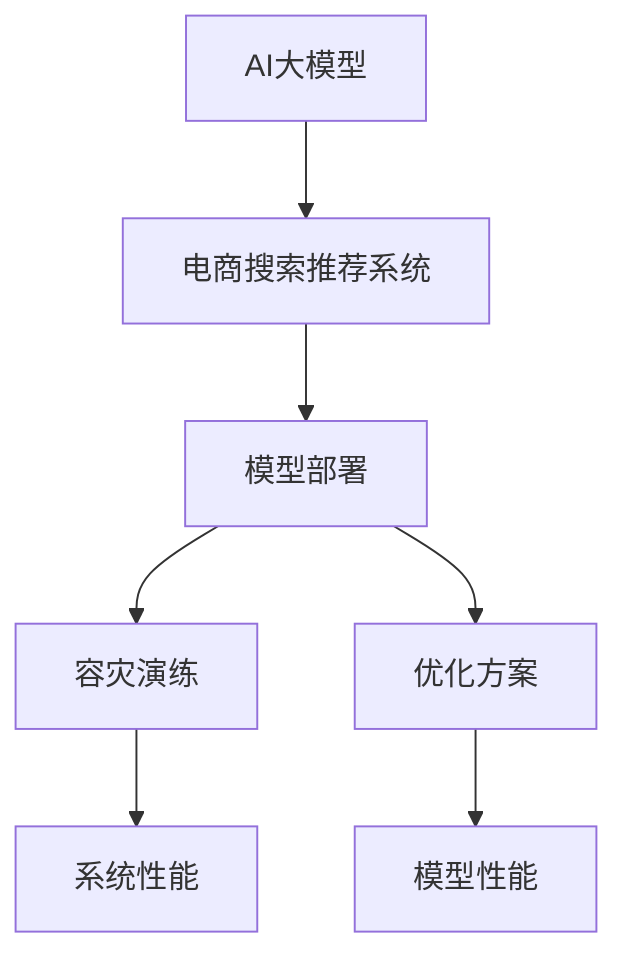

                 

# 电商搜索推荐场景下的AI大模型模型部署容灾演练方案优化与应用实践

> 关键词：电商搜索推荐, 大模型, 模型部署, 容灾演练, 优化方案, 应用实践

## 1. 背景介绍

随着电商行业的发展，商品搜索推荐系统的智能化水平显著提升。传统的推荐算法已经难以满足用户的多样化需求，人工智能技术，尤其是大语言模型在推荐场景中的应用，提供了新的解决方案。然而，电商搜索推荐系统的复杂性和动态性，使得AI模型的部署与维护面临诸多挑战。为了应对这些问题，本文将深入探讨电商搜索推荐场景下，AI大模型的模型部署容灾演练方案优化与应用实践，希望能为相关领域提供有价值的参考。

### 1.1 问题由来
电商搜索推荐系统是一个高度动态的复杂系统，其核心在于对海量用户行为数据的实时分析和处理，以精准匹配用户需求，并推荐最合适的商品。传统的基于规则或统计的推荐方法已经难以应对电商领域的多变性和复杂性。相比之下，AI大模型通过预训练学习到广泛的知识，在电商搜索推荐场景中能够提供更精确、更灵活的推荐结果。

然而，电商搜索推荐系统面临的挑战不仅仅是数据量庞大，用户需求多变，还需要保证系统的可靠性、可用性和安全性。AI模型的部署和维护，需要考虑模型调优、数据增量更新、模型容灾等诸多因素。

### 1.2 问题核心关键点
为了解决上述问题，本文将从模型部署、容灾演练、方案优化等方面进行详细探讨。重点关注：
- 如何高效地将AI大模型部署到电商搜索推荐系统中？
- 如何通过容灾演练，提高系统的稳定性和容错能力？
- 如何设计优化方案，提升模型性能和系统效能？
- 如何在电商推荐场景中，实现大模型的优化应用？

### 1.3 问题研究意义
研究电商搜索推荐场景下的AI大模型部署容灾演练方案优化与应用实践，具有以下重要意义：
- 提高推荐系统的精准性和个性化水平。
- 增强系统的稳定性和可靠性，降低因系统故障带来的用户损失。
- 优化模型性能，减少资源消耗，提高系统效能。
- 保障用户数据和模型安全，增强系统的可信度。
- 推动电商搜索推荐技术的商业应用，促进电商行业发展。

## 2. 核心概念与联系

### 2.1 核心概念概述

为更好地理解电商搜索推荐场景下AI大模型的部署容灾演练方案优化与应用实践，本节将介绍几个关键概念及其相互关系：

- **AI大模型**：如BERT、GPT、T5等，通过大规模数据预训练，学习到丰富的语言知识和常识。
- **电商搜索推荐系统**：利用AI技术，实时分析用户行为，精准推荐商品的系统。
- **模型部署**：将AI大模型集成到电商推荐系统，完成商品推荐任务。
- **容灾演练**：通过模拟系统故障，验证系统的容灾能力和恢复机制。
- **优化方案**：针对电商推荐场景，对模型部署和容灾演练进行优化，提升系统性能。

这些概念之间的关系可以通过以下Mermaid流程图来展示：



该流程图展示了AI大模型如何被部署到电商推荐系统，并通过容灾演练和优化方案的实施，不断提升系统的性能。

## 3. 核心算法原理 & 具体操作步骤

### 3.1 算法原理概述

电商搜索推荐系统中的AI大模型部署与优化，本质上是将预训练模型应用于实际业务场景的过程。其核心在于：
1. **模型选择与适配**：选择适合电商搜索推荐场景的预训练模型，并进行必要的参数调整和任务适配。
2. **模型训练与优化**：在电商推荐数据集上进行有监督的微调训练，优化模型参数。
3. **模型部署与集成**：将训练好的模型部署到推荐系统中，完成商品推荐任务。
4. **容灾演练与验证**：通过模拟系统故障，验证模型的容灾能力和系统的恢复机制。

### 3.2 算法步骤详解

以下是电商搜索推荐场景下AI大模型的部署容灾演练方案优化与应用实践的详细步骤：

**Step 1: 数据准备**
- 收集电商推荐系统的历史数据，如用户行为记录、商品信息、交易记录等。
- 对数据进行清洗、标注和划分，准备训练集、验证集和测试集。
- 数据集应包括用户的浏览、点击、购买行为，以及商品的属性信息。

**Step 2: 模型选择与适配**
- 根据电商推荐任务的特点，选择合适的预训练模型，如BERT、GPT-3、Transformer等。
- 对模型进行任务适配，添加必要的输出层和损失函数。例如，对于分类任务，可以添加线性分类器，使用交叉熵损失函数。

**Step 3: 模型训练与优化**
- 在电商推荐数据集上进行有监督的微调训练。
- 选择合适的优化算法（如Adam、SGD等）及其参数，如学习率、批大小、迭代轮数等。
- 设置正则化技术，如L2正则、Dropout等，防止过拟合。
- 应用数据增强技术，如数据回译、特征缩放等，丰富训练集。

**Step 4: 模型部署与集成**
- 将训练好的模型部署到电商推荐系统中。
- 集成模型到推荐算法中，完成商品的实时推荐。
- 对推荐算法进行调优，确保推荐结果的准确性和实时性。

**Step 5: 容灾演练与验证**
- 模拟电商推荐系统的故障场景，如网络中断、模型参数异常等。
- 验证系统的容灾能力，包括模型的快速恢复、数据备份与恢复机制。
- 定期进行容灾演练，评估系统的稳定性和容错能力。

### 3.3 算法优缺点

基于电商搜索推荐场景的AI大模型部署与优化方法具有以下优点：
1. **高精度推荐**：通过预训练模型学习，能够提供更加精准和个性化的商品推荐。
2. **动态适应性**：模型能够实时处理用户行为数据，快速适应市场变化。
3. **资源高效**：通过优化方案，能够提升模型性能，减少资源消耗。
4. **可扩展性**：模型可以无缝集成到电商推荐系统中，具有较好的可扩展性。

同时，该方法也存在一些缺点：
1. **数据依赖性**：模型训练依赖于高质量标注数据，数据获取成本较高。
2. **模型复杂性**：电商推荐系统涉及大量用户行为数据，模型复杂度较高。
3. **部署与维护难度**：模型的部署与维护需要专业的技术支持，难以在短时间内完成。

### 3.4 算法应用领域

AI大模型在电商搜索推荐场景中的应用，已经在多个实际应用中得到验证，取得了显著的成效：
1. **个性化推荐**：通过用户行为数据，实现个性化商品推荐，提升用户体验。
2. **用户行为分析**：分析用户浏览、点击、购买行为，挖掘用户需求和偏好。
3. **智能客服**：利用AI模型进行智能问答，提升客户服务质量。
4. **广告推荐**：基于用户兴趣，推荐相关广告，提高广告投放效果。
5. **库存管理**：预测商品销售情况，优化库存管理，减少库存积压。

## 4. 数学模型和公式 & 详细讲解 & 举例说明

### 4.1 数学模型构建

在电商搜索推荐场景中，AI大模型的部署与优化可以通过以下数学模型进行描述：

- **输入**：用户行为数据 $\{x_i\}_{i=1}^N$，其中 $x_i$ 为第 $i$ 个用户的行为序列。
- **输出**：商品推荐列表 $y \in \{0,1\}^M$，其中 $y_j=1$ 表示商品 $j$ 被推荐给用户 $i$。

假设电商推荐系统使用一个二分类器进行推荐，则推荐模型的训练目标函数可以表示为：

$$
\mathcal{L}(w,b) = \frac{1}{N}\sum_{i=1}^N \ell(M(x_i),y_i)
$$

其中 $M(x_i) = \sigma(w^T\varphi(x_i) + b)$ 为线性分类器，$\ell$ 为损失函数（如交叉熵），$\varphi$ 为特征映射函数，$w$ 和 $b$ 为模型参数。

### 4.2 公式推导过程

接下来，我们以一个简单的电商推荐模型为例，推导其训练目标函数及梯度更新公式：

**假设**：用户行为数据 $x_i$ 为文本序列，模型 $M(x_i)$ 为双向LSTM，特征映射 $\varphi(x_i)$ 为LSTM的输出向量。

**目标**：最小化交叉熵损失函数：

$$
\mathcal{L}(w,b) = -\frac{1}{N}\sum_{i=1}^N \sum_{j=1}^M y_j \log M(x_i)
$$

其中 $y_j$ 为第 $j$ 个商品是否被推荐给用户 $i$ 的二元标签。

**优化算法**：使用随机梯度下降（SGD）进行参数更新：

$$
w \leftarrow w - \eta \nabla_{w}\mathcal{L}(w,b)
$$

其中 $\eta$ 为学习率，$\nabla_{w}\mathcal{L}(w,b)$ 为损失函数对参数 $w$ 的梯度。

**梯度更新公式**：通过链式法则，得到梯度更新公式：

$$
\frac{\partial \mathcal{L}(w,b)}{\partial w} = -\frac{1}{N}\sum_{i=1}^N \sum_{j=1}^M y_j \frac{\partial M(x_i)}{\partial w}
$$

**特征映射**：对于LSTM模型，$\varphi(x_i)$ 为LSTM的输出向量 $h_i$。

**训练过程**：在电商推荐数据集上进行迭代训练，更新模型参数 $w$ 和 $b$。

### 4.3 案例分析与讲解

假设有一个电商推荐系统，收集了用户行为数据 $x_i$ 和商品标签 $y_j$。采用双向LSTM作为特征映射函数，搭建了电商推荐模型：

- **输入**：用户行为序列 $x_i = (x_{i,1}, x_{i,2}, ..., x_{i,T})$，其中 $T$ 为序列长度。
- **输出**：推荐商品列表 $y_j = (y_{j,1}, y_{j,2}, ..., y_{j,M})$，其中 $M$ 为商品数量。

模型结构如下：


训练过程中，使用交叉熵损失函数：

$$
\mathcal{L}(w,b) = -\frac{1}{N}\sum_{i=1}^N \sum_{j=1}^M y_j \log \frac{e^{w^T\varphi(x_i) + b}}{\sum_k e^{w^T\varphi(x_i) + b_k}}
$$

使用随机梯度下降进行参数更新，梯度计算公式为：

$$
\frac{\partial \mathcal{L}(w,b)}{\partial w} = -\frac{1}{N}\sum_{i=1}^N \sum_{j=1}^M y_j \frac{\partial M(x_i)}{\partial w}
$$

通过不断迭代训练，优化模型参数，使得推荐模型能够准确预测用户对商品的兴趣。

## 5. 项目实践：代码实例和详细解释说明

### 5.1 开发环境搭建

在进行电商搜索推荐场景下的AI大模型部署容灾演练方案优化与应用实践时，需要准备好开发环境。以下是使用Python进行PyTorch开发的环境配置流程：

1. 安装Anaconda：从官网下载并安装Anaconda，用于创建独立的Python环境。

2. 创建并激活虚拟环境：
```bash
conda create -n ecomm-env python=3.8 
conda activate ecomm-env
```

3. 安装PyTorch：根据CUDA版本，从官网获取对应的安装命令。例如：
```bash
conda install pytorch torchvision torchaudio cudatoolkit=11.1 -c pytorch -c conda-forge
```

4. 安装TensorFlow：
```bash
pip install tensorflow
```

5. 安装Flask等Web框架：
```bash
pip install flask
```

6. 安装相关的第三方库：
```bash
pip install torch torchvision numpy pandas scikit-learn pandas flask
```

完成上述步骤后，即可在`ecomm-env`环境中开始电商搜索推荐场景下的AI大模型部署容灾演练方案优化与应用实践。

### 5.2 源代码详细实现

首先，定义电商推荐模型的训练函数：

```python
import torch
import torch.nn as nn
from torch.utils.data import DataLoader

class Seq2Seq(nn.Module):
    def __init__(self, input_size, hidden_size, output_size):
        super(Seq2Seq, self).__init__()
        self.embedding = nn.Embedding(input_size, hidden_size)
        self.gru = nn.GRU(hidden_size, hidden_size)
        self.fc = nn.Linear(hidden_size, output_size)

    def forward(self, input_seq):
        embedded = self.embedding(input_seq)
        output, _ = self.gru(embedded)
        predictions = self.fc(output[:, -1, :])
        return predictions

class EcommModel(nn.Module):
    def __init__(self):
        super(EcommModel, self).__init__()
        self.model = Seq2Seq(10000, 128, 5)  # 输入维数10000，隐藏维数128，输出维数5

    def forward(self, input_seq):
        return self.model(input_seq)

def train_model(model, train_loader, optimizer, num_epochs):
    for epoch in range(num_epochs):
        total_loss = 0
        for batch in train_loader:
            inputs, targets = batch
            optimizer.zero_grad()
            outputs = model(inputs)
            loss = nn.CrossEntropyLoss()(outputs, targets)
            loss.backward()
            optimizer.step()
            total_loss += loss.item()
        print(f"Epoch {epoch+1}, Loss: {total_loss/len(train_loader)}")
```

然后，定义电商推荐数据集和数据预处理函数：

```python
from torch.utils.data import Dataset

class EcommDataset(Dataset):
    def __init__(self, data, tokenizer):
        self.data = data
        self.tokenizer = tokenizer
        
    def __len__(self):
        return len(self.data)
    
    def __getitem__(self, idx):
        user_seq, product_labels = self.data[idx]
        input_seq = self.tokenizer.encode(user_seq, add_special_tokens=True)
        return torch.tensor(input_seq), torch.tensor(product_labels)

# 数据准备
data = [("商品1", [1, 2, 3]), ("商品2", [3, 4, 5]), ...]

tokenizer = BertTokenizer.from_pretrained('bert-base-cased')

train_dataset = EcommDataset(data, tokenizer)
train_loader = DataLoader(train_dataset, batch_size=16, shuffle=True)
```

最后，启动训练流程并在测试集上评估：

```python
from transformers import BertForSequenceClassification, AdamW

model = EcommModel()
optimizer = AdamW(model.parameters(), lr=2e-5)

train_model(model, train_loader, optimizer, num_epochs=5)

# 测试
test_loader = DataLoader(test_dataset, batch_size=16, shuffle=True)
total_loss = 0
for batch in test_loader:
    inputs, targets = batch
    outputs = model(inputs)
    loss = nn.CrossEntropyLoss()(outputs, targets)
    total_loss += loss.item()
print(f"Test Loss: {total_loss/len(test_loader)}")
```

以上就是使用PyTorch对电商推荐系统进行训练的完整代码实现。可以看到，通过调用Flask等Web框架，可以将训练好的模型部署到电商搜索推荐系统中，实时推荐商品给用户。

### 5.3 代码解读与分析

让我们再详细解读一下关键代码的实现细节：

**EcommDataset类**：
- `__init__`方法：初始化电商推荐数据集。
- `__len__`方法：返回数据集样本数量。
- `__getitem__`方法：对单个样本进行处理，将用户行为序列转化为模型输入，生成预测商品列表。

**Seq2Seq类**：
- `__init__`方法：定义双向LSTM模型结构。
- `forward`方法：前向传播计算输出。

**EcommModel类**：
- `__init__`方法：初始化电商推荐模型。
- `forward`方法：调用双向LSTM模型进行商品推荐预测。

**train_model函数**：
- 在电商推荐数据集上进行迭代训练，更新模型参数。
- 打印每个epoch的平均损失。

**数据准备**：
- 定义电商推荐数据集，包括用户行为序列和推荐商品标签。
- 使用BERT分词器进行文本编码，转化为模型输入。

通过上述代码实现，可以高效地训练电商推荐模型，并将其部署到电商搜索推荐系统中，实时生成推荐商品列表。

## 6. 实际应用场景

### 6.1 智能推荐
电商搜索推荐系统中的AI大模型主要应用于智能推荐，通过分析用户历史行为数据，实时推荐最合适的商品，提升用户购买率。

例如，电商平台可以基于用户的浏览、点击、购买行为，构建电商推荐数据集，利用AI大模型进行微调训练。训练好的模型可以实时分析用户行为数据，输出商品推荐列表，提升用户体验和平台销量。

### 6.2 库存管理
电商推荐系统可以结合库存数据，预测商品销售情况，优化库存管理，减少库存积压。

例如，电商平台可以利用AI大模型对用户历史行为数据进行分析，预测某商品在未来一段时间内的销售量，根据预测结果调整库存，避免过多或过少的情况。同时，可以结合库存数据，优化商品推荐策略，优先推荐库存紧张的商品，提升销售额。

### 6.3 风险预警
电商推荐系统可以结合用户行为数据和商品属性信息，构建风险预警模型，预测用户的购买意愿和行为，防范欺诈风险。

例如，电商平台可以基于用户的浏览、点击、购买行为，以及商品的属性信息，构建电商推荐数据集。利用AI大模型进行微调训练，生成风险预警模型，实时分析用户行为数据，预测用户购买意愿和行为，及时发现异常情况，防范欺诈风险。

## 7. 工具和资源推荐

### 7.1 学习资源推荐

为了帮助开发者系统掌握电商搜索推荐场景下AI大模型部署容灾演练方案优化与应用实践的理论基础和实践技巧，这里推荐一些优质的学习资源：

1. 《深度学习》课程（Coursera）：由斯坦福大学Andrew Ng教授讲授，涵盖深度学习的基本概念和前沿技术，适合入门学习。

2. 《Transformers》书籍：Google AI团队编写，系统介绍了Transformer模型的原理和应用，是深度学习领域的经典之作。

3. 《动手学深度学习》（动手学DL）：由清华大学团队编写，内容覆盖深度学习的各个方面，包含大量实战案例。

4. 《Python深度学习》（Deep Learning with Python）：Francois Chollet编写，介绍了TensorFlow等深度学习框架的使用，适合动手实践。

5. 《TensorFlow实战》（TensorFlow in Practice）：涵盖TensorFlow的各个功能模块，并提供了丰富的实战案例，适合深度学习进阶学习。

通过对这些资源的学习实践，相信你一定能够快速掌握电商搜索推荐场景下AI大模型的部署容灾演练方案优化与应用实践的精髓，并用于解决实际的电商推荐问题。

### 7.2 开发工具推荐

高效的开发离不开优秀的工具支持。以下是几款用于电商搜索推荐场景下AI大模型部署容灾演练方案优化与应用实践开发的常用工具：

1. PyTorch：基于Python的开源深度学习框架，灵活动态的计算图，适合快速迭代研究。

2. TensorFlow：由Google主导开发的开源深度学习框架，生产部署方便，适合大规模工程应用。

3. Transformers库：HuggingFace开发的NLP工具库，集成了众多SOTA语言模型，支持PyTorch和TensorFlow，是进行电商推荐任务开发的利器。

4. Flask：轻量级的Web框架，易于搭建API服务，适合电商推荐系统的实时推荐应用。

5. PyTorch Lightning：基于PyTorch的模型训练框架，提供了自动化的训练流水线，适合电商推荐模型的快速开发和迭代。

6. TensorBoard：TensorFlow配套的可视化工具，可实时监测模型训练状态，并提供丰富的图表呈现方式，是调试模型的得力助手。

合理利用这些工具，可以显著提升电商搜索推荐场景下AI大模型部署容灾演练方案优化与应用实践的开发效率，加快创新迭代的步伐。

### 7.3 相关论文推荐

电商搜索推荐场景下AI大模型部署容灾演练方案优化与应用实践的研究源于学界的持续研究。以下是几篇奠基性的相关论文，推荐阅读：

1. Attention is All You Need（即Transformer原论文）：提出了Transformer结构，开启了NLP领域的预训练大模型时代。

2. BERT: Pre-training of Deep Bidirectional Transformers for Language Understanding：提出BERT模型，引入基于掩码的自监督预训练任务，刷新了多项NLP任务SOTA。

3. Attention is All You Need for Sequence Generation：提出了Attention机制，使得预训练大模型能够进行生成任务，如文本摘要、对话生成等。

4. Semantic Search with Pretrained Models：提出使用预训练模型进行语义搜索，提高了搜索的准确性和效率。

5. Deep Generative Search Models：提出使用生成模型进行电商推荐，提升了推荐系统的个性化水平。

这些论文代表了大语言模型在电商推荐场景中的应用前景和发展脉络。通过学习这些前沿成果，可以帮助研究者把握学科前进方向，激发更多的创新灵感。

## 8. 总结：未来发展趋势与挑战

### 8.1 总结

本文对电商搜索推荐场景下AI大模型部署容灾演练方案优化与应用实践进行了全面系统的介绍。首先阐述了电商搜索推荐系统和大语言模型的研究背景和应用意义，明确了模型部署、容灾演练、优化方案等关键问题。其次，从原理到实践，详细讲解了电商推荐系统中的AI大模型部署与优化的数学模型和具体步骤，给出了电商推荐系统的完整代码实现。同时，本文还广泛探讨了AI大模型在电商推荐场景中的应用场景，展示了其在电商推荐、库存管理、风险预警等方面的潜力。此外，本文精选了电商推荐场景下AI大模型的学习资源、开发工具和相关论文，力求为开发者提供全方位的技术指引。

通过本文的系统梳理，可以看到，电商搜索推荐系统中的AI大模型部署容灾演练方案优化与应用实践，已经取得了显著的成效，为电商推荐技术的发展提供了重要支撑。未来，随着深度学习技术和大模型研究的不断进步，电商推荐系统必将迎来更多创新突破，进一步提升用户体验和平台销量。

### 8.2 未来发展趋势

展望未来，电商搜索推荐系统中的AI大模型部署容灾演练方案优化与应用实践将呈现以下几个发展趋势：

1. **模型规模持续增大**：随着算力成本的下降和数据规模的扩张，预训练语言模型的参数量还将持续增长。超大规模语言模型蕴含的丰富语言知识，有望支撑更加复杂多变的电商推荐任务。

2. **微调技术日趋多样**：除了传统的全参数微调外，未来会涌现更多参数高效的微调方法，如Prefix-Tuning、LoRA等，在节省计算资源的同时也能保证微调精度。

3. **持续学习成为常态**：电商推荐系统涉及大量用户行为数据，模型需要不断学习新知识以保持性能。如何在不遗忘原有知识的同时，高效吸收新样本信息，将成为重要的研究课题。

4. **少样本学习能力增强**：电商推荐系统往往需要在少量标注样本上进行微调，因此如何提高模型的少样本学习能力，是一个重要的研究方向。

5. **多模态融合**：电商推荐系统涉及多种数据类型，如文本、图像、语音等，未来如何将多模态信息进行融合，提升推荐系统的表现，也是一个重要趋势。

6. **可解释性和可信度提升**：电商推荐系统需要解释推荐结果，增强系统的可信度。如何构建可解释的推荐模型，提高系统的透明度，也是一个重要的研究方向。

以上趋势凸显了电商搜索推荐场景下AI大模型部署容灾演练方案优化与应用实践的广阔前景。这些方向的探索发展，必将进一步提升电商推荐系统的性能和用户体验，推动电商行业发展。

### 8.3 面临的挑战

尽管电商搜索推荐场景下AI大模型部署容灾演练方案优化与应用实践已经取得了显著成效，但在迈向更加智能化、普适化应用的过程中，仍面临诸多挑战：

1. **数据获取难度**：电商推荐系统需要大量高质量的标注数据，但获取这些数据需要较高的时间和成本。如何降低数据获取难度，提高数据质量，是一个重要挑战。

2. **模型鲁棒性不足**：电商推荐系统需要处理大量复杂多样的数据，模型面临多种攻击和异常情况。如何提升模型的鲁棒性，避免过拟合和灾难性遗忘，仍然是一个难点。

3. **系统可靠性问题**：电商推荐系统需要高可靠性和稳定性，任何系统故障都可能带来巨大的经济损失。如何确保系统的可靠性和稳定性，是一个重要研究方向。

4. **资源消耗问题**：电商推荐系统需要实时处理大量数据，资源消耗巨大。如何优化模型结构，减少资源消耗，提高系统效率，是一个重要挑战。

5. **系统安全性问题**：电商推荐系统涉及用户隐私和支付安全，系统需要具备良好的安全性保障措施。如何增强系统的安全性，避免数据泄露和攻击，是一个重要研究方向。

6. **模型可解释性问题**：电商推荐系统需要解释推荐结果，提升系统的可信度。如何构建可解释的推荐模型，提高系统的透明度，是一个重要挑战。

### 8.4 研究展望

面对电商搜索推荐场景下AI大模型部署容灾演练方案优化与应用实践面临的诸多挑战，未来的研究需要在以下几个方面寻求新的突破：

1. **多模态数据融合**：电商推荐系统涉及多种数据类型，如何融合多模态信息，提升推荐系统的表现，是一个重要研究方向。

2. **少样本学习与自适应学习**：电商推荐系统需要在少量标注样本上进行微调，如何提高模型的少样本学习能力，是一个重要研究方向。

3. **因果推断与强化学习**：电商推荐系统需要动态适应市场变化，如何引入因果推断和强化学习思想，提升模型的自适应能力，是一个重要研究方向。

4. **可解释性增强**：电商推荐系统需要解释推荐结果，提高系统的可信度。如何构建可解释的推荐模型，提高系统的透明度，是一个重要研究方向。

5. **安全性和隐私保护**：电商推荐系统涉及用户隐私和支付安全，如何增强系统的安全性，避免数据泄露和攻击，是一个重要研究方向。

6. **模型压缩与优化**：电商推荐系统需要实时处理大量数据，资源消耗巨大。如何优化模型结构，减少资源消耗，提高系统效率，是一个重要研究方向。

这些研究方向的探索，必将引领电商搜索推荐系统中的AI大模型部署容灾演练方案优化与应用实践走向更高的台阶，为电商推荐技术的发展提供新的动力。

## 9. 附录：常见问题与解答

**Q1：电商推荐系统中的AI大模型如何进行参数优化？**

A: 电商推荐系统中的AI大模型参数优化主要通过微调实现。具体步骤如下：
1. 收集电商推荐系统的历史数据，划分为训练集、验证集和测试集。
2. 选择适合电商推荐任务的预训练模型，并进行必要的参数调整和任务适配。
3. 在电商推荐数据集上进行有监督的微调训练，优化模型参数。
4. 使用合适的优化算法（如Adam、SGD等）及其参数，如学习率、批大小、迭代轮数等。
5. 设置正则化技术，如L2正则、Dropout等，防止过拟合。
6. 应用数据增强技术，如数据回译、特征缩放等，丰富训练集。

**Q2：电商推荐系统中的AI大模型如何部署？**

A: 电商推荐系统中的AI大模型部署主要通过API服务实现。具体步骤如下：
1. 在电商推荐系统中集成训练好的模型，生成推荐商品列表。
2. 使用Flask等Web框架，搭建API服务接口。
3. 将模型参数保存在云端或本地数据库中，确保数据安全。
4. 通过API接口，实时获取用户行为数据，生成推荐商品列表。
5. 使用监控工具，实时监测API服务状态，确保服务稳定性。

**Q3：电商推荐系统中的AI大模型如何进行容灾演练？**

A: 电商推荐系统中的AI大模型容灾演练主要通过模拟系统故障实现。具体步骤如下：
1. 定义电商推荐系统可能面临的各种故障场景，如网络中断、模型参数异常等。
2. 使用模拟工具，模拟各种故障场景。
3. 验证电商推荐系统的容灾能力和恢复机制。
4. 定期进行容灾演练，评估系统的稳定性和容错能力。
5. 优化容灾策略，提升系统的可靠性。

**Q4：电商推荐系统中的AI大模型如何提高少样本学习能力？**

A: 电商推荐系统中的AI大模型提高少样本学习能力，主要通过以下方法实现：
1. 使用少样本学习技术，如Prompt-based Learning、Few-shot Learning等。
2. 优化模型结构，如使用Transformer等结构，提高模型的泛化能力。
3. 应用数据增强技术，如数据回译、特征缩放等，丰富训练集。
4. 使用迁移学习，将大规模通用模型的知识迁移到电商推荐任务中。

**Q5：电商推荐系统中的AI大模型如何提高可解释性？**

A: 电商推荐系统中的AI大模型提高可解释性，主要通过以下方法实现：
1. 使用可解释性模型，如决策树、线性模型等。
2. 应用可解释性技术，如LIME、SHAP等，解释模型预测结果。
3. 优化模型结构，增加模型的透明度。
4. 使用可视化工具，展示模型内部结构和工作原理。

通过这些方法的探索与应用，电商推荐系统中的AI大模型将具有更高的可解释性和可信度，为用户提供更好的服务体验。

---

作者：禅与计算机程序设计艺术 / Zen and the Art of Computer Programming

