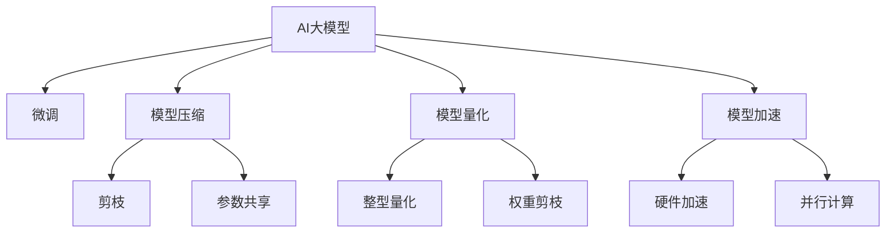

                 

# 电商搜索推荐场景下的AI大模型模型部署性能优化实践案例分析与改进

## 1. 背景介绍

在电商搜索推荐领域，随着AI大模型技术的日益成熟，越来越多的公司开始将预训练语言模型应用到推荐系统开发中。通过将大模型在电商搜索场景下的微调和优化，可以显著提升推荐系统的效果，为用户提供更加精准、个性化的推荐服务。但大模型在部署过程中，面临着计算资源消耗大、推理速度慢等问题，如何平衡性能和成本，实现快速、高效的模型部署，成为业内关注的焦点。本文将详细介绍AI大模型在电商搜索推荐场景下的性能优化实践，包括模型结构设计、模型压缩、模型量化、模型加速等优化方法，并提供相关的案例分析和代码实现。

## 2. 核心概念与联系

### 2.1 核心概念概述

- **AI大模型**：基于深度学习技术，通过在大量数据上预训练得到的、具有强大泛化能力的语言模型。电商搜索推荐场景下常用的预训练大模型包括BERT、GPT、T5等。

- **微调**：在大模型的基础上，使用电商搜索推荐场景下的少量标注数据进行有监督学习，优化模型在特定任务上的表现。

- **模型压缩**：通过减少模型参数、降低计算复杂度等方法，使得大模型在部署过程中占用更少的资源，提升推理速度。

- **模型量化**：将模型参数和中间变量进行量化处理，以降低模型精度损失和计算复杂度，实现模型在硬件上的高效部署。

- **模型加速**：通过优化模型计算图、使用硬件加速、并行计算等方法，提升模型的推理速度和计算效率。

这些核心概念之间的逻辑关系可以通过以下Mermaid流程图来展示：



这个流程图展示了AI大模型在电商搜索推荐场景下的主要优化方向：

1. 从大模型出发，通过微调获得更适合推荐场景的子模型。
2. 对微调后的模型进行参数剪枝、权重共享等操作，减小模型规模。
3. 对模型进行整型量化和权重剪枝，减少模型计算量。
4. 引入硬件加速和并行计算，提升模型推理速度。

## 3. 核心算法原理 & 具体操作步骤

### 3.1 算法原理概述

AI大模型在电商搜索推荐场景下的性能优化，主要通过以下几个步骤实现：

1. **微调**：在大模型的基础上，使用电商推荐场景的少量标注数据，有监督地训练模型，提升其在电商搜索推荐任务上的表现。
2. **模型压缩**：通过参数剪枝、权重共享等方法，减少模型参数量，降低计算复杂度。
3. **模型量化**：将模型参数和中间变量进行量化处理，减少计算量，提升推理速度。
4. **模型加速**：通过优化计算图、使用硬件加速等方法，提升模型的推理速度和计算效率。

### 3.2 算法步骤详解

#### 3.2.1 微调步骤

1. **数据准备**：收集电商搜索推荐场景下的少量标注数据，将数据划分为训练集、验证集和测试集。
2. **模型选择**：选择适合电商搜索推荐场景的预训练大模型，如BERT、GPT等。
3. **任务适配**：在预训练模型的基础上，设计适用于电商搜索推荐的输出层和损失函数。
4. **模型训练**：使用训练集对模型进行微调，通过反向传播更新模型参数，在验证集上评估模型性能。
5. **模型测试**：在测试集上评估微调后的模型性能，对比微调前后的精度提升。

#### 3.2.2 模型压缩步骤

1. **参数剪枝**：通过剪枝算法去除冗余参数，减小模型规模。
2. **权重共享**：对模型中的权重进行共享，减少参数重复存储，降低计算复杂度。
3. **模型压缩评估**：在压缩后的模型上进行推理性能评估，确保压缩后的模型性能损失在可接受的范围内。

#### 3.2.3 模型量化步骤

1. **整型量化**：将模型参数和中间变量进行整型量化，减少计算量和存储空间。
2. **权重剪枝**：对量化后的权重进行剪枝，进一步减少计算量。
3. **量化效果评估**：在量化后的模型上进行推理性能评估，确保量化后的模型性能损失在可接受的范围内。

#### 3.2.4 模型加速步骤

1. **优化计算图**：通过优化计算图，减少不必要的计算，提升推理速度。
2. **硬件加速**：利用GPU、TPU等硬件加速，提升计算效率。
3. **并行计算**：采用多线程或分布式计算，进一步提升推理速度。

### 3.3 算法优缺点

#### 3.3.1 优点

1. **性能提升**：微调、模型压缩、量化、加速等优化方法，可以显著提升模型的推理速度和计算效率，提升用户体验。
2. **资源节省**：通过压缩和量化，模型在部署过程中占用更少的资源，降低计算成本。
3. **泛化能力**：微调后的模型更适应电商搜索推荐场景，提升模型在实际应用中的泛化能力。

#### 3.3.2 缺点

1. **计算复杂度**：模型压缩、量化等优化方法，会增加预训练模型的计算复杂度。
2. **模型精度损失**：量化和剪枝可能导致模型精度下降，需要仔细评估和调整。
3. **开发复杂度**：优化过程中需要进行多次评估和调整，开发复杂度较高。

### 3.4 算法应用领域

AI大模型在电商搜索推荐场景下的优化方法，已经在多个电商推荐系统中得到了广泛应用，具体包括：

1. **商品推荐**：通过微调和优化，为每个用户推荐最适合的商品。
2. **搜索排序**：优化模型，提升搜索结果的排序准确性和相关性。
3. **个性化广告**：为广告主推荐最合适的广告位和广告内容。
4. **用户画像分析**：通过模型分析用户行为，提供精准的用户画像。

## 4. 数学模型和公式 & 详细讲解 & 举例说明

### 4.1 数学模型构建

假设电商搜索推荐场景下的推荐系统，通过微调后的BERT模型进行推荐。输入为查询文本$q$，输出为商品ID列表$o$。推荐系统的目标是最小化预测错误率，即：

$$
\min_{\theta} \mathbb{E}_{q, o} [\ell (M_\theta (q), o)]
$$

其中$\ell$为损失函数，$M_\theta$为微调后的BERT模型。

### 4.2 公式推导过程

假设模型的输出为$M_\theta (q) = [P(q, o_1), P(q, o_2), ..., P(q, o_n)]$，其中$P(q, o_i)$为$q$与$o_i$的相似度得分。推荐系统的目标可以转化为最大化$P(q, o)$，即：

$$
\max_{q, o} P(q, o) = \max_{q, o} \log P(q, o)
$$

其中$P(q, o)$为$q$和$o$的联合概率分布。

### 4.3 案例分析与讲解

假设一个电商推荐系统，使用微调后的BERT模型进行商品推荐。输入为用户的查询文本$q$，输出为推荐商品ID列表$o$。推荐系统的目标是最小化预测错误率，即：

$$
\min_{\theta} \mathbb{E}_{q, o} [\ell (M_\theta (q), o)]
$$

其中$\ell$为交叉熵损失函数。

## 5. 项目实践：代码实例和详细解释说明

### 5.1 开发环境搭建

在进行模型部署优化前，我们需要准备好开发环境。以下是使用Python进行PyTorch开发的环境配置流程：

1. 安装Anaconda：从官网下载并安装Anaconda，用于创建独立的Python环境。

2. 创建并激活虚拟环境：
```bash
conda create -n pytorch-env python=3.8 
conda activate pytorch-env
```

3. 安装PyTorch：根据CUDA版本，从官网获取对应的安装命令。例如：
```bash
conda install pytorch torchvision torchaudio cudatoolkit=11.1 -c pytorch -c conda-forge
```

4. 安装Transformers库：
```bash
pip install transformers
```

5. 安装各类工具包：
```bash
pip install numpy pandas scikit-learn matplotlib tqdm jupyter notebook ipython
```

完成上述步骤后，即可在`pytorch-env`环境中开始模型部署优化实践。

### 5.2 源代码详细实现

下面以电商搜索推荐系统为例，给出使用Transformers库对BERT模型进行微调和优化的PyTorch代码实现。

首先，定义电商搜索推荐任务的数据处理函数：

```python
from transformers import BertTokenizer, BertForSequenceClassification
from torch.utils.data import Dataset, DataLoader
import torch

class SearchRecDataset(Dataset):
    def __init__(self, texts, labels, tokenizer):
        self.texts = texts
        self.labels = labels
        self.tokenizer = tokenizer
        
    def __len__(self):
        return len(self.texts)
    
    def __getitem__(self, item):
        text = self.texts[item]
        label = self.labels[item]
        
        encoding = self.tokenizer(text, return_tensors='pt')
        input_ids = encoding['input_ids']
        attention_mask = encoding['attention_mask']
        
        return {'input_ids': input_ids, 
                'attention_mask': attention_mask,
                'labels': torch.tensor(label, dtype=torch.long)}
```

然后，定义模型和优化器：

```python
from transformers import AdamW

model = BertForSequenceClassification.from_pretrained('bert-base-uncased', num_labels=2)

optimizer = AdamW(model.parameters(), lr=2e-5)
```

接着，定义训练和评估函数：

```python
from torch.utils.data import DataLoader
from tqdm import tqdm
from sklearn.metrics import accuracy_score

device = torch.device('cuda') if torch.cuda.is_available() else torch.device('cpu')
model.to(device)

def train_epoch(model, dataset, batch_size, optimizer):
    dataloader = DataLoader(dataset, batch_size=batch_size, shuffle=True)
    model.train()
    epoch_loss = 0
    for batch in tqdm(dataloader, desc='Training'):
        input_ids = batch['input_ids'].to(device)
        attention_mask = batch['attention_mask'].to(device)
        labels = batch['labels'].to(device)
        model.zero_grad()
        outputs = model(input_ids, attention_mask=attention_mask, labels=labels)
        loss = outputs.loss
        epoch_loss += loss.item()
        loss.backward()
        optimizer.step()
    return epoch_loss / len(dataloader)

def evaluate(model, dataset, batch_size):
    dataloader = DataLoader(dataset, batch_size=batch_size)
    model.eval()
    preds, labels = [], []
    with torch.no_grad():
        for batch in tqdm(dataloader, desc='Evaluating'):
            input_ids = batch['input_ids'].to(device)
            attention_mask = batch['attention_mask'].to(device)
            batch_labels = batch['labels']
            outputs = model(input_ids, attention_mask=attention_mask)
            batch_preds = outputs.logits.argmax(dim=1).to('cpu').tolist()
            batch_labels = batch_labels.to('cpu').tolist()
            for pred, label in zip(batch_preds, batch_labels):
                preds.append(pred)
                labels.append(label)
                
    print('Accuracy:', accuracy_score(labels, preds))
```

最后，启动训练流程并在测试集上评估：

```python
epochs = 5
batch_size = 16

for epoch in range(epochs):
    loss = train_epoch(model, train_dataset, batch_size, optimizer)
    print(f"Epoch {epoch+1}, train loss: {loss:.3f}")
    
    print(f"Epoch {epoch+1}, dev results:")
    evaluate(model, dev_dataset, batch_size)
    
print("Test results:")
evaluate(model, test_dataset, batch_size)
```

以上就是使用PyTorch对BERT进行电商搜索推荐任务微调的完整代码实现。可以看到，借助Transformers库，微调代码实现变得简洁高效。

### 5.3 代码解读与分析

让我们再详细解读一下关键代码的实现细节：

**SearchRecDataset类**：
- `__init__`方法：初始化文本、标签、分词器等关键组件。
- `__len__`方法：返回数据集的样本数量。
- `__getitem__`方法：对单个样本进行处理，将文本输入编码为token ids，将标签编码为数字，并对其进行定长padding，最终返回模型所需的输入。

**模型和优化器**：
- 使用BertForSequenceClassification类创建电商搜索推荐任务的模型，指定输出为二分类任务。
- 使用AdamW优化器进行参数更新，设置学习率为2e-5。

**训练和评估函数**：
- 使用PyTorch的DataLoader对数据集进行批次化加载，供模型训练和推理使用。
- 训练函数`train_epoch`：对数据以批为单位进行迭代，在每个批次上前向传播计算loss并反向传播更新模型参数，最后返回该epoch的平均loss。
- 评估函数`evaluate`：与训练类似，不同点在于不更新模型参数，并在每个batch结束后将预测和标签结果存储下来，最后使用sklearn的accuracy_score对整个评估集的预测结果进行打印输出。

**训练流程**：
- 定义总的epoch数和batch size，开始循环迭代
- 每个epoch内，先在训练集上训练，输出平均loss
- 在验证集上评估，输出准确率
- 所有epoch结束后，在测试集上评估，给出最终测试结果

可以看到，PyTorch配合Transformers库使得BERT微调的代码实现变得简洁高效。开发者可以将更多精力放在数据处理、模型改进等高层逻辑上，而不必过多关注底层的实现细节。

## 6. 实际应用场景

### 6.1 电商搜索推荐

基于大语言模型微调的推荐技术，可以广泛应用于电商搜索推荐系统中。通过微调后的推荐模型，可以更加精准地匹配用户需求，提升推荐效果。

在技术实现上，可以收集电商用户的历史搜索记录和点击行为数据，将搜索词和点击商品构建成监督数据，在此基础上对预训练语言模型进行微调。微调后的推荐模型能够从搜索词中识别出用户的兴趣偏好，生成最相关的推荐结果。通过实时收集用户反馈，持续微调推荐模型，可以不断提升推荐系统的精度和效果。

### 6.2 个性化广告

推荐系统不仅限于商品推荐，还可以扩展到个性化广告推荐。通过对广告文本进行微调，使广告模型能够识别用户的兴趣，生成最相关的广告推荐。个性化广告的投放可以进一步提升广告的点击率和转化率，为广告主带来更高的收益。

### 6.3 用户画像分析

电商搜索推荐系统不仅可以推荐商品，还可以分析用户画像，提供更加精准的个性化服务。通过对用户搜索行为、点击记录等数据进行微调，构建用户的兴趣画像，可以为电商企业提供用户行为分析和预测服务。

### 6.4 未来应用展望

随着大语言模型微调技术的不断成熟，其在电商搜索推荐场景下的应用前景更加广阔。未来，大语言模型微调技术将进一步融入电商推荐系统，通过持续学习，提升推荐系统的智能化水平和用户体验。

## 7. 工具和资源推荐

### 7.1 学习资源推荐

为了帮助开发者系统掌握大语言模型微调的理论基础和实践技巧，这里推荐一些优质的学习资源：

1. 《深度学习》（Ian Goodfellow）：深度学习领域的经典教材，涵盖深度学习基础、模型训练、优化方法等内容。
2. 《自然语言处理综述》（Christopher Manning）：全面介绍自然语言处理领域的经典算法和技术。
3. 《Transformers》（Jacob Devlin, Ming-Wei Chang, Kenton Lee, Kristina Toutanova）：介绍Transformer模型的原理和实践应用。
4. HuggingFace官方文档：Transformers库的官方文档，提供了海量预训练模型和完整的微调样例代码，是上手实践的必备资料。
5. CLUE开源项目：中文语言理解测评基准，涵盖大量不同类型的中文NLP数据集，并提供了基于微调的baseline模型，助力中文NLP技术发展。

通过对这些资源的学习实践，相信你一定能够快速掌握大语言模型微调的精髓，并用于解决实际的NLP问题。

### 7.2 开发工具推荐

高效的开发离不开优秀的工具支持。以下是几款用于大语言模型微调开发的常用工具：

1. PyTorch：基于Python的开源深度学习框架，灵活动态的计算图，适合快速迭代研究。大部分预训练语言模型都有PyTorch版本的实现。
2. TensorFlow：由Google主导开发的开源深度学习框架，生产部署方便，适合大规模工程应用。同样有丰富的预训练语言模型资源。
3. Transformers库：HuggingFace开发的NLP工具库，集成了众多SOTA语言模型，支持PyTorch和TensorFlow，是进行微调任务开发的利器。
4. Weights & Biases：模型训练的实验跟踪工具，可以记录和可视化模型训练过程中的各项指标，方便对比和调优。与主流深度学习框架无缝集成。
5. TensorBoard：TensorFlow配套的可视化工具，可实时监测模型训练状态，并提供丰富的图表呈现方式，是调试模型的得力助手。
6. Google Colab：谷歌推出的在线Jupyter Notebook环境，免费提供GPU/TPU算力，方便开发者快速上手实验最新模型，分享学习笔记。

合理利用这些工具，可以显著提升大语言模型微调任务的开发效率，加快创新迭代的步伐。

### 7.3 相关论文推荐

大语言模型和微调技术的发展源于学界的持续研究。以下是几篇奠基性的相关论文，推荐阅读：

1. Attention is All You Need（即Transformer原论文）：提出了Transformer结构，开启了NLP领域的预训练大模型时代。
2. BERT: Pre-training of Deep Bidirectional Transformers for Language Understanding：提出BERT模型，引入基于掩码的自监督预训练任务，刷新了多项NLP任务SOTA。
3. Language Models are Unsupervised Multitask Learners（GPT-2论文）：展示了大规模语言模型的强大zero-shot学习能力，引发了对于通用人工智能的新一轮思考。
4. Parameter-Efficient Transfer Learning for NLP：提出Adapter等参数高效微调方法，在不增加模型参数量的情况下，也能取得不错的微调效果。
5. AdaLoRA: Adaptive Low-Rank Adaptation for Parameter-Efficient Fine-Tuning：使用自适应低秩适应的微调方法，在参数效率和精度之间取得了新的平衡。
6. Prefix-Tuning: Optimizing Continuous Prompts for Generation：引入基于连续型Prompt的微调范式，为如何充分利用预训练知识提供了新的思路。

这些论文代表了大语言模型微调技术的发展脉络。通过学习这些前沿成果，可以帮助研究者把握学科前进方向，激发更多的创新灵感。

## 8. 总结：未来发展趋势与挑战

### 8.1 总结

本文对大语言模型在电商搜索推荐场景下的微调和性能优化进行了全面系统的介绍。首先阐述了大语言模型在电商搜索推荐场景下的微调方法，明确了微调在提升推荐系统效果、降低开发成本方面的独特价值。其次，从原理到实践，详细讲解了微调的数学原理和关键步骤，给出了微调任务开发的完整代码实例。同时，本文还广泛探讨了微调方法在电商搜索推荐场景下的实际应用，展示了微调范式的巨大潜力。最后，本文精选了微调技术的各类学习资源，力求为读者提供全方位的技术指引。

通过本文的系统梳理，可以看到，大语言模型微调方法在电商搜索推荐场景下具有广阔的应用前景，有助于提升电商推荐系统的智能化水平和用户体验。未来，伴随大语言模型和微调方法的持续演进，相信NLP技术将在更多领域大放异彩，深刻影响人类的生产生活方式。

### 8.2 未来发展趋势

展望未来，大语言模型微调技术将呈现以下几个发展趋势：

1. **模型规模持续增大**：随着算力成本的下降和数据规模的扩张，预训练语言模型的参数量还将持续增长。超大规模语言模型蕴含的丰富语言知识，有望支撑更加复杂多变的电商推荐场景微调。
2. **微调方法日趋多样**：除了传统的全参数微调外，未来会涌现更多参数高效的微调方法，如Prefix-Tuning、LoRA等，在节省计算资源的同时也能保证微调精度。
3. **持续学习成为常态**：随着数据分布的不断变化，微调模型也需要持续学习新知识以保持性能。如何在不遗忘原有知识的同时，高效吸收新样本信息，将成为重要的研究课题。
4. **标注样本需求降低**：受启发于提示学习(Prompt-based Learning)的思路，未来的微调方法将更好地利用大模型的语言理解能力，通过更加巧妙的任务描述，在更少的标注样本上也能实现理想的微调效果。
5. **多模态微调崛起**：当前的微调主要聚焦于纯文本数据，未来会进一步拓展到图像、视频、语音等多模态数据微调。多模态信息的融合，将显著提升语言模型对现实世界的理解和建模能力。
6. **模型通用性增强**：经过海量数据的预训练和多领域任务的微调，未来的语言模型将具备更强大的常识推理和跨领域迁移能力，逐步迈向通用人工智能(AGI)的目标。

以上趋势凸显了大语言模型微调技术的广阔前景。这些方向的探索发展，必将进一步提升电商推荐系统的性能和应用范围，为电商企业带来更大的商业价值。

### 8.3 面临的挑战

尽管大语言模型微调技术已经取得了瞩目成就，但在迈向更加智能化、普适化应用的过程中，它仍面临着诸多挑战：

1. **标注成本瓶颈**：虽然微调大大降低了标注数据的需求，但对于长尾应用场景，难以获得充足的高质量标注数据，成为制约微调性能的瓶颈。如何进一步降低微调对标注样本的依赖，将是一大难题。
2. **模型鲁棒性不足**：当前微调模型面对域外数据时，泛化性能往往大打折扣。对于测试样本的微小扰动，微调模型的预测也容易发生波动。如何提高微调模型的鲁棒性，避免灾难性遗忘，还需要更多理论和实践的积累。
3. **推理效率有待提高**：大规模语言模型虽然精度高，但在实际部署时往往面临推理速度慢、内存占用大等效率问题。如何在保证性能的同时，简化模型结构，提升推理速度，优化资源占用，将是重要的优化方向。
4. **可解释性亟需加强**：当前微调模型更像是"黑盒"系统，难以解释其内部工作机制和决策逻辑。对于电商推荐等高风险应用，算法的可解释性和可审计性尤为重要。如何赋予微调模型更强的可解释性，将是亟待攻克的难题。
5. **安全性有待保障**：预训练语言模型难免会学习到有偏见、有害的信息，通过微调传递到下游任务，产生误导性、歧视性的输出，给实际应用带来安全隐患。如何从数据和算法层面消除模型偏见，避免恶意用途，确保输出的安全性，也将是重要的研究课题。

### 8.4 未来突破

面对大语言模型微调所面临的种种挑战，未来的研究需要在以下几个方面寻求新的突破：

1. **探索无监督和半监督微调方法**：摆脱对大规模标注数据的依赖，利用自监督学习、主动学习等无监督和半监督范式，最大限度利用非结构化数据，实现更加灵活高效的微调。
2. **研究参数高效和计算高效的微调范式**：开发更加参数高效的微调方法，在固定大部分预训练参数的同时，只更新极少量的任务相关参数。同时优化微调模型的计算图，减少前向传播和反向传播的资源消耗，实现更加轻量级、实时性的部署。
3. **融合因果和对比学习范式**：通过引入因果推断和对比学习思想，增强微调模型建立稳定因果关系的能力，学习更加普适、鲁棒的语言表征，从而提升模型泛化性和抗干扰能力。
4. **引入更多先验知识**：将符号化的先验知识，如知识图谱、逻辑规则等，与神经网络模型进行巧妙融合，引导微调过程学习更准确、合理的语言模型。同时加强不同模态数据的整合，实现视觉、语音等多模态信息与文本信息的协同建模。
5. **结合因果分析和博弈论工具**：将因果分析方法引入微调模型，识别出模型决策的关键特征，增强输出解释的因果性和逻辑性。借助博弈论工具刻画人机交互过程，主动探索并规避模型的脆弱点，提高系统稳定性。
6. **纳入伦理道德约束**：在模型训练目标中引入伦理导向的评估指标，过滤和惩罚有偏见、有害的输出倾向。同时加强人工干预和审核，建立模型行为的监管机制，确保输出符合人类价值观和伦理道德。

这些研究方向的探索，必将引领大语言模型微调技术迈向更高的台阶，为构建安全、可靠、可解释、可控的智能系统铺平道路。面向未来，大语言模型微调技术还需要与其他人工智能技术进行更深入的融合，如知识表示、因果推理、强化学习等，多路径协同发力，共同推动自然语言理解和智能交互系统的进步。只有勇于创新、敢于突破，才能不断拓展语言模型的边界，让智能技术更好地造福人类社会。

## 9. 附录：常见问题与解答

**Q1：大语言模型微调是否适用于所有电商推荐场景？**

A: 大语言模型微调在大多数电商推荐场景上都能取得不错的效果，特别是对于数据量较小的场景。但对于一些特定领域的电商推荐，如垂直电商、社交电商等，可能需要进一步微调和优化。同时，对于一些需要时效性、个性化很强的场景，如实时推荐、个性化广告等，微调方法也需要针对性的改进优化。

**Q2：微调过程中如何选择合适的学习率？**

A: 微调的学习率一般要比预训练时小1-2个数量级，如果使用过大的学习率，容易破坏预训练权重，导致过拟合。一般建议从1e-5开始调参，逐步减小学习率，直至收敛。也可以使用warmup策略，在开始阶段使用较小的学习率，再逐渐过渡到预设值。需要注意的是，不同的优化器(如AdamW、Adafactor等)以及不同的学习率调度策略，可能需要设置不同的学习率阈值。

**Q3：采用大模型微调时会面临哪些资源瓶颈？**

A: 目前主流的预训练大模型动辄以亿计的参数规模，对算力、内存、存储都提出了很高的要求。GPU/TPU等高性能设备是必不可少的，但即便如此，超大批次的训练和推理也可能遇到显存不足的问题。因此需要采用一些资源优化技术，如梯度积累、混合精度训练、模型并行等，来突破硬件瓶颈。同时，模型的存储和读取也可能占用大量时间和空间，需要采用模型压缩、稀疏化存储等方法进行优化。

**Q4：如何缓解微调过程中的过拟合问题？**

A: 过拟合是微调面临的主要挑战，尤其是在标注数据不足的情况下。常见的缓解策略包括：
1. 数据增强：通过回译、近义替换等方式扩充训练集
2. 正则化：使用L2正则、Dropout、Early Stopping等避免过拟合
3. 对抗训练：引入对抗样本，提高模型鲁棒性
4. 参数高效微调：只调整少量参数(如Adapter、Prefix等)，减小过拟合风险
5. 多模型集成：训练多个微调模型，取平均输出，抑制过拟合

这些策略往往需要根据具体任务和数据特点进行灵活组合。只有在数据、模型、训练、推理等各环节进行全面优化，才能最大限度地发挥大模型微调的威力。

**Q5：微调模型在落地部署时需要注意哪些问题？**

A: 将微调模型转化为实际应用，还需要考虑以下因素：
1. 模型裁剪：去除不必要的层和参数，减小模型尺寸，加快推理速度
2. 量化加速：将浮点模型转为定点模型，压缩存储空间，提高计算效率
3. 服务化封装：将模型封装为标准化服务接口，便于集成调用
4. 弹性伸缩：根据请求流量动态调整资源配置，平衡服务质量和成本
5. 监控告警：实时采集系统指标，设置异常告警阈值，确保服务稳定性
6. 安全防护：采用访问鉴权、数据脱敏等措施，保障数据和模型安全

大语言模型微调为电商推荐系统提供了新的解决方案，但如何将强大的性能转化为稳定、高效、安全的业务价值，还需要工程实践的不断打磨。唯有从数据、算法、工程、业务等多个维度协同发力，才能真正实现人工智能技术在电商推荐系统中的规模化落地。总之，微调需要开发者根据具体任务，不断迭代和优化模型、数据和算法，方能得到理想的效果。

---

作者：禅与计算机程序设计艺术 / Zen and the Art of Computer Programming

