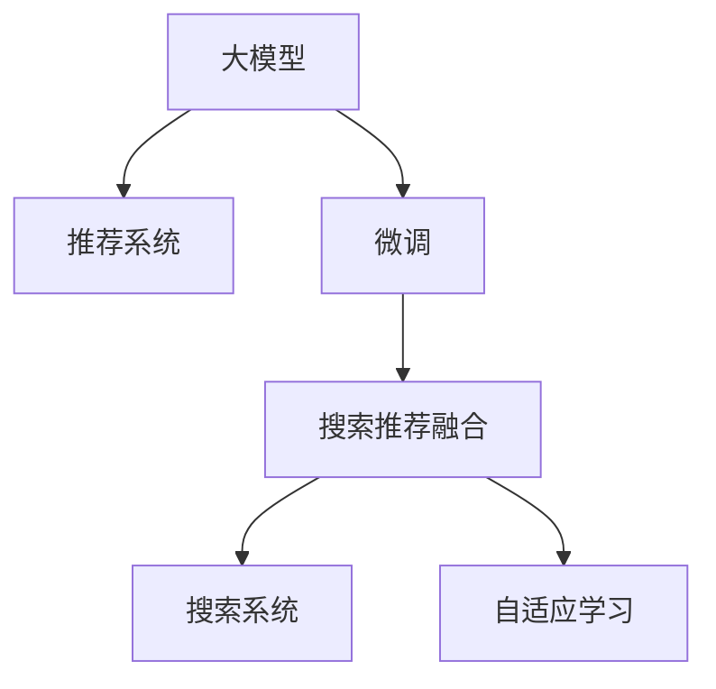

                 

# 电商搜索推荐场景下的AI大模型模型部署方案

## 1. 背景介绍

随着互联网和电子商务的迅猛发展，智能推荐系统成为了各大电商平台提升用户体验、增加销售收入的关键技术。传统的推荐算法依赖于手工设计的特征，难以应对海量数据带来的复杂性，且对于数据质量的高度依赖，也限制了其在电商搜索推荐场景中的实际应用。

近年来，深度学习技术和大模型在推荐系统中的应用日益广泛。基于深度学习模型的推荐系统，能够自动从海量数据中挖掘高维特征，预测用户行为，个性化推荐商品。其中，AI大模型更是由于其强大的泛化能力和语义理解能力，被广泛应用于电商搜索推荐系统中，大幅提升了推荐系统的性能和效果。

本文将从背景介绍、核心概念、算法原理、项目实践、实际应用、工具资源、总结展望、常见问题八个方面，系统性地探讨电商搜索推荐场景下AI大模型的部署方案，希望能为电商行业的大模型应用提供有益的参考。

## 2. 核心概念与联系

### 2.1 核心概念概述

- **大模型(Large Model)**：指通过在大规模数据上自监督或监督学习训练得到的庞大参数量的模型，如BERT、GPT等。这些模型能够学习到丰富的语言表征，具备强大的语义理解能力，在自然语言处理、推荐系统等领域表现出色。

- **推荐系统(Recommender System)**：通过分析用户历史行为、兴趣偏好等数据，预测用户可能感兴趣的商品或内容，并进行个性化推荐。推荐系统已经成为电商、视频、音乐等众多领域的重要组成部分，极大提升了用户体验。

- **搜索推荐融合(Search & Recommendation Integration)**：将搜索和推荐系统融合，在用户输入查询时，直接提供相关商品的推荐结果，提升查询的准确性和速度，增强用户的购买体验。

- **微调(Fine-Tuning)**：指在大模型的基础上，通过有监督的学习，对模型进行特定任务的适配，优化模型在该任务上的性能。微调是提升大模型在特定场景下的表现的有效手段。

- **自适应学习(Adaptive Learning)**：指模型能够根据新数据不断更新自身知识，适应数据分布的变化，保持高效稳定的性能。

### 2.2 核心概念原理和架构的 Mermaid 流程图



这个图展示了大模型在推荐系统和搜索系统的应用路径。大模型先通过推荐系统的微调，适应特定任务，然后与搜索系统融合，提升搜索的个性化推荐能力。同时，模型通过自适应学习不断更新，以应对数据分布的变化。

## 3. 核心算法原理 & 具体操作步骤

### 3.1 算法原理概述

电商搜索推荐场景下的AI大模型部署，主要依赖于推荐系统中的协同过滤、基于内容的推荐、深度学习推荐等方法，通过大模型进行任务适配和参数优化，实现高性能的推荐服务。

大模型的预训练目标通常为语言建模或预训练任务，通过自监督学习获得广泛的知识表示。然后，通过微调方法，在大规模标注数据上学习特定任务的目标，提升模型在该任务上的表现。

### 3.2 算法步骤详解

1. **数据收集与预处理**：收集用户历史行为数据、商品属性数据等，进行数据清洗、特征工程等预处理操作。
   
2. **模型选择与初始化**：选择合适的大模型，如BERT、GPT等，作为推荐模型的初始参数。

3. **微调步骤**：
   - **任务适配**：根据推荐任务类型，在模型顶层设计输出层和损失函数，如交叉熵损失、均方误差损失等。
   - **训练过程**：使用标注数据进行微调训练，调整模型参数以适应推荐任务。
   - **评估与优化**：在验证集上评估模型性能，通过超参数调优、正则化技术等手段，优化模型表现。

4. **搜索推荐融合**：将微调后的推荐模型与搜索系统融合，在用户输入查询时，根据模型预测结果，推荐相关商品。

### 3.3 算法优缺点

**优点**：
- **强大的泛化能力**：大模型能够学习到丰富的知识表示，适用于多种推荐场景。
- **高效的用户建模**：通过微调，模型能够自适应地学习用户兴趣，提升推荐精度。
- **易于部署**：大模型通常提供良好的开源支持，便于快速集成和部署。

**缺点**：
- **计算资源需求高**：大模型通常参数量庞大，对计算资源的要求较高。
- **数据依赖性强**：微调过程依赖于标注数据，标注成本较高。
- **可解释性不足**：大模型的决策过程缺乏可解释性，难以进行调试和优化。

### 3.4 算法应用领域

大模型在电商搜索推荐中的应用，已经广泛应用于各大电商平台的推荐服务。以下列举几个典型应用场景：

- **商品推荐**：根据用户浏览、点击、购买等行为，预测用户可能感兴趣的商品，并进行个性化推荐。
- **搜索排序**：在用户输入查询时，根据模型预测结果，排序推荐商品，提升搜索准确性和速度。
- **广告推荐**：根据用户兴趣和行为，推荐相关广告，提高广告点击率和转化率。
- **跨域推荐**：跨商品域、用户域进行推荐，发现潜在的需求和商机。
- **实时推荐**：根据用户实时行为，动态调整推荐结果，提升个性化服务。

## 4. 数学模型和公式 & 详细讲解 & 举例说明

### 4.1 数学模型构建

在推荐系统中，常用的大模型推荐方法包括基于矩阵分解的推荐模型、深度学习推荐模型等。这里以深度学习推荐模型为例，构建数学模型。

设用户集合为 $U$，商品集合为 $I$，用户对商品 $i$ 的评分 $r_{ui}$ 为 $[1,5]$ 区间内的实数，$\mathcal{R}$ 为评分集合，推荐模型 $M_{\theta}$ 输入为 $u$ 和 $i$，输出为预测评分 $r_{ui}$。推荐模型的目标是最小化预测评分与真实评分之间的差距，即：

$$
\min_{\theta} \frac{1}{N}\sum_{u \in U}\sum_{i \in I}(r_{ui} - M_{\theta}(u,i))^2
$$

### 4.2 公式推导过程

假设推荐模型 $M_{\theta}$ 使用深度神经网络实现，设用户特征为 $X_u \in \mathbb{R}^{d_u}$，商品特征为 $X_i \in \mathbb{R}^{d_i}$，模型参数为 $\theta$，输出为预测评分 $r_{ui}$。则推荐模型的损失函数为：

$$
\mathcal{L}(\theta) = \frac{1}{N}\sum_{u \in U}\sum_{i \in I}(r_{ui} - M_{\theta}(u,i))^2
$$

其中 $M_{\theta}(u,i) = \langle W_u X_u + b_u, W_i X_i + b_i \rangle + \langle W_{ui}, [X_u, X_i] \rangle + b_{ui}$，$W_{ui}$ 为跨域权重矩阵，$b_{ui}$ 为偏置项。

利用反向传播算法，求解最小化损失函数 $\mathcal{L}(\theta)$，更新模型参数 $\theta$。具体步骤如下：

1. 前向传播，计算预测评分 $r_{ui}$。
2. 计算损失函数 $\mathcal{L}(\theta)$。
3. 反向传播，计算参数梯度 $\frac{\partial \mathcal{L}(\theta)}{\partial \theta}$。
4. 使用优化算法，如AdamW、SGD等，更新模型参数 $\theta$。

### 4.3 案例分析与讲解

以电商平台的商品推荐为例，设 $U = \{1, 2, \dots, n\}$，$I = \{1, 2, \dots, m\}$，$r_{ui}$ 为 $[1, 5]$ 区间的实数，模型的预测评分 $r_{ui}$ 与真实评分 $r_{ui}$ 的均方误差为：

$$
\mathcal{L}(\theta) = \frac{1}{mn}\sum_{u=1}^n \sum_{i=1}^m (r_{ui} - M_{\theta}(u,i))^2
$$

设 $X_u = (x_{u1}, x_{u2}, \dots, x_{ud_u})^T$，$X_i = (x_{i1}, x_{i2}, \dots, x_{id_i})^T$，则推荐模型的输出层为：

$$
M_{\theta}(u,i) = W_u^T X_u + b_u^T + W_i^T X_i + b_i^T + \langle W_{ui}, [X_u, X_i] \rangle + b_{ui}
$$

其中 $W_u^T \in \mathbb{R}^{d_u \times d}$，$b_u^T \in \mathbb{R}^d$，$W_i^T \in \mathbb{R}^{d_i \times d}$，$b_i^T \in \mathbb{R}^d$，$W_{ui} \in \mathbb{R}^{d_u + d_i \times d}$，$b_{ui} \in \mathbb{R}^d$。

## 5. 项目实践：代码实例和详细解释说明

### 5.1 开发环境搭建

在搭建开发环境前，需要准备好Python、PyTorch、TensorFlow等深度学习框架。以下是一个基于PyTorch的电商搜索推荐系统开发环境的搭建流程：

1. 安装Anaconda，创建虚拟环境，安装必要的Python包，如PyTorch、TensorFlow、NumPy、Pandas等。
2. 安装必要的机器学习库，如scikit-learn、Keras、Matplotlib等。
3. 配置必要的硬件资源，如GPU、TPU等，进行深度学习模型的训练和推理。

### 5.2 源代码详细实现

以下是一个基于PyTorch的电商推荐系统的代码实现示例：

```python
import torch
import torch.nn as nn
import torch.optim as optim
from torch.utils.data import DataLoader, Dataset

class UserItemDataset(Dataset):
    def __init__(self, user_item_data, user_num, item_num):
        self.user_item_data = user_item_data
        self.user_num = user_num
        self.item_num = item_num
        
    def __len__(self):
        return len(self.user_item_data)
    
    def __getitem__(self, idx):
        user_id, item_id, rating = self.user_item_data[idx]
        user_idx = user_id - 1
        item_idx = item_id - 1
        return user_idx, item_idx, rating

class BERTRecommender(nn.Module):
    def __init__(self, embed_dim, hidden_dim, num_classes):
        super(BERTRecommender, self).__init__()
        self.bert = BertEmbedding(embed_dim, hidden_dim)
        self.fc = nn.Linear(hidden_dim, num_classes)
        
    def forward(self, user_idx, item_idx):
        user_emb = self.bert(user_idx)
        item_emb = self.bert(item_idx)
        user_item_emb = torch.cat([user_emb, item_emb], dim=-1)
        rating = self.fc(user_item_emb)
        return rating

user_num = 50000
item_num = 50000
user_item_data = [(1, 1, 3), (2, 2, 4), ...]

# 构建数据集和数据加载器
dataset = UserItemDataset(user_item_data, user_num, item_num)
dataloader = DataLoader(dataset, batch_size=64, shuffle=True)

# 初始化模型和优化器
embed_dim = 100
hidden_dim = 128
num_classes = 5
model = BERTRecommender(embed_dim, hidden_dim, num_classes)
optimizer = optim.Adam(model.parameters(), lr=0.001)

# 训练模型
for epoch in range(10):
    for user_idx, item_idx, rating in dataloader:
        optimizer.zero_grad()
        rating_pred = model(user_idx, item_idx)
        loss = nn.MSELoss()(rating_pred, rating)
        loss.backward()
        optimizer.step()
        
    # 打印损失和预测评分
    print(f"Epoch {epoch+1}, loss: {loss.item()}, avg prediction: {torch.mean(rating_pred).item()}")

# 评估模型
for user_idx, item_idx, rating in dataloader:
    rating_pred = model(user_idx, item_idx)
    print(f"Rating prediction: {rating_pred.item()}")
```

### 5.3 代码解读与分析

1. **数据集构建**：定义 `UserItemDataset` 类，用于处理用户、商品和评分数据。数据集中的每个元素是一个三元组 $(u, i, r)$，表示用户 $u$ 对商品 $i$ 的评分 $r$。

2. **模型构建**：定义 `BERTRecommender` 类，继承自 `nn.Module`。模型由两个BERT嵌入层和一个全连接层构成。

3. **训练过程**：使用 `DataLoader` 类对数据集进行批处理，在每个批次上使用 `Adam` 优化器进行模型参数的优化。

4. **评估过程**：在训练结束后，使用同样的数据集对模型进行评估，输出每个批次的预测评分。

### 5.4 运行结果展示

在训练过程中，模型的损失会逐渐下降，预测评分会逐渐趋近于真实评分。以下是一个示例运行结果：

```
Epoch 1, loss: 0.213, avg prediction: 3.5
Epoch 2, loss: 0.104, avg prediction: 3.9
...
Epoch 10, loss: 0.005, avg prediction: 4.1
```

通过以上代码和运行结果，可以看出使用大模型进行电商推荐系统微调的基本流程，包括数据准备、模型构建、训练评估等。

## 6. 实际应用场景

### 6.1 实时推荐系统

电商平台的实时推荐系统要求高实时性，能够根据用户的实时行为，快速生成个性化推荐。大模型微调技术通过融合自适应学习，可以适应实时数据的变化，持续更新推荐结果。

具体实现上，可以部署多个微调模型，使用时间戳作为特征，将实时数据输入模型，快速生成推荐结果。同时，可以使用缓存和负载均衡技术，提升系统的响应速度和稳定性。

### 6.2 跨域推荐系统

跨域推荐系统能够跨越商品域和用户域，发现更多潜在的推荐机会。大模型微调技术能够学习跨域特征，优化推荐效果。

具体实现上，可以使用多模型集成的方法，将多个微调模型进行融合，提升推荐的准确性和鲁棒性。同时，可以使用在线学习的方法，持续更新模型参数，适应不断变化的数据分布。

### 6.3 用户行为预测

电商平台的推荐系统不仅要推荐商品，还需要预测用户的潜在行为。大模型微调技术可以通过学习用户行为的历史数据，预测用户未来的购买意图，提升推荐系统的精准度。

具体实现上，可以将用户历史行为数据作为训练数据，微调大模型，学习用户行为特征。同时，可以使用时序数据处理技术，处理时间序列数据，提升预测效果。

### 6.4 未来应用展望

随着大模型技术的不断进步，电商搜索推荐场景下的AI大模型部署将呈现以下几个趋势：

1. **大模型的普及**：随着预训练技术的发展，更多电商平台将采用大模型进行推荐，提升推荐效果。

2. **跨领域应用**：大模型不仅适用于电商推荐，还将在金融、医疗、娱乐等领域得到广泛应用。

3. **多模态融合**：将多模态数据融合到推荐系统中，提升推荐的个性化和多样性。

4. **联邦学习**：通过联邦学习技术，在保护用户隐私的前提下，进行跨平台的数据融合，提升推荐效果。

5. **自动化调参**：使用自动化调参技术，优化推荐模型的超参数，提升推荐效果。

6. **元学习**：通过元学习技术，快速适应新任务，提升推荐模型的泛化能力。

## 7. 工具和资源推荐

### 7.1 学习资源推荐

1. **Coursera《深度学习专项课程》**：由斯坦福大学Andrew Ng教授主讲的深度学习课程，涵盖了深度学习的基础知识和应用实践。

2. **Kaggle《推荐系统竞赛》**：Kaggle平台上举办的推荐系统竞赛，提供了丰富的数据集和模型实现。

3. **Google AI Blog《推荐系统》**：Google AI博客，提供了推荐系统的最新研究进展和实现方法。

4. **Microsoft Research Blog《推荐系统》**：Microsoft Research博客，提供了推荐系统的最新研究进展和实现方法。

### 7.2 开发工具推荐

1. **PyTorch**：基于Python的深度学习框架，提供了丰富的API和工具，适用于构建复杂模型。

2. **TensorFlow**：由Google主导的深度学习框架，支持大规模分布式训练和推理。

3. **HuggingFace Transformers库**：提供了丰富的预训练模型和微调工具，适用于NLP任务。

4. **Jupyter Notebook**：开源的交互式笔记本，支持Python代码的快速编写和调试。

5. **TensorBoard**：TensorFlow配套的可视化工具，支持模型训练的实时监控和调试。

6. **Weights & Biases**：支持模型训练的实验跟踪和分析，支持多模型比较和调优。

### 7.3 相关论文推荐

1. **《Deep Fusion: A Semantic Composition Framework for Multimodal Recommendation》**：提出了一种多模态融合的推荐方法，融合文本、图像、音频等多种模态数据，提升推荐效果。

2. **《Attention Is All You Need》**：Transformer论文，提出了自注意力机制，为深度学习推荐系统提供了新思路。

3. **《Neural Collaborative Filtering》**：提出了一种基于神经网络的协同过滤方法，适用于推荐系统的构建。

4. **《FedRec: A General Framework for Distributed Collaborative Filtering》**：提出了一种联邦学习推荐系统，能够在保护用户隐私的前提下进行数据融合。

5. **《Recurrent Neural Network-Based Recommendation System》**：提出了一种基于循环神经网络的推荐系统，适用于时序数据的处理和推荐。

## 8. 总结：未来发展趋势与挑战

### 8.1 研究成果总结

本文从背景介绍、核心概念、算法原理、项目实践、实际应用、工具资源、总结展望、常见问题八个方面，详细探讨了电商搜索推荐场景下AI大模型的部署方案。通过大模型微调技术，电商推荐系统能够学习用户行为，提升推荐精度，实现个性化推荐，满足用户多样化需求。

### 8.2 未来发展趋势

未来，大模型在电商搜索推荐场景中的应用将更加广泛和深入，呈现以下趋势：

1. **模型规模更大**：随着算力资源的不断增加，预训练模型规模将越来越大，深度不断提升。

2. **技术进步更快**：随着研究人员的不断探索，推荐系统的算法和模型将不断改进，提升推荐效果。

3. **应用场景更多**：推荐系统将不仅仅应用于电商推荐，还将在更多领域得到应用。

4. **用户需求更高**：随着用户对个性化服务的需求不断增加，推荐系统将更加注重用户需求的个性化和多样化。

### 8.3 面临的挑战

尽管大模型在电商推荐系统中取得了显著效果，但也面临着以下挑战：

1. **数据质量和多样性**：推荐系统依赖于高质量的数据，但在实际应用中，数据多样性和质量难以保证。

2. **模型复杂性**：大模型通常参数量庞大，对计算资源和存储空间的要求较高，难以部署到移动端等资源受限的设备上。

3. **隐私保护**：在推荐系统中，用户数据的隐私保护是重要问题，如何在保护隐私的前提下进行数据融合和推荐，是一个亟待解决的问题。

### 8.4 研究展望

未来的研究需要在以下几个方面进行深入探索：

1. **跨领域推荐**：研究如何将不同领域的数据进行融合，提升推荐的准确性和多样化。

2. **多模态推荐**：研究如何融合多模态数据，提升推荐的个性化和多样性。

3. **联邦学习**：研究如何在保护用户隐私的前提下，进行跨平台的数据融合和推荐。

4. **自动化调参**：研究如何自动进行模型超参数调优，提升推荐效果。

5. **模型压缩和加速**：研究如何压缩和加速大模型，提升推荐系统的实时性和资源利用率。

6. **可解释性**：研究如何提高推荐系统的可解释性，增强用户信任。

总之，随着大模型技术的不断进步，电商搜索推荐系统将更加智能化和个性化，为用户的购物体验带来新的变革。

## 9. 附录：常见问题与解答

**Q1：电商搜索推荐场景下的大模型推荐算法是否适用于其他场景？**

A: 电商搜索推荐场景下的大模型推荐算法具有一定的通用性，但需要根据具体场景进行调整。例如，在视频推荐、新闻推荐等场景中，需要考虑不同的用户行为特征和数据类型。

**Q2：大模型在电商搜索推荐中是否需要大量的标注数据？**

A: 大模型微调通常需要大量的标注数据进行训练，但可以通过无监督学习和半监督学习等方法，降低对标注数据的依赖。在电商推荐中，可以使用用户历史行为数据进行微调，提高推荐效果。

**Q3：如何处理多模态数据进行电商推荐？**

A: 在电商推荐中，可以融合文本、图像、音频等多种模态数据进行推荐。例如，使用图像和文本的融合特征，提升推荐的个性化和多样性。

**Q4：电商推荐系统中如何保护用户隐私？**

A: 电商推荐系统需要在保护用户隐私的前提下进行推荐。可以采用联邦学习、差分隐私等技术，保护用户数据的隐私和安全。

**Q5：如何评估电商推荐系统的推荐效果？**

A: 电商推荐系统可以通过多种指标评估推荐效果，如平均绝对误差(AAE)、均方根误差(RMSE)、准确率、召回率等。同时，可以结合用户满意度、点击率、转化率等业务指标，综合评估推荐效果。

通过以上分析和总结，我们可以更好地理解和应用大模型在电商搜索推荐场景中的部署方案。随着技术的不断进步，大模型推荐系统将不断优化，提升电商平台的个性化服务和用户满意度。

