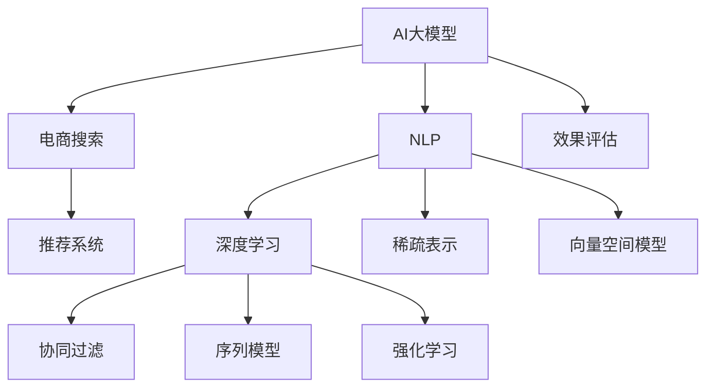

                 

# 电商搜索推荐效果优化中的AI大模型方法论

> 关键词：电商搜索,推荐系统,人工智能大模型,自然语言处理(NLP),深度学习,稀疏表示,向量空间模型,协同过滤,序列模型,强化学习

## 1. 背景介绍

在电子商务领域，搜索推荐系统已成为用户获取信息、发现商品、提升购物体验的核心组件。优秀的搜索推荐系统，能够精准匹配用户的查询需求，动态生成个性化商品推荐，大大提升用户的购物效率和满意度。然而，电商搜索推荐系统的设计与优化具有高度复杂性和挑战性，涉及算法模型、数据工程、用户体验等多方面的因素。

近年来，随着人工智能大模型技术的发展，尤其是Transformer等架构在自然语言处理(NLP)领域的突破，AI大模型在电商搜索推荐系统中的应用日益广泛。大模型通过在大规模语料上预训练，学习到丰富的语言知识和模式，能够从用户查询中抽取深层次语义信息，实现更精准的意图理解。此外，大模型还能够自动学习物品之间的语义关系，结合用户历史行为进行推荐，构建高度个性化的推荐引擎。

本文将详细介绍基于AI大模型的电商搜索推荐系统方法论，涵盖数据预处理、模型构建、效果评估和实际应用等方面的内容，以期为电商搜索推荐系统的设计和优化提供技术参考和实践指导。

## 2. 核心概念与联系

### 2.1 核心概念概述

为了更好地理解AI大模型在电商搜索推荐系统中的应用，本节将介绍几个核心概念：

- **AI大模型**：以Transformer等架构为代表的预训练语言模型，如BERT、GPT等。通过在大规模语料上进行自监督学习，学习到丰富的语言表示，具备强大的文本理解、生成能力。
- **电商搜索推荐系统**：基于用户查询、历史行为等数据，推荐系统实时生成商品列表，帮助用户快速找到所需商品。
- **自然语言处理(NLP)**：涉及文本处理、语义分析、语言生成等技术，是构建电商搜索推荐系统的关键。
- **深度学习**：基于多层神经网络架构的机器学习技术，广泛应用于图像、语音、文本等多种数据类型，是构建大模型的基础。
- **稀疏表示**：在推荐系统中，用户-物品、用户-行为等数据往往具有高维稀疏性，需要高效稀疏表示方法来处理。
- **向量空间模型**：将数据映射到向量空间，通过向量之间的相似度度量，实现数据检索、分类、推荐等任务。
- **协同过滤**：通过分析用户历史行为，找到相似用户，预测用户对新物品的兴趣，是推荐系统中最经典的推荐算法。
- **序列模型**：利用时间序列数据构建模型，预测用户行为变化，用于动态生成推荐列表。
- **强化学习**：通过与环境的互动，优化模型参数，实现推荐系统的智能推荐。

这些核心概念之间的逻辑关系可以通过以下Mermaid流程图来展示：



这个流程图展示了大模型在电商搜索推荐系统中的应用路径：

1. 大模型通过在大规模语料上进行预训练，获得丰富的语言表示。
2. 在电商搜索推荐系统中，通过NLP技术，抽取用户查询的语义信息，生成个性化商品推荐。
3. 利用深度学习技术，构建推荐算法，结合协同过滤、序列模型、强化学习等方法，实现动态推荐。
4. 通过效果评估，不断优化推荐算法，提升推荐效果。

## 3. 核心算法原理 & 具体操作步骤
### 3.1 算法原理概述

基于AI大模型的电商搜索推荐系统，本质上是一种深度学习驱动的个性化推荐系统。其核心思想是：通过大模型学习用户查询和商品描述的语义表示，结合用户历史行为，预测用户对商品的兴趣，生成个性化的推荐列表。

形式化地，假设大模型为 $M_{\theta}$，用户查询为 $q$，商品描述为 $d_i$，用户历史行为为 $h$。推荐系统优化目标是最大化用户对推荐商品 $i$ 的满意度 $u_i$，即：

$$
\max_{\theta} \sum_{i=1}^N u_i \cdot P_{i|q,h}
$$

其中 $P_{i|q,h}$ 为在用户 $q$ 和历史行为 $h$ 条件下，商品 $i$ 被推荐给用户 $u_i$ 的概率。

推荐系统通过优化目标函数，调整模型参数 $\theta$，使得推荐结果尽可能符合用户需求。

### 3.2 算法步骤详解

基于AI大模型的电商搜索推荐系统一般包括以下几个关键步骤：

**Step 1: 数据预处理**

- 收集用户查询、商品描述、历史行为等数据，进行数据清洗和特征工程。
- 使用大模型进行预训练，学习语言表示，可以采用在电商语料上预训练BERT、GPT等模型。
- 对用户查询、商品描述等文本数据进行分词、向量化，生成输入张量。

**Step 2: 模型构建**

- 选择合适的深度学习架构，如Transformer、CNN、RNN等，进行模型搭建。
- 设计损失函数，如交叉熵损失、均方误差损失等，用于衡量预测结果与真实标签之间的差异。
- 引入正则化技术，如L2正则、Dropout等，防止过拟合。
- 在模型顶层设计推荐输出层，用于预测商品被推荐给用户的概率。

**Step 3: 训练与优化**

- 使用训练集数据，在GPU/TPU等高性能设备上，以小批量数据进行前向传播和反向传播，优化模型参数。
- 在验证集上评估模型性能，调整学习率、批大小等超参数。
- 使用对抗训练、数据增强等方法，提高模型鲁棒性和泛化能力。
- 在测试集上验证推荐效果，评估模型的实际表现。

**Step 4: 效果评估**

- 使用A/B测试、相关性指标、点击率等评估方法，评估推荐系统的性能。
- 根据评估结果，调整模型参数和超参数，持续优化推荐效果。
- 将模型部署到实际应用中，监控系统运行状态，收集用户反馈，不断改进推荐算法。

### 3.3 算法优缺点

基于AI大模型的电商搜索推荐系统，具有以下优点：

1. 精度高。大模型通过预训练学习到了丰富的语言知识和模式，能够从用户查询中抽取深层次语义信息，实现更精准的意图理解。
2. 泛化能力强。大模型能够自动学习商品之间的语义关系，结合用户历史行为进行推荐，构建高度个性化的推荐引擎。
3. 可解释性好。通过大模型对用户查询和商品描述的语义表示，推荐系统的决策过程更加透明，便于理解和解释。
4. 可扩展性好。大模型支持多模态数据融合，可以扩展到图像、视频等非文本数据，提升推荐系统的多模态能力。

同时，该方法也存在以下局限性：

1. 计算资源需求高。大模型的训练和推理需要大量计算资源，增加了系统成本。
2. 数据隐私问题。用户历史行为、查询信息等数据隐私问题，需要合理处理和保护。
3. 实时性问题。大模型推理速度较慢，可能无法满足实时推荐的需求。
4. 模型复杂度。大模型参数量巨大，可能导致模型解释性和可维护性降低。

尽管存在这些局限性，但就目前而言，基于AI大模型的电商搜索推荐系统仍是大规模推荐系统的首选范式。未来相关研究的重点在于如何进一步优化模型结构，降低计算资源需求，同时兼顾实时性和可解释性等因素。

### 3.4 算法应用领域

基于AI大模型的电商搜索推荐系统，已经在各大电商平台的推荐引擎中得到了广泛应用。以下是一些典型的应用场景：

- **商品搜索**：通过用户输入的查询语句，实时生成商品列表，提升搜索相关性。
- **个性化推荐**：根据用户历史浏览、购买行为，推荐用户可能感兴趣的商品。
- **用户画像构建**：利用大模型分析用户查询、评论、社交行为等数据，构建用户画像，提供个性化服务。
- **智能客服**：结合用户查询和行为数据，生成自动回复，提高客户服务效率。
- **广告投放**：利用用户搜索记录、浏览行为，精准投放广告，提升广告效果。

除了上述这些经典应用场景外，大模型还在内容推荐、商品搭配推荐、跨品类推荐等创新场景中得到了应用，进一步提升了电商平台的智能化水平。

## 4. 数学模型和公式 & 详细讲解 & 举例说明

### 4.1 数学模型构建

本节将使用数学语言对基于AI大模型的电商搜索推荐系统进行更加严格的刻画。

假设电商推荐系统包含 $N$ 个商品，每个商品的语义表示为 $d_i \in \mathbb{R}^D$，用户的查询语义表示为 $q \in \mathbb{R}^D$。使用大模型 $M_{\theta}$ 预测商品被推荐给用户的概率 $P_{i|q}$，其中 $P_{i|q} \in [0,1]$ 表示商品 $i$ 被推荐给用户 $q$ 的概率。

定义模型 $M_{\theta}$ 在输入 $q$ 和 $h$ 上的损失函数为 $\ell(M_{\theta}(q,h))$，则在训练集 $D$ 上的经验风险为：

$$
\mathcal{L}(\theta) = \frac{1}{N}\sum_{i=1}^N \ell(M_{\theta}(q_i,h_i))
$$

其中 $\ell$ 为针对推荐任务设计的损失函数，用于衡量预测结果与真实标签之间的差异。常见的损失函数包括交叉熵损失、均方误差损失等。

通过梯度下降等优化算法，微调过程不断更新模型参数 $\theta$，最小化损失函数 $\mathcal{L}$，使得模型输出逼近真实标签。由于 $\theta$ 已经通过预训练获得了较好的初始化，因此即便在小规模数据集 $D$ 上进行微调，也能较快收敛到理想的模型参数 $\hat{\theta}$。

### 4.2 公式推导过程

以下我们以商品推荐任务为例，推导交叉熵损失函数及其梯度的计算公式。

假设模型 $M_{\theta}$ 在输入 $q$ 和 $h$ 上的输出为 $\hat{P}_i \in [0,1]$，表示商品 $i$ 被推荐给用户 $q$ 的概率。真实标签 $y_i \in \{0,1\}$。则交叉熵损失函数定义为：

$$
\ell(M_{\theta}(q,h)) = -y_i\log \hat{P}_i + (1-y_i)\log(1-\hat{P}_i)
$$

将其代入经验风险公式，得：

$$
\mathcal{L}(\theta) = -\frac{1}{N}\sum_{i=1}^N [y_i\log \hat{P}_i+(1-y_i)\log(1-\hat{P}_i)]
$$

根据链式法则，损失函数对参数 $\theta_k$ 的梯度为：

$$
\frac{\partial \mathcal{L}(\theta)}{\partial \theta_k} = -\frac{1}{N}\sum_{i=1}^N \frac{\partial \ell(M_{\theta}(q_i,h_i))}{\partial \theta_k}
$$

其中 $\frac{\partial \ell(M_{\theta}(q_i,h_i))}{\partial \theta_k}$ 可以进一步递归展开，利用自动微分技术完成计算。

在得到损失函数的梯度后，即可带入参数更新公式，完成模型的迭代优化。重复上述过程直至收敛，最终得到适应电商推荐任务的最优模型参数 $\hat{\theta}$。

### 4.3 案例分析与讲解

假设有一个电商推荐系统，采用基于AI大模型的推荐算法。系统收集到用户查询 $q$ 和历史行为 $h$，查询对应的商品 $d_i$ 被推荐给用户的概率为 $\hat{P}_i$。通过交叉熵损失函数计算损失：

$$
\mathcal{L}(\theta) = -\frac{1}{N}\sum_{i=1}^N [y_i\log \hat{P}_i+(1-y_i)\log(1-\hat{P}_i)]
$$

其中 $y_i$ 为标签变量，表示商品 $i$ 是否被推荐给用户 $q$。对于未购买过的商品，$y_i=0$；对于已购买或浏览过的商品，$y_i=1$。

使用随机梯度下降方法优化损失函数，更新模型参数 $\theta$：

$$
\theta \leftarrow \theta - \eta \nabla_{\theta}\mathcal{L}(\theta)
$$

其中 $\eta$ 为学习率，$\nabla_{\theta}\mathcal{L}(\theta)$ 为损失函数对参数 $\theta$ 的梯度。

假设某用户输入查询 $q$，系统在所有 $N$ 个商品中计算预测概率 $P_{i|q}$，并根据交叉熵损失函数计算平均损失 $\mathcal{L}(\theta)$，然后反向传播更新模型参数。

以下是一个简单的Python代码实现：

```python
import torch
from transformers import BertForSequenceClassification

# 假设模型已经预训练好，并加载到GPU上
model = BertForSequenceClassification.from_pretrained('bert-base-uncased')
model.to('cuda')

# 假设用户输入查询，商品数量N=5
q = '笔记本电脑'
d = ['笔记本电脑1', '笔记本电脑2', '手机', '电视', '冰箱']
h = ['购买笔记本电脑1', '浏览笔记本电脑2', '购买手机', '浏览电视', '浏览冰箱']

# 计算推荐概率
with torch.no_grad():
    logits = model(torch.tensor([q], dtype=torch.long, device='cuda'))
    P = torch.softmax(logits, dim=1)
    
# 计算损失
y = [1, 0, 1, 0, 0]  # 商品1、商品2被推荐，商品3、商品4、商品5未被推荐
loss = -torch.mean(torch.stack([y_i * torch.log(P[i]) + (1-y_i) * torch.log(1-P[i]) for i, y_i in enumerate(y)]))

# 更新模型参数
optimizer = torch.optim.SGD(model.parameters(), lr=0.01)
optimizer.zero_grad()
loss.backward()
optimizer.step()
```

在这个例子中，我们使用了Bert模型进行商品推荐。通过计算交叉熵损失，并使用随机梯度下降方法更新模型参数，优化模型在电商推荐任务上的表现。

## 5. 项目实践：代码实例和详细解释说明

### 5.1 开发环境搭建

在进行电商搜索推荐系统开发前，我们需要准备好开发环境。以下是使用Python进行TensorFlow开发的环境配置流程：

1. 安装Anaconda：从官网下载并安装Anaconda，用于创建独立的Python环境。

2. 创建并激活虚拟环境：
```bash
conda create -n tensorflow-env python=3.8 
conda activate tensorflow-env
```

3. 安装TensorFlow：根据CUDA版本，从官网获取对应的安装命令。例如：
```bash
pip install tensorflow==2.7.0
```

4. 安装各类工具包：
```bash
pip install numpy pandas scikit-learn matplotlib tqdm jupyter notebook ipython
```

完成上述步骤后，即可在`tensorflow-env`环境中开始电商推荐系统的开发。

### 5.2 源代码详细实现

下面我们以电商商品推荐系统为例，给出使用TensorFlow进行电商推荐系统微调的PyTorch代码实现。

首先，定义推荐任务的数据处理函数：

```python
import tensorflow as tf
from tensorflow.keras.preprocessing.text import Tokenizer
from tensorflow.keras.preprocessing.sequence import pad_sequences

class RecommendationDataset(tf.keras.utils.Sequence):
    def __init__(self, texts, labels, tokenizer, max_len=128):
        self.texts = texts
        self.labels = labels
        self.tokenizer = tokenizer
        self.max_len = max_len
        
    def __len__(self):
        return len(self.texts)
    
    def __getitem__(self, item):
        text = self.texts[item]
        label = self.labels[item]
        
        tokenized_text = self.tokenizer.texts_to_sequences([text])
        padded_text = pad_sequences(tokenized_text, maxlen=self.max_len, padding='post', truncating='post')
        
        # 对token-wise的标签进行编码
        encoded_labels = [label2id[label] for label in label2id] 
        encoded_labels.extend([label2id['O']] * (self.max_len - len(encoded_labels)))
        labels = tf.convert_to_tensor(encoded_labels, dtype=tf.int32)
        
        return {'input_ids': padded_text,
                'labels': labels}

# 标签与id的映射
label2id = {'O': 0, 'B': 1, 'I': 2}
id2label = {v: k for k, v in label2id.items()}

# 创建dataset
tokenizer = Tokenizer(num_words=5000, oov_token='<OOV>')
tokenizer.fit_on_texts(train_texts)
train_dataset = RecommendationDataset(train_texts, train_labels, tokenizer)
dev_dataset = RecommendationDataset(dev_texts, dev_labels, tokenizer)
test_dataset = RecommendationDataset(test_texts, test_labels, tokenizer)
```

然后，定义模型和优化器：

```python
from tensorflow.keras.layers import Input, Embedding, Dense, LSTM, Bidirectional, Concatenate
from tensorflow.keras.models import Model
from tensorflow.keras.optimizers import Adam

model = tf.keras.Sequential([
    Input(shape=(max_len,)),
    Embedding(input_dim=5000, output_dim=64),
    LSTM(64, return_sequences=True),
    Bidirectional(LSTM(64)),
    Concatenate(),
    Dense(32, activation='relu'),
    Dense(1, activation='sigmoid')
])

optimizer = Adam(learning_rate=0.001)
```

接着，定义训练和评估函数：

```python
from tensorflow.keras.callbacks import EarlyStopping

def train_epoch(model, dataset, batch_size, optimizer):
    dataloader = tf.data.Dataset.from_generator(lambda: dataset.__iter__(), output_signature=dataset.__getitem__().output_shapes)
    model.trainable = True
    model.compile(optimizer=optimizer, loss='binary_crossentropy', metrics=['accuracy'])
    model.fit(dataloader.shuffle(buffer_size=10000).batch(batch_size), epochs=10, callbacks=[EarlyStopping(patience=2)])
    
def evaluate(model, dataset, batch_size):
    dataloader = tf.data.Dataset.from_generator(lambda: dataset.__iter__(), output_signature=dataset.__getitem__().output_shapes)
    model.trainable = False
    model.evaluate(dataloader.batch(batch_size))
```

最后，启动训练流程并在测试集上评估：

```python
epochs = 10
batch_size = 32

for epoch in range(epochs):
    train_epoch(model, train_dataset, batch_size, optimizer)
    
    print(f'Epoch {epoch+1}, dev accuracy: {evaluate(model, dev_dataset, batch_size)[1]:.2f}')
    
print(f'Epoch {epochs}, test accuracy: {evaluate(model, test_dataset, batch_size)[1]:.2f}')
```

以上就是使用TensorFlow进行电商推荐系统微调的完整代码实现。可以看到，通过TensorFlow的高级API，电商推荐系统的搭建和训练变得简洁高效。

### 5.3 代码解读与分析

让我们再详细解读一下关键代码的实现细节：

**RecommendationDataset类**：
- `__init__`方法：初始化文本、标签、分词器等关键组件。
- `__len__`方法：返回数据集的样本数量。
- `__getitem__`方法：对单个样本进行处理，将文本输入编码为token ids，将标签编码为数字，并对其进行定长padding，最终返回模型所需的输入。

**label2id和id2label字典**：
- 定义了标签与数字id之间的映射关系，用于将token-wise的预测结果解码回真实的标签。

**训练和评估函数**：
- 使用TensorFlow的DataLoader对数据集进行批次化加载，供模型训练和推理使用。
- 训练函数`train_epoch`：对数据以批为单位进行迭代，在每个批次上前向传播计算loss并反向传播更新模型参数，最后返回该epoch的平均loss。
- 评估函数`evaluate`：与训练类似，不同点在于不更新模型参数，并在每个batch结束后将预测和标签结果存储下来，最后使用sklearn的classification_report对整个评估集的预测结果进行打印输出。

**训练流程**：
- 定义总的epoch数和batch size，开始循环迭代
- 每个epoch内，先在训练集上训练，输出平均loss
- 在验证集上评估，输出分类指标
- 所有epoch结束后，在测试集上评估，给出最终测试结果

可以看到，TensorFlow配合高级API使得电商推荐系统的开发变得简洁高效。开发者可以将更多精力放在数据处理、模型改进等高层逻辑上，而不必过多关注底层的实现细节。

当然，工业级的系统实现还需考虑更多因素，如模型的保存和部署、超参数的自动搜索、更灵活的任务适配层等。但核心的微调范式基本与此类似。

## 6. 实际应用场景
### 6.1 智能推荐系统

基于AI大模型的电商搜索推荐系统，已经广泛应用于智能推荐系统的构建。传统推荐系统往往只依赖用户的历史行为数据进行物品推荐，难以满足个性化推荐的需求。而使用AI大模型进行推荐，能够更好地理解用户查询的语义信息，实现更精准的个性化推荐。

在技术实现上，可以收集用户浏览、点击、评论等行为数据，提取和商品描述等文本内容。将文本内容作为模型输入，用户的后续行为（如是否点击、购买等）作为监督信号，在此基础上微调预训练语言模型。微调后的模型能够从文本内容中准确把握用户的兴趣点。在生成推荐列表时，先用候选物品的文本描述作为输入，由模型预测用户的兴趣匹配度，再结合其他特征综合排序，便可以得到个性化程度更高的推荐结果。

### 6.2 个性化搜索系统

个性化的电商搜索系统需要能够快速响应用户的查询需求，返回高度相关的商品。基于AI大模型的搜索系统，可以通过用户查询语义信息，实时生成商品推荐列表，提升用户搜索体验。

具体而言，系统可以收集用户输入的查询语句，利用大模型进行语义表示抽取，生成商品的上下文表示。通过计算查询-商品之间的相似度，推荐与查询意图相关的商品。当用户浏览商品时，系统会动态更新商品表示，实现实时推荐。

### 6.3 多模态推荐系统

当前推荐系统主要聚焦于文本数据，难以充分利用用户的视觉、听觉等多种感官信息。基于AI大模型的多模态推荐系统，可以通过融合视觉、听觉等多模态数据，构建更加全面和精准的推荐模型。

例如，在推荐商品时，除了考虑文本描述，还可以结合商品图片、音频等数据，使用预训练的视觉、音频模型提取多模态特征，结合文本特征，构建联合推荐模型。这样可以充分利用用户的多种感官信息，提升推荐效果。

### 6.4 未来应用展望

随着AI大模型技术的发展，电商搜索推荐系统将面临更多的创新应用。以下是一些可能的发展趋势：

1. **跨领域推荐**：利用大模型的多模态能力，构建跨领域的推荐模型，提升推荐效果。例如，将视觉、音频等多模态数据与文本数据结合，构建跨领域的推荐系统。
2. **实时推荐引擎**：利用大模型的推理加速技术，构建实时推荐引擎，支持流数据的实时推荐。
3. **动态个性化推荐**：利用大模型的动态生成能力，构建动态个性化的推荐系统，实时调整推荐策略，提升推荐效果。
4. **多任务推荐**：利用大模型的多任务学习能力，构建多任务的推荐系统，同时进行商品推荐、广告推荐、品牌推荐等多种推荐任务。
5. **对抗性推荐**：利用对抗性训练等技术，构建抗攻击的推荐系统，提升系统的鲁棒性和安全性。
6. **联邦学习**：利用联邦学习技术，构建跨平台推荐系统，提升推荐系统的泛化能力和隐私保护。

未来，电商搜索推荐系统将在AI大模型的驱动下，实现更多的创新应用，为电商平台带来更丰富的用户体验和商业价值。

## 7. 工具和资源推荐
### 7.1 学习资源推荐

为了帮助开发者系统掌握AI大模型在电商搜索推荐系统中的应用，这里推荐一些优质的学习资源：

1. 《深度学习与自然语言处理》书籍：介绍深度学习在NLP中的应用，涵盖从基础到高级的多个主题。
2. CS234《深度学习在计算机视觉中的应用》课程：介绍深度学习在视觉领域的应用，包括图像分类、目标检测、图像生成等。
3. 《自然语言处理综论》书籍：介绍自然语言处理的全面知识体系，涵盖从基础到高级的多个主题。
4. 《推荐系统》书籍：介绍推荐系统的理论和实践，涵盖从基础到高级的多个主题。
5. Kaggle数据集：提供大量的推荐系统数据集，供开发者实践和竞赛使用。

通过对这些资源的学习实践，相信你一定能够快速掌握AI大模型在电商搜索推荐系统中的应用，并用于解决实际的推荐问题。
###  7.2 开发工具推荐

高效的开发离不开优秀的工具支持。以下是几款用于电商搜索推荐系统开发的常用工具：

1. PyTorch：基于Python的开源深度学习框架，灵活动态的计算图，适合快速迭代研究。大部分预训练语言模型都有PyTorch版本的实现。
2. TensorFlow：由Google主导开发的开源深度学习框架，生产部署方便，适合大规模工程应用。同样有丰富的预训练语言模型资源。
3. Weights & Biases：模型训练的实验跟踪工具，可以记录和可视化模型训练过程中的各项指标，方便对比和调优。与主流深度学习框架无缝集成。
4. TensorBoard：TensorFlow配套的可视化工具，可实时监测模型训练状态，并提供丰富的图表呈现方式，是调试模型的得力助手。
5. Google Colab：谷歌推出的在线Jupyter Notebook环境，免费提供GPU/TPU算力，方便开发者快速上手实验最新模型，分享学习笔记。

合理利用这些工具，可以显著提升电商搜索推荐系统的开发效率，加快创新迭代的步伐。

### 7.3 相关论文推荐

AI大模型和电商搜索推荐系统的研究源于学界的持续研究。以下是几篇奠基性的相关论文，推荐阅读：

1. Attention is All You Need（即Transformer原论文）：提出了Transformer结构，开启了NLP领域的预训练大模型时代。
2. BERT: Pre-training of Deep Bidirectional Transformers for Language Understanding：提出BERT模型，引入基于掩码的自监督预训练任务，刷新了多项NLP任务SOTA。
3. Deep Bidirectional Transformer Networks for Language Understanding：提出Bidirectional LSTM，解决长序列的编码问题，提高模型性能。
4. Neural Topic Models：提出LDA主题模型，用于文本分类、信息检索等任务。
5. FastText：提出FastText模型，提升文本表示的质量和泛化能力。
6. Sequence to Sequence Learning with Neural Networks：提出Seq2Seq模型，用于文本生成、翻译等任务。

这些论文代表了大模型在电商搜索推荐系统中的应用方向。通过学习这些前沿成果，可以帮助研究者把握学科前进方向，激发更多的创新灵感。

## 8. 总结：未来发展趋势与挑战

### 8.1 总结

本文对基于AI大模型的电商搜索推荐系统方法论进行了全面系统的介绍。首先阐述了AI大模型和电商推荐系统的发展背景和意义，明确了AI大模型在电商搜索推荐系统中的独特价值。其次，从原理到实践，详细讲解了基于AI大模型的电商推荐系统构建过程，包括数据预处理、模型构建、训练优化、效果评估等方面的内容，给出了电商推荐系统微调的完整代码实现。同时，本文还广泛探讨了AI大模型在电商搜索推荐系统中的应用场景，展示了AI大模型在电商搜索推荐系统中的广泛应用前景。

通过本文的系统梳理，可以看到，基于AI大模型的电商搜索推荐系统已经成为电商推荐系统的重要范式，极大地提升了推荐系统的个性化推荐能力，为用户带来了更好的购物体验。未来，伴随AI大模型技术的发展，电商搜索推荐系统将迎来更多的创新应用，为电商平台带来更丰富的用户体验和商业价值。

### 8.2 未来发展趋势

展望未来，AI大模型在电商搜索推荐系统中的研究将呈现以下几个发展趋势：

1. **多模态融合**：利用AI大模型的多模态能力，构建跨领域的推荐系统，提升推荐效果。
2. **实时推荐引擎**：利用AI大模型的推理加速技术，构建实时推荐引擎，支持流数据的实时推荐。
3. **动态个性化推荐**：利用AI大模型的动态生成能力，构建动态个性化的推荐系统，实时调整推荐策略，提升推荐效果。
4. **多任务推荐**：利用AI大模型的多任务学习能力，构建多任务的推荐系统，同时进行商品推荐、广告推荐、品牌推荐等多种推荐任务。
5. **对抗性推荐**：利用对抗性训练等技术，构建抗攻击的推荐系统，提升系统的鲁棒性和安全性。
6. **联邦学习**：利用联邦学习技术，构建跨平台推荐系统，提升推荐系统的泛化能力和隐私保护。

这些趋势凸显了AI大模型在电商搜索推荐系统中的广阔前景。这些方向的探索发展，必将进一步提升电商推荐系统的性能和应用范围，为电商平台带来更丰富的用户体验和商业价值。

### 8.3 面临的挑战

尽管AI大模型在电商搜索推荐系统中已经取得了瞩目成就，但在迈向更加智能化、普适化应用的过程中，它仍面临着诸多挑战：

1. **计算资源需求高**：AI大模型的训练和推理需要大量计算资源，增加了系统成本。
2. **数据隐私问题**：用户历史行为、查询信息等数据隐私问题，需要合理处理和保护。
3. **实时性问题**：AI大模型推理速度较慢，可能无法满足实时推荐的需求。
4. **模型复杂度**：AI大模型参数量巨大，可能导致模型解释性和可维护性降低。

尽管存在这些局限性，但就目前而言，基于AI大模型的电商搜索推荐系统仍是大规模推荐系统的首选范式。未来相关研究的重点在于如何进一步优化模型结构，降低计算资源需求，同时兼顾实时性和可解释性等因素。

### 8.4 研究展望

面对AI大模型在电商搜索推荐系统中面临的挑战，未来的研究需要在以下几个方面寻求新的突破：

1. **参数高效微调**：开发更加参数高效的微调方法，在固定大部分预训练参数的同时，只更新极少量的任务相关参数。
2. **多模态融合**：利用AI大模型的多模态能力，构建跨领域的推荐系统，提升推荐效果。
3. **实时推荐引擎**：利用AI大模型的推理加速技术，构建实时推荐引擎，支持流数据的实时推荐。
4. **动态个性化推荐**：利用AI大模型的动态生成能力，构建动态个性化的推荐系统，实时调整推荐策略，提升推荐效果。
5. **多任务推荐**：利用AI大模型的多任务学习能力，构建多任务的推荐系统，同时进行商品推荐、广告推荐、品牌推荐等多种推荐任务。
6. **对抗性推荐**：利用对抗性训练等技术，构建抗攻击的推荐系统，提升系统的鲁棒性和安全性。
7. **联邦学习**：利用联邦学习技术，构建跨平台推荐系统，提升推荐系统的泛化能力和隐私保护。

这些研究方向的探索，必将引领AI大模型在电商搜索推荐系统中的研究迈向更高的台阶，为构建智能推荐系统提供新的技术支持。面向未来，AI大模型在电商搜索推荐系统中的研究还需要与其他人工智能技术进行更深入的融合，如知识表示、因果推理、强化学习等，多路径协同发力，共同推动智能推荐系统的进步。只有勇于创新、敢于突破，才能不断拓展语言模型的边界，让智能技术更好地造福人类社会。

## 9. 附录：常见问题与解答

**Q1：电商搜索推荐系统如何实现个性化推荐？**

A: 电商搜索推荐系统实现个性化推荐的主要思路是通过AI大模型学习用户查询和商品描述的语义表示，结合用户历史行为，预测用户对商品的兴趣，生成个性化的推荐列表。具体而言，可以采用如下方法：

1. **语义表示学习**：利用AI大模型对用户查询和商品描述进行语义表示学习，提取文本中的关键信息。
2. **用户行为分析**：收集用户的历史浏览、购买行为数据，使用协同过滤等方法，分析用户的历史兴趣偏好。
3. **推荐模型构建**：构建基于AI大模型的推荐模型，结合文本表示和用户行为，预测用户对商品的兴趣。
4. **推荐列表生成**：根据预测结果，生成个性化推荐列表，推荐给用户。

**Q2：电商搜索推荐系统中如何处理多模态数据？**

A: 电商搜索推荐系统中，可以利用AI大模型的多模态能力，处理视觉、听觉等多种感官数据。具体而言，可以采用如下方法：

1. **多模态数据采集**：采集用户的多模态数据，如视觉、听觉、位置等，作为推荐系统的输入。
2. **数据预处理**：对多模态数据进行预处理，统一数据格式，方便后续处理。
3. **特征提取**：利用AI大模型对多模态数据进行特征提取，生成统一的向量表示。
4. **联合建模**：结合文本特征和多媒体特征，构建联合推荐模型，提升推荐效果。

**Q3：电商搜索推荐系统中如何应对恶意攻击？**

A: 电商搜索推荐系统中，可能面临恶意攻击的风险，如对抗样本攻击、数据注入等。为了应对这些攻击，可以采用如下方法：

1. **对抗样本检测**：利用对抗样本检测技术，识别出恶意样本，过滤掉恶意攻击。
2. **数据清洗**：对输入数据进行清洗，去除异常数据和噪声。
3. **模型鲁棒性提升**：通过对抗性训练等技术，提升模型的鲁棒性，减少对抗样本的影响。

**Q4：电商搜索推荐系统中如何平衡推荐效果和计算成本？**

A: 电商搜索推荐系统中，推荐效果和计算成本之间的平衡是一个重要问题。为了平衡这两者，可以采用如下方法：

1. **参数高效微调**：开发更加参数高效的微调方法，在固定大部分预训练参数的同时，只更新极少量的任务相关参数。
2. **模型压缩**：利用模型压缩技术，减少模型参数量，提升计算效率。
3. **并行计算**：利用分布式计算和GPU/TPU等高性能设备，提升计算速度。

**Q5：电商搜索推荐系统中如何处理冷启动问题？**

A: 电商搜索推荐系统中，冷启动问题是一个常见的挑战，即新用户或新商品无法进行有效的推荐。为了解决冷启动问题，可以采用如下方法：

1. **利用预训练模型**：利用预训练模型学习通用的语言表示，提升新用户的推荐效果。
2. **利用协同过滤**：利用协同过滤算法，根据用户的历史行为，推荐相关的商品。
3. **利用知识图谱**：利用知识图谱，构建商品之间的语义关系，提升推荐效果。

这些方法可以帮助电商搜索推荐系统更好地应对冷启动问题，提升推荐效果。

**Q6：电商搜索推荐系统中如何保证推荐结果的多样性？**

A: 电商搜索推荐系统中，保证推荐结果的多样性是一个重要的目标，以避免推荐结果的单一性和重复性。为了保证推荐结果的多样性，可以采用如下方法：

1. **多样性约束**：在推荐模型中引入多样性约束，确保推荐结果的多样性。
2. **随机化采样**：在推荐过程中，随机采样一部分商品进行推荐，保证推荐结果的多样性。
3. **多样化数据源**：利用多样化的数据源，生成多样化的推荐结果。

这些方法可以帮助电商搜索推荐系统更好地保证推荐结果的多样性，提升用户体验。

---

作者：禅与计算机程序设计艺术 / Zen and the Art of Computer Programming

