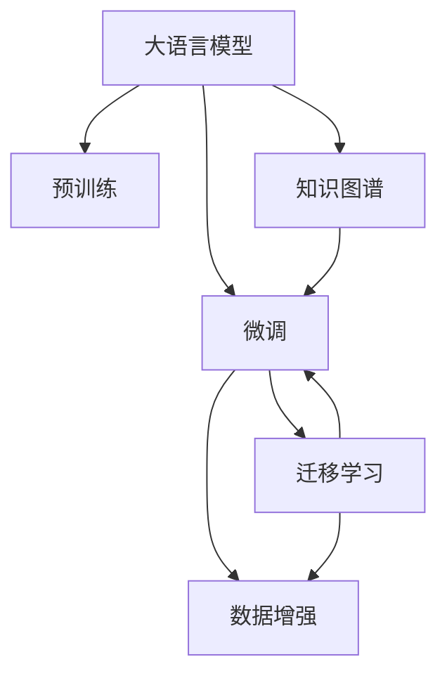

                 

# 电商搜索推荐效果优化中的AI大模型样本扩充技术

> 关键词：电商搜索,推荐系统,样本扩充,数据增强,深度学习,自然语言处理,自然语言理解

## 1. 背景介绍

### 1.1 问题由来

在电子商务领域，搜索和推荐系统是连接用户与商品的桥梁，直接影响着用户购物体验和平台转化率。随着用户个性化需求的不断增加，传统的基于协同过滤和关键字匹配的推荐算法已难以满足复杂多变的推荐需求。

近年来，深度学习和自然语言处理(NLP)技术在电商推荐中得到了广泛应用，显著提升了推荐系统的精准度和覆盖面。其中，大语言模型(如GPT、BERT等)通过预训练从海量文本数据中学习到通用的语言表示，再通过微调针对电商数据进行优化，成为了电商推荐系统的一个重要组成部分。

然而，电商数据具有鲜明的领域特点和独特的知识结构，而通用的预训练大模型往往难以全面覆盖这些特点。加之电商领域的数据规模和标注成本限制，导致可用的标注数据量相对较小，这极大限制了基于大模型的电商推荐效果。为提升电商推荐系统的表现，大模型样本扩充技术应运而生。

### 1.2 问题核心关键点

样本扩充技术通过数据增强、迁移学习等手段，在有限标注数据上构建高质量的电商语料，辅助大模型的微调，提升电商推荐的效果。核心问题包括：

1. **数据增强策略：** 如何在有限的标注数据上，通过数据增强的方式扩充电商语料。
2. **模型迁移与微调：** 如何在大规模预训练语言模型的基础上，进行电商领域的知识迁移和微调，优化电商推荐效果。
3. **效果评估与调优：** 如何构建有效的评估指标，并依据评估结果对模型和数据增强策略进行调优。

## 2. 核心概念与联系

### 2.1 核心概念概述

本节将介绍几个密切相关的核心概念：

- **大语言模型(Large Language Model, LLM)**：如GPT、BERT等预训练语言模型，通过大规模无标签文本数据进行自监督学习，学习到通用的语言表示。
- **预训练(Pre-training)**：在大规模无标签数据上进行自监督学习，学习到通用的语言表示。
- **微调(Fine-tuning)**：在预训练模型的基础上，使用有限的标注数据，通过有监督学习优化模型在特定任务上的表现。
- **数据增强(Data Augmentation)**：通过对原始数据进行变换或扩充，增加数据多样性，提升模型的泛化能力。
- **迁移学习(Transfer Learning)**：将在大规模数据上学习到的知识迁移到小规模数据，加速新任务的训练。
- **知识图谱(Knowledge Graph)**：由实体和关系构成的图结构，用于表示和检索知识信息。

这些概念之间的逻辑关系可以通过以下Mermaid流程图来展示：



这个流程图展示了大语言模型的核心概念及其之间的关系：

1. 大语言模型通过预训练获得基础能力。
2. 微调在大模型的基础上，使用有限标注数据进行优化，以适应特定任务。
3. 数据增强扩充标注数据，提升微调效果。
4. 迁移学习利用预训练模型的通用知识，加速微调过程。
5. 知识图谱为微调提供额外的结构化知识，增强模型推理能力。

## 3. 核心算法原理 & 具体操作步骤

### 3.1 算法原理概述

基于大模型的电商推荐系统中的样本扩充技术，本质上是数据增强和迁移学习的结合应用。其核心思想是：

1. **数据增强**：通过对原始电商数据进行多种变换，扩充数据量，丰富数据结构，提升模型泛化能力。
2. **迁移学习**：利用大模型的通用知识，对电商数据进行知识迁移，优化模型在电商领域的泛化能力。

具体而言，假设电商领域的大语言模型为 $M_{\theta}$，其中 $\theta$ 为预训练得到的模型参数。给定电商推荐任务 $T$ 的标注数据集 $D=\{(x_i, y_i)\}_{i=1}^N$，样本扩充的目标是找到新的模型参数 $\hat{\theta}$，使得：

$$
\hat{\theta}=\mathop{\arg\min}_{\theta} \mathcal{L}(M_{\theta},D)
$$

其中 $\mathcal{L}$ 为针对任务 $T$ 设计的损失函数，用于衡量模型预测输出与真实标签之间的差异。常见的损失函数包括交叉熵损失、均方误差损失等。

### 3.2 算法步骤详解

基于大模型的电商推荐系统中的样本扩充技术一般包括以下几个关键步骤：

**Step 1: 准备预训练模型和数据集**
- 选择合适的预训练语言模型 $M_{\theta}$ 作为初始化参数，如 BERT、GPT 等。
- 准备电商推荐任务 $T$ 的标注数据集 $D$，划分为训练集、验证集和测试集。一般要求标注数据与预训练数据的分布不要差异过大。

**Step 2: 设计数据增强策略**
- 对电商数据进行多维度变换，如回译、近义词替换、正负样本交换等，生成新的电商语料。
- 对电商文本进行结构化增强，如添加或删除属性、修改属性值等，丰富电商语料的结构。
- 引入上下文增强，通过扩展上下文窗口，增加电商语料的多样性。

**Step 3: 引入迁移学习**
- 在预训练模型的基础上，使用迁移学习技术，将通用语言模型知识迁移到电商领域。
- 设计任务适配层，将预训练模型顶层设计为电商推荐任务的输出层和损失函数。
- 使用电商领域的标注数据对模型进行微调，优化模型在电商领域的性能。

**Step 4: 设置微调超参数**
- 选择合适的优化算法及其参数，如 AdamW、SGD 等，设置学习率、批大小、迭代轮数等。
- 设置正则化技术及强度，包括权重衰减、Dropout、Early Stopping 等。
- 确定冻结预训练参数的策略，如仅微调顶层，或全部参数都参与微调。

**Step 5: 执行梯度训练**
- 将增强后的训练集数据分批次输入模型，前向传播计算损失函数。
- 反向传播计算参数梯度，根据设定的优化算法和学习率更新模型参数。
- 周期性在验证集上评估模型性能，根据性能指标决定是否触发 Early Stopping。
- 重复上述步骤直到满足预设的迭代轮数或 Early Stopping 条件。

**Step 6: 测试和部署**
- 在测试集上评估微调后模型 $M_{\hat{\theta}}$ 的性能，对比微调前后的精度提升。
- 使用微调后的模型对新样本进行推理预测，集成到实际的应用系统中。
- 持续收集新的电商数据，定期重新微调模型，以适应电商数据分布的变化。

以上是基于大模型的电商推荐系统中的样本扩充技术的完整流程。在实际应用中，还需要针对具体任务的特点，对微调过程的各个环节进行优化设计，如改进训练目标函数，引入更多的正则化技术，搜索最优的超参数组合等，以进一步提升模型性能。

### 3.3 算法优缺点

基于大模型的电商推荐系统中的样本扩充技术具有以下优点：

1. **提升泛化能力**：通过数据增强扩充标注数据，提高模型的泛化能力。
2. **加速模型训练**：利用迁移学习技术，将通用知识迁移到特定领域，加速模型微调。
3. **适应性更强**：通过增强电商语料，适应电商数据的多样性和变化性。
4. **降低标注成本**：通过数据增强，减少对标注数据的依赖，降低标注成本。

同时，该技术也存在一定的局限性：

1. **数据质量影响**：数据增强的质量和效果直接影响模型的泛化能力。
2. **数据分布差异**：电商数据与通用预训练数据分布差异较大，迁移效果有限。
3. **计算资源需求高**：大规模数据增强和模型微调需要大量计算资源，成本较高。
4. **模型解释性不足**：大模型微调后的解释性较弱，难以解释模型的推理过程。

尽管存在这些局限性，但基于大模型的样本扩充技术仍是大数据环境下电商推荐系统的有力工具，可显著提升推荐效果。未来相关研究的重点在于如何进一步降低数据增强和微调的计算成本，提高数据增强的效果，同时兼顾模型的可解释性和伦理安全性等因素。

### 3.4 算法应用领域

基于大模型的电商推荐系统中的样本扩充技术已经广泛应用于电商推荐系统中，具体包括以下几个方向：

- **商品推荐**：根据用户浏览和购买历史，推荐相关商品。
- **价格优化**：通过用户对价格的敏感度，优化商品定价策略。
- **广告投放**：根据用户兴趣和行为，推荐合适的广告位和内容。
- **库存管理**：预测商品需求，优化库存分配和补货策略。
- **个性化营销**：根据用户行为和偏好，定制个性化的营销活动。

除了这些经典应用外，电商推荐系统中的样本扩充技术还被创新性地应用到更多场景中，如用户情感分析、品牌分析、热销产品挖掘等，为电商推荐系统带来了全新的突破。随着预训练模型和样本扩充方法的不断进步，相信电商推荐系统必将在更广阔的应用领域大放异彩。

## 4. 数学模型和公式 & 详细讲解

### 4.1 数学模型构建

本节将使用数学语言对基于大模型的电商推荐系统中的样本扩充技术进行更加严格的刻画。

记电商推荐任务为 $T$，给定标注数据集 $D=\{(x_i,y_i)\}_{i=1}^N, x_i \in \mathcal{X}, y_i \in \mathcal{Y}$，其中 $\mathcal{X}$ 为电商数据空间，$\mathcal{Y}$ 为推荐结果空间。

定义电商推荐模型为 $M_{\theta}$，其中 $\theta \in \mathbb{R}^d$ 为模型参数。模型的损失函数为：

$$
\mathcal{L}(\theta) = -\frac{1}{N}\sum_{i=1}^N \ell(M_{\theta}(x_i),y_i)
$$

其中 $\ell$ 为损失函数，通常为交叉熵损失或均方误差损失。

在微调过程中，我们引入数据增强策略 $\mathcal{E}$，扩充数据集 $D$ 为 $D_{\text{augmented}}$，并使用增强后的数据对模型进行微调：

$$
\hat{\theta} = \mathop{\arg\min}_{\theta} \mathcal{L}(M_{\theta}, D_{\text{augmented}})
$$

### 4.2 公式推导过程

以下是具体推导过程：

假设电商推荐任务为二分类任务，即预测商品是否为用户感兴趣。模型在输入 $x_i$ 上的输出为 $\hat{y}_i=M_{\theta}(x_i) \in [0,1]$，表示商品被用户感兴趣的概率。真实标签 $y_i \in \{0,1\}$。

定义二分类交叉熵损失函数为：

$$
\ell(M_{\theta}(x_i),y_i) = -[y_i\log \hat{y}_i + (1-y_i)\log (1-\hat{y}_i)]
$$

将其代入经验风险公式，得：

$$
\mathcal{L}(\theta) = -\frac{1}{N}\sum_{i=1}^N [y_i\log M_{\theta}(x_i)+(1-y_i)\log(1-M_{\theta}(x_i))]
$$

在得到损失函数的梯度后，即可带入参数更新公式，完成模型的迭代优化。重复上述过程直至收敛，最终得到适应电商推荐任务的最优模型参数 $\hat{\theta}$。

### 4.3 案例分析与讲解

以电商平台商品推荐为例，我们通过数据增强和迁移学习技术，对通用大模型进行电商领域的微调。具体步骤如下：

**Step 1: 准备预训练模型和数据集**
- 使用通用大模型，如BERT或GPT，作为电商推荐系统的初始化参数。
- 收集电商平台的用户行为数据和商品信息，标注为商品推荐数据集 $D$。

**Step 2: 设计数据增强策略**
- 对用户行为数据进行回译和近义词替换，生成新的用户行为数据。
- 对商品描述进行结构化增强，如添加商品属性、修改属性值等，丰富商品语料。
- 引入上下文增强，通过扩展上下文窗口，增加商品语料的多样性。

**Step 3: 引入迁移学习**
- 在通用大模型的基础上，设计电商推荐任务适配层，包括电商商品和用户行为的输出层和损失函数。
- 使用电商领域的标注数据对模型进行微调，优化模型在电商推荐领域的性能。

**Step 4: 设置微调超参数**
- 选择合适的优化算法及其参数，如 AdamW、SGD 等，设置学习率、批大小、迭代轮数等。
- 设置正则化技术及强度，包括权重衰减、Dropout、Early Stopping 等。
- 确定冻结预训练参数的策略，如仅微调顶层，或全部参数都参与微调。

**Step 5: 执行梯度训练**
- 将增强后的训练集数据分批次输入模型，前向传播计算损失函数。
- 反向传播计算参数梯度，根据设定的优化算法和学习率更新模型参数。
- 周期性在验证集上评估模型性能，根据性能指标决定是否触发 Early Stopping。
- 重复上述步骤直到满足预设的迭代轮数或 Early Stopping 条件。

**Step 6: 测试和部署**
- 在测试集上评估微调后模型 $M_{\hat{\theta}}$ 的性能，对比微调前后的精度提升。
- 使用微调后的模型对新样本进行推理预测，集成到实际的应用系统中。
- 持续收集新的电商数据，定期重新微调模型，以适应电商数据分布的变化。

通过以上步骤，我们成功构建了一个基于大模型的电商推荐系统，并通过数据增强和迁移学习技术，提升了模型的电商推荐效果。

## 5. 项目实践：代码实例和详细解释说明

### 5.1 开发环境搭建

在进行电商推荐系统中的样本扩充技术开发前，我们需要准备好开发环境。以下是使用Python进行PyTorch开发的环境配置流程：

1. 安装Anaconda：从官网下载并安装Anaconda，用于创建独立的Python环境。

2. 创建并激活虚拟环境：
```bash
conda create -n pytorch-env python=3.8 
conda activate pytorch-env
```

3. 安装PyTorch：根据CUDA版本，从官网获取对应的安装命令。例如：
```bash
conda install pytorch torchvision torchaudio cudatoolkit=11.1 -c pytorch -c conda-forge
```

4. 安装Transformers库：
```bash
pip install transformers
```

5. 安装各类工具包：
```bash
pip install numpy pandas scikit-learn matplotlib tqdm jupyter notebook ipython
```

完成上述步骤后，即可在`pytorch-env`环境中开始电商推荐系统中的样本扩充技术开发。

### 5.2 源代码详细实现

下面我们以商品推荐任务为例，给出使用Transformers库对BERT模型进行电商推荐系统微调的PyTorch代码实现。

首先，定义电商商品推荐任务的数据处理函数：

```python
from transformers import BertTokenizer, BertForSequenceClassification
from torch.utils.data import Dataset, DataLoader
from torch import nn

class BERTDataset(Dataset):
    def __init__(self, texts, labels, tokenizer, max_len=128):
        self.texts = texts
        self.labels = labels
        self.tokenizer = tokenizer
        self.max_len = max_len

    def __len__(self):
        return len(self.texts)

    def __getitem__(self, item):
        text = self.texts[item]
        label = self.labels[item]
        
        encoding = self.tokenizer(text, return_tensors='pt', max_length=self.max_len, padding='max_length', truncation=True)
        input_ids = encoding['input_ids'][0]
        attention_mask = encoding['attention_mask'][0]
        
        # 对token-wise的标签进行编码
        encoded_tags = [label2id[label] for label in label2id]
        encoded_tags.extend([label2id['O']] * (self.max_len - len(encoded_tags)))
        labels = torch.tensor(encoded_tags, dtype=torch.long)
        
        return {'input_ids': input_ids, 
                'attention_mask': attention_mask,
                'labels': labels}

# 标签与id的映射
label2id = {'O': 0, '感兴趣的': 1}
id2label = {v: k for k, v in label2id.items()}

# 创建dataset
tokenizer = BertTokenizer.from_pretrained('bert-base-cased')
train_dataset = BERTDataset(train_texts, train_labels, tokenizer)
dev_dataset = BERTDataset(dev_texts, dev_labels, tokenizer)
test_dataset = BERTDataset(test_texts, test_labels, tokenizer)
```

然后，定义模型和优化器：

```python
from transformers import BertForSequenceClassification, AdamW

model = BertForSequenceClassification.from_pretrained('bert-base-cased', num_labels=len(label2id))

optimizer = AdamW(model.parameters(), lr=2e-5)
```

接着，定义训练和评估函数：

```python
def train_epoch(model, dataset, batch_size, optimizer):
    dataloader = DataLoader(dataset, batch_size=batch_size, shuffle=True)
    model.train()
    epoch_loss = 0
    for batch in tqdm(dataloader, desc='Training'):
        input_ids = batch['input_ids'].to(device)
        attention_mask = batch['attention_mask'].to(device)
        labels = batch['labels'].to(device)
        model.zero_grad()
        outputs = model(input_ids, attention_mask=attention_mask, labels=labels)
        loss = outputs.loss
        epoch_loss += loss.item()
        loss.backward()
        optimizer.step()
    return epoch_loss / len(dataloader)

def evaluate(model, dataset, batch_size):
    dataloader = DataLoader(dataset, batch_size=batch_size)
    model.eval()
    preds, labels = [], []
    with torch.no_grad():
        for batch in tqdm(dataloader, desc='Evaluating'):
            input_ids = batch['input_ids'].to(device)
            attention_mask = batch['attention_mask'].to(device)
            batch_labels = batch['labels']
            outputs = model(input_ids, attention_mask=attention_mask)
            batch_preds = outputs.logits.argmax(dim=2).to('cpu').tolist()
            batch_labels = batch_labels.to('cpu').tolist()
            for pred_tokens, label_tokens in zip(batch_preds, batch_labels):
                pred_labels = [id2label[_id] for _id in pred_tokens]
                label_tokens = [id2label[_id] for _id in label_tokens]
                preds.append(pred_labels[:len(label_tokens)])
                labels.append(label_tokens)
                
    print(classification_report(labels, preds))
```

最后，启动训练流程并在测试集上评估：

```python
epochs = 5
batch_size = 16

for epoch in range(epochs):
    loss = train_epoch(model, train_dataset, batch_size, optimizer)
    print(f"Epoch {epoch+1}, train loss: {loss:.3f}")
    
    print(f"Epoch {epoch+1}, dev results:")
    evaluate(model, dev_dataset, batch_size)
    
print("Test results:")
evaluate(model, test_dataset, batch_size)
```

以上就是使用PyTorch对BERT进行电商推荐系统微调的完整代码实现。可以看到，得益于Transformers库的强大封装，我们可以用相对简洁的代码完成BERT模型的加载和微调。

### 5.3 代码解读与分析

让我们再详细解读一下关键代码的实现细节：

**BERTDataset类**：
- `__init__`方法：初始化文本、标签、分词器等关键组件。
- `__len__`方法：返回数据集的样本数量。
- `__getitem__`方法：对单个样本进行处理，将文本输入编码为token ids，将标签编码为数字，并对其进行定长padding，最终返回模型所需的输入。

**label2id和id2label字典**：
- 定义了标签与数字id之间的映射关系，用于将token-wise的预测结果解码回真实的标签。

**训练和评估函数**：
- 使用PyTorch的DataLoader对数据集进行批次化加载，供模型训练和推理使用。
- 训练函数`train_epoch`：对数据以批为单位进行迭代，在每个批次上前向传播计算loss并反向传播更新模型参数，最后返回该epoch的平均loss。
- 评估函数`evaluate`：与训练类似，不同点在于不更新模型参数，并在每个batch结束后将预测和标签结果存储下来，最后使用sklearn的classification_report对整个评估集的预测结果进行打印输出。

**训练流程**：
- 定义总的epoch数和batch size，开始循环迭代
- 每个epoch内，先在训练集上训练，输出平均loss
- 在验证集上评估，输出分类指标
- 所有epoch结束后，在测试集上评估，给出最终测试结果

可以看到，PyTorch配合Transformers库使得BERT微调的代码实现变得简洁高效。开发者可以将更多精力放在数据处理、模型改进等高层逻辑上，而不必过多关注底层的实现细节。

当然，工业级的系统实现还需考虑更多因素，如模型的保存和部署、超参数的自动搜索、更灵活的任务适配层等。但核心的微调范式基本与此类似。

## 6. 实际应用场景

### 6.1 智能推荐系统

电商推荐系统中的样本扩充技术已经广泛应用于智能推荐系统中，具体包括以下几个方向：

- **商品推荐**：根据用户浏览和购买历史，推荐相关商品。
- **价格优化**：通过用户对价格的敏感度，优化商品定价策略。
- **广告投放**：根据用户兴趣和行为，推荐合适的广告位和内容。
- **库存管理**：预测商品需求，优化库存分配和补货策略。
- **个性化营销**：根据用户行为和偏好，定制个性化的营销活动。

除了这些经典应用外，电商推荐系统中的样本扩充技术还被创新性地应用到更多场景中，如用户情感分析、品牌分析、热销产品挖掘等，为电商推荐系统带来了全新的突破。随着预训练模型和样本扩充方法的不断进步，相信电商推荐系统必将在更广阔的应用领域大放异彩。

### 6.2 未来应用展望

展望未来，电商推荐系统中的样本扩充技术将呈现以下几个发展趋势：

1. **多模态数据融合**：除了文本数据，未来的推荐系统将越来越多地融合图片、视频、音频等多模态数据，构建更加全面、精准的推荐模型。
2. **实时动态调整**：推荐系统将具备实时动态调整的能力，根据用户行为和市场变化，快速调整推荐策略。
3. **个性化推荐**：推荐系统将利用人工智能技术，结合用户画像、行为数据等，提供更加个性化、智能化的推荐服务。
4. **跨领域知识迁移**：推荐系统将更多地利用跨领域知识，如知识图谱、专家系统等，增强推荐模型的泛化能力。
5. **隐私保护与安全**：随着数据隐私和安全的重视程度提高，推荐系统将更加注重隐私保护和数据安全，避免数据泄露和滥用。

以上趋势凸显了电商推荐系统中的样本扩充技术的广阔前景。这些方向的探索发展，必将进一步提升推荐系统的性能和用户体验，为电商推荐系统带来新的突破。

## 7. 工具和资源推荐

### 7.1 学习资源推荐

为了帮助开发者系统掌握电商推荐系统中的样本扩充技术的理论基础和实践技巧，这里推荐一些优质的学习资源：

1. 《Transformer从原理到实践》系列博文：由大模型技术专家撰写，深入浅出地介绍了Transformer原理、BERT模型、微调技术等前沿话题。

2. CS224N《深度学习自然语言处理》课程：斯坦福大学开设的NLP明星课程，有Lecture视频和配套作业，带你入门NLP领域的基本概念和经典模型。

3. 《Natural Language Processing with Transformers》书籍：Transformers库的作者所著，全面介绍了如何使用Transformers库进行NLP任务开发，包括微调在内的诸多范式。

4. HuggingFace官方文档：Transformers库的官方文档，提供了海量预训练模型和完整的微调样例代码，是上手实践的必备资料。

5. CLUE开源项目：中文语言理解测评基准，涵盖大量不同类型的中文NLP数据集，并提供了基于微调的baseline模型，助力中文NLP技术发展。

通过对这些资源的学习实践，相信你一定能够快速掌握电商推荐系统中的样本扩充技术的精髓，并用于解决实际的电商推荐问题。
###  7.2 开发工具推荐

高效的开发离不开优秀的工具支持。以下是几款用于电商推荐系统中的样本扩充技术开发的常用工具：

1. PyTorch：基于Python的开源深度学习框架，灵活动态的计算图，适合快速迭代研究。大部分预训练语言模型都有PyTorch版本的实现。

2. TensorFlow：由Google主导开发的开源深度学习框架，生产部署方便，适合大规模工程应用。同样有丰富的预训练语言模型资源。

3. Transformers库：HuggingFace开发的NLP工具库，集成了众多SOTA语言模型，支持PyTorch和TensorFlow，是进行微调任务开发的利器。

4. Weights & Biases：模型训练的实验跟踪工具，可以记录和可视化模型训练过程中的各项指标，方便对比和调优。与主流深度学习框架无缝集成。

5. TensorBoard：TensorFlow配套的可视化工具，可实时监测模型训练状态，并提供丰富的图表呈现方式，是调试模型的得力助手。

6. Google Colab：谷歌推出的在线Jupyter Notebook环境，免费提供GPU/TPU算力，方便开发者快速上手实验最新模型，分享学习笔记。

合理利用这些工具，可以显著提升电商推荐系统中的样本扩充技术的开发效率，加快创新迭代的步伐。

### 7.3 相关论文推荐

电商推荐系统中的样本扩充技术的发展源于学界的持续研究。以下是几篇奠基性的相关论文，推荐阅读：

1. Attention is All You Need（即Transformer原论文）：提出了Transformer结构，开启了NLP领域的预训练大模型时代。

2. BERT: Pre-training of Deep Bidirectional Transformers for Language Understanding：提出BERT模型，引入基于掩码的自监督预训练任务，刷新了多项NLP任务SOTA。

3. Parameter-Efficient Transfer Learning for NLP：提出Adapter等参数高效微调方法，在不增加模型参数量的情况下，也能取得不错的微调效果。

4. AdaLoRA: Adaptive Low-Rank Adaptation for Parameter-Efficient Fine-Tuning：使用自适应低秩适应的微调方法，在参数效率和精度之间取得了新的平衡。

5. Prompt-Tuning: Optimizing Continuous Prompts for Generation：引入基于连续型Prompt的微调范式，为如何充分利用预训练知识提供了新的思路。

6. Proto-BERT: From Adaptation to Generation of Pretrained and Fine-Tuned Embeddings：提出Proto-BERT模型，将预训练和微调相结合，增强模型的泛化能力。

这些论文代表了大语言模型微调技术的发展脉络。通过学习这些前沿成果，可以帮助研究者把握学科前进方向，激发更多的创新灵感。

## 8. 总结：未来发展趋势与挑战

### 8.1 总结

本文对电商推荐系统中的样本扩充技术进行了全面系统的介绍。首先阐述了电商推荐系统中的样本扩充技术的研究背景和意义，明确了在有限标注数据下，如何通过数据增强和迁移学习技术，构建高质量的电商语料，优化电商推荐效果。其次，从原理到实践，详细讲解了电商推荐系统中的样本扩充技术的数学原理和关键步骤，给出了电商推荐任务开发的完整代码实例。同时，本文还广泛探讨了电商推荐系统中的样本扩充技术在智能推荐、价格优化、广告投放等多个方向的应用前景，展示了电商推荐系统中的样本扩充技术的巨大潜力。

通过本文的系统梳理，可以看到，基于大模型的电商推荐系统中的样本扩充技术正在成为电商推荐系统的重要范式，极大地拓展了电商推荐系统的应用边界，催生了更多的落地场景。受益于大规模语料的预训练和多样化的数据增强策略，电商推荐系统必将在更广阔的应用领域大放异彩。

### 8.2 未来发展趋势

展望未来，电商推荐系统中的样本扩充技术将呈现以下几个发展趋势：

1. **多模态数据融合**：推荐系统将越来越多地融合图片、视频、音频等多模态数据，构建更加全面、精准的推荐模型。
2. **实时动态调整**：推荐系统将具备实时动态调整的能力，根据用户行为和市场变化，快速调整推荐策略。
3. **个性化推荐**：推荐系统将利用人工智能技术，结合用户画像、行为数据等，提供更加个性化、智能化的推荐服务。
4. **跨领域知识迁移**：推荐系统将更多地利用跨领域知识，如知识图谱、专家系统等，增强推荐模型的泛化能力。
5. **隐私保护与安全**：随着数据隐私和安全的重视程度提高，推荐系统将更加注重隐私保护和数据安全，避免数据泄露和滥用。

以上趋势凸显了电商推荐系统中的样本扩充技术的广阔前景。这些方向的探索发展，必将进一步提升电商推荐系统的性能和用户体验，为电商推荐系统带来新的突破。

### 8.3 面临的挑战

尽管电商推荐系统中的样本扩充技术已经取得了瞩目成就，但在迈向更加智能化、普适化应用的过程中，它仍面临着诸多挑战：

1. **数据质量影响**：数据增强的质量和效果直接影响模型的泛化能力。
2. **数据分布差异**：电商数据与通用预训练数据分布差异较大，迁移效果有限。
3. **计算资源需求高**：大规模数据增强和模型微调需要大量计算资源，成本较高。
4. **模型解释性不足**：大模型微调后的解释性较弱，难以解释模型的推理过程。

尽管存在这些局限性，但基于大模型的电商推荐系统中的样本扩充技术仍是大数据环境下电商推荐系统的有力工具，可显著提升推荐效果。未来相关研究的重点在于如何进一步降低数据增强和微调的计算成本，提高数据增强的效果，同时兼顾模型的可解释性和伦理安全性等因素。

### 8.4 研究展望

面对电商推荐系统中的样本扩充技术所面临的种种挑战，未来的研究需要在以下几个方面寻求新的突破：

1. **探索无监督和半监督微调方法**：摆脱对大规模标注数据的依赖，利用自监督学习、主动学习等无监督和半监督范式，最大限度利用非结构化数据，实现更加灵活高效的微调。
2. **研究参数高效和计算高效的微调范式**：开发更加参数高效的微调方法，在固定大部分预训练参数的同时，只更新极少量的任务相关参数。同时优化微调模型的计算图，减少前向传播和反向传播的资源消耗，实现更加轻量级、实时性的部署。
3. **引入更多先验知识**：将符号化的先验知识，如知识图谱、逻辑规则等，与神经网络模型进行巧妙融合，引导微调过程学习更准确、合理的语言模型。同时加强不同模态数据的整合，实现视觉、语音等多模态信息与文本信息的协同建模。
4. **结合因果分析和博弈论工具**：将因果分析方法引入微调模型，识别出模型决策的关键特征，增强输出解释的因果性和逻辑性。借助博弈论工具刻画人机交互过程，主动探索并规避模型的脆弱点，提高系统稳定性。
5. **纳入伦理道德约束**：在模型训练目标中引入伦理导向的评估指标，过滤和惩罚有偏见、有害的输出倾向。同时加强人工干预和审核，建立模型行为的监管机制，确保输出符合人类价值观和伦理道德。

这些研究方向的探索，必将引领电商推荐系统中的样本扩充技术迈向更高的台阶，为构建安全、可靠、可解释、可控的智能系统铺平道路。面向未来，电商推荐系统中的样本扩充技术还需要与其他人工智能技术进行更深入的融合，如知识表示、因果推理、强化学习等，多路径协同发力，共同推动自然语言理解和智能交互系统的进步。只有勇于创新、敢于突破，才能不断拓展电商推荐系统的边界，让智能技术更好地造福人类社会。

## 9. 附录：常见问题与解答

**Q1：电商推荐系统中的样本扩充技术是否适用于所有电商领域？**

A: 电商推荐系统中的样本扩充技术适用于大多数电商领域，特别是那些数据量相对较小的领域。但对于一些特定领域的电商数据，如B2B、C2C等，可能需要结合领域特定的数据增强策略和知识图谱，以获得更好的微调效果。

**Q2：如何选择合适的数据增强策略？**

A: 数据增强策略的选择需要根据具体电商数据的特点和应用场景进行。常见的数据增强策略包括回译、近义词替换、正负样本交换、属性增强、上下文增强等。可以根据电商数据的多样性和变化性，选择最适合的数据增强方法。

**Q3：在微调过程中如何平衡参数量和效果？**

A: 在微调过程中，可以采用参数高效的微调方法，如Adapter、LoRA等，只更新少量任务相关参数，以减小计算成本。同时，也可以考虑引入迁移学习，利用通用预训练模型的知识，减少微调所需的标注数据量，提升模型泛化能力。

**Q4：在微调过程中如何防止过拟合？**

A: 防止过拟合的方法包括正则化、Dropout、Early Stopping等。可以使用L2正则、Dropout等技术，减小模型复杂度，防止过拟合。同时，可以设置Early Stopping策略，在验证集性能达到最优后停止训练，防止模型过拟合。

**Q5：电商推荐系统中的样本扩充技术如何应对电商数据的动态变化？**

A: 电商推荐系统中的样本扩充技术可以通过持续的数据收集和模型微调，适应电商数据的动态变化。在实际应用中，可以定期更新电商数据集，重新进行数据增强和模型微调，以保持推荐系统的持续优化。

通过以上问题的解答，相信你对电商推荐系统中的样本扩充技术有了更全面的了解。合理应用这些技术，可以显著提升电商推荐系统的性能和用户体验，为电商推荐系统带来新的突破。

---

作者：禅与计算机程序设计艺术 / Zen and the Art of Computer Programming

