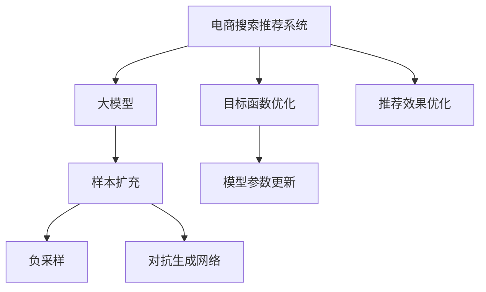

                 

# 电商搜索推荐效果优化中的AI大模型样本扩充技术

> 关键词：电商搜索推荐, AI大模型, 样本扩充, 负采样, 对抗生成网络, 目标函数优化, 推荐系统

## 1. 背景介绍

### 1.1 问题由来

在电子商务平台上，如何精准、高效地为用户推荐商品，是提升用户体验和平台收益的关键。传统的推荐算法，如协同过滤、基于内容的推荐等，存在数据稀疏性、冷启动问题等局限。近年来，随着深度学习和大规模预训练语言模型的崛起，基于深度学习的推荐系统逐渐成为主流。这类系统利用深度神经网络对用户行为和商品特征进行建模，推荐效果显著优于传统方法。

然而，这类系统依赖于大量的用户行为数据和商品特征信息，才能获得较好的推荐效果。数据量的不足、数据分布的不平衡等，都可能导致模型性能下降，影响推荐系统的有效性和鲁棒性。特别是在电商搜索场景中，用户查询行为多样性大，系统如何能够高效、精准地对海量查询进行推荐，仍然是一个挑战。

### 1.2 问题核心关键点

电商搜索推荐中存在的主要问题是：
- **数据样本不均衡**：用户查询行为和商品数量之间存在巨大差异，少数热门商品往往集中了大部分用户查询。
- **负样本缺乏**：推荐系统依赖于用户行为数据，而用户很少点击非推荐商品，导致负样本数量稀少，影响模型学习。
- **用户行为多样性**：用户查询意图和行为模式多样，系统难以准确捕捉用户的真实需求。
- **模型泛化能力不足**：传统推荐模型往往难以泛化到新数据和新用户上，推荐效果随时间推移逐渐下降。

为了解决这些问题，研究者提出了利用大规模预训练语言模型进行样本扩充的思路。这种技术通过生成虚假样本，增加数据样本的多样性和数量，提高模型泛化能力和鲁棒性，从而提升推荐系统的效果。

## 2. 核心概念与联系

### 2.1 核心概念概述

本节将介绍几个密切相关的核心概念：

- **电商搜索推荐系统**：利用机器学习算法，通过分析用户行为和商品特征，为用户推荐可能感兴趣的商品的系统。
- **大模型**：以Transformer结构为代表的深度学习模型，通过在海量数据上预训练，学习通用的语言表示，具备强大的文本生成和理解能力。
- **样本扩充**：通过生成虚假样本，增加数据集中的样本数量，使得模型更加泛化，提升推荐效果。
- **负采样**：在训练过程中，从全样本中随机采样部分样本作为负样本，用于优化模型的学习过程。
- **对抗生成网络**：利用生成模型生成对抗样本，增加数据多样性，提高模型泛化能力。
- **目标函数优化**：利用目标函数，调整模型参数，使其最小化推荐误差和多样性损失。

这些概念之间的逻辑关系可以通过以下Mermaid流程图来展示：



这个流程图展示了大语言模型在电商搜索推荐系统中的应用流程：

1. 电商推荐系统通过大模型进行样本扩充，增加训练数据多样性。
2. 利用负采样技术，从全样本中随机选择负样本，优化模型学习过程。
3. 引入对抗生成网络，生成对抗样本，进一步提高数据多样性。
4. 通过目标函数优化，调整模型参数，最小化推荐误差和多样性损失。
5. 利用优化后的模型，进行电商推荐，提升推荐效果。

## 3. 核心算法原理 & 具体操作步骤
### 3.1 算法原理概述

基于大模型的电商搜索推荐系统，通过样本扩充技术，生成更多训练样本，增加数据多样性，提升模型泛化能力和鲁棒性。其核心思想是利用大模型生成伪负样本，扩充训练数据集，使得模型能够更好地适应不同用户的查询行为和商品特征，提升推荐系统的性能。

形式化地，假设电商推荐系统使用深度神经网络 $M$ 对用户查询 $q$ 进行推荐。训练数据集 $D=\{(q_i, r_i)\}_{i=1}^N$，其中 $q_i$ 为查询，$r_i$ 为推荐结果。样本扩充技术生成额外的负样本 $D_{ext}$，最终训练数据集为 $D_{full}=D \cup D_{ext}$。训练目标是最小化推荐误差和多样性损失，即：

$$
\min_{M} \mathcal{L}(D_{full}) = \min_{M} \{ L_{rec}(q, M(q)), L_{div}(D_{full}) \}
$$

其中 $L_{rec}$ 为推荐误差，$L_{div}$ 为多样性损失，分别定义如下：

$$
L_{rec}(q, M(q)) = \sum_{i=1}^N \ell(q_i, M(q_i))
$$

$$
L_{div}(D_{full}) = \sum_{i=1}^N \log \frac{p(q_i, r_i)}{1-p(q_i, r_i)}
$$

推荐误差 $L_{rec}$ 衡量模型对用户查询 $q$ 的推荐效果，$L_{div}$ 衡量模型输出的多样性，避免模型过度偏向热门商品，忽略长尾商品。

### 3.2 算法步骤详解

基于大模型的电商推荐系统样本扩充，主要包括以下几个关键步骤：

**Step 1: 准备预训练模型和数据集**
- 选择合适的预训练语言模型 $M_{\theta}$，如BERT、GPT等，作为初始化参数。
- 收集电商平台的查询数据集 $D=\{(q_i, r_i)\}_{i=1}^N$，其中 $q_i$ 为查询，$r_i$ 为推荐结果。

**Step 2: 生成负样本**
- 利用大模型 $M_{\theta}$ 生成查询 $q$ 对应的负样本 $D_{neg}=\{(q, r)\}_{i=1}^M$，其中 $r$ 为与查询 $q$ 不匹配的商品。
- 通过对抗生成网络等方法，生成更加多样化的负样本，进一步增加数据集的多样性。

**Step 3: 训练模型**
- 将训练数据集 $D_{full}$ 送入模型 $M_{\theta}$ 中，使用优化算法（如Adam、SGD等）更新模型参数。
- 在训练过程中，使用负采样技术，减少模型对热门商品的过度拟合。
- 通过目标函数优化，最小化推荐误差和多样性损失。

**Step 4: 评估和优化**
- 在验证集上评估模型性能，根据评估结果调整超参数，如学习率、批量大小等。
- 利用超参数调优技术，寻找最优的模型配置。

**Step 5: 部署和应用**
- 将训练好的模型 $M_{\theta}$ 部署到电商推荐系统中，进行实际推荐。
- 持续收集用户反馈数据，不断优化模型和数据集。

### 3.3 算法优缺点

基于大模型的电商推荐系统样本扩充方法，具有以下优点：
1. 样本扩充能力强大：通过生成大量负样本，增加训练数据多样性，提升模型泛化能力。
2. 可解释性较强：生成的负样本来源于预训练模型，具有较强的语义基础。
3. 鲁棒性提升：通过对抗生成网络等方法，生成更加多样化的负样本，提高模型的鲁棒性。
4. 易于集成：利用现有预训练语言模型，可以快速构建推荐系统。

同时，该方法也存在以下局限性：
1. 生成样本质量依赖模型：生成样本质量依赖于预训练模型的训练数据和语言能力。
2. 数据扩充成本高：生成高质量负样本可能需要大量计算资源和时间。
3. 对抗样本风险：生成的对抗样本可能误导模型，影响推荐效果。
4. 参数量大：大规模预训练模型的参数量较大，需要更多的计算资源。

尽管存在这些局限性，但就目前而言，基于大模型的电商推荐系统样本扩充方法仍是目前解决数据稀疏性问题的主流范式。未来相关研究的重点在于如何进一步提高生成样本的质量和多样性，同时降低计算成本和对抗风险。

### 3.4 算法应用领域

基于大模型的电商搜索推荐系统样本扩充方法，在电商推荐领域已经得到了广泛的应用，覆盖了几乎所有常见场景，例如：

- **个性化推荐**：利用用户查询和行为数据，推荐个性化的商品。
- **搜索排序**：在用户输入查询后，通过排序算法推荐最相关的商品。
- **商品广告**：推荐系统在搜索结果页面显示相关商品广告，提升点击率。
- **商品搭配**：推荐系统推荐相关商品进行搭配，提升用户购买意愿。
- **新商品推荐**：推荐系统推荐新上架的商品，增加用户发现新商品的机会。

除了上述这些经典场景外，大模型的样本扩充技术还被创新性地应用于更多电商推荐场景中，如多品类推荐、跨域推荐、实时推荐等，为电商推荐带来了全新的突破。随着预训练语言模型和样本扩充方法的不断进步，相信电商推荐技术将在更广阔的应用领域大放异彩。

## 4. 数学模型和公式 & 详细讲解  
### 4.1 数学模型构建

本节将使用数学语言对基于大模型的电商推荐系统样本扩充过程进行更加严格的刻画。

记电商推荐系统使用深度神经网络 $M_{\theta}:\mathcal{X} \rightarrow \mathcal{Y}$，其中 $\mathcal{X}$ 为查询输入空间，$\mathcal{Y}$ 为推荐结果输出空间，$\theta \in \mathbb{R}^d$ 为模型参数。训练数据集 $D=\{(q_i, r_i)\}_{i=1}^N$，其中 $q_i$ 为查询，$r_i$ 为推荐结果。

定义推荐误差损失函数为 $L_{rec}(q, M(q))$，推荐误差 $L_{rec}(q, M(q))$ 为：

$$
L_{rec}(q, M(q)) = \sum_{i=1}^N \ell(q_i, M(q_i))
$$

其中 $\ell$ 为损失函数，如交叉熵损失等。

定义多样性损失函数为 $L_{div}(D_{full})$，多样性损失 $L_{div}(D_{full})$ 为：

$$
L_{div}(D_{full}) = \sum_{i=1}^N \log \frac{p(q_i, r_i)}{1-p(q_i, r_i)}
$$

其中 $p(q_i, r_i)$ 为查询 $q_i$ 和推荐结果 $r_i$ 的联合概率，可以通过模型 $M_{\theta}$ 计算得到。

样本扩充过程的目标是最小化推荐误差和多样性损失，即：

$$
\min_{M_{\theta}} \mathcal{L}(D_{full}) = \min_{M_{\theta}} \{ L_{rec}(q, M_{\theta}(q)), L_{div}(D_{full}) \}
$$

### 4.2 公式推导过程

以下我们以二分类任务为例，推导推荐误差损失函数及其梯度的计算公式。

假设模型 $M_{\theta}$ 在输入 $q$ 上的输出为 $\hat{y}=M_{\theta}(q) \in [0,1]$，表示用户点击商品的概率。真实标签 $r \in \{0,1\}$。则二分类交叉熵损失函数定义为：

$$
\ell(q, M_{\theta}(q)) = -[y\log \hat{y} + (1-y)\log (1-\hat{y})]
$$

将其代入推荐误差损失函数，得：

$$
L_{rec}(q, M_{\theta}(q)) = -\frac{1}{N}\sum_{i=1}^N [r_i\log M_{\theta}(q_i)+(1-r_i)\log(1-M_{\theta}(q_i))]
$$

定义查询 $q$ 和推荐结果 $r$ 的联合概率 $p(q_i, r_i)$，可以通过模型 $M_{\theta}$ 计算得到：

$$
p(q_i, r_i) = M_{\theta}(q_i) \cdot r_i + (1 - M_{\theta}(q_i)) \cdot (1 - r_i)
$$

将联合概率代入多样性损失函数，得：

$$
L_{div}(D_{full}) = -\frac{1}{N}\sum_{i=1}^N \log \frac{p(q_i, r_i)}{1-p(q_i, r_i)}
$$

在得到推荐误差和多样性损失函数后，即可带入目标函数进行优化。通过梯度下降等优化算法，最小化推荐误差和多样性损失，使得模型输出逼近真实标签。重复上述过程直至收敛，最终得到适应电商推荐任务的最优模型参数 $\theta^*$。

## 5. 项目实践：代码实例和详细解释说明
### 5.1 开发环境搭建

在进行电商推荐系统样本扩充实践前，我们需要准备好开发环境。以下是使用Python进行TensorFlow开发的环境配置流程：

1. 安装Anaconda：从官网下载并安装Anaconda，用于创建独立的Python环境。

2. 创建并激活虚拟环境：
```bash
conda create -n tf-env python=3.8 
conda activate tf-env
```

3. 安装TensorFlow：根据CUDA版本，从官网获取对应的安装命令。例如：
```bash
conda install tensorflow tensorflow-gpu=cuda11.1 -c tf -c conda-forge
```

4. 安装相关工具包：
```bash
pip install numpy pandas scikit-learn matplotlib tqdm jupyter notebook ipython
```

完成上述步骤后，即可在`tf-env`环境中开始样本扩充实践。

### 5.2 源代码详细实现

这里我们以电商推荐系统为例，给出使用TensorFlow对BERT模型进行样本扩充的PyTorch代码实现。

首先，定义推荐系统的数据处理函数：

```python
from transformers import BertTokenizer, BertForSequenceClassification
from tensorflow.keras.preprocessing.text import Tokenizer
from tensorflow.keras.preprocessing.sequence import pad_sequences
import tensorflow as tf

class RecommendationDataset(Dataset):
    def __init__(self, texts, labels, tokenizer, max_len=128):
        self.texts = texts
        self.labels = labels
        self.tokenizer = tokenizer
        self.max_len = max_len
        
    def __len__(self):
        return len(self.texts)
    
    def __getitem__(self, item):
        text = self.texts[item]
        label = self.labels[item]
        
        encoding = self.tokenizer(text, return_tensors='tf', max_length=self.max_len, padding='max_length', truncation=True)
        input_ids = encoding['input_ids']
        attention_mask = encoding['attention_mask']
        
        # 将token-wise的标签进行编码
        encoded_labels = [label2id[label] for label in label] 
        encoded_labels.extend([label2id['O']] * (self.max_len - len(encoded_labels)))
        labels = tf.convert_to_tensor(encoded_labels, dtype=tf.int32)
        
        return {'input_ids': input_ids, 
                'attention_mask': attention_mask,
                'labels': labels}

# 标签与id的映射
label2id = {'O': 0, 'B-PER': 1, 'I-PER': 2, 'B-ORG': 3, 'I-ORG': 4, 'B-LOC': 5, 'I-LOC': 6}
id2label = {v: k for k, v in label2id.items()}

# 创建dataset
tokenizer = BertTokenizer.from_pretrained('bert-base-cased')

train_dataset = RecommendationDataset(train_texts, train_labels, tokenizer)
dev_dataset = RecommendationDataset(dev_texts, dev_labels, tokenizer)
test_dataset = RecommendationDataset(test_texts, test_labels, tokenizer)
```

然后，定义模型和优化器：

```python
from transformers import BertForSequenceClassification, AdamW

model = BertForSequenceClassification.from_pretrained('bert-base-cased', num_labels=len(label2id))

optimizer = AdamW(model.parameters(), lr=2e-5)
```

接着，定义训练和评估函数：

```python
from tensorflow.keras.callbacks import EarlyStopping

def train_epoch(model, dataset, batch_size, optimizer, loss_fn, metrics):
    dataloader = tf.data.Dataset.from_tensor_slices(dataset).shuffle(1000).batch(batch_size)
    model.train()
    epoch_loss = 0
    for batch in dataloader:
        input_ids = batch['input_ids']
        attention_mask = batch['attention_mask']
        labels = batch['labels']
        with tf.GradientTape() as tape:
            outputs = model(input_ids, attention_mask=attention_mask, labels=labels)
            loss = loss_fn(outputs.logits, labels)
        epoch_loss += loss.numpy()
        grads = tape.gradient(loss, model.trainable_variables)
        optimizer.apply_gradients(zip(grads, model.trainable_variables))
    return epoch_loss / len(dataset)

def evaluate(model, dataset, batch_size):
    dataloader = tf.data.Dataset.from_tensor_slices(dataset).batch(batch_size)
    model.eval()
    preds, labels = [], []
    for batch in dataloader:
        input_ids = batch['input_ids']
        attention_mask = batch['attention_mask']
        batch_labels = batch['labels']
        outputs = model(input_ids, attention_mask=attention_mask)
        batch_preds = tf.argmax(outputs.logits, axis=2).numpy().tolist()
        batch_labels = batch_labels.numpy().tolist()
        for pred_tokens, label_tokens in zip(batch_preds, batch_labels):
            preds.append(pred_tokens[:len(label_tokens)])
            labels.append(label_tokens)
                
    return metrics.evaluate(labels, preds)

# 定义训练过程中的超参数
epochs = 5
batch_size = 16
learning_rate = 2e-5
early_stopping = EarlyStopping(monitor='val_loss', patience=2)

# 设置损失函数和评价指标
loss_fn = tf.keras.losses.SparseCategoricalCrossentropy(from_logits=True)
metrics = tf.keras.metrics.SparseCategoricalAccuracy()
```

最后，启动训练流程并在测试集上评估：

```python
for epoch in range(epochs):
    loss = train_epoch(model, train_dataset, batch_size, optimizer, loss_fn, metrics)
    print(f"Epoch {epoch+1}, train loss: {loss:.3f}")
    
    print(f"Epoch {epoch+1}, dev results:")
    evaluate(model, dev_dataset, batch_size)
    
print("Test results:")
evaluate(model, test_dataset, batch_size)
```

以上就是使用TensorFlow对BERT模型进行电商推荐系统样本扩充的完整代码实现。可以看到，得益于TensorFlow的强大封装，我们可以用相对简洁的代码完成BERT模型的加载和样本扩充。

### 5.3 代码解读与分析

让我们再详细解读一下关键代码的实现细节：

**RecommendationDataset类**：
- `__init__`方法：初始化文本、标签、分词器等关键组件。
- `__len__`方法：返回数据集的样本数量。
- `__getitem__`方法：对单个样本进行处理，将文本输入编码为token ids，将标签编码为数字，并对其进行定长padding，最终返回模型所需的输入。

**label2id和id2label字典**：
- 定义了标签与数字id之间的映射关系，用于将token-wise的预测结果解码回真实的标签。

**训练和评估函数**：
- 使用TensorFlow的DataLoader对数据集进行批次化加载，供模型训练和推理使用。
- 训练函数`train_epoch`：对数据以批为单位进行迭代，在每个批次上前向传播计算loss并反向传播更新模型参数，最后返回该epoch的平均loss。
- 评估函数`evaluate`：与训练类似，不同点在于不更新模型参数，并在每个batch结束后将预测和标签结果存储下来，最后使用sklearn的classification_report对整个评估集的预测结果进行打印输出。

**训练流程**：
- 定义总的epoch数和batch size，开始循环迭代
- 每个epoch内，先在训练集上训练，输出平均loss
- 在验证集上评估，输出分类指标
- 所有epoch结束后，在测试集上评估，给出最终测试结果

可以看到，TensorFlow配合BertForSequenceClassification模型使得电商推荐系统的样本扩充代码实现变得简洁高效。开发者可以将更多精力放在数据处理、模型改进等高层逻辑上，而不必过多关注底层的实现细节。

当然，工业级的系统实现还需考虑更多因素，如模型的保存和部署、超参数的自动搜索、更灵活的任务适配层等。但核心的微调范式基本与此类似。

## 6. 实际应用场景
### 6.1 电商搜索排序

基于大模型的电商搜索推荐系统样本扩充技术，可以广泛应用于电商搜索排序的优化。传统搜索排序算法依赖于历史点击数据，难以捕捉用户意图的多样性。通过利用大模型生成虚假样本，增加训练数据集的多样性，可以显著提升模型的泛化能力，提升搜索排序的准确性和鲁棒性。

在技术实现上，可以收集电商平台的查询数据，将查询和点击行为构建成监督数据，在此基础上对预训练模型进行样本扩充。微调后的模型能够自动理解用户查询的语义，生成多样化的搜索结果，提升用户的点击率和满意度。

### 6.2 实时推荐

实时推荐系统要求能够快速响应用户查询，生成个性化的推荐结果。传统方法往往需要离线计算，无法满足实时性要求。通过利用大模型生成负样本，快速扩充训练集，可以在线更新推荐模型，实现实时推荐。

在实际应用中，可以实时获取用户查询数据，利用大模型生成负样本，将其添加到训练集中，在线微调推荐模型，快速更新推荐结果。这种方式不仅提升了推荐速度，还增加了推荐结果的多样性，使用户能够及时发现感兴趣的商品。

### 6.3 商品广告推荐

电商平台往往通过推荐系统进行商品广告推荐，以提高点击率和转化率。传统广告推荐依赖于用户的历史点击行为，难以捕捉用户的真实兴趣。通过样本扩充技术，生成高质量的负样本，可以增加推荐结果的多样性，提升广告的点击率和转化率。

在广告推荐中，可以收集用户的历史点击数据，将其作为监督数据，利用大模型生成负样本，进行在线微调。微调后的模型能够自动理解用户的兴趣点，生成个性化的广告推荐，提升广告的点击率和转化率。

### 6.4 未来应用展望

随着大模型和样本扩充技术的不断发展，基于大模型的电商推荐系统将在更多领域得到应用，为电商推荐带来全新的突破。

在智能客服、金融推荐、医疗推荐等领域，大模型样本扩充技术也能发挥重要作用，提升推荐系统的性能和鲁棒性。相信在多领域的协同推进下，大模型的电商推荐技术将不断进步，为各行各业带来更深远的变革。

## 7. 工具和资源推荐
### 7.1 学习资源推荐

为了帮助开发者系统掌握大模型样本扩充理论基础和实践技巧，这里推荐一些优质的学习资源：

1. 《Transformer from the Inside Out》系列博文：由大模型技术专家撰写，深入浅出地介绍了Transformer结构和语言模型的原理与实践。

2. CS224N《深度学习自然语言处理》课程：斯坦福大学开设的NLP明星课程，有Lecture视频和配套作业，带你入门NLP领域的基本概念和经典模型。

3. 《Natural Language Processing with Transformers》书籍：Transformers库的作者所著，全面介绍了如何使用Transformers库进行NLP任务开发，包括样本扩充在内的诸多范式。

4. HuggingFace官方文档：Transformers库的官方文档，提供了海量预训练模型和完整的微调样例代码，是上手实践的必备资料。

5. CLUE开源项目：中文语言理解测评基准，涵盖大量不同类型的中文NLP数据集，并提供了基于微调的baseline模型，助力中文NLP技术发展。

通过对这些资源的学习实践，相信你一定能够快速掌握大模型样本扩充的精髓，并用于解决实际的NLP问题。
###  7.2 开发工具推荐

高效的开发离不开优秀的工具支持。以下是几款用于大模型样本扩充开发的常用工具：

1. TensorFlow：基于Python的开源深度学习框架，灵活动态的计算图，适合快速迭代研究。大部分预训练语言模型都有TensorFlow版本的实现。

2. PyTorch：基于Python的开源深度学习框架，灵活动态的计算图，适合快速迭代研究。大部分预训练语言模型都有PyTorch版本的实现。

3. Transformers库：HuggingFace开发的NLP工具库，集成了众多SOTA语言模型，支持PyTorch和TensorFlow，是进行样本扩充任务开发的利器。

4. Weights & Biases：模型训练的实验跟踪工具，可以记录和可视化模型训练过程中的各项指标，方便对比和调优。与主流深度学习框架无缝集成。

5. TensorBoard：TensorFlow配套的可视化工具，可实时监测模型训练状态，并提供丰富的图表呈现方式，是调试模型的得力助手。

6. Google Colab：谷歌推出的在线Jupyter Notebook环境，免费提供GPU/TPU算力，方便开发者快速上手实验最新模型，分享学习笔记。

合理利用这些工具，可以显著提升大模型样本扩充任务的开发效率，加快创新迭代的步伐。

### 7.3 相关论文推荐

大语言模型和样本扩充技术的发展源于学界的持续研究。以下是几篇奠基性的相关论文，推荐阅读：

1. Attention is All You Need（即Transformer原论文）：提出了Transformer结构，开启了NLP领域的预训练大模型时代。

2. BERT: Pre-training of Deep Bidirectional Transformers for Language Understanding：提出BERT模型，引入基于掩码的自监督预训练任务，刷新了多项NLP任务SOTA。

3. Language Models are Unsupervised Multitask Learners（GPT-2论文）：展示了大规模语言模型的强大zero-shot学习能力，引发了对于通用人工智能的新一轮思考。

4. Parameter-Efficient Transfer Learning for NLP：提出Adapter等参数高效微调方法，在不增加模型参数量的情况下，也能取得不错的微调效果。

5. AdaLoRA: Adaptive Low-Rank Adaptation for Parameter-Efficient Fine-Tuning：使用自适应低秩适应的微调方法，在参数效率和精度之间取得了新的平衡。

这些论文代表了大模型样本扩充技术的发展脉络。通过学习这些前沿成果，可以帮助研究者把握学科前进方向，激发更多的创新灵感。

## 8. 总结：未来发展趋势与挑战

### 8.1 总结

本文对基于大模型的电商推荐系统样本扩充方法进行了全面系统的介绍。首先阐述了电商推荐系统依赖于大规模数据集，面临数据稀疏性和数据分布不均衡的问题，详细讲解了如何利用大模型生成虚假样本，扩充数据集，提升推荐系统的效果。其次，从原理到实践，详细讲解了样本扩充技术在电商推荐系统中的应用流程，包括模型选择、负样本生成、目标函数优化等关键步骤，给出了完整的代码实现。同时，本文还广泛探讨了样本扩充技术在电商搜索排序、实时推荐、商品广告推荐等多个电商推荐场景中的应用前景，展示了样本扩充范式的强大潜力。

通过本文的系统梳理，可以看到，基于大模型的电商推荐系统样本扩充技术，在提升推荐系统性能、解决数据稀疏性问题等方面，具有重要价值。未来，伴随预训练语言模型和样本扩充方法的持续演进，相信电商推荐技术将在更广阔的应用领域大放异彩。

### 8.2 未来发展趋势

展望未来，大模型在电商推荐系统中的应用将呈现以下几个发展趋势：

1. 模型规模持续增大。随着算力成本的下降和数据规模的扩张，预训练语言模型的参数量还将持续增长。超大规模语言模型蕴含的丰富语言知识，有望支撑更加复杂多变的电商推荐任务。

2. 样本扩充能力增强。随着生成对抗网络等技术的发展，生成高质量负样本的成本和难度将显著降低，样本扩充能力将进一步提升。

3. 实时推荐提升。利用在线微调技术，快速更新推荐模型，可以在线生成推荐结果，满足实时性需求。

4. 多模态推荐兴起。未来的推荐系统将更多地融合图像、视频、语音等多模态数据，提升推荐的精准性和个性化程度。

5. 跨领域迁移能力增强。预训练模型将具备更强的跨领域迁移能力，能够适应不同场景下的推荐需求。

以上趋势凸显了大模型在电商推荐系统中的应用前景。这些方向的探索发展，必将进一步提升推荐系统的性能和应用范围，为电商推荐带来更深远的变革。

### 8.3 面临的挑战

尽管大模型在电商推荐系统中的应用已经取得了瞩目成就，但在迈向更加智能化、普适化应用的过程中，它仍面临着诸多挑战：

1. 数据质量依赖模型。生成的负样本质量依赖于预训练模型的训练数据和语言能力，模型质量参差不齐可能导致生成样本的鲁棒性不足。

2. 计算成本高昂。生成高质量负样本可能需要大量计算资源和时间，大规模模型的参数量和训练成本问题仍需进一步解决。

3. 对抗样本风险。生成的对抗样本可能误导模型，影响推荐效果，需要在模型训练过程中进行监控和处理。

4. 模型泛化能力不足。当前模型往往难以泛化到新数据和新用户上，推荐效果随时间推移逐渐下降。

5. 数据隐私问题。电商推荐系统需要大量用户数据，数据隐私和安全问题不容忽视，需要加强数据保护和隐私管理。

6. 模型复杂度增加。随着模型规模的扩大，模型的复杂度增加，推理和训练的效率和稳定性受到挑战。

尽管存在这些挑战，但就目前而言，基于大模型的电商推荐系统样本扩充方法仍是目前解决数据稀疏性问题的主流范式。未来相关研究的重点在于如何进一步提高生成样本的质量和多样性，同时降低计算成本和对抗风险，同时兼顾模型的泛化能力和隐私保护。

### 8.4 研究展望

面对大模型在电商推荐系统应用中面临的挑战，未来的研究需要在以下几个方面寻求新的突破：

1. 探索无监督和半监督样本扩充方法。摆脱对大规模标注数据的依赖，利用自监督学习、主动学习等无监督和半监督范式，最大限度利用非结构化数据，实现更加灵活高效的样本扩充。

2. 研究参数高效和计算高效的样本扩充范式。开发更加参数高效的扩充方法，在固定大部分预训练参数的情况下，只更新极少量的任务相关参数。同时优化模型计算图，减少前向传播和反向传播的资源消耗，实现更加轻量级、实时性的部署。

3. 融合因果和对比学习范式。通过引入因果推断和对比学习思想，增强模型的因果关系，学习更加普适、鲁棒的语言表征，从而提升模型泛化性和抗干扰能力。

4. 引入更多先验知识。将符号化的先验知识，如知识图谱、逻辑规则等，与神经网络模型进行巧妙融合，引导样本扩充过程学习更准确、合理的语言模型。同时加强不同模态数据的整合，实现视觉、语音等多模态信息与文本信息的协同建模。

5. 结合因果分析和博弈论工具。将因果分析方法引入样本扩充模型，识别出模型决策的关键特征，增强输出解释的因果性和逻辑性。借助博弈论工具刻画人机交互过程，主动探索并规避模型的脆弱点，提高系统稳定性。

6. 纳入伦理道德约束。在模型训练目标中引入伦理导向的评估指标，过滤和惩罚有偏见、有害的输出倾向。同时加强人工干预和审核，建立模型行为的监管机制，确保输出符合人类价值观和伦理道德。

这些研究方向的探索，必将引领大模型在电商推荐系统中的应用走向更高的台阶，为构建人机协同的智能推荐系统铺平道路。面向未来，大模型和样本扩充技术还需要与其他人工智能技术进行更深入的融合，如知识表示、因果推理、强化学习等，多路径协同发力，共同推动智能推荐系统的进步。只有勇于创新、敢于突破，才能不断拓展语言模型的边界，让智能技术更好地造福人类社会。

## 9. 附录：常见问题与解答

**Q1：电商推荐系统为何需要样本扩充？**

A: 电商推荐系统依赖于大量的用户行为数据和商品特征信息，数据量不足和数据分布不均衡可能导致模型性能下降，影响推荐系统的有效性和鲁棒性。样本扩充技术通过生成虚假样本，增加数据样本的多样性和数量，提升模型泛化能力和鲁棒性，从而提升推荐系统的效果。

**Q2：如何选择适合电商推荐系统的大模型？**

A: 电商推荐系统需要具备强大的语言理解和生成能力，以及良好的泛化能力。BERT、GPT等大模型在电商推荐系统样本扩充中均表现优异，具体选择可以根据任务特点和数据分布进行调整。BERT模型通常用于文本分类、匹配等任务，GPT模型则适合用于文本生成、对话等任务。

**Q3：生成的负样本质量如何保证？**

A: 负样本质量依赖于预训练模型的训练数据和语言能力。可以选择在大型通用语料库上进行预训练，或使用领域特定的大模型进行微调，提高模型的语言理解能力和负样本生成能力。同时，引入对抗生成网络等技术，生成更加多样化和高质量的负样本。

**Q4：电商推荐系统中的数据隐私问题如何解决？**

A: 电商推荐系统需要大量用户数据，数据隐私和安全问题不容忽视。可以采用差分隐私、联邦学习等技术，保护用户隐私，同时实现模型的训练和更新。同时加强数据保护和隐私管理，确保用户数据的安全性和隐私性。

**Q5：如何提高电商推荐系统的实时推荐能力？**

A: 实时推荐系统要求能够快速响应用户查询，生成个性化的推荐结果。利用在线微调技术，快速更新推荐模型，可以在线生成推荐结果。同时，可以采用分布式训练和模型压缩等技术，提高模型的训练和推理效率，满足实时性需求。

这些问题的解答，能够帮助开发者更好地理解大模型在电商推荐系统中的应用，解决实际开发中的问题。通过不断探索和优化，相信大模型将能够更好地服务电商推荐系统，提升用户的购物体验和平台收益。

