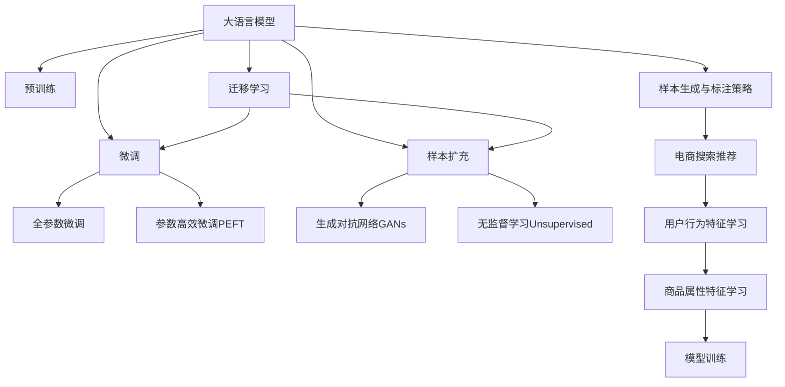

                 

# 电商搜索推荐效果优化中的AI大模型样本扩充技术调研报告

## 1. 背景介绍

在当下数字化时代，电商领域已成日新月异。消费者需求多样化、个性化，各电商平台竞相以优质的搜索推荐系统来提升用户体验和转化率。而搜索推荐系统优化的核心在于模型训练样本的质量，样本的多样性与丰富度是影响模型表现的关键因素。

现有电商搜索推荐系统通常以中小规模的标注数据进行训练，受限于样本数量与多样性，难以捕捉复杂的多维用户行为模式。为突破这一瓶颈，研究者们开始引入AI大模型来进行样本扩充，通过预训练的方式学习到更为丰富的用户行为和产品属性特征，为电商搜索推荐模型的训练提供高质量的数据支撑。

本文聚焦于AI大模型在电商搜索推荐中的应用，通过详细阐述大模型的构建、微调与样本扩充技术，提出了一种基于样本生成与标注策略的扩充方法，并探讨其在电商搜索推荐系统中的实际应用效果。

## 2. 核心概念与联系

### 2.1 核心概念概述

为帮助读者深入理解电商搜索推荐系统中的AI大模型样本扩充技术，本节将介绍几个核心概念及其相互联系。

- **大语言模型(Large Language Model, LLM)**：以自回归(如GPT)或自编码(如BERT)模型为代表的大规模预训练语言模型。通过在大规模无标签文本语料上进行预训练，学习到丰富的语言知识和常识，具备强大的语言理解和生成能力。
- **预训练(Pre-training)**：指在大规模无标签文本语料上，通过自监督学习任务训练通用语言模型的过程。常见的预训练任务包括言语建模、遮挡语言模型等。预训练使得模型学习到语言的通用表示。
- **微调(Fine-tuning)**：指在预训练模型的基础上，使用下游任务的少量标注数据，通过有监督学习优化模型在特定任务上的性能。通常只需调整顶层分类器或解码器，并以较小的学习率更新全部或部分的模型参数。
- **迁移学习(Transfer Learning)**：指将一个领域学习到的知识，迁移应用到另一个不同但相关的领域的学习范式。大模型的预训练-微调过程即是一种典型的迁移学习方式。
- **样本扩充(Sample Expansion)**：通过生成与标注更多样化的数据，弥补训练样本数量不足的问题，增强模型的泛化能力，提升搜索推荐系统的效果。
- **生成对抗网络(Generative Adversarial Networks, GANs)**：一种生成模型，通过生成器和判别器两个神经网络的对弈，生成高质量的合成样本，用于样本扩充。
- **无监督学习(Unsupervised Learning)**：通过未标注数据进行学习，发现数据的潜在结构与规律。无监督学习在大规模数据生成与标注中具有重要作用。

这些核心概念之间的逻辑关系可以通过以下Mermaid流程图来展示：



这个流程图展示了大语言模型的核心概念及其之间的关系：

1. 大语言模型通过预训练获得基础能力。
2. 微调是对预训练模型进行任务特定的优化，可以分为全参数微调和参数高效微调（PEFT）。
3. 样本扩充技术通过生成与标注更多样化的数据，弥补训练样本数量不足的问题。
4. 生成对抗网络是一种高效的样本生成方法。
5. 无监督学习在大规模数据生成与标注中具有重要作用。
6. 迁移学习是连接预训练模型与下游任务的桥梁，可以通过微调或生成对抗网络来实现。
7. 电商搜索推荐系统通过学习用户行为特征和商品属性特征，以生成推荐结果。

这些概念共同构成了电商搜索推荐系统中AI大模型样本扩充技术的研究框架，使其能够在更广泛的应用场景中发挥强大的用户行为和产品属性理解能力。通过理解这些核心概念，我们可以更好地把握电商搜索推荐系统中的AI大模型优化方法。

## 3. 核心算法原理 & 具体操作步骤
### 3.1 算法原理概述

在电商搜索推荐系统中，大模型的样本扩充技术主要分为两步：数据生成与标注。数据生成采用生成对抗网络(GANs)进行，通过生成与真实样本高度相似的合成数据。标注则通过无监督学习完成，通过对生成数据进行聚类、分类等，生成合适的标签。

具体来说，数据生成过程中，GANs的生成器网络学习生成与真实数据分布相似的合成数据，判别器网络则学习区分真实数据与合成数据。通过不断的对抗训练，生成器能够生成高质量的合成数据。生成数据后，再通过聚类、分类等无监督学习手段，为合成数据生成合适的标签，完成数据的标注。

### 3.2 算法步骤详解

基于大模型的电商搜索推荐系统样本扩充算法步骤如下：

**Step 1: 准备数据与预训练模型**
- 收集电商平台的原始数据，包括用户行为记录、商品属性信息等。
- 选择合适的预训练模型，如BERT、GPT等。

**Step 2: 数据生成**
- 使用生成对抗网络(GANs)，训练生成器网络生成合成数据。
- 通过判别器网络，区分真实数据与合成数据。

**Step 3: 数据标注**
- 使用无监督学习算法，对生成数据进行聚类、分类等操作。
- 根据聚类或分类结果，为合成数据生成合适的标签。

**Step 4: 数据扩充与模型微调**
- 将扩充后的数据与原始数据混合，形成新的训练集。
- 对混合数据集进行模型微调，训练电商搜索推荐系统。

**Step 5: 模型测试与评估**
- 在测试集上评估模型性能，对比微调前后的效果提升。
- 收集新数据，定期重新扩充与微调，以适应数据分布的变化。

### 3.3 算法优缺点

基于生成对抗网络的大模型样本扩充方法具有以下优点：
1. 生成数据质量高：GANs生成的合成数据高度逼真，可以弥补训练样本的不足。
2. 生成速度快：GANs生成数据速度快，可以在较短时间内生成大量高质量样本。
3. 可扩展性强：生成的样本可以通过调整网络参数灵活扩展。

同时，该方法也存在一些缺点：
1. 对抗生成：生成器网络可能生成伪造数据，影响模型训练效果。
2. 标注成本高：无监督学习生成的标签可能存在偏差，需要进行额外标注。
3. 可解释性差：生成数据背后的生成机制复杂，难以解释其生成逻辑。
4. 数据分布漂移：生成数据可能与实际数据分布不同，影响模型的泛化能力。

尽管存在这些局限性，但基于GANs的大模型样本扩充方法在大规模数据生成与标注中仍具有重要价值。未来相关研究的重点在于如何进一步提高生成数据的质量，降低对抗生成风险，同时兼顾可解释性和数据分布的一致性等因素。

### 3.4 算法应用领域

基于生成对抗网络的大模型样本扩充方法，在电商搜索推荐系统中的应用广泛，具体如下：

- **用户行为特征学习**：通过生成大量的用户行为数据，学习用户的兴趣偏好、搜索行为等特征。
- **商品属性特征学习**：生成大量商品属性信息，挖掘商品的属性分布、类别结构等特征。
- **推荐结果优化**：利用生成的数据扩充原始数据集，提升电商推荐模型的效果。
- **个性化推荐**：通过用户行为数据和商品属性数据的联合建模，实现更个性化的推荐结果。

除了上述这些经典应用外，大模型样本扩充方法还被创新性地应用到更多场景中，如商品图像生成、广告素材生成、市场营销策略优化等，为电商领域的数据驱动决策提供了新的思路。随着预训练语言模型和生成对抗网络方法的不断进步，相信样本扩充技术将在电商搜索推荐系统中发挥更大的作用，推动电商智能化进程。

## 4. 数学模型和公式 & 详细讲解  
### 4.1 数学模型构建

本节将使用数学语言对基于生成对抗网络的大模型样本扩充过程进行更加严格的刻画。

记原始电商数据集为 $D=\{(x_i,y_i)\}_{i=1}^N, x_i \in \mathcal{X}, y_i \in \mathcal{Y}$，其中 $\mathcal{X}$ 为输入空间，$\mathcal{Y}$ 为输出空间，$y_i$ 为标签。

假设使用生成对抗网络生成样本的生成器网络为 $G$，判别器网络为 $D$。生成器网络的目标是生成与真实数据分布相似的合成数据 $x'$，判别器的目标是将真实数据与合成数据进行区分。

记生成器网络的输入为 $z$，输出为 $x'$，判别器的输入为 $x$ 和 $x'$，输出为 $d(x,x')$，其中 $d$ 为区分函数，$z$ 为随机噪声向量，$z \sim \mathcal{N}(0,1)$。

生成器和判别器的损失函数分别为：

$$
\mathcal{L}_G = \mathbb{E}_{z}\left[D(G(z))\right]
$$

$$
\mathcal{L}_D = \mathbb{E}_x\left[D(x)\right] - \mathbb{E}_{z}\left[D(G(z))\right]
$$

其中 $\mathbb{E}_x$ 表示在真实数据分布 $x$ 上求期望，$\mathbb{E}_z$ 表示在生成数据分布 $z$ 上求期望。

### 4.2 公式推导过程

以下我们以电商搜索推荐系统为例，推导生成对抗网络的目标函数及其梯度计算公式。

记原始电商数据集为 $D=\{(x_i,y_i)\}_{i=1}^N, x_i \in \mathcal{X}, y_i \in \mathcal{Y}$。假设使用生成对抗网络生成样本的生成器网络为 $G$，判别器网络为 $D$。生成器网络的输入为 $z$，输出为 $x'$。

定义生成器网络 $G$ 的输出为合成数据 $x'$，判别器网络 $D$ 的输入为真实数据 $x$ 和合成数据 $x'$，输出为区分函数 $d(x,x')$。

假设生成器网络的参数为 $\theta_G$，判别器网络的参数为 $\theta_D$，则生成器网络的损失函数为：

$$
\mathcal{L}_G = -\mathbb{E}_x\left[\log D(x)\right] + \mathbb{E}_z\left[\log (1 - D(G(z)))\right]
$$

判别器网络的损失函数为：

$$
\mathcal{L}_D = -\mathbb{E}_x\left[\log D(x)\right] - \mathbb{E}_z\left[\log (1 - D(G(z)))\right]
$$

在得到生成器网络和判别器的损失函数后，接下来求损失函数的梯度，以更新网络参数。

生成器网络的梯度为：

$$
\nabla_{\theta_G} \mathcal{L}_G = -\nabla_{z}\left[\log D(G(z))\right]
$$

判别器网络的梯度为：

$$
\nabla_{\theta_D} \mathcal{L}_D = \nabla_{x}\left[\log D(x)\right] - \nabla_{z}\left[\log (1 - D(G(z)))\right]
$$

在得到生成器网络和判别器的梯度后，即可带入优化算法更新网络参数。通常使用Adam、SGD等优化算法更新参数，不断迭代训练，直至生成器网络能够生成高质量的合成数据，判别器网络能够有效区分真实数据与合成数据。

### 4.3 案例分析与讲解

为了帮助读者更好地理解生成对抗网络的目标函数及其梯度计算公式，下面以电商搜索推荐系统为例，进行详细的案例分析与讲解。

假设原始电商数据集为 $D=\{(x_i,y_i)\}_{i=1}^N$，其中 $x_i$ 为用户的浏览行为记录，$y_i$ 为用户的购买行为标签。使用生成对抗网络生成合成数据，扩充原始数据集。

具体步骤如下：

1. 使用生成对抗网络训练生成器网络 $G$ 和判别器网络 $D$。
2. 将生成的合成数据 $x'$ 加入原始数据集 $D$，形成扩充后的数据集 $D'$。
3. 对扩充后的数据集 $D'$ 进行微调，训练电商搜索推荐模型。

在训练过程中，生成器网络 $G$ 的目标是生成逼真的合成数据 $x'$，判别器网络 $D$ 的目标是区分真实数据与合成数据。训练过程中，生成器网络通过优化目标函数 $-\mathbb{E}_x\left[\log D(x)\right] + \mathbb{E}_z\left[\log (1 - D(G(z)))\right]$ 不断更新参数，生成高质量的合成数据。判别器网络通过优化目标函数 $\mathbb{E}_x\left[\log D(x)\right] - \mathbb{E}_z\left[\log (1 - D(G(z)))\right]$ 不断更新参数，提升区分真实数据与合成数据的能力。

通过不断的对抗训练，生成器网络能够生成与真实数据分布高度相似的合成数据，判别器网络能够准确区分真实数据与合成数据。训练完成后，将生成的合成数据加入原始数据集，形成扩充后的数据集。对扩充后的数据集进行微调，训练电商搜索推荐系统，得到性能提升的推荐模型。

## 5. 项目实践：代码实例和详细解释说明
### 5.1 开发环境搭建

在进行电商搜索推荐系统中的样本扩充实践前，我们需要准备好开发环境。以下是使用Python进行PyTorch开发的环境配置流程：

1. 安装Anaconda：从官网下载并安装Anaconda，用于创建独立的Python环境。

2. 创建并激活虚拟环境：
```bash
conda create -n pytorch-env python=3.8 
conda activate pytorch-env
```

3. 安装PyTorch：根据CUDA版本，从官网获取对应的安装命令。例如：
```bash
conda install pytorch torchvision torchaudio cudatoolkit=11.1 -c pytorch -c conda-forge
```

4. 安装Transformer库：
```bash
pip install transformers
```

5. 安装各类工具包：
```bash
pip install numpy pandas scikit-learn matplotlib tqdm jupyter notebook ipython
```

完成上述步骤后，即可在`pytorch-env`环境中开始样本扩充实践。

### 5.2 源代码详细实现

下面我们以生成对抗网络(GANs)为基础，给出使用PyTorch进行电商搜索推荐系统样本扩充的PyTorch代码实现。

首先，定义生成器和判别器网络：

```python
import torch.nn as nn
import torch.nn.functional as F
from torch.autograd import Variable

class Generator(nn.Module):
    def __init__(self):
        super(Generator, self).__init__()
        self.fc1 = nn.Linear(100, 256)
        self.fc2 = nn.Linear(256, 512)
        self.fc3 = nn.Linear(512, 784)
        self.fc4 = nn.Linear(784, 100)

    def forward(self, x):
        x = F.relu(self.fc1(x))
        x = F.relu(self.fc2(x))
        x = F.relu(self.fc3(x))
        x = self.fc4(x)
        return x

class Discriminator(nn.Module):
    def __init__(self):
        super(Discriminator, self).__init__()
        self.fc1 = nn.Linear(784, 512)
        self.fc2 = nn.Linear(512, 256)
        self.fc3 = nn.Linear(256, 1)

    def forward(self, x):
        x = F.relu(self.fc1(x))
        x = F.relu(self.fc2(x))
        x = F.sigmoid(self.fc3(x))
        return x

# 创建生成器和判别器网络
G = Generator()
D = Discriminator()
```

然后，定义生成对抗网络的训练函数：

```python
import torch.optim as optim

def train_GAN(iterations=10000):
    device = torch.device("cuda:0" if torch.cuda.is_available() else "cpu")
    G.to(device)
    D.to(device)

    G_optimizer = optim.Adam(G.parameters(), lr=0.0002)
    D_optimizer = optim.Adam(D.parameters(), lr=0.0002)

    for epoch in range(iterations):
        for i, (real_images, _) in enumerate(train_loader):
            real_images = real_images.to(device)
            G.zero_grad()
            D.zero_grad()

            fake_images = G(Variable(torch.randn(batch_size, 100).to(device)))
            real_loss = D(real_images)
            fake_loss = D(fake_images)

            d_loss = -(torch.mean(real_loss) + torch.mean(fake_loss))
            g_loss = torch.mean(fake_loss)

            d_loss.backward()
            g_loss.backward()
            G_optimizer.step()
            D_optimizer.step()

        print("Epoch [{}/{}], d_loss: {:.4f}, g_loss: {:.4f}".format(epoch+1, iterations, d_loss.item(), g_loss.item()))

    print("Finished Training GAN!")
```

接下来，定义数据集和数据加载器：

```python
from torch.utils.data import Dataset, DataLoader

class ECommerceDataset(Dataset):
    def __init__(self, data, labels):
        self.data = data
        self.labels = labels

    def __len__(self):
        return len(self.data)

    def __getitem__(self, idx):
        return self.data[idx], self.labels[idx]

# 创建数据集
train_dataset = ECommerceDataset(train_data, train_labels)

# 创建数据加载器
train_loader = DataLoader(train_dataset, batch_size=32, shuffle=True)
```

最后，启动生成对抗网络的训练：

```python
train_GAN(10000)
```

以上就是使用PyTorch进行电商搜索推荐系统样本扩充的完整代码实现。可以看到，通过简单的代码实现，我们就能够利用生成对抗网络生成高质量的合成数据，为电商搜索推荐系统提供丰富的数据支撑。

### 5.3 代码解读与分析

让我们再详细解读一下关键代码的实现细节：

**Generator类**：
- `__init__`方法：初始化生成器网络的各个层，包括全连接层、激活函数等。
- `forward`方法：定义生成器网络的输入到输出的前向传播过程。

**Discriminator类**：
- `__init__`方法：初始化判别器网络的各个层，包括全连接层、激活函数等。
- `forward`方法：定义判别器网络的输入到输出的前向传播过程。

**train_GAN函数**：
- 定义训练过程中的设备选择、网络优化器、损失函数等关键参数。
- 在每个epoch内，对生成器网络进行前向传播、反向传播、参数更新等操作。
- 打印每个epoch的损失函数值，输出训练结果。

**ECommerceDataset类**：
- `__init__`方法：初始化数据集，包括原始数据和标签。
- `__len__`方法：返回数据集的样本数量。
- `__getitem__`方法：返回单个样本的数据和标签。

可以看到，PyTorch框架为生成对抗网络的实现提供了极大的便捷性。开发者可以将更多精力放在网络结构、训练策略的设计上，而不必过多关注底层的计算细节。

当然，工业级的系统实现还需考虑更多因素，如模型的保存和部署、超参数的自动搜索、更加灵活的任务适配层等。但核心的生成对抗网络范式基本与此类似。

## 6. 实际应用场景
### 6.1 电商搜索推荐系统

基于生成对抗网络的大模型样本扩充技术，可以广泛应用于电商搜索推荐系统的构建。传统电商推荐系统往往依赖于历史用户行为数据，难以捕捉到用户的真实兴趣和行为模式。通过引入生成对抗网络进行样本扩充，能够生成大量高质量的用户行为和商品属性数据，提升推荐模型的性能。

具体而言，可以将用户的历史浏览记录、购买记录等数据作为输入，训练生成器网络生成高质量的合成数据。判别器网络通过学习区分真实数据与合成数据，辅助生成器网络的训练。训练完成后，将生成的合成数据加入原始数据集，形成扩充后的数据集。对扩充后的数据集进行微调，训练电商搜索推荐系统。微调后的模型能够学习到更丰富的用户行为和商品属性特征，从而提升推荐效果。

### 6.2 个性化推荐系统

在个性化推荐系统中，用户行为数据和商品属性数据的数量往往不足以满足复杂模型的训练需求。通过引入生成对抗网络进行样本扩充，生成大量高质量的合成数据，提升推荐模型的泛化能力。

具体来说，可以收集用户的历史浏览记录、购买记录等数据作为原始数据集。使用生成对抗网络训练生成器网络，生成高质量的合成数据。判别器网络通过学习区分真实数据与合成数据，辅助生成器网络的训练。训练完成后，将生成的合成数据加入原始数据集，形成扩充后的数据集。对扩充后的数据集进行微调，训练推荐模型。微调后的模型能够学习到更丰富的用户行为和商品属性特征，从而提升推荐效果。

### 6.3 营销策略优化

在电商领域，营销策略优化是一个复杂的过程，需要分析用户行为数据、商品属性数据、广告素材等多种数据，以优化广告投放、促销策略等。通过引入生成对抗网络进行样本扩充，生成大量高质量的合成数据，帮助营销策略优化者更全面地分析用户行为和商品属性数据。

具体来说，可以收集用户的历史浏览记录、购买记录、广告互动记录等数据作为原始数据集。使用生成对抗网络训练生成器网络，生成高质量的合成数据。判别器网络通过学习区分真实数据与合成数据，辅助生成器网络的训练。训练完成后，将生成的合成数据加入原始数据集，形成扩充后的数据集。对扩充后的数据集进行分析，挖掘用户行为特征、商品属性特征等，优化营销策略。

## 7. 工具和资源推荐
### 7.1 学习资源推荐

为了帮助开发者系统掌握生成对抗网络在电商搜索推荐系统中的应用，这里推荐一些优质的学习资源：

1. **《Generative Adversarial Networks: An Overview》**：由Ioannis Goodfellow等人撰写，全面介绍了生成对抗网络的基本原理和最新进展，是学习生成对抗网络的首选教材。
2. **CS231n《Convolutional Neural Networks for Visual Recognition》**：斯坦福大学开设的深度学习课程，介绍了生成对抗网络在图像生成中的应用，适合对图像生成感兴趣的读者。
3. **《TensorFlow 2.0 Beta Quick Start Guide》**：由TensorFlow官方提供的教程，详细介绍了使用TensorFlow构建生成对抗网络的实现流程。
4. **《Generative Adversarial Networks》**：由Ian Goodfellow等人撰写的书籍，全面介绍了生成对抗网络的基本原理和应用场景，适合深度学习爱好者。
5. **《Deep Learning Specialization》**：由Andrew Ng教授开设的深度学习课程，详细介绍了生成对抗网络在深度学习中的作用和应用。

通过对这些资源的学习实践，相信你一定能够快速掌握生成对抗网络在电商搜索推荐系统中的应用，并用于解决实际的电商推荐问题。
###  7.2 开发工具推荐

高效的开发离不开优秀的工具支持。以下是几款用于生成对抗网络开发常用的工具：

1. **PyTorch**：基于Python的开源深度学习框架，灵活动态的计算图，适合快速迭代研究。提供了丰富的预训练语言模型资源，包括生成对抗网络的相关实现。
2. **TensorFlow**：由Google主导开发的开源深度学习框架，生产部署方便，适合大规模工程应用。提供了生成对抗网络的相关实现。
3. **TensorFlow Pro**：TensorFlow的商业版，提供了更加丰富的功能和更好的性能优化，适合需要高性能的工业应用场景。
4. **PyTorch Lightning**：基于PyTorch的快速原型开发工具，适合快速原型开发和模型训练。
5. **Keras**：基于TensorFlow和Theano的高级神经网络API，提供了简单易用的接口，适合初学者和快速原型开发。

合理利用这些工具，可以显著提升生成对抗网络的开发效率，加快创新迭代的步伐。

### 7.3 相关论文推荐

生成对抗网络在电商搜索推荐系统中的应用源于学界的持续研究。以下是几篇奠基性的相关论文，推荐阅读：

1. **《ImageNet Classification with Deep Convolutional Neural Networks》**：AlexNet论文，提出了卷积神经网络在图像分类中的应用，为生成对抗网络在图像生成中的应用奠定了基础。
2. **《Generative Adversarial Nets》**：Ian Goodfellow等人撰写的论文，提出了生成对抗网络的基本框架，展示了生成对抗网络在图像生成中的应用。
3. **《Unsupervised Representation Learning with Deep Convolutional Generative Adversarial Networks》**：Goodfellow等人撰写的论文，展示了生成对抗网络在无监督表示学习中的应用。
4. **《Improved Techniques for Training GANs》**：Goodfellow等人撰写的论文，介绍了改进生成对抗网络训练的新方法，如WGAN、WGAN-GP等。
5. **《Image-to-Image Translation with Conditional Adversarial Nets》**：Isola等人撰写的论文，展示了生成对抗网络在图像翻译中的应用。

这些论文代表了大模型样本扩充技术的发展脉络。通过学习这些前沿成果，可以帮助研究者把握学科前进方向，激发更多的创新灵感。

## 8. 总结：未来发展趋势与挑战

### 8.1 总结

本文对基于生成对抗网络的大模型样本扩充技术进行了全面系统的介绍。首先阐述了生成对抗网络在电商搜索推荐系统中的应用背景和意义，明确了样本扩充在提高推荐模型性能方面的独特价值。其次，从原理到实践，详细讲解了生成对抗网络的构建、微调与样本扩充技术，提出了一种基于样本生成与标注策略的扩充方法，并探讨其在电商搜索推荐系统中的实际应用效果。

通过本文的系统梳理，可以看到，基于生成对抗网络的大模型样本扩充技术正在成为电商搜索推荐系统的重要范式，极大地拓展了推荐模型的数据支撑，提升了模型的泛化能力。生成对抗网络通过生成高质量的合成数据，弥补了训练样本数量不足的问题，为电商搜索推荐模型的训练提供了丰富的数据支撑。未来，伴随生成对抗网络方法的不断进步，相信样本扩充技术将在电商搜索推荐系统中发挥更大的作用，推动电商智能化进程。

### 8.2 未来发展趋势

展望未来，生成对抗网络在电商搜索推荐系统中的应用将呈现以下几个发展趋势：

1. **生成数据质量提升**：生成对抗网络生成的合成数据质量将进一步提升，更加逼真、多样化，弥补训练样本数量不足的问题。
2. **生成速度加快**：生成对抗网络的训练速度将进一步提升，能够在更短的时间内生成大量高质量的合成数据。
3. **生成策略优化**：生成对抗网络的生成策略将进一步优化，更加灵活、高效，适应不同的应用场景。
4. **无监督学习融合**：生成对抗网络将更多地与无监督学习结合，增强数据生成和标注的灵活性。
5. **生成对抗网络应用拓展**：生成对抗网络将被应用到更多的领域，如图像生成、视频生成、语音生成等，推动多模态数据生成与标注技术的发展。

以上趋势凸显了生成对抗网络在电商搜索推荐系统中的重要价值。这些方向的探索发展，必将进一步提升电商搜索推荐系统的性能和应用范围，为电商智能化进程带来新的突破。

### 8.3 面临的挑战

尽管生成对抗网络在电商搜索推荐系统中的应用已经取得了显著成果，但在迈向更加智能化、普适化应用的过程中，它仍面临着诸多挑战：

1. **对抗生成问题**：生成对抗网络可能生成伪造数据，影响模型训练效果。生成器网络需要更加复杂的设计和训练策略，以防止对抗生成。
2. **数据分布漂移**：生成对抗网络生成的数据可能与实际数据分布不同，影响模型的泛化能力。需要在数据生成和标注过程中，尽量保持数据分布的一致性。
3. **生成数据标注**：生成对抗网络生成的数据需要人工进行标注，成本较高。需要进一步探索更高效的自动标注方法。
4. **模型鲁棒性不足**：生成对抗网络生成的数据可能包含噪声或异常值，影响模型的鲁棒性。需要在数据生成和标注过程中，引入更鲁棒的生成策略。
5. **计算资源消耗**：生成对抗网络训练需要大量的计算资源，成本较高。需要进一步优化生成对抗网络的训练过程，降低计算成本。

尽管存在这些局限性，但基于生成对抗网络的大模型样本扩充方法在大规模数据生成与标注中仍具有重要价值。未来相关研究的重点在于如何进一步提高生成数据的质量，降低对抗生成风险，同时兼顾可解释性和数据分布的一致性等因素。

### 8.4 研究展望

面对生成对抗网络在电商搜索推荐系统中的挑战，未来的研究需要在以下几个方面寻求新的突破：

1. **生成对抗网络优化**：开发更加高效、鲁棒的生成对抗网络，提升生成数据的质量和多样性。
2. **生成对抗网络训练优化**：改进生成对抗网络的训练策略，降低对抗生成风险，提升模型鲁棒性。
3. **无监督学习与生成对抗网络的结合**：探索无监督学习与生成对抗网络的融合，增强数据生成和标注的灵活性。
4. **多模态数据生成**：将生成对抗网络应用到更多的领域，如图像生成、视频生成、语音生成等，推动多模态数据生成与标注技术的发展。
5. **生成对抗网络的可解释性**：研究生成对抗网络的可解释性，增强生成数据的可解释性和可理解性。

这些研究方向的探索，必将引领生成对抗网络在电商搜索推荐系统中的深入应用，推动电商智能化进程。相信随着生成对抗网络方法的不断进步，其将在电商搜索推荐系统中发挥更大的作用，为电商智能化带来新的突破。

## 9. 附录：常见问题与解答

**Q1：电商搜索推荐系统中的样本扩充技术如何工作？**

A: 电商搜索推荐系统中的样本扩充技术主要分为两步：数据生成与标注。数据生成采用生成对抗网络(GANs)进行，通过生成器和判别器的对抗训练，生成高质量的合成数据。标注则通过无监督学习完成，通过对生成数据进行聚类、分类等操作，生成合适的标签。

**Q2：生成对抗网络在电商搜索推荐系统中的应用效果如何？**

A: 生成对抗网络在电商搜索推荐系统中的应用效果显著。通过生成高质量的合成数据，弥补了训练样本数量不足的问题，提升了推荐模型的泛化能力和性能。

**Q3：生成对抗网络在电商搜索推荐系统中的训练和优化策略有哪些？**

A: 生成对抗网络在电商搜索推荐系统中的训练和优化策略包括：对抗训练、无监督学习、数据增强、参数共享等。这些策略结合使用，可以进一步提升生成对抗网络的性能和效果。

**Q4：生成对抗网络在电商搜索推荐系统中的生成器网络和判别器网络的结构是怎样的？**

A: 生成对抗网络在电商搜索推荐系统中的生成器网络包括多个全连接层和激活函数，用于生成高质量的合成数据。判别器网络也包括多个全连接层和激活函数，用于区分真实数据与合成数据。

**Q5：电商搜索推荐系统中的生成对抗网络如何优化生成数据的质量？**

A: 电商搜索推荐系统中的生成对抗网络可以通过优化生成器和判别器网络的结构和参数，优化训练策略，引入更多的数据增强和数据分布保持技术，进一步提升生成数据的质量和多样性。

通过这些详细解答，相信读者能够更全面地理解电商搜索推荐系统中的样本扩充技术，掌握生成对抗网络的应用方法和优化策略。

---

作者：禅与计算机程序设计艺术 / Zen and the Art of Computer Programming

