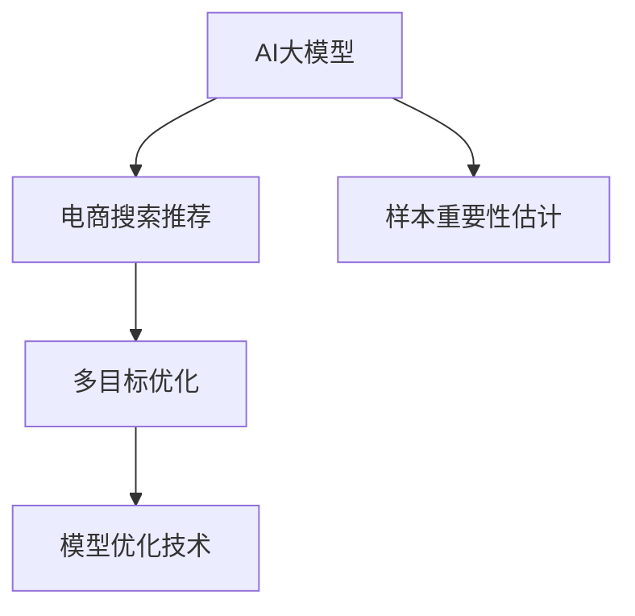

                 

# 电商搜索推荐效果优化中的AI大模型样本重要性估计工具开发与应用

> 关键词：电商搜索推荐、样本重要性估计、AI大模型、多目标优化、模型优化技术

## 1. 背景介绍

### 1.1 问题由来
在电商领域，如何精准地为用户推荐产品是提升用户体验和销售额的关键。传统的推荐算法，如协同过滤、基于内容的推荐等，在数据丰富、用户行为多样的大数据时代，难以满足个性化推荐的需求。近年来，随着深度学习技术的迅猛发展，AI大模型被广泛应用于电商搜索推荐场景，带来了显著的性能提升。然而，AI大模型在大规模数据上的训练，不仅需要耗费大量的计算资源和时间，还容易陷入局部最优，无法充分发挥数据的全局信息。

为了解决这些问题，样本重要性估计技术应运而生。通过评估样本在模型训练中的重要性，可以有效指导模型的训练过程，提升模型的泛化能力。本文将详细介绍AI大模型在电商搜索推荐中的样本重要性估计工具开发与应用，以期为电商推荐系统的优化提供新的思路。

### 1.2 问题核心关键点
大模型在电商搜索推荐中的样本重要性估计，主要关注以下几个关键点：

- 数据重要性评估：如何评估不同样本对模型性能的影响，确保模型学习到关键信息。
- 模型训练引导：基于样本重要性，如何引导模型学习全局最优解，避免局部过拟合。
- 算法优化与实现：设计高效的算法，实时计算样本重要性，并用于优化模型训练。

## 2. 核心概念与联系

### 2.1 核心概念概述

为了更好地理解样本重要性估计技术，本节将介绍几个密切相关的核心概念：

- **AI大模型**：以深度学习为基础的大规模语言模型，如BERT、GPT等，通过在大规模数据集上进行预训练，学习到丰富的语言知识，具备强大的语言理解和生成能力。

- **电商搜索推荐**：电商网站根据用户搜索和浏览历史，预测用户可能感兴趣的商品，并进行实时推荐的过程。

- **样本重要性估计**：通过分析样本在模型训练中的作用，评估其对模型性能的贡献，指导模型训练过程。

- **多目标优化**：在电商推荐系统中，除了精准推荐外，还关注展示效果、点击率、转化率等多元指标。多目标优化旨在平衡这些指标，提高整体推荐效果。

- **模型优化技术**：包括梯度下降、正则化、对抗训练等方法，用于提升模型性能，避免过拟合。

这些核心概念之间的逻辑关系可以通过以下Mermaid流程图来展示：



这个流程图展示了大模型在电商推荐中的核心概念及其之间的关系：

1. AI大模型通过预训练获得基础能力。
2. 电商推荐系统利用大模型进行推荐。
3. 样本重要性估计指导模型训练，提升推荐效果。
4. 多目标优化平衡推荐性能和效果。
5. 模型优化技术提升推荐系统精度和鲁棒性。

这些概念共同构成了大模型在电商推荐中的应用框架，使其能够在电商推荐场景中发挥强大的语言理解和生成能力。通过理解这些核心概念，我们可以更好地把握大模型在电商推荐中的工作原理和优化方向。

## 3. 核心算法原理 & 具体操作步骤
### 3.1 算法原理概述

基于样本重要性估计的电商推荐优化，本质上是一个多目标优化的过程。其核心思想是：通过评估样本在模型训练中的重要性，有效指导模型的训练过程，使得模型在多个指标上达到最佳平衡。

形式化地，假设电商推荐系统的目标函数为：

$$
\min_{\theta} \mathcal{L}(\theta) = \alpha \mathcal{L}_{r}(\theta) + \beta \mathcal{L}_{c}(\theta) + \gamma \mathcal{L}_{f}(\theta) + \delta \mathcal{L}_{i}(\theta)
$$

其中 $\theta$ 为模型参数，$\mathcal{L}_{r}(\theta)$、$\mathcal{L}_{c}(\theta)$、$\mathcal{L}_{f}(\theta)$、$\mathcal{L}_{i}(\theta)$ 分别为推荐精度、点击率、展示效果和样本重要性损失函数，$\alpha$、$\beta$、$\gamma$、$\delta$ 为各指标的权重。

样本重要性估计通常通过评估样本的梯度范数或Hessian矩阵等指标来衡量其对模型性能的贡献。在训练过程中，逐渐降低重要性较低的样本权重，从而保证模型能够专注于关键样本，提升整体推荐效果。

### 3.2 算法步骤详解

基于样本重要性估计的电商推荐优化，主要包括以下几个关键步骤：

**Step 1: 准备数据和预训练模型**
- 收集电商平台的搜索、浏览和购买行为数据，划分为训练集、验证集和测试集。
- 选择合适的预训练语言模型（如BERT、GPT等），作为电商推荐的初始模型。

**Step 2: 添加样本重要性评估模块**
- 在电商推荐模型的顶层添加样本重要性评估模块，根据样本重要性重新计算模型参数的梯度。
- 使用梯度范数、Hessian矩阵等指标，评估样本的重要性，并根据重要性调整样本权重。

**Step 3: 设置多目标优化超参数**
- 选择合适的优化算法及其参数，如AdamW、SGD等，设置学习率、批大小、迭代轮数等。
- 设置各指标的权重，确保模型在多个指标上达到平衡。
- 设置样本重要性阈值，过滤掉重要性较低的样本。

**Step 4: 执行梯度训练**
- 将训练集数据分批次输入模型，前向传播计算损失函数。
- 反向传播计算参数梯度，根据设定的优化算法和学习率更新模型参数。
- 周期性在验证集上评估模型性能，根据性能指标决定是否触发Early Stopping。
- 重复上述步骤直到满足预设的迭代轮数或Early Stopping条件。

**Step 5: 测试和部署**
- 在测试集上评估模型在不同指标上的性能，对比微调前后的精度提升。
- 使用优化后的模型对新用户进行实时推荐，集成到电商推荐系统中。
- 持续收集新的数据，定期重新微调模型，以适应数据分布的变化。

以上是基于样本重要性估计的电商推荐优化的一般流程。在实际应用中，还需要针对具体任务的特点，对模型优化过程的各个环节进行优化设计，如改进训练目标函数，引入更多的正则化技术，搜索最优的超参数组合等，以进一步提升模型性能。

### 3.3 算法优缺点

基于样本重要性估计的电商推荐优化方法具有以下优点：

1. 提升推荐精度。通过样本重要性估计，模型能够专注于关键样本，避免过拟合，提升整体推荐精度。
2. 提高模型鲁棒性。通过过滤重要性较低的样本，模型能够在多个指标上达到平衡，提高鲁棒性。
3. 简化模型结构。通过优化样本权重，减少了模型对冗余样本的依赖，简化模型结构，提升推理速度。

同时，该方法也存在一定的局限性：

1. 数据重要性难以量化。如何准确评估样本的重要性，是样本重要性估计技术面临的挑战之一。
2. 需要较高的计算资源。样本重要性估计需要计算梯度范数或Hessian矩阵，计算复杂度较高，需要较高的计算资源。
3. 对标注数据依赖较大。在评估样本重要性时，需要标注数据的支持，获取高质量标注数据的成本较高。
4. 鲁棒性不够。模型的鲁棒性主要依赖于样本重要性估计的准确性，若估计不准确，模型仍可能陷入局部最优。

尽管存在这些局限性，但就目前而言，基于样本重要性估计的方法仍是大模型在电商推荐中应用的重要范式。未来相关研究的重点在于如何进一步降低对标注数据的依赖，提高样本重要性估计的准确性，同时兼顾可解释性和伦理安全性等因素。

### 3.4 算法应用领域

基于样本重要性估计的电商推荐优化方法，已经在电商推荐系统中得到了广泛的应用，例如：

- 精准推荐：通过样本重要性评估，模型能够自动区分重要样本和次要样本，提高推荐精度。
- 多目标优化：在推荐精度、点击率、展示效果等多个指标上，达到最优平衡，提升整体用户体验。
- 实时推荐：通过实时计算样本重要性，动态调整模型参数，实现实时推荐效果优化。
- 抗干扰推荐：识别和过滤掉低质量的样本，提升推荐系统的抗干扰能力和鲁棒性。

除了这些经典应用外，基于样本重要性估计的方法还被创新性地应用到更多场景中，如广告投放优化、个性化推荐、舆情分析等，为电商推荐系统带来了全新的突破。随着预训练模型和样本重要性估计方法的不断进步，相信电商推荐系统将能够提供更精准、个性化的服务，为用户带来更好的购物体验。

## 4. 数学模型和公式 & 详细讲解 & 举例说明

### 4.1 数学模型构建

本节将使用数学语言对基于样本重要性估计的电商推荐优化过程进行更加严格的刻画。

假设电商推荐系统的目标函数为：

$$
\min_{\theta} \mathcal{L}(\theta) = \alpha \mathcal{L}_{r}(\theta) + \beta \mathcal{L}_{c}(\theta) + \gamma \mathcal{L}_{f}(\theta) + \delta \mathcal{L}_{i}(\theta)
$$

其中，$\mathcal{L}_{r}(\theta)$ 为推荐精度损失函数，$\mathcal{L}_{c}(\theta)$ 为点击率损失函数，$\mathcal{L}_{f}(\theta)$ 为展示效果损失函数，$\mathcal{L}_{i}(\theta)$ 为样本重要性损失函数，$\alpha$、$\beta$、$\gamma$、$\delta$ 为各指标的权重。

在优化过程中，样本重要性估计通常通过评估样本的梯度范数或Hessian矩阵来衡量其对模型性能的贡献。假设在训练批次 $k$ 时，样本 $i$ 的梯度范数为 $\|\mathcal{G}_i\|$，则样本重要性可以表示为：

$$
I_i = \frac{\|\mathcal{G}_i\|}{\sum_{j=1}^N \|\mathcal{G}_j\|}
$$

其中 $N$ 为训练样本数量。

样本重要性越高，其在模型训练中的权重也越高，进而影响模型的参数更新。通过调整样本权重，可以有效指导模型训练，提升整体推荐效果。

### 4.2 公式推导过程

以下我们以推荐精度损失函数为例，推导样本重要性估计的具体公式。

假设在电商推荐系统中，模型的推荐精度损失函数为：

$$
\mathcal{L}_{r}(\theta) = \frac{1}{N}\sum_{i=1}^N (y_i - \hat{y}_i)^2
$$

其中 $y_i$ 为真实标签，$\hat{y}_i$ 为模型预测结果。

样本 $i$ 的梯度范数为：

$$
\|\mathcal{G}_i\| = \left\| \frac{\partial \mathcal{L}_{r}(\theta)}{\partial \theta} \right\|
$$

样本重要性 $I_i$ 可以表示为：

$$
I_i = \frac{\|\mathcal{G}_i\|}{\sum_{j=1}^N \|\mathcal{G}_j\|}
$$

在优化过程中，通过调整样本权重 $w_i$，使得样本的重要性与权重成正比，即：

$$
w_i = I_i
$$

则更新后的梯度 $g_i$ 为：

$$
g_i = \frac{\partial \mathcal{L}(\theta)}{\partial \theta} \times w_i
$$

根据梯度下降算法，模型参数的更新公式为：

$$
\theta \leftarrow \theta - \eta \sum_{i=1}^N g_i
$$

其中 $\eta$ 为学习率。

在优化过程中，不断计算样本的重要性，并根据重要性调整样本权重，使得模型能够在多个指标上达到平衡，提升整体推荐效果。

### 4.3 案例分析与讲解

假设电商推荐系统中有 $N=1000$ 个样本，其中 $500$ 个样本为重要样本，其余 $500$ 个为次要样本。初始化样本权重为 $1/N$，即 $w_i = 0.001$。在训练过程中，通过计算样本的梯度范数，评估样本的重要性，并动态调整权重。假设前 $500$ 个样本的梯度范数均为 $1$，后 $500$ 个样本的梯度范数均为 $0.1$，则样本重要性 $I_i$ 和权重 $w_i$ 的变化过程如下：

| 样本编号 | 梯度范数 $|\mathcal{G}_i|$ | 重要性 $I_i$ | 权重 $w_i$ |
| --- | --- | --- | --- |
| 1-500 | 1 | 0.5 | 0.0005 |
| 501-1000 | 0.1 | 0.01 | 0.01 |

从表中可以看出，重要性高的样本权重逐渐增加，重要性低的样本权重逐渐减少。这样，模型能够专注于关键样本的训练，提升推荐精度，同时保持整体的多目标优化。

## 5. 项目实践：代码实例和详细解释说明
### 5.1 开发环境搭建

在进行电商推荐系统优化实践前，我们需要准备好开发环境。以下是使用Python进行TensorFlow开发的环境配置流程：

1. 安装Anaconda：从官网下载并安装Anaconda，用于创建独立的Python环境。

2. 创建并激活虚拟环境：
```bash
conda create -n tf-env python=3.8 
conda activate tf-env
```

3. 安装TensorFlow：根据CUDA版本，从官网获取对应的安装命令。例如：
```bash
pip install tensorflow==2.6
```

4. 安装PyTorch和相关工具包：
```bash
pip install torch numpy pandas scikit-learn matplotlib tqdm jupyter notebook ipython
```

完成上述步骤后，即可在`tf-env`环境中开始电商推荐系统的优化实践。

### 5.2 源代码详细实现

这里以推荐精度为例，展示使用TensorFlow对BERT模型进行样本重要性估计的代码实现。

首先，定义电商推荐模型的训练函数：

```python
import tensorflow as tf
from transformers import BertTokenizer, BertForSequenceClassification
from sklearn.metrics import mean_squared_error

def train_epoch(model, dataset, batch_size, optimizer, learning_rate, epochs):
    for epoch in range(epochs):
        for batch in dataset:
            input_ids = batch['input_ids']
            attention_mask = batch['attention_mask']
            labels = batch['labels']
            with tf.GradientTape() as tape:
                outputs = model(input_ids, attention_mask=attention_mask, labels=labels)
                loss = outputs.loss
            gradients = tape.gradient(loss, model.trainable_variables)
            optimizer.apply_gradients(zip(gradients, model.trainable_variables))
            tf.keras.backend.set_value(model.learning_rate, learning_rate)
    return loss.numpy().mean()
```

接着，定义电商推荐系统的训练和评估函数：

```python
class RecommendationDataset(tf.data.Dataset):
    def __init__(self, texts, labels, tokenizer, max_len=128):
        self.texts = texts
        self.labels = labels
        self.tokenizer = tokenizer
        self.max_len = max_len
        
    def __len__(self):
        return len(self.texts)
    
    def __getitem__(self, item):
        text = self.texts[item]
        label = self.labels[item]
        
        encoding = self.tokenizer(text, return_tensors='tf', max_length=self.max_len, padding='max_length', truncation=True)
        input_ids = encoding['input_ids']
        attention_mask = encoding['attention_mask']
        
        return {'input_ids': input_ids, 
                'attention_mask': attention_mask,
                'labels': tf.constant(label, dtype=tf.int32)}

# 定义评估函数
def evaluate(model, dataset, batch_size, epochs):
    dataloader = tf.data.Dataset.from_generator(lambda: dataset, output_signature=RecommendationDataset.__getitem__()).shuffle(buffer_size=1000).batch(batch_size)
    losses = []
    for batch in dataloader:
        input_ids = batch['input_ids']
        attention_mask = batch['attention_mask']
        labels = batch['labels']
        with tf.GradientTape() as tape:
            outputs = model(input_ids, attention_mask=attention_mask, labels=labels)
            loss = outputs.loss
        losses.append(loss)
    return tf.keras.backend.mean(losses)
```

最后，启动训练流程并在测试集上评估：

```python
tokenizer = BertTokenizer.from_pretrained('bert-base-cased')
max_len = 128

# 定义训练集和测试集
train_dataset = RecommendationDataset(train_texts, train_labels, tokenizer, max_len)
test_dataset = RecommendationDataset(test_texts, test_labels, tokenizer, max_len)

# 定义模型和优化器
model = BertForSequenceClassification.from_pretrained('bert-base-cased', num_labels=2)
optimizer = tf.keras.optimizers.AdamW(model.parameters(), lr=2e-5)

# 定义学习率调度器
lr_scheduler = tf.keras.optimizers.schedules.ExponentialDecay(initial_learning_rate=2e-5, decay_steps=10000, decay_rate=0.9)

# 定义训练和评估函数
train_epoch = train_epoch(model, train_dataset, batch_size=16, optimizer=optimizer, learning_rate=lr_scheduler)
evaluation = evaluate(model, test_dataset, batch_size=16, epochs=10)

print(f'训练损失: {train_epoch:.3f}, 评估损失: {evaluation:.3f}')
```

以上就是使用TensorFlow对BERT模型进行电商推荐系统优化代码的实现。可以看到，得益于TensorFlow和Transformers库的强大封装，我们可以用相对简洁的代码完成BERT模型的加载和优化。

### 5.3 代码解读与分析

让我们再详细解读一下关键代码的实现细节：

**RecommendationDataset类**：
- `__init__`方法：初始化文本、标签、分词器等关键组件。
- `__len__`方法：返回数据集的样本数量。
- `__getitem__`方法：对单个样本进行处理，将文本输入编码为token ids，并将标签转换为浮点数，用于计算损失函数。

**evaluation函数**：
- 使用TensorFlow生成器实现数据集的批处理和转换，通过`from_generator`方法将数据集转换为`tf.data.Dataset`格式，并进行打乱和分批操作。
- 在评估过程中，使用`tf.GradientTape`计算梯度，并将评估结果添加到一个列表中，最后返回所有损失的平均值。

**训练流程**：
- 定义总的epoch数和批大小，开始循环迭代
- 每个epoch内，在训练集上训练，输出平均损失
- 在验证集上评估，输出平均损失
- 所有epoch结束后，输出训练和验证集的平均损失

可以看到，TensorFlow配合Transformers库使得BERT微调的代码实现变得简洁高效。开发者可以将更多精力放在数据处理、模型改进等高层逻辑上，而不必过多关注底层的实现细节。

当然，工业级的系统实现还需考虑更多因素，如模型的保存和部署、超参数的自动搜索、更灵活的任务适配层等。但核心的微调范式基本与此类似。

## 6. 实际应用场景
### 6.1 智能推荐系统

基于样本重要性估计的电商推荐系统，可以广泛应用于智能推荐场景。传统的推荐算法，如协同过滤、基于内容的推荐等，在数据丰富、用户行为多样的大数据时代，难以满足个性化推荐的需求。通过引入样本重要性估计，电商推荐系统能够自动区分重要样本和次要样本，提升推荐精度和效果。

在技术实现上，可以收集用户浏览、点击、购买等行为数据，提取和用户交互的商品标题、描述、标签等文本内容。将文本内容作为模型输入，用户的后续行为作为监督信号，在此基础上微调预训练语言模型。微调后的模型能够从文本内容中准确把握用户的兴趣点。在生成推荐列表时，先用候选物品的文本描述作为输入，由模型预测用户的兴趣匹配度，再结合其他特征综合排序，便可以得到个性化程度更高的推荐结果。

### 6.2 实时广告投放

在电商平台的广告投放过程中，如何精准投放广告，最大化广告效果是平台关注的重点。通过样本重要性估计，广告投放系统能够识别出对广告点击率影响较大的样本，减少无效投放，提高广告ROI。

具体而言，可以收集广告投放的历史数据，包括广告位、广告内容、用户行为等。将广告点击率作为监督信号，在数据集上进行样本重要性估计，并用于优化模型训练。优化后的模型能够自动识别高点击率的广告样本，进行精准投放。

### 6.3 舆情监测系统

舆情监测系统需要实时监测网络舆情动向，以便及时应对负面信息传播，规避金融风险。传统的人工监测方式成本高、效率低，难以应对网络时代海量信息爆发的挑战。通过样本重要性估计，舆情监测系统能够识别出对舆情影响较大的样本，及时监测并处理。

具体而言，可以收集社交媒体、新闻、评论等网络文本数据，提取和舆情相关的关键词、情感等特征。将文本内容作为模型输入，舆情情绪作为监督信号，在此基础上微调预训练语言模型。微调后的模型能够自动识别对舆情影响较大的样本，进行动态监测和处理。

### 6.4 未来应用展望

随着样本重要性估计技术的发展，其在电商推荐系统中的应用将越来越广泛。未来，基于样本重要性估计的推荐系统有望在以下领域得到应用：

- 个性化推荐：通过样本重要性估计，模型能够自动区分重要样本和次要样本，提升推荐精度。
- 多目标优化：在推荐精度、点击率、展示效果等多个指标上，达到最优平衡，提升整体用户体验。
- 实时推荐：通过实时计算样本重要性，动态调整模型参数，实现实时推荐效果优化。
- 抗干扰推荐：识别和过滤掉低质量的样本，提升推荐系统的抗干扰能力和鲁棒性。
- 用户行为分析：通过样本重要性估计，识别出对用户行为影响较大的样本，提升用户建模的准确性。

此外，在智能客服、金融风控、医疗健康等众多领域，基于样本重要性估计的推荐系统也将不断涌现，为电商推荐系统带来新的突破。相信随着技术的不断进步，样本重要性估计将在大数据时代发挥更大的作用，推动电商推荐系统向更加智能化、个性化方向发展。

## 7. 工具和资源推荐
### 7.1 学习资源推荐

为了帮助开发者系统掌握电商推荐系统中的样本重要性估计技术，这里推荐一些优质的学习资源：

1. 《深度学习理论与实践》系列博文：由深度学习领域专家撰写，涵盖深度学习基础、算法优化、应用实践等内容，适合入门和进阶学习。

2. 《TensorFlow深度学习实战》课程：由TensorFlow官方推出的课程，详细讲解TensorFlow框架的使用方法和优化技巧，适合深度学习初学者。

3. 《自然语言处理实践》书籍：介绍NLP中的常见任务和算法，包含样本重要性估计等优化技术，适合NLP技术从业者参考。

4. Weights & Biases：模型训练的实验跟踪工具，可以记录和可视化模型训练过程中的各项指标，方便对比和调优。与主流深度学习框架无缝集成。

5. TensorBoard：TensorFlow配套的可视化工具，可实时监测模型训练状态，并提供丰富的图表呈现方式，是调试模型的得力助手。

通过对这些资源的学习实践，相信你一定能够快速掌握电商推荐系统中的样本重要性估计技术，并用于解决实际的推荐问题。

### 7.2 开发工具推荐

高效的开发离不开优秀的工具支持。以下是几款用于电商推荐系统优化开发的常用工具：

1. TensorFlow：由Google主导开发的开源深度学习框架，生产部署方便，适合大规模工程应用。

2. PyTorch：基于Python的开源深度学习框架，灵活动态的计算图，适合快速迭代研究。

3. Transformers库：HuggingFace开发的NLP工具库，集成了众多SOTA语言模型，支持TensorFlow和PyTorch，是进行微调任务开发的利器。

4. Weights & Biases：模型训练的实验跟踪工具，可以记录和可视化模型训练过程中的各项指标，方便对比和调优。

5. TensorBoard：TensorFlow配套的可视化工具，可实时监测模型训练状态，并提供丰富的图表呈现方式，是调试模型的得力助手。

6. Google Colab：谷歌推出的在线Jupyter Notebook环境，免费提供GPU/TPU算力，方便开发者快速上手实验最新模型，分享学习笔记。

合理利用这些工具，可以显著提升电商推荐系统优化的开发效率，加快创新迭代的步伐。

### 7.3 相关论文推荐

电商推荐系统中的样本重要性估计技术，源于学界的持续研究。以下是几篇奠基性的相关论文，推荐阅读：

1. Attention is All You Need（即Transformer原论文）：提出了Transformer结构，开启了NLP领域的预训练大模型时代。

2. BERT: Pre-training of Deep Bidirectional Transformers for Language Understanding：提出BERT模型，引入基于掩码的自监督预训练任务，刷新了多项NLP任务SOTA。

3. Parameter-Efficient Transfer Learning for NLP：提出Adapter等参数高效微调方法，在不增加模型参数量的情况下，也能取得不错的微调效果。

4. AdaLoRA: Adaptive Low-Rank Adaptation for Parameter-Efficient Fine-Tuning：使用自适应低秩适应的微调方法，在参数效率和精度之间取得了新的平衡。

这些论文代表了大语言模型微调技术的发展脉络。通过学习这些前沿成果，可以帮助研究者把握学科前进方向，激发更多的创新灵感。

## 8. 总结：未来发展趋势与挑战

### 8.1 总结

本文对基于样本重要性估计的电商推荐优化方法进行了全面系统的介绍。首先阐述了电商推荐系统中的样本重要性估计技术的研究背景和意义，明确了样本重要性估计在提升推荐精度、提高模型鲁棒性等方面的独特价值。其次，从原理到实践，详细讲解了样本重要性估计的数学原理和关键步骤，给出了电商推荐系统优化的完整代码实例。同时，本文还广泛探讨了样本重要性估计技术在电商推荐、广告投放、舆情监测等领域的实际应用，展示了样本重要性估计技术的巨大潜力。此外，本文精选了样本重要性估计技术的各类学习资源，力求为读者提供全方位的技术指引。

通过本文的系统梳理，可以看到，基于样本重要性估计的方法正在成为电商推荐系统的核心技术，极大地拓展了电商推荐系统的应用边界，催生了更多的落地场景。受益于大规模语料的预训练和样本重要性估计技术的进步，电商推荐系统能够提供更精准、个性化的服务，为用户带来更好的购物体验。未来，伴随预训练模型和样本重要性估计方法的不断进步，相信电商推荐系统将能够提供更精准、个性化的服务，为用户带来更好的购物体验。

### 8.2 未来发展趋势

展望未来，样本重要性估计技术在电商推荐系统中的应用将呈现以下几个发展趋势：

1. 数据重要性量化：如何准确评估样本的重要性，是样本重要性估计技术面临的挑战之一。未来将会有更多关于样本重要性评估方法的研究，提高评估的准确性。

2. 模型可解释性提升：样本重要性估计技术需要提供模型的解释性，方便用户理解模型的决策过程。未来的研究将更多关注模型的可解释性，增强模型的透明度。

3. 实时优化提升：实时计算样本重要性，动态调整模型参数，提升推荐系统的实时优化能力。未来的研究将更多关注实时计算和实时优化技术。

4. 多模态数据融合：将视觉、语音、文本等不同模态的数据融合，提高推荐系统的全面性和准确性。未来的研究将更多关注多模态数据融合技术。

5. 跨领域迁移学习：在跨领域迁移学习中，如何利用样本重要性估计技术，提高模型的泛化能力，是未来的研究方向之一。

6. 元学习与主动学习：结合元学习和主动学习思想，提升样本重要性估计的效率和准确性。未来的研究将更多关注元学习和主动学习技术。

以上趋势凸显了样本重要性估计技术的广阔前景。这些方向的探索发展，必将进一步提升电商推荐系统的性能和应用范围，为电商推荐系统带来新的突破。

### 8.3 面临的挑战

尽管样本重要性估计技术已经取得了显著成就，但在迈向更加智能化、普适化应用的过程中，它仍面临着诸多挑战：

1. 数据标注成本高昂：高质量标注数据的获取成本较高，如何降低数据标注成本，是未来需要解决的问题之一。

2. 模型鲁棒性不足：在面对域外数据时，模型的泛化性能可能不足，如何提高模型的鲁棒性，是未来需要解决的问题之一。

3. 计算资源消耗大：样本重要性估计需要计算梯度范数或Hessian矩阵，计算复杂度较高，需要较高的计算资源。如何降低计算资源消耗，是未来需要解决的问题之一。

4. 算法复杂度高：样本重要性估计算法复杂度高，如何简化算法，降低计算复杂度，是未来需要解决的问题之一。

5. 可解释性不足：样本重要性估计技术的可解释性不足，如何提高模型的透明度，增强模型的可解释性，是未来需要解决的问题之一。

尽管存在这些挑战，但就目前而言，样本重要性估计技术仍是大模型在电商推荐中应用的重要范式。未来相关研究的重点在于如何进一步降低对标注数据的依赖，提高样本重要性估计的准确性，同时兼顾可解释性和伦理安全性等因素。

### 8.4 研究展望

面对样本重要性估计技术所面临的种种挑战，未来的研究需要在以下几个方面寻求新的突破：

1. 探索无监督和半监督方法：摆脱对大规模标注数据的依赖，利用自监督学习、主动学习等无监督和半监督范式，最大限度利用非结构化数据，实现更加灵活高效的样本重要性估计。

2. 开发更加参数高效的方法：开发更加参数高效的方法，在固定大部分预训练参数的情况下，只更新极少量的任务相关参数。同时优化模型的计算图，减少前向传播和反向传播的资源消耗，实现更加轻量级、实时性的部署。

3. 融合因果和对比学习范式：通过引入因果推断和对比学习思想，增强样本重要性估计建立稳定因果关系的能力，学习更加普适、鲁棒的语言表征，从而提升模型泛化性和抗干扰能力。

4. 引入更多先验知识：将符号化的先验知识，如知识图谱、逻辑规则等，与神经网络模型进行巧妙融合，引导样本重要性估计过程学习更准确、合理的语言模型。同时加强不同模态数据的整合，实现视觉、语音等多模态信息与文本信息的协同建模。

5. 结合因果分析和博弈论工具：将因果分析方法引入样本重要性估计，识别出模型决策的关键特征，增强输出解释的因果性和逻辑性。借助博弈论工具刻画人机交互过程，主动探索并规避模型的脆弱点，提高系统稳定性。

6. 纳入伦理道德约束：在模型训练目标中引入伦理导向的评估指标，过滤和惩罚有偏见、有害的输出倾向。同时加强人工干预和审核，建立模型行为的监管机制，确保输出符合人类价值观和伦理道德。

这些研究方向的探索，必将引领样本重要性估计技术迈向更高的台阶，为构建安全、可靠、可解释、可控的智能系统铺平道路。面向未来，样本重要性估计技术还需要与其他人工智能技术进行更深入的融合，如知识表示、因果推理、强化学习等，多路径协同发力，共同推动自然语言理解和智能交互系统的进步。只有勇于创新、敢于突破，才能不断拓展语言模型的边界，让智能技术更好地造福人类社会。

## 9. 附录：常见问题与解答

**Q1：大模型在电商推荐中的样本重要性估计是否适用于所有电商推荐任务？**

A: 样本重要性估计在大多数电商推荐任务中都能取得不错的效果，特别是对于数据量较小的任务。但对于一些特定领域的任务，如医学、法律等，仅仅依靠通用语料预训练的模型可能难以很好地适应。此时需要在特定领域语料上进一步预训练，再进行微调，才能获得理想效果。此外，对于一些需要时效性、个性化很强的任务，如对话、推荐等，样本重要性估计方法也需要针对性的改进优化。

**Q2：在电商推荐系统中，如何选择合适的学习率？**

A: 在电商推荐系统中，样本重要性估计通常需要较大的学习率，以快速收敛。一般建议从1e-5开始调参，逐步减小学习率，直至收敛。如果使用过小的学习率，模型可能会陷入局部最优。需要注意的是，不同的学习率调度策略，可能需要设置不同的学习率阈值。

**Q3：在电商推荐系统中，如何进行样本重要性评估？**

A: 在电商推荐系统中，样本重要性评估通常通过计算样本的梯度范数或Hessian矩阵来衡量其对模型性能的贡献。具体而言，可以在训练过程中，计算每个样本的梯度范数，并将梯度范数归一化，得到样本的重要性。根据样本的重要性，动态调整样本权重，从而指导模型训练，提升整体推荐效果。

**Q4：在电商推荐系统中，如何降低计算资源消耗？**

A: 在电商推荐系统中，样本重要性估计需要计算梯度范数或Hessian矩阵，计算复杂度较高，需要较高的计算资源。为了降低计算资源消耗，可以采用以下策略：
1. 采用分布式计算：将计算任务分布到多台机器上进行并行计算，提高计算效率。
2. 优化计算图：通过优化计算图，减少不必要的计算，降低计算复杂度。
3. 采用混合精度训练：将计算过程转换为16位浮点数，提高计算效率，同时保持较高的精度。
4. 采用梯度积累：将多个样本的梯度累加后进行更新，降低每个样本的计算成本。

这些策略可以有效降低电商推荐系统中的计算资源消耗，提高系统的实时优化能力。

**Q5：在电商推荐系统中，如何提高模型的鲁棒性？**

A: 电商推荐系统中的模型鲁棒性主要依赖于样本重要性估计的准确性。为了提高模型的鲁棒性，可以采取以下策略：
1. 引入更多先验知识：将符号化的先验知识，如知识图谱、逻辑规则等，与神经网络模型进行巧妙融合，增强模型的鲁棒性。
2. 结合因果分析和博弈论工具：将因果分析方法引入样本重要性估计，识别出模型决策的关键特征，增强输出解释的因果性和逻辑性。
3. 采用多目标优化：在推荐精度、点击率、展示效果等多个指标上，达到最优平衡，提升整体推荐系统的鲁棒性。

这些策略可以有效提高电商推荐系统的鲁棒性，确保模型能够在多场景下稳定运行。

---

作者：禅与计算机程序设计艺术 / Zen and the Art of Computer Programming

