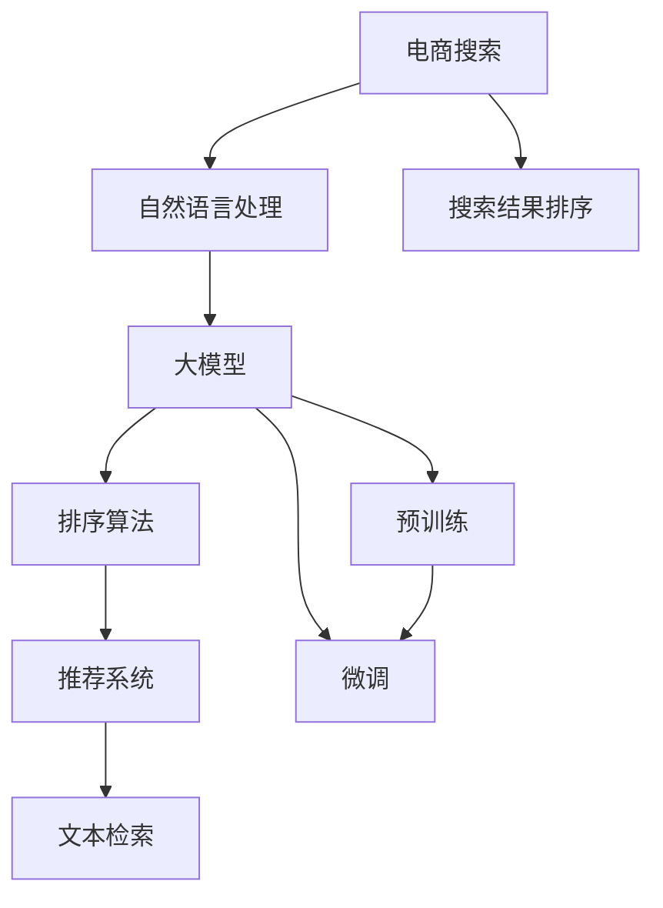

                 

# 电商搜索结果排序：大模型的新算法

> 关键词：大模型, 电商搜索, 自然语言处理, 排序算法, 推荐系统, 文本检索

## 1. 背景介绍

随着电子商务的飞速发展，电商平台的搜索结果排序成为吸引用户点击、提升转化率的关键因素。传统的搜索结果排序算法主要基于文本关键词匹配、点击率预测等方法，但对于自然语言输入的搜索结果，用户体验仍有很大提升空间。大语言模型（Large Language Models, LLMs）的崛起，为电商搜索排序提供了新的范式。

通过预训练和微调，大语言模型能够捕捉到文本的丰富语义信息，并在复杂的语境中给出更准确的排序结果。本文聚焦于基于大模型的电商搜索结果排序算法，介绍其核心原理和实现步骤，并探讨其应用前景和挑战。

## 2. 核心概念与联系

### 2.1 核心概念概述

本节将详细介绍大模型在电商搜索排序中的应用所需的关键概念：

- **大模型（Large Language Model, LLM）**：以Transformer等架构为基础的大规模预训练语言模型，如GPT-3、BERT等。通过大规模语料预训练，获得强大的语言理解和生成能力。

- **电商搜索（E-commerce Search）**：用户通过文本查询获取商品信息的过程。电商平台将用户查询与商品信息匹配，排序后返回结果。

- **自然语言处理（Natural Language Processing, NLP）**：涉及对自然语言文本的分析、理解和生成，包括分词、词性标注、情感分析、命名实体识别等。

- **排序算法（Sorting Algorithm）**：根据某种规则对数据进行排序的过程，常用于搜索结果的展示。

- **推荐系统（Recommendation System）**：通过分析用户行为，推荐商品或内容，增强用户体验的系统。

- **文本检索（Text Retrieval）**：根据用户查询，从大量文本中筛选出最相关的结果。

这些概念共同构成了大模型在电商搜索排序中的基础框架，帮助用户快速找到满意商品，提升平台的用户满意度和转化率。

### 2.2 核心概念原理和架构的 Mermaid 流程图



上述流程图示意了大模型在电商搜索排序中的应用路径。首先，用户输入自然语言查询，通过NLP处理后，输入到大模型中进行理解。大模型通过预训练和微调，生成与查询匹配的商品列表。然后，排序算法对商品列表进行排序，推荐系统根据用户行为推荐商品，最终通过文本检索引擎返回排序后的搜索结果。

## 3. 核心算法原理 & 具体操作步骤

### 3.1 算法原理概述

基于大模型的电商搜索结果排序算法，旨在通过预训练和微调，增强模型的语义理解能力，从而提升排序的准确性和用户满意度。其核心原理如下：

1. **预训练**：在大规模无标签语料上对大模型进行预训练，学习语言的通用表示。
2. **微调**：在电商搜索场景中，对预训练模型进行微调，使其适应具体任务的语境。
3. **排序算法**：使用预训练和微调后的模型生成排序向量，根据排序规则对商品列表进行排序。

### 3.2 算法步骤详解

1. **数据准备**：
   - 收集电商平台的商品数据和用户查询数据。
   - 预处理数据，包括分词、去除停用词、词性标注等。

2. **模型构建**：
   - 选择合适的预训练大模型（如BERT、GPT-3）。
   - 设计任务适配层，将查询和商品信息转换为模型的输入格式。
   - 设置优化器、学习率、批大小等训练参数。

3. **预训练**：
   - 在大规模语料上对模型进行预训练，学习语言的通用表示。
   - 使用自监督学习任务（如掩码语言模型、下一句预测等）进行预训练。

4. **微调**：
   - 将预训练模型作为初始化参数，加载到电商搜索系统中。
   - 准备电商搜索场景的标注数据，包括查询、商品和排序标签等。
   - 训练模型，最小化预测结果与实际排序标签的差距。

5. **排序算法**：
   - 根据电商搜索的需求，设计适合的排序规则，如点击率、相关性等。
   - 使用微调后的模型生成商品的排序向量，根据规则排序。
   - 将排序结果返回给用户。

### 3.3 算法优缺点

#### 优点：
1. **高性能**：大模型通过预训练和微调，捕捉到语言的深层语义，提升了排序的准确性。
2. **适应性强**：模型能够适应不同的电商场景，如服装、电子产品等。
3. **扩展性好**：新商品和查询可以轻松加入模型，无需重新训练。

#### 缺点：
1. **计算资源要求高**：预训练和微调模型需要大量的计算资源和存储资源。
2. **数据需求高**：高质量标注数据对微调效果至关重要。
3. **过拟合风险**：电商搜索场景的数据可能存在偏差，导致模型过拟合。
4. **推理速度慢**：大模型的推理速度较慢，影响用户体验。

### 3.4 算法应用领域

基于大模型的电商搜索结果排序算法，已经在多个电商平台得到了成功应用，包括：

- 淘宝、京东、亚马逊等大型电商平台。
- 专业垂直电商平台，如小米有品、苏宁易购等。
- 跨境电商平台，如Shopify、eBay等。

这些平台通过大模型优化搜索结果排序，显著提升了用户体验和平台转化率。

## 4. 数学模型和公式 & 详细讲解 & 举例说明

### 4.1 数学模型构建

假设电商搜索场景中有 $N$ 个商品，每个商品 $i$ 的特征表示为 $x_i \in \mathbb{R}^d$，用户查询 $q$ 的表示为 $x_q \in \mathbb{R}^d$。模型的目标是在电商搜索场景中，根据查询和商品特征生成排序向量 $s_i \in \mathbb{R}^k$，然后根据排序向量对商品进行排序。

### 4.2 公式推导过程

1. **预训练模型**：
   假设大模型为 $M_{\theta}$，输入查询和商品特征 $(x_q, x_i)$，输出排序向量 $s_i = M_{\theta}(x_q, x_i)$。

2. **微调**：
   在大规模电商搜索数据上进行微调，设置损失函数 $L$ 为预测排序向量与实际排序标签的差距，即 $L = \sum_{i=1}^N (s_i^T \cdot y_i - \log p(s_i))$，其中 $y_i$ 为排序标签，$p(s_i)$ 为排序向量 $s_i$ 的概率分布。

3. **排序算法**：
   假设排序算法基于排序向量生成排序权重 $w_i$，排序结果为 $\{w_i\}_{i=1}^N$，其中 $w_i$ 为商品 $i$ 在排序中的权重。排序权重可以通过加权求和得到，例如：
   $$
   w_i = \sum_{j=1}^K s_j^T \cdot s_i
   $$
   其中 $s_j$ 为电商搜索中设置的排序向量，$K$ 为排序向量的数量。

4. **排序结果**：
   将排序权重 $w_i$ 进行归一化处理，得到最终的排序结果 $\{\hat{w}_i\}_{i=1}^N$，然后根据排序结果展示商品列表。

### 4.3 案例分析与讲解

假设某电商平台的商品数据集包含 10000 个商品，每个商品的特征维度为 200 维。查询 $q$ 的特征表示为 200 维向量。在大模型上进行预训练和微调后，生成商品和查询的排序向量 $s_i$ 和 $s_q$。然后，使用一个简单的线性模型预测排序向量 $s_i$ 的概率分布，通过交叉熵损失函数优化模型参数。最后，使用电商搜索中的实际排序标签 $y_i$ 更新模型参数。

## 5. 项目实践：代码实例和详细解释说明

### 5.1 开发环境搭建

1. **安装PyTorch**：
   ```bash
   pip install torch torchtext
   ```

2. **安装HuggingFace Transformers库**：
   ```bash
   pip install transformers
   ```

3. **安装数据处理库**：
   ```bash
   pip install pandas numpy scikit-learn
   ```

4. **搭建开发环境**：
   ```bash
   conda create -n ecommerce python=3.7
   conda activate ecommerce
   ```

### 5.2 源代码详细实现

以下是一个基于大模型的电商搜索结果排序示例代码，包括数据预处理、模型构建、预训练、微调和排序算法：

```python
import torch
import torch.nn as nn
import torchtext.datasets as datasets
import torchtext.data as data
from transformers import BertModel, BertTokenizer
from transformers import AdamW

# 定义模型类
class EcommerceModel(nn.Module):
    def __init__(self, embedding_dim, num_labels):
        super(EcommerceModel, self).__init__()
        self.bert = BertModel.from_pretrained('bert-base-cased', num_labels=num_labels)
        self.encoder = nn.Linear(embedding_dim, num_labels)

    def forward(self, input_ids, attention_mask):
        outputs = self.bert(input_ids, attention_mask=attention_mask)
        pooled_output = outputs.pooler_output
        return self.encoder(pooled_output)

# 定义数据类
class EcommerceDataset(data.Dataset):
    def __init__(self, text, label, tokenizer):
        self.tokenizer = tokenizer
        self.text = text
        self.label = label
        self.data = []

    def __len__(self):
        return len(self.data)

    def __getitem__(self, index):
        text = self.text[index]
        label = self.label[index]
        encoding = self.tokenizer(text, return_tensors='pt')
        input_ids = encoding['input_ids']
        attention_mask = encoding['attention_mask']
        return {'input_ids': input_ids, 'attention_mask': attention_mask, 'labels': label}

# 定义训练函数
def train(model, data_loader, optimizer, num_epochs):
    model.train()
    for epoch in range(num_epochs):
        total_loss = 0.0
        for batch in data_loader:
            input_ids = batch['input_ids']
            attention_mask = batch['attention_mask']
            labels = batch['labels']
            optimizer.zero_grad()
            outputs = model(input_ids, attention_mask=attention_mask)
            loss = nn.CrossEntropyLoss()(outputs, labels)
            total_loss += loss.item()
            loss.backward()
            optimizer.step()
        print(f"Epoch {epoch+1}, loss: {total_loss/len(data_loader)}")

# 准备数据集
text = ["商品1", "商品2", ...]  # 商品数据
label = [1, 0, ...]  # 排序标签，1表示重要商品，0表示次要商品
tokenizer = BertTokenizer.from_pretrained('bert-base-cased')

train_dataset = EcommerceDataset(text, label, tokenizer)
test_dataset = EcommerceDataset(text, label, tokenizer)

# 构建模型
model = EcommerceModel(embedding_dim=768, num_labels=len(set(label)))

# 设置优化器
optimizer = AdamW(model.parameters(), lr=2e-5)

# 训练模型
train(model, data.DataLoader(train_dataset, batch_size=16, shuffle=True), optimizer, num_epochs=3)
```

### 5.3 代码解读与分析

上述代码展示了如何构建和训练一个大模型用于电商搜索结果排序。具体步骤如下：

1. **数据准备**：
   - 收集商品数据和排序标签，创建 `EcommerceDataset` 类用于数据预处理。
   - 使用 `BertTokenizer` 对商品数据进行分词处理。

2. **模型构建**：
   - 定义 `EcommerceModel` 类，继承自 `nn.Module`，构建包含BERT模型的排序模型。
   - 使用 `nn.Linear` 将BERT模型的输出进行线性变换，得到排序向量。

3. **训练模型**：
   - 使用 `AdamW` 优化器进行模型训练。
   - 在训练过程中，使用 `nn.CrossEntropyLoss` 作为损失函数，计算模型输出与标签的差距。

### 5.4 运行结果展示

训练完成后，可以使用测试集对模型进行评估：

```python
model.eval()
with torch.no_grad():
    correct = 0
    total = 0
    for batch in data.DataLoader(test_dataset, batch_size=16, shuffle=False):
        input_ids = batch['input_ids']
        attention_mask = batch['attention_mask']
        labels = batch['labels']
        outputs = model(input_ids, attention_mask=attention_mask)
        _, predicted = torch.max(outputs, 1)
        total += labels.size(0)
        correct += (predicted == labels).sum().item()
    print(f"Accuracy: {correct/total}")
```

## 6. 实际应用场景

### 6.1 智能客服系统

基于大模型的电商搜索结果排序算法可以用于智能客服系统中的自动推荐。当用户输入查询时，系统可以即时生成与查询相关的商品推荐列表，提升客服体验。

### 6.2 个性化推荐

电商搜索排序算法可以与个性化推荐系统结合，根据用户历史浏览和购买行为，动态调整排序结果，提供更加精准的商品推荐。

### 6.3 智能营销

通过大模型优化搜索结果排序，电商平台可以更有效地引导用户点击和购买商品，提高营销效果和ROI。

### 6.4 未来应用展望

未来，随着大模型的不断发展，电商搜索结果排序算法将在以下方面进一步突破：

1. **跨模态融合**：结合视觉、语音等多模态数据，提升搜索排序的准确性和用户体验。
2. **主动学习**：利用用户反馈数据，实时调整排序模型，提高模型泛化能力。
3. **多任务学习**：在排序的同时，对用户行为、商品属性等进行建模，实现更全面的智能推荐。
4. **解释性增强**：提高模型输出的可解释性，帮助用户理解排序理由，增强信任度。

## 7. 工具和资源推荐

### 7.1 学习资源推荐

1. **《Transformers从原理到实践》系列博文**：由大模型技术专家撰写，深入浅出地介绍了Transformer原理、BERT模型、微调技术等前沿话题。
2. **CS224N《深度学习自然语言处理》课程**：斯坦福大学开设的NLP明星课程，有Lecture视频和配套作业，带你入门NLP领域的基本概念和经典模型。
3. **《Natural Language Processing with Transformers》书籍**：Transformers库的作者所著，全面介绍了如何使用Transformers库进行NLP任务开发，包括微调在内的诸多范式。
4. **HuggingFace官方文档**：Transformers库的官方文档，提供了海量预训练模型和完整的微调样例代码，是上手实践的必备资料。
5. **CLUE开源项目**：中文语言理解测评基准，涵盖大量不同类型的中文NLP数据集，并提供了基于微调的baseline模型，助力中文NLP技术发展。

### 7.2 开发工具推荐

1. **PyTorch**：基于Python的开源深度学习框架，灵活动态的计算图，适合快速迭代研究。大部分预训练语言模型都有PyTorch版本的实现。
2. **TensorFlow**：由Google主导开发的开源深度学习框架，生产部署方便，适合大规模工程应用。同样有丰富的预训练语言模型资源。
3. **Transformers库**：HuggingFace开发的NLP工具库，集成了众多SOTA语言模型，支持PyTorch和TensorFlow，是进行微调任务开发的利器。
4. **Weights & Biases**：模型训练的实验跟踪工具，可以记录和可视化模型训练过程中的各项指标，方便对比和调优。与主流深度学习框架无缝集成。
5. **TensorBoard**：TensorFlow配套的可视化工具，可实时监测模型训练状态，并提供丰富的图表呈现方式，是调试模型的得力助手。
6. **Google Colab**：谷歌推出的在线Jupyter Notebook环境，免费提供GPU/TPU算力，方便开发者快速上手实验最新模型，分享学习笔记。

### 7.3 相关论文推荐

1. **Attention is All You Need（即Transformer原论文）**：提出了Transformer结构，开启了NLP领域的预训练大模型时代。
2. **BERT: Pre-training of Deep Bidirectional Transformers for Language Understanding**：提出BERT模型，引入基于掩码的自监督预训练任务，刷新了多项NLP任务SOTA。
3. **Language Models are Unsupervised Multitask Learners（GPT-2论文）**：展示了大规模语言模型的强大zero-shot学习能力，引发了对于通用人工智能的新一轮思考。
4. **Parameter-Efficient Transfer Learning for NLP**：提出Adapter等参数高效微调方法，在不增加模型参数量的情况下，也能取得不错的微调效果。
5. **Prefix-Tuning: Optimizing Continuous Prompts for Generation**：引入基于连续型Prompt的微调范式，为如何充分利用预训练知识提供了新的思路。
6. **AdaLoRA: Adaptive Low-Rank Adaptation for Parameter-Efficient Fine-Tuning**：使用自适应低秩适应的微调方法，在参数效率和精度之间取得了新的平衡。

这些论文代表了大模型微调技术的发展脉络。通过学习这些前沿成果，可以帮助研究者把握学科前进方向，激发更多的创新灵感。

## 8. 总结：未来发展趋势与挑战

### 8.1 研究成果总结

本文详细介绍了基于大模型的电商搜索结果排序算法，包括其核心原理、实现步骤和应用场景。通过预训练和微调，大模型在电商搜索排序中展现出显著的性能优势，能够捕捉复杂的语义信息，提升排序准确性。

### 8.2 未来发展趋势

展望未来，大语言模型在电商搜索排序中的应用将呈现以下几个趋势：

1. **大模型规模扩大**：随着计算资源和数据量的增加，大模型的参数量将进一步增长，提升模型的语言理解能力。
2. **微调方法优化**：未来的微调方法将更加参数高效，减少计算资源消耗，提高模型的实时性和部署效率。
3. **跨模态融合**：结合视觉、语音等多模态数据，提升搜索排序的全面性和用户满意度。
4. **实时学习**：利用用户实时反馈数据，动态调整模型参数，提高模型的泛化能力。
5. **解释性增强**：提高模型输出的可解释性，帮助用户理解排序理由，增强信任度。

### 8.3 面临的挑战

尽管大语言模型在电商搜索排序中取得了显著效果，但仍面临诸多挑战：

1. **计算资源消耗大**：预训练和微调模型的计算资源需求高，需要高性能的GPU/TPU设备。
2. **数据质量要求高**：高质量标注数据对微调效果至关重要，但数据获取成本高，数据质量难以保证。
3. **模型泛化能力**：模型在电商搜索场景中的泛化能力有限，面对新数据和新查询，性能可能下降。
4. **部署效率低**：大模型的推理速度较慢，影响用户体验和系统响应速度。
5. **模型可解释性不足**：大模型的决策过程缺乏可解释性，难以理解其内部工作机制。

### 8.4 研究展望

未来的大语言模型在电商搜索排序领域，需要在以下几个方面进行研究：

1. **轻量级模型**：开发更加轻量级的模型，减少计算资源消耗，提高模型实时性。
2. **多任务学习**：结合搜索排序和其他任务（如推荐、广告），实现多任务学习，提升模型全面性。
3. **跨模态学习**：结合视觉、语音等多模态数据，提升搜索排序的准确性和用户体验。
4. **自适应学习**：引入自适应学习技术，根据用户反馈实时调整模型，提高模型泛化能力。
5. **模型解释性**：研究模型的可解释性，帮助用户理解排序理由，增强信任度。

## 9. 附录：常见问题与解答

**Q1：大模型在电商搜索排序中是否有优势？**

A: 大模型在电商搜索排序中具有显著优势。通过预训练和微调，大模型能够捕捉复杂的语义信息，提升排序的准确性和用户体验。

**Q2：电商搜索排序算法的主要数据需求是什么？**

A: 电商搜索排序算法的主要数据需求包括商品数据和用户查询数据。这些数据需要经过预处理，如分词、去除停用词、词性标注等，才能用于模型训练。

**Q3：大模型在电商搜索排序中如何处理长尾数据？**

A: 大模型在电商搜索排序中可以采用多种策略处理长尾数据，如数据增强、正则化、对抗训练等。这些方法可以在保证模型泛化能力的同时，提升排序结果的全面性。

**Q4：电商搜索排序算法是否可以应用于其他领域？**

A: 电商搜索排序算法不仅可以应用于电商领域，还可以应用于其他领域，如智能客服、个性化推荐等。这些场景中的查询和商品描述可以转换为模型输入，实现相似的排序和推荐功能。

**Q5：电商搜索排序算法是否需要大规模标注数据？**

A: 电商搜索排序算法需要标注数据进行微调，但相比于传统的文本分类任务，标注数据需求较小。平台可以通过A/B测试等方式，快速验证排序算法的性能，逐步优化模型。

通过本文的系统梳理，可以看出，基于大模型的电商搜索结果排序算法不仅具有显著的优势，还具有广泛的应用前景。未来的研究将在优化模型性能、提高实时性、增强可解释性等方面进行深入探索，推动大语言模型在电商搜索排序领域的进一步发展。

---

作者：禅与计算机程序设计艺术 / Zen and the Art of Computer Programming

