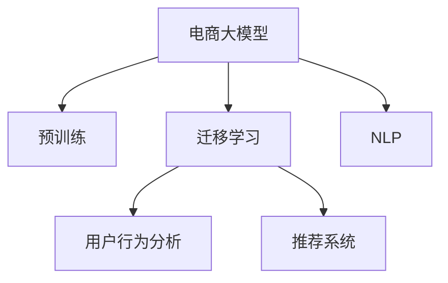

                 

# 电商数据挖掘：AI大模型的新方法

> 关键词：电商数据挖掘, 大模型, 迁移学习, 预训练, 深度学习, 自然语言处理(NLP), 推荐系统, 用户行为分析

## 1. 背景介绍

### 1.1 问题由来
在数字化浪潮的推动下，电商行业正逐步迈入智能商业的新时代。如何从海量电商数据中挖掘出有价值的洞察，成为电商平台的关键课题。传统的数据挖掘方法，往往依赖于手工设计的特征工程和统计模型，难以捕捉数据中的复杂关系和动态变化。近年来，深度学习技术，特别是预训练大模型的兴起，为电商数据挖掘带来了新的突破。

预训练大模型通过在大规模无标签文本数据上进行预训练，学习到通用的语言表示，具备强大的文本处理能力。通过在电商领域的数据上微调，使其能够更好地理解电商场景中的文本数据，从而实现高效、精确的电商数据分析。这种基于预训练大模型的电商数据挖掘方法，被业内称为“电商大模型”。

### 1.2 问题核心关键点
电商大模型的核心在于利用深度学习的强大学习能力，从电商文本数据中提取高层次的语义特征和行为模式。其主要解决的关键问题包括：

1. 文本数据的高效处理：电商大模型通过预训练学习，能够在电商评论、商品描述、用户评论等文本数据上进行高效处理，提取商品、用户、行为等关键信息。
2. 用户行为的精准建模：电商大模型能够学习到用户行为模式，预测用户购买意愿，推荐个性化商品。
3. 电商环境的动态适应：电商大模型能够适应电商环境的快速变化，实时捕捉用户需求和行为变化。
4. 电商业务的多场景应用：电商大模型可以应用于电商广告推荐、商品搜索、用户画像、库存管理等多个电商场景中。

### 1.3 问题研究意义
研究电商大模型的数据挖掘方法，对于电商平台在智能商业的转型升级，具有重要意义：

1. 提升电商数据分析的精度和效率：电商大模型能够自动学习电商数据中的复杂模式和关系，显著提升数据分析的精度和效率。
2. 推动个性化推荐和营销：电商大模型能够理解用户的购买行为和偏好，提供更加精准的商品推荐和营销策略。
3. 优化库存管理和销售预测：电商大模型能够实时预测用户需求，帮助平台优化库存管理，减少库存积压，提升销售效率。
4. 增强用户体验：电商大模型能够提升商品搜索的准确性和个性化推荐的效果，提升用户购物体验。
5. 探索新业务模式：电商大模型能够帮助电商平台挖掘新的业务模式和应用场景，驱动业务创新。

## 2. 核心概念与联系

### 2.1 核心概念概述

为更好地理解基于预训练大模型的电商数据挖掘方法，本节将介绍几个密切相关的核心概念：

- 预训练大模型(Pre-trained Large Model, PLM)：以自回归模型(如GPT)或自编码模型(如BERT)为代表的大规模深度学习模型，通过在大规模无标签文本数据上进行预训练，学习通用的语言表示。
- 迁移学习(Transfer Learning)：将一个领域学习到的知识，迁移应用到另一个不同但相关的领域的学习范式。电商大模型通过迁移学习，从预训练语言模型中获取电商领域的知识。
- 电商数据挖掘(E-commerce Data Mining)：通过数据分析和机器学习技术，从电商数据中挖掘出有价值的洞察，支持电商业务决策的过程。
- 用户行为分析(User Behavior Analysis)：通过对用户行为的分析，理解用户的购买意图、偏好和行为模式，为电商营销和推荐提供支持。
- 推荐系统(Recommendation System)：利用机器学习技术，根据用户历史行为和偏好，推荐相关商品，提升用户购物体验。
- 自然语言处理(Natural Language Processing, NLP)：通过深度学习技术，处理和理解自然语言数据，提取语义特征，支持电商文本数据分析。

这些核心概念之间的逻辑关系可以通过以下Mermaid流程图来展示：



这个流程图展示了大模型在电商数据挖掘中的应用框架，其核心逻辑如下：

1. 电商大模型通过预训练学习到通用的语言表示。
2. 在电商领域的数据上应用迁移学习，将预训练知识迁移到电商场景中。
3. 通过用户行为分析和推荐系统，实现电商业务场景中的具体应用。
4. NLP技术为电商大模型提供了文本数据的处理能力，支持电商文本数据分析。

这些概念共同构成了电商大模型的应用框架，使其能够在电商场景下发挥强大的数据挖掘能力。

## 3. 核心算法原理 & 具体操作步骤
### 3.1 算法原理概述

电商大模型在电商数据挖掘中的应用，本质上是一个迁移学习过程。其核心思想是：将预训练大模型视作一个强大的"特征提取器"，通过在电商领域的数据上微调，使其能够更好地适应电商场景，提取电商数据中的高层次语义特征和行为模式。

形式化地，假设预训练大模型为 $M_{\theta}$，其中 $\theta$ 为预训练得到的模型参数。给定电商领域的数据集 $D=\{(x_i,y_i)\}_{i=1}^N$，其中 $x_i$ 为电商文本数据，$y_i$ 为电商相关的标签（如购买行为、商品评分等）。电商大模型的微调目标是最小化损失函数：

$$
\hat{\theta}=\mathop{\arg\min}_{\theta} \mathcal{L}(M_{\theta},D)
$$

其中 $\mathcal{L}$ 为针对电商任务设计的损失函数，用于衡量模型预测输出与真实标签之间的差异。常见的损失函数包括交叉熵损失、均方误差损失等。

通过梯度下降等优化算法，电商大模型不断更新模型参数 $\theta$，最小化损失函数 $\mathcal{L}$，使得模型输出逼近真实标签。由于 $\theta$ 已经通过预训练获得了较好的初始化，因此即便在电商领域的小规模数据集 $D$ 上进行微调，也能较快收敛到理想的模型参数 $\hat{\theta}$。

### 3.2 算法步骤详解

电商大模型的微调一般包括以下几个关键步骤：

**Step 1: 准备预训练模型和数据集**
- 选择合适的预训练大模型 $M_{\theta}$，如BERT、GPT-3等。
- 准备电商领域的数据集 $D$，包括电商评论、商品描述、用户行为等文本数据，以及相应的电商标签。

**Step 2: 添加任务适配层**
- 根据电商任务类型，在预训练大模型顶层设计合适的输出层和损失函数。
- 对于分类任务，通常在顶层添加线性分类器和交叉熵损失函数。
- 对于生成任务，通常使用语言模型的解码器输出概率分布，并以负对数似然为损失函数。

**Step 3: 设置微调超参数**
- 选择合适的优化算法及其参数，如 AdamW、SGD 等，设置学习率、批大小、迭代轮数等。
- 设置正则化技术及强度，包括权重衰减、Dropout、Early Stopping 等。
- 确定冻结预训练参数的策略，如仅微调顶层，或全部参数都参与微调。

**Step 4: 执行梯度训练**
- 将电商数据集 $D$ 分批次输入模型，前向传播计算损失函数。
- 反向传播计算参数梯度，根据设定的优化算法和学习率更新模型参数。
- 周期性在验证集上评估模型性能，根据性能指标决定是否触发 Early Stopping。
- 重复上述步骤直到满足预设的迭代轮数或 Early Stopping 条件。

**Step 5: 测试和部署**
- 在测试集上评估微调后模型 $M_{\hat{\theta}}$ 的性能，对比微调前后的精度提升。
- 使用微调后的模型对新电商数据进行推理预测，集成到实际的应用系统中。
- 持续收集新的电商数据，定期重新微调模型，以适应数据分布的变化。

以上是电商大模型微调的完整流程。在实际应用中，还需要针对具体电商场景的特点，对微调过程的各个环节进行优化设计，如改进训练目标函数，引入更多的正则化技术，搜索最优的超参数组合等，以进一步提升模型性能。

### 3.3 算法优缺点

电商大模型的微调方法具有以下优点：
1. 高效处理大规模电商数据：电商大模型能够自动学习电商文本中的高层次语义特征，快速处理大规模电商数据。
2. 预测精准度高：电商大模型能够学习到用户行为模式，预测用户购买意愿，提升推荐精度。
3. 适应电商环境的快速变化：电商大模型能够适应电商环境的快速变化，实时捕捉用户需求和行为变化。
4. 适用范围广：电商大模型可以应用于电商广告推荐、商品搜索、用户画像、库存管理等多个电商场景中。

同时，该方法也存在一定的局限性：
1. 依赖高质量电商数据：电商大模型的性能很大程度上取决于电商领域标注数据的质量和数量，标注数据的获取成本较高。
2. 迁移能力有限：当电商领域与预训练数据的分布差异较大时，电商大模型的性能提升有限。
3. 可解释性不足：电商大模型的决策过程通常缺乏可解释性，难以对其推理逻辑进行分析和调试。

尽管存在这些局限性，但就目前而言，电商大模型的微调方法仍然是大规模电商数据挖掘的重要范式。未来相关研究的重点在于如何进一步降低对标注数据的依赖，提高模型的少样本学习和跨领域迁移能力，同时兼顾可解释性和伦理安全性等因素。

### 3.4 算法应用领域

电商大模型的微调方法在电商领域已经得到了广泛的应用，覆盖了电商广告推荐、商品搜索、用户画像、库存管理等多个关键环节，具体应用场景包括：

- **电商广告推荐**：通过用户行为数据分析，预测用户对商品的兴趣，实现精准的广告推荐。电商大模型通过微调，能够理解用户的购买意图和行为模式，提高广告投放的精准度。
- **商品搜索优化**：通过分析用户搜索行为，电商平台可以优化搜索结果，提升用户搜索体验。电商大模型能够提取电商文本中的关键词和语义信息，优化搜索算法。
- **用户画像构建**：电商平台可以通过电商大模型，构建用户画像，了解用户兴趣和行为偏好。电商大模型通过微调，能够学习用户的行为特征，帮助电商平台进行精准营销。
- **库存管理优化**：电商平台可以实时监控库存状态，通过电商大模型预测用户需求，优化库存管理。电商大模型能够理解电商环境的动态变化，辅助库存优化决策。

除了上述这些经典应用场景外，电商大模型还被创新性地应用于电商评论分析、电商舆情监测、智能客服等多个领域，为电商业务的智能化转型提供了新的技术路径。

## 4. 数学模型和公式 & 详细讲解
### 4.1 数学模型构建

本节将使用数学语言对基于预训练大模型的电商大模型微调过程进行更加严格的刻画。

记预训练大模型为 $M_{\theta}$，其中 $\theta$ 为预训练得到的模型参数。假设电商领域的数据集为 $D=\{(x_i,y_i)\}_{i=1}^N, x_i \in \mathcal{X}, y_i \in \mathcal{Y}$。

定义模型 $M_{\theta}$ 在数据样本 $(x,y)$ 上的损失函数为 $\ell(M_{\theta}(x),y)$，则在数据集 $D$ 上的经验风险为：

$$
\mathcal{L}(\theta) = \frac{1}{N} \sum_{i=1}^N \ell(M_{\theta}(x_i),y_i)
$$

电商大模型的微调优化目标是最小化经验风险，即找到最优参数：

$$
\theta^* = \mathop{\arg\min}_{\theta} \mathcal{L}(\theta)
$$

在实践中，我们通常使用基于梯度的优化算法（如SGD、Adam等）来近似求解上述最优化问题。设 $\eta$ 为学习率，$\lambda$ 为正则化系数，则参数的更新公式为：

$$
\theta \leftarrow \theta - \eta \nabla_{\theta}\mathcal{L}(\theta) - \eta\lambda\theta
$$

其中 $\nabla_{\theta}\mathcal{L}(\theta)$ 为损失函数对参数 $\theta$ 的梯度，可通过反向传播算法高效计算。

### 4.2 公式推导过程

以下我们以电商分类任务为例，推导交叉熵损失函数及其梯度的计算公式。

假设模型 $M_{\theta}$ 在输入 $x$ 上的输出为 $\hat{y}=M_{\theta}(x) \in [0,1]$，表示样本属于正类的概率。真实标签 $y \in \{0,1\}$。则二分类交叉熵损失函数定义为：

$$
\ell(M_{\theta}(x),y) = -[y\log \hat{y} + (1-y)\log (1-\hat{y})]
$$

将其代入经验风险公式，得：

$$
\mathcal{L}(\theta) = -\frac{1}{N}\sum_{i=1}^N [y_i\log M_{\theta}(x_i)+(1-y_i)\log(1-M_{\theta}(x_i))]
$$

根据链式法则，损失函数对参数 $\theta_k$ 的梯度为：

$$
\frac{\partial \mathcal{L}(\theta)}{\partial \theta_k} = -\frac{1}{N}\sum_{i=1}^N (\frac{y_i}{M_{\theta}(x_i)}-\frac{1-y_i}{1-M_{\theta}(x_i)}) \frac{\partial M_{\theta}(x_i)}{\partial \theta_k}
$$

其中 $\frac{\partial M_{\theta}(x_i)}{\partial \theta_k}$ 可进一步递归展开，利用自动微分技术完成计算。

在得到损失函数的梯度后，即可带入参数更新公式，完成模型的迭代优化。重复上述过程直至收敛，最终得到适应电商分类任务的最优模型参数 $\theta^*$。

## 5. 项目实践：代码实例和详细解释说明
### 5.1 开发环境搭建

在进行电商大模型微调实践前，我们需要准备好开发环境。以下是使用Python进行PyTorch开发的环境配置流程：

1. 安装Anaconda：从官网下载并安装Anaconda，用于创建独立的Python环境。

2. 创建并激活虚拟环境：
```bash
conda create -n pytorch-env python=3.8 
conda activate pytorch-env
```

3. 安装PyTorch：根据CUDA版本，从官网获取对应的安装命令。例如：
```bash
conda install pytorch torchvision torchaudio cudatoolkit=11.1 -c pytorch -c conda-forge
```

4. 安装Transformers库：
```bash
pip install transformers
```

5. 安装各类工具包：
```bash
pip install numpy pandas scikit-learn matplotlib tqdm jupyter notebook ipython
```

完成上述步骤后，即可在`pytorch-env`环境中开始电商大模型微调的实践。

### 5.2 源代码详细实现

下面我以电商分类任务为例，给出使用Transformers库对BERT模型进行电商大模型微调的PyTorch代码实现。

首先，定义电商分类任务的训练数据处理函数：

```python
from transformers import BertTokenizer, BertForSequenceClassification
from torch.utils.data import Dataset
import torch

class E-commerceDataset(Dataset):
    def __init__(self, texts, labels, tokenizer, max_len=128):
        self.texts = texts
        self.labels = labels
        self.tokenizer = tokenizer
        self.max_len = max_len
        
    def __len__(self):
        return len(self.texts)
    
    def __getitem__(self, item):
        text = self.texts[item]
        label = self.labels[item]
        
        encoding = self.tokenizer(text, return_tensors='pt', max_length=self.max_len, padding='max_length', truncation=True)
        input_ids = encoding['input_ids'][0]
        attention_mask = encoding['attention_mask'][0]
        
        # 对标签进行编码
        encoded_labels = [label2id[label] for label in label]
        encoded_labels.extend([label2id['O']] * (self.max_len - len(encoded_labels)))
        labels = torch.tensor(encoded_labels, dtype=torch.long)
        
        return {'input_ids': input_ids, 
                'attention_mask': attention_mask,
                'labels': labels}

# 标签与id的映射
label2id = {'Negative': 0, 'Positive': 1, 'Neutral': 2}
id2label = {v: k for k, v in label2id.items()}

# 创建dataset
tokenizer = BertTokenizer.from_pretrained('bert-base-cased')

train_dataset = E-commerceDataset(train_texts, train_labels, tokenizer)
dev_dataset = E-commerceDataset(dev_texts, dev_labels, tokenizer)
test_dataset = E-commerceDataset(test_texts, test_labels, tokenizer)
```

然后，定义模型和优化器：

```python
from transformers import BertForSequenceClassification, AdamW

model = BertForSequenceClassification.from_pretrained('bert-base-cased', num_labels=len(label2id))

optimizer = AdamW(model.parameters(), lr=2e-5)
```

接着，定义训练和评估函数：

```python
from torch.utils.data import DataLoader
from tqdm import tqdm
from sklearn.metrics import accuracy_score

device = torch.device('cuda') if torch.cuda.is_available() else torch.device('cpu')
model.to(device)

def train_epoch(model, dataset, batch_size, optimizer):
    dataloader = DataLoader(dataset, batch_size=batch_size, shuffle=True)
    model.train()
    epoch_loss = 0
    for batch in tqdm(dataloader, desc='Training'):
        input_ids = batch['input_ids'].to(device)
        attention_mask = batch['attention_mask'].to(device)
        labels = batch['labels'].to(device)
        model.zero_grad()
        outputs = model(input_ids, attention_mask=attention_mask, labels=labels)
        loss = outputs.loss
        epoch_loss += loss.item()
        loss.backward()
        optimizer.step()
    return epoch_loss / len(dataloader)

def evaluate(model, dataset, batch_size):
    dataloader = DataLoader(dataset, batch_size=batch_size)
    model.eval()
    preds, labels = [], []
    with torch.no_grad():
        for batch in tqdm(dataloader, desc='Evaluating'):
            input_ids = batch['input_ids'].to(device)
            attention_mask = batch['attention_mask'].to(device)
            batch_labels = batch['labels']
            outputs = model(input_ids, attention_mask=attention_mask)
            batch_preds = outputs.logits.argmax(dim=2).to('cpu').tolist()
            batch_labels = batch_labels.to('cpu').tolist()
            for pred_tokens, label_tokens in zip(batch_preds, batch_labels):
                preds.append(pred_tokens[:len(label_tokens)])
                labels.append(label_tokens)
                
    print(accuracy_score(labels, preds))
```

最后，启动训练流程并在测试集上评估：

```python
epochs = 5
batch_size = 16

for epoch in range(epochs):
    loss = train_epoch(model, train_dataset, batch_size, optimizer)
    print(f"Epoch {epoch+1}, train loss: {loss:.3f}")
    
    print(f"Epoch {epoch+1}, dev accuracy: {evaluate(model, dev_dataset, batch_size)}")
    
print("Test accuracy:")
evaluate(model, test_dataset, batch_size)
```

以上就是使用PyTorch对BERT进行电商分类任务微调的完整代码实现。可以看到，得益于Transformers库的强大封装，我们可以用相对简洁的代码完成BERT模型的加载和微调。

### 5.3 代码解读与分析

让我们再详细解读一下关键代码的实现细节：

**E-commerceDataset类**：
- `__init__`方法：初始化电商文本、标签、分词器等关键组件。
- `__len__`方法：返回数据集的样本数量。
- `__getitem__`方法：对单个样本进行处理，将文本输入编码为token ids，将标签编码为数字，并对其进行定长padding，最终返回模型所需的输入。

**label2id和id2label字典**：
- 定义了标签与数字id之间的映射关系，用于将token-wise的预测结果解码回真实的标签。

**训练和评估函数**：
- 使用PyTorch的DataLoader对数据集进行批次化加载，供模型训练和推理使用。
- 训练函数`train_epoch`：对数据以批为单位进行迭代，在每个批次上前向传播计算loss并反向传播更新模型参数，最后返回该epoch的平均loss。
- 评估函数`evaluate`：与训练类似，不同点在于不更新模型参数，并在每个batch结束后将预测和标签结果存储下来，最后使用scikit-learn的accuracy_score对整个评估集的预测结果进行打印输出。

**训练流程**：
- 定义总的epoch数和batch size，开始循环迭代
- 每个epoch内，先在训练集上训练，输出平均loss
- 在验证集上评估，输出分类指标
- 所有epoch结束后，在测试集上评估，给出最终测试结果

可以看到，PyTorch配合Transformers库使得BERT微调的代码实现变得简洁高效。开发者可以将更多精力放在数据处理、模型改进等高层逻辑上，而不必过多关注底层的实现细节。

当然，工业级的系统实现还需考虑更多因素，如模型的保存和部署、超参数的自动搜索、更灵活的任务适配层等。但核心的微调范式基本与此类似。

## 6. 实际应用场景
### 6.1 电商广告推荐

电商广告推荐是电商大模型在电商领域的重要应用场景之一。通过分析用户的电商行为数据，电商大模型能够学习到用户的购买意图和偏好，预测用户对广告的响应情况，实现精准的广告投放。

具体而言，电商大模型可以基于用户的历史购买记录、浏览行为、搜索记录等数据，提取用户行为特征，并预测其对不同广告的响应概率。通过将广告与用户的匹配度进行评分，电商大模型能够优化广告推荐策略，提升广告投放的精准度和效果。

### 6.2 商品搜索优化

电商搜索系统能够帮助用户快速找到需要的商品，提升用户购物体验。电商大模型通过分析用户的搜索历史和搜索模式，优化搜索结果，提升搜索效率和效果。

电商大模型可以基于用户搜索的关键词、短语和语义信息，生成相关商品的推荐列表。通过进一步分析用户的点击行为、停留时间和购买转化率，电商大模型能够实时调整搜索结果，提升搜索精准度。

### 6.3 用户画像构建

用户画像是指基于用户的历史行为数据，构建用户兴趣、偏好和行为特征的过程。电商大模型通过分析用户的电商行为数据，能够构建详细的用户画像，支持电商平台进行精准营销和个性化推荐。

电商大模型可以基于用户的购买记录、浏览历史、搜索行为等数据，提取用户的兴趣点、行为特征和偏好信息。通过将用户画像与电商平台的产品信息进行匹配，电商大模型能够实现个性化的商品推荐和营销策略，提升用户满意度和转化率。

### 6.4 库存管理优化

电商大模型能够实时监控库存状态，预测用户需求，优化库存管理，减少库存积压，提升销售效率。

电商大模型可以基于用户的搜索行为、浏览历史和购买记录，预测用户的购买意愿和需求量。通过将预测结果与实际库存状态进行匹配，电商大模型能够优化库存分配，减少库存积压，提升销售效率。

### 6.5 未来应用展望

随着电商大模型的不断演进，其应用场景还将进一步扩展。未来，电商大模型将在更多电商领域得到应用，带来新的商业模式和创新应用：

- **电商广告精准投放**：基于用户行为数据，电商大模型能够实现更加精准的广告投放，提升广告效果和ROI。
- **商品个性化推荐**：通过分析用户行为数据，电商大模型能够提供更加个性化的商品推荐，提升用户购物体验和转化率。
- **智能客服和聊天机器人**：电商大模型能够实现智能客服和聊天机器人，提升客户服务质量，降低人工成本。
- **电商舆情监测**：基于电商大模型，电商平台能够实时监控舆情动态，及时应对负面信息，提升品牌形象和客户满意度。
- **库存优化与供应链管理**：电商大模型能够优化库存管理和供应链决策，提升物流效率和库存周转率。

## 7. 工具和资源推荐
### 7.1 学习资源推荐

为了帮助开发者系统掌握电商大模型的应用技术，这里推荐一些优质的学习资源：

1. 《深度学习与电商》系列博文：深度学习技术在电商领域的应用，涵盖电商广告推荐、商品搜索优化、库存管理等多个电商场景。

2. CS229《机器学习》课程：斯坦福大学开设的经典机器学习课程，深入浅出地介绍了机器学习的基础理论和算法，适合电商大模型的入门学习。

3. 《电子商务数据挖掘》书籍：详细介绍了电子商务数据挖掘技术，包括电商广告推荐、商品搜索优化、用户画像构建等多个电商场景的应用。

4. 《大规模预训练模型在电商中的应用》论文：介绍了在大规模预训练模型基础上，电商领域的应用场景和实践方法，包括电商广告推荐、商品搜索优化、用户画像构建等多个电商场景。

5. E-commerce Data Mining OpenCourseWare：由加州大学圣地亚哥分校开设的在线课程，深入介绍了电商数据挖掘技术和方法，适合电商大模型的系统学习。

通过对这些资源的学习实践，相信你一定能够快速掌握电商大模型的应用精髓，并用于解决实际的电商问题。
### 7.2 开发工具推荐

高效的电商大模型开发需要依赖优秀的工具支持。以下是几款用于电商大模型开发的常用工具：

1. PyTorch：基于Python的开源深度学习框架，灵活动态的计算图，适合快速迭代研究。大部分预训练语言模型都有PyTorch版本的实现。

2. TensorFlow：由Google主导开发的开源深度学习框架，生产部署方便，适合大规模工程应用。同样有丰富的预训练语言模型资源。

3. Transformers库：HuggingFace开发的NLP工具库，集成了众多SOTA语言模型，支持PyTorch和TensorFlow，是进行电商大模型开发的利器。

4. Weights & Biases：模型训练的实验跟踪工具，可以记录和可视化模型训练过程中的各项指标，方便对比和调优。与主流深度学习框架无缝集成。

5. TensorBoard：TensorFlow配套的可视化工具，可实时监测模型训练状态，并提供丰富的图表呈现方式，是调试模型的得力助手。

6. Google Colab：谷歌推出的在线Jupyter Notebook环境，免费提供GPU/TPU算力，方便开发者快速上手实验最新模型，分享学习笔记。

合理利用这些工具，可以显著提升电商大模型的开发效率，加快创新迭代的步伐。

### 7.3 相关论文推荐

电商大模型的研究源于学界的持续探索。以下是几篇奠基性的相关论文，推荐阅读：

1. Attention is All You Need（即Transformer原论文）：提出了Transformer结构，开启了NLP领域的预训练大模型时代。

2. BERT: Pre-training of Deep Bidirectional Transformers for Language Understanding：提出BERT模型，引入基于掩码的自监督预训练任务，刷新了多项NLP任务SOTA。

3. Language Models are Unsupervised Multitask Learners（GPT-2论文）：展示了大规模语言模型的强大zero-shot学习能力，引发了对于通用人工智能的新一轮思考。

4. Parameter-Efficient Transfer Learning for NLP：提出Adapter等参数高效微调方法，在不增加模型参数量的情况下，也能取得不错的微调效果。

5. Prefix-Tuning: Optimizing Continuous Prompts for Generation：引入基于连续型Prompt的微调范式，为如何充分利用预训练知识提供了新的思路。

6. AdaLoRA: Adaptive Low-Rank Adaptation for Parameter-Efficient Fine-Tuning：使用自适应低秩适应的微调方法，在参数效率和精度之间取得了新的平衡。

这些论文代表了大语言模型微调技术的发展脉络。通过学习这些前沿成果，可以帮助研究者把握学科前进方向，激发更多的创新灵感。

## 8. 总结：未来发展趋势与挑战

### 8.1 总结

本文对基于预训练大模型的电商大模型微调方法进行了全面系统的介绍。首先阐述了电商大模型的研究背景和意义，明确了电商大模型在智能商业转型中的重要作用。其次，从原理到实践，详细讲解了电商大模型的数学原理和关键步骤，给出了电商大模型微调任务开发的完整代码实例。同时，本文还广泛探讨了电商大模型在电商广告推荐、商品搜索优化、用户画像构建等多个电商场景中的应用前景，展示了电商大模型的巨大潜力。此外，本文精选了电商大模型的各类学习资源，力求为读者提供全方位的技术指引。

通过本文的系统梳理，可以看到，电商大模型通过迁移学习的方式，从预训练大模型中获取电商领域的知识，能够在电商场景下发挥强大的数据挖掘能力。电商大模型通过微调，提升了电商广告推荐、商品搜索优化、用户画像构建等电商场景的精准度和效果，为电商业务的智能化转型提供了新的技术路径。未来，伴随预训练大模型和微调方法的不断演进，相信电商大模型将带来更多的电商场景创新，推动电商业务的智能化升级。

### 8.2 未来发展趋势

展望未来，电商大模型的发展趋势包括以下几个方面：

1. 模型规模不断增大：随着算力成本的下降和数据规模的扩张，电商大模型的参数量还将持续增长。超大规模电商大模型蕴含的丰富电商知识，有望支撑更加复杂多变的电商数据挖掘任务。

2. 微调方法日益多样化：除了传统的全参数微调外，未来会涌现更多参数高效的微调方法，如Adapter、Prefix等，在节省计算资源的同时也能保证微调精度。

3. 电商环境动态适应：电商大模型能够适应电商环境的快速变化，实时捕捉用户需求和行为变化。结合实时数据进行微调，进一步提升电商大模型的实时性和精准性。

4. 用户行为深度理解：电商大模型将更深入地理解用户行为模式，能够通过微调学习到更多关于用户行为的动态信息，提供更精准的电商业务决策支持。

5. 跨领域知识整合：电商大模型将更好地与外部知识库、规则库等专家知识结合，形成更加全面、准确的信息整合能力，提升电商业务的智能化水平。

6. 模型通用性增强：电商大模型将具备更强的跨领域迁移能力，能够应用于更多电商场景，推动电商业务的全面智能化升级。

以上趋势凸显了电商大模型在电商数据挖掘中的巨大潜力。这些方向的探索发展，必将进一步提升电商大模型的性能和应用范围，为电商业务的智能化转型提供新的技术路径。

### 8.3 面临的挑战

尽管电商大模型在电商数据挖掘中取得了显著进展，但在迈向更加智能化、普适化应用的过程中，仍面临诸多挑战：

1. 标注数据获取难度大：电商大模型的性能很大程度上取决于电商领域标注数据的质量和数量，标注数据的获取成本较高。如何降低对标注数据的依赖，提升少样本学习能力和跨领域迁移能力，还需要更多研究和实践。

2. 模型鲁棒性不足：电商大模型面对电商领域的数据，其泛化性能往往不如在通用数据上的表现。如何提高电商大模型的鲁棒性，避免过拟合和灾难性遗忘，还需要进一步优化和改进。

3. 实时性要求高：电商大模型需要在实时数据上快速进行微调，以捕捉用户行为的动态变化。如何在保证微调精度的同时，提高模型的实时处理能力，需要优化算法和模型结构。

4. 计算资源消耗大：电商大模型的参数量和计算复杂度较大，需要耗费大量的计算资源进行训练和推理。如何在减少资源消耗的前提下，提高电商大模型的性能，是未来的一个重要研究方向。

5. 模型可解释性不足：电商大模型的决策过程通常缺乏可解释性，难以对其推理逻辑进行分析和调试。如何赋予电商大模型更强的可解释性，增强用户信任和业务透明度，是电商大模型应用中亟待解决的问题。

6. 安全性有待保障：电商大模型可能学习到电商领域的潜在风险和有害信息，传播不良内容。如何确保电商大模型的安全性，避免恶意用途，需要加强模型监控和数据审核。

面对电商大模型面临的这些挑战，未来的研究需要在以下几个方面寻求新的突破：

1. 探索无监督和半监督微调方法：摆脱对大规模标注数据的依赖，利用自监督学习、主动学习等无监督和半监督范式，最大限度利用非结构化数据，实现更加灵活高效的电商大模型微调。

2. 研究参数高效和计算高效的微调范式：开发更加参数高效的微调方法，在固定大部分预训练参数的同时，只更新极少量的任务相关参数。同时优化电商大模型的计算图，减少前向传播和反向传播的资源消耗，实现更加轻量级、实时性的部署。

3. 引入更多先验知识：将符号化的先验知识，如知识图谱、逻辑规则等，与神经网络模型进行巧妙融合，引导电商大模型学习更准确、合理的电商知识。同时加强不同模态数据的整合，实现视觉、语音等多模态信息与电商文本信息的协同建模。

4. 结合因果分析和博弈论工具：将因果分析方法引入电商大模型，识别出模型决策的关键特征，增强输出解释的因果性和逻辑性。借助博弈论工具刻画人机交互过程，主动探索并规避模型的脆弱点，提高系统稳定性。

5. 纳入伦理道德约束：在模型训练目标中引入伦理导向的评估指标，过滤和惩罚有偏见、有害的输出倾向。同时加强人工干预和审核，建立模型行为的监管机制，确保输出符合人类价值观和伦理道德。

这些研究方向的探索，必将引领电商大模型微调技术迈向更高的台阶，为构建安全、可靠、可解释、可控的智能系统铺平道路。面向未来，电商大模型微调技术还需要与其他人工智能技术进行更深入的融合，如知识表示、因果推理、强化学习等，多路径协同发力，共同推动电商数据挖掘技术的进步。只有勇于创新、敢于突破，才能不断拓展电商大模型的边界，让智能技术更好地造福电商业务。

### 8.4 研究展望

未来，电商大模型的研究将聚焦于以下几个方向：

1. **多模态电商数据挖掘**：结合视觉、语音、文本等多种数据，进行更加全面、深入的电商数据挖掘。多模态电商大模型能够从不同角度理解电商环境，提升电商业务决策的准确性和全面性。

2. **个性化电商推荐**：结合电商大模型和推荐系统技术，实现更加精准、个性化的电商推荐。个性化电商大模型能够学习到用户的个性化偏好，优化推荐算法，提升用户体验。

3. **电商舆情监测与治理**：结合电商大模型和舆情分析技术，实现电商舆情动态监测和治理。电商大模型能够实时分析电商评论、社交媒体等电商舆情数据，帮助电商平台及时应对负面舆情，提升品牌形象和客户满意度。

4. **电商智能客服**：结合电商大模型和自然语言处理技术，实现智能客服和聊天机器人。电商大模型能够理解电商用户的问题和需求，提供智能客服和聊天机器人服务，提升客户服务质量。

5. **电商场景自适应**：结合电商大模型和场景自适应技术，实现电商大模型在不同场景下的自适应能力。电商大模型能够根据电商场景的特点，动态调整模型结构和参数，提升模型的泛化性能和应用效果。

6. **电商知识图谱构建**：结合电商大模型和知识图谱技术，构建电商领域的知识图谱，支持电商业务的智能化决策。电商大模型能够学习到电商领域的知识图谱，辅助电商平台进行智能决策和业务分析。

这些研究方向将推动电商大模型在电商业务中的广泛应用，为电商业务的智能化转型提供新的技术路径。随着电商大模型的不断演进，相信其将在电商数据挖掘中发挥越来越重要的作用，推动电商业务的全面智能化升级。

## 9. 附录：常见问题与解答
**Q1：电商大模型是否适用于所有电商场景？**

A: 电商大模型在大多数电商场景中都能取得不错的效果，特别是对于数据量较小的场景。但对于一些特定领域的场景，如专业电商平台、细分市场等，电商大模型可能需要进一步微调或引入领域特定的先验知识，才能达到理想的性能。

**Q2：电商大模型的微调过程中，如何选择合适的超参数？**

A: 电商大模型的微调过程中，选择合适的超参数是关键。一般建议从学习率、批大小、迭代轮数等常用超参数开始调参，逐步调整。可以设置一个超参数搜索空间，使用网格搜索或随机搜索的方法，找到最优的超参数组合。也可以使用自动超参数调优方法，如贝叶斯优化、遗传算法等，自动搜索最优超参数。

**Q3：电商大模型的性能受到哪些因素影响？**

A: 电商大模型的性能受到以下因素的影响：
1. 数据质量：电商大模型的性能很大程度上取决于电商领域标注数据的质量和数量，标注数据的获取成本较高。
2. 模型结构：电商大模型的结构设计也会影响其性能，过于复杂或简单的模型都可能带来性能损失。
3. 算法选择：电商大模型的微调算法和优化方法，也会影响其性能表现。
4. 超参数设置：电商大模型的超参数设置，包括学习率、批大小、迭代轮数等，也会影响其性能。
5. 计算资源：电商大模型的计算资源需求较高，较大的模型参数量和计算复杂度会导致性能损失。

**Q4：电商大模型在电商领域的应用场景有哪些？**

A: 电商大模型在电商领域的应用场景广泛，包括：
1. 电商广告推荐：通过用户行为数据分析，实现精准的广告投放。
2. 商品搜索优化：通过分析用户搜索历史和搜索模式，优化搜索结果。
3. 用户画像构建：通过电商行为数据，构建详细的用户画像，支持精准营销。
4. 库存管理优化：通过实时监控库存状态，预测用户需求，优化库存管理。
5. 智能客服和聊天机器人：实现智能客服和聊天机器人，提升客户服务质量。
6. 电商舆情监测：通过电商大模型，实时监控电商舆情动态，及时应对负面信息。

**Q5：电商大模型在电商领域有哪些创新应用？**

A: 电商大模型在电商领域有许多创新应用，包括：
1. 实时广告投放：通过实时监控用户行为，动态调整广告投放策略。
2. 商品个性化推荐：通过分析用户行为数据，提供个性化的商品推荐。
3. 用户需求预测：通过电商大模型预测用户需求，优化库存管理和物流决策。
4. 智能客服和聊天机器人：实现智能客服和聊天机器人，提升客户服务质量。
5. 电商舆情监测与治理：实时监控电商舆情动态，及时应对负面信息，提升品牌形象和客户满意度。
6. 电商场景自适应：根据电商场景的特点，动态调整模型结构和参数，提升模型的泛化性能和应用效果。

这些应用将推动电商大模型在电商业务中的广泛应用，为电商业务的智能化转型提供新的技术路径。随着电商大模型的不断演进，相信其将在电商数据挖掘中发挥越来越重要的作用，推动电商业务的全面智能化升级。

