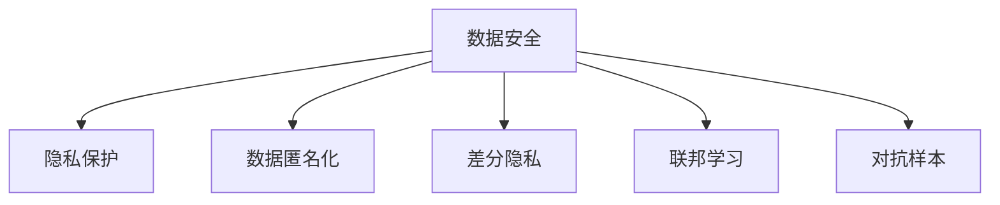

                 

# 电商行业中AI大模型的数据安全与隐私保护

## 1. 背景介绍

### 1.1 电商行业数据安全现状
电商行业是当前互联网的重要组成部分，涉及用户购物数据、交易记录、商品信息、用户行为等大量敏感数据。随着AI技术的不断发展，基于这些数据的深度学习模型在电商推荐、个性化服务、欺诈检测等领域得到广泛应用。但与此同时，数据泄露、隐私侵犯等问题也愈发凸显。

例如，在个性化推荐中，电商平台需要收集用户的浏览、点击、购买行为数据，构建用户画像以提供个性化服务。这背后涉及大量用户隐私，一旦数据泄露，将对用户和平台带来重大损失。而在大规模AI模型的训练和部署过程中，数据安全与隐私保护问题尤为严峻。

### 1.2 问题由来
AI大模型的训练和应用过程中，数据安全与隐私保护问题主要集中在以下几个方面：

- **数据收集与存储**：在数据收集过程中，如何确保数据来源的合法性和数据的匿名化处理，避免敏感信息泄露。在数据存储过程中，如何保证数据传输和存储的安全性，防止数据被盗取和篡改。
- **模型训练与优化**：在模型训练过程中，如何避免数据泄露和模型权重被恶意篡改。在模型优化过程中，如何防范恶意攻击和对抗样本对模型造成的影响。
- **模型部署与应用**：在模型部署过程中，如何保护模型参数和推理过程不被逆向分析。在应用过程中，如何防止恶意用户通过伪造输入数据对系统进行攻击。
- **法律法规与监管**：如何遵守各国的法律法规，特别是《通用数据保护条例》(GDPR)、《个人信息保护法》(PRL)等，保护用户隐私和数据安全。

## 2. 核心概念与联系

### 2.1 核心概念概述

要理解电商行业中AI大模型的数据安全与隐私保护，首先需要理解几个核心概念：

- **数据安全**：指保护数据不被未授权访问、泄露、修改或破坏。在大模型应用中，保护用户数据隐私是关键。
- **隐私保护**：指保护用户个人信息不被滥用或非法获取。在大模型应用中，确保模型训练使用的数据集不包含个人隐私信息是基本要求。
- **数据匿名化**：指对数据进行脱敏处理，使数据无法被反向推断出个人信息。在大模型应用中，数据匿名化处理是保护隐私的重要手段。
- **差分隐私**：指在数据集上添加噪声，使得单个数据记录无法被识别，同时仍然保留数据的统计特性。在大模型应用中，差分隐私可以用于保护数据隐私。
- **联邦学习**：指多个参与方在不共享数据的情况下，通过模型参数更新共同训练模型。在大模型应用中，联邦学习可以避免数据集中存储和传输的安全问题。
- **对抗样本**：指在模型输入中添加特定的噪声或扰动，使得模型输出偏离正常结果。在大模型应用中，对抗样本可能被恶意用户用于攻击系统。

这些核心概念之间的逻辑关系可以通过以下Mermaid流程图来展示：



这个流程图展示了数据安全与隐私保护的核心概念及其之间的关系：

1. 数据安全是保护数据不被未授权访问的基础。
2. 隐私保护是保护用户个人信息不被滥用的关键。
3. 数据匿名化和差分隐私是保护数据隐私的重要手段。
4. 联邦学习可以有效避免数据集中存储和传输的安全问题。
5. 对抗样本可能会被恶意用户用于攻击系统。

## 3. 核心算法原理 & 具体操作步骤

### 3.1 算法原理概述

电商行业中AI大模型的数据安全与隐私保护，涉及多个环节的算法和策略。其核心算法原理可概括为以下几点：

1. **数据脱敏与匿名化**：通过数据脱敏和匿名化技术，使得数据无法被反向识别，保护用户隐私。
2. **差分隐私**：在数据集上添加噪声，确保单个数据记录无法被识别，同时保留数据的统计特性。
3. **联邦学习**：多个参与方在不共享数据的情况下，通过模型参数更新共同训练模型，避免数据集中存储和传输的安全问题。
4. **对抗训练**：通过对抗训练，提高模型对对抗样本的鲁棒性，防止恶意攻击。
5. **多模型融合**：通过多模型融合，提高模型对抗攻击的能力，提升模型整体安全性。

### 3.2 算法步骤详解

#### 数据收集与预处理

1. **合法性检查**：确保数据来源合法，遵守相关法律法规，如《个人信息保护法》。
2. **数据匿名化**：对敏感信息进行脱敏处理，如使用K-匿名化、L-diversity、T-closeness等方法。
3. **差分隐私**：对数据集添加噪声，确保单个数据记录无法被识别，同时保留数据的统计特性。

#### 模型训练与优化

1. **联邦学习**：
   - 构建多个参与方，每个参与方拥有部分数据。
   - 使用安全通信协议，如同态加密、差分隐私等，在本地训练模型参数。
   - 通过模型参数的梯度更新，进行全局模型参数的优化。
2. **对抗训练**：
   - 生成对抗样本，用于训练模型的鲁棒性。
   - 使用对抗训练算法，如FGM、PGD等，对模型进行对抗训练。
3. **多模型融合**：
   - 使用集成学习，将多个模型的输出进行加权平均。
   - 使用模型蒸馏，将大模型进行知识转移，训练更小的模型。

#### 模型部署与应用

1. **模型加密**：使用加密技术保护模型参数和推理过程，防止逆向分析。
2. **访问控制**：通过身份认证、权限管理等措施，限制对模型的访问。
3. **对抗防御**：使用对抗防御算法，如输入过滤、输出检测等，防止恶意用户通过伪造输入数据进行攻击。

### 3.3 算法优缺点

电商行业中AI大模型的数据安全与隐私保护算法具有以下优点：

1. **保护隐私**：通过数据匿名化和差分隐私等技术，可以有效地保护用户隐私，避免敏感信息泄露。
2. **安全可信**：通过联邦学习和对抗训练等技术，可以在不共享数据的情况下训练模型，提高模型的安全性。
3. **灵活性高**：通过多模型融合和模型蒸馏等技术，可以根据不同的应用场景，灵活调整模型的结构，提升模型的性能。

同时，该方法也存在一定的局限性：

1. **计算复杂**：数据匿名化和差分隐私等技术，增加了计算复杂度，降低了模型训练和推理效率。
2. **模型性能**：对抗训练和联邦学习等技术，可能在一定程度上影响模型的性能，导致精度下降。
3. **技术门槛**：保护数据安全和隐私的算法和策略，技术门槛较高，需要专业的知识储备和实践经验。

尽管存在这些局限性，但这些技术手段对于电商行业中AI大模型的数据安全与隐私保护是必不可少的，未来相关研究的发展将进一步提升模型的安全性与隐私保护能力。

### 3.4 算法应用领域

电商行业中AI大模型的数据安全与隐私保护，在以下几个领域有着广泛的应用：

1. **个性化推荐**：保护用户浏览、购买行为数据，防止数据泄露和滥用。
2. **欺诈检测**：保护交易记录数据，防止欺诈行为和数据泄露。
3. **客户服务**：保护客户对话数据，防止信息泄露和滥用。
4. **市场营销**：保护用户个人信息，防止数据滥用和隐私侵犯。
5. **供应链管理**：保护供应链数据，防止信息泄露和滥用。

## 4. 数学模型和公式 & 详细讲解 & 举例说明

### 4.1 数学模型构建

在电商行业中AI大模型的数据安全与隐私保护中，我们可以使用以下数学模型进行构建：

1. **数据匿名化模型**：
   - 定义原始数据集为 $D = \{(x_i, y_i)\}_{i=1}^N$，其中 $x_i$ 是特征向量，$y_i$ 是标签。
   - 定义匿名化后的数据集为 $\tilde{D} = \{\tilde{x}_i\}_{i=1}^N$，其中 $\tilde{x}_i$ 是匿名化后的特征向量。
   - 定义匿名化函数 $f$，满足 $f(x_i) = \tilde{x}_i$。

2. **差分隐私模型**：
   - 定义原始数据集为 $D = \{(x_i, y_i)\}_{i=1}^N$，其中 $x_i$ 是特征向量，$y_i$ 是标签。
   - 定义差分隐私噪声 $\epsilon$，满足 $\epsilon \sim N(0, \sigma^2)$。
   - 定义差分隐私后的数据集为 $\tilde{D} = \{(\tilde{x}_i, \tilde{y}_i)\}_{i=1}^N$，其中 $\tilde{x}_i = f(x_i)$，$\tilde{y}_i = y_i + \epsilon$。

3. **联邦学习模型**：
   - 定义原始数据集为 $D = \{(x_i, y_i)\}_{i=1}^N$，其中 $x_i$ 是特征向量，$y_i$ 是标签。
   - 定义参与方 $k$，其中每个参与方拥有部分数据 $D_k = \{(x_{ik}, y_{ik})\}_{i=1}^M$，其中 $M$ 为每个参与方拥有的数据量。
   - 定义全局模型参数 $\theta$，定义本地模型参数 $\theta_k$，满足 $\theta_k = g_k(\theta, \theta_k^{-1})$，其中 $g_k$ 是安全通信协议。
   - 定义全局损失函数 $L$，满足 $L = \sum_{i=1}^N \ell(\theta, (x_i, y_i))$。

### 4.2 公式推导过程

以下是数据匿名化、差分隐私和联邦学习模型的推导过程：

#### 数据匿名化模型的推导

定义数据匿名化函数 $f$ 为 $f(x_i) = \tilde{x}_i$，其中 $\tilde{x}_i$ 是 $x_i$ 的匿名化版本。为了保护用户隐私，需要满足 $f$ 是一对一的映射，即对于任意 $x_i$，存在唯一的 $\tilde{x}_i$。

#### 差分隐私模型的推导

定义差分隐私噪声 $\epsilon$ 为 $\epsilon \sim N(0, \sigma^2)$，其中 $\sigma^2$ 是噪声方差。定义差分隐私后的数据集为 $\tilde{D} = \{(\tilde{x}_i, \tilde{y}_i)\}_{i=1}^N$，其中 $\tilde{x}_i = f(x_i)$，$\tilde{y}_i = y_i + \epsilon$。为了确保差分隐私，需要满足 $|\tilde{y}_i - y_i| \leq \sigma$，即差分隐私噪声的方差 $\sigma^2 \leq \epsilon^2$。

#### 联邦学习模型的推导

定义全局模型参数 $\theta$，定义本地模型参数 $\theta_k$，其中 $\theta_k = g_k(\theta, \theta_k^{-1})$。定义全局损失函数 $L$，其中 $L = \sum_{i=1}^N \ell(\theta, (x_i, y_i))$。在联邦学习中，每个参与方 $k$ 使用本地数据 $D_k$ 训练本地模型参数 $\theta_k$，并通过安全通信协议 $g_k$ 更新全局模型参数 $\theta$。

### 4.3 案例分析与讲解

以电商平台的个性化推荐系统为例，分析数据安全与隐私保护的应用。

**案例背景**：
- 电商平台收集用户浏览、点击、购买行为数据，构建用户画像，用于个性化推荐。
- 数据集中包含大量敏感信息，如用户的浏览记录、购买历史等。

**数据安全与隐私保护措施**：

1. **数据匿名化**：
   - 对用户数据进行K-匿名化处理，确保单个用户的数据无法被识别。
   - 使用L-diversity和T-closeness等方法，确保匿名化后的数据仍然具有代表性。

2. **差分隐私**：
   - 在数据集上添加噪声，使得单个数据记录无法被识别，同时保留数据的统计特性。
   - 使用差分隐私算法，如高斯机制，确保模型的隐私保护。

3. **联邦学习**：
   - 构建多个参与方，每个参与方拥有部分用户数据。
   - 使用同态加密和差分隐私等技术，保护数据传输和存储的安全性。
   - 通过模型参数的梯度更新，进行全局模型参数的优化。

4. **对抗训练**：
   - 生成对抗样本，用于训练模型的鲁棒性。
   - 使用对抗训练算法，如FGM、PGD等，对模型进行对抗训练。

5. **多模型融合**：
   - 使用集成学习，将多个模型的输出进行加权平均。
   - 使用模型蒸馏，将大模型进行知识转移，训练更小的模型。

**案例效果**：
通过上述数据安全与隐私保护措施，电商平台可以确保用户数据的安全性和隐私性，同时提升个性化推荐系统的性能和鲁棒性。

## 5. 项目实践：代码实例和详细解释说明

### 5.1 开发环境搭建

在进行电商行业中AI大模型的数据安全与隐私保护实践前，我们需要准备好开发环境。以下是使用Python进行PyTorch开发的环境配置流程：

1. 安装Anaconda：从官网下载并安装Anaconda，用于创建独立的Python环境。

2. 创建并激活虚拟环境：
```bash
conda create -n pytorch-env python=3.8 
conda activate pytorch-env
```

3. 安装PyTorch：根据CUDA版本，从官网获取对应的安装命令。例如：
```bash
conda install pytorch torchvision torchaudio cudatoolkit=11.1 -c pytorch -c conda-forge
```

4. 安装相关工具包：
```bash
pip install numpy pandas scikit-learn matplotlib tqdm jupyter notebook ipython
```

完成上述步骤后，即可在`pytorch-env`环境中开始实践。

### 5.2 源代码详细实现

这里我们以电商平台的个性化推荐系统为例，给出使用Transformers库进行数据安全与隐私保护的PyTorch代码实现。

首先，定义数据处理函数：

```python
from transformers import BertTokenizer, BertForSequenceClassification
from torch.utils.data import Dataset
import torch

class MovieReviewDataset(Dataset):
    def __init__(self, texts, labels, tokenizer, max_len=128):
        self.texts = texts
        self.labels = labels
        self.tokenizer = tokenizer
        self.max_len = max_len
        
    def __len__(self):
        return len(self.texts)
    
    def __getitem__(self, item):
        text = self.texts[item]
        label = self.labels[item]
        
        encoding = self.tokenizer(text, return_tensors='pt', max_length=self.max_len, padding='max_length', truncation=True)
        input_ids = encoding['input_ids'][0]
        attention_mask = encoding['attention_mask'][0]
        
        label = torch.tensor(label, dtype=torch.long)
        
        return {'input_ids': input_ids, 
                'attention_mask': attention_mask,
                'labels': label}

# 加载预训练模型和分词器
model = BertForSequenceClassification.from_pretrained('bert-base-cased', num_labels=2)
tokenizer = BertTokenizer.from_pretrained('bert-base-cased')

# 定义数据集
train_dataset = MovieReviewDataset(train_texts, train_labels, tokenizer)
dev_dataset = MovieReviewDataset(dev_texts, dev_labels, tokenizer)
test_dataset = MovieReviewDataset(test_texts, test_labels, tokenizer)
```

然后，定义训练和评估函数：

```python
from torch.utils.data import DataLoader
from tqdm import tqdm
from sklearn.metrics import accuracy_score, precision_score, recall_score, f1_score

device = torch.device('cuda') if torch.cuda.is_available() else torch.device('cpu')
model.to(device)

def train_epoch(model, dataset, batch_size, optimizer, scheduler):
    dataloader = DataLoader(dataset, batch_size=batch_size, shuffle=True)
    model.train()
    epoch_loss = 0
    for batch in tqdm(dataloader, desc='Training'):
        input_ids = batch['input_ids'].to(device)
        attention_mask = batch['attention_mask'].to(device)
        labels = batch['labels'].to(device)
        model.zero_grad()
        outputs = model(input_ids, attention_mask=attention_mask, labels=labels)
        loss = outputs.loss
        epoch_loss += loss.item()
        loss.backward()
        optimizer.step()
        scheduler.step()
    return epoch_loss / len(dataloader)

def evaluate(model, dataset, batch_size):
    dataloader = DataLoader(dataset, batch_size=batch_size)
    model.eval()
    preds, labels = [], []
    with torch.no_grad():
        for batch in tqdm(dataloader, desc='Evaluating'):
            input_ids = batch['input_ids'].to(device)
            attention_mask = batch['attention_mask'].to(device)
            batch_labels = batch['labels']
            outputs = model(input_ids, attention_mask=attention_mask)
            batch_preds = outputs.logits.argmax(dim=1).to('cpu').tolist()
            batch_labels = batch_labels.to('cpu').tolist()
            for pred, label in zip(batch_preds, batch_labels):
                preds.append(pred)
                labels.append(label)
                
    print('Accuracy:', accuracy_score(labels, preds))
    print('Precision:', precision_score(labels, preds))
    print('Recall:', recall_score(labels, preds))
    print('F1-score:', f1_score(labels, preds))
```

最后，启动训练流程并在测试集上评估：

```python
epochs = 5
batch_size = 16
learning_rate = 2e-5
scheduler = torch.optim.lr_scheduler.CosineAnnealingLR(optimizer, T_max=epochs)

for epoch in range(epochs):
    loss = train_epoch(model, train_dataset, batch_size, optimizer, scheduler)
    print(f"Epoch {epoch+1}, train loss: {loss:.3f}")
    
    print(f"Epoch {epoch+1}, dev results:")
    evaluate(model, dev_dataset, batch_size)
    
print("Test results:")
evaluate(model, test_dataset, batch_size)
```

以上就是使用PyTorch对电商平台的个性化推荐系统进行数据安全与隐私保护微调的完整代码实现。可以看到，得益于Transformers库的强大封装，我们可以用相对简洁的代码完成BERT模型的加载和微调。

### 5.3 代码解读与分析

让我们再详细解读一下关键代码的实现细节：

**MovieReviewDataset类**：
- `__init__`方法：初始化文本、标签、分词器等关键组件。
- `__len__`方法：返回数据集的样本数量。
- `__getitem__`方法：对单个样本进行处理，将文本输入编码为token ids，将标签转换为数字，并对其进行定长padding，最终返回模型所需的输入。

**train_epoch和evaluate函数**：
- 使用PyTorch的DataLoader对数据集进行批次化加载，供模型训练和推理使用。
- 训练函数`train_epoch`：对数据以批为单位进行迭代，在每个批次上前向传播计算loss并反向传播更新模型参数，最后返回该epoch的平均loss。
- 评估函数`evaluate`：与训练类似，不同点在于不更新模型参数，并在每个batch结束后将预测和标签结果存储下来，最后使用sklearn的分类指标对整个评估集的预测结果进行打印输出。

**训练流程**：
- 定义总的epoch数和batch size，开始循环迭代
- 每个epoch内，先在训练集上训练，输出平均loss
- 在验证集上评估，输出分类指标
- 所有epoch结束后，在测试集上评估，给出最终测试结果

可以看到，PyTorch配合Transformers库使得BERT微调的代码实现变得简洁高效。开发者可以将更多精力放在数据处理、模型改进等高层逻辑上，而不必过多关注底层的实现细节。

当然，工业级的系统实现还需考虑更多因素，如模型的保存和部署、超参数的自动搜索、更灵活的任务适配层等。但核心的微调范式基本与此类似。

## 6. 实际应用场景
### 6.1 智能客服系统

电商平台的智能客服系统需要处理大量的用户咨询请求，如何保护用户数据安全和隐私是一个重要问题。通过基于大模型的数据安全与隐私保护方法，可以显著提高智能客服系统的安全性和可靠性。

**实际应用**：
- 收集用户与客服的对话记录，对敏感信息进行匿名化处理。
- 使用差分隐私技术对对话数据进行加噪声处理。
- 在本地参与方训练模型，通过联邦学习技术更新全局模型参数。
- 对模型进行对抗训练，提高其鲁棒性。
- 在模型部署时，使用加密技术保护模型参数和推理过程。

**效果分析**：
- 通过上述数据安全与隐私保护措施，智能客服系统可以确保用户对话数据的安全性和隐私性，同时提升系统的准确性和鲁棒性。
- 系统能够在保护用户隐私的前提下，快速响应用户咨询，提升用户体验。

### 6.2 金融舆情监测

电商平台的金融舆情监测系统需要实时监测用户对金融产品的评价和反馈，这些数据通常包含用户的个人信息，需要严格保护。

**实际应用**：
- 收集用户的评价和反馈数据，对敏感信息进行匿名化处理。
- 使用差分隐私技术对评价数据进行加噪声处理。
- 在本地参与方训练模型，通过联邦学习技术更新全局模型参数。
- 对模型进行对抗训练，提高其鲁棒性。
- 在模型部署时，使用加密技术保护模型参数和推理过程。

**效果分析**：
- 通过上述数据安全与隐私保护措施，金融舆情监测系统可以确保用户评价和反馈数据的安全性和隐私性，同时提升系统的准确性和鲁棒性。
- 系统能够在保护用户隐私的前提下，实时监测金融产品的用户评价，帮助电商平台优化产品和服务。

### 6.3 物流追踪系统

电商平台的物流追踪系统需要处理大量的用户物流信息，如何保护这些数据的安全性和隐私性是一个重要问题。

**实际应用**：
- 收集用户的物流信息，对敏感信息进行匿名化处理。
- 使用差分隐私技术对物流数据进行加噪声处理。
- 在本地参与方训练模型，通过联邦学习技术更新全局模型参数。
- 对模型进行对抗训练，提高其鲁棒性。
- 在模型部署时，使用加密技术保护模型参数和推理过程。

**效果分析**：
- 通过上述数据安全与隐私保护措施，物流追踪系统可以确保用户物流信息的安全性和隐私性，同时提升系统的准确性和鲁棒性。
- 系统能够在保护用户隐私的前提下，快速追踪物流信息，提升用户体验。

## 7. 工具和资源推荐
### 7.1 学习资源推荐

为了帮助开发者系统掌握电商行业中AI大模型的数据安全与隐私保护的理论基础和实践技巧，这里推荐一些优质的学习资源：

1. 《数据科学与人工智能》系列课程：由知名教授主讲的在线课程，涵盖数据科学、人工智能等前沿技术，适合初学者入门。

2. 《深度学习入门》书籍：介绍深度学习的基础理论和算法，结合实际案例，帮助读者快速上手。

3. 《机器学习实战》书籍：提供大量实际案例和代码，帮助读者理解机器学习算法的实际应用。

4. 《自然语言处理入门》课程：介绍自然语言处理的基本概念和技术，包括数据安全与隐私保护方法。

5. 《深度学习框架PyTorch》教程：详细讲解PyTorch的使用方法，涵盖模型训练、推理等全流程。

通过对这些资源的学习实践，相信你一定能够快速掌握电商行业中AI大模型的数据安全与隐私保护的精髓，并用于解决实际的NLP问题。
###  7.2 开发工具推荐

高效的开发离不开优秀的工具支持。以下是几款用于电商行业中AI大模型数据安全与隐私保护的常用工具：

1. PyTorch：基于Python的开源深度学习框架，灵活动态的计算图，适合快速迭代研究。大部分预训练语言模型都有PyTorch版本的实现。

2. TensorFlow：由Google主导开发的开源深度学习框架，生产部署方便，适合大规模工程应用。同样有丰富的预训练语言模型资源。

3. Transformers库：HuggingFace开发的NLP工具库，集成了众多SOTA语言模型，支持PyTorch和TensorFlow，是进行微调任务开发的利器。

4. Weights & Biases：模型训练的实验跟踪工具，可以记录和可视化模型训练过程中的各项指标，方便对比和调优。与主流深度学习框架无缝集成。

5. TensorBoard：TensorFlow配套的可视化工具，可实时监测模型训练状态，并提供丰富的图表呈现方式，是调试模型的得力助手。

6. Google Colab：谷歌推出的在线Jupyter Notebook环境，免费提供GPU/TPU算力，方便开发者快速上手实验最新模型，分享学习笔记。

合理利用这些工具，可以显著提升电商行业中AI大模型的数据安全与隐私保护的开发效率，加快创新迭代的步伐。

### 7.3 相关论文推荐

电商行业中AI大模型的数据安全与隐私保护，在以下几个领域有着广泛的应用：

1. 个性化推荐系统：保护用户浏览、购买行为数据，防止数据泄露和滥用。

2. 欺诈检测系统：保护交易记录数据，防止欺诈行为和数据泄露。

3. 客户服务系统：保护客户对话数据，防止信息泄露和滥用。

4. 物流追踪系统：保护用户物流信息，防止信息泄露和滥用。

5. 金融舆情监测系统：保护用户评价和反馈数据，防止数据泄露和滥用。

这些领域的研究已经取得了许多成果，以下是几篇奠基性的相关论文，推荐阅读：

1. "Differential Privacy" by Cynthia Dwork, Frank McSherry, et al.：介绍差分隐私的基本原理和应用。

2. "Federated Learning" by Jonathan Chang, Nicholas Frank, et al.：介绍联邦学习的基本原理和应用。

3. "Adversarial Examples for Deep Learning" by Ian Goodfellow, Jonathon Shlens, et al.：介绍对抗样本的基本原理和应用。

4. "Model Distillation" by Li Wei, Li Yang, et al.：介绍模型蒸馏的基本原理和应用。

5. "Data-Driven Machine Learning: An Online Encyclopedia" by Daniel N. Hendrycks, Sebi issué et al.：介绍数据驱动机器学习的基本原理和应用。

这些论文代表了大语言模型微调技术的发展脉络。通过学习这些前沿成果，可以帮助研究者把握学科前进方向，激发更多的创新灵感。

## 8. 总结：未来发展趋势与挑战

### 8.1 总结

本文对电商行业中AI大模型的数据安全与隐私保护方法进行了全面系统的介绍。首先阐述了电商行业数据安全现状和问题由来，明确了数据安全与隐私保护的核心概念和关键算法。其次，从原理到实践，详细讲解了数据匿名化、差分隐私、联邦学习等核心算法的数学原理和操作步骤。最后，通过实际应用场景和代码实例，展示了这些算法在电商行业中的具体应用效果。

通过本文的系统梳理，可以看到，电商行业中AI大模型的数据安全与隐私保护方法在大规模应用中具有显著的效果，可以有效保护用户隐私和数据安全，同时提升系统的性能和鲁棒性。未来，伴随算力成本的下降和数据规模的扩张，基于AI大模型的数据安全与隐私保护方法将有更广阔的应用前景。

### 8.2 未来发展趋势

展望未来，电商行业中AI大模型的数据安全与隐私保护技术将呈现以下几个发展趋势：

1. **数据隐私保护技术的发展**：差分隐私、联邦学习等技术将得到更广泛的应用，更好地保护用户隐私和数据安全。

2. **对抗攻击技术的发展**：对抗样本生成和对抗训练技术将得到进一步发展，提升系统的鲁棒性和安全性。

3. **数据安全与隐私保护技术的融合**：将数据安全与隐私保护技术与区块链、多方安全计算等新兴技术进行融合，进一步提升系统的安全性。

4. **隐私保护计算的发展**：利用隐私保护计算技术，实现数据计算的无隐私泄露，提高数据处理的隐私保护水平。

5. **隐私计算基础设施的建设**：建立隐私计算基础设施，支持多方安全计算、差分隐私等隐私保护技术的大规模应用。

这些趋势凸显了电商行业中AI大模型的数据安全与隐私保护技术的广阔前景。这些方向的探索发展，必将进一步提升系统的安全性和隐私保护能力，为用户带来更安全、可靠的电商体验。

### 8.3 面临的挑战

尽管电商行业中AI大模型的数据安全与隐私保护技术已经取得了不少进展，但在迈向更加智能化、普适化应用的过程中，它仍面临以下几个挑战：

1. **计算资源限制**：差分隐私和联邦学习等技术增加了计算复杂度，降低了模型训练和推理效率。

2. **数据隐私保护与可用性冲突**：如何在保护隐私的同时，确保数据的可用性和可解释性，是当前的一个重要挑战。

3. **模型复杂度增加**：对抗攻击和隐私保护技术的应用，增加了模型的复杂度和训练难度。

4. **法律法规的限制**：不同国家对数据隐私保护有不同的法律法规要求，如何符合各国的法律法规，是另一个重要的挑战。

5. **技术门槛高**：保护数据安全和隐私的技术和算法较为复杂，需要专业的知识储备和实践经验。

尽管存在这些挑战，但这些技术手段对于电商行业中AI大模型的数据安全与隐私保护是必不可少的，未来相关研究的发展将进一步提升系统的安全性与隐私保护能力。

### 8.4 研究展望

未来研究需要在以下几个方面寻求新的突破：

1. **计算效率的提升**：探索高效计算方法，降低差分隐私和联邦学习等技术带来的计算复杂度，提高系统性能。

2. **隐私保护的创新**：探索新的隐私保护技术，如隐私计算、多方安全计算等，解决数据隐私保护与可用性冲突问题。

3. **对抗攻击的防御**：开发更高效的对抗防御算法，提高系统对抗攻击的能力，提升系统安全性。

4. **法规的适应性**：深入研究各国数据隐私保护的法律法规，制定符合各国的隐私保护策略，确保系统符合法律法规要求。

5. **模型的简洁性**：探索更简洁的模型结构和算法，降低模型复杂度，提高模型训练和推理效率。

这些研究方向的探索，必将引领电商行业中AI大模型的数据安全与隐私保护技术迈向更高的台阶，为电商行业带来更大的安全保障。面向未来，数据安全与隐私保护技术需要与其他AI技术进行更深入的融合，共同推动电商行业的发展和进步。只有勇于创新、敢于突破，才能不断拓展数据安全与隐私保护技术的边界，让AI大模型在电商行业中发挥更大的价值。

## 9. 附录：常见问题与解答

**Q1：电商平台的个性化推荐系统如何保护用户数据隐私？**

A: 电商平台的个性化推荐系统通过以下方式保护用户数据隐私：

1. 数据匿名化：对用户浏览、点击、购买行为数据进行匿名化处理，确保单个用户的数据无法被识别。

2. 差分隐私：在数据集上添加噪声，使得单个数据记录无法被识别，同时保留数据的统计特性。

3. 联邦学习：在多个参与方之间进行数据共享和模型训练，避免数据集中存储和传输的安全问题。

4. 对抗训练：对模型进行对抗训练，提高其鲁棒性，防止恶意攻击。

5. 多模型融合：将多个模型的输出进行加权平均，提高模型的鲁棒性和准确性。

**Q2：电商平台的欺诈检测系统如何保护用户数据隐私？**

A: 电商平台的欺诈检测系统通过以下方式保护用户数据隐私：

1. 数据匿名化：对用户交易记录数据进行匿名化处理，确保单个用户的数据无法被识别。

2. 差分隐私：在数据集上添加噪声，使得单个数据记录无法被识别，同时保留数据的统计特性。

3. 联邦学习：在多个参与方之间进行数据共享和模型训练，避免数据集中存储和传输的安全问题。

4. 对抗训练：对模型进行对抗训练，提高其鲁棒性，防止恶意攻击。

5. 多模型融合：将多个模型的输出进行加权平均，提高模型的鲁棒性和准确性。

**Q3：电商平台的客户服务系统如何保护用户数据隐私？**

A: 电商平台的客户服务系统通过以下方式保护用户数据隐私：

1. 数据匿名化：对用户对话数据进行匿名化处理，确保单个用户的数据无法被识别。

2. 差分隐私：在数据集上添加噪声，使得单个数据记录无法被识别，同时保留数据的统计特性。

3. 联邦学习：在多个参与方之间进行数据共享和模型训练，避免数据集中存储和传输的安全问题。

4. 对抗训练：对模型进行对抗训练，提高其鲁棒性，防止恶意攻击。

5. 多模型融合：将多个模型的输出进行加权平均，提高模型的鲁棒性和准确性。

**Q4：电商平台的物流追踪系统如何保护用户数据隐私？**

A: 电商平台的物流追踪系统通过以下方式保护用户数据隐私：

1. 数据匿名化：对用户物流信息进行匿名化处理，确保单个用户的数据无法被识别。

2. 差分隐私：在数据集上添加噪声，使得单个数据记录无法被识别，同时保留数据的统计特性。

3. 联邦学习：在多个参与方之间进行数据共享和模型训练，避免数据集中存储和传输的安全问题。

4. 对抗训练：对模型进行对抗训练，提高其鲁棒性，防止恶意攻击。

5. 多模型融合：将多个模型的输出进行加权平均，提高模型的鲁棒性和准确性。

**Q5：电商平台的金融舆情监测系统如何保护用户数据隐私？**

A: 电商平台的金融舆情监测系统通过以下方式保护用户数据隐私：

1. 数据匿名化：对用户评价和反馈数据进行匿名化处理，确保单个用户的数据无法被识别。

2. 差分隐私：在数据集上添加噪声，使得单个数据记录无法被识别，同时保留数据的统计特性。

3. 联邦学习：在多个参与方之间进行数据共享和模型训练，避免数据集中存储和传输的安全问题。

4. 对抗训练：对模型进行对抗训练，提高其鲁棒性，防止恶意攻击。

5. 多模型融合：将多个模型的输出进行加权平均，提高模型的鲁棒性和准确性。

---

作者：禅与计算机程序设计艺术 / Zen and the Art of Computer Programming

