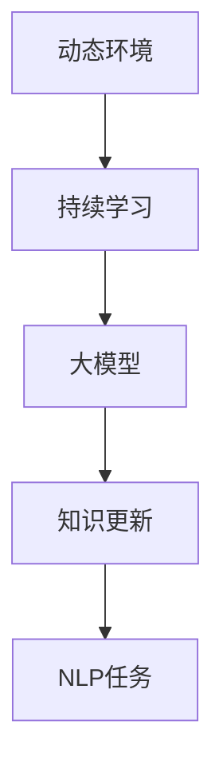

                 

# 电商行业中的持续学习：大模型在动态环境适应与知识更新中的应用

> 关键词：持续学习, 动态环境, 大模型, 电商, 知识更新, 自然语言处理(NLP)

## 1. 背景介绍

### 1.1 问题由来
随着互联网和电子商务的迅猛发展，电商行业进入了高度竞争和动态变化的阶段。消费者行为不断变化，市场趋势快速迭代，产品线更新频繁，竞争对手的策略变化无常，电商企业面临的环境充满不确定性。传统的运营模式和分析方法已难以适应这一动态变化的环境。为此，电商企业需要构建智能化的决策支持系统，以数据驱动的方式优化运营策略，提升客户体验，实现精准营销和预测。

大模型（如GPT、BERT等）在处理大规模文本数据和自然语言理解方面表现卓越，已被广泛应用于电商领域的诸多场景。但大模型在处理动态变化和快速知识更新的问题上存在挑战，如何利用大模型进行持续学习，适应动态环境，成为了一个亟待解决的重要问题。

### 1.2 问题核心关键点
为应对电商行业的动态环境，大模型需要具备以下能力：
- **动态适应**：能够实时捕捉市场趋势和用户行为的变化，迅速调整模型参数和输出。
- **知识更新**：能够持续学习新的知识，如新品发布、促销活动、用户评价等，避免模型过时。
- **预测精准**：能够基于最新的数据进行预测，提供准确的业务洞察和决策建议。
- **自动化**：能够自动化地处理数据、训练模型，减少人工干预，提高效率。

本文聚焦于利用大模型进行持续学习，提出一种适应动态环境的解决方案。通过构建动态学习系统，结合最新的数据和业务规则，实现大模型的持续学习与知识更新。

## 2. 核心概念与联系

### 2.1 核心概念概述

为更好地理解基于大模型的持续学习在电商行业的应用，本节将介绍几个密切相关的核心概念：

- **动态环境**：指市场、用户行为、产品线等变化频繁、难以预测的环境。电商行业尤其如此，新品上架、促销活动、用户评论等随时在变。
- **持续学习**：指模型能够不断从新数据中学习，同时保持已学习知识的能力。在动态环境中，持续学习是适应变化的核心手段。
- **大模型**：指使用深度学习技术训练的大规模语言模型，如GPT、BERT等，具备强大的自然语言处理能力。
- **知识更新**：指模型能够及时学习并整合新知识，如新品信息、用户评价、促销活动等。通过知识更新，模型能够保持最新的知识储备。
- **自然语言处理(NLP)**：指利用计算机处理和理解人类语言的技术，包括文本分类、情感分析、实体识别等。

这些核心概念之间的逻辑关系可以通过以下Mermaid流程图来展示：



这个流程图展示了大模型在动态环境中的核心概念及其之间的关系：动态环境是持续学习和知识更新的背景，大模型是持续学习的执行者，知识更新是持续学习的关键内容，NLP任务是持续学习的具体应用。

## 3. 核心算法原理 & 具体操作步骤
### 3.1 算法原理概述

基于大模型的持续学习算法，本质上是结合了迁移学习和在线学习（Online Learning）的混合模型。其核心思想是：将大模型视作一个强大的"特征提取器"，通过在动态环境中不断获取新数据，更新模型参数，使得模型能够实时适应市场变化和用户行为。

形式化地，假设大模型为 $M_{\theta}$，其中 $\theta$ 为模型参数。给定动态环境中的实时数据流 $D=\{(x_i,y_i)\}_{i=1}^N$，持续学习的优化目标是最小化动态数据流上的损失函数，即找到最优参数：

$$
\theta^* = \mathop{\arg\min}_{\theta} \mathcal{L}(M_{\theta},D)
$$

其中 $\mathcal{L}$ 为针对实时数据流设计的损失函数，用于衡量模型预测输出与真实标签之间的差异。常见的损失函数包括交叉熵损失、均方误差损失等。

通过梯度下降等优化算法，持续学习过程不断更新模型参数 $\theta$，最小化损失函数 $\mathcal{L}$，使得模型输出逼近真实标签。由于 $\theta$ 已经通过预训练获得了较好的初始化，因此即便在动态环境中，模型也能较快收敛到理想的模型参数 $\hat{\theta}$。

### 3.2 算法步骤详解

基于动态学习的大模型持续学习一般包括以下几个关键步骤：

**Step 1: 准备持续学习框架**
- 选择合适的在线学习算法，如AdaGrad、Adam等，作为模型参数的更新策略。
- 设计损失函数，如交叉熵损失、均方误差损失等，用于衡量模型输出与真实标签的差异。
- 创建数据流处理管道，实时收集和处理动态数据。

**Step 2: 集成实时数据流**
- 设计实时数据流的采集机制，自动抓取电商平台的最新数据，如商品信息、用户评价、销售数据等。
- 清洗和预处理数据，确保数据的质量和一致性。
- 将实时数据流划分为训练集和验证集，供模型进行训练和评估。

**Step 3: 执行持续学习**
- 将实时数据流分批次输入模型，前向传播计算损失函数。
- 反向传播计算参数梯度，根据设定的在线学习算法更新模型参数。
- 周期性在验证集上评估模型性能，根据性能指标决定是否调整学习率。
- 重复上述步骤直至模型收敛或达到预设的迭代轮数。

**Step 4: 测试和部署**
- 在测试集上评估持续学习后模型 $M_{\hat{\theta}}$ 的性能，对比持续学习前后的精度提升。
- 使用持续学习后的模型对新数据进行推理预测，集成到实际的应用系统中。
- 持续收集新的数据，定期重新进行持续学习，以适应数据分布的变化。

以上是基于动态学习的大模型持续学习的一般流程。在实际应用中，还需要针对具体任务的特点，对持续学习过程的各个环节进行优化设计，如改进训练目标函数，引入更多的正则化技术，搜索最优的超参数组合等，以进一步提升模型性能。

### 3.3 算法优缺点

基于大模型的持续学习算法具有以下优点：
1. 实时适应。在动态环境中，模型能够实时捕捉新数据，迅速调整输出，提高决策的及时性和准确性。
2. 持续学习。模型能够不断从新数据中学习，积累知识，避免因过时数据造成的性能下降。
3. 自动化。自动化处理数据、训练模型，减少人工干预，提高效率。
4. 泛化能力强。大模型的预训练基础使其具备较强的泛化能力，能够处理各种类型的NLP任务。

同时，该算法也存在一定的局限性：
1. 数据依赖性强。持续学习的性能很大程度上取决于实时数据的质量和数量，数据获取和处理成本较高。
2. 模型复杂度大。大模型参数量庞大，计算复杂度高，实时更新可能导致计算资源压力增大。
3. 过拟合风险。模型在动态环境中可能过拟合新数据，导致泛化性能下降。
4. 模型更新频繁。频繁的模型更新可能导致模型状态不稳定，增加部署和维护的复杂度。

尽管存在这些局限性，但就目前而言，基于大模型的持续学习算法仍是大规模动态环境中处理NLP任务的有效手段。未来相关研究的重点在于如何进一步降低持续学习对数据和计算资源的需求，提高模型的鲁棒性和可维护性，同时兼顾可解释性和伦理安全性等因素。

### 3.4 算法应用领域

基于大模型的持续学习算法在电商行业的多个领域已得到了广泛应用，包括：

- **客户行为分析**：通过实时分析用户的浏览、购买、评价等行为数据，预测用户意向，提供个性化推荐和促销建议。
- **库存管理**：利用实时销售数据和预测模型，动态调整库存水平，避免缺货或积压。
- **产品推荐**：根据用户反馈和市场趋势，实时更新推荐算法，提升推荐效果。
- **价格优化**：基于实时市场数据和用户行为，动态调整产品价格，实现利润最大化。
- **风险控制**：实时监控交易行为，检测异常交易，防范欺诈和风险。

除了上述这些应用场景外，持续学习算法还被创新性地应用到更多领域中，如智能客服、个性化营销、供应链优化等，为电商企业的智能化运营提供了有力支撑。

## 4. 数学模型和公式 & 详细讲解  
### 4.1 数学模型构建

本节将使用数学语言对基于大模型的持续学习过程进行更加严格的刻画。

假设实时数据流为 $D=\{(x_i,y_i)\}_{i=1}^N$，其中 $x_i$ 为输入，$y_i$ 为真实标签。定义模型 $M_{\theta}$ 在输入 $x_i$ 上的损失函数为 $\ell(M_{\theta}(x_i),y_i)$，则在数据流 $D$ 上的经验风险为：

$$
\mathcal{L}(\theta) = \frac{1}{N}\sum_{i=1}^N \ell(M_{\theta}(x_i),y_i)
$$

在动态环境中，持续学习的优化目标是最小化动态数据流上的经验风险，即找到最优参数：

$$
\theta^* = \mathop{\arg\min}_{\theta} \mathcal{L}(\theta)
$$

在线学习算法通常使用梯度下降的变体，如AdaGrad、Adam等，以更新模型参数 $\theta$。设 $\eta_t$ 为学习率，则参数的更新公式为：

$$
\theta_{t+1} \leftarrow \theta_t - \eta_t \nabla_{\theta}\mathcal{L}(\theta_t)
$$

其中 $\nabla_{\theta}\mathcal{L}(\theta_t)$ 为损失函数对参数 $\theta_t$ 的梯度，可通过反向传播算法高效计算。

### 4.2 公式推导过程

以下我们以客户行为分析为例，推导交叉熵损失函数及其梯度的计算公式。

假设模型 $M_{\theta}$ 在输入 $x_i$ 上的输出为 $\hat{y}=M_{\theta}(x_i)$，表示用户属于某个行为类别的概率。真实标签 $y_i \in \{1,0\}$，其中1表示用户表现出某类行为，0表示未表现出该行为。则交叉熵损失函数定义为：

$$
\ell(M_{\theta}(x_i),y_i) = -y_i\log \hat{y}_i - (1-y_i)\log (1-\hat{y}_i)
$$

将其代入经验风险公式，得：

$$
\mathcal{L}(\theta) = -\frac{1}{N}\sum_{i=1}^N [y_i\log M_{\theta}(x_i)+(1-y_i)\log(1-M_{\theta}(x_i))]
$$

根据链式法则，损失函数对参数 $\theta_k$ 的梯度为：

$$
\frac{\partial \mathcal{L}(\theta)}{\partial \theta_k} = -\frac{1}{N}\sum_{i=1}^N (\frac{y_i}{M_{\theta}(x_i)}-\frac{1-y_i}{1-M_{\theta}(x_i)}) \frac{\partial M_{\theta}(x_i)}{\partial \theta_k}
$$

其中 $\frac{\partial M_{\theta}(x_i)}{\partial \theta_k}$ 可进一步递归展开，利用自动微分技术完成计算。

在得到损失函数的梯度后，即可带入在线学习算法进行参数更新，完成模型的迭代优化。重复上述过程直至收敛，最终得到适应动态环境的最优模型参数 $\theta^*$。

## 5. 项目实践：代码实例和详细解释说明
### 5.1 开发环境搭建

在进行持续学习实践前，我们需要准备好开发环境。以下是使用Python进行PyTorch开发的环境配置流程：

1. 安装Anaconda：从官网下载并安装Anaconda，用于创建独立的Python环境。

2. 创建并激活虚拟环境：
```bash
conda create -n pytorch-env python=3.8 
conda activate pytorch-env
```

3. 安装PyTorch：根据CUDA版本，从官网获取对应的安装命令。例如：
```bash
conda install pytorch torchvision torchaudio cudatoolkit=11.1 -c pytorch -c conda-forge
```

4. 安装Transformers库：
```bash
pip install transformers
```

5. 安装各类工具包：
```bash
pip install numpy pandas scikit-learn matplotlib tqdm jupyter notebook ipython
```

完成上述步骤后，即可在`pytorch-env`环境中开始持续学习实践。

### 5.2 源代码详细实现

这里我们以客户行为分析为例，给出使用Transformers库对大模型进行持续学习的PyTorch代码实现。

首先，定义客户行为分析的数据处理函数：

```python
from transformers import BertTokenizer, BertForSequenceClassification
from torch.utils.data import Dataset
import torch

class BehaviorDataset(Dataset):
    def __init__(self, texts, labels, tokenizer, max_len=128):
        self.texts = texts
        self.labels = labels
        self.tokenizer = tokenizer
        self.max_len = max_len
        
    def __len__(self):
        return len(self.texts)
    
    def __getitem__(self, item):
        text = self.texts[item]
        label = self.labels[item]
        
        encoding = self.tokenizer(text, return_tensors='pt', max_length=self.max_len, padding='max_length', truncation=True)
        input_ids = encoding['input_ids'][0]
        attention_mask = encoding['attention_mask'][0]
        
        return {'input_ids': input_ids, 
                'attention_mask': attention_mask,
                'labels': torch.tensor(label, dtype=torch.long)}
```

然后，定义模型和优化器：

```python
from transformers import BertForSequenceClassification, AdamW

model = BertForSequenceClassification.from_pretrained('bert-base-cased', num_labels=2)

optimizer = AdamW(model.parameters(), lr=2e-5)
```

接着，定义训练和评估函数：

```python
from torch.utils.data import DataLoader
from tqdm import tqdm
from sklearn.metrics import classification_report

device = torch.device('cuda') if torch.cuda.is_available() else torch.device('cpu')
model.to(device)

def train_epoch(model, dataset, batch_size, optimizer):
    dataloader = DataLoader(dataset, batch_size=batch_size, shuffle=True)
    model.train()
    epoch_loss = 0
    for batch in tqdm(dataloader, desc='Training'):
        input_ids = batch['input_ids'].to(device)
        attention_mask = batch['attention_mask'].to(device)
        labels = batch['labels'].to(device)
        model.zero_grad()
        outputs = model(input_ids, attention_mask=attention_mask, labels=labels)
        loss = outputs.loss
        epoch_loss += loss.item()
        loss.backward()
        optimizer.step()
    return epoch_loss / len(dataloader)

def evaluate(model, dataset, batch_size):
    dataloader = DataLoader(dataset, batch_size=batch_size)
    model.eval()
    preds, labels = [], []
    with torch.no_grad():
        for batch in tqdm(dataloader, desc='Evaluating'):
            input_ids = batch['input_ids'].to(device)
            attention_mask = batch['attention_mask'].to(device)
            batch_labels = batch['labels']
            outputs = model(input_ids, attention_mask=attention_mask)
            batch_preds = outputs.logits.argmax(dim=1).to('cpu').tolist()
            batch_labels = batch_labels.to('cpu').tolist()
            for pred, label in zip(batch_preds, batch_labels):
                preds.append(pred)
                labels.append(label)
                
    print(classification_report(labels, preds))
```

最后，启动持续学习流程并在测试集上评估：

```python
epochs = 5
batch_size = 16

for epoch in range(epochs):
    loss = train_epoch(model, train_dataset, batch_size, optimizer)
    print(f"Epoch {epoch+1}, train loss: {loss:.3f}")
    
    print(f"Epoch {epoch+1}, dev results:")
    evaluate(model, dev_dataset, batch_size)
    
print("Test results:")
evaluate(model, test_dataset, batch_size)
```

以上就是使用PyTorch对大模型进行客户行为分析的持续学习完整代码实现。可以看到，利用Transformers库的强大封装，我们可以用相对简洁的代码完成大模型的持续学习。

### 5.3 代码解读与分析

让我们再详细解读一下关键代码的实现细节：

**BehaviorDataset类**：
- `__init__`方法：初始化文本、标签、分词器等关键组件。
- `__len__`方法：返回数据集的样本数量。
- `__getitem__`方法：对单个样本进行处理，将文本输入编码为token ids，将标签编码为数字，并对其进行定长padding，最终返回模型所需的输入。

**训练和评估函数**：
- 使用PyTorch的DataLoader对数据集进行批次化加载，供模型训练和推理使用。
- 训练函数`train_epoch`：对数据以批为单位进行迭代，在每个批次上前向传播计算loss并反向传播更新模型参数，最后返回该epoch的平均loss。
- 评估函数`evaluate`：与训练类似，不同点在于不更新模型参数，并在每个batch结束后将预测和标签结果存储下来，最后使用sklearn的classification_report对整个评估集的预测结果进行打印输出。

**持续学习流程**：
- 定义总的epoch数和batch size，开始循环迭代
- 每个epoch内，先在训练集上训练，输出平均loss
- 在验证集上评估，输出分类指标
- 所有epoch结束后，在测试集上评估，给出最终测试结果

可以看到，PyTorch配合Transformers库使得大模型的持续学习代码实现变得简洁高效。开发者可以将更多精力放在数据处理、模型改进等高层逻辑上，而不必过多关注底层的实现细节。

当然，工业级的系统实现还需考虑更多因素，如模型的保存和部署、超参数的自动搜索、更灵活的任务适配层等。但核心的持续学习范式基本与此类似。

## 6. 实际应用场景
### 6.1 客户行为分析

基于大模型的持续学习技术，电商企业可以构建客户行为分析系统，实现对用户行为的深度理解，提升个性化推荐和营销策略的精准度。具体而言，通过实时收集用户的浏览、购买、评价等行为数据，利用大模型分析用户行为模式和兴趣偏好，动态调整推荐算法，及时响应用户需求。

在技术实现上，可以利用大模型进行实时推理，根据最新的用户行为数据生成行为预测，并进行行为分类。通过持续学习，模型能够不断从新数据中学习，避免因用户行为变化导致的性能下降。同时，通过定期复训模型，可以更新模型知识库，确保模型始终与最新市场趋势保持一致。

### 6.2 库存管理

库存管理是电商企业运营的重要环节，合理的库存水平可以避免缺货或积压，减少运营成本。基于大模型的持续学习技术，电商企业可以实时监控销售数据和市场趋势，动态调整库存水平，提高库存管理效率。

具体而言，可以利用大模型对历史销售数据和市场趋势进行建模，实时预测未来销售量。通过持续学习，模型能够不断从新销售数据中学习，更新销售预测模型，提高预测准确性。同时，通过定期复训模型，可以更新市场趋势，确保预测模型始终与最新市场动态保持一致。

### 6.3 产品推荐

产品推荐是电商企业提升用户体验和销售转化的重要手段。基于大模型的持续学习技术，电商企业可以构建动态推荐系统，实时根据用户行为和市场趋势进行推荐优化。

具体而言，可以利用大模型分析用户行为数据和产品特征，生成实时推荐结果。通过持续学习，模型能够不断从新用户行为数据和产品特征中学习，更新推荐模型，提高推荐效果。同时，通过定期复训模型，可以更新市场趋势和产品特征，确保推荐模型始终与最新市场动态保持一致。

### 6.4 未来应用展望

随着大模型和持续学习技术的不断发展，基于大模型的持续学习将在更多领域得到应用，为电商企业的智能化运营提供新的解决方案。

在智慧物流领域，持续学习技术可以用于优化物流配送路径和库存分配，提高配送效率和库存管理水平。在个性化推荐系统领域，持续学习技术可以实现动态推荐，提升推荐效果和用户满意度。在智能客服系统领域，持续学习技术可以用于优化对话模型，提高客服响应速度和准确性。

此外，在客户关系管理、供应链优化、风险控制等诸多领域，持续学习技术也将不断涌现，为电商企业的智能化运营带来新的突破。相信随着技术的日益成熟，大模型持续学习必将在电商行业的智能化升级中扮演越来越重要的角色。

## 7. 工具和资源推荐
### 7.1 学习资源推荐

为了帮助开发者系统掌握大模型持续学习在电商行业的应用，这里推荐一些优质的学习资源：

1. 《深度学习与电商：大模型应用实战》系列博文：由电商行业专家撰写，深入浅出地介绍了大模型在电商领域的实际应用，涵盖客户行为分析、库存管理、产品推荐等场景。

2. 《电商大数据应用》课程：开设在各大在线教育平台，系统介绍了电商行业的数据处理、推荐系统、库存管理等技术，并结合大模型进行实战练习。

3. 《电商NLP技术及实战》书籍：系统讲解了NLP技术在电商领域的应用，包括文本分类、情感分析、实体识别等，并通过案例和代码演示了持续学习技术的应用。

4. 《电商智能营销实战》白皮书：汇集了电商企业智能化营销的最新实践，包括客户行为分析、个性化推荐、客户服务等多个环节的案例和经验分享。

通过对这些资源的学习实践，相信你一定能够快速掌握大模型持续学习在电商行业的应用，并用于解决实际的电商问题。
### 7.2 开发工具推荐

高效的开发离不开优秀的工具支持。以下是几款用于大模型持续学习开发的常用工具：

1. PyTorch：基于Python的开源深度学习框架，灵活动态的计算图，适合快速迭代研究。大部分预训练语言模型都有PyTorch版本的实现。

2. TensorFlow：由Google主导开发的开源深度学习框架，生产部署方便，适合大规模工程应用。同样有丰富的预训练语言模型资源。

3. Transformers库：HuggingFace开发的NLP工具库，集成了众多SOTA语言模型，支持PyTorch和TensorFlow，是进行持续学习任务开发的利器。

4. Weights & Biases：模型训练的实验跟踪工具，可以记录和可视化模型训练过程中的各项指标，方便对比和调优。与主流深度学习框架无缝集成。

5. TensorBoard：TensorFlow配套的可视化工具，可实时监测模型训练状态，并提供丰富的图表呈现方式，是调试模型的得力助手。

6. Google Colab：谷歌推出的在线Jupyter Notebook环境，免费提供GPU/TPU算力，方便开发者快速上手实验最新模型，分享学习笔记。

合理利用这些工具，可以显著提升大模型持续学习的开发效率，加快创新迭代的步伐。

### 7.3 相关论文推荐

大模型持续学习在电商行业的快速发展得益于学界的持续研究。以下是几篇奠基性的相关论文，推荐阅读：

1. "Deep Reinforcement Learning for Dynamic Inventory Control in E-Commerce"：介绍了利用深度强化学习进行动态库存控制的方法，提升了库存管理效率。

2. "Customer Behavior Prediction and Recommendation in E-Commerce"：研究了利用深度学习模型进行客户行为预测和推荐的方法，提升了个性化推荐的精准度。

3. "E-commerce Recommendation Systems"：系统介绍了电商推荐系统的发展历程和最新技术，包括深度学习、多模态学习等前沿技术。

4. "Adaptive Learning for E-Commerce Personalization"：探讨了基于在线学习技术进行个性化推荐的方法，提升了推荐模型的适应性和效果。

5. "Real-time Demand Forecasting for E-Commerce"：研究了利用深度学习模型进行实时需求预测的方法，提升了库存管理的精准度。

这些论文代表了大模型持续学习在电商领域的发展脉络。通过学习这些前沿成果，可以帮助研究者把握学科前进方向，激发更多的创新灵感。

## 8. 总结：未来发展趋势与挑战
### 8.1 研究成果总结

本文对基于大模型的持续学习在电商行业的应用进行了全面系统的介绍。首先阐述了持续学习在大模型应对动态环境中的重要性，明确了持续学习在实时捕捉市场趋势和用户行为变化中的核心价值。其次，从原理到实践，详细讲解了持续学习的数学原理和关键步骤，给出了持续学习任务开发的完整代码实例。同时，本文还广泛探讨了持续学习在客户行为分析、库存管理、产品推荐等电商场景中的应用前景，展示了持续学习技术在电商领域的巨大潜力。此外，本文精选了持续学习技术的各类学习资源，力求为读者提供全方位的技术指引。

通过本文的系统梳理，可以看到，基于大模型的持续学习技术正在成为电商企业应对动态变化的重要手段，极大地提升了决策的及时性和精准性。利用持续学习，电商企业能够更好地适应市场环境的变化，提升运营效率，实现智能化运营。

### 8.2 未来发展趋势

展望未来，大模型持续学习技术将呈现以下几个发展趋势：

1. **实时性增强**：实时获取和处理动态数据，使得持续学习能够更快地响应市场变化，提高决策的及时性和准确性。
2. **可解释性增强**：通过引入因果分析、对抗训练等方法，增强持续学习的可解释性，使模型的决策过程更加透明、可理解。
3. **多模态融合**：结合视觉、语音、文本等多种模态信息，提升持续学习模型的泛化能力和表现。
4. **跨领域应用**：将持续学习技术应用到更多领域，如智慧物流、智慧医疗、智慧城市等，拓展持续学习的应用边界。
5. **自动化优化**：引入自动调参、超参数优化等技术，提升持续学习的性能和效率。
6. **伦理和安全性**：在持续学习过程中引入伦理约束和安全性保障措施，确保模型的合规性和安全性。

这些趋势将进一步提升持续学习技术的适应性和应用范围，为电商企业提供更加智能、可靠的决策支持。

### 8.3 面临的挑战

尽管大模型持续学习技术已经取得了一定的成果，但在迈向更广泛应用的过程中，仍面临一些挑战：

1. **数据获取成本高**：实时获取高质量的电商数据成本较高，需要构建数据采集和清洗管道。
2. **模型复杂度高**：大模型参数量庞大，实时更新模型可能带来计算资源压力。
3. **可解释性不足**：持续学习模型的决策过程缺乏可解释性，难以调试和优化。
4. **模型稳定性差**：频繁的模型更新可能导致模型状态不稳定，增加部署和维护复杂度。
5. **鲁棒性不足**：在动态环境中，模型可能过拟合新数据，导致泛化性能下降。
6. **伦理和安全问题**：持续学习模型可能学习到有害信息，需要建立相应的监管机制和数据保护措施。

这些挑战需要进一步的研究和实践，通过技术创新和工程优化，逐步克服。只有在大规模电商数据、高性能计算资源和强大算法支持的基础上，持续学习技术才能真正发挥其巨大潜力。

### 8.4 研究展望

面向未来，大模型持续学习技术需要在以下几个方面进行进一步研究：

1. **多源数据融合**：将多种数据源整合到持续学习系统中，提高模型的泛化能力和适应性。
2. **迁移学习应用**：利用迁移学习技术，在保持模型知识库的同时，适应新的电商任务。
3. **因果关系建模**：引入因果推断方法，构建因果关系模型，提高持续学习模型的解释性和可靠性。
4. **知识图谱应用**：结合知识图谱技术，增强持续学习模型的知识表示能力和推理能力。
5. **自动化优化**：利用自动化调参、模型压缩等技术，提升持续学习模型的性能和效率。
6. **伦理和安全保障**：在持续学习过程中引入伦理约束和数据保护措施，确保模型的合规性和安全性。

这些研究方向将进一步拓展持续学习技术的应用边界，提升电商企业的智能化运营水平。未来，随着持续学习技术的不断发展，相信将有更多的电商企业从中受益，实现业务的数字化转型升级。

## 9. 附录：常见问题与解答

**Q1：大模型持续学习是否适用于所有电商任务？**

A: 大模型持续学习在大多数电商任务上都能取得不错的效果，特别是对于数据量较小的任务。但对于一些特定领域的任务，如金融、物流等，仅仅依靠通用语料预训练的模型可能难以很好地适应。此时需要在特定领域语料上进一步预训练，再进行持续学习，才能获得理想效果。此外，对于一些需要时效性、个性化很强的任务，如推荐、客服等，持续学习方法也需要针对性的改进优化。

**Q2：大模型持续学习如何处理数据不平衡问题？**

A: 数据不平衡是电商领域常见的挑战，大模型持续学习同样需要面对。常见的处理方法包括：
1. 数据增强：通过数据增强技术，如重复采样、生成对抗性数据等，提高数据集的多样性和平衡性。
2. 损失函数改进：采用加权损失函数，对少数类样本给予更高的权重，缩小类别间的差距。
3. 迁移学习：利用迁移学习技术，在已有模型基础上进行微调，提升少数类样本的分类效果。
4. 重采样：通过重采样技术，如欠采样、过采样等，平衡数据集中的类别分布。
5. 结合多模态数据：利用多模态数据，如图像、语音等，提升模型的泛化能力和适应性。

这些方法可以根据具体场景和数据特点进行灵活组合，以达到最佳效果。

**Q3：大模型持续学习的计算资源需求如何？**

A: 大模型持续学习对计算资源的需求较高，主要体现在以下几个方面：
1. 数据处理：实时数据流的采集和清洗需要高性能的计算资源。
2. 模型训练：大模型的参数量庞大，训练过程需要高吞吐率的计算资源。
3. 推理部署：持续学习模型需要实时推理，计算资源需求高。
4. 存储管理：模型和数据的存储和读取需要高效的存储系统。

为了应对这些需求，需要构建高性能的计算基础设施，如GPU/TPU集群、高性能存储系统等。同时，还可以采用模型压缩、分布式训练等技术，进一步优化资源利用效率。

**Q4：大模型持续学习的部署和维护复杂度如何？**

A: 大模型持续学习的部署和维护复杂度较高，主要体现在以下几个方面：
1. 模型更新频繁：持续学习模型需要频繁更新，增加了部署和维护的复杂度。
2. 资源管理：实时数据流和模型的部署需要精细化的资源管理。
3. 异常检测：需要实时监控系统状态，检测异常情况，确保系统的稳定性和可靠性。
4. 模型复训：模型复训需要重新下载和预处理数据，增加了部署和维护的复杂度。

为了降低复杂度，可以采用容器化、自动化部署、自动化调参等技术，提高系统的可维护性和自动化水平。同时，还需要建立完善的监控和告警机制，确保系统的稳定运行。

**Q5：大模型持续学习的可解释性如何提升？**

A: 提升持续学习模型的可解释性是当前研究的热点之一。以下是一些常见的方法：
1. 引入因果分析：通过因果推断方法，分析模型的决策过程，提供因果解释。
2. 对抗样本生成：利用对抗样本生成技术，分析模型对异常数据的反应。
3. 特征重要性分析：通过特征重要性分析，了解模型在不同特征上的依赖程度。
4. 模型可视化：利用可视化工具，展示模型的决策过程和特征影响。
5. 交互式界面：通过交互式界面，提供用户与模型的交互，提升可解释性。

这些方法可以根据具体需求进行灵活组合，以提升模型的可解释性和透明度。

总之，大模型持续学习在电商行业的应用具有广阔的前景，通过结合实时数据和业务规则，构建动态学习系统，可以显著提升电商企业的智能化运营水平。未来，随着技术的不断发展，持续学习技术将为电商企业带来更多创新应用，推动电商行业的数字化转型升级。

---

作者：禅与计算机程序设计艺术 / Zen and the Art of Computer Programming

