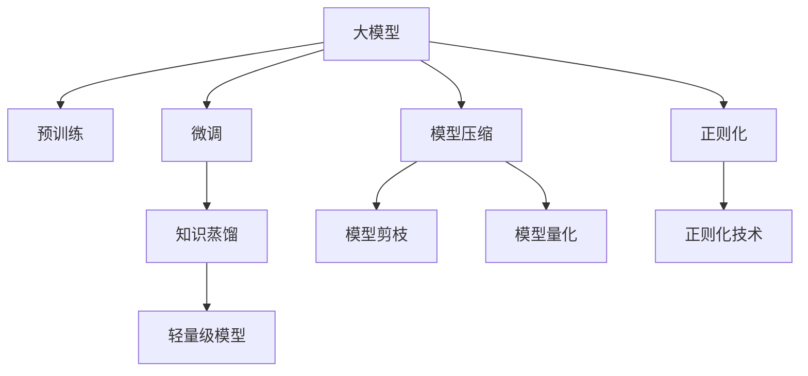

                 

# 电商行业中的知识蒸馏：从大模型到轻量级模型

> 关键词：知识蒸馏，电商推荐，大模型，轻量级模型，预训练，微调，模型压缩

## 1. 背景介绍

### 1.1 问题由来

在电商行业，如何高效地为用户推荐其可能感兴趣的商品，是提升用户体验和增加销售转化的关键问题。传统推荐系统通常依赖用户的历史行为数据进行相似度计算，然而在大数据时代，用户的行为数据往往数量庞大且维度繁多，传统的推荐算法难以处理如此高维且稀疏的数据集。

为了应对这一挑战，近年来人工智能技术，尤其是深度学习在推荐系统中的应用得到了广泛关注。其中，预训练语言模型（Pre-trained Language Model, PLM）作为通用基础模型，被广泛用于电商推荐。例如，通过大规模无标签文本数据的预训练，PLM可以学习到通用的语言表示，然后在电商推荐场景中进行微调，用于提取商品描述和用户评论等文本数据中的潜在关联。

然而，尽管PLM在电商推荐中展现了强大的潜力，但由于模型规模庞大，计算和存储资源消耗巨大，部署和维护成本高昂，因此在实际电商系统中难以大规模应用。为了在提升推荐效果的同时，降低模型计算和存储成本，知识蒸馏（Knowledge Distillation, KD）技术被引入到电商推荐领域，用于将大模型中蕴含的丰富知识传递给规模更小、效率更高的轻量级模型。

## 2. 核心概念与联系

### 2.1 核心概念概述

为了更好地理解知识蒸馏在电商推荐中的应用，本节将介绍几个关键的概念：

- **知识蒸馏（Knowledge Distillation, KD）**：知识蒸馏是一种通过将复杂模型的知识迁移到更小、更快速模型中，以提高模型效率和性能的技术。该技术在深度学习中具有广泛应用，特别是在自然语言处理、计算机视觉等领域。

- **大模型（Large Model）**：大模型通常指具有数亿乃至数十亿参数的深度学习模型，如BERT、GPT-3等。这些模型通过在大规模无标签文本数据上进行预训练，学习到丰富的语言知识，能够处理复杂的自然语言理解任务。

- **轻量级模型（Lightweight Model）**：轻量级模型相比大模型，参数规模更小，计算和存储资源消耗更少，推理速度更快。这些模型通常适合在资源有限的嵌入式设备或移动端等场景中使用。

- **预训练（Pre-training）**：预训练是指在大规模无标签文本数据上，通过自监督学习任务训练通用语言模型的过程。常见的预训练任务包括掩码语言模型、下一句子预测等。

- **微调（Fine-tuning）**：微调是指在预训练模型的基础上，使用下游任务的少量标注数据，通过有监督地训练来优化模型在特定任务上的性能。通常只需要调整顶层分类器或解码器，并以较小的学习率更新全部或部分模型参数。

- **模型压缩（Model Compression）**：模型压缩是指通过剪枝、量化、蒸馏等技术，将大模型压缩成更小、更高效的模型，以提升模型推理速度和降低计算资源消耗。

这些概念之间的逻辑关系可以通过以下Mermaid流程图来展示：



这个流程图展示了大模型的核心概念及其之间的关系：

1. 大模型通过预训练获得基础能力。
2. 微调是对预训练模型进行任务特定的优化，可以在少量标注数据下取得较好效果。
3. 知识蒸馏将大模型的知识迁移到轻量级模型中，提升模型的性能和效率。
4. 模型压缩通过剪枝、量化等技术优化模型结构，进一步提升模型效率。
5. 正则化技术用于限制模型复杂度，防止过拟合。

## 3. 核心算法原理 & 具体操作步骤
### 3.1 算法原理概述

知识蒸馏的原理是通过教师模型（Teacher Model）指导学生模型（Student Model）的学习，使得学生模型能够继承教师模型的知识，提升自身的性能。具体而言，知识蒸馏通常分为以下两个步骤：

1. **教师模型训练**：首先，使用大规模无标签数据对教师模型进行预训练，使其学习到丰富的语言知识。
2. **学生模型训练**：然后，使用下游任务的少量标注数据，通过有监督地训练学生模型，使其能够继承教师模型的知识，同时适应特定任务的要求。

在电商推荐场景中，大模型通常用作教师模型，而轻量级模型则作为学生模型。大模型通过预训练学习到通用的语言知识，如词义、句法等，而轻量级模型则通过微调和知识蒸馏，继承大模型的知识，同时适应推荐系统的特定需求。

### 3.2 算法步骤详解

以下是知识蒸馏在电商推荐中的具体操作步骤：

**Step 1: 准备数据集**
- 准备电商推荐任务的数据集，包括商品描述、用户评论、用户历史行为记录等。
- 将数据集分为训练集、验证集和测试集，确保标注数据的质量和数量。

**Step 2: 选择合适的预训练模型**
- 选择大模型作为教师模型，如BERT、GPT-3等，这些模型通常包含数亿个参数，能够学习到丰富的语言知识。
- 选择轻量级模型作为学生模型，如DistillBERT、DistillGPT等，这些模型参数规模较小，推理速度较快。

**Step 3: 教师模型预训练**
- 在无标签电商数据集上对教师模型进行预训练，学习通用的语言知识。
- 常见预训练任务包括掩码语言模型、句子分类等。

**Step 4: 学生模型微调**
- 在电商推荐任务的标注数据集上对学生模型进行微调，使其能够适应特定推荐任务的要求。
- 设置微调的超参数，如学习率、批大小、迭代轮数等。
- 应用正则化技术，如L2正则、Dropout等，防止过拟合。
- 应用模型压缩技术，如剪枝、量化等，优化模型结构。

**Step 5: 知识蒸馏**
- 通过在学生模型和教师模型之间定义知识蒸馏损失函数，指导学生模型继承教师模型的知识。
- 常用的知识蒸馏损失函数包括Softmax损失、最大互信息损失等。

**Step 6: 模型评估与部署**
- 在测试集上评估学生模型的性能，对比微调和知识蒸馏前后的推荐精度。
- 使用学生模型进行商品推荐，集成到实际电商系统中。
- 持续收集新的数据，定期重新微调和蒸馏模型，以适应数据分布的变化。

### 3.3 算法优缺点

知识蒸馏在电商推荐中的应用具有以下优点：
1. 提升推荐精度：通过继承大模型的丰富知识，轻量级模型能够在少量标注数据下取得更优的推荐效果。
2. 降低计算和存储成本：轻量级模型参数规模较小，推理速度较快，计算和存储资源消耗更低。
3. 提高模型泛化能力：通过继承大模型的知识，轻量级模型能够更好地适应不同领域和数据分布的任务。

同时，该方法也存在一些局限性：
1. 依赖标注数据：蒸馏的效果很大程度上取决于标注数据的质量和数量，获取高质量标注数据的成本较高。
2. 模型复杂度增加：蒸馏过程增加了额外的蒸馏损失函数，可能导致模型复杂度增加。
3. 数据分布变化：当新任务与预训练数据的分布差异较大时，蒸馏的效果可能受到影响。
4. 蒸馏效果难以量化：蒸馏效果的评估和优化往往依赖经验，缺乏统一的量化标准。

尽管存在这些局限性，但就目前而言，知识蒸馏仍然是电商推荐中最为主流和有效的技术手段之一。未来相关研究的重点在于如何进一步降低蒸馏对标注数据的依赖，提高模型的泛化能力，同时兼顾模型复杂度和可解释性等因素。

### 3.4 算法应用领域

知识蒸馏技术在电商推荐中的应用领域已经得到了广泛的应用，包括：

- **商品推荐**：利用大模型学习通用语言知识，通过微调和蒸馏技术，提升推荐系统的精度和效率。
- **用户行为预测**：通过分析用户历史行为数据，学习用户偏好，预测未来行为，进行个性化推荐。
- **广告投放优化**：通过学习用户行为数据和广告内容，优化广告投放策略，提升广告效果。
- **客户服务机器人**：通过蒸馏大模型的知识，训练客户服务机器人，提升服务质量，提高客户满意度。

除了上述这些经典应用外，知识蒸馏技术还被创新性地应用到更多场景中，如电商价格优化、供应链管理等，为电商业务带来了全新的技术支持。随着知识蒸馏方法的不断演进，相信其将在更多领域得到应用，为电商业务的智能化和高效化提供新的技术路径。

## 4. 数学模型和公式 & 详细讲解  
### 4.1 数学模型构建

在本节中，我们将使用数学语言对知识蒸馏在电商推荐中的应用进行更严格的刻画。

记教师模型为 $M_{\text{teacher}}$，学生模型为 $M_{\text{student}}$。假设教师模型在电商推荐任务上的标注数据集为 $D_{\text{train}}$，学生模型在相同任务上的标注数据集为 $D_{\text{fine-tune}}$。

定义学生模型在数据样本 $(x,y)$ 上的损失函数为 $\ell(M_{\text{student}}(x),y)$，则在数据集 $D_{\text{fine-tune}}$ 上的经验风险为：

$$
\mathcal{L}_{\text{fine-tune}}(M_{\text{student}}) = \frac{1}{N}\sum_{i=1}^N \ell(M_{\text{student}}(x_i),y_i)
$$

在学生模型微调的同时，通过定义知识蒸馏损失函数 $\mathcal{L}_{\text{distill}}$，指导学生模型继承教师模型的知识。常见的知识蒸馏损失函数包括最大互信息损失（Maximal Mutual Information, MMoI）和Softmax损失（Kullback-Leibler divergence, KLD）。以最大互信息损失为例，蒸馏损失函数定义为：

$$
\mathcal{L}_{\text{distill}}(M_{\text{student}}, M_{\text{teacher}}) = -\mathbb{E}_{(x,y)\sim D_{\text{train}}}[\log p_{\text{student}}(y|x) + \log p_{\text{teacher}}(y|x)]
$$

其中，$p_{\text{student}}(y|x)$ 为学生模型在数据 $(x,y)$ 上的预测概率分布，$p_{\text{teacher}}(y|x)$ 为教师模型在相同数据上的预测概率分布。

结合微调和蒸馏的损失函数，总损失函数为：

$$
\mathcal{L}(M_{\text{student}}, D_{\text{fine-tune}}, M_{\text{teacher}}, D_{\text{train}}) = \mathcal{L}_{\text{fine-tune}}(M_{\text{student}}) + \mathcal{L}_{\text{distill}}(M_{\text{student}}, M_{\text{teacher}})
$$

通过优化总损失函数，学生模型可以在微调过程中继承教师模型的知识，同时适应特定电商推荐任务的要求。

### 4.2 公式推导过程

以下是最大互信息损失的推导过程：

假设教师模型在数据 $(x,y)$ 上的预测概率分布为 $p_{\text{teacher}}(y|x)$，学生模型在相同数据上的预测概率分布为 $p_{\text{student}}(y|x)$。则最大互信息损失可以表示为：

$$
\mathcal{L}_{\text{distill}}(M_{\text{student}}, M_{\text{teacher}}) = -\mathbb{E}_{(x,y)\sim D_{\text{train}}}[\log p_{\text{student}}(y|x) + \log p_{\text{teacher}}(y|x)]
$$

将上式拆分为两部分：

$$
\mathcal{L}_{\text{distill}}(M_{\text{student}}, M_{\text{teacher}}) = -\mathbb{E}_{(x,y)\sim D_{\text{train}}}[\log p_{\text{student}}(y|x)] + \mathbb{E}_{(x,y)\sim D_{\text{train}}}[\log p_{\text{teacher}}(y|x)]
$$

第一部分为学生模型预测的概率分布与真实标签的交叉熵损失：

$$
-\mathbb{E}_{(x,y)\sim D_{\text{train}}}[\log p_{\text{student}}(y|x)] = -\frac{1}{N}\sum_{i=1}^N \log p_{\text{student}}(y_i|x_i)
$$

第二部分为教师模型预测的概率分布与真实标签的交叉熵损失：

$$
\mathbb{E}_{(x,y)\sim D_{\text{train}}}[\log p_{\text{teacher}}(y|x)] = \frac{1}{N}\sum_{i=1}^N \log p_{\text{teacher}}(y_i|x_i)
$$

因此，最大互信息损失可以表示为：

$$
\mathcal{L}_{\text{distill}}(M_{\text{student}}, M_{\text{teacher}}) = -\frac{1}{N}\sum_{i=1}^N \log p_{\text{student}}(y_i|x_i) + \frac{1}{N}\sum_{i=1}^N \log p_{\text{teacher}}(y_i|x_i)
$$

通过优化上述总损失函数，学生模型能够在微调过程中继承教师模型的知识，同时适应特定电商推荐任务的要求。

## 5. 项目实践：代码实例和详细解释说明
### 5.1 开发环境搭建

在进行知识蒸馏实践前，我们需要准备好开发环境。以下是使用Python进行PyTorch开发的环境配置流程：

1. 安装Anaconda：从官网下载并安装Anaconda，用于创建独立的Python环境。

2. 创建并激活虚拟环境：
```bash
conda create -n pytorch-env python=3.8 
conda activate pytorch-env
```

3. 安装PyTorch：根据CUDA版本，从官网获取对应的安装命令。例如：
```bash
conda install pytorch torchvision torchaudio cudatoolkit=11.1 -c pytorch -c conda-forge
```

4. 安装Transformers库：
```bash
pip install transformers
```

5. 安装各类工具包：
```bash
pip install numpy pandas scikit-learn matplotlib tqdm jupyter notebook ipython
```

完成上述步骤后，即可在`pytorch-env`环境中开始知识蒸馏实践。

### 5.2 源代码详细实现

下面是使用PyTorch进行知识蒸馏的代码实现，具体实现细节如下：

```python
import torch
import torch.nn as nn
import torch.optim as optim
from transformers import BertTokenizer, BertForSequenceClassification, DistillBertForSequenceClassification

# 定义教师模型和学生模型
teacher_model = BertForSequenceClassification.from_pretrained('bert-base-cased', num_labels=2)
student_model = DistillBertForSequenceClassification.from_pretrained('distilbert-base-cased', num_labels=2)

# 定义教师和学生模型的蒸馏损失函数
def distill_loss(teacher_model, student_model, teacher_labels, student_labels):
    teacher_logits = teacher_model(teacher_labels)
    student_logits = student_model(student_labels)
    return nn.CrossEntropyLoss()(student_logits, teacher_logits)

# 加载训练数据集
train_dataset = torch.utils.data.Dataset(train_data, transform=tokenizer.tokenize)
train_dataloader = torch.utils.data.DataLoader(train_dataset, batch_size=16, shuffle=True)

# 定义优化器和学习率调度器
optimizer = optim.AdamW(student_model.parameters(), lr=1e-5)
scheduler = optim.lr_scheduler.CosineAnnealingLR(optimizer, T_max=10)

# 训练过程
for epoch in range(5):
    train_loss = 0.0
    for batch in train_dataloader:
        inputs = batch[0]
        labels = batch[1]
        optimizer.zero_grad()
        outputs = student_model(inputs)
        loss = distill_loss(teacher_model, student_model, labels, outputs)
        loss.backward()
        optimizer.step()
        train_loss += loss.item()
    train_loss /= len(train_dataloader)
    print(f"Epoch {epoch+1}, train loss: {train_loss:.3f}")
```

在这个代码实现中，我们首先定义了教师模型和学生模型，分别使用Bert和DistillBert进行电商推荐任务的蒸馏。然后，我们定义了蒸馏损失函数，并加载了训练数据集，设置优化器和学习率调度器。最后，在训练过程中，我们计算了蒸馏损失，并使用AdamW优化器进行梯度更新。

### 5.3 代码解读与分析

以下是关键代码的实现细节：

**教师模型和学生模型定义**：
- 使用Transformers库中的BertForSequenceClassification和DistillBertForSequenceClassification类定义教师和学生模型。
- 分别在模型上设置合适的分类数，如电商推荐任务的二分类。

**蒸馏损失函数**：
- 定义蒸馏损失函数，计算学生模型与教师模型的交叉熵损失。
- 通过在教师模型上使用标签进行前向传播，计算教师模型的预测概率分布。
- 在学生模型上使用标签进行前向传播，计算学生模型的预测概率分布。

**训练过程**：
- 在训练过程中，我们使用训练集数据迭代训练。
- 在每个批次上，使用学生模型进行前向传播，并计算蒸馏损失。
- 使用AdamW优化器进行梯度更新，并输出训练损失。

通过这个代码实现，可以看到知识蒸馏过程的简洁高效，利用Transformers库的高层次封装，能够快速实现电商推荐任务的知识蒸馏。

当然，工业级的系统实现还需考虑更多因素，如模型的保存和部署、超参数的自动搜索、更灵活的任务适配层等。但核心的蒸馏范式基本与此类似。

## 6. 实际应用场景
### 6.1 智能客服系统

智能客服系统是知识蒸馏技术的重要应用场景之一。通过知识蒸馏，智能客服系统可以在有限的标注数据下，快速构建高性能的对话模型，实现自然流畅的对话。

在智能客服系统中，教师模型通常是大规模预训练语言模型，如GPT、BERT等，这些模型通过在大规模无标签文本数据上进行预训练，学习到丰富的语言知识。学生模型则是轻量级模型，如DistillBERT等，这些模型通过蒸馏教师模型的知识，能够快速适应特定对话任务的要求，同时具备较小的计算和存储成本。

通过知识蒸馏，智能客服系统能够实时响应客户咨询，理解客户意图，匹配最佳回答，提供高质量的客户服务。

### 6.2 金融舆情监测

金融舆情监测是知识蒸馏技术在金融领域的典型应用。通过知识蒸馏，金融舆情监测系统可以实时监测市场舆论动向，及时发现和应对负面信息传播，规避金融风险。

在金融舆情监测系统中，教师模型通常是大规模预训练语言模型，如BERT等，这些模型通过在大规模金融文本数据上进行预训练，学习到金融领域的专业知识。学生模型则是轻量级模型，如DistillBERT等，这些模型通过蒸馏教师模型的知识，能够快速适应金融舆情监测的任务要求，同时具备较小的计算和存储成本。

通过知识蒸馏，金融舆情监测系统能够自动分析金融新闻、评论等文本数据，识别市场情绪和舆情趋势，实时预警，帮助金融机构快速应对潜在风险。

### 6.3 个性化推荐系统

个性化推荐系统是知识蒸馏技术的典型应用之一。通过知识蒸馏，个性化推荐系统可以在有限的标注数据下，快速构建高性能的推荐模型，提供个性化推荐服务。

在个性化推荐系统中，教师模型通常是大规模预训练语言模型，如BERT等，这些模型通过在大规模商品描述、用户评论等文本数据上进行预训练，学习到商品和用户之间的潜在关联。学生模型则是轻量级模型，如DistillBERT等，这些模型通过蒸馏教师模型的知识，能够快速适应特定推荐任务的要求，同时具备较小的计算和存储成本。

通过知识蒸馏，个性化推荐系统能够从商品描述和用户评论中提取潜在关联，学习用户偏好，预测未来行为，进行个性化推荐，提升用户体验和销售转化率。

### 6.4 未来应用展望

随着知识蒸馏技术的发展，其在电商推荐中的应用前景更加广阔。未来，知识蒸馏技术将在更多领域得到应用，为电商业务的智能化和高效化提供新的技术路径。

在智慧医疗领域，知识蒸馏技术可以用于医疗问答、病历分析、药物研发等任务，提升医疗服务的智能化水平，辅助医生诊疗，加速新药开发进程。

在智能教育领域，知识蒸馏技术可以用于作业批改、学情分析、知识推荐等任务，因材施教，促进教育公平，提高教学质量。

在智慧城市治理中，知识蒸馏技术可以用于城市事件监测、舆情分析、应急指挥等任务，提高城市管理的自动化和智能化水平，构建更安全、高效的未来城市。

此外，在企业生产、社会治理、文娱传媒等众多领域，知识蒸馏技术也将不断涌现，为传统行业数字化转型升级提供新的技术路径。相信随着技术的日益成熟，知识蒸馏方法将成为人工智能落地应用的重要范式，推动人工智能技术在更广阔的领域大放异彩。

## 7. 工具和资源推荐
### 7.1 学习资源推荐

为了帮助开发者系统掌握知识蒸馏的理论基础和实践技巧，这里推荐一些优质的学习资源：

1. **《深度学习中的知识蒸馏技术》系列博文**：由大模型技术专家撰写，深入浅出地介绍了知识蒸馏技术的原理、应用和最新研究进展。

2. **Coursera《深度学习》课程**：斯坦福大学开设的深度学习明星课程，涵盖深度学习的基本概念和前沿技术，适合入门和进阶学习。

3. **《深度学习中的知识蒸馏》书籍**：全面介绍了知识蒸馏技术的理论基础和实际应用，包括电商推荐在内的多个典型应用案例。

4. **arXiv预印本平台**：大量前沿研究论文的发表平台，可以快速了解最新的知识蒸馏技术和应用。

5. **Knowledge Distillation GitHub仓库**：收集了大量知识蒸馏技术的代码实现和应用案例，方便学习实践。

通过对这些资源的学习实践，相信你一定能够快速掌握知识蒸馏技术的精髓，并用于解决实际的NLP问题。
### 7.2 开发工具推荐

高效的开发离不开优秀的工具支持。以下是几款用于知识蒸馏开发的常用工具：

1. **PyTorch**：基于Python的开源深度学习框架，灵活动态的计算图，适合快速迭代研究。

2. **TensorFlow**：由Google主导开发的开源深度学习框架，生产部署方便，适合大规模工程应用。

3. **Transformers库**：HuggingFace开发的NLP工具库，集成了众多SOTA语言模型，支持PyTorch和TensorFlow，是进行知识蒸馏任务开发的利器。

4. **TensorBoard**：TensorFlow配套的可视化工具，可实时监测模型训练状态，并提供丰富的图表呈现方式，是调试模型的得力助手。

5. **Weights & Biases**：模型训练的实验跟踪工具，可以记录和可视化模型训练过程中的各项指标，方便对比和调优。

6. **Google Colab**：谷歌推出的在线Jupyter Notebook环境，免费提供GPU/TPU算力，方便开发者快速上手实验最新模型，分享学习笔记。

合理利用这些工具，可以显著提升知识蒸馏任务的开发效率，加快创新迭代的步伐。

### 7.3 相关论文推荐

知识蒸馏技术在深度学习中的研究已经非常广泛，以下是几篇奠基性的相关论文，推荐阅读：

1. **《知识蒸馏》原论文**：提出了知识蒸馏的概念和方法，详细介绍了知识蒸馏的原理和实现流程。

2. **《蒸馏学习算法》论文**：介绍了多种知识蒸馏算法，包括特征蒸馏、概念蒸馏、生成式蒸馏等，适用于不同类型的任务。

3. **《知识蒸馏在电商推荐中的应用》论文**：具体介绍了知识蒸馏在电商推荐中的应用，提出了多种蒸馏方法，并对比了不同方法的效果。

4. **《知识蒸馏在金融舆情监测中的应用》论文**：具体介绍了知识蒸馏在金融舆情监测中的应用，提出了多种蒸馏方法，并对比了不同方法的效果。

5. **《知识蒸馏在个性化推荐系统中的应用》论文**：具体介绍了知识蒸馏在个性化推荐系统中的应用，提出了多种蒸馏方法，并对比了不同方法的效果。

这些论文代表了大模型知识蒸馏技术的发展脉络。通过学习这些前沿成果，可以帮助研究者把握学科前进方向，激发更多的创新灵感。

## 8. 总结：未来发展趋势与挑战
### 8.1 总结

本文对知识蒸馏在电商推荐中的应用进行了全面系统的介绍。首先阐述了知识蒸馏的基本原理和电商推荐中知识蒸馏的具体流程，明确了知识蒸馏在电商推荐中的重要价值。其次，从原理到实践，详细讲解了知识蒸馏的数学模型和核心算法，给出了知识蒸馏任务开发的完整代码实例。同时，本文还广泛探讨了知识蒸馏技术在智能客服、金融舆情、个性化推荐等多个领域的应用前景，展示了知识蒸馏技术的巨大潜力。

通过本文的系统梳理，可以看到，知识蒸馏技术在大模型微调和推理压缩等领域已经得到广泛应用，成为人工智能落地应用的重要手段。未来，伴随知识蒸馏方法的发展，相信其在电商推荐系统中的应用也将更加广泛，为电商业务智能化和高效化提供新的技术路径。

### 8.2 未来发展趋势

展望未来，知识蒸馏技术将在电商推荐中呈现以下几个发展趋势：

1. **模型规模持续增大**：随着算力成本的下降和数据规模的扩张，大模型参数量还将持续增长。超大规模语言模型蕴含的丰富知识，有望支撑更加复杂多变的电商推荐任务。

2. **知识蒸馏方法日趋多样**：除了传统的特征蒸馏外，未来会涌现更多参数高效、计算高效的蒸馏方法，如后缀蒸馏、互信息蒸馏等，在节省计算资源的同时也能保证蒸馏精度。

3. **持续学习成为常态**：随着数据分布的不断变化，知识蒸馏模型也需要持续学习新知识以保持性能。如何在不遗忘原有知识的同时，高效吸收新样本信息，将成为重要的研究课题。

4. **知识蒸馏效果量化**：未来知识蒸馏效果的量化评估将更加重要，通过设计更科学的量化指标，指导模型优化和参数调整，提升蒸馏效果。

5. **知识蒸馏与强化学习结合**：通过知识蒸馏和强化学习结合，提升推荐系统在复杂环境下的学习和优化能力，实现更加灵活的推荐策略。

6. **跨领域知识迁移**：通过知识蒸馏技术，将不同领域的信息进行迁移，提升跨领域任务的处理能力，如金融舆情、医疗问答等。

以上趋势凸显了知识蒸馏技术在电商推荐中的广阔前景。这些方向的探索发展，必将进一步提升推荐系统的性能和应用范围，为电商业务的智能化和高效化提供新的技术路径。

### 8.3 面临的挑战

尽管知识蒸馏技术已经取得了瞩目成就，但在迈向更加智能化、普适化应用的过程中，它仍面临着诸多挑战：

1. **标注数据依赖**：蒸馏的效果很大程度上取决于标注数据的质量和数量，获取高质量标注数据的成本较高。如何进一步降低蒸馏对标注数据的依赖，将是一大难题。

2. **模型复杂度增加**：蒸馏过程增加了额外的蒸馏损失函数，可能导致模型复杂度增加。

3. **数据分布变化**：当新任务与预训练数据的分布差异较大时，蒸馏的效果可能受到影响。

4. **蒸馏效果难以量化**：蒸馏效果的评估和优化往往依赖经验，缺乏统一的量化标准。

5. **模型鲁棒性不足**：知识蒸馏模型面对域外数据时，泛化性能往往大打折扣。对于测试样本的微小扰动，知识蒸馏模型的预测也容易发生波动。

6. **模型可解释性不足**：知识蒸馏模型通常像"黑盒"系统，难以解释其内部工作机制和决策逻辑。对于医疗、金融等高风险应用，算法的可解释性和可审计性尤为重要。

尽管存在这些挑战，但就目前而言，知识蒸馏技术仍然是电商推荐中最为主流和有效的技术手段之一。未来相关研究的重点在于如何进一步降低蒸馏对标注数据的依赖，提高模型的泛化能力，同时兼顾模型复杂度和可解释性等因素。

### 8.4 研究展望

面向未来，知识蒸馏技术需要在以下几个方面寻求新的突破：

1. **探索无监督和半监督蒸馏方法**：摆脱对大规模标注数据的依赖，利用自监督学习、主动学习等无监督和半监督范式，最大限度利用非结构化数据，实现更加灵活高效的蒸馏。

2. **研究参数高效和计算高效的蒸馏范式**：开发更加参数高效的蒸馏方法，在固定大部分预训练参数的情况下，只更新极少量的任务相关参数。同时优化蒸馏模型的计算图，减少前向传播和反向传播的资源消耗，实现更加轻量级、实时性的部署。

3. **融合因果和对比学习范式**：通过引入因果推断和对比学习思想，增强蒸馏模型建立稳定因果关系的能力，学习更加普适、鲁棒的语言表征，从而提升模型泛化性和抗干扰能力。

4. **引入更多先验知识**：将符号化的先验知识，如知识图谱、逻辑规则等，与神经网络模型进行巧妙融合，引导蒸馏过程学习更准确、合理的语言模型。同时加强不同模态数据的整合，实现视觉、语音等多模态信息与文本信息的协同建模。

5. **结合因果分析和博弈论工具**：将因果分析方法引入蒸馏模型，识别出模型决策的关键特征，增强输出解释的因果性和逻辑性。借助博弈论工具刻画人机交互过程，主动探索并规避模型的脆弱点，提高系统稳定性。

6. **纳入伦理道德约束**：在模型训练目标中引入伦理导向的评估指标，过滤和惩罚有偏见、有害的输出倾向。同时加强人工干预和审核，建立模型行为的监管机制，确保输出符合人类价值观和伦理道德。

这些研究方向的探索，必将引领知识蒸馏技术迈向更高的台阶，为构建安全、可靠、可解释、可控的智能系统铺平道路。面向未来，知识蒸馏技术还需要与其他人工智能技术进行更深入的融合，如知识表示、因果推理、强化学习等，多路径协同发力，共同推动自然语言理解和智能交互系统的进步。只有勇于创新、敢于突破，才能不断拓展语言模型的边界，让智能技术更好地造福人类社会。

## 9. 附录：常见问题与解答

**Q1：知识蒸馏与微调有什么区别？**

A: 知识蒸馏和微调都是深度学习模型优化的方法，但二者的侧重点有所不同。微调是利用下游任务的标注数据，对预训练模型进行有监督训练，以适应特定任务。知识蒸馏则是通过教师模型指导学生模型的学习，将教师模型中蕴含的丰富知识迁移到学生模型中，提升学生模型的性能和泛化能力。微调侧重于任务适应性，而知识蒸馏侧重于模型泛化能力。

**Q2：如何选择合适的知识蒸馏损失函数？**

A: 知识蒸馏损失函数的选择应根据具体任务和数据分布进行。常见的知识蒸馏损失函数包括最大互信息损失、交叉熵损失、均方误差损失等。最大互信息损失通常用于二分类任务，交叉熵损失适用于多分类任务，均方误差损失适用于回归任务。在实际应用中，应根据任务特点选择合适的损失函数。

**Q3：知识蒸馏过程中如何防止过拟合？**

A: 防止知识蒸馏过程中的过拟合，可以采取以下策略：
1. 数据增强：通过回译、近义替换等方式扩充训练集。
2. 正则化：使用L2正则、Dropout等防止过拟合。
3. 对抗训练：引入对抗样本，提高模型鲁棒性。
4. 蒸馏损失权重控制：通过调整教师模型和学生模型的蒸馏损失权重，防止学生模型过拟合教师模型。
5. 迁移学习：在教师模型上进行微调，使其学习特定任务的知识，再用于蒸馏。

这些策略往往需要根据具体任务和数据特点进行灵活组合。只有在数据、模型、训练、推理等各环节进行全面优化，才能最大限度地发挥知识蒸馏的威力。

**Q4：知识蒸馏对计算和存储资源有哪些影响？**

A: 知识蒸馏技术可以显著降低大模型的计算和存储资源消耗，提升模型推理速度。通过蒸馏教师模型中的知识，学生模型参数规模减小，推理速度更快，计算资源需求降低。但同时，蒸馏过程增加了额外的蒸馏损失函数，可能导致模型复杂度增加，推理时间略有增加。因此，选择合适的蒸馏损失函数和蒸馏策略，在保证蒸馏效果的同时，减少资源消耗，是知识蒸馏技术应用中需要重点考虑的问题。

通过本文的系统梳理，可以看到，知识蒸馏技术在大模型微调和推理压缩等领域已经得到广泛应用，成为人工智能落地应用的重要手段。未来，伴随知识蒸馏方法的发展，相信其在电商推荐系统中的应用也将更加广泛，为电商业务智能化和高效化提供新的技术路径。

---

作者：禅与计算机程序设计艺术 / Zen and the Art of Computer Programming

