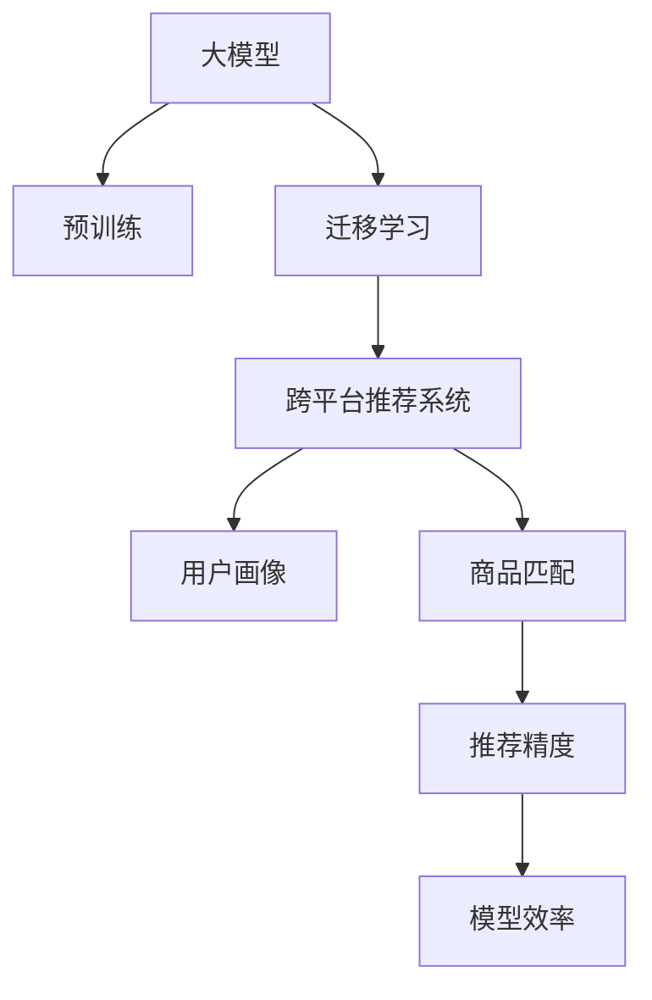

                 

# 电商行业中的迁移学习：大模型在跨平台推荐中的应用

> 关键词：电商推荐、迁移学习、大模型、跨平台、用户画像、商品匹配

## 1. 背景介绍

### 1.1 问题由来

随着电子商务市场的快速扩张，电商平台之间的竞争日益激烈。为了提升用户体验和销售额，各大电商平台纷纷加大对推荐系统的投入。传统的推荐算法往往局限于单个平台的数据，难以实现跨平台间的个性化推荐。

近些年，迁移学习技术的引入，为大模型在跨平台推荐中的应用提供了新的可能。通过在大规模的通用语料上进行预训练，再针对特定平台数据进行微调，可以实现跨平台间的迁移学习，使得模型在不同平台间具备良好的泛化能力，从而提升整体推荐系统的效果。

### 1.2 问题核心关键点

大模型在跨平台推荐中的应用，主要面临以下几个关键问题：

- 数据差异性：不同平台的商品、用户特征存在较大差异，如何在大规模语料上预训练得到具有泛化能力的大模型？
- 平台兼容性：跨平台推荐系统需要保证不同平台之间的数据格式和模型结构一致，如何实现？
- 推荐精度：跨平台推荐需要同时兼顾多个平台的个性化推荐需求，如何平衡？
- 模型效率：跨平台推荐系统需要实时处理大规模数据，如何提高模型的推理效率？

本文将围绕这些核心问题，探讨大模型在电商推荐中的应用，重点介绍迁移学习在大模型推荐系统中的应用。

## 2. 核心概念与联系

### 2.1 核心概念概述

为更好地理解迁移学习在大模型推荐系统中的应用，本节将介绍几个关键概念：

- 大模型：以Transformer等架构为代表的大规模预训练语言模型，如BERT、GPT-3等。
- 迁移学习：将一个领域学到的知识迁移到另一个不同但相关的领域的学习范式。
- 跨平台推荐系统：一个支持多平台用户请求，并提供跨平台个性化推荐的服务系统。
- 用户画像：根据用户历史行为数据构建的用户个性化描述，用于指导推荐系统。
- 商品匹配：根据用户画像和商品信息，匹配推荐结果的过程。
- 模型泛化能力：模型在不同数据集上的预测能力。

这些概念之间的逻辑关系可以通过以下Mermaid流程图来展示：



这个流程图展示了大模型在跨平台推荐系统中的核心概念及其之间的关系：

1. 大模型通过预训练获得基础能力。
2. 迁移学习通过跨平台微调，使得模型具有泛化能力，可用于不同平台。
3. 跨平台推荐系统通过用户画像和商品匹配，实现个性化推荐。
4. 推荐精度和模型效率是大模型在电商推荐中需要平衡的关键指标。

这些概念共同构成了电商推荐系统的核心，为大模型在电商推荐中的应用提供了理论基础。

## 3. 核心算法原理 & 具体操作步骤
### 3.1 算法原理概述

大模型在跨平台推荐中的应用，基于迁移学习的原理。具体而言，大模型通过在大规模通用语料上进行预训练，学习到通用的语言表示和知识。然后，在每个平台的标注数据上进行微调，使得模型能够适应平台特定的数据分布和推荐需求，从而实现跨平台的个性化推荐。

在预训练阶段，大模型学习的是通用的语言表示，对语言本身的规律和特性进行建模。在微调阶段，模型通过对特定平台的标注数据进行训练，学习到平台特有的推荐规则和用户偏好，从而实现跨平台的泛化。

### 3.2 算法步骤详解

基于迁移学习的大模型跨平台推荐，一般包括以下几个关键步骤：

**Step 1: 准备预训练模型和数据集**
- 选择合适的预训练语言模型 $M_{\theta}$，如BERT、GPT等。
- 收集各平台的标注数据集 $D_{platform}=\{(x_i, y_i)\}_{i=1}^N$，其中 $x_i$ 为平台特化的推荐数据，$y_i$ 为推荐结果。
- 将各平台数据集划分为训练集、验证集和测试集。

**Step 2: 设计任务适配层**
- 在预训练模型的顶层设计合适的输出层和损失函数。
- 对于推荐任务，通常使用交叉熵损失函数，计算预测结果与真实结果之间的差异。
- 考虑不同平台数据集的差异，对输出层和损失函数进行适当调整。

**Step 3: 设置微调超参数**
- 选择合适的优化算法及其参数，如 AdamW、SGD 等，设置学习率、批大小、迭代轮数等。
- 设置正则化技术及强度，包括权重衰减、Dropout、Early Stopping 等。
- 确定冻结预训练参数的策略，如仅微调顶层，或全部参数都参与微调。

**Step 4: 执行梯度训练**
- 将各平台训练集数据分批次输入模型，前向传播计算损失函数。
- 反向传播计算参数梯度，根据设定的优化算法和学习率更新模型参数。
- 周期性在各平台验证集上评估模型性能，根据性能指标决定是否触发 Early Stopping。
- 重复上述步骤直到满足预设的迭代轮数或 Early Stopping 条件。

**Step 5: 测试和部署**
- 在测试集上评估微调后模型 $M_{\hat{\theta}}$ 的性能，对比微调前后的精度提升。
- 使用微调后的模型对新样本进行推理预测，集成到各平台的推荐系统中。
- 持续收集新的数据，定期重新微调模型，以适应数据分布的变化。

以上是基于迁移学习微调大模型推荐的一般流程。在实际应用中，还需要针对具体平台的数据特点，对微调过程的各个环节进行优化设计，如改进训练目标函数，引入更多的正则化技术，搜索最优的超参数组合等，以进一步提升模型性能。

### 3.3 算法优缺点

基于迁移学习的大模型跨平台推荐方法具有以下优点：

1. 数据共享：跨平台推荐可以通过共享大模型预训练的权重，减少不同平台之间数据集的差异性。
2. 泛化能力强：大模型通过在多平台数据上进行微调，能够较好地泛化到新的数据集，提升推荐系统的鲁棒性。
3. 参数高效：由于只微调顶层，大部分预训练参数保持不变，模型训练和推理速度较快。
4. 效果显著：大模型通常能够获得比传统推荐系统更好的推荐效果，尤其是在跨平台推荐场景下。

同时，该方法也存在一定的局限性：

1. 数据获取困难：不同平台的标注数据获取可能较为困难，影响模型的训练。
2. 模型通用性有限：不同平台的商品和用户特性差异较大，模型泛化能力可能受限。
3. 模型维护成本高：需要定期重新微调模型，更新平台数据集，维护成本较高。
4. 隐私风险：跨平台推荐可能涉及不同平台的用户隐私，隐私保护需要特别关注。

尽管存在这些局限性，但就目前而言，基于迁移学习的微调方法仍是大模型推荐系统应用的最主流范式。未来相关研究的重点在于如何进一步降低模型维护成本，提高模型的少样本学习和跨领域迁移能力，同时兼顾可解释性和伦理安全性等因素。

### 3.4 算法应用领域

基于大模型微调的迁移学习推荐方法，在电商领域已经得到了广泛的应用，覆盖了几乎所有常见任务，例如：

- 商品推荐：如对用户浏览历史、点击记录、评价等进行深度学习，预测用户可能感兴趣的商品。
- 跨平台推荐：不同电商平台之间互相推荐商品，提升用户购物体验。
- 个性化推荐：根据用户画像，推荐相关商品或服务，满足用户个性化需求。
- 新商品推荐：通过分析用户的购买行为，推荐新上市的商品，引导用户尝试新产品。
- 促销推荐：根据用户行为和季节性变化，推荐限时优惠商品，提升销售量。

除了上述这些经典任务外，大模型微调还被创新性地应用到更多场景中，如实时推荐、内容过滤、广告推荐等，为电商技术带来了全新的突破。随着预训练模型和微调方法的不断进步，相信电商推荐技术将在更广阔的应用领域大放异彩。

## 4. 数学模型和公式 & 详细讲解  
### 4.1 数学模型构建

本节将使用数学语言对基于迁移学习的大模型跨平台推荐过程进行更加严格的刻画。

记预训练语言模型为 $M_{\theta}$，其中 $\theta$ 为预训练得到的模型参数。假设跨平台推荐任务的训练集为 $D=\{(x_i,y_i)\}_{i=1}^N$，其中 $x_i$ 为平台特化的推荐数据，$y_i$ 为推荐结果。

定义模型 $M_{\theta}$ 在数据样本 $(x,y)$ 上的损失函数为 $\ell(M_{\theta}(x),y)$，则在数据集 $D$ 上的经验风险为：

$$
\mathcal{L}(\theta) = \frac{1}{N}\sum_{i=1}^N \ell(M_{\theta}(x_i),y_i)
$$

在微调阶段，通过反向传播算法计算损失函数的梯度，并更新模型参数，使得模型输出与真实标签之间的差异最小化：

$$
\theta \leftarrow \theta - \eta \nabla_{\theta}\mathcal{L}(\theta)
$$

其中 $\eta$ 为学习率，$\nabla_{\theta}\mathcal{L}(\theta)$ 为损失函数对参数 $\theta$ 的梯度，可利用反向传播算法高效计算。

### 4.2 公式推导过程

以下我们以二分类任务为例，推导交叉熵损失函数及其梯度的计算公式。

假设模型 $M_{\theta}$ 在输入 $x$ 上的输出为 $\hat{y}=M_{\theta}(x) \in [0,1]$，表示样本属于正类的概率。真实标签 $y \in \{0,1\}$。则二分类交叉熵损失函数定义为：

$$
\ell(M_{\theta}(x),y) = -[y\log \hat{y} + (1-y)\log (1-\hat{y})]
$$

将其代入经验风险公式，得：

$$
\mathcal{L}(\theta) = -\frac{1}{N}\sum_{i=1}^N [y_i\log M_{\theta}(x_i)+(1-y_i)\log(1-M_{\theta}(x_i))]
$$

根据链式法则，损失函数对参数 $\theta_k$ 的梯度为：

$$
\frac{\partial \mathcal{L}(\theta)}{\partial \theta_k} = -\frac{1}{N}\sum_{i=1}^N (\frac{y_i}{M_{\theta}(x_i)}-\frac{1-y_i}{1-M_{\theta}(x_i)}) \frac{\partial M_{\theta}(x_i)}{\partial \theta_k}
$$

其中 $\frac{\partial M_{\theta}(x_i)}{\partial \theta_k}$ 可进一步递归展开，利用自动微分技术完成计算。

在得到损失函数的梯度后，即可带入参数更新公式，完成模型的迭代优化。重复上述过程直至收敛，最终得到适应跨平台推荐任务的最优模型参数 $\theta^*$。

## 5. 项目实践：代码实例和详细解释说明
### 5.1 开发环境搭建

在进行跨平台推荐系统开发前，我们需要准备好开发环境。以下是使用Python进行PyTorch开发的环境配置流程：

1. 安装Anaconda：从官网下载并安装Anaconda，用于创建独立的Python环境。

2. 创建并激活虚拟环境：
```bash
conda create -n pytorch-env python=3.8 
conda activate pytorch-env
```

3. 安装PyTorch：根据CUDA版本，从官网获取对应的安装命令。例如：
```bash
conda install pytorch torchvision torchaudio cudatoolkit=11.1 -c pytorch -c conda-forge
```

4. 安装Transformers库：
```bash
pip install transformers
```

5. 安装各类工具包：
```bash
pip install numpy pandas scikit-learn matplotlib tqdm jupyter notebook ipython
```

完成上述步骤后，即可在`pytorch-env`环境中开始跨平台推荐系统开发。

### 5.2 源代码详细实现

下面我们以电商平台商品推荐为例，给出使用Transformers库对BERT模型进行跨平台微调的PyTorch代码实现。

首先，定义商品推荐任务的数学模型和数据处理函数：

```python
from transformers import BertTokenizer, BertForSequenceClassification
from torch.utils.data import Dataset
import torch

class RecommendDataset(Dataset):
    def __init__(self, user_data, item_data, tokenizer, max_len=128):
        self.user_data = user_data
        self.item_data = item_data
        self.tokenizer = tokenizer
        self.max_len = max_len
        
    def __len__(self):
        return len(self.user_data)
    
    def __getitem__(self, item):
        user = self.user_data[item]
        item = self.item_data[item]
        
        encoding = self.tokenizer(user, item, return_tensors='pt', max_length=self.max_len, padding='max_length', truncation=True)
        input_ids = encoding['input_ids'][0]
        attention_mask = encoding['attention_mask'][0]
        item_ids = encoding['token_type_ids'][0]
        user_ids = encoding['token_type_ids'][1]
        
        # 对user-id和item-id进行编码
        encoded_user = [user2id[user_id] for user_id in user_ids] 
        encoded_user.extend([user2id['<user-sep>']] * (self.max_len - len(encoded_user)))
        encoded_item = [item2id[item_id] for item_id in item_ids] 
        encoded_item.extend([item2id['<item-sep>']] * (self.max_len - len(encoded_item)))
        
        return {'input_ids': input_ids, 
                'attention_mask': attention_mask,
                'item_ids': encoded_item,
                'user_ids': encoded_user,
                'labels': user_item_to_item_labels}

# 用户和物品的id与标签映射
user2id = {'<user-sep>': 0, 'item': 1, '<item-sep>': 2}
id2user = {v: k for k, v in user2id.items()}
item2id = {'<item-sep>': 3, 'item': 4, '<user-sep>': 5}
id2item = {v: k for k, v in item2id.items()}
user_item_to_item_labels = {f'{user_id}<{item_id}': item_id for user_id, item_id in user_item_recommendations}

# 创建dataset
tokenizer = BertTokenizer.from_pretrained('bert-base-cased')
train_dataset = RecommendDataset(train_user_data, train_item_data, tokenizer)
dev_dataset = RecommendDataset(dev_user_data, dev_item_data, tokenizer)
test_dataset = RecommendDataset(test_user_data, test_item_data, tokenizer)
```

然后，定义模型和优化器：

```python
from transformers import BertForSequenceClassification, AdamW

model = BertForSequenceClassification.from_pretrained('bert-base-cased', num_labels=len(item2id))

optimizer = AdamW(model.parameters(), lr=2e-5)
```

接着，定义训练和评估函数：

```python
from torch.utils.data import DataLoader
from tqdm import tqdm
from sklearn.metrics import classification_report

device = torch.device('cuda') if torch.cuda.is_available() else torch.device('cpu')
model.to(device)

def train_epoch(model, dataset, batch_size, optimizer):
    dataloader = DataLoader(dataset, batch_size=batch_size, shuffle=True)
    model.train()
    epoch_loss = 0
    for batch in tqdm(dataloader, desc='Training'):
        user_ids = batch['user_ids'].to(device)
        item_ids = batch['item_ids'].to(device)
        labels = batch['labels'].to(device)
        model.zero_grad()
        outputs = model(user_ids, item_ids, attention_mask=batch['attention_mask'])
        loss = outputs.loss
        epoch_loss += loss.item()
        loss.backward()
        optimizer.step()
    return epoch_loss / len(dataloader)

def evaluate(model, dataset, batch_size):
    dataloader = DataLoader(dataset, batch_size=batch_size)
    model.eval()
    preds, labels = [], []
    with torch.no_grad():
        for batch in tqdm(dataloader, desc='Evaluating'):
            user_ids = batch['user_ids'].to(device)
            item_ids = batch['item_ids'].to(device)
            batch_labels = batch['labels']
            outputs = model(user_ids, item_ids, attention_mask=batch['attention_mask'])
            batch_preds = outputs.logits.argmax(dim=2).to('cpu').tolist()
            batch_labels = batch_labels.to('cpu').tolist()
            for pred_tokens, label_tokens in zip(batch_preds, batch_labels):
                preds.append(pred_tokens)
                labels.append(label_tokens)
                
    print(classification_report(labels, preds))
```

最后，启动训练流程并在测试集上评估：

```python
epochs = 5
batch_size = 16

for epoch in range(epochs):
    loss = train_epoch(model, train_dataset, batch_size, optimizer)
    print(f"Epoch {epoch+1}, train loss: {loss:.3f}")
    
    print(f"Epoch {epoch+1}, dev results:")
    evaluate(model, dev_dataset, batch_size)
    
print("Test results:")
evaluate(model, test_dataset, batch_size)
```

以上就是使用PyTorch对BERT进行电商平台商品推荐任务微调的完整代码实现。可以看到，得益于Transformers库的强大封装，我们可以用相对简洁的代码完成BERT模型的加载和微调。

### 5.3 代码解读与分析

让我们再详细解读一下关键代码的实现细节：

**RecommendDataset类**：
- `__init__`方法：初始化用户数据、商品数据、分词器等关键组件。
- `__len__`方法：返回数据集的样本数量。
- `__getitem__`方法：对单个样本进行处理，将用户和商品数据输入编码为token ids，同时对用户和物品的id进行编码，最终返回模型所需的输入。

**user2id和id2user字典**：
- 定义了用户和物品的id与标签之间的映射关系，用于将用户物品id转换为模型可处理的token序列。

**训练和评估函数**：
- 使用PyTorch的DataLoader对数据集进行批次化加载，供模型训练和推理使用。
- 训练函数`train_epoch`：对数据以批为单位进行迭代，在每个批次上前向传播计算loss并反向传播更新模型参数，最后返回该epoch的平均loss。
- 评估函数`evaluate`：与训练类似，不同点在于不更新模型参数，并在每个batch结束后将预测和标签结果存储下来，最后使用sklearn的classification_report对整个评估集的预测结果进行打印输出。

**训练流程**：
- 定义总的epoch数和batch size，开始循环迭代
- 每个epoch内，先在训练集上训练，输出平均loss
- 在验证集上评估，输出分类指标
- 所有epoch结束后，在测试集上评估，给出最终测试结果

可以看到，PyTorch配合Transformers库使得BERT微调的代码实现变得简洁高效。开发者可以将更多精力放在数据处理、模型改进等高层逻辑上，而不必过多关注底层的实现细节。

当然，工业级的系统实现还需考虑更多因素，如模型的保存和部署、超参数的自动搜索、更灵活的任务适配层等。但核心的微调范式基本与此类似。

## 6. 实际应用场景
### 6.1 智能客服系统

基于大模型微调的推荐技术，可以广泛应用于智能客服系统的构建。传统客服往往需要配备大量人力，高峰期响应缓慢，且一致性和专业性难以保证。而使用微调后的推荐系统，可以7x24小时不间断服务，快速响应客户咨询，用推荐结果指导客服回答，提升客户咨询体验和问题解决效率。

在技术实现上，可以收集企业内部的历史客服对话记录，将问题和最佳答复构建成监督数据，在此基础上对预训练推荐模型进行微调。微调后的推荐系统能够自动理解用户意图，匹配最合适的回答，并在用户续问时动态生成推荐，满足用户的多样化需求。

### 6.2 金融舆情监测

金融机构需要实时监测市场舆论动向，以便及时应对负面信息传播，规避金融风险。传统的人工监测方式成本高、效率低，难以应对网络时代海量信息爆发的挑战。基于大模型微调的推荐技术，为金融舆情监测提供了新的解决方案。

具体而言，可以收集金融领域相关的新闻、报道、评论等文本数据，并对其进行主题标注和情感标注。在此基础上对预训练语言模型进行微调，使其能够自动判断文本属于何种主题，情感倾向是正面、中性还是负面。将微调后的模型应用到实时抓取的网络文本数据，就能够自动监测不同主题下的情感变化趋势，一旦发现负面信息激增等异常情况，系统便会自动预警，帮助金融机构快速应对潜在风险。

### 6.3 个性化推荐系统

当前的推荐系统往往只依赖用户的历史行为数据进行物品推荐，无法深入理解用户的真实兴趣偏好。基于大模型微调的推荐系统，可以更好地挖掘用户行为背后的语义信息，从而提供更精准、多样的推荐内容。

在实践中，可以收集用户浏览、点击、评论、分享等行为数据，提取和用户交互的物品标题、描述、标签等文本内容。将文本内容作为模型输入，用户的后续行为（如是否点击、购买等）作为监督信号，在此基础上微调预训练语言模型。微调后的模型能够从文本内容中准确把握用户的兴趣点。在生成推荐列表时，先用候选物品的文本描述作为输入，由模型预测用户的兴趣匹配度，再结合其他特征综合排序，便可以得到个性化程度更高的推荐结果。

### 6.4 未来应用展望

随着大模型和微调方法的不断发展，基于迁移学习的推荐系统将在更多领域得到应用，为传统行业带来变革性影响。

在智慧医疗领域，基于大模型微调的推荐系统可以推荐相关治疗方案、药品、医院等，提升医疗服务的智能化水平，辅助医生诊疗，加速新药开发进程。

在智能教育领域，微调技术可应用于作业批改、学情分析、知识推荐等方面，因材施教，促进教育公平，提高教学质量。

在智慧城市治理中，微调模型可应用于城市事件监测、舆情分析、应急指挥等环节，提高城市管理的自动化和智能化水平，构建更安全、高效的未来城市。

此外，在企业生产、社会治理、文娱传媒等众多领域，基于大模型微调的推荐系统也将不断涌现，为经济社会发展注入新的动力。相信随着技术的日益成熟，微调方法将成为推荐系统的重要范式，推动人工智能技术在垂直行业的规模化落地。总之，微调需要开发者根据具体任务，不断迭代和优化模型、数据和算法，方能得到理想的效果。

## 7. 工具和资源推荐
### 7.1 学习资源推荐

为了帮助开发者系统掌握大模型在推荐系统中的应用，这里推荐一些优质的学习资源：

1. 《Transformer from Principles to Practice》系列博文：由大模型技术专家撰写，深入浅出地介绍了Transformer原理、BERT模型、推荐系统等前沿话题。

2. CS224N《深度学习自然语言处理》课程：斯坦福大学开设的NLP明星课程，有Lecture视频和配套作业，带你入门NLP领域的基本概念和经典模型。

3. 《Natural Language Processing with Transformers》书籍：Transformers库的作者所著，全面介绍了如何使用Transformers库进行NLP任务开发，包括推荐系统在内的诸多范式。

4. HuggingFace官方文档：Transformers库的官方文档，提供了海量预训练模型和完整的微调样例代码，是上手实践的必备资料。

5. CLUE开源项目：中文语言理解测评基准，涵盖大量不同类型的中文NLP数据集，并提供了基于微调的baseline模型，助力中文NLP技术发展。

通过对这些资源的学习实践，相信你一定能够快速掌握大模型在推荐系统中的应用精髓，并用于解决实际的NLP问题。
###  7.2 开发工具推荐

高效的开发离不开优秀的工具支持。以下是几款用于大模型推荐系统开发的常用工具：

1. PyTorch：基于Python的开源深度学习框架，灵活动态的计算图，适合快速迭代研究。大部分预训练语言模型都有PyTorch版本的实现。

2. TensorFlow：由Google主导开发的开源深度学习框架，生产部署方便，适合大规模工程应用。同样有丰富的预训练语言模型资源。

3. Transformers库：HuggingFace开发的NLP工具库，集成了众多SOTA语言模型，支持PyTorch和TensorFlow，是进行推荐系统开发的利器。

4. Weights & Biases：模型训练的实验跟踪工具，可以记录和可视化模型训练过程中的各项指标，方便对比和调优。与主流深度学习框架无缝集成。

5. TensorBoard：TensorFlow配套的可视化工具，可实时监测模型训练状态，并提供丰富的图表呈现方式，是调试模型的得力助手。

6. Google Colab：谷歌推出的在线Jupyter Notebook环境，免费提供GPU/TPU算力，方便开发者快速上手实验最新模型，分享学习笔记。

合理利用这些工具，可以显著提升大模型推荐系统的开发效率，加快创新迭代的步伐。

### 7.3 相关论文推荐

大模型和微调推荐技术的发展源于学界的持续研究。以下是几篇奠基性的相关论文，推荐阅读：

1. Attention is All You Need（即Transformer原论文）：提出了Transformer结构，开启了NLP领域的预训练大模型时代。

2. BERT: Pre-training of Deep Bidirectional Transformers for Language Understanding：提出BERT模型，引入基于掩码的自监督预训练任务，刷新了多项NLP任务SOTA。

3. Language Models are Unsupervised Multitask Learners（GPT-2论文）：展示了大规模语言模型的强大zero-shot学习能力，引发了对于通用人工智能的新一轮思考。

4. Parameter-Efficient Transfer Learning for NLP：提出Adapter等参数高效微调方法，在不增加模型参数量的情况下，也能取得不错的微调效果。

5. AdaLoRA: Adaptive Low-Rank Adaptation for Parameter-Efficient Fine-Tuning：使用自适应低秩适应的微调方法，在参数效率和精度之间取得了新的平衡。

6. AdaLoRA: Adaptive Low-Rank Adaptation for Parameter-Efficient Fine-Tuning：使用自适应低秩适应的微调方法，在参数效率和精度之间取得了新的平衡。

这些论文代表了大模型微调技术的发展脉络。通过学习这些前沿成果，可以帮助研究者把握学科前进方向，激发更多的创新灵感。

## 8. 总结：未来发展趋势与挑战

### 8.1 总结

本文对基于迁移学习的大模型在电商推荐中的应用进行了全面系统的介绍。首先阐述了迁移学习在大模型推荐系统中的应用背景和意义，明确了跨平台微调在提升推荐系统性能方面的独特价值。其次，从原理到实践，详细讲解了迁移学习的数学原理和关键步骤，给出了跨平台推荐任务开发的完整代码实例。同时，本文还广泛探讨了跨平台推荐系统在智能客服、金融舆情、个性化推荐等多个行业领域的应用前景，展示了迁移学习范式的巨大潜力。此外，本文精选了跨平台推荐技术的各类学习资源，力求为读者提供全方位的技术指引。

通过本文的系统梳理，可以看到，基于迁移学习的大模型推荐系统正在成为电商推荐领域的重要范式，极大地拓展了推荐系统的应用边界，催生了更多的落地场景。得益于大规模语料的预训练，跨平台推荐系统能够在不同平台间进行知识迁移，实现商品推荐效果的一致性和连贯性，提升了整体推荐系统的性能。未来，伴随预训练语言模型和迁移学习方法的不断演进，相信推荐技术将在更广阔的应用领域大放异彩，深刻影响用户的购物体验和电商平台的发展战略。

### 8.2 未来发展趋势

展望未来，基于迁移学习的大模型推荐系统将呈现以下几个发展趋势：

1. 多模态推荐系统：将视觉、音频等多模态数据与文本数据进行融合，提升推荐系统的感知能力和覆盖面。
2. 动态推荐系统：利用时序数据进行动态预测，推荐更加符合用户当前需求的商品。
3. 实时推荐系统：通过流式处理技术，实现对实时数据的高效处理和快速响应。
4. 跨平台协同推荐：利用不同平台间的用户行为和商品信息进行协同推荐，提高推荐系统的综合性和多样性。
5. 个性化推荐引擎：引入因果推断、强化学习等前沿技术，构建更加智能、高效的推荐系统。
6. 联邦学习：利用联邦学习技术，在不同平台间共享模型参数，保护用户隐私的同时提升推荐效果。

这些趋势凸显了大模型推荐系统的广阔前景。这些方向的探索发展，必将进一步提升推荐系统的性能和应用范围，为电商平台和用户带来更大的价值。

### 8.3 面临的挑战

尽管基于迁移学习的大模型推荐系统已经取得了瞩目成就，但在迈向更加智能化、普适化应用的过程中，它仍面临着诸多挑战：

1. 数据不均衡：不同平台的标注数据可能存在不均衡，影响模型的训练效果。如何处理数据不均衡问题，仍需进一步研究。
2. 模型泛化能力有限：不同平台的推荐规则和用户偏好差异较大，模型泛化能力可能受限。如何提高模型的泛化能力，仍需进一步探索。
3. 推理效率低：大模型通常较复杂，推理效率低，难以实时处理大规模数据。如何提高模型的推理效率，仍是重要的优化方向。
4. 隐私保护问题：跨平台推荐系统涉及不同平台的用户数据，隐私保护问题亟需解决。如何保护用户隐私，确保数据安全，仍需进一步研究。
5. 可解释性不足：大模型通常作为"黑盒"系统，难以解释其内部工作机制和决策逻辑。如何赋予推荐模型更强的可解释性，仍需进一步探索。
6. 技术壁垒高：大模型推荐系统的实现复杂，需要深厚的深度学习、NLP和推荐系统基础。如何降低技术壁垒，使更多开发者能够上手应用，仍需进一步探索。

尽管存在这些挑战，但就目前而言，基于迁移学习的微调方法仍是大模型推荐系统应用的最主流范式。未来相关研究的重点在于如何进一步降低模型维护成本，提高模型的少样本学习和跨领域迁移能力，同时兼顾可解释性和伦理安全性等因素。

### 8.4 研究展望

面对基于迁移学习的大模型推荐系统所面临的种种挑战，未来的研究需要在以下几个方面寻求新的突破：

1. 探索无监督和半监督推荐方法。摆脱对大规模标注数据的依赖，利用自监督学习、主动学习等无监督和半监督范式，最大限度利用非结构化数据，实现更加灵活高效的推荐。

2. 研究参数高效和计算高效的推荐范式。开发更加参数高效的推荐方法，在固定大部分预训练参数的同时，只更新极少量的任务相关参数。同时优化推荐模型的计算图，减少前向传播和反向传播的资源消耗，实现更加轻量级、实时性的部署。

3. 引入更多先验知识。将符号化的先验知识，如知识图谱、逻辑规则等，与神经网络模型进行巧妙融合，引导推荐过程学习更准确、合理的推荐规则。同时加强不同模态数据的整合，实现视觉、语音等多模态信息与文本信息的协同建模。

4. 结合因果分析和博弈论工具。将因果分析方法引入推荐模型，识别出模型决策的关键特征，增强推荐输出解释的因果性和逻辑性。借助博弈论工具刻画人机交互过程，主动探索并规避模型的脆弱点，提高系统稳定性。

5. 纳入伦理道德约束。在推荐模型训练目标中引入伦理导向的评估指标，过滤和惩罚有害的输出倾向。同时加强人工干预和审核，建立模型行为的监管机制，确保推荐内容符合人类价值观和伦理道德。

这些研究方向的探索，必将引领大模型推荐系统迈向更高的台阶，为构建安全、可靠、可解释、可控的智能推荐系统铺平道路。面向未来，大模型推荐系统还需要与其他人工智能技术进行更深入的融合，如知识表示、因果推理、强化学习等，多路径协同发力，共同推动推荐系统技术的发展。只有勇于创新、敢于突破，才能不断拓展推荐系统的边界，让智能技术更好地服务用户，促进社会进步。

## 9. 附录：常见问题与解答

**Q1：大模型推荐系统是否适用于所有电商推荐任务？**

A: 大模型推荐系统在大多数电商推荐任务上都能取得不错的效果，特别是对于数据量较小的任务。但对于一些特定领域的任务，如医药、教育等，仅仅依靠通用语料预训练的模型可能难以很好地适应。此时需要在特定领域语料上进一步预训练，再进行微调，才能获得理想效果。此外，对于一些需要时效性、个性化很强的任务，如实时推荐、内容过滤等，微调方法也需要针对性的改进优化。

**Q2：大模型推荐系统的学习率如何设置？**

A: 推荐系统的学习率一般要比预训练时小1-2个数量级，如果使用过大的学习率，容易破坏预训练权重，导致过拟合。一般建议从1e-5开始调参，逐步减小学习率，直至收敛。也可以使用warmup策略，在开始阶段使用较小的学习率，再逐渐过渡到预设值。需要注意的是，不同的优化器(如AdamW、Adafactor等)以及不同的学习率调度策略，可能需要设置不同的学习率阈值。

**Q3：大模型推荐系统的推理效率如何提升？**

A: 大模型推荐系统通常较复杂，推理效率低，难以实时处理大规模数据。可以通过以下方法提升推理效率：
1. 模型裁剪：去除不必要的层和参数，减小模型尺寸，加快推理速度。
2. 量化加速：将浮点模型转为定点模型，压缩存储空间，提高计算效率。
3. 模型并行：利用多GPU或多TPU进行模型并行计算，提高推理速度。
4. 流式处理：利用流式处理技术，实时处理数据流，避免数据堆积。
5. 预计算：将部分计算任务预计算，减少实时推理的计算量。

这些方法需要根据具体任务和硬件环境进行综合优化。只有在保证推荐精度的同时，提高推理效率，才能实现大模型推荐系统的实时化。

**Q4：大模型推荐系统的隐私保护问题如何解决？**

A: 大模型推荐系统涉及不同平台的用户数据，隐私保护问题亟需解决。可以通过以下方法保护用户隐私：
1. 数据匿名化：对用户数据进行去标识化处理，避免直接暴露用户隐私。
2. 联邦学习：利用联邦学习技术，在不同平台间共享模型参数，保护用户数据在本地处理。
3. 差分隐私：在模型训练过程中引入差分隐私技术，保护个体用户隐私。
4. 访问控制：对用户数据访问进行严格控制，限制模型对数据的访问权限。
5. 数据加密：对用户数据进行加密处理，保护数据传输和存储安全。

这些方法需要根据具体场景和需求进行选择和组合，确保在大模型推荐系统中，用户数据的安全和隐私得到有效保护。

**Q5：大模型推荐系统的可解释性如何提升？**

A: 大模型推荐系统通常作为"黑盒"系统，难以解释其内部工作机制和决策逻辑。可以通过以下方法提升推荐模型的可解释性：
1. 特征可视化：利用可视化工具，展示模型在各个特征上的权重和重要性。
2. 模型蒸馏：将大模型进行蒸馏，转化为更简单的模型，增强解释性。
3. 逻辑规则提取：通过逻辑规则提取技术，分析模型内部决策逻辑。
4. 因果推断：利用因果推断方法，分析推荐结果的因果关系，增强可解释性。
5. 用户反馈机制：引入用户反馈机制，通过用户反馈不断优化模型和推荐结果。

这些方法需要根据具体任务和需求进行选择和组合，确保在大模型推荐系统中，推荐过程的可解释性得到有效提升。

通过本文的系统梳理，可以看到，基于迁移学习的大模型推荐系统正在成为电商推荐领域的重要范式，极大地拓展了推荐系统的应用边界，催生了更多的落地场景。得益于大规模语料的预训练，跨平台推荐系统能够在不同平台间进行知识迁移，实现商品推荐效果的一致性和连贯性，提升了整体推荐系统的性能。未来，伴随预训练语言模型和迁移学习方法的不断演进，相信推荐技术将在更广阔的应用领域大放异彩，深刻影响用户的购物体验和电商平台的发展战略。

---

作者：禅与计算机程序设计艺术 / Zen and the Art of Computer Programming

