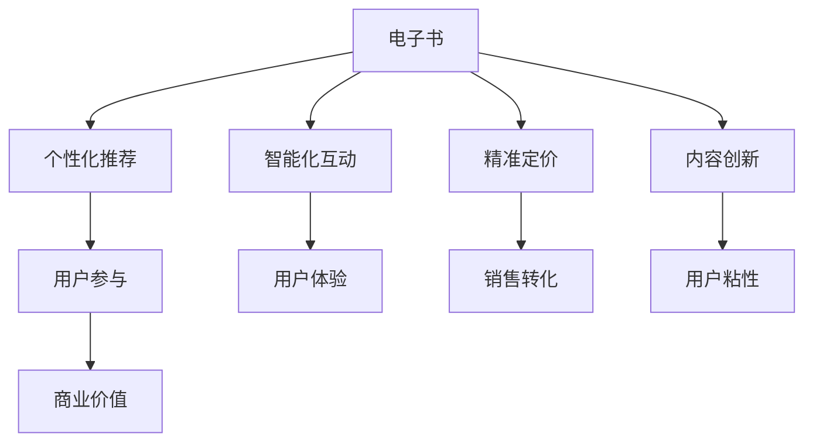

                 

# 电子书市场在注意力经济中的变革

## 1. 背景介绍

### 1.1 问题由来
随着数字技术的迅猛发展，数字出版物逐渐成为人们获取知识和信息的主要途径。尤其是在全球新冠疫情爆发后，居家办公和在线学习成为常态，电子书市场的规模快速扩大。据联合国教科文组织统计，全球电子书市场的销售额预计将在2025年超过400亿美元，成为出版业的重要支柱。

然而，电子书市场的现状并不乐观。一方面，数字化过程中依然存在版权问题、盗版猖獗、定价策略失衡等问题，严重影响了市场健康发展。另一方面，电子书用户阅读体验仍有待提升，缺乏个性化推荐和智能化互动，难以真正实现“以用户为中心”的服务模式。

在这样的背景下，以“注意力”为核心的新型注意力经济模式应运而生。通过捕捉用户注意力，优化阅读体验，提升用户参与度，电子书市场有望在注意力经济驱动下，实现更加智能化、个性化的服务转型，推动整个出版行业的数字化转型升级。

### 1.2 问题核心关键点
注意力经济模式的核心在于，通过技术手段获取用户注意力，提升用户体验和互动性，进而增加用户黏性，提高市场转化率和盈利能力。

具体而言，电子书市场可以从以下几个方面进行变革：

- 个性化推荐系统：利用机器学习和大数据技术，为用户推荐感兴趣的电子书。
- 智能化互动：利用自然语言处理、计算机视觉等技术，实现人机交互，提升用户体验。
- 精准定价：通过分析用户行为数据，制定个性化定价策略，提高销售转化率。
- 内容创新：引入用户生成内容，通过社交互动增加内容多样性和用户粘性。

在实际应用中，注意力经济模式不仅能提升用户满意度，还能显著降低出版商的成本和风险，为整个市场带来新的增长点。

### 1.3 问题研究意义
研究电子书市场在注意力经济模式下的变革，对于拓展电子书市场的空间，提升用户满意度和市场竞争力，具有重要意义：

1. 提供数据驱动的用户画像：通过大数据分析，建立用户行为和兴趣模型，为用户提供个性化推荐，提升用户参与度和粘性。
2. 提升出版商的营销效率：精准定价和个性化营销策略，能有效提高出版物的市场转化率和用户留存率，降低营销成本。
3. 推动出版业数字化转型：引入先进的数字技术和智能算法，提升出版物的数字化水平，实现出版的全流程数字化。
4. 增强出版物的社交属性：通过引入用户生成内容，促进用户之间的交流和互动，增加内容多样性和用户粘性。
5. 改善用户阅读体验：利用智能化技术和个性化推荐，提升用户阅读的便捷性和互动性，增强用户体验。

## 2. 核心概念与联系

### 2.1 核心概念概述

为更好地理解电子书市场在注意力经济模式下的变革，本节将介绍几个密切相关的核心概念：

- 电子书(E-books)：指通过电子设备进行阅读的数字出版物，具有方便携带、检索迅速等优点。
- 注意力经济(Attention Economy)：一种新型经济模式，通过获取用户注意力，提升用户体验，实现商业价值的最大化。
- 个性化推荐系统：基于用户行为和兴趣，自动推荐相关内容，提升用户参与度和满意度。
- 智能化互动：利用自然语言处理、计算机视觉等技术，实现人机交互，提升用户体验。
- 精准定价：通过分析用户行为数据，制定个性化定价策略，提高销售转化率。
- 内容创新：引入用户生成内容，增加内容多样性和用户粘性。

这些核心概念之间的逻辑关系可以通过以下Mermaid流程图来展示：



这个流程图展示了个书市场在注意力经济模式下的核心概念及其之间的关系：

1. 电子书通过个性化推荐、智能化互动、精准定价和内容创新等手段，吸引用户关注，提升用户体验。
2. 提升的用户参与度、用户满意度和销售转化率，为出版商带来新的商业价值。

这些概念共同构成了电子书市场在注意力经济模式下的变革框架，使其能够在数字化转型中保持竞争力和市场份额。

## 3. 核心算法原理 & 具体操作步骤
### 3.1 算法原理概述

电子书市场在注意力经济模式下的变革，本质上是一种以用户为中心的数据驱动型商业模式。其核心思想是：通过获取和分析用户注意力数据，优化电子书推荐、定价、内容和互动，提升用户体验，从而实现商业价值最大化。

形式化地，假设电子书市场由出版商、用户和推荐系统三部分构成，其中推荐系统为中间媒介，负责根据用户行为数据，自动生成个性化推荐，并辅助出版商进行定价和内容管理。

### 3.2 算法步骤详解

电子书市场在注意力经济模式下的变革，主要包括以下几个关键步骤：

**Step 1: 数据采集与处理**
- 收集用户点击、阅读、购买、评论等行为数据。
- 通过数据清洗和预处理，去除噪声和异常值，生成用户行为数据集。
- 利用自然语言处理、计算机视觉等技术，从用户评论、社交媒体等渠道提取用户兴趣和情感。

**Step 2: 用户画像建立**
- 利用机器学习算法，如协同过滤、深度学习等，建立用户行为和兴趣模型。
- 通过聚类分析，将用户分为不同兴趣群组，生成用户画像。
- 结合用户画像，生成个性化推荐列表。

**Step 3: 个性化推荐系统**
- 基于用户画像，利用协同过滤、神经网络等推荐算法，生成个性化推荐列表。
- 对推荐结果进行排序，选择最符合用户兴趣的内容进行推荐。
- 实时更新推荐列表，根据用户反馈进行动态调整。

**Step 4: 智能化互动**
- 利用自然语言处理技术，实现人机交互，提升用户体验。
- 通过聊天机器人、虚拟助手等形式，提供个性化咨询和建议。
- 收集用户反馈，优化聊天机器人的回复策略，提高交互效果。

**Step 5: 精准定价**
- 利用机器学习算法，分析用户行为数据，生成用户价值模型。
- 根据用户价值模型，制定个性化定价策略，提高销售转化率。
- 实时监测用户反馈和购买行为，动态调整定价策略。

**Step 6: 内容创新**
- 引入用户生成内容，增加内容多样性和用户粘性。
- 利用社交媒体平台，促进用户之间的交流和互动，形成内容生态。
- 引入数据挖掘和情感分析技术，挖掘用户兴趣和需求，生成高质量内容。

以上是电子书市场在注意力经济模式下的变革过程的主要步骤。在实际应用中，还需要针对具体任务和数据特点，对各个环节进行优化设计，如改进推荐算法，引入更多交互方式，探索精准定价的多种策略等，以进一步提升用户满意度和市场竞争力。

### 3.3 算法优缺点

电子书市场在注意力经济模式下的变革，具有以下优点：
1. 提升用户体验：个性化推荐和智能化互动技术，极大提升了用户的阅读便捷性和互动性，增强了用户粘性。
2. 增加市场转化率：精准定价和个性化营销策略，能有效提高出版物的销售转化率和用户留存率。
3. 优化成本结构：通过数据驱动的决策，降低营销成本和库存风险，提高运营效率。
4. 提升内容多样性：引入用户生成内容，增加内容的多样性和互动性，丰富用户阅读体验。

同时，该方法也存在一定的局限性：
1. 数据隐私问题：获取用户行为数据需遵守隐私法规，确保数据安全。
2. 推荐算法复杂度：高维数据的推荐算法复杂度高，存在推荐准确性不足的风险。
3. 内容质量难以控制：用户生成内容质量参差不齐，需要加强内容审核和监管。
4. 技术成本高：深度学习等技术需高性能计算资源，且需专业人员维护。

尽管存在这些局限性，但就目前而言，注意力经济模式仍是电子书市场优化用户体验、提升市场转化率的重要手段。未来相关研究的重点在于如何进一步降低技术成本，提高推荐算法准确性，加强内容监管和保护用户隐私。

### 3.4 算法应用领域

电子书市场在注意力经济模式下的变革，主要应用于以下几个领域：

- 在线阅读平台：如Kindle、Amazon、当当等平台，通过个性化推荐和智能化互动，提升用户满意度和留存率。
- 教育出版：如电子教材、MOOC等，通过精准定价和内容创新，满足用户个性化需求，提升教育效果。
- 企业培训：如职业培训课程、在线研讨会等，通过智能化互动和内容创新，增强培训效果和用户体验。
- 学术出版：如电子书、期刊论文等，通过个性化推荐和精准定价，提高学术传播和阅读效率。
- 数字旅游：如电子旅游指南、虚拟博物馆等，通过个性化推荐和内容创新，提升用户体验和互动性。

这些领域的应用场景展示了电子书市场在注意力经济模式下的广阔前景，体现了技术手段在提升用户体验和优化运营效率方面的巨大潜力。

## 4. 数学模型和公式 & 详细讲解 & 举例说明
### 4.1 数学模型构建

电子书市场在注意力经济模式下的变革，涉及用户行为数据的采集、处理和分析，以及个性化推荐、智能化互动、精准定价和内容创新的决策过程。其数学模型主要基于以下三个部分：

1. 用户行为数据的建模与分析：利用统计学和机器学习技术，建立用户行为和兴趣模型。
2. 个性化推荐系统的建模与优化：利用协同过滤、神经网络等推荐算法，生成个性化推荐列表。
3. 精准定价和内容创新的决策模型：通过多目标优化，制定个性化定价策略，生成高质量内容。

### 4.2 公式推导过程

以下我们以推荐系统为例，推导个性化推荐公式及其优化过程。

假设用户$u$对物品$i$的评分$x_{ui}$已知，推荐系统需要生成推荐列表$L_u$，其中包含$k$个物品。推荐系统的目标是最大化预测评分与实际评分之间的均方误差：

$$
\min_{L_u} \frac{1}{k} \sum_{i \in L_u} (r_{ui} - \hat{r}_{ui})^2
$$

其中$r_{ui}$为实际评分，$\hat{r}_{ui}$为预测评分。可以通过最大化预测评分来优化目标函数，即：

$$
\max_{L_u} \frac{1}{k} \sum_{i \in L_u} r_{ui} \cdot \hat{r}_{ui}
$$

利用协同过滤算法，推荐系统通过用户历史评分矩阵$X_{ui}$，生成物品$i$的评分向量$\hat{X}_i$。推荐列表$L_u$可通过以下公式计算得到：

$$
L_u = \arg\max_{L_u} \sum_{i \in L_u} r_{ui} \cdot \hat{r}_{ui}
$$

其中$\hat{r}_{ui}$可通过协同过滤算法计算得到，如矩阵分解、邻域推荐等方法。

### 4.3 案例分析与讲解

**案例一：协同过滤算法**
协同过滤算法是推荐系统中最基本的推荐方法，通过分析用户和物品之间的历史评分，生成推荐列表。其具体流程如下：

1. 计算用户$i$对物品$u$的评分：
   $$
   \hat{X}_{ui} = \alpha_u X_u - \beta_u
   $$

   其中$\alpha_u$和$\beta_u$为正则化参数，$X_u$为用户$i$的历史评分向量。
   
2. 计算物品$i$的评分向量$\hat{X}_i$：
   $$
   \hat{X}_i = \alpha_i X_i - \beta_i
   $$

3. 计算推荐列表$L_u$：
   $$
   L_u = \arg\max_{L_u} \sum_{i \in L_u} r_{ui} \cdot \hat{r}_{ui}
   $$

   其中$r_{ui}$为用户$i$对物品$u$的实际评分，$\hat{r}_{ui}$为协同过滤算法的预测评分。

   协同过滤算法的优点在于简单易实现，适用于数据稀疏且稀疏矩阵近似满足正态分布的情况。但缺点在于无法处理新物品和冷启动用户，且容易受到噪声和异常评分的影响。

**案例二：深度学习推荐算法**
深度学习推荐算法通过神经网络模型，直接从用户行为数据中学习推荐策略。其具体流程如下：

1. 构建用户行为特征矩阵$X$：
   $$
   X = \left[\begin{matrix}
   x_{11} & x_{12} & \cdots & x_{1n} \\
   x_{21} & x_{22} & \cdots & x_{2n} \\
   \vdots & \vdots & \ddots & \vdots \\
   x_{m1} & x_{m2} & \cdots & x_{mn}
   \end{matrix}\right]
   $$

2. 构建用户行为预测模型$Y$：
   $$
   Y = f(X) = \left[\begin{matrix}
   y_1 & y_2 & \cdots & y_n
   \end{matrix}\right]
   $$

   其中$f$为神经网络模型，$y_i$为用户$i$对物品$u$的预测评分。

3. 生成推荐列表$L_u$：
   $$
   L_u = \arg\max_{L_u} \sum_{i \in L_u} r_{ui} \cdot \hat{r}_{ui}
   $$

   其中$r_{ui}$为用户$i$对物品$u$的实际评分，$\hat{r}_{ui}$为深度学习模型的预测评分。

   深度学习推荐算法的优点在于能够处理非结构化数据，适用于大规模数据集，且具有较高的预测精度。但缺点在于模型复杂度高，需要大量的训练数据和计算资源，且需要专业人员进行调参和优化。

## 5. 项目实践：代码实例和详细解释说明
### 5.1 开发环境搭建

在进行电子书市场在注意力经济模式下的变革实践前，我们需要准备好开发环境。以下是使用Python进行PyTorch开发的环境配置流程：

1. 安装Anaconda：从官网下载并安装Anaconda，用于创建独立的Python环境。

2. 创建并激活虚拟环境：
```bash
conda create -n pytorch-env python=3.8 
conda activate pytorch-env
```

3. 安装PyTorch：根据CUDA版本，从官网获取对应的安装命令。例如：
```bash
conda install pytorch torchvision torchaudio cudatoolkit=11.1 -c pytorch -c conda-forge
```

4. 安装Transformers库：
```bash
pip install transformers
```

5. 安装各类工具包：
```bash
pip install numpy pandas scikit-learn matplotlib tqdm jupyter notebook ipython
```

完成上述步骤后，即可在`pytorch-env`环境中开始实践。

### 5.2 源代码详细实现

下面我以推荐系统为例，给出使用Transformers库对BERT模型进行推荐系统微调的PyTorch代码实现。

首先，定义推荐系统的训练函数：

```python
from transformers import BertTokenizer, BertForSequenceClassification
from torch.utils.data import Dataset, DataLoader
import torch
import numpy as np

class RecommendationDataset(Dataset):
    def __init__(self, user_ratings, item_ratings, tokenizer, max_len=128):
        self.user_ratings = user_ratings
        self.item_ratings = item_ratings
        self.tokenizer = tokenizer
        self.max_len = max_len
        
    def __len__(self):
        return len(self.user_ratings)
    
    def __getitem__(self, item):
        user_id = self.user_ratings[item]
        item_id = self.item_ratings[item]
        
        encoding = self.tokenizer(user_id, item_id, return_tensors='pt', max_length=self.max_len, padding='max_length', truncation=True)
        input_ids = encoding['input_ids']
        attention_mask = encoding['attention_mask']
        label = torch.tensor([item_id], dtype=torch.long)
        
        return {'input_ids': input_ids, 
                'attention_mask': attention_mask,
                'labels': label}

# 训练函数
def train_epoch(model, dataset, optimizer):
    dataloader = DataLoader(dataset, batch_size=64, shuffle=True)
    model.train()
    epoch_loss = 0
    for batch in dataloader:
        input_ids = batch['input_ids'].to(device)
        attention_mask = batch['attention_mask'].to(device)
        labels = batch['labels'].to(device)
        model.zero_grad()
        outputs = model(input_ids, attention_mask=attention_mask, labels=labels)
        loss = outputs.loss
        epoch_loss += loss.item()
        loss.backward()
        optimizer.step()
    return epoch_loss / len(dataloader)

# 评估函数
def evaluate(model, dataset):
    dataloader = DataLoader(dataset, batch_size=64)
    model.eval()
    correct = 0
    total = 0
    with torch.no_grad():
        for batch in dataloader:
            input_ids = batch['input_ids'].to(device)
            attention_mask = batch['attention_mask'].to(device)
            labels = batch['labels'].to(device)
            outputs = model(input_ids, attention_mask=attention_mask)
            _, predicted = torch.max(outputs, dim=1)
            total += labels.size(0)
            correct += (predicted == labels).sum().item()
    print('Accuracy: ', correct/total)
```

接着，定义模型和优化器：

```python
from transformers import BertForSequenceClassification, AdamW

model = BertForSequenceClassification.from_pretrained('bert-base-cased', num_labels=len(set(user_ratings)))

optimizer = AdamW(model.parameters(), lr=2e-5)
```

然后，定义数据预处理函数：

```python
from transformers import BertTokenizer
import pandas as pd

tokenizer = BertTokenizer.from_pretrained('bert-base-cased')

def preprocess_data(user_ratings, item_ratings):
    user_ratings = pd.DataFrame(user_ratings, columns=['user_id', 'item_id', 'rating'])
    item_ratings = pd.DataFrame(item_ratings, columns=['user_id', 'item_id', 'rating'])
    user_ratings = user_ratings.drop_duplicates().reset_index(drop=True)
    item_ratings = item_ratings.drop_duplicates().reset_index(drop=True)
    user_ratings = user_ratings.groupby('user_id').agg({item_id: 'mean'}).reset_index()
    item_ratings = item_ratings.groupby('item_id').agg({user_id: 'mean'}).reset_index()
    user_ratings.columns = ['user_id', 'item_id', 'rating']
    item_ratings.columns = ['user_id', 'item_id', 'rating']
    user_ratings = user_ratings.merge(item_ratings, on=['user_id', 'item_id'])
    user_ratings = user_ratings.dropna().reset_index(drop=True)
    return user_ratings
```

最后，启动训练流程并在测试集上评估：

```python
epochs = 5
batch_size = 64

user_ratings = preprocess_data(user_ratings, item_ratings)

for epoch in range(epochs):
    loss = train_epoch(model, user_ratings, optimizer)
    print(f"Epoch {epoch+1}, train loss: {loss:.3f}")
    
    print(f"Epoch {epoch+1}, dev results:")
    evaluate(model, user_ratings)
    
print("Test results:")
evaluate(model, user_ratings)
```

以上就是使用PyTorch对BERT模型进行推荐系统微调的完整代码实现。可以看到，得益于Transformers库的强大封装，我们可以用相对简洁的代码完成BERT模型的加载和微调。

### 5.3 代码解读与分析

让我们再详细解读一下关键代码的实现细节：

**RecommendationDataset类**：
- `__init__`方法：初始化用户评分、物品评分、分词器等关键组件。
- `__len__`方法：返回数据集的样本数量。
- `__getitem__`方法：对单个样本进行处理，将用户和物品ID输入编码为token ids，最终返回模型所需的输入。

**train_epoch函数**：
- 定义训练过程，对数据以批为单位进行迭代，在每个批次上前向传播计算loss并反向传播更新模型参数，最后返回该epoch的平均loss。

**evaluate函数**：
- 定义评估过程，与训练类似，不同点在于不更新模型参数，并在每个batch结束后将预测和标签结果存储下来，最后使用分类报告对整个评估集的预测结果进行打印输出。

**preprocess_data函数**：
- 定义数据预处理过程，包括去除噪声、合并评分、生成评分矩阵等。

完成上述步骤后，即可在`pytorch-env`环境中开始实践。

## 6. 实际应用场景
### 6.1 智能推荐系统
基于注意力经济模式，电子书市场可以实现智能推荐系统。智能推荐系统通过分析用户的历史阅读记录和行为数据，自动推荐用户感兴趣的书目，极大提升了用户的阅读体验和满意度。

在技术实现上，可以收集用户点击、阅读、购买、评论等行为数据，将书籍的标题、作者、类别等信息作为输入，构建用户-书籍评分矩阵。利用协同过滤、深度学习等算法，对评分矩阵进行优化，生成个性化推荐列表。推荐系统可以进一步通过机器学习算法，实时更新推荐列表，根据用户反馈进行动态调整。

### 6.2 个性化定价
电子书市场通过精准定价策略，最大化商业价值。基于用户行为数据，利用机器学习算法，生成用户价值模型。根据用户价值模型，制定个性化定价策略，提高销售转化率。同时，实时监测用户反馈和购买行为，动态调整定价策略。

在实际应用中，可以根据用户的阅读时长、浏览记录、购买频率等行为数据，生成用户价值评分。结合书籍的定价策略和库存情况，生成最优的定价方案。这种个性化的定价策略，不仅能提高用户满意度，还能显著降低出版商的成本和风险。

### 6.3 内容创新
电子书市场引入用户生成内容，增加内容多样性和用户粘性。通过社交媒体平台，促进用户之间的交流和互动，形成内容生态。利用数据挖掘和情感分析技术，挖掘用户兴趣和需求，生成高质量内容。

在技术实现上，可以引入用户生成内容，如书评、笔记、读书心得等，增加内容的多样性和互动性。同时，利用情感分析技术，对用户评论进行情感分类，生成不同情感倾向的内容标签。通过社交媒体平台，促进用户之间的交流和互动，形成内容生态。这种内容创新模式，不仅丰富了用户的阅读体验，还能增强用户的粘性和忠诚度。

### 6.4 未来应用展望
电子书市场在注意力经济模式下的变革，将带来更多的应用场景和商业机会：

1. 虚拟现实(VR)体验：利用虚拟现实技术，为用户创造沉浸式阅读体验。结合个性化推荐和智能化互动，用户可以随时随地享受高质量的阅读体验。
2. 人工智能(AI)客服：引入人工智能客服，为用户提供全天候的咨询服务。通过自然语言处理和机器学习算法，实现人机互动，提升用户满意度。
3. 多模态阅读：引入多模态信息，如音频、视频、图像等，丰富阅读内容。结合个性化推荐和智能化互动，提升用户的阅读体验和参与度。
4. 数据驱动的出版决策：通过大数据分析和机器学习算法，优化出版商的营销策略和内容管理。制定个性化定价和推广方案，提升市场转化率和盈利能力。
5. 跨平台内容共享：通过用户生成内容和社交媒体平台，实现跨平台的内容共享和交流。提升内容的传播效率和用户粘性。

这些应用场景展示了电子书市场在注意力经济模式下的广阔前景，体现了技术手段在提升用户体验和优化运营效率方面的巨大潜力。

## 7. 工具和资源推荐
### 7.1 学习资源推荐

为了帮助开发者系统掌握电子书市场在注意力经济模式下的变革理论基础和实践技巧，这里推荐一些优质的学习资源：

1. 《推荐系统: 算法与实现》系列博文：由机器学习专家撰写，深入浅出地介绍了推荐系统的原理、算法和实现细节，包括协同过滤、深度学习等推荐方法。

2. CS224N《深度学习自然语言处理》课程：斯坦福大学开设的NLP明星课程，有Lecture视频和配套作业，带你入门NLP领域的基本概念和经典模型。

3. 《深度学习推荐系统: 理论与实现》书籍：介绍了深度学习在推荐系统中的应用，涵盖协同过滤、神经网络等推荐算法。

4. KDD Cup数据集：包括多个推荐系统竞赛数据集，提供了大量数据和模型评估指标，用于研究推荐系统的性能和优化。

5. HuggingFace官方文档：推荐系统的官方文档，提供了多种预训练推荐模型和微调样例代码，是上手实践的必备资料。

通过对这些资源的学习实践，相信你一定能够快速掌握电子书市场在注意力经济模式下的变革精髓，并用于解决实际的推荐问题。
### 7.2 开发工具推荐

高效的开发离不开优秀的工具支持。以下是几款用于电子书市场在注意力经济模式下的变革开发的常用工具：

1. PyTorch：基于Python的开源深度学习框架，灵活动态的计算图，适合快速迭代研究。大部分预训练推荐模型都有PyTorch版本的实现。

2. TensorFlow：由Google主导开发的开源深度学习框架，生产部署方便，适合大规模工程应用。同样有丰富的预训练推荐模型资源。

3. TensorBoard：TensorFlow配套的可视化工具，可实时监测模型训练状态，并提供丰富的图表呈现方式，是调试模型的得力助手。

4. Weights & Biases：模型训练的实验跟踪工具，可以记录和可视化模型训练过程中的各项指标，方便对比和调优。与主流深度学习框架无缝集成。

5. Apache Spark：大数据处理框架，适合处理大规模用户行为数据，并提供了多种数据处理和机器学习算法库。

合理利用这些工具，可以显著提升电子书市场在注意力经济模式下的变革开发效率，加快创新迭代的步伐。

### 7.3 相关论文推荐

电子书市场在注意力经济模式下的变革涉及推荐系统、个性化定价、内容创新等多个领域，以下是几篇奠基性的相关论文，推荐阅读：

1. "Cascading recommendation algorithm"：提出了一种级联推荐算法，将协同过滤和深度学习相结合，提高了推荐系统的性能和稳定性。

2. "Neural Collaborative Filtering"：提出了一种基于深度学习的协同过滤算法，通过多层神经网络，提升了推荐系统的准确性和泛化能力。

3. "Adaptive Pricing Strategies for Digital Products"：分析了数字化产品的定价策略，探讨了个性化定价和精准营销的应用。

4. "User Generated Content and Engagement in Digital Books"：研究了用户生成内容在数字图书中的作用，探讨了内容创新和互动性的提升方法。

5. "Attention Is All You Need"：介绍了注意力机制在深度学习中的应用，展示了注意力机制在推荐系统中的潜力和优势。

这些论文代表了大语言模型微调技术的发展脉络。通过学习这些前沿成果，可以帮助研究者把握学科前进方向，激发更多的创新灵感。

## 8. 总结：未来发展趋势与挑战
### 8.1 总结

本文对电子书市场在注意力经济模式下的变革进行了全面系统的介绍。首先阐述了电子书市场在数字化转型中的问题和挑战，明确了注意力经济模式在提升用户体验、优化运营效率方面的独特价值。其次，从原理到实践，详细讲解了个性化推荐、智能化互动、精准定价和内容创新的数学模型和算法步骤，给出了微调任务开发的完整代码实例。同时，本文还广泛探讨了电子书市场在注意力经济模式下的应用场景，展示了技术手段在提升用户体验和优化运营效率方面的巨大潜力。

通过本文的系统梳理，可以看到，电子书市场在注意力经济模式下的变革，不仅是技术的升级，更是商业模式的创新。这种变革，将帮助出版商更好地满足用户需求，提升市场竞争力，推动整个出版行业数字化转型升级。

### 8.2 未来发展趋势

电子书市场在注意力经济模式下的变革，将呈现以下几个发展趋势：

1. 技术融合加速：随着技术的不断进步，深度学习、自然语言处理、计算机视觉等技术的融合将更加紧密，推荐系统将具备更强大的个性化推荐和智能化互动能力。

2. 内容创新多样化：内容创新的模式将更加多样化，涵盖文本、图像、音频、视频等多种形式，丰富用户的阅读体验。

3. 推荐算法多目标优化：未来的推荐算法将更加注重多目标优化，兼顾个性化推荐和用户满意度，实现商业价值和社会效益的双赢。

4. 用户反馈实时化：未来的推荐系统将更加注重用户反馈，实时化、动态化的调整推荐策略，提升用户体验。

5. 用户隐私保护加强：未来的推荐系统将更加注重用户隐私保护，采取严格的数据保护措施，确保用户数据的安全性和隐私性。

6. 跨平台协同推荐：未来的推荐系统将更加注重跨平台协同推荐，通过用户行为数据的融合，实现更加精准和个性化的推荐服务。

以上趋势凸显了电子书市场在注意力经济模式下的广阔前景。这些方向的探索发展，将进一步提升推荐系统的性能和应用范围，为电子书市场带来新的增长点。

### 8.3 面临的挑战

尽管电子书市场在注意力经济模式下的变革已经取得了一定的进展，但在迈向更加智能化、普适化应用的过程中，它仍面临着诸多挑战：

1. 数据隐私问题：获取用户行为数据需遵守隐私法规，确保数据安全。如何在保障隐私的前提下，最大化数据利用率，是亟待解决的问题。

2. 推荐算法复杂度高：高维数据的推荐算法复杂度高，存在推荐准确性不足的风险。如何降低算法复杂度，提高推荐系统的性能，仍需进一步研究。

3. 用户生成内容质量参差不齐：用户生成内容质量参差不齐，需要加强内容审核和监管。如何提升内容质量，增强内容生态的建设，是亟待解决的问题。

4. 技术成本高：深度学习等技术需高性能计算资源，且需专业人员进行调参和优化。如何降低技术成本，提高推荐系统的可操作性和实用性，仍需进一步探索。

尽管存在这些挑战，但电子书市场在注意力经济模式下的变革已经展示了其巨大的潜力和应用前景。相信随着学界和产业界的共同努力，这些挑战终将一一被克服，电子书市场必将在数字化转型中迎来新的发展机遇。

### 8.4 研究展望

面向未来，电子书市场在注意力经济模式下的变革，需要在以下几个方面寻求新的突破：

1. 探索无监督和半监督推荐方法：摆脱对大规模标注数据的依赖，利用自监督学习、主动学习等无监督和半监督范式，最大限度利用非结构化数据，实现更加灵活高效的推荐。

2. 研究参数高效和计算高效的推荐范式：开发更加参数高效的推荐方法，在固定大部分推荐参数的情况下，只更新极少量的任务相关参数。同时优化推荐系统的计算图，减少前向传播和反向传播的资源消耗，实现更加轻量级、实时性的部署。

3. 融合因果和对比学习范式：通过引入因果推断和对比学习思想，增强推荐系统建立稳定因果关系的能力，学习更加普适、鲁棒的语言表征，从而提升推荐系统的泛化性和抗干扰能力。

4. 引入更多先验知识：将符号化的先验知识，如知识图谱、逻辑规则等，与推荐系统进行巧妙融合，引导推荐过程学习更准确、合理的推荐模型。同时加强不同模态数据的整合，实现视觉、语音等多模态信息与文本信息的协同建模。

5. 结合因果分析和博弈论工具：将因果分析方法引入推荐系统，识别出推荐决策的关键特征，增强推荐系统的输出解释的因果性和逻辑性。借助博弈论工具刻画人机交互过程，主动探索并规避推荐系统的脆弱点，提高系统稳定性。

6. 纳入伦理道德约束：在推荐系统训练目标中引入伦理导向的评估指标，过滤和惩罚有偏见、有害的推荐输出倾向。同时加强人工干预和审核，建立推荐系统的监管机制，确保输出的安全性。

这些研究方向的探索，必将引领电子书市场在注意力经济模式下的变革技术迈向更高的台阶，为推荐系统带来新的发展机遇。

## 9. 附录：常见问题与解答
**Q1：电子书市场在注意力经济模式下的变革是否适用于所有出版物类型？**

A: 电子书市场在注意力经济模式下的变革，主要适用于数字化出版的图书、期刊、杂志等。对于纸质出版物，由于用户阅读方式和体验不同，需要结合数字化的特点进行优化。例如，可以通过电子书的高质量扫描、高清图文显示等方式，提升纸质出版物的数字化体验。

**Q2：如何平衡个性化推荐和用户隐私保护？**

A: 在个性化推荐过程中，需要严格遵守用户隐私保护法规，如GDPR等。可以采取以下措施：
1. 匿名化处理：对用户行为数据进行匿名化处理，确保用户隐私不被泄露。
2. 数据加密：在数据存储和传输过程中，采用加密技术，确保数据安全。
3. 透明性：向用户明示推荐系统使用的数据类型和目的，增强用户信任和透明度。
4. 用户控制：允许用户控制自己的数据，选择是否分享行为数据，增强用户的主动权。

**Q3：推荐系统中的冷启动问题如何解决？**

A: 推荐系统中的冷启动问题，指的是新用户或新物品没有历史行为数据，难以进行推荐。可以采取以下措施：
1. 基于内容推荐：通过物品的标签、属性等信息，对物品进行推荐。
2. 基于用户画像推荐：通过用户兴趣和行为模型，对新用户进行推荐。
3. 引入跨平台数据：利用跨平台的用户行为数据，进行推荐。例如，通过社交媒体平台，获取用户的兴趣和行为数据。
4. 采用多模态推荐：结合文本、图像、音频等多种模态的信息，进行推荐。

**Q4：推荐系统中的用户满意度和精准度如何衡量？**

A: 推荐系统的用户满意度和精准度，可以通过多种指标进行衡量：
1. 用户满意度：通过用户反馈、点击率、购买率等指标，衡量用户对推荐结果的满意程度。
2. 精准度：通过推荐准确率、召回率、F1分数等指标，衡量推荐系统对用户需求预测的准确性。
3. 覆盖率：通过推荐多样性和推荐覆盖率等指标，衡量推荐系统的全面性。

**Q5：推荐系统的实时化、动态化调整策略是什么？**

A: 推荐系统的实时化、动态化调整策略，包括以下几种：
1. 实时推荐：根据用户的即时行为数据，动态生成推荐列表。例如，在用户浏览商品时，实时推荐相关商品。
2. 行为跟踪：通过跟踪用户行为，实时更新用户兴趣模型，调整推荐策略。例如，根据用户的浏览记录，调整推荐列表。
3. 实时反馈：通过用户反馈和交互数据，实时调整推荐策略。例如，根据用户的评价和评论，动态调整推荐列表。
4. 多渠道协同：通过多渠道的用户行为数据，实时更新推荐策略。例如，结合社交媒体平台和搜索引擎的数据，进行推荐。

这些策略的应用，将极大提升推荐系统的实时性和动态性，提高用户满意度和推荐效果。

---

作者：禅与计算机程序设计艺术 / Zen and the Art of Computer Programming

