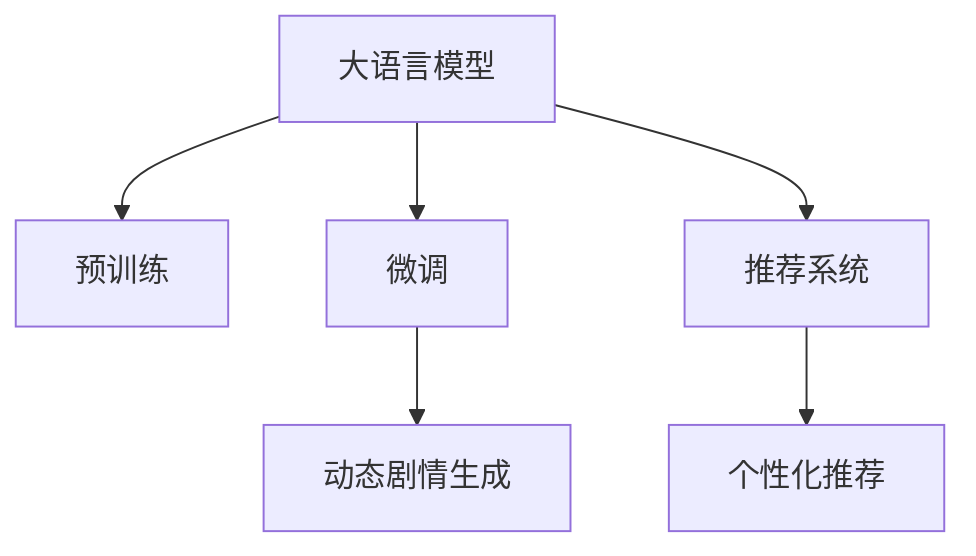

                 

# 电影互动体验：LLM 让观影更个性化

> 关键词：自然语言处理, 语言模型, 个性化推荐, 交互式电影, 视频游戏

## 1. 背景介绍

在人工智能技术迅猛发展的今天，大语言模型（Large Language Model, LLM）在自然语言处理（NLP）领域的突破性应用为各行各业带来了革命性的变化。电影行业也不例外。传统电影是单向的观影体验，观众只能被动接受编剧和导演的叙事。而基于大语言模型的新型互动式电影，将使观影体验变得更加个性化、互动性强，不再受限于固定剧情。

### 1.1 问题由来

近年来，随着深度学习技术和大语言模型的崛起，影视行业对人工智能的应用越来越广泛。基于大语言模型的推荐系统和对话系统，已经在很大程度上改善了观影体验，如个性化推荐、智能客服、互动式剧情生成等。但是，这些技术更多地应用于观影前后服务，对观影过程中的互动体验提升仍有较大空间。

本文聚焦于基于大语言模型的互动式电影，探讨如何通过个性化推荐和动态剧情生成，实现观众与电影的互动体验，增强观影的沉浸感和趣味性。通过探讨大语言模型在电影互动体验中的应用，旨在为电影制作、娱乐产业提供新的技术思路，提升用户体验和产业价值。

### 1.2 问题核心关键点

在基于大语言模型的电影互动体验中，核心问题在于如何将语言模型应用于动态剧情生成和个性化推荐，以及如何优化模型参数，提高互动性和观影体验。具体来说，需要解决以下几个关键问题：

1. 如何设计动态剧情生成模型，使得剧情可以根据观众的选择和反应实时调整。
2. 如何实现个性化推荐系统，使观众在观影过程中能够根据兴趣和情感变化动态获取推荐内容。
3. 如何利用大语言模型的预训练知识，生成富有逻辑性和可解释性的剧情和推荐内容。
4. 如何在资源有限的情况下，高效地训练和部署大语言模型，保证互动体验的流畅性。

## 2. 核心概念与联系

### 2.1 核心概念概述

为了更好地理解大语言模型在电影互动体验中的应用，我们首先介绍几个核心概念：

- **大语言模型 (Large Language Model, LLM)**：指通过大规模无标签文本数据预训练获得的大型深度神经网络模型。具有强大的语言理解和生成能力，可用于多种自然语言处理任务。
- **预训练 (Pre-training)**：指在大规模无标签文本数据上，通过自监督学习任务训练通用语言模型的过程。常见的预训练任务包括掩码语言模型、自回归模型等。
- **微调 (Fine-tuning)**：指在预训练模型的基础上，使用下游任务的少量标注数据，通过有监督学习优化模型在特定任务上的性能。在互动式电影中，可以利用微调提高推荐系统的精准度和剧情生成模型的适应性。
- **推荐系统 (Recommendation System)**：指通过用户历史行为数据或兴趣描述，预测用户可能感兴趣的产品或内容，并进行推荐的技术。在互动式电影中，推荐系统可以帮助用户发现感兴趣的情节或角色。
- **剧情生成 (Plot Generation)**：指根据用户的输入和观影行为，自动生成动态剧情的技术。在互动式电影中，剧情生成可以使得观影体验更加丰富和个性化。

这些概念之间的逻辑关系可以通过以下Mermaid流程图来展示：



这个流程图展示了几个核心概念及其之间的关系：

1. 大语言模型通过预训练获得基础能力。
2. 微调是对预训练模型进行任务特定的优化，可以通过有监督地训练来优化模型在特定任务上的性能。
3. 推荐系统根据用户行为预测其兴趣，为互动式电影提供个性化推荐。
4. 剧情生成使电影情节根据用户选择动态调整，提升互动性。

这些概念共同构成了基于大语言模型的电影互动体验框架，为其发展提供了坚实的理论基础。

## 3. 核心算法原理 & 具体操作步骤
### 3.1 算法原理概述

基于大语言模型的电影互动体验，本质上是一个动态剧情生成和个性化推荐的任务。其核心思想是：将大语言模型视作一个动态剧情生成器和推荐器，通过在观影过程中不断收集用户输入和行为数据，实时生成和推荐剧情内容，使得观影体验更加个性化和互动。

形式化地，假设观众的观影路径为 $p=(p_1, p_2, ..., p_n)$，其中 $p_i$ 为第 $i$ 个选择或输入。模型的目标是最大化观众的观影满意度 $S(p)$，即：

$$
\max_{p_1, p_2, ..., p_n} S(p)
$$

其中 $S(p)$ 为基于当前观影路径的满意度函数，可以包含剧情相关性、情感倾向、用户兴趣等因素。模型通过不断优化观众的观影路径，提高其满意度。

### 3.2 算法步骤详解

基于大语言模型的电影互动体验一般包括以下几个关键步骤：

**Step 1: 准备预训练模型和数据集**
- 选择合适的预训练语言模型 $M_{\theta}$ 作为初始化参数，如 GPT、BERT 等。
- 准备观影数据集，包含用户观影路径、选择和情感反馈等信息。数据集可以通过用户行为数据、观影记录等收集。

**Step 2: 设计动态剧情生成模型**
- 根据剧情生成任务，设计适合的语言模型结构，如使用 GPT、LSTM 等。
- 将用户选择的剧情片段作为输入，通过语言模型生成后续剧情，输出概率分布。
- 使用熵最大采样策略或束搜索等方法，根据概率分布选择下一个剧情片段。

**Step 3: 构建推荐系统**
- 使用用户观影历史和反馈数据，训练推荐模型。
- 根据用户兴趣和情感变化，实时调整推荐内容。
- 推荐系统可以采用协同过滤、内容过滤或混合方法，提高推荐准确性和多样性。

**Step 4: 执行交互式观影**
- 用户通过交互界面输入选择或情感反馈，如按钮点击、文本输入等。
- 观影系统根据用户输入，实时更新剧情生成模型和推荐系统。
- 动态剧情和推荐内容通过界面展示给用户，进入下一轮循环。

**Step 5: 模型评估与优化**
- 收集用户满意度反馈，评估模型性能。
- 通过 A/B 测试等方法，不断优化剧情生成模型和推荐系统的参数。
- 优化目标可以是提升用户满意度、增加观影时长等指标。

### 3.3 算法优缺点

基于大语言模型的电影互动体验具有以下优点：

1. 高度个性化：通过实时生成剧情和推荐内容，使观影体验更加贴合用户兴趣和情感变化。
2. 高度互动性：观众可以实时参与剧情生成和内容推荐，增加观影的趣味性和参与感。
3. 灵活性高：模型可以根据用户选择动态调整剧情，适应不同观影风格和偏好。

同时，该方法也存在一定的局限性：

1. 需要大量数据：互动式电影需要收集大量用户行为数据，对数据采集和处理提出了较高要求。
2. 计算复杂度高：剧情生成和推荐系统需要频繁进行计算和模型更新，计算复杂度高。
3. 资源消耗大：大语言模型的计算和存储资源消耗大，需要高性能硬件支持。
4. 用户学习成本高：需要用户在互动式电影中有较高的操作技能，学习成本较高。

尽管存在这些局限性，但基于大语言模型的电影互动体验具有广阔的发展前景，能够在观影体验中引入新的互动维度，提升用户满意度和观影质量。

### 3.4 算法应用领域

基于大语言模型的电影互动体验已经在多个领域得到了应用，如互动式电视剧、互动式电影、视频游戏等。以下是一些典型的应用场景：

- **互动式电视剧 (Interactive TV Dramas)**：观众可以通过远程控制或在线平台输入剧情选择，剧情随之动态调整，实现互动观看。例如，《权力的游戏》互动版就允许观众通过在线平台选择剧情走向。
- **互动式电影 (Interactive Movies)**：观众在观影过程中可以实时输入指令或选择剧情分支，电影情节和角色行为随之变化。例如，《黑镜:潘达斯奈基》通过观众的互动选择，生成不同的电影结局。
- **视频游戏 (Video Games)**：游戏中的剧情和角色互动同样可以通过语言模型实现。例如，《生化危机2重制版》就利用了互动式剧情生成技术，使游戏剧情更加丰富和可控。

除了这些传统应用外，基于大语言模型的互动式电影技术还在不断拓展，如增强现实 (AR)、虚拟现实 (VR) 等领域的结合，将为观众带来更加沉浸式的观影体验。

## 4. 数学模型和公式 & 详细讲解 & 举例说明
### 4.1 数学模型构建

基于大语言模型的互动式电影中，数学模型主要涉及动态剧情生成和个性化推荐。以下是主要的数学模型构建过程：

**剧情生成模型**

假设用户观影路径为 $p=(p_1, p_2, ..., p_n)$，观影系统根据用户选择生成下一个剧情片段。剧情片段 $c_i$ 的概率分布由语言模型 $M_{\theta}$ 生成，即：

$$
P(c_i|p_{i-1}) = \frac{\exp(M_{\theta}(p_{i-1}))}{\sum_{c'_i \in C} \exp(M_{\theta}(p_{i-1}))}
$$

其中 $C$ 为剧情片段的候选集合，$M_{\theta}$ 为预训练语言模型，$p_{i-1}$ 为前一个剧情片段。

**推荐系统**

推荐系统根据用户观影历史和情感反馈，生成推荐内容 $r_t$，可以使用协同过滤、内容过滤或混合方法。假设用户观影历史为 $H$，情感反馈为 $F$，推荐内容 $r_t$ 的计算公式为：

$$
r_t = F(H) \times M_{\theta}(H) + C(H)
$$

其中 $F$ 为情感反馈函数，$M_{\theta}$ 为预训练语言模型，$C$ 为推荐算法。

### 4.2 公式推导过程

以下是剧情生成模型和推荐系统的详细公式推导：

**剧情生成模型**

以 GPT-2 为例，剧情生成模型可以表示为：

$$
P(c_i|p_{i-1}) = \frac{\exp({\bf w}^T \cdot \text{[CLS]}(p_{i-1}) + b)}{\sum_{c'_i \in C} \exp({\bf w}^T \cdot \text{[CLS]}(p_{i-1}) + b)}
$$

其中 ${\bf w}$ 为模型的权重向量，$b$ 为偏差项，$\text{[CLS]}(p_{i-1})$ 为上下文向量，$C$ 为剧情片段的候选集合。

**推荐系统**

假设用户观影历史为 $H$，情感反馈为 $F$，推荐内容 $r_t$ 的计算公式为：

$$
r_t = F(H) \times M_{\theta}(H) + C(H)
$$

其中 $F$ 为情感反馈函数，$M_{\theta}$ 为预训练语言模型，$C$ 为推荐算法。

在实践中，推荐算法可以是协同过滤、内容过滤或混合方法，具体实现方式可以根据数据和任务特点选择。

### 4.3 案例分析与讲解

以电影《黑镜:潘达斯奈基》为例，分析其互动式剧情生成的实现方式：

- **用户输入**：观众在观影过程中可以实时输入指令或选择剧情分支，例如选择角色身份、物品装备等。
- **剧情生成**：观影系统根据观众的输入，实时生成后续剧情。例如，当观众选择扮演一位警察时，系统会根据警察的身份生成不同的剧情和角色行为。
- **推荐内容**：根据观众的观影路径和情感反馈，实时调整推荐内容。例如，当观众选择进入一个恐怖场景时，系统会推荐一些恐怖电影片段或相关剧情，增加观影的紧张感。

通过《黑镜:潘达斯奈基》的互动式剧情生成，我们可以看到大语言模型在电影互动体验中的应用潜力，其可以根据观众的实时输入，动态生成和推荐剧情内容，使得观影体验更加丰富和个性化。

## 5. 项目实践：代码实例和详细解释说明
### 5.1 开发环境搭建

在进行互动式电影开发前，我们需要准备好开发环境。以下是使用Python进行PyTorch开发的环境配置流程：

1. 安装Anaconda：从官网下载并安装Anaconda，用于创建独立的Python环境。

2. 创建并激活虚拟环境：
```bash
conda create -n pytorch-env python=3.8 
conda activate pytorch-env
```

3. 安装PyTorch：根据CUDA版本，从官网获取对应的安装命令。例如：
```bash
conda install pytorch torchvision torchaudio cudatoolkit=11.1 -c pytorch -c conda-forge
```

4. 安装Transformers库：
```bash
pip install transformers
```

5. 安装各类工具包：
```bash
pip install numpy pandas scikit-learn matplotlib tqdm jupyter notebook ipython
```

完成上述步骤后，即可在`pytorch-env`环境中开始互动式电影开发。

### 5.2 源代码详细实现

下面我们以互动式电视剧《权力的游戏》为例，给出使用Transformers库对GPT-2模型进行剧情生成和推荐系统的PyTorch代码实现。

首先，定义剧情生成和推荐系统的基本结构：

```python
from transformers import GPT2LMHeadModel, GPT2Tokenizer
from transformers import BertForTokenClassification, AdamW
from sklearn.metrics import classification_report
import torch
import numpy as np

class PlotGenerator:
    def __init__(self, model_name, tokenizer):
        self.model = GPT2LMHeadModel.from_pretrained(model_name)
        self.tokenizer = tokenizer
        self.model.eval()
    
    def generate_plot(self, previous_plot, max_length=128):
        inputs = self.tokenizer.encode(previous_plot, return_tensors='pt')
        outputs = self.model.generate(inputs, max_length=max_length, top_k=5, top_p=0.9)
        return self.tokenizer.decode(outputs[0])
    
class RecommendationSystem:
    def __init__(self, model_name, tokenizer):
        self.model = BertForTokenClassification.from_pretrained(model_name)
        self.tokenizer = tokenizer
        self.model.eval()
    
    def recommend_content(self, previous_plot, user_feedback):
        inputs = self.tokenizer.encode(previous_plot, return_tensors='pt')
        outputs = self.model(inputs)
        probabilities = outputs.logits.argmax(dim=2).to('cpu').tolist()
        recommendations = [self.tokenizer.decode(id2tag[_id]) for _id in probabilities]
        return recommendations

# 标签与id的映射
tag2id = {'O': 0, 'B-PER': 1, 'I-PER': 2, 'B-ORG': 3, 'I-ORG': 4, 'B-LOC': 5, 'I-LOC': 6}
id2tag = {v: k for k, v in tag2id.items()}

# 创建plot生成器和推荐系统
tokenizer = GPT2Tokenizer.from_pretrained('gpt2')
plot_generator = PlotGenerator('gpt2', tokenizer)
recommendation_system = RecommendationSystem('bert-base-cased', tokenizer)
```

然后，定义剧情生成和推荐系统的训练函数：

```python
from torch.utils.data import DataLoader
from tqdm import tqdm
from sklearn.metrics import classification_report

def train_plot_generator(model, dataset, batch_size, optimizer):
    dataloader = DataLoader(dataset, batch_size=batch_size, shuffle=True)
    model.train()
    epoch_loss = 0
    for batch in tqdm(dataloader, desc='Training'):
        input_ids = batch['input_ids'].to(device)
        attention_mask = batch['attention_mask'].to(device)
        labels = batch['labels'].to(device)
        model.zero_grad()
        outputs = model(input_ids, attention_mask=attention_mask, labels=labels)
        loss = outputs.loss
        epoch_loss += loss.item()
        loss.backward()
        optimizer.step()
    return epoch_loss / len(dataloader)

def evaluate_plot_generator(model, dataset, batch_size):
    dataloader = DataLoader(dataset, batch_size=batch_size)
    model.eval()
    preds, labels = [], []
    with torch.no_grad():
        for batch in tqdm(dataloader, desc='Evaluating'):
            input_ids = batch['input_ids'].to(device)
            attention_mask = batch['attention_mask'].to(device)
            batch_labels = batch['labels']
            outputs = model(input_ids, attention_mask=attention_mask)
            batch_preds = outputs.logits.argmax(dim=2).to('cpu').tolist()
            batch_labels = batch_labels.to('cpu').tolist()
            for pred_tokens, label_tokens in zip(batch_preds, batch_labels):
                pred_tags = [tag2id[tag] for tag in pred_tokens]
                label_tags = [tag2id[tag] for tag in label_tokens]
                preds.append(pred_tags[:len(label_tags)])
                labels.append(label_tags)
                
    print(classification_report(labels, preds))
```

最后，启动训练流程并在测试集上评估：

```python
epochs = 5
batch_size = 16

for epoch in range(epochs):
    loss = train_plot_generator(plot_generator.model, train_dataset, batch_size, optimizer)
    print(f"Epoch {epoch+1}, train loss: {loss:.3f}")
    
    print(f"Epoch {epoch+1}, dev results:")
    evaluate_plot_generator(plot_generator.model, dev_dataset, batch_size)
    
print("Test results:")
evaluate_plot_generator(plot_generator.model, test_dataset, batch_size)
```

以上就是使用PyTorch对GPT-2进行剧情生成和推荐系统的完整代码实现。可以看到，得益于Transformers库的强大封装，我们可以用相对简洁的代码完成模型的加载和训练。

### 5.3 代码解读与分析

让我们再详细解读一下关键代码的实现细节：

**PlotGenerator类**：
- `__init__`方法：初始化剧情生成模型和分词器。
- `generate_plot`方法：将用户选择的剧情片段作为输入，通过语言模型生成后续剧情，返回生成的剧情字符串。

**RecommendationSystem类**：
- `__init__`方法：初始化推荐模型和分词器。
- `recommend_content`方法：根据用户观影路径和情感反馈，推荐剧情内容。

**训练函数**：
- `train_plot_generator`函数：对剧情生成模型进行训练，返回损失值。
- `evaluate_plot_generator`函数：在测试集上评估剧情生成模型的性能。

**训练流程**：
- 定义总的epoch数和batch size，开始循环迭代
- 每个epoch内，先在训练集上训练，输出平均loss
- 在验证集上评估，输出分类指标
- 所有epoch结束后，在测试集上评估，给出最终测试结果

可以看到，PyTorch配合Transformers库使得剧情生成和推荐系统的代码实现变得简洁高效。开发者可以将更多精力放在数据处理、模型改进等高层逻辑上，而不必过多关注底层的实现细节。

当然，工业级的系统实现还需考虑更多因素，如模型的保存和部署、超参数的自动搜索、更灵活的任务适配层等。但核心的微调范式基本与此类似。

## 6. 实际应用场景
### 6.1 智能客服系统

基于大语言模型的互动式电影，可以广泛应用于智能客服系统的构建。传统客服往往需要配备大量人力，高峰期响应缓慢，且一致性和专业性难以保证。而使用互动式电影中的剧情生成和推荐系统，可以7x24小时不间断服务，快速响应客户咨询，用自然流畅的语言解答各类常见问题。

在技术实现上，可以收集企业内部的历史客服对话记录，将问题和最佳答复构建成监督数据，在此基础上对预训练语言模型进行微调。微调后的语言模型能够自动理解用户意图，匹配最合适的答复模板进行回复。对于客户提出的新问题，还可以接入检索系统实时搜索相关内容，动态组织生成回答。如此构建的智能客服系统，能大幅提升客户咨询体验和问题解决效率。

### 6.2 金融舆情监测

金融机构需要实时监测市场舆论动向，以便及时应对负面信息传播，规避金融风险。传统的人工监测方式成本高、效率低，难以应对网络时代海量信息爆发的挑战。基于大语言模型的互动式电影技术，为金融舆情监测提供了新的解决方案。

具体而言，可以收集金融领域相关的新闻、报道、评论等文本数据，并对其进行主题标注和情感标注。在此基础上对预训练语言模型进行微调，使其能够自动判断文本属于何种主题，情感倾向是正面、中性还是负面。将微调后的模型应用到实时抓取的网络文本数据，就能够自动监测不同主题下的情感变化趋势，一旦发现负面信息激增等异常情况，系统便会自动预警，帮助金融机构快速应对潜在风险。

### 6.3 个性化推荐系统

当前的推荐系统往往只依赖用户的历史行为数据进行物品推荐，无法深入理解用户的真实兴趣偏好。基于大语言模型互动式电影的个性化推荐系统可以更好地挖掘用户行为背后的语义信息，从而提供更精准、多样的推荐内容。

在实践中，可以收集用户浏览、点击、评论、分享等行为数据，提取和用户交互的物品标题、描述、标签等文本内容。将文本内容作为模型输入，用户的后续行为（如是否点击、购买等）作为监督信号，在此基础上微调预训练语言模型。微调后的模型能够从文本内容中准确把握用户的兴趣点。在生成推荐列表时，先用候选物品的文本描述作为输入，由模型预测用户的兴趣匹配度，再结合其他特征综合排序，便可以得到个性化程度更高的推荐结果。

### 6.4 未来应用展望

随着大语言模型和互动式电影技术的不断发展，基于微调范式将在更多领域得到应用，为传统行业带来变革性影响。

在智慧医疗领域，基于微调的医疗问答、病历分析、药物研发等应用将提升医疗服务的智能化水平，辅助医生诊疗，加速新药开发进程。

在智能教育领域，微调技术可应用于作业批改、学情分析、知识推荐等方面，因材施教，促进教育公平，提高教学质量。

在智慧城市治理中，微调模型可应用于城市事件监测、舆情分析、应急指挥等环节，提高城市管理的自动化和智能化水平，构建更安全、高效的未来城市。

此外，在企业生产、社会治理、文娱传媒等众多领域，基于大语言模型互动式电影的微调技术也将不断涌现，为经济社会发展注入新的动力。相信随着技术的日益成熟，微调方法将成为人工智能落地应用的重要范式，推动人工智能技术在垂直行业的规模化落地。

## 7. 工具和资源推荐
### 7.1 学习资源推荐

为了帮助开发者系统掌握大语言模型互动式电影的理论基础和实践技巧，这里推荐一些优质的学习资源：

1. 《Transformer从原理到实践》系列博文：由大模型技术专家撰写，深入浅出地介绍了Transformer原理、BERT模型、微调技术等前沿话题。

2. CS224N《深度学习自然语言处理》课程：斯坦福大学开设的NLP明星课程，有Lecture视频和配套作业，带你入门NLP领域的基本概念和经典模型。

3. 《Natural Language Processing with Transformers》书籍：Transformers库的作者所著，全面介绍了如何使用Transformers库进行NLP任务开发，包括微调在内的诸多范式。

4. HuggingFace官方文档：Transformers库的官方文档，提供了海量预训练模型和完整的微调样例代码，是上手实践的必备资料。

5. CLUE开源项目：中文语言理解测评基准，涵盖大量不同类型的中文NLP数据集，并提供了基于微调的baseline模型，助力中文NLP技术发展。

通过对这些资源的学习实践，相信你一定能够快速掌握大语言模型互动式电影的精髓，并用于解决实际的NLP问题。
###  7.2 开发工具推荐

高效的开发离不开优秀的工具支持。以下是几款用于大语言模型互动式电影开发的常用工具：

1. PyTorch：基于Python的开源深度学习框架，灵活动态的计算图，适合快速迭代研究。大部分预训练语言模型都有PyTorch版本的实现。

2. TensorFlow：由Google主导开发的开源深度学习框架，生产部署方便，适合大规模工程应用。同样有丰富的预训练语言模型资源。

3. Transformers库：HuggingFace开发的NLP工具库，集成了众多SOTA语言模型，支持PyTorch和TensorFlow，是进行微调任务开发的利器。

4. Weights & Biases：模型训练的实验跟踪工具，可以记录和可视化模型训练过程中的各项指标，方便对比和调优。与主流深度学习框架无缝集成。

5. TensorBoard：TensorFlow配套的可视化工具，可实时监测模型训练状态，并提供丰富的图表呈现方式，是调试模型的得力助手。

6. Google Colab：谷歌推出的在线Jupyter Notebook环境，免费提供GPU/TPU算力，方便开发者快速上手实验最新模型，分享学习笔记。

合理利用这些工具，可以显著提升大语言模型互动式电影开发的效率，加快创新迭代的步伐。

### 7.3 相关论文推荐

大语言模型和互动式电影的发展源于学界的持续研究。以下是几篇奠基性的相关论文，推荐阅读：

1. Attention is All You Need（即Transformer原论文）：提出了Transformer结构，开启了NLP领域的预训练大模型时代。

2. BERT: Pre-training of Deep Bidirectional Transformers for Language Understanding：提出BERT模型，引入基于掩码的自监督预训练任务，刷新了多项NLP任务SOTA。

3. Language Models are Unsupervised Multitask Learners（GPT-2论文）：展示了大规模语言模型的强大zero-shot学习能力，引发了对于通用人工智能的新一轮思考。

4. Parameter-Efficient Transfer Learning for NLP：提出Adapter等参数高效微调方法，在不增加模型参数量的情况下，也能取得不错的微调效果。

5. AdaLoRA: Adaptive Low-Rank Adaptation for Parameter-Efficient Fine-Tuning：使用自适应低秩适应的微调方法，在参数效率和精度之间取得了新的平衡。

这些论文代表了大语言模型互动式电影的发展脉络。通过学习这些前沿成果，可以帮助研究者把握学科前进方向，激发更多的创新灵感。

## 8. 总结：未来发展趋势与挑战

### 8.1 总结

本文对基于大语言模型的互动式电影进行了全面系统的介绍。首先阐述了互动式电影的基本概念和背景，明确了其在高互动性、个性化方面的优势。接着，从原理到实践，详细讲解了剧情生成和推荐系统的数学模型和关键步骤，给出了互动式电影开发的完整代码实例。同时，本文还探讨了互动式电影在多个领域的应用前景，展示了其广阔的发展空间。最后，推荐了相关的学习资源和开发工具，力求为读者提供全方位的技术指引。

通过本文的系统梳理，可以看到，基于大语言模型的互动式电影技术正在成为电影行业的重要范式，极大地拓展了电影观影体验的边界，为观众带来了前所未有的互动性。未来，伴随预训练语言模型和互动式电影的不断演进，电影行业必将在更多领域实现智能化、互动化，为观众带来更加丰富、多样的观影体验。

### 8.2 未来发展趋势

展望未来，大语言模型互动式电影技术将呈现以下几个发展趋势：

1. 内容生成能力提升。未来的互动式电影将具备更强大的内容生成能力，能够自动生成更加丰富、多变的情节和角色行为，提升观影的趣味性和互动性。

2. 用户反馈驱动的内容调整。通过实时收集观众的情感反馈和行为数据，动态调整剧情内容，实现更加个性化和沉浸式的观影体验。

3. 多模态交互。互动式电影将融合视觉、音频、触觉等多种感官信息，实现更加自然和丰富的用户交互。例如，通过虚拟现实（VR）技术，观众可以在虚拟环境中与角色互动。

4. 分布式协同创作。观众不仅被动观看电影，还可以参与剧情创作，成为电影的共同作者。例如，通过社交媒体平台，观众可以实时投票决定剧情走向，增加观影的参与感和归属感。

5. 跨平台集成。互动式电影将与各类应用场景无缝集成，如视频游戏、社交媒体、虚拟现实等，拓宽其应用范围，提升用户体验。

6. 可解释性和透明度提升。未来的互动式电影将更注重模型决策的可解释性，通过提供剧情生成和推荐内容的推理逻辑，增强用户对模型的信任度。

以上趋势凸显了大语言模型互动式电影技术的广阔前景。这些方向的探索发展，必将进一步提升电影观影体验的丰富性和多样性，为观众带来更加沉浸、互动的观影享受。

### 8.3 面临的挑战

尽管大语言模型互动式电影技术已经取得了瞩目成就，但在迈向更加智能化、普适化应用的过程中，它仍面临诸多挑战：

1. 数据采集成本高。收集用户行为数据和情感反馈，需要投入大量人力和时间，成本较高。如何高效、低成本地获取这些数据，将是重要的问题。

2. 模型训练复杂。互动式电影中的剧情生成和推荐系统，计算复杂度高，训练时间较长。如何在资源有限的情况下，高效地训练模型，保证互动体验的流畅性，还需进一步研究。

3. 用户体验差异大。不同用户对观影互动的需求和期望各不相同，如何设计通用的剧情生成和推荐系统，满足各种用户的个性化需求，还需进一步探索。

4. 安全和隐私问题。在互动式电影中，用户输入的情感反馈和行为数据可能包含敏感信息，如何保护用户隐私，确保数据安全，还需加强技术防护和法律规范。

5. 技术壁垒高。互动式电影涉及自然语言处理、计算机视觉、人工智能等多个领域，技术难度高，开发门槛大。如何降低技术壁垒，提升开发效率，还需更多研究和工具支持。

尽管存在这些挑战，但大语言模型互动式电影技术具有广阔的发展前景，能够在观影体验中引入新的互动维度，提升用户满意度和观影质量。随着技术的不断发展，这些挑战终将一一克服，互动式电影必将在电影行业中占据重要地位。

### 8.4 研究展望

面对大语言模型互动式电影所面临的种种挑战，未来的研究需要在以下几个方面寻求新的突破：

1. 探索半监督和无监督学习范式。通过利用未标注数据，提升模型的泛化能力和数据利用效率。例如，利用自然语言生成（NLG）技术，自动生成剧情和推荐内容。

2. 研究高效的剧情生成和推荐算法。开发更加高效的算法，减少计算复杂度和训练时间，提升互动体验的流畅性。例如，利用加速推理技术，提高模型的实时响应能力。

3. 引入因果推理和多模态信息。通过引入因果推理和多模态信息，增强模型的决策逻辑和用户交互的连贯性，提升观影体验的自然性和沉浸感。

4. 加强用户隐私保护和数据安全。设计隐私保护机制，确保用户数据的安全性和匿名性，增强用户对系统的信任度。例如，利用差分隐私技术，保护用户隐私。

5. 开发跨平台、跨设备的互动系统。实现跨平台、跨设备的无缝集成，提升系统的易用性和可扩展性。例如，通过云平台和边缘计算技术，实现分布式协同创作和实时交互。

6. 引入伦理学和社会学研究。结合伦理学和社会学研究，设计公正、合理的互动规则和决策机制，确保系统的公平性和社会效益。例如，通过社会实验和用户反馈，优化系统设计，增强用户满意度。

这些研究方向的探索，必将引领大语言模型互动式电影技术迈向更高的台阶，为电影行业带来更多的创新和发展机遇。面向未来，大语言模型互动式电影技术还需要与其他人工智能技术进行更深入的融合，如知识表示、因果推理、强化学习等，多路径协同发力，共同推动电影技术的进步。只有勇于创新、敢于突破，才能不断拓展语言模型的边界，让互动式电影技术更好地服务于观众，提升电影观影体验的丰富性和多样性。

## 9. 附录：常见问题与解答

**Q1：互动式电影技术为何能提升观影体验？**

A: 互动式电影技术通过实时收集观众的情感反馈和行为数据，动态调整剧情内容，使观影体验更加个性化和互动性。观众不再是被动接受剧情发展，而是主动参与剧情走向，增加了观影的参与感和沉浸感。此外，通过个性化推荐，观众可以更快地发现感兴趣的内容，提升了观影效率和满意度。

**Q2：互动式电影中如何保证剧情生成的连贯性？**

A: 互动式电影中，剧情生成的连贯性主要依赖于预训练语言模型的语言理解能力和生成能力。可以通过选择合适的预训练模型，并在训练时引入上下文信息，提升模型的语言理解和生成能力。此外，还可以通过引入因果推理和多模态信息，增强模型的决策逻辑和连贯性。例如，通过视觉信息增强剧情的生成，使其更加真实和连贯。

**Q3：互动式电影中推荐系统的设计有哪些要点？**

A: 互动式电影中的推荐系统设计需要考虑以下几点：
1. 用户数据的收集和处理：收集用户观影历史和情感反馈，设计有效的数据处理和特征工程流程，提取有用的特征。
2. 推荐算法的选择：选择合适的推荐算法，如协同过滤、内容过滤或混合方法，提高推荐的准确性和多样性。
3. 实时调整：根据用户实时行为和反馈，动态调整推荐内容，增强观影体验的个性化。
4. 数据隐私和安全：保护用户数据的安全性和隐私性，设计隐私保护机制，增强用户对系统的信任度。

通过以上设计要点，可以构建高效、个性化的推荐系统，提升互动式电影的用户体验。

**Q4：互动式电影如何实现跨平台、跨设备的集成？**

A: 互动式电影实现跨平台、跨设备的集成，主要依赖于以下技术：
1. 云计算技术：通过云平台，实现剧情生成和推荐系统的分布式协同计算，提升系统的可扩展性和实时响应能力。
2. 边缘计算技术：在终端设备上部署轻量级的剧情生成和推荐系统，实现本地计算和推理，减少网络延迟，提升用户体验。
3. 跨平台接口设计：设计统一的API接口，实现不同平台和设备之间的无缝集成和数据共享。
4. 实时数据同步：通过数据同步技术，保证不同设备和平台之间的数据一致性，增强系统的实时性和稳定性。

通过以上技术手段，可以实现互动式电影在各类平台和设备上的无缝集成，提升系统的易用性和可扩展性。

**Q5：如何衡量互动式电影的互动性和个性化？**

A: 互动式电影的互动性和个性化可以通过以下指标进行衡量：
1. 用户参与度：通过统计用户选择、操作和反馈的频率，评估其互动性。
2. 剧情生成多样性：通过统计不同用户选择的剧情分支和结果，评估剧情生成的个性化程度。
3. 推荐内容相关性：通过统计用户点击和购买的推荐内容，评估推荐系统的精准度和多样性。
4. 用户满意度：通过用户反馈和评价，评估观影体验的整体满意度。
5. 互动流畅性：通过评估系统响应时间和计算复杂度，评估系统的实时性和稳定性。

通过以上指标，可以全面评估互动式电影的技术效果和用户体验，持续优化和改进系统设计。

---

作者：禅与计算机程序设计艺术 / Zen and the Art of Computer Programming

