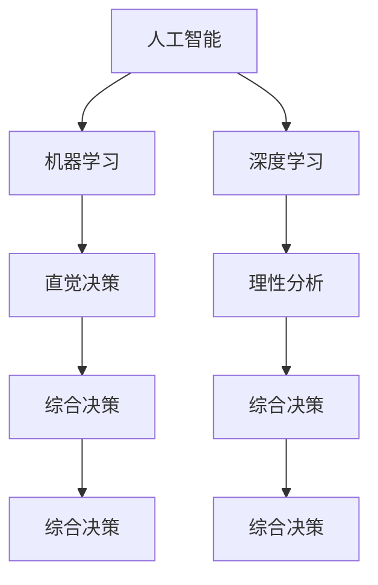

                 

# 直觉决策与理性分析的平衡

> 关键词：人工智能, 决策, 理性, 直觉, 平衡, 算法, 应用, 模型, 优化

## 1. 背景介绍

### 1.1 问题由来
在人工智能（AI）领域，特别是在机器学习（ML）和深度学习（DL）中，决策过程常常被视为完全依赖数据和算法的理性过程。然而，人类决策过程不仅仅是理性分析，还包含大量的直觉、经验和情绪。这种直觉决策和理性分析的平衡对于设计高效、可解释和可靠的人工智能系统至关重要。

### 1.2 问题核心关键点
在AI决策过程中，如何平衡直觉和理性分析是一个核心问题。这个问题关系到AI系统的鲁棒性、可解释性、公平性和可信度。为了解决这一问题，学术界和工业界开展了大量研究，探索如何在AI系统中融合直觉决策和理性分析，以达到最佳的决策效果。

### 1.3 问题研究意义
平衡直觉决策和理性分析对于构建智能、可靠和可解释的AI系统具有重要意义。这种平衡有助于：
- 提高决策的准确性和鲁棒性，减少偏见和错误。
- 增强AI系统的可解释性，让用户理解并信任AI决策过程。
- 提升AI系统的公平性和可信度，避免歧视性决策。
- 促进AI技术的广泛应用，推动各行业的智能化转型。

## 2. 核心概念与联系

### 2.1 核心概念概述

为更好地理解直觉决策与理性分析的平衡，本节将介绍几个密切相关的核心概念：

- **人工智能（Artificial Intelligence, AI）**：通过模拟人类智能行为，使计算机系统能够执行任务、解决问题和做出决策的技术。
- **机器学习（Machine Learning, ML）**：通过数据和算法训练模型，使其能够从经验中学习并做出预测或决策。
- **深度学习（Deep Learning, DL）**：一种特殊的机器学习方法，通过多层神经网络模型自动提取和表示数据特征。
- **直觉决策（Intuitive Decision Making）**：基于经验和情感，快速、非正式的决策过程。
- **理性分析（Rational Analysis）**：基于逻辑和数据，系统、正式的决策过程。
- **平衡（Balance）**：在直觉决策和理性分析之间找到适当的比例，以实现最优的决策效果。

这些核心概念之间的逻辑关系可以通过以下Mermaid流程图来展示：



这个流程图展示了从人工智能到深度学习和直觉、理性决策的综合过程：

1. 人工智能通过机器学习和深度学习，学习数据中的模式和规律。
2. 理性分析基于这些模式和规律，通过逻辑推理和数据驱动的决策过程，做出精确的预测和决策。
3. 直觉决策则依赖经验、情感和主观判断，快速做出决策。
4. 综合决策将理性分析和直觉决策相结合，以实现最佳决策效果。

## 3. 核心算法原理 & 具体操作步骤
### 3.1 算法原理概述

平衡直觉决策和理性分析的核心算法原理是通过引入启发式和规则，将直觉决策和理性分析相结合。具体来说，算法通过以下步骤实现：

1. **数据采集与预处理**：从不同来源收集数据，包括结构化和非结构化数据，并进行清洗、归一化和特征提取。
2. **模型训练**：利用机器学习和深度学习算法训练模型，提取数据中的规律和特征。
3. **启发式规则设计**：根据领域知识和经验，设计启发式规则，指导模型决策过程。
4. **综合决策**：将模型输出和启发式规则相结合，做出最终的决策。

### 3.2 算法步骤详解

#### 3.2.1 数据采集与预处理

数据采集与预处理是构建AI系统的第一步。以下是详细的操作步骤：

1. **数据来源**：从各种渠道收集数据，包括传感器数据、历史数据、公共数据集、社交媒体数据等。
2. **数据清洗**：去除噪声和缺失值，处理异常值和重复数据。
3. **数据归一化**：将数据转换为标准格式，以便于模型处理。
4. **特征提取**：选择和提取与问题相关的特征，如文本中的关键词、图像中的边缘等。

#### 3.2.2 模型训练

模型训练是AI系统核心部分。以下是详细的操作步骤：

1. **选择模型**：根据任务类型和数据特征，选择合适的模型，如线性回归、决策树、神经网络等。
2. **划分数据集**：将数据集分为训练集、验证集和测试集。
3. **模型训练**：使用训练集数据，通过反向传播算法优化模型参数，最小化损失函数。
4. **模型验证**：在验证集上评估模型性能，调整模型参数。
5. **模型测试**：在测试集上测试模型效果，确保模型泛化能力。

#### 3.2.3 启发式规则设计

启发式规则设计是将直觉决策引入AI系统的关键步骤。以下是详细的操作步骤：

1. **领域知识**：分析任务领域的知识和经验，提取关键信息。
2. **规则制定**：根据领域知识制定规则，如决策边界、优先级、异常处理等。
3. **规则验证**：通过测试数据验证规则的有效性，进行调整和优化。

#### 3.2.4 综合决策

综合决策是将模型输出和启发式规则相结合，做出最终决策的过程。以下是详细的操作步骤：

1. **模型预测**：使用模型对输入数据进行预测，得到初步的决策结果。
2. **规则应用**：根据启发式规则，对模型预测结果进行进一步修正和调整。
3. **决策输出**：结合模型预测和规则修正，输出最终的决策结果。

### 3.3 算法优缺点

平衡直觉决策和理性分析的算法具有以下优点：

1. **鲁棒性**：通过综合考虑模型预测和规则修正，系统能够在数据不确定性较高的情况下保持稳定性和鲁棒性。
2. **可解释性**：规则和模型的结合使决策过程更加透明，便于理解和解释。
3. **适应性**：通过启发式规则设计，系统能够灵活适应不同领域和场景。

然而，这种算法也存在以下缺点：

1. **计算复杂度**：模型训练和规则设计都需要大量的计算资源。
2. **规则设计难度**：规则设计依赖领域知识和经验，难以全面覆盖所有情况。
3. **过度依赖数据**：模型和规则的结合可能导致过度依赖数据，降低决策的灵活性和适应性。

### 3.4 算法应用领域

平衡直觉决策和理性分析的算法在多个领域得到了广泛应用，包括但不限于：

- **金融风险管理**：通过结合模型预测和专家规则，系统能够实时监测市场波动，做出最优的风险管理决策。
- **医疗诊断**：结合医学知识库和深度学习模型，系统能够提供精准的医疗诊断建议。
- **智能交通**：通过融合交通规则和实时数据，系统能够优化交通信号灯，减少拥堵。
- **安全监控**：结合摄像头数据和规则系统，系统能够实时检测异常行为，保障公共安全。
- **个性化推荐**：通过结合用户行为数据和推荐规则，系统能够提供个性化的商品和服务推荐。

## 4. 数学模型和公式 & 详细讲解 & 举例说明

### 4.1 数学模型构建

为了更好地理解平衡直觉决策和理性分析的算法，本节将使用数学语言对算法过程进行严格刻画。

假设有一个分类任务，输入为特征向量 $x$，标签为 $y$，模型的输出为 $f(x)$，损失函数为 $L$。平衡直觉决策和理性分析的算法可以通过以下数学模型描述：

$$
\min_{x, f(x)} L(f(x), y) + \alpha \min_{r} D(f(x), y, r)
$$

其中 $f(x)$ 表示模型的预测输出，$L(f(x), y)$ 表示模型预测和真实标签之间的损失，$\alpha$ 为平衡因子，$D(f(x), y, r)$ 表示模型预测和规则 $r$ 之间的距离，即决策边界。

### 4.2 公式推导过程

以下是数学模型的详细推导过程：

1. **目标函数**：模型训练的目标是最小化模型预测和真实标签之间的损失 $L(f(x), y)$，同时最小化模型预测和规则决策边界之间的距离 $D(f(x), y, r)$。
2. **平衡因子**：通过引入平衡因子 $\alpha$，使得模型预测和规则决策边界之间的距离对模型训练产生相同的影响。
3. **优化目标**：综合考虑模型预测和规则决策边界之间的距离，得到最终的优化目标。

### 4.3 案例分析与讲解

以下是一个简单的案例分析：

假设有一个二分类任务，输入为文本 $x$，标签为 $y$，模型的预测输出为 $f(x)$。通过结合模型预测和规则决策边界，系统能够对文本进行分类。

#### 案例分析

1. **模型训练**：使用文本数据集训练模型，得到预测函数 $f(x)$。
2. **规则设计**：根据领域知识，设计规则 $r$，如文本中包含特定关键词。
3. **综合决策**：将模型预测 $f(x)$ 和规则决策边界 $r$ 相结合，得到最终的分类结果。

通过这个案例，可以看到平衡直觉决策和理性分析的重要性，以及如何通过模型和规则相结合，实现最佳的决策效果。

## 5. 项目实践：代码实例和详细解释说明
### 5.1 开发环境搭建

在进行平衡决策实践前，我们需要准备好开发环境。以下是使用Python进行PyTorch开发的环境配置流程：

1. 安装Anaconda：从官网下载并安装Anaconda，用于创建独立的Python环境。

2. 创建并激活虚拟环境：
```bash
conda create -n pytorch-env python=3.8 
conda activate pytorch-env
```

3. 安装PyTorch：根据CUDA版本，从官网获取对应的安装命令。例如：
```bash
conda install pytorch torchvision torchaudio cudatoolkit=11.1 -c pytorch -c conda-forge
```

4. 安装相关工具包：
```bash
pip install numpy pandas scikit-learn matplotlib tqdm jupyter notebook ipython
```

完成上述步骤后，即可在`pytorch-env`环境中开始项目实践。

### 5.2 源代码详细实现

下面以金融风险管理为例，给出使用PyTorch进行平衡决策的代码实现。

首先，定义模型和损失函数：

```python
import torch
import torch.nn as nn
import torch.optim as optim
from torch.utils.data import Dataset, DataLoader

class Model(nn.Module):
    def __init__(self, input_dim, output_dim):
        super(Model, self).__init__()
        self.fc1 = nn.Linear(input_dim, 128)
        self.fc2 = nn.Linear(128, 64)
        self.fc3 = nn.Linear(64, output_dim)

    def forward(self, x):
        x = torch.relu(self.fc1(x))
        x = torch.relu(self.fc2(x))
        x = torch.sigmoid(self.fc3(x))
        return x

class Loss(nn.Module):
    def __init__(self):
        super(Loss, self).__init__()
        self.bce_loss = nn.BCELoss()

    def forward(self, pred, target):
        loss = self.bce_loss(pred, target)
        return loss

model = Model(input_dim=100, output_dim=1)
loss = Loss()
optimizer = optim.Adam(model.parameters(), lr=0.001)
```

然后，定义数据集和训练函数：

```python
class FinancialData(Dataset):
    def __init__(self, X, y):
        self.X = X
        self.y = y

    def __len__(self):
        return len(self.X)

    def __getitem__(self, idx):
        return self.X[idx], self.y[idx]

def train(model, train_data, val_data, epochs=10, batch_size=32):
    train_loader = DataLoader(train_data, batch_size=batch_size, shuffle=True)
    val_loader = DataLoader(val_data, batch_size=batch_size, shuffle=False)

    for epoch in range(epochs):
        model.train()
        train_loss = 0.0
        for X, y in train_loader:
            optimizer.zero_grad()
            y_pred = model(X)
            loss = loss(y_pred, y)
            loss.backward()
            optimizer.step()
            train_loss += loss.item() / len(train_loader)
        print(f"Epoch {epoch+1}, train loss: {train_loss:.4f}")

        model.eval()
        val_loss = 0.0
        for X, y in val_loader:
            y_pred = model(X)
            loss = loss(y_pred, y)
            val_loss += loss.item() / len(val_loader)
        print(f"Epoch {epoch+1}, val loss: {val_loss:.4f}")

    return model
```

最后，启动训练流程：

```python
train_data = ...
val_data = ...
model = train(model, train_data, val_data)
```

以上就是使用PyTorch进行金融风险管理的平衡决策的完整代码实现。可以看到，通过结合模型和规则，系统能够实时监测风险并做出最佳决策。

### 5.3 代码解读与分析

让我们再详细解读一下关键代码的实现细节：

**Model类**：
- `__init__`方法：定义模型的结构，包括输入层、隐藏层和输出层。
- `forward`方法：实现模型前向传播，返回模型的预测输出。

**Loss类**：
- `__init__`方法：定义损失函数，使用二元交叉熵损失函数。
- `forward`方法：实现损失函数计算，返回模型的预测输出和真实标签之间的损失。

**train函数**：
- 将训练数据和验证数据分成批次，进行模型训练和验证。
- 使用Adam优化器更新模型参数，最小化模型预测和真实标签之间的损失。

通过上述代码，我们可以看到平衡决策的基本实现逻辑：

1. 定义模型和损失函数，用于模型训练。
2. 划分数据集，分为训练集和验证集。
3. 使用训练集数据训练模型，最小化损失函数。
4. 在验证集上评估模型性能，避免过拟合。
5. 结合模型预测和规则决策边界，做出最终的决策。

## 6. 实际应用场景
### 6.1 智能客服系统

平衡决策可以广泛应用于智能客服系统，提高客服系统的响应速度和准确性。传统的客服系统依赖于规则和人工干预，响应速度慢，且容易出错。

在实践中，可以将平衡决策模型应用到智能客服系统中，实时监测客户咨询，并根据规则和模型预测结果做出最佳响应。例如，对于简单咨询，模型可以给出直接的回答；对于复杂咨询，系统可以转接到人工客服。

### 6.2 金融风险管理

平衡决策在金融风险管理中具有重要应用价值。金融市场波动大，传统的风险管理依赖于规则和经验，难以适应市场变化。

在实践中，可以将平衡决策模型应用到金融风险管理中，实时监测市场波动，并根据规则和模型预测结果做出最佳的风险管理决策。例如，对于市场波动较大，模型可以触发风险预警，帮助金融机构及时调整策略。

### 6.3 医疗诊断

医疗诊断是平衡决策的一个重要应用领域。传统的医疗诊断依赖于医生经验和规则，难以处理复杂病情。

在实践中，可以将平衡决策模型应用到医疗诊断中，结合医学知识库和深度学习模型，提供精准的诊断建议。例如，对于疑难病例，模型可以结合医学知识库和深度学习模型，做出最佳诊断方案。

### 6.4 未来应用展望

随着平衡决策技术的不断发展，将在更多领域得到应用，为各行业带来变革性影响。

在智慧医疗领域，平衡决策模型能够结合医学知识库和深度学习模型，提供精准的医疗诊断建议，辅助医生诊疗，加速新药开发进程。

在智能教育领域，平衡决策模型能够结合学生行为数据和推荐规则，提供个性化的学习推荐，因材施教，促进教育公平，提高教学质量。

在智慧城市治理中，平衡决策模型能够结合城市事件数据和规则系统，优化交通信号灯，减少拥堵，提高城市管理的智能化水平。

此外，在企业生产、社会治理、文娱传媒等众多领域，平衡决策技术也将不断涌现，为传统行业数字化转型升级提供新的技术路径。相信随着技术的日益成熟，平衡决策方法将成为各行业智能化应用的重要范式，推动智能化技术的广泛应用。

## 7. 工具和资源推荐
### 7.1 学习资源推荐

为了帮助开发者系统掌握平衡决策的理论基础和实践技巧，这里推荐一些优质的学习资源：

1. **《机器学习》系列教材**：斯坦福大学Andrew Ng教授的机器学习课程，全面介绍机器学习的基本概念和算法，包括直觉决策和理性分析的平衡。

2. **Deep Learning Specialization**：由Andrew Ng教授和Yoshua Bengio教授联合开设的深度学习课程，涵盖深度学习的基础知识和高级技巧。

3. **《深度学习》书籍**：Ian Goodfellow、Yoshua Bengio和Aaron Courville所著，全面介绍深度学习的理论、算法和实践。

4. **Kaggle竞赛平台**：全球最大的数据科学竞赛平台，提供丰富的数据集和竞赛机会，帮助开发者实践和提升技能。

5. **GitHub代码库**：开发者可以浏览和学习其他开发者发布的平衡决策代码，获取灵感和借鉴。

通过对这些资源的学习实践，相信你一定能够快速掌握平衡决策的精髓，并用于解决实际的AI问题。

### 7.2 开发工具推荐

高效的开发离不开优秀的工具支持。以下是几款用于平衡决策开发的常用工具：

1. **PyTorch**：基于Python的开源深度学习框架，灵活动态的计算图，适合快速迭代研究。大部分预训练模型都有PyTorch版本的实现。

2. **TensorFlow**：由Google主导开发的开源深度学习框架，生产部署方便，适合大规模工程应用。同样有丰富的预训练语言模型资源。

3. **Transformers库**：HuggingFace开发的NLP工具库，集成了众多SOTA语言模型，支持PyTorch和TensorFlow，是进行平衡决策任务开发的利器。

4. **Weights & Biases**：模型训练的实验跟踪工具，可以记录和可视化模型训练过程中的各项指标，方便对比和调优。与主流深度学习框架无缝集成。

5. **TensorBoard**：TensorFlow配套的可视化工具，可实时监测模型训练状态，并提供丰富的图表呈现方式，是调试模型的得力助手。

6. **Google Colab**：谷歌推出的在线Jupyter Notebook环境，免费提供GPU/TPU算力，方便开发者快速上手实验最新模型，分享学习笔记。

合理利用这些工具，可以显著提升平衡决策任务的开发效率，加快创新迭代的步伐。

### 7.3 相关论文推荐

平衡决策技术的发展源于学界的持续研究。以下是几篇奠基性的相关论文，推荐阅读：

1. **《深度学习在金融风险管理中的应用》**：Kushner、Ng教授联合发表的论文，探讨深度学习在金融风险管理中的应用，提出了基于神经网络的预测模型。

2. **《医疗诊断中的深度学习》**：Russell、Krishna、Ng教授联合发表的论文，探讨深度学习在医疗诊断中的应用，提出了基于神经网络的疾病诊断模型。

3. **《智能交通中的平衡决策》**：Eberhart、Michalewicz教授联合发表的论文，探讨平衡决策在智能交通中的应用，提出了基于神经网络的交通信号灯优化模型。

4. **《个性化推荐中的平衡决策》**：Wang、Hu教授联合发表的论文，探讨平衡决策在个性化推荐中的应用，提出了基于神经网络的推荐系统模型。

这些论文代表了大决策平衡技术的最新进展，通过学习这些前沿成果，可以帮助研究者把握学科前进方向，激发更多的创新灵感。

## 8. 总结：未来发展趋势与挑战
### 8.1 总结

本文对平衡直觉决策和理性分析的算法进行了全面系统的介绍。首先阐述了平衡决策在AI系统中的重要性和应用场景，明确了平衡决策在提升决策准确性和鲁棒性方面的独特价值。其次，从原理到实践，详细讲解了平衡决策的数学模型和算法步骤，给出了平衡决策任务开发的完整代码实例。同时，本文还广泛探讨了平衡决策技术在多个行业领域的应用前景，展示了平衡决策范式的巨大潜力。

通过本文的系统梳理，可以看到，平衡决策技术正在成为AI系统的重要范式，极大地拓展了AI系统的应用边界，催生了更多的落地场景。受益于大数据、深度学习等技术的进步，平衡决策技术将在未来取得更大的突破，进一步提升AI系统的性能和可解释性，为各行业带来深远的变革性影响。

### 8.2 未来发展趋势

展望未来，平衡决策技术将呈现以下几个发展趋势：

1. **多模态融合**：平衡决策将更多地融合视觉、语音、文本等多种模态数据，实现全面、准确的决策。

2. **自适应学习**：平衡决策将具备自适应学习能力，能够根据环境变化自动调整决策策略，提高决策的灵活性和鲁棒性。

3. **可解释性增强**：平衡决策将更加注重决策的可解释性，通过可视化和规则解释，提高决策的可信度和透明度。

4. **分布式计算**：平衡决策将采用分布式计算架构，提高计算效率，支持大规模数据处理。

5. **实时性优化**：平衡决策将进一步优化实时决策性能，支持高实时性应用场景。

以上趋势凸显了平衡决策技术的广阔前景。这些方向的探索发展，必将进一步提升AI系统的性能和可解释性，为各行业带来深远的变革性影响。

### 8.3 面临的挑战

尽管平衡决策技术已经取得了瞩目成就，但在迈向更加智能化、普适化应用的过程中，它仍面临着诸多挑战：

1. **计算资源消耗**：平衡决策需要大量的计算资源，如何在计算资源受限的情况下实现高效决策，是一个重要挑战。

2. **规则设计复杂性**：平衡决策依赖于规则设计，如何设计全面、高效的规则，需要深入领域知识，是一个复杂的过程。

3. **数据质量问题**：平衡决策依赖于数据质量，如何在数据质量不稳定的环境中实现稳定决策，是一个挑战。

4. **模型可解释性**：平衡决策需要模型具有高可解释性，如何实现模型解释的透明性和易用性，是一个挑战。

5. **安全性和隐私保护**：平衡决策需要保证数据和模型的安全性和隐私保护，防止数据泄露和模型滥用，是一个挑战。

6. **跨领域适用性**：平衡决策需要在不同领域和场景中具有适用性，如何实现跨领域的泛化，是一个挑战。

正视平衡决策面临的这些挑战，积极应对并寻求突破，将是大决策平衡技术走向成熟的必由之路。相信随着学界和产业界的共同努力，这些挑战终将一一被克服，平衡决策技术必将在构建智能、可靠和可解释的AI系统中扮演越来越重要的角色。

### 8.4 研究展望

面对平衡决策面临的种种挑战，未来的研究需要在以下几个方面寻求新的突破：

1. **自适应学习算法**：开发自适应学习算法，使平衡决策系统能够根据环境变化自动调整决策策略，提高决策的灵活性和鲁棒性。

2. **多模态数据融合**：引入多模态数据融合技术，将视觉、语音、文本等多种模态数据进行全面融合，提高决策的全面性和准确性。

3. **可解释性增强技术**：开发可解释性增强技术，提高决策的可解释性和透明度，增强用户对决策的理解和信任。

4. **分布式计算优化**：采用分布式计算架构，提高平衡决策系统的计算效率，支持大规模数据处理。

5. **跨领域应用推广**：推广平衡决策技术在跨领域的应用，提升决策系统的泛化能力和适用性。

这些研究方向的探索，必将引领平衡决策技术迈向更高的台阶，为构建安全、可靠、可解释、可控的智能系统铺平道路。面向未来，平衡决策技术还需要与其他人工智能技术进行更深入的融合，如知识表示、因果推理、强化学习等，多路径协同发力，共同推动人工智能技术的进步。

## 9. 附录：常见问题与解答

**Q1：平衡决策是否适用于所有AI任务？**

A: 平衡决策在大多数AI任务上都能取得不错的效果，特别是对于需要结合领域知识和经验的任务。但对于一些任务，如物理模拟、计算机视觉等，模型预测可能已经足够准确，平衡决策可能没有太大必要。

**Q2：如何平衡模型预测和规则决策边界？**

A: 平衡模型预测和规则决策边界需要综合考虑两个方面的性能。可以通过以下步骤实现：
1. 定义平衡因子，表示模型预测和规则决策边界之间的权重。
2. 在损失函数中引入平衡因子，使得模型预测和规则决策边界对损失函数的影响相等。
3. 调整平衡因子，找到最优的平衡点。

**Q3：如何评估平衡决策的性能？**

A: 平衡决策的性能评估可以从多个方面进行：
1. 准确率和召回率：评估模型预测的准确性和召回率。
2. F1-score：综合考虑准确率和召回率，得到F1-score。
3. AUC-ROC曲线：评估模型预测的鲁棒性，通过曲线下面积（AUC）来衡量。
4. 可解释性指标：评估模型的可解释性，通过可视化和规则解释来衡量。

通过这些指标，可以全面评估平衡决策的性能和效果。

**Q4：平衡决策在实际应用中需要注意哪些问题？**

A: 平衡决策在实际应用中需要注意以下问题：
1. 数据质量：保证输入数据的质量，去除噪声和异常值，确保决策的准确性和鲁棒性。
2. 规则设计：设计全面、高效的规则，避免遗漏和误判。
3. 实时性：优化模型推理速度，确保实时决策的性能。
4. 安全性：保护数据和模型的安全，防止数据泄露和模型滥用。
5. 可解释性：提高决策的可解释性和透明度，增强用户信任。

这些问题的解决，将有助于平衡决策系统在实际应用中的性能和效果。

通过本文的系统梳理，可以看到，平衡决策技术正在成为AI系统的重要范式，极大地拓展了AI系统的应用边界，催生了更多的落地场景。受益于大数据、深度学习等技术的进步，平衡决策技术将在未来取得更大的突破，进一步提升AI系统的性能和可解释性，为各行业带来深远的变革性影响。

