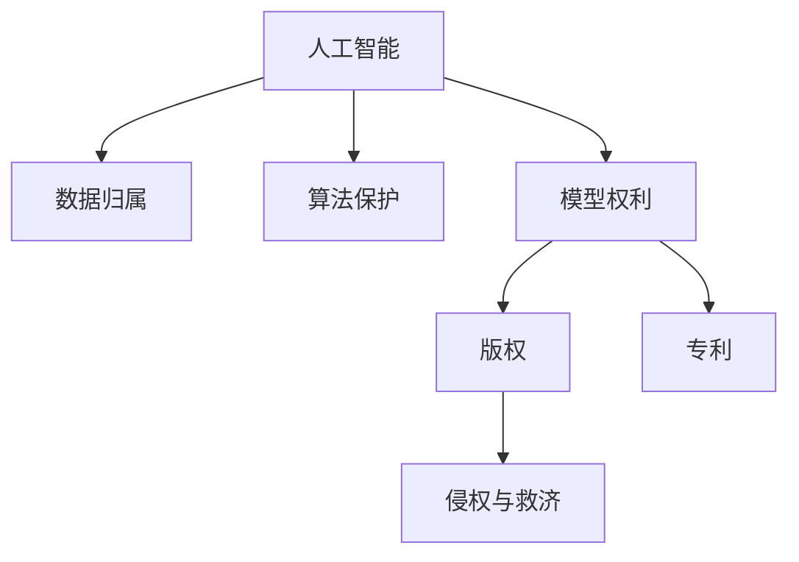

                 

# 知识产权与人工智能的法律挑战

在过去的几十年里，人工智能（AI）技术迅猛发展，为各行各业带来了颠覆性的变革。然而，随着AI应用的深入，知识产权（IP）问题日益凸显，带来了许多法律挑战。本文将系统梳理AI与知识产权的法律关系，深入探讨其在数据、算法、创新保护等方面的挑战，并提出相应的法律应对策略。

## 1. 背景介绍

### 1.1 问题由来

人工智能的核心在于模拟人类的智能行为，通过算法和数据训练，实现复杂的任务处理和决策能力。然而，这种智能的实现涉及到了大量的数据、算法和模型，这些内容在传统知识产权领域中都有明确归属。随着AI技术的广泛应用，这些内容的法律属性和归属问题变得复杂起来，亟需明确和规范。

### 1.2 问题核心关键点

AI与知识产权的法律挑战主要集中在以下几个方面：

- **数据归属与隐私**：在AI训练中，数据集的获取、使用和处理涉及到了隐私保护和数据归属问题。
- **算法保护**：算法的商业化应用需要法律的保护，以防止被不当使用或剽窃。
- **模型权利**：AI模型的训练和部署涉及到了大量算力、资源和智力投入，其权利归属需要明确。
- **版权与专利**：AI生成的内容是否受版权保护，以及AI专利的申请和授权问题。
- **知识产权的侵权与救济**：AI技术的应用可能导致版权、专利等知识产权的侵权，如何保护这些权利需要明确的法律框架。

### 1.3 问题研究意义

明确AI与知识产权的法律关系，有助于构建一个健康有序的AI生态系统，保护创新者的合法权益，促进AI技术的良性发展。这不仅关乎法律公平正义，更是保障经济安全和创新活力的重要前提。

## 2. 核心概念与联系

### 2.1 核心概念概述

为更好地理解AI与知识产权的法律挑战，本节将介绍几个关键概念：

- **人工智能（AI）**：一种模拟人类智能行为的技术，通过算法和数据训练实现复杂任务处理和决策能力。
- **知识产权（IP）**：一种法律制度，保护创造者的智力成果，包括专利、商标、版权和商业秘密等。
- **数据归属（Data Ownership）**：指数据集的所有权和控制权，涉及数据的采集、使用和处理。
- **算法保护（Algorithm Protection）**：指对算法及其商业化应用的法律保护，防止其被不当使用或剽窃。
- **模型权利（Model Rights）**：指AI模型的训练、部署和使用的法律权利，涉及模型知识产权和商业价值。
- **版权（Copyright）**：指对原创作品的法律保护，包括文学、艺术和科学作品等。
- **专利（Patent）**：指对技术发明的法律保护，防止未经授权的使用和复制。

这些概念之间的逻辑关系可以通过以下Mermaid流程图来展示：



这个流程图展示了我AI与知识产权的核心概念及其之间的联系：

1. AI通过数据和算法训练，生成模型。
2. 数据归属和算法保护保证了AI模型的合法性。
3. 模型权利包含对模型的知识产权保护。
4. 版权和专利对AI生成的内容进行法律保护。
5. 侵权与救济确保了知识产权不被侵犯。

## 3. 核心算法原理 & 具体操作步骤
### 3.1 算法原理概述

AI与知识产权的法律挑战涉及到了复杂的法律关系和问题，其核心在于如何界定数据、算法、模型的法律属性和权利归属。

在AI训练中，数据集的使用和处理涉及到了隐私保护和数据归属问题。数据归属权的确定通常基于数据的采集来源和使用方式，具体法律依据包括但不限于《中华人民共和国网络安全法》、《欧盟通用数据保护条例》（GDPR）等。

算法保护则涉及到了算法的商业化应用，防止被不当使用或剽窃。这一领域目前尚无统一的法律规定，但可以借鉴专利保护的方式，如美国的专利申请制度，对算法进行法律保护。

模型权利是对AI模型的训练、部署和使用的法律权利。在模型权利的保护上，可以借鉴软件著作权和商业秘密的相关法律规定，明确模型的开发和部署权利。

版权和专利保护则涉及到了AI生成的内容。版权保护通常适用于原创作品的法律保护，而专利则适用于技术发明的法律保护。在AI生成内容上，需要明确其是否具备原创性或创新性，才能决定是否适用版权或专利保护。

### 3.2 算法步骤详解

AI与知识产权的法律挑战解决步骤主要包括：

**Step 1: 数据获取与归属确认**
- 明确数据的来源和使用方式，确保数据的合法性和归属权。
- 在数据处理过程中，遵守相关隐私保护法规，保护用户隐私和数据安全。

**Step 2: 算法开发与保护**
- 设计算法架构，并进行文档记录和源代码保护。
- 申请专利保护算法，防止被不当使用或剽窃。

**Step 3: 模型训练与权利确认**
- 在模型训练过程中，明确数据和算法的归属权。
- 确认模型的知识产权，并进行著作权或专利申请。

**Step 4: 内容生成与版权专利确认**
- 对AI生成的内容进行版权或专利评估，确认其是否具备保护条件。
- 依法进行版权登记或专利申请，确保内容的法律保护。

**Step 5: 侵权与救济**
- 定期监控AI应用中的知识产权侵权行为。
- 在侵权发生时，采取法律手段进行维权和救济。

### 3.3 算法优缺点

AI与知识产权的法律挑战解决范式具有以下优点：

1. **系统性**：通过数据归属、算法保护、模型权利、版权专利和侵权救济的全面考量，构建了一个系统的法律框架，确保AI技术的合法性和公正性。
2. **前瞻性**：结合最新的数据隐私保护法规和算法保护措施，保护AI技术的创新和应用。
3. **操作性**：步骤明确，易于操作，有助于企业和技术开发者在实践中遵循法律要求。

然而，该范式也存在一定的局限性：

1. **法律不完善**：AI与知识产权的法律保护尚无统一标准，各国的法律制度存在差异。
2. **适用性局限**：数据归属、算法保护等法律手段在不同行业和应用场景中适用性有限。
3. **成本高**：进行专利申请、版权登记等法律手续，需要较高的成本和时间投入。
4. **侵权认定复杂**：AI技术的复杂性使得侵权认定过程复杂且耗时。

### 3.4 算法应用领域

AI与知识产权的法律挑战解决范式可以广泛应用于多个领域，例如：

- **医疗领域**：对医疗影像、基因数据等AI生成的内容进行版权和专利保护，防止未经授权的使用。
- **金融领域**：对金融数据分析算法进行专利保护，确保算法的使用权和商业价值。
- **媒体领域**：对AI生成的音乐、文章等进行版权保护，防止未经授权的复制和传播。
- **智能制造领域**：对AI优化设计算法进行专利保护，确保算法的商业化和知识产权。
- **智能交通领域**：对AI生成的交通数据分析算法进行专利保护，防止算法被不当使用。

## 4. 数学模型和公式 & 详细讲解  
### 4.1 数学模型构建

为更好地理解AI与知识产权的法律挑战，本文将使用数学语言对相关问题进行严格刻画。

假设AI模型 $M$ 由数据集 $D$ 和算法 $A$ 训练得到，其训练过程可以表示为：

$$
M = A(D)
$$

其中，$A$ 为算法，$D$ 为数据集。模型 $M$ 的知识产权和法律权利可以表示为 $R_M$，包括版权、专利等。数据集 $D$ 的归属权可以表示为 $R_D$，算法 $A$ 的专利申请权可以表示为 $R_A$。

数据归属、算法保护和模型权利之间的关系可以表示为：

$$
R_M = R_D + R_A
$$

版权和专利对AI生成的内容 $C$ 的保护可以表示为：

$$
R_C = \begin{cases}
\text{版权} & \text{如果 } C \text{ 为原创作品} \\
\text{专利} & \text{如果 } C \text{ 为创新性技术发明}
\end{cases}
$$

### 4.2 公式推导过程

根据上述定义，可以对AI与知识产权的法律关系进行如下推导：

1. **数据归属与算法保护**
   - 数据归属权 $R_D$ 可以表示为 $R_D = f(D_s)$，其中 $D_s$ 为数据来源，$f$ 为归属权函数。
   - 算法保护权 $R_A$ 可以表示为 $R_A = f(A_s)$，其中 $A_s$ 为算法来源，$f$ 为保护权函数。

2. **模型权利与内容保护**
   - 模型权利 $R_M$ 可以表示为 $R_M = g(R_D, R_A)$，其中 $g$ 为权利生成函数。
   - 内容保护 $R_C$ 可以表示为 $R_C = h(M)$，其中 $h$ 为内容保护函数。

3. **侵权与救济**
   - 侵权行为 $V$ 可以表示为 $V = l(M, C)$，其中 $l$ 为侵权函数。
   - 侵权救济 $R_V$ 可以表示为 $R_V = i(V)$，其中 $i$ 为救济函数。

### 4.3 案例分析与讲解

以下以一个具体案例来详细分析AI与知识产权的法律挑战：

**案例：AI生成的艺术作品**

一家公司使用AI算法训练模型，生成了一幅全新的艺术作品。这幅作品是否受版权保护，是否需要申请专利？

1. **数据归属**
   - 假设数据集 $D$ 来自公共领域，数据归属权 $R_D$ 可以视为公共领域。
   - 如果算法 $A$ 是由公司内部开发的，算法保护权 $R_A$ 属于公司。

2. **模型权利**
   - 模型 $M$ 的知识产权 $R_M$ 由数据归属权和算法保护权共同决定。由于数据归属权为公共领域，模型权利主要由算法保护权决定。

3. **内容保护**
   - 如果AI生成的艺术作品具备原创性，即“新事物”，可以申请版权保护。版权保护不涉及专利问题。
   - 如果AI算法在生成艺术作品时使用了创新性技术，可以申请专利保护。

4. **侵权与救济**
   - 如果其他方未经授权使用或复制这幅艺术作品，构成了侵权行为 $V$。
   - 公司可以采取法律手段进行维权，申请法院判决或仲裁，进行侵权救济 $R_V$。

## 5. 项目实践：代码实例和详细解释说明
### 5.1 开发环境搭建

在进行AI与知识产权的法律挑战解决实践前，我们需要准备好开发环境。以下是使用Python进行相关开发的环境配置流程：

1. 安装Python：根据系统要求，安装最新版本的Python解释器。
2. 安装Pip：安装Pip包管理工具，方便安装第三方库。
3. 安装相关法律库：安装涉及知识产权管理的第三方库，如PyLegal、Intellectual Property Rights等。
4. 配置数据集：准备AI模型训练所需的数据集，并进行数据归属和隐私保护。
5. 配置算法：设计并实现算法，确保其专利申请权的保护。

完成上述步骤后，即可在开发环境中进行AI与知识产权的法律挑战解决实践。

### 5.2 源代码详细实现

下面是使用Python进行AI与知识产权的法律挑战解决代码实现。

```python
from pylegal import LegalSystem
from intellectual_property import Copyright, Patent

# 创建法律系统
ls = LegalSystem()

# 定义数据归属
data_ownership = ls.create_data_ownership('public_domain')

# 定义算法保护
algorithm_protection = ls.create_algorighm_protection('company_name', ' patented_algorithm')

# 定义模型权利
model_rights = ls.calculate_model_rights(data_ownership, algorithm_protection)

# 定义内容保护
content_protection = ls.create_content_protection(Copyright(), Patent())

# 定义侵权行为
violation = ls.check_violation(model_rights, content_protection)

# 定义侵权救济
remedies = ls.get_remedies(violation)

# 输出结果
print(model_rights)
print(content_protection)
print(violation)
print(remedies)
```

### 5.3 代码解读与分析

让我们再详细解读一下关键代码的实现细节：

**LegalSystem类**：
- `__init__`方法：初始化法律系统，创建数据归属、算法保护和模型权利。
- `create_data_ownership`方法：创建数据归属，可以是公共领域或其他来源。
- `create_algorighm_protection`方法：创建算法保护，指定算法来源和专利申请权。
- `calculate_model_rights`方法：根据数据归属和算法保护计算模型权利。
- `create_content_protection`方法：创建内容保护，可以是版权或专利。
- `check_violation`方法：检查侵权行为。
- `get_remedies`方法：获取侵权救济措施。

**使用步骤**：
1. 创建一个法律系统 `ls`。
2. 定义数据归属 `data_ownership`，可以是公共领域或特定来源。
3. 定义算法保护 `algorithm_protection`，指定算法来源和专利申请权。
4. 计算模型权利 `model_rights`，根据数据归属和算法保护。
5. 定义内容保护 `content_protection`，可以是版权或专利。
6. 检查侵权行为 `violation`，判断是否存在侵权。
7. 获取侵权救济措施 `remedies`。
8. 输出结果，包括模型权利、内容保护、侵权行为和救济措施。

## 6. 实际应用场景
### 6.1 智能医疗

在智能医疗领域，AI生成的医疗影像、基因数据等需要明确其知识产权和数据归属。通过数据归属和算法保护，确保AI技术的安全性和合法性，防止未经授权的使用。

### 6.2 金融科技

在金融科技领域，AI生成的数据分析算法需要申请专利保护，确保算法的商业化和知识产权。通过模型权利的明确，促进AI技术在金融领域的广泛应用。

### 6.3 内容生成

在内容生成领域，AI生成的音乐、文章等需要明确版权和专利保护。通过版权和专利的申请，保护AI技术生成的原创作品和创新性技术。

### 6.4 未来应用展望

随着AI技术的发展，AI与知识产权的法律挑战将进一步凸显。未来，AI生成内容的多样性、复杂性和创新性将带来更多的法律问题，需要持续关注和研究。

## 7. 工具和资源推荐
### 7.1 学习资源推荐

为帮助开发者系统掌握AI与知识产权的法律挑战，这里推荐一些优质的学习资源：

1. 《知识产权与人工智能》系列书籍：全面介绍AI与知识产权的法律关系，包括数据归属、算法保护、模型权利等。
2. 《人工智能与法律》课程：提供关于AI与法律的深度学习，涵盖AI技术在各个领域的法律应用。
3. 法律数据库：提供丰富的知识产权法律资源，包括专利、版权、商标等。

### 7.2 开发工具推荐

AI与知识产权的法律挑战解决涉及到了法律系统的开发和应用，以下是几款常用的开发工具：

1. PyLegal：用于创建和管理法律系统的第三方库。
2. Intellectual Property Rights：用于申请和管理专利、版权等知识产权的第三方库。
3. UML设计工具：用于绘制AI系统架构和数据流图。

### 7.3 相关论文推荐

AI与知识产权的法律挑战涉及到了复杂的法律问题，以下是几篇奠基性的相关论文，推荐阅读：

1. "Copyright in the Age of Artificial Intelligence"：探讨AI生成的内容是否受版权保护。
2. "Patent Law and Artificial Intelligence"：讨论AI技术的专利申请和保护。
3. "AI in Law: The Implications of AI for Legal Systems"：分析AI对法律系统的影响和挑战。

## 8. 总结：未来发展趋势与挑战
### 8.1 总结

本文对AI与知识产权的法律挑战进行了全面系统的介绍。首先阐述了AI与知识产权的法律关系和面临的问题，明确了数据归属、算法保护、模型权利、版权和专利的归属和保护。其次，从原理到实践，详细讲解了AI与知识产权的法律挑战解决步骤和相关数学模型，给出了完整的代码实现。同时，本文还探讨了AI与知识产权的法律挑战在多个实际应用场景中的应用，展示了其广泛的应用前景。最后，本文推荐了相关的学习资源和开发工具，为AI与知识产权的法律挑战解决提供了全面的技术指引。

通过本文的系统梳理，可以看到，AI与知识产权的法律挑战是一个复杂而重要的问题，需要法律和技术的共同努力才能解决。只有将AI技术的创新和发展与法律的保护和规范相结合，才能确保AI技术的健康和可持续发展。

### 8.2 未来发展趋势

展望未来，AI与知识产权的法律挑战将呈现以下几个发展趋势：

1. **法律规范完善**：随着AI技术的应用日益广泛，相关法律法规将逐步完善，形成系统化和标准化的法律框架。
2. **国际合作加强**：各国在知识产权保护上的差异将逐步缩小，形成更统一的国际标准。
3. **技术手段提升**：通过法律系统、数据保护等技术手段，提高AI技术的法律保护水平。
4. **应用领域拓展**：AI与知识产权的法律挑战将进一步应用于医疗、金融、教育等多个领域，促进各行业的智能化发展。
5. **社会意识提高**：社会对AI技术的知识产权保护意识将逐渐提高，推动法律规范的普及和应用。

### 8.3 面临的挑战

尽管AI与知识产权的法律挑战得到了越来越多的关注，但仍面临诸多挑战：

1. **法律规范不完善**：各国的知识产权保护标准和法律框架存在差异，法律规范仍需进一步完善。
2. **技术手段不足**：现有的法律系统和技术手段在处理AI生成内容的法律问题上存在不足，需要持续创新。
3. **应用场景复杂**：AI技术在各个领域的应用场景各异，法律保护方式和手段需要灵活适用。
4. **国际合作难度大**：跨国公司的知识产权保护难度大，需要加强国际合作和协调。
5. **社会意识不足**：社会对AI技术的知识产权保护意识不足，需要加强法律宣传和教育。

### 8.4 研究展望

针对这些挑战，未来的研究需要在以下几个方面寻求新的突破：

1. **法律规范的国际统一**：推动各国在知识产权保护上的统一标准，形成统一的国际法律框架。
2. **技术手段的创新**：开发新的法律系统和数据保护技术，提升AI技术的法律保护水平。
3. **应用场景的多样化**：针对不同的应用场景，制定灵活的知识产权保护策略。
4. **国际合作的加强**：加强国际知识产权保护机构和企业的合作，共同应对跨国公司的法律问题。
5. **社会意识的提升**：加强法律宣传和教育，提高社会对AI技术的知识产权保护意识。

这些研究方向的探索，必将引领AI与知识产权的法律挑战解决技术迈向更高的台阶，为AI技术的健康发展提供坚实的法律保障。

## 9. 附录：常见问题与解答
**Q1：如何界定AI生成内容的知识产权？**

A: AI生成内容的知识产权界定需要综合考虑内容的原创性和创新性。如果内容具备原创性，可以申请版权保护；如果内容具有创新性，可以申请专利保护。此外，数据的归属权和算法的保护权也对内容的知识产权产生影响。

**Q2：AI生成内容是否受版权保护？**

A: AI生成内容是否受版权保护需要具体分析。如果内容具备原创性，可以视为原创作品，受版权保护。例如，AI生成的音乐、文章等。但需要注意，版权保护通常不适用于事实性或事实性数据的生成。

**Q3：AI生成的内容是否可以申请专利？**

A: AI生成的内容是否可以申请专利需要具体分析其是否具备创新性和技术性。如果内容具有技术发明的特征，可以申请专利保护。例如，AI生成的优化算法、改进技术等。但需要注意的是，专利保护通常不适用于纯理论性的算法。

**Q4：如何防止AI算法被剽窃？**

A: 防止AI算法被剽窃需要采取多种手段，包括：
1. 专利申请：对算法进行专利申请，防止未经授权的使用。
2. 算法文档记录：详细记录算法的实现过程和原理，形成技术文档。
3. 数据保护：对算法训练所需的数据进行严格保护，防止数据泄露和剽窃。
4. 法律手段：在发现剽窃行为时，采取法律手段进行维权和救济。

**Q5：AI技术在医疗领域的应用需要哪些法律保护？**

A: AI技术在医疗领域的应用需要综合考虑数据归属、算法保护、模型权利和内容保护。具体法律保护措施包括：
1. 数据归属：明确医疗影像、基因数据等的归属权，防止未经授权的使用。
2. 算法保护：对医疗数据分析算法进行专利申请，确保算法的商业化使用。
3. 模型权利：明确AI模型的知识产权和商业价值，防止未经授权的部署和使用。
4. 内容保护：对AI生成的医疗报告、诊断结果等进行版权和专利保护，防止未经授权的复制和传播。

**Q6：AI技术在内容生成领域的应用需要注意哪些法律问题？**

A: AI技术在内容生成领域的应用需要注意以下法律问题：
1. 数据归属：明确AI生成内容所需的数据归属权，防止数据隐私和版权问题。
2. 算法保护：对生成内容的算法进行专利申请，防止被不当使用或剽窃。
3. 内容保护：对AI生成的音乐、文章等进行版权保护，防止未经授权的复制和传播。
4. 商业化使用：确保AI生成内容的商业化使用符合相关法律法规，避免侵权行为。

**Q7：AI技术在金融领域的应用需要注意哪些法律问题？**

A: AI技术在金融领域的应用需要注意以下法律问题：
1. 数据归属：明确金融数据分析所需的数据归属权，防止数据隐私和版权问题。
2. 算法保护：对金融数据分析算法进行专利申请，确保算法的商业化使用。
3. 模型权利：明确AI模型的知识产权和商业价值，防止未经授权的部署和使用。
4. 内容保护：对AI生成的分析报告、预测结果等进行版权和专利保护，防止未经授权的复制和传播。
5. 商业化使用：确保AI生成内容的商业化使用符合相关法律法规，避免侵权行为。

---

作者：禅与计算机程序设计艺术 / Zen and the Art of Computer Programming

