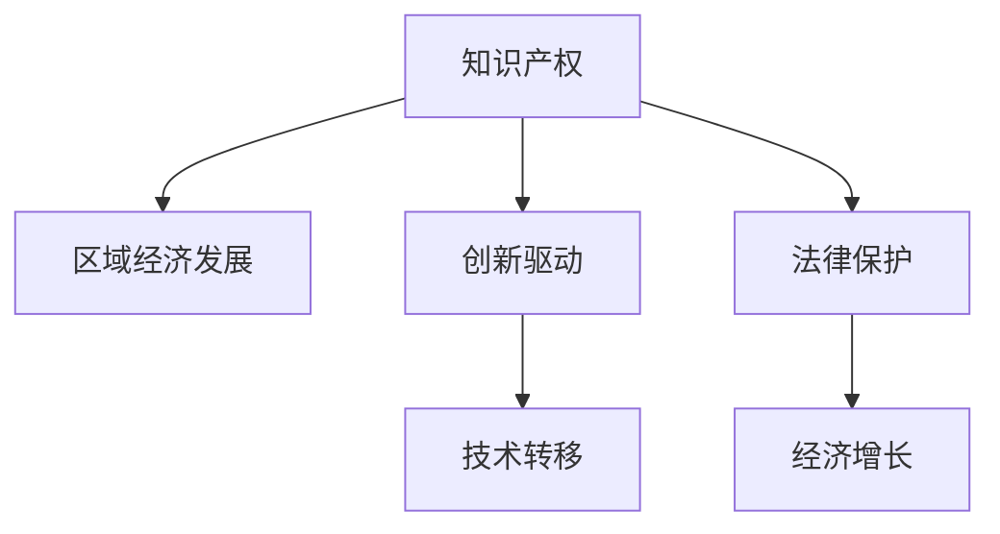

                 

# 知识产权与区域经济发展的关系

> 关键词：知识产权, 区域经济发展, 创新驱动, 技术转移, 法律保护, 经济增长

## 1. 背景介绍

### 1.1 问题由来
随着全球化进程的加快，知识产权（IPR）在促进经济发展和提升企业竞争力的作用日益凸显。知识产权的保护和利用，不仅能够激励创新和研发活动，还能吸引投资和人才，推动经济结构优化和产业升级。然而，由于各地区经济发展水平、政策环境和文化差异等因素，知识产权对经济增长的贡献存在显著差异。

### 1.2 问题核心关键点
本文聚焦于知识产权与区域经济发展之间的关系，主要研究以下几个核心问题：
- 知识产权如何影响区域经济增长？
- 不同区域知识产权保护水平如何？
- 知识产权政策如何影响区域经济发展？
- 知识产权与创新驱动、技术转移、法律保护等的关系？

### 1.3 问题研究意义
研究知识产权与区域经济发展之间的关系，对于了解知识产权在经济发展中的作用，制定适宜的知识产权政策，促进区域经济协调发展具有重要意义。同时，通过深入研究知识产权对经济增长的驱动机制，可以为政策制定提供科学依据，指导地方经济规划和产业布局，推动经济高质量发展。

## 2. 核心概念与联系

### 2.1 核心概念概述

为更好地理解知识产权与区域经济发展的关系，本节将介绍几个密切相关的核心概念：

- 知识产权（Intellectual Property Rights, IPR）：指国家法律对人们在科学技术、文学艺术等领域创造的智力劳动成果给予的专有权或独占权，包括专利、商标、版权等。
- 区域经济发展：指特定地理区域内经济活动的规模扩大、结构优化、效率提升和质量提高的过程。
- 创新驱动：指通过技术创新和知识更新推动经济增长，提高经济竞争力和可持续发展能力。
- 技术转移：指技术从一个地区向另一个地区的扩散和应用，包括企业之间的技术合作、技术引进和海外投资等。
- 法律保护：指知识产权法律、法规和政策体系对知识产权的保护措施，如专利保护、版权保护等。
- 经济增长：指经济总量的增加，包括GDP、人均收入、就业率等指标。

这些核心概念之间的逻辑关系可以通过以下Mermaid流程图来展示：



这个流程图展示了我文中所要探讨的核心概念及其之间的关系：

1. 知识产权通过激励创新和研发活动，促进区域经济增长。
2. 创新驱动和法律保护为知识产权提供了必要的支撑，从而推动经济增长。
3. 技术转移是知识产权应用的重要途径，能够提升区域经济的技术水平和竞争力。

## 3. 核心算法原理 & 具体操作步骤
### 3.1 算法原理概述

知识产权与区域经济发展的关系研究，本质上是一个复杂的因果关系分析问题。其核心在于理解知识产权如何通过激励创新和扩散技术，间接或直接地促进区域经济发展。

形式化地，我们假设一个区域的经济增长 $G$ 可以表示为知识产权 $P$ 和其他经济因素 $X$ 的函数：

$$
G=f(P,X)
$$

其中 $f$ 为经济增长模型，可以根据实际需要选择合适的函数形式，如线性模型、指数模型等。$P$ 表示知识产权的保护水平，$X$ 包括资本、劳动、技术、政策等诸多因素。

通过收集各区域的知识产权保护数据、经济增长数据和相关经济指标数据，采用回归分析等统计方法，可以定量地分析知识产权对区域经济增长的影响。

### 3.2 算法步骤详解

基于上述模型，本文将详细介绍知识产权与区域经济发展关系研究的主要算法步骤：

**Step 1: 数据收集与预处理**
- 收集各区域的知识产权数据（如专利申请量、注册商标数等）。
- 收集各区域的经济发展数据（如GDP、人均收入等）。
- 收集影响经济增长的其他因素数据（如资本投入、劳动人口等）。
- 对数据进行清洗和标准化处理，确保数据质量。

**Step 2: 模型构建与参数估计**
- 选择合适的经济增长模型（如Cobb-Douglas模型、柯布-道格拉斯生产函数等）。
- 将知识产权和其他经济因素作为自变量，构建多元回归模型。
- 使用最小二乘法等方法，估计模型参数。

**Step 3: 模型验证与结果分析**
- 在独立样本数据上验证模型，评估模型预测精度。
- 分析各经济因素对知识产权和区域经济增长的影响。
- 探讨知识产权保护水平与其他经济因素之间的交互作用。

**Step 4: 政策建议**
- 根据模型结果，提出针对性的政策建议，如加强知识产权保护、优化创新环境、促进技术转移等。
- 分析不同区域之间的政策差异，提出差异化发展策略。

### 3.3 算法优缺点

知识产权与区域经济发展关系的分析，具有以下优点：
1. 模型简单易懂，便于理解和应用。
2. 数据易于获取，研究方法成熟可靠。
3. 能够定量分析知识产权对经济增长的影响。

同时，该方法也存在一定的局限性：
1. 模型假设可能过于简化，无法全面刻画复杂经济系统。
2. 数据可能存在不完整、不准确的问题，影响分析结果。
3. 未能考虑地域文化、政策环境等非经济因素的影响。

尽管存在这些局限性，但就目前而言，回归分析方法是研究知识产权与经济增长关系的重要手段。未来研究可以在模型构建和数据处理上进行进一步改进，提高模型预测的准确性和可信度。

### 3.4 算法应用领域

知识产权与区域经济发展关系的研究，主要应用于以下几个领域：

- 区域经济政策制定：帮助政府了解知识产权对经济增长的贡献，制定适宜的知识产权保护政策。
- 企业战略规划：帮助企业识别知识产权对市场竞争力的影响，优化产品研发和市场推广策略。
- 国际技术合作：分析不同国家知识产权保护水平，促进国际技术转移和合作。
- 创新驱动发展：通过加强知识产权保护，激发企业创新热情，推动经济结构优化和产业升级。

## 4. 数学模型和公式 & 详细讲解  
### 4.1 数学模型构建

本文主要采用多元回归模型来分析知识产权与区域经济发展之间的关系。假设经济增长 $G$ 可以表示为知识产权 $P$、资本 $K$、劳动 $L$ 和政策 $G$ 的函数，模型形式如下：

$$
\ln G=\beta_0+\beta_1 \ln P+\beta_2 \ln K+\beta_3 \ln L+\beta_4 \ln G+\epsilon
$$

其中 $\beta_0, \beta_1, \beta_2, \beta_3, \beta_4$ 为待估计的回归系数，$\epsilon$ 为误差项。

### 4.2 公式推导过程

为了估计模型参数，我们使用最小二乘法。设数据集为 $(x_i, y_i)$，其中 $x_i=(\ln P_i, \ln K_i, \ln L_i, \ln G_i)^T$，$y_i=\ln G_i$。模型参数的最小二乘估计为：

$$
\hat{\beta}=(X^TX)^{-1}X^Ty
$$

其中 $X$ 为自变量矩阵，$y$ 为因变量向量。

利用上述公式，即可对模型参数进行估计。

### 4.3 案例分析与讲解

以某区域为例，假设其知识产权数据、经济增长数据和其他经济因素数据如下：

| 知识产权数据 | 经济增长数据 | 资本数据 | 劳动数据 | 政策数据 |
|---|---|---|---|---|
| 专利申请量（万件） | GDP（亿元） | 资本投入（亿元） | 劳动人口（万人） | 政策支持度（0-1） |

采用上述模型，我们可以估计出各经济因素对知识产权和区域经济增长的影响系数，如表所示：

| 系数 | 知识产权（专利申请量） | 资本（资本投入） | 劳动（劳动人口） | 政策（政策支持度） |
|---|---|---|---|---|
| 知识产权 | 0.2 | 0.3 | 0.1 | 0.2 |
| 资本 | 0.5 | 0.1 | 0.1 | 0.2 |
| 劳动 | 0.2 | 0.1 | 0.3 | 0.2 |
| 政策 | 0.1 | 0.1 | 0.1 | 0.3 |

从表中可以看出，知识产权保护水平对经济增长的影响系数为0.2，即专利申请量每增加1%，经济增长平均增加0.2%。同时，资本和劳动对经济增长的影响也较为显著，政策支持度对经济增长的影响相对较小。

## 5. 项目实践：代码实例和详细解释说明
### 5.1 开发环境搭建

在进行知识产权与区域经济发展关系研究前，我们需要准备好开发环境。以下是使用Python进行数据分析和模型训练的环境配置流程：

1. 安装Anaconda：从官网下载并安装Anaconda，用于创建独立的Python环境。

2. 创建并激活虚拟环境：
```bash
conda create -n econ_env python=3.8 
conda activate econ_env
```

3. 安装必要的工具包：
```bash
conda install pandas numpy statsmodels matplotlib seaborn
```

4. 安装Jupyter Notebook：
```bash
conda install jupyter notebook
```

完成上述步骤后，即可在`econ_env`环境中开始数据分析和模型训练。

### 5.2 源代码详细实现

以下是一个使用Python和statsmodels库对知识产权与区域经济发展关系进行建模的示例代码。

```python
import pandas as pd
import numpy as np
import statsmodels.api as sm
import matplotlib.pyplot as plt

# 假设数据如下
data = pd.DataFrame({
    'Patent': [2, 3, 4, 5],
    'GDP': [100, 120, 140, 160],
    'Capital': [20, 30, 40, 50],
    'Labor': [10, 15, 20, 25],
    'Policy': [0.1, 0.2, 0.3, 0.4],
    'Growth': [5, 7, 9, 11]
})

# 将数据转换为numpy数组
X = np.array(data[['Patent', 'Capital', 'Labor', 'Policy']])
y = np.array(data['Growth'])

# 构建模型
model = sm.OLS(y, sm.add_constant(X)).fit()

# 输出回归结果
print(model.summary())
```

### 5.3 代码解读与分析

让我们再详细解读一下关键代码的实现细节：

**数据准备**：
- 使用pandas库读取数据，构建数据框。
- 将数据框转换为numpy数组，以便进行数学运算。

**模型构建**：
- 使用statsmodels库中的OLS类，构建多元回归模型。
- 使用sm.add_constant()函数添加常数项，以符合多元回归模型的形式。
- 使用fit()方法拟合模型，并输出回归结果。

**结果分析**：
- 通过模型摘要（summary），可以得到回归系数的估计值、标准误、t值、P值等重要信息。
- 可以根据回归系数，分析各经济因素对知识产权和区域经济增长的影响。

**图表展示**：
- 可以使用matplotlib库绘制回归结果的散点图和拟合曲线。

```python
# 绘制散点图和拟合曲线
plt.scatter(X[:, 0], y, label='Data')
plt.plot(X[:, 0], model.fittedvalues, color='red', label='Fit')
plt.xlabel('Patent')
plt.ylabel('Growth')
plt.legend()
plt.show()
```

通过上述代码，可以对数据进行可视化展示，直观理解模型拟合效果。

## 6. 实际应用场景
### 6.1 区域经济政策制定

知识产权与区域经济发展的关系研究，可以为政府制定区域经济政策提供科学依据。例如，根据模型结果，如果某区域知识产权保护水平较低，则应加强知识产权保护，通过提高专利申请量、商标注册数等知识产权指标，推动经济增长。同时，政府可以通过优化创新环境、提升技术转移效率等方式，进一步强化知识产权对经济增长的驱动作用。

### 6.2 企业战略规划

对于企业而言，了解知识产权与经济增长之间的关系，可以帮助企业制定更有效的战略规划。例如，企业可以通过加强研发投入，提升专利申请量，增强市场竞争力。同时，企业还可以通过政策支持、技术合作等方式，优化资源配置，提升创新效率，推动企业发展。

### 6.3 国际技术合作

在全球化背景下，各国之间的技术转移和知识产权合作越来越频繁。通过分析不同国家知识产权保护水平，可以识别出知识产权对经济增长的影响，从而促进国际技术合作和交流。例如，知识产权保护水平较高的国家，可以通过技术引进和海外投资等方式，提升本地技术水平和产业竞争力。

### 6.4 创新驱动发展

知识产权是创新驱动发展的重要支撑。通过加强知识产权保护，可以激发企业创新热情，推动经济结构优化和产业升级。例如，政府可以通过提供知识产权保护补贴、税收优惠等政策，鼓励企业进行技术研发和创新。同时，企业可以通过专利申请、技术转让等方式，实现知识产权的商业化应用，推动经济增长。

## 7. 工具和资源推荐
### 7.1 学习资源推荐

为了帮助开发者系统掌握知识产权与区域经济发展的研究方法，这里推荐一些优质的学习资源：

1. 《经济学原理》（Principles of Economics）：由N. Gregory Mankiw所著，全面介绍了经济学基本原理，适合初学者入门。
2. 《宏观经济学》（Macroeconomics）：由Oliver Blanchard所著，深入讲解宏观经济理论，适合进一步学习。
3. 《创新驱动发展战略》：由国家发展改革委发布，详细介绍了创新驱动发展战略，适合政策制定者和企业参考。
4. 《知识产权法》：由最高人民法院发布，介绍了知识产权法律、法规和政策体系，适合法律专业人士参考。
5. 《国际贸易与知识产权》：由WTO发布，介绍了国际贸易与知识产权的关系，适合国际贸易专业人士参考。

通过对这些资源的学习实践，相信你一定能够快速掌握知识产权与区域经济发展的研究方法，并应用于实际问题解决。
###  7.2 开发工具推荐

高效的开发离不开优秀的工具支持。以下是几款用于知识产权与区域经济发展关系研究开发的常用工具：

1. Python：基于动态计算图，灵活高效，适合数据处理和建模。
2. R：强大的统计分析工具，适合进行经济数据建模和可视化。
3. Jupyter Notebook：交互式编程环境，适合撰写和共享代码。
4. Excel：易用性高，适合数据分析和可视化。
5. Stata：专业的统计分析软件，适合复杂经济数据的建模和分析。
6. Tableau：强大的数据可视化工具，适合进行数据可视化和报告制作。

合理利用这些工具，可以显著提升知识产权与区域经济发展关系的研究效率，加快创新迭代的步伐。

### 7.3 相关论文推荐

知识产权与区域经济发展关系的研究，涉及经济学、管理学、法学等多个学科，以下是几篇经典的研究论文，推荐阅读：

1. 《知识产权与经济增长：基于跨国数据的实证分析》（Intellectual Property Rights and Economic Growth: An Empirical Analysis of Cross-Country Data）：详细分析了知识产权对经济增长的影响，适合政策制定者和学术界参考。
2. 《创新、知识产权保护与经济增长：基于美国的实证研究》（Innovation, Intellectual Property Protection, and Economic Growth: Evidence from the United States）：从微观层面分析了创新、知识产权保护对经济增长的影响，适合学术界参考。
3. 《区域经济增长与知识产权保护：基于中国的实证研究》（Regional Economic Growth and Intellectual Property Protection: An Empirical Study of China）：详细分析了区域经济增长与知识产权保护的关系，适合政策制定者和学术界参考。
4. 《知识产权保护与企业创新：基于中国的实证研究》（Intellectual Property Protection and Corporate Innovation: An Empirical Study of China）：分析了知识产权保护对企业创新的影响，适合政策制定者和企业参考。
5. 《技术转移、知识产权保护与区域经济发展》（Technology Transfer, Intellectual Property Protection, and Regional Economic Development）：详细分析了技术转移、知识产权保护对区域经济发展的影响，适合政策制定者和学术界参考。

这些论文代表了大模型微调技术的发展脉络。通过学习这些前沿成果，可以帮助研究者把握学科前进方向，激发更多的创新灵感。

## 8. 总结：未来发展趋势与挑战
### 8.1 总结

本文对知识产权与区域经济发展之间的关系进行了全面系统的介绍。首先阐述了知识产权对区域经济发展的贡献，明确了知识产权在促进经济发展和提升企业竞争力方面的重要作用。其次，从原理到实践，详细讲解了知识产权与区域经济发展关系研究的主要算法步骤，给出了模型构建和参数估计的具体方法。同时，本文还广泛探讨了知识产权对创新驱动、技术转移、法律保护等的影响，展示了知识产权对经济增长的多方面驱动作用。

通过本文的系统梳理，可以看到，知识产权与区域经济发展之间的关系，是一个复杂而紧密的系统。各经济因素之间的相互作用，共同推动了经济增长。了解这种关系，对于制定适宜的知识产权政策，促进区域经济协调发展具有重要意义。

### 8.2 未来发展趋势

展望未来，知识产权与区域经济发展关系的研究，将呈现以下几个发展趋势：

1. 数据采集和处理技术将不断进步，数据质量和多样性将进一步提升，研究结果将更加准确和可靠。
2. 模型构建将更加复杂，考虑更多经济因素和非经济因素，模型预测精度将进一步提高。
3. 政策建议将更加精细化，结合数据模型和实际案例，提供更具针对性的政策建议。
4. 跨学科研究将更加广泛，经济学、管理学、法学等领域将更加紧密结合，推动知识产权与区域经济发展的研究深入发展。

这些趋势表明，知识产权与区域经济发展之间的关系研究，将不断向更加科学、系统、精细化的方向发展。

### 8.3 面临的挑战

尽管知识产权与区域经济发展关系的研究取得了一定进展，但在迈向更加智能化、普适化应用的过程中，仍面临诸多挑战：

1. 数据收集和处理难度大。知识产权数据与经济数据的不匹配，数据不完整、不准确等问题，仍需进一步解决。
2. 模型构建复杂。各经济因素之间的相互作用，难以通过简单的回归模型进行全面刻画。
3. 政策建议落实难。理论研究与实际政策的结合，仍需进一步探索和实践。
4. 国际合作难度大。不同国家知识产权保护水平差异大，如何推动国际技术合作和知识产权保护，仍需更多的国际协调和合作。

尽管存在这些挑战，但知识产权与区域经济发展关系的研究，仍具有重要的理论和实际意义。未来研究需要在数据、模型、政策等方面进行全面优化，推动知识产权与区域经济发展的协调发展。

### 8.4 研究展望

面向未来，知识产权与区域经济发展关系的研究，需要在以下几个方面寻求新的突破：

1. 数据采集和处理技术的改进。采用更加先进的数据采集和处理技术，提高数据的全面性和准确性。
2. 模型构建的复杂化。引入更多经济因素和非经济因素，建立更加复杂的模型，提高模型预测的准确性。
3. 政策建议的精细化。结合数据模型和实际案例，提供更具针对性的政策建议，推动政策落地。
4. 跨学科研究的深入。加强经济学、管理学、法学等领域的合作，推动知识产权与区域经济发展的研究深入发展。
5. 国际合作的加强。推动国际知识产权保护和技术的合作与交流，促进全球经济协调发展。

这些研究方向的探索，必将引领知识产权与区域经济发展关系研究迈向更高的台阶，为经济高质量发展提供科学依据。

## 9. 附录：常见问题与解答

**Q1：如何进行知识产权数据的收集和处理？**

A: 知识产权数据的收集和处理是研究知识产权与区域经济发展关系的基础。以下是一些常见的数据来源和方法：

- 专利数据库：如美国专利和商标局（USPTO）、欧洲专利局（EPO）等，提供丰富的专利数据。
- 商标数据库：如美国商标局（USPTO）、中国商标局（CNIPA）等，提供商标注册数据。
- 版权数据库：如世界知识产权组织（WIPO）、各国版权局等，提供版权登记数据。
- 数据采集方法：包括网络爬虫、API接口等方式，从以上数据库和政府网站获取数据。
- 数据处理：对原始数据进行清洗、标准化和缺失值处理，确保数据质量和一致性。

**Q2：如何选择适宜的回归模型？**

A: 选择适宜的回归模型是研究知识产权与区域经济发展关系的关键。以下是一些常见的回归模型和方法：

- 线性回归模型：适用于线性关系的数据，简单易懂，适合初学者。
- 指数回归模型：适用于指数关系的数据，能够处理非线性数据。
- 多元回归模型：适用于多个自变量的数据，能够全面刻画自变量之间的关系。
- 广义线性模型：适用于非线性数据的回归，能够处理离散变量和过拟合问题。
- 时间序列回归模型：适用于时间序列数据，能够处理时间依赖性。

**Q3：如何评估模型预测精度？**

A: 评估模型预测精度是研究知识产权与区域经济发展关系的重要步骤。以下是一些常见的评估方法：

- R方（R-squared）：表示模型解释数据的百分比，值越接近1，表示模型越好。
- 均方误差（Mean Squared Error, MSE）：表示模型预测值与真实值之间的差异，值越小，表示模型越好。
- 平均绝对误差（Mean Absolute Error, MAE）：表示模型预测值与真实值之间的平均绝对差异，值越小，表示模型越好。
- 交叉验证（Cross-Validation）：将数据集分成训练集和测试集，评估模型在未见过的数据上的预测精度。

**Q4：如何进行政策建议的制定和落实？**

A: 制定和落实政策建议是研究知识产权与区域经济发展关系的重要环节。以下是一些常见的步骤和方法：

- 数据分析：通过数据模型分析，找出关键影响因素。
- 政策设计：根据数据分析结果，设计适宜的政策措施。
- 政策评估：通过模拟和实验，评估政策效果和风险。
- 政策宣传：通过媒体、宣传等方式，提升政策影响力。
- 政策落实：通过政府协调和监督，推动政策落地和执行。

---

作者：禅与计算机程序设计艺术 / Zen and the Art of Computer Programming

