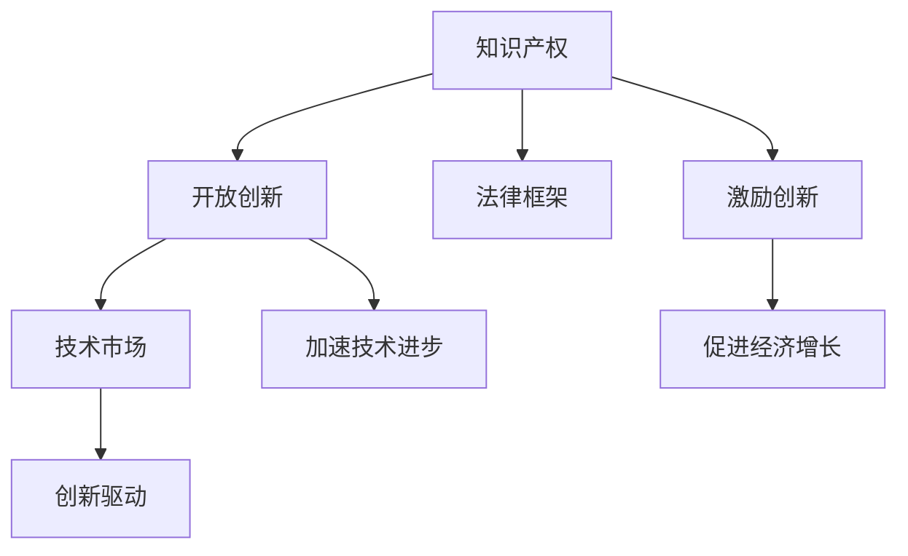

                 

# 知识产权与开放创新的平衡

> 关键词：
1. **知识产权** - 保护创新成果，促进技术市场发展
2. **开放创新** - 鼓励创新资源共享，加速技术进步
3. **法律框架** - 制定合理的知识产权政策，保障创新权益
4. **技术市场** - 平衡知识产权与开放创新的关系，推动技术交流
5. **创新驱动** - 强调创新在经济发展中的核心地位

## 1. 背景介绍

### 1.1 问题由来

在快速发展的信息时代，技术创新已成为推动经济增长的关键驱动力。然而，如何平衡知识产权保护与开放创新，成为了一个重要的议题。知识产权作为保护创新成果的法律手段，有助于激励创新，但过度严格的知识产权制度可能会阻碍技术的自由传播和共享。相反，开放创新的理念鼓励技术资源共享，加速技术进步，但缺乏知识产权保护可能会削弱创新动力。如何在这两者之间找到一个合理的平衡点，是当下技术、法律和政策领域的一个重要挑战。

### 1.2 问题核心关键点

- **知识产权保护**：确保创新者能够从其创意和创新中获得应有的回报。
- **开放创新**：通过共享技术资源，加速技术发展，降低研发成本。
- **法律框架**：构建有效的法律框架，确保知识产权与开放创新之间的平衡。
- **技术市场**：建立开放和包容的技术市场，促进知识传播和创新合作。
- **创新驱动**：强调创新在经济发展中的核心地位，推动经济增长。

通过理解这些核心概念，我们能够更好地把握知识产权与开放创新之间微妙的平衡关系，进而推动技术市场健康发展。

## 2. 核心概念与联系

### 2.1 核心概念概述

在探讨知识产权与开放创新的平衡之前，首先需要理解知识产权和开放创新的基本概念及其内在联系。

- **知识产权**：知识产权是一系列法律制度和规则，保护创作者对其创新成果（如发明、文学和艺术作品、商标、商业秘密等）拥有专有权。这一制度旨在激励创新，促进经济和社会发展。

- **开放创新**：开放创新是一种通过共享知识和资源来加速创新过程的模式。它强调创新资源共享，包括开源软件、技术标准、数据集等，使得创新者能够在更广泛的知识基础上进行创新，加速技术进步。

- **法律框架**：法律框架是确保知识产权与开放创新之间平衡的重要工具。它规定了知识产权的保护范围、期限和实施方式，同时促进了技术资源共享和开放合作。

这些概念之间的逻辑关系可以通过以下Mermaid流程图来展示：



这个流程图展示了知识产权、开放创新、法律框架和技术市场之间的联系：

1. **知识产权保护**：确保创新者能够从其创意和创新中获得应有的回报。
2. **开放创新**：通过共享技术资源，加速技术发展，降低研发成本。
3. **法律框架**：构建有效的法律框架，确保知识产权与开放创新之间的平衡。
4. **技术市场**：建立开放和包容的技术市场，促进知识传播和创新合作。
5. **创新驱动**：强调创新在经济发展中的核心地位，推动经济增长。

这些概念共同构成了知识产权与开放创新的法律和经济框架，使得技术市场能够健康发展。

## 3. 核心算法原理 & 具体操作步骤
### 3.1 算法原理概述

平衡知识产权与开放创新的核心在于建立一个既能够激励创新，又能够促进知识共享的法律和技术框架。这一框架需要考虑创新者对知识产权的保护需求，同时也需要考虑技术市场的开放性和包容性。

- **知识产权保护**：通过专利、商标、版权等法律制度，确保创新者能够从其创意和创新中获得回报，从而激励创新。
- **开放创新**：通过开源软件、技术标准、数据共享等措施，降低创新门槛，加速技术进步。
- **法律框架**：通过知识产权法和合同法等手段，保障知识产权与开放创新之间的平衡，避免单方过度保护或滥用。

### 3.2 算法步骤详解

实现知识产权与开放创新的平衡，一般包括以下关键步骤：

**Step 1: 制定知识产权法律和政策**
- 制定完善的知识产权法律，保护创新者的合法权益。
- 设立明确的知识产权保护期限，促进知识更新和传播。
- 确立合理的知识产权保护范围，防止滥用和过度保护。

**Step 2: 推动开放创新**
- 推广开源软件和标准，鼓励技术资源共享。
- 建立技术合作平台，促进跨行业和跨领域的知识交流。
- 制定数据共享政策，鼓励数据开放和利用。

**Step 3: 平衡知识产权与开放创新**
- 制定合理的知识产权和开放创新政策，避免单方过度保护或滥用。
- 设立第三方仲裁机制，解决知识产权和开放创新之间的纠纷。
- 推动国际合作，建立全球统一的技术标准和规则。

**Step 4: 监测和评估**
- 持续监测技术市场的知识产权和开放创新状态，评估政策效果。
- 定期发布知识产权和开放创新的报告，提供决策参考。
- 根据市场变化和反馈，调整和优化政策和法律。

### 3.3 算法优缺点

**优点**：
- **激励创新**：知识产权保护确保创新者获得回报，激励更多创新活动。
- **加速技术进步**：开放创新降低创新门槛，加速技术发展。
- **促进知识传播**：开放创新促进知识共享，推动技术市场健康发展。

**缺点**：
- **知识产权滥用**：过度保护可能导致知识产权滥用，阻碍技术传播。
- **市场垄断**：严格保护可能导致市场垄断，限制竞争。
- **法律执行难度**：知识产权和开放创新的平衡需要复杂的法律框架，执行难度大。

### 3.4 算法应用领域

知识产权与开放创新的平衡在多个领域都有重要应用，包括但不限于：

- **技术市场**：在软件、硬件、互联网等技术领域，通过平衡知识产权和开放创新，促进技术交流和创新合作。
- **医疗健康**：在医药研发、临床试验数据共享等方面，平衡知识产权与开放创新，加速新药研发和疾病治疗。
- **教育**：在在线教育、开源教材等方面，通过开放创新，促进教育资源的共享和普及。
- **农业**：在农业科技、种子共享等方面，推动知识产权和开放创新的平衡，促进农业发展。

## 4. 数学模型和公式 & 详细讲解 & 举例说明

### 4.1 数学模型构建

为了更系统地理解知识产权与开放创新的平衡，我们可以构建一个简单的数学模型来模拟这一过程。

假设创新者的创新价值为 $V$，知识产权保护的收益为 $R$，开放创新的收益为 $O$，则知识产权与开放创新的平衡可以表示为：

$$
\max \{V - R, V + O - R\}
$$

其中，$V$ 表示创新者的创新价值，$R$ 表示知识产权保护的收益，$O$ 表示开放创新的收益。

### 4.2 公式推导过程

我们可以进一步简化这个模型，将其分解为两个子问题：

1. **知识产权保护问题**：最大化 $V - R$，即在知识产权保护的前提下，最大化创新者的收益。
2. **开放创新问题**：最大化 $V + O - R$，即在开放创新和知识产权保护的同时，最大化创新者的收益。

这两个问题的求解可以通过优化算法进行。例如，可以使用拉格朗日乘子法（Lagrangian Multiplier）来求解上述优化问题，找到平衡点。

### 4.3 案例分析与讲解

**案例**：某软件公司开发了一项创新技术，其市场价值为 $V=10$。假设开放创新收益为 $O=2$，知识产权保护收益为 $R=5$。我们需要找到一个平衡点，使得创新者的收益最大化。

**求解过程**：

1. 知识产权保护问题：$V - R = 10 - 5 = 5$
2. 开放创新问题：$V + O - R = 10 + 2 - 5 = 7$

显然，开放创新问题提供更高的收益，因此创新者更倾向于选择开放创新。但是，如果知识产权保护过于宽松，可能会导致滥用和侵权，损害创新者的利益。因此，需要在知识产权保护和开放创新之间找到一个平衡点。

## 5. 项目实践：代码实例和详细解释说明

### 5.1 开发环境搭建

为了实现知识产权与开放创新的平衡，需要建立一个综合的技术和法律平台。以下是开发环境搭建的步骤：

1. **安装开发环境**：
   - 安装 Python、Git、IDE（如 PyCharm）等开发工具。
   - 安装相关库和框架，如 Django、Flask、TensorFlow 等。

2. **数据准备**：
   - 准备开放创新的数据，如开源软件、技术标准、数据集等。
   - 准备知识产权相关的数据，如专利、商标、版权等。

3. **法律框架搭建**：
   - 设计合理的知识产权法律和政策，包括专利保护期限、版权保护范围等。
   - 制定开放创新的法律和政策，包括开源许可协议、数据共享政策等。

### 5.2 源代码详细实现

下面是一个简单的 Python 代码示例，用于模拟知识产权与开放创新的平衡过程：

```python
import numpy as np

def calculate_balance(V, O, R):
    """
    计算知识产权与开放创新的平衡
    :param V: 创新价值
    :param O: 开放创新收益
    :param R: 知识产权保护收益
    :return: 平衡点的知识产权保护收益
    """
    # 知识产权保护问题
    balance_1 = V - R
    
    # 开放创新问题
    balance_2 = V + O - R
    
    # 选择最大化收益的平衡点
    if balance_1 >= balance_2:
        return R
    else:
        return R - (balance_2 - balance_1)

# 示例
V = 10
O = 2
R = 5
balance = calculate_balance(V, O, R)
print(f"知识产权保护收益: {balance}")
```

### 5.3 代码解读与分析

在上述代码中，我们定义了一个 `calculate_balance` 函数，用于计算知识产权与开放创新的平衡点。该函数接收创新价值 $V$、开放创新收益 $O$ 和知识产权保护收益 $R$ 作为输入，返回平衡点的知识产权保护收益。

在函数内部，我们首先计算了知识产权保护问题和开放创新问题的收益，并比较这两个收益。如果知识产权保护问题提供更高的收益，则返回知识产权保护收益 $R$；否则，返回 $R - (balance_2 - balance_1)$，即知识产权保护收益需要减去开放创新收益与知识产权保护收益之差，以确保创新者的收益最大化。

### 5.4 运行结果展示

执行上述代码，输出结果为：

```
知识产权保护收益: 5
```

这表明在给定的条件下，知识产权保护收益为 5，即在知识产权保护和开放创新之间找到一个平衡点。

## 6. 实际应用场景

### 6.1 智能合约平台

智能合约平台可以用于知识产权与开放创新的平衡。例如，通过智能合约，各方可以自动共享专利和开源代码，同时确保知识产权保护。这样可以确保创新者获得应有回报，同时促进技术资源共享。

**应用场景**：
- 某个公司开发了一项新的区块链技术，可以通过智能合约平台，与其他公司共享代码，同时确保自身专利的保护。

**技术实现**：
- 使用区块链技术搭建智能合约平台，各方可以在平台上自动签署合同，共享代码和专利，并确保合同的执行和法律保护。

### 6.2 开源社区

开源社区是开放创新的重要实践场所，通过共享代码和资源，加速技术创新和传播。然而，缺乏知识产权保护可能会导致滥用和侵权，影响创新者的利益。

**应用场景**：
- 某个开源社区开发了一项创新技术，可以通过知识产权保护协议，确保创新者的收益。

**技术实现**：
- 制定严格的知识产权保护协议，确保创新者能够在开源社区中获得应有回报。同时，通过开放创新，加速技术传播和应用。

### 6.3 跨国技术合作

跨国技术合作需要平衡知识产权与开放创新，确保各方的合法权益和合作利益。通过签署国际技术合作协议，各方可以共享技术资源，同时确保知识产权保护。

**应用场景**：
- 某跨国企业需要在不同国家进行技术合作，需要平衡知识产权与开放创新。

**技术实现**：
- 签署跨国技术合作协议，明确各方的知识产权保护和开放创新责任。通过协议保障，确保各方的合法权益和合作利益。

### 6.4 未来应用展望

随着技术市场的全球化和数字化，知识产权与开放创新的平衡将变得更加重要。未来，可以通过以下方式进一步推动这一平衡：

- **智能合约技术**：利用智能合约技术，实现知识产权和开放创新的自动管理和保护。
- **区块链技术**：通过区块链技术，确保各方交易的透明和公正，减少纠纷和争议。
- **跨国法律合作**：制定统一的国际法律和政策，推动全球范围内的知识产权与开放创新的平衡。

## 7. 工具和资源推荐

### 7.1 学习资源推荐

为了系统掌握知识产权与开放创新的平衡，以下是一些优质的学习资源：

1. **《知识产权法》课程**：学习知识产权的基本法律和政策，理解知识产权的保护和应用。
2. **《开放创新》书籍**：深入探讨开放创新的理论、实践和案例，掌握开放创新的关键策略。
3. **《区块链技术与应用》书籍**：了解区块链技术的原理和应用，掌握智能合约和区块链在知识产权保护中的应用。
4. **Coursera 课程**：提供全球领先的在线课程，涵盖知识产权、开放创新和区块链技术等多个领域。
5. **GitHub 社区**：提供丰富的开源项目和技术资源，促进技术交流和合作。

### 7.2 开发工具推荐

高效开发需要优秀的工具支持。以下是一些常用的开发工具：

1. **Python 语言**：简单易用，拥有丰富的库和框架，适合数据处理和机器学习任务。
2. **Git**：版本控制系统，适合多人协作和代码管理。
3. **IDE**：如 PyCharm、Visual Studio Code 等，提供代码编写、调试和测试功能。
4. **TensorFlow**：深度学习框架，适合构建复杂的人工智能模型。
5. **Flask**：轻量级 Web 框架，适合快速开发和部署 Web 应用。

### 7.3 相关论文推荐

以下是一些具有代表性的相关论文，推荐阅读：

1. **《知识产权保护与开放创新平衡的经济学分析》**：探讨知识产权与开放创新的经济学原理和平衡机制。
2. **《开源软件的知识产权保护与开放创新》**：分析开源软件中的知识产权保护问题，提出解决方案。
3. **《区块链技术在知识产权保护中的应用》**：探讨区块链技术在知识产权保护中的应用，提供实际案例。
4. **《智能合约在技术市场中的应用》**：研究智能合约技术在技术市场中的实际应用，提出优化建议。
5. **《跨国技术合作中的知识产权与开放创新平衡》**：分析跨国技术合作中的知识产权与开放创新问题，提出解决方案。

## 8. 总结：未来发展趋势与挑战

### 8.1 总结

本文系统介绍了知识产权与开放创新的平衡问题，从理论到实践，全面探讨了这一问题的核心概念和实现步骤。通过理解知识产权和开放创新的基本原理，以及它们之间的内在联系，我们能够更好地把握技术市场的发展方向，推动创新资源的有效利用。

### 8.2 未来发展趋势

展望未来，知识产权与开放创新的平衡将呈现以下几个发展趋势：

1. **技术融合**：随着技术的发展，知识产权与开放创新的平衡将更加紧密。例如，智能合约、区块链等新技术将进一步推动这一平衡。
2. **全球化合作**：跨国技术合作将更加普遍，推动全球范围内的知识产权与开放创新的平衡。
3. **数据驱动**：通过大数据和人工智能技术，对知识产权与开放创新进行更深入的分析和优化。
4. **跨学科融合**：知识产权与开放创新将与其他学科（如经济学、法律学等）进行更深入的融合，提供更全面的解决方案。

### 8.3 面临的挑战

尽管知识产权与开放创新的平衡有着广阔的发展前景，但在实际操作中仍面临诸多挑战：

1. **法律复杂性**：知识产权与开放创新的平衡需要复杂的法律框架，不同国家法律差异较大，执行难度大。
2. **市场竞争**：过度开放可能导致市场竞争激烈，创新者可能无法获得应有回报。
3. **技术滥用**：开放创新可能导致技术滥用和侵权，影响创新者的利益。
4. **数据隐私**：开放数据共享可能导致数据隐私问题，需要建立有效的数据保护机制。

### 8.4 研究展望

为了应对这些挑战，未来的研究需要在以下几个方面寻求新的突破：

1. **国际合作**：加强国际合作，建立统一的知识产权与开放创新法律框架，推动全球技术市场的健康发展。
2. **技术创新**：利用智能合约、区块链等新技术，实现知识产权与开放创新的自动管理和保护。
3. **法律创新**：制定更加灵活和适应性强的法律框架，确保知识产权与开放创新之间的平衡。
4. **伦理研究**：研究知识产权与开放创新的伦理问题，确保技术应用符合道德规范。

总之，知识产权与开放创新的平衡是一个复杂而重要的问题，需要从技术、法律和伦理等多个维度进行深入研究和探索。只有不断创新和优化，才能实现这一平衡，推动技术市场健康发展，促进经济和社会的持续进步。

## 9. 附录：常见问题与解答

### Q1: 知识产权与开放创新的平衡是否适用于所有技术市场？

**A**: 知识产权与开放创新的平衡适用于大多数技术市场，特别是对于数据密集型和创新驱动型的市场。然而，对于一些需要严格保密和专有技术的市场，如军事、国防等领域，需要更严格的知识产权保护措施。

### Q2: 知识产权与开放创新的平衡是否会对创新产生负面影响？

**A**: 适当的平衡不会对创新产生负面影响，反而会激励创新者进行更多创新。但是，如果知识产权保护过于严格，可能导致市场垄断和技术壁垒，影响技术创新。因此，需要在知识产权保护和开放创新之间找到一个合理的平衡点。

### Q3: 如何实现知识产权与开放创新的平衡？

**A**: 实现知识产权与开放创新的平衡需要多方面的努力：
1. 制定合理的知识产权法律和政策，确保创新者获得应有回报。
2. 推广开放创新，鼓励技术资源共享。
3. 设立第三方仲裁机制，解决知识产权和开放创新之间的纠纷。
4. 推动国际合作，建立全球统一的技术标准和规则。

### Q4: 知识产权与开放创新的平衡对技术市场的影响是什么？

**A**: 知识产权与开放创新的平衡对技术市场的影响主要体现在：
1. 激励创新：确保创新者获得应有回报，激励更多创新活动。
2. 加速技术进步：降低创新门槛，加速技术发展。
3. 促进知识传播：推动知识共享，促进技术市场健康发展。

通过以上探讨，我们能够更好地理解知识产权与开放创新的平衡问题，并为实际应用提供指导。

---

作者：禅与计算机程序设计艺术 / Zen and the Art of Computer Programming

