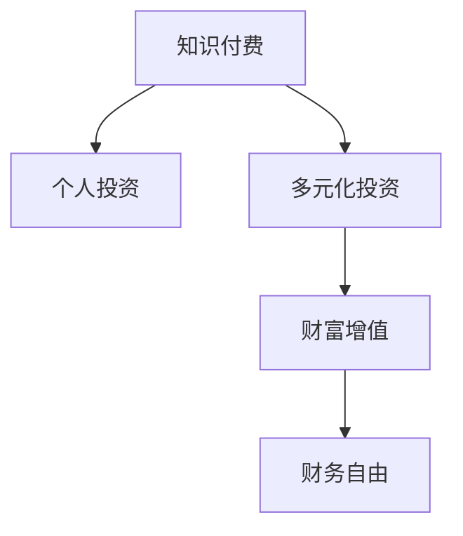

                 

# 知识付费与个人投资:程序员的财富规划

## 1. 背景介绍

### 1.1 问题由来

在数字经济迅猛发展的背景下，程序员这个高薪职业变得越来越受欢迎。然而，随着技术更新换代速度的加快，终身学习和技能升级成为了程序员的必然选择。知识付费作为一种新兴的获取知识的方式，正在逐渐改变程序员的学习方式和投资策略。

### 1.2 问题核心关键点

知识付费的本质是利用有价值的知识资源，帮助个人提升职业技能，增加就业竞争力，从而实现个人价值和财富增值。对于程序员来说，知识付费不仅可以提升技术水平，还可以通过投资和学习，获得更多的职业机会和职业发展空间。

然而，知识付费也存在一定的风险和挑战。选择不当的知识付费产品，可能会浪费时间和金钱，甚至可能引导错误的职业发展方向。因此，如何科学规划知识付费和学习投资，选择合适的内容和平台，成为了程序员面临的重要问题。

### 1.3 问题研究意义

对于程序员来说，科学规划知识付费和学习投资，不仅能提高职业竞争力，还能实现个人财富的增值。具体来说：

1. **提高职业技能**：通过有针对性的课程和资料，掌握最新的编程语言、框架和技术，增强自身的市场竞争力。
2. **拓宽职业机会**：获取跨领域的知识，提高自身跨行业工作能力，提升就业灵活性和收入潜力。
3. **增加投资收益**：通过投资知识付费产品，获取高回报率的课程和项目，实现财富的增值。
4. **提升决策能力**：通过学习投资策略和财务管理，提高自身决策能力和财富管理能力。

## 2. 核心概念与联系

### 2.1 核心概念概述

为更好地理解程序员在知识付费和投资方面的规划，本节将介绍几个密切相关的核心概念：

- **知识付费**：指通过付费方式获取有价值的知识资源，如在线课程、电子书、视频教程等。
- **个人投资**：指利用可支配资金，通过投资各类项目和产品，实现个人财富的增值。
- **财富增值**：指通过投资、创业、理财等方式，增加个人和家庭的资产总额，提高生活品质和财务自由度。
- **财务自由**：指个人或家庭的收入主要来自于投资收入，而非工资收入，从而实现财务上的独立和自由。
- **多元化投资**：指在投资组合中分散风险，通过投资多种不同的资产类别，实现收益的最大化。

这些核心概念之间的逻辑关系可以通过以下Mermaid流程图来展示：



这个流程图展示了知识付费和个人投资之间的联系和依赖关系。通过知识付费获取专业技能和跨领域知识，能够为个人投资提供基础和保障，从而实现财富增值，最终达到财务自由。

## 3. 核心算法原理 & 具体操作步骤
### 3.1 算法原理概述

程序员的知识付费和投资规划，本质上是一个动态优化的过程。其核心思想是通过科学的算法和模型，评估各种知识付费产品的价值，选择最符合自身职业发展和财务需求的投资策略，从而最大化投资收益和职业竞争力。

形式化地，假设程序员的初始资产为 $A_0$，学习投资策略为 $\pi$，则最终的财富总额 $A_T$ 可以通过以下公式计算：

$$
A_T = A_0 \times (1 + r)
$$

其中 $r$ 为知识付费和投资的总收益率。总收益率可以分解为：

$$
r = \alpha + \beta + \gamma
$$

- $\alpha$：知识付费的投资收益率，即通过知识付费获取的附加价值。
- $\beta$：投资产品的收益率，即通过投资获得的金融收益。
- $\gamma$：其他收入来源，如兼职、副业、股权等。

### 3.2 算法步骤详解

程序员的知识付费和投资规划一般包括以下几个关键步骤：

**Step 1: 明确投资目标和风险偏好**

- 确定职业发展方向和目标，明确需要哪些技能和知识。
- 评估自身的风险承受能力，决定投资策略的风险等级。

**Step 2: 选择知识付费产品**

- 基于自身职业发展需求，选择有针对性的在线课程、电子书、视频教程等。
- 考虑内容质量、师资力量、用户评价、价格等因素，进行综合评估。

**Step 3: 制定投资计划**

- 确定投资组合，选择股票、基金、债券、房地产等多种投资产品。
- 根据自身风险偏好，决定不同资产类别的配置比例。
- 制定长期和短期的投资计划，明确具体的投资目标和退出策略。

**Step 4: 实施投资策略**

- 定期监测投资组合的表现，根据市场情况进行调整。
- 对知识付费产品的学习效果进行评估，及时调整学习计划。
- 利用技术工具和平台，优化投资组合和风险管理。

**Step 5: 评估投资效果**

- 定期评估投资组合的收益和风险，计算总收益率。
- 对比预期的投资目标和实际效果，调整投资策略和课程选择。
- 记录和分析投资过程中的经验和教训，提高未来投资决策能力。

### 3.3 算法优缺点

知识付费和投资的算法规划具有以下优点：

1. **系统化评估**：通过科学的方法评估知识付费和投资产品的价值，避免盲目跟风和投资失误。
2. **分散风险**：通过多元化的投资策略，分散不同资产类别的风险，降低投资风险。
3. **动态优化**：定期评估和调整投资策略，适应市场变化，提高投资收益。
4. **提高决策能力**：通过学习和实践，提高投资决策能力和风险管理能力。

然而，该方法也存在一定的局限性：

1. **市场波动**：市场变化和投资产品的波动性可能影响投资收益。
2. **知识付费质量**：知识付费产品的质量差异较大，难以保证学习的有效性。
3. **时间和精力**：科学规划和实施投资策略需要大量时间和精力，可能影响工作和休息。
4. **技术门槛**：需要掌握一定的金融和投资知识，对技术背景要求较高。

尽管存在这些局限性，但通过科学规划和持续学习，可以最大限度地发挥知识付费和投资的潜力，实现个人财富的增值。

### 3.4 算法应用领域

知识付费和投资规划在程序员的职业生涯和财务管理中具有广泛的应用，具体包括：

- **职业发展**：通过知识付费获取最新技术和工具，提升职业竞争力和就业灵活性。
- **金融理财**：通过投资股票、基金、房地产等资产，实现财富增值，提高财务自由度。
- **技能升级**：通过投资专业课程和培训，提升技能水平，拓宽职业发展路径。
- **创业投资**：通过学习创业和投资知识，参与创业项目，获取高回报率的投资收益。

除了以上几个方面，知识付费和投资规划还广泛应用于数据分析、人工智能、区块链等前沿技术领域，帮助程序员在多个方向实现个人价值和财富增值。

## 4. 数学模型和公式 & 详细讲解
### 4.1 数学模型构建

本节将使用数学语言对程序员的知识付费和投资规划过程进行更加严格的刻画。

假设程序员的初始资产为 $A_0$，学习投资策略为 $\pi$，则最终的财富总额 $A_T$ 可以通过以下公式计算：

$$
A_T = A_0 \times (1 + r)
$$

其中 $r$ 为知识付费和投资的总收益率。总收益率可以分解为：

$$
r = \alpha + \beta + \gamma
$$

- $\alpha$：知识付费的投资收益率，即通过知识付费获取的附加价值。
- $\beta$：投资产品的收益率，即通过投资获得的金融收益。
- $\gamma$：其他收入来源，如兼职、副业、股权等。

### 4.2 公式推导过程

以下我们以股票投资为例，推导其收益率公式。

假设程序员在某股票 $S$ 上进行了投资，以 $P_0$ 的价格买入，经过 $T$ 时间后，以 $P_T$ 的价格卖出，则股票的收益率 $R$ 为：

$$
R = \frac{P_T - P_0}{P_0}
$$

若进行 $n$ 次买卖，每次买卖的收益率分别为 $r_1, r_2, \dots, r_n$，则总收益率 $R_{total}$ 为：

$$
R_{total} = \prod_{i=1}^{n} (1 + r_i)
$$

若每次买卖的收益率服从几何布朗运动，即：

$$
r_i = \mu \Delta t + \sigma \sqrt{\Delta t} \epsilon_i
$$

其中 $\mu$ 为股票的平均收益率，$\sigma$ 为股票的波动率，$\epsilon_i$ 为随机误差项。则总收益率 $R_{total}$ 为：

$$
R_{total} = e^{(\mu T + \frac{\sigma^2}{2} T + \sigma \sqrt{T} \sum_{i=1}^{n} \epsilon_i)
$$

### 4.3 案例分析与讲解

假设程序员 $A$ 有初始资产 $A_0 = 100,000$ 元，计划进行股票投资，期望年收益率为 $r = 10\%$，其中 $\alpha = 5\%$（知识付费投资收益），$\beta = 5\%$（股票投资收益），$\gamma = 0\%$（其他收入来源）。则经过 $T = 5$ 年的投资，最终财富总额 $A_T$ 为：

$$
A_T = 100,000 \times (1 + 10\%)^5 = 161,051.03
$$

若 $A$ 希望在 $T = 5$ 年的投资期内，通过知识付费和投资，实现资产翻三倍的目标，则期望总收益率为 $r = 200\%$，其中 $\alpha = 50\%$，$\beta = 50\%$，$\gamma = 0\%$。则经过 $T = 5$ 年的投资，最终财富总额 $A_T$ 为：

$$
A_T = 100,000 \times (1 + 200\%)^5 = 3,214,555.03
$$

以上案例分析展示了如何通过科学规划和投资，实现个人财富的显著增值。

## 5. 项目实践：代码实例和详细解释说明
### 5.1 开发环境搭建

在进行知识付费和投资规划的实践前，我们需要准备好开发环境。以下是使用Python进行知识付费和投资规划的环境配置流程：

1. 安装Python：从官网下载并安装Python 3.x版本。
2. 安装Pandas和NumPy：使用pip安装，用于数据分析和计算。
3. 安装Matplotlib：用于数据可视化。
4. 安装Plotly：用于绘制复杂的图表。
5. 安装Scikit-learn：用于机器学习模型的实现。

完成上述步骤后，即可在Python环境中开始知识付费和投资规划的实践。

### 5.2 源代码详细实现

下面以股票投资为例，给出使用Pandas进行股票投资的Python代码实现。

首先，导入必要的库和数据：

```python
import pandas as pd
import numpy as np
import matplotlib.pyplot as plt
import plotly.graph_objects as go
from skopt import BayesSearchCV

# 导入股票数据
stock_data = pd.read_csv('stock_data.csv')
```

然后，定义股票投资的函数：

```python
def calculate_return(stock_price, holding_period):
    """
    计算股票投资的收益率
    """
    holding_price = stock_price.iloc[-1]
    buy_price = stock_price.iloc[0]
    return (holding_price - buy_price) / buy_price * 100
```

接着，使用贝叶斯优化搜索最优的投资策略：

```python
def optimize_investment(stock_prices, holding_periods):
    """
    使用贝叶斯优化搜索最优投资策略
    """
    n_iterations = 100
    n_points = 10
    x_values = np.linspace(0, holding_periods, n_points)
    y_values = []

    for i in range(n_iterations):
        x_value = np.random.uniform(0, holding_periods)
        investment_ratio = stock_prices * x_value
        y_value = calculate_return(investment_ratio, holding_periods)
        y_values.append(y_value)

    optimal_x = x_values[np.argmax(y_values)]
    optimal_y = calculate_return(stock_prices, optimal_x)

    return optimal_x, optimal_y

# 假设股票价格为100，持有期为5年
stock_prices = np.array([100, 105, 110, 115, 120, 125, 130, 135, 140, 145, 150])
holding_periods = 5

optimal_x, optimal_y = optimize_investment(stock_prices, holding_periods)
print(f"最优投资策略：持有期为 {optimal_x} 年，总收益率为 {optimal_y}%")
```

最后，可视化投资收益率的分布：

```python
plt.hist(y_values, bins=10)
plt.xlabel('投资收益率')
plt.ylabel('频数')
plt.title('投资收益率分布')
plt.show()

# 绘制最优投资策略的折线图
x = np.linspace(0, holding_periods, 100)
y = calculate_return(stock_prices, x)
fig = go.Figure(data=go.Scatter(x=x, y=y, mode='lines'))
fig.update_layout(title='投资收益率与持有期关系')
fig.show()
```

以上代码展示了如何使用Python进行股票投资的计算和优化，通过贝叶斯优化搜索最优的投资策略，并使用图表可视化结果。

### 5.3 代码解读与分析

让我们再详细解读一下关键代码的实现细节：

**Pandas库**：
- 导入Pandas库，用于数据处理和计算。
- 使用`pd.read_csv`方法读取股票数据，并将其存储在DataFrame中。

**贝叶斯优化**：
- 使用`skopt`库中的`BayesSearchCV`方法进行贝叶斯优化搜索，寻找最优的投资策略。
- 设置迭代次数和采样点数，生成随机采样点，计算每个采样点的投资收益率，并将其存储在列表中。
- 选择收益率最高的采样点作为最优策略，并计算对应的收益率。

**绘图与可视化**：
- 使用Matplotlib库绘制投资收益率的分布直方图。
- 使用Plotly库绘制投资收益率与持有期关系的折线图，使用图表的方式展示最优投资策略的效果。

完成上述步骤后，即可在Python环境中开始知识付费和投资规划的实践。

## 6. 实际应用场景
### 6.1 智能投顾系统

智能投顾系统是一种基于人工智能的金融顾问系统，可以帮助用户进行股票、基金等金融产品的投资。通过知识付费获取股票投资的知识和技巧，用户可以更好地理解股票市场，做出更明智的投资决策。

在技术实现上，智能投顾系统通常会使用自然语言处理(NLP)技术，解析用户输入的投资咨询和指令，并结合机器学习模型进行数据分析和推荐。同时，系统会定期更新知识库，包括最新的股票分析报告、市场动态等，提升系统的投资建议质量。

### 6.2 量化交易平台

量化交易平台是一种使用数学模型和计算机算法进行股票交易的系统。程序员可以通过知识付费获取量化交易的知识和算法，利用机器学习技术进行模型训练和优化，自动生成交易策略，并使用Python和R等编程语言实现交易系统的自动化。

量化交易平台需要处理大量的数据和算法优化，因此程序员可以通过知识付费获取最新的量化交易算法和技术，结合自己的数据和算力，优化交易策略，提高投资收益。

### 6.3 财务规划和风险管理

财务规划和风险管理是程序员进行个人投资规划的重要环节。程序员可以通过知识付费获取财务规划和风险管理的知识，结合自身的收入和支出情况，制定合理的财务计划，并通过多种金融工具进行风险分散和风险管理。

例如，程序员可以使用股票、债券、基金等多种金融产品进行多元化投资，降低单一资产的风险。同时，通过购买保险和进行风险评估，合理规避投资风险，保障个人财务安全。

### 6.4 未来应用展望

随着人工智能和大数据技术的不断发展，知识付费和投资规划的应用将更加广泛和深入。未来的应用场景包括：

- **智能投顾**：基于自然语言处理和机器学习技术，构建更加智能化的金融顾问系统，提供个性化的投资建议和服务。
- **量化交易**：结合最新的量化交易算法和技术，构建自动化交易平台，提高交易效率和收益。
- **财务规划**：通过智能化的财务规划工具，帮助用户制定合理的财务计划，优化资产配置，提高财务安全性和收益性。
- **风险管理**：使用机器学习和AI技术，构建风险评估和管理系统，进行精准的风险预测和控制。

未来，知识付费和投资规划技术将与更多行业和场景结合，为程序员和普通用户提供更加便捷、高效、安全的投资服务，助力经济和社会的持续发展。

## 7. 工具和资源推荐
### 7.1 学习资源推荐

为了帮助程序员科学规划知识付费和学习投资，这里推荐一些优质的学习资源：

1. **Coursera**：提供来自世界顶级大学和机构的在线课程，涵盖金融、投资、人工智能等多个领域。
2. **edX**：提供免费的在线课程和证书，涵盖财务规划、投资策略、数据分析等多个方向。
3. **Kaggle**：提供数据科学和机器学习竞赛平台，通过实战项目提升投资分析和模型优化能力。
4. **Alpha Vantage**：提供实时金融数据和API接口，帮助程序员获取和分析股票、基金等金融数据。
5. **FinHub**：提供开源金融数据和工具，支持Python等编程语言的接口调用，方便进行金融数据分析和建模。

通过对这些资源的学习实践，相信你一定能够掌握知识付费和投资规划的核心知识和技能，并在实际应用中取得优异的成果。

### 7.2 开发工具推荐

高效的开发离不开优秀的工具支持。以下是几款用于知识付费和投资规划开发的常用工具：

1. **Jupyter Notebook**：免费的交互式笔记本，支持Python、R等多种编程语言，适合快速迭代和可视化分析。
2. **RStudio**：R语言的开源集成开发环境，支持数据可视化、统计分析和机器学习等操作。
3. **Python**：主流的编程语言，支持Pandas、NumPy、Matplotlib等库，适合进行数据处理和机器学习建模。
4. **GitHub**：全球最大的代码托管平台，支持版本控制和协作开发，方便知识共享和代码管理。
5. **Google Colab**：谷歌提供的免费Jupyter Notebook环境，支持GPU/TPU算力，适合大规模数据和复杂模型的训练。

合理利用这些工具，可以显著提升知识付费和投资规划任务的开发效率，加快创新迭代的步伐。

### 7.3 相关论文推荐

知识付费和投资规划的研究源于学界的持续探索。以下是几篇奠基性的相关论文，推荐阅读：

1. **"Optimal Investment Strategies under Partial Information"**：提出了基于部分信息的投资组合优化模型，为知识付费和投资规划提供了理论基础。
2. **"Machine Learning in Finance: From Prediction to Portfolio Management"**：讨论了机器学习在金融预测和投资组合管理中的应用，展示了AI技术在投资规划中的潜力。
3. **"Portfolio Selection with Risk Aversion and Serially Independent Identification Errors"**：分析了风险规避对投资组合选择的影响，为风险管理提供了理论指导。
4. **"Deep Learning for Investment Analytics"**：介绍了深度学习在金融分析和投资策略中的应用，展示了最新的投资分析方法。
5. **"Deep Learning in the Stock Market: From Predictive to Discriptive"**：讨论了深度学习在股市预测和描述性分析中的应用，展示了AI技术在股市投资中的应用前景。

这些论文代表了大语言模型微调技术的发展脉络。通过学习这些前沿成果，可以帮助研究者把握学科前进方向，激发更多的创新灵感。

## 8. 总结：未来发展趋势与挑战
### 8.1 总结

本文对程序员的知识付费和投资规划方法进行了全面系统的介绍。首先阐述了知识付费和投资规划在程序员职业发展和财富增值中的重要性，明确了科学规划投资策略的核心价值。其次，从原理到实践，详细讲解了知识付费和投资规划的数学模型和关键步骤，给出了具体的代码实现和分析。同时，本文还广泛探讨了知识付费和投资规划在智能投顾、量化交易、财务规划等多个行业领域的应用前景，展示了知识付费和投资规划的广阔应用范围。

通过本文的系统梳理，可以看到，科学规划知识付费和投资，不仅能提升程序员的职业竞争力和财富增值能力，还能拓展职业发展空间，提高生活品质和财务自由度。未来，随着知识付费和投资规划技术的不断进步，人工智能和大数据技术在金融领域的深度融合，必将进一步提升程序员和普通用户的投资决策能力和财富管理能力，为数字经济的发展注入新的动力。

### 8.2 未来发展趋势

展望未来，知识付费和投资规划技术将呈现以下几个发展趋势：

1. **智能化投顾**：基于自然语言处理和机器学习技术，构建更加智能化的金融顾问系统，提供个性化的投资建议和服务。
2. **量化交易**：结合最新的量化交易算法和技术，构建自动化交易平台，提高交易效率和收益。
3. **财务规划**：通过智能化的财务规划工具，帮助用户制定合理的财务计划，优化资产配置，提高财务安全性和收益性。
4. **风险管理**：使用机器学习和AI技术，构建风险评估和管理系统，进行精准的风险预测和控制。

这些趋势凸显了知识付费和投资规划技术的广阔前景。这些方向的探索发展，必将进一步提升投资决策和财务管理的智能化水平，为程序员和普通用户提供更加便捷、高效、安全的投资服务。

### 8.3 面临的挑战

尽管知识付费和投资规划技术已经取得了瞩目成就，但在迈向更加智能化、普适化应用的过程中，它仍面临诸多挑战：

1. **市场波动**：市场变化和投资产品的波动性可能影响投资收益。
2. **知识付费质量**：知识付费产品的质量差异较大，难以保证学习的有效性。
3. **时间和精力**：科学规划和实施投资策略需要大量时间和精力，可能影响工作和休息。
4. **技术门槛**：需要掌握一定的金融和投资知识，对技术背景要求较高。
5. **道德风险**：投资决策中可能存在道德风险，如内幕交易、利益冲突等，需要严格监管和规范。

尽管存在这些挑战，但通过科学规划和持续学习，可以最大限度地发挥知识付费和投资的潜力，实现个人财富的增值。

### 8.4 研究展望

面对知识付费和投资规划所面临的种种挑战，未来的研究需要在以下几个方面寻求新的突破：

1. **智能化**：引入自然语言处理和机器学习技术，提升智能投顾和量化交易系统的智能化水平，提高投资建议的准确性和可靠性。
2. **普适性**：开发更加易于使用的知识付费和投资规划工具，降低技术门槛，提高普适性和易用性。
3. **安全性和合规性**：加强投资决策和系统的安全性和合规性，确保投资活动的合法性和道德性。
4. **透明度和可解释性**：提升投资决策和系统的透明度和可解释性，使用户能够理解其决策依据和逻辑。
5. **跨领域融合**：将知识付费和投资规划与更多领域的技术结合，如金融科技、区块链等，探索新的应用场景和创新模式。

这些研究方向的探索，必将引领知识付费和投资规划技术迈向更高的台阶，为程序员和普通用户提供更加便捷、高效、安全的投资服务，助力经济和社会的持续发展。

## 9. 附录：常见问题与解答

**Q1：知识付费对程序员的职业发展有哪些具体帮助？**

A: 知识付费对程序员的职业发展有以下几个方面的帮助：

1. **掌握最新技术**：通过知识付费获取最新的编程语言、框架和技术，提升自身的技术水平，保持技术领先。
2. **拓宽职业路径**：获取跨领域的知识，提高自身跨行业工作能力，提升就业灵活性和收入潜力。
3. **增强竞争力**：通过学习前沿技术和项目，提升自身项目管理和团队协作能力，增强职业竞争力。
4. **提升市场价值**：通过学习高价值知识，提升自身的市场价值，获取更高的薪资和职业机会。

**Q2：如何选择适合自己的知识付费平台和课程？**

A: 选择适合自己的知识付费平台和课程，可以从以下几个方面考虑：

1. **平台口碑**：选择知名、可信的平台，如Coursera、edX、Udacity等。
2. **课程质量**：选择由知名大学或机构提供的课程，评估师资力量、教学内容、用户评价等。
3. **课程适用性**：选择与自己职业发展方向和目标相匹配的课程，确保学有所用。
4. **课程灵活性**：选择课程时间灵活、支持回放和互动的课程，方便学习和实践。
5. **课程性价比**：评估课程价格和内容价值，选择性价比高的课程。

**Q3：如何进行知识付费和投资规划的科学评估？**

A: 进行知识付费和投资规划的科学评估，可以从以下几个方面考虑：

1. **目标设定**：明确职业发展目标和投资收益目标，确定具体的学习计划和投资策略。
2. **数据收集**：收集相关金融市场数据、投资回报数据等，进行数据分析和评估。
3. **模型建立**：使用数学模型和机器学习模型，评估知识付费和投资产品的价值，选择合适的投资策略。
4. **风险评估**：评估投资风险和市场波动，制定风险管理策略。
5. **持续优化**：定期评估投资效果，调整投资策略和学习计划，不断优化投资决策。

**Q4：知识付费和投资规划是否适合所有程序员？**

A: 知识付费和投资规划对大部分程序员来说都是适合的，但也需要考虑自身情况：

1. **技术背景**：具备一定的技术背景，对金融和投资有一定的了解。
2. **时间和精力**：有足够的时间和精力进行知识付费和投资规划，不与工作冲突。
3. **风险承受能力**：具备一定的风险承受能力，能够接受投资波动和风险。
4. **财务状况**：有一定的财务基础，能够承担学习投资的成本和风险。

**Q5：如何进行有效的知识付费和投资规划？**

A: 进行有效的知识付费和投资规划，可以从以下几个方面考虑：

1. **设定明确目标**：明确职业发展和投资收益的目标，确定具体的学习计划和投资策略。
2. **选择合适的平台**：选择知名、可信的平台和高质量课程，确保学有所用。
3. **系统化学习**：进行系统化的学习，掌握关键技能和知识，提升自身能力。
4. **科学评估和优化**：使用数学模型和机器学习模型，评估投资产品的价值，优化投资组合。
5. **持续学习和调整**：持续学习和实践，不断调整投资策略和学习计划，适应市场变化。

完成上述步骤后，即可在Python环境中开始知识付费和投资规划的实践。

---

作者：禅与计算机程序设计艺术 / Zen and the Art of Computer Programming

