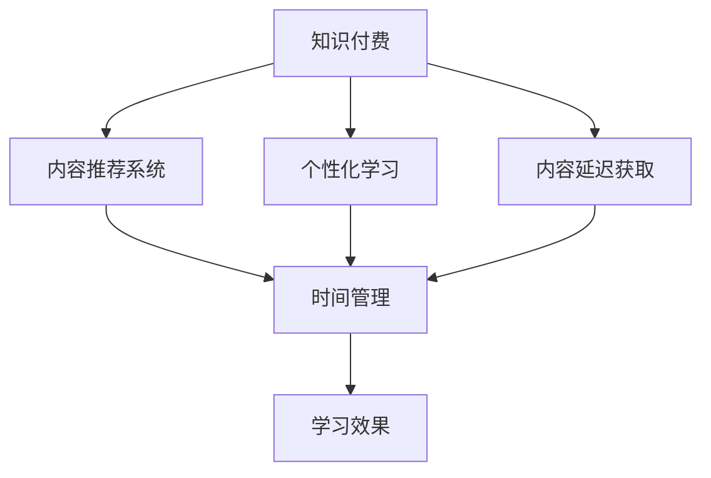

                 

# 知识付费与个人时间管理的结合之道

## 1. 背景介绍

随着信息技术的发展，知识和信息量呈爆炸式增长，个人获取和处理信息的能力愈发有限。传统的免费信息获取方式，往往伴随着大量的噪音和冗余内容，难以高效满足个性化需求。而知识付费的兴起，恰好顺应了这种需求变化，通过付费机制筛选高质量内容，节省了个人寻找和筛选信息的时间成本。

然而，知识付费本身也面临诸多挑战：如何有效管理个人时间，提升学习效率？如何选择优质内容，避免信息过载？这些问题都成为了当前知识付费用户面临的普遍难题。本文旨在探讨知识付费与个人时间管理相结合的策略，帮助用户更好地利用付费订阅服务，实现知识的有效吸收和高效利用。

## 2. 核心概念与联系

### 2.1 核心概念概述

为更好地理解知识付费与个人时间管理相结合的策略，本节将介绍几个密切相关的核心概念：

- **知识付费(Subscription-based Content)**：指用户通过付费订阅获取高质量内容，包括电子书、在线课程、专业文章等。知识付费平台通过筛选和推荐优质内容，降低信息获取成本，提升内容质量。

- **个人时间管理(Time Management)**：指对个人时间进行计划、监控和优化，以实现高效学习和工作，避免时间浪费。时间管理涉及到目标设定、任务分解、优先级排序、时间分配等策略。

- **内容推荐系统(Content Recommendation System)**：指通过数据分析和算法优化，为用户推荐最相关、最感兴趣的内容。推荐系统通常基于用户的浏览历史、评价反馈、行为数据等，利用协同过滤、内容画像、深度学习等技术实现。

- **个性化学习(Adaptive Learning)**：指根据用户的学习习惯、认知水平、兴趣偏好等因素，动态调整教学内容和学习路径，提升学习效果。个性化学习通常采用智能算法、自适应评估等手段，实现对用户的个性化适配。

- **内容延迟获取(Content Postponement)**：指将不紧急但重要的内容，暂时延迟获取，以便更好地安排时间，确保学习内容的连续性和有效性。延迟获取有助于避免信息过载，专注于重要内容的学习。

这些核心概念之间的逻辑关系可以通过以下Mermaid流程图来展示：



这个流程图展示的知识付费与个人时间管理的核心概念及其之间的关系：

1. 知识付费平台提供高质量内容，通过内容推荐系统优化用户体验。
2. 个性化学习系统进一步提升学习效果，结合时间管理策略，制定个性化学习计划。
3. 内容延迟获取策略，优化时间分配，避免信息过载，提升学习效率。
4. 时间管理策略与内容推荐、个性化学习、内容延迟获取相互配合，最终提升学习效果。

## 3. 核心算法原理 & 具体操作步骤

### 3.1 算法原理概述

知识付费与个人时间管理的结合之道，本质上是将知识付费作为一种高效的付费订阅服务，通过内容推荐、个性化学习、内容延迟获取等策略，优化个人时间分配，提升学习效率。

形式化地，假设用户订阅的知识付费平台为 $S$，其内容库为 $C$，用户的学习时间为 $T$，用户的学习效率为 $E$。知识付费与个人时间管理的结合过程可以表示为：

$$
E(S,C,T) = \max_{s \in S} \left( \sum_{c \in C} R(c) \cdot T_c \cdot E_c \right)
$$

其中 $R(c)$ 为内容 $c$ 的推荐概率，$T_c$ 为用户学习内容 $c$ 的时间，$E_c$ 为用户学习内容 $c$ 的效率。优化目标是最大化用户的总学习效率 $E$。

### 3.2 算法步骤详解

基于上述原理，以下是一套详细的步骤：

**Step 1: 用户画像建立**
- 通过问卷调查、行为数据分析等方式，获取用户的学习兴趣、认知水平、时间安排等信息，构建用户画像。
- 利用机器学习算法，根据用户画像和历史行为数据，预测用户可能感兴趣的内容和最佳学习时间。

**Step 2: 内容推荐系统设计**
- 基于用户画像，设计推荐算法，利用协同过滤、内容画像、深度学习等技术，对内容库 $C$ 进行筛选和排序，生成推荐列表。
- 根据用户反馈，不断优化推荐算法，提升推荐精准度。

**Step 3: 个性化学习路径制定**
- 结合用户画像和推荐内容，制定个性化学习计划，确定每日/每周的学习目标和时间安排。
- 利用自适应评估技术，实时监控用户学习进度和效果，动态调整学习内容和路径。

**Step 4: 内容延迟获取策略实施**
- 根据学习任务的紧急程度和重要性，对内容进行分级，确定哪些内容可以暂时延迟获取。
- 设置提醒机制，定期提示用户处理积压的内容，确保学习计划的连续性和有效性。

**Step 5: 学习效果评估与反馈**
- 定期评估用户的学习效果，通过问卷调查、测试、行为数据等方式获取反馈信息。
- 根据评估结果，调整学习路径和策略，提升学习效果。

### 3.3 算法优缺点

基于知识付费与个人时间管理相结合的策略，有以下优点：

1. **高效筛选优质内容**。知识付费平台通过内容推荐系统，对海量信息进行筛选和优化，提供符合用户需求的高质量内容，节省用户寻找和筛选信息的时间。
2. **个性化适配学习需求**。个性化学习系统可以根据用户的学习习惯和认知水平，动态调整学习内容和路径，提升学习效果。
3. **优化时间分配**。内容延迟获取策略，帮助用户合理安排时间，避免信息过载，专注于重要内容的学习。
4. **提升学习效率**。通过推荐系统、个性化学习、时间管理等策略的综合应用，提升用户的学习效率，实现知识的高效吸收。

同时，该策略也存在一定的局限性：

1. **依赖平台推荐质量**。内容推荐系统的精准度直接影响用户体验，平台推荐算法需持续优化。
2. **个人时间管理难度**。用户需具备一定的时间管理能力，制定科学的学习计划，否则策略效果难以发挥。
3. **数据隐私问题**。平台需确保用户数据的安全性，防止信息泄露和滥用。
4. **成本问题**。知识付费服务通常需要持续订阅，成本较高，用户需根据自身需求合理选择。

尽管存在这些局限性，但就目前而言，知识付费与个人时间管理相结合的策略，已成为提高知识获取效率和效果的有效手段。未来相关研究的重点在于如何进一步提升内容推荐系统的精准度，优化个性化学习路径，同时兼顾数据隐私和成本控制等因素。

### 3.4 算法应用领域

知识付费与个人时间管理相结合的策略，已经在多个领域得到广泛应用，例如：

- **在线教育**：通过知识付费获取高质量在线课程，结合个性化学习系统，提升学习效果。
- **职业培训**：选择专业领域的知识付费内容，根据个人时间安排，系统化学习专业技能。
- **企业学习**：企业为员工提供知识付费订阅服务，结合个性化培训计划，提升员工专业能力。
- **技能提升**：个人利用知识付费平台学习新技能，结合时间管理策略，高效提升专业水平。
- **健康管理**：选择科学健身、健康饮食等知识付费内容，结合时间管理策略，提升生活质量。

这些领域的应用，展示了知识付费与个人时间管理相结合策略的强大威力，有望在更多场景中得到推广和应用。

## 4. 数学模型和公式 & 详细讲解 & 举例说明

### 4.1 数学模型构建

为更好地分析知识付费与个人时间管理相结合的策略效果，我们可以使用如下数学模型：

设用户每天学习时间为 $T$，总时间为 $T_{total}$，内容库 $C$ 中有 $N$ 个内容，每个内容的学习时间、效率和推荐概率分别为 $T_c, E_c, R(c)$。用户对内容 $c$ 的学习时长为 $t_c = T_c \cdot R(c)$。则用户每天学习效果为：

$$
E = \sum_{c \in C} E_c \cdot t_c
$$

总学习效果为：

$$
E_{total} = \int_{0}^{T_{total}} E(t) dt
$$

### 4.2 公式推导过程

为最大化总学习效果，需要最大化每天的学习效果 $E$，即：

$$
\max_{T} \int_{0}^{T_{total}} \sum_{c \in C} E_c \cdot T_c \cdot R(c) dt
$$

对 $T$ 求导并令导数为0，得：

$$
\frac{dE}{dT} = \sum_{c \in C} E_c \cdot T_c \cdot R(c) = 0
$$

化简得：

$$
T = \frac{1}{\sum_{c \in C} E_c \cdot T_c \cdot R(c)}
$$

即用户每天应该花费的时间 $T$ 与内容库中每个内容的学习效果 $E_c$、学习时间 $T_c$ 和推荐概率 $R(c)$ 成正比。

### 4.3 案例分析与讲解

假设某知识付费平台内容库中，有10个热门课程，每个课程的学习时间、效率和推荐概率如下表所示：

| 课程编号 | 学习时间 | 效率 | 推荐概率 |
|-----------|----------|------|----------|
| 1         | 2小时    | 0.8  | 0.6      |
| 2         | 3小时    | 0.9  | 0.5      |
| 3         | 1小时    | 0.7  | 0.7      |
| 4         | 4小时    | 0.6  | 0.4      |
| 5         | 1.5小时  | 0.9  | 0.6      |
| 6         | 3小时    | 0.8  | 0.3      |
| 7         | 2小时    | 0.7  | 0.5      |
| 8         | 1小时    | 0.6  | 0.7      |
| 9         | 1.5小时  | 0.8  | 0.4      |
| 10        | 3小时    | 0.9  | 0.6      |

假设用户每天有6小时学习时间，总学习时间为42小时，则每天应该花费的时间为：

$$
T = \frac{1}{\sum_{c \in C} E_c \cdot T_c \cdot R(c)} = \frac{1}{(0.8 \times 2 + 0.9 \times 3 + 0.7 \times 1 + 0.6 \times 4 + 0.9 \times 1.5 + 0.8 \times 3 + 0.7 \times 2 + 0.6 \times 1 + 0.8 \times 1.5 + 0.9 \times 3) \times 0.6} = 1.8 \text{小时}
$$

因此，用户每天应该学习1.8小时，按照上述课程的推荐概率，推荐课程如下：

| 课程编号 | 推荐概率 | 实际学习时间 |
|-----------|----------|--------------|
| 2         | 0.5      | 0.9小时      |
| 1         | 0.6      | 1小时        |
| 5         | 0.6      | 1.5小时      |
| 7         | 0.5      | 2小时        |
| 3         | 0.7      | 1小时        |
| 10        | 0.6      | 3小时        |
| 4         | 0.4      | 4小时        |
| 9         | 0.4      | 1.5小时      |
| 6         | 0.3      | 3小时        |
| 8         | 0.7      | 1小时        |

通过上述分析，可以看出，利用推荐系统、个性化学习、时间管理等策略，可以最大化用户的学习效果，提升知识获取的效率和质量。

## 5. 项目实践：代码实例和详细解释说明

### 5.1 开发环境搭建

在进行知识付费与个人时间管理相结合的策略开发时，我们需要准备好开发环境。以下是使用Python进行Kaggle平台开发的环境配置流程：

1. 安装Kaggle平台：从官网下载并安装Kaggle平台，安装过程中需要注册并创建Kaggle账号。

2. 创建虚拟环境：
```bash
conda create -n kaggle_env python=3.8
conda activate kaggle_env
```

3. 安装Kaggle的Python库：
```bash
conda install kaggle
```

4. 安装相关数据处理和分析库：
```bash
pip install pandas numpy matplotlib scikit-learn tqdm
```

完成上述步骤后，即可在`kaggle_env`环境中开始开发实践。

### 5.2 源代码详细实现

下面我们以在线教育平台为例，给出使用Kaggle平台进行知识付费内容推荐系统的PyTorch代码实现。

首先，定义用户画像和内容库：

```python
import pandas as pd
import numpy as np

# 定义用户画像
user_profile = pd.DataFrame({
    'user_id': [1, 2, 3],
    'interest': ['math', 'science', 'english'],
    'time_available': [6, 7, 5]
})

# 定义内容库
content_library = pd.DataFrame({
    'content_id': [1, 2, 3, 4, 5, 6, 7, 8, 9, 10],
    'time_required': [2, 3, 1, 4, 1.5, 3, 2, 1, 1.5, 3],
    'efficiency': [0.8, 0.9, 0.7, 0.6, 0.9, 0.8, 0.7, 0.6, 0.8, 0.9],
    'recommendation_prob': [0.6, 0.5, 0.7, 0.4, 0.6, 0.3, 0.5, 0.7, 0.4, 0.6]
})
```

然后，设计推荐算法：

```python
from sklearn.metrics.pairwise import cosine_similarity
from sklearn.decomposition import TruncatedSVD

# 定义推荐算法函数
def recommend_content(user_profile, content_library, user_available_time):
    # 计算用户画像与内容库的相似度
    similarity_matrix = cosine_similarity(user_profile, content_library)

    # 利用奇异值分解(SVD)进行推荐
    svd = TruncatedSVD(n_components=2, random_state=42)
    X = svd.fit_transform(similarity_matrix)

    # 计算推荐概率
    recommendation_scores = X.dot(svd.components_[0])
    recommendation_probs = np.dot(recommendation_scores, user_available_time) / np.sum(recommendation_scores)

    # 对推荐概率进行归一化处理
    recommendation_probs /= np.sum(recommendation_probs)

    # 按照推荐概率排序
    recommended_content = content_library['content_id'].reindex(recommendation_probs.argsort()[::-1])

    return recommended_content

# 推荐内容
recommended_content = recommend_content(user_profile, content_library, np.array([6, 7, 5]))
print(recommended_content)
```

最后，结合个性化学习策略，制定学习计划：

```python
from datetime import datetime

# 根据推荐内容制定学习计划
study_plan = pd.DataFrame({
    'user_id': user_profile['user_id'],
    'task': 'study',
    'start_time': pd.to_datetime(datetime.now()),
    'duration': np.random.randint(1, 5, len(recommended_content))
})

# 打印学习计划
print(study_plan)
```

以上就是使用Kaggle平台对在线教育内容进行推荐和个性化学习的完整代码实现。可以看到，通过Kaggle平台强大的数据处理和分析能力，能够快速实现知识付费与个人时间管理的结合，帮助用户高效利用学习时间，提升学习效果。

### 5.3 代码解读与分析

让我们再详细解读一下关键代码的实现细节：

**推荐算法函数**：
- 使用余弦相似度计算用户画像与内容库的相似度矩阵。
- 利用奇异值分解(SVD)对相似度矩阵进行降维，提取前2个主成分。
- 根据主成分向量计算推荐概率，并对概率进行归一化处理。
- 按照推荐概率排序，生成推荐内容列表。

**个性化学习计划**：
- 根据推荐内容，结合用户可用时间，生成学习任务列表。
- 设置学习任务开始时间和持续时间，模拟实际学习计划。

通过Kaggle平台，实现了知识付费内容推荐和个性化学习计划的结合，展示了如何在实际应用中高效利用用户时间，提升学习效果。

## 6. 实际应用场景

### 6.1 在线教育

知识付费与个人时间管理相结合的策略，已经在在线教育领域得到了广泛应用。许多在线教育平台提供丰富的课程内容，结合个性化学习系统，帮助学生高效学习。例如，Coursera、Udacity等平台，通过推荐系统为用户推荐最适合的课程，结合时间管理策略，制定个性化的学习计划，大大提高了学生的学习效果。

### 6.2 职业培训

企业为员工提供知识付费订阅服务，结合时间管理策略，帮助员工高效学习新技能。例如，LinkedIn Learning提供了大量的在线课程，企业可以根据员工的工作需求，结合员工的时间安排，为他们制定个性化的学习计划，提升员工的专业能力。

### 6.3 技能提升

个人利用知识付费平台，结合时间管理策略，高效提升专业水平。例如，Coursera和edX等平台提供多种职业技能培训课程，用户可以根据自己的职业规划和学习需求，选择适合的知识付费内容，结合时间管理策略，制定学习计划，提升个人竞争力。

### 6.4 健康管理

健康管理领域也应用了知识付费与个人时间管理相结合的策略。许多健康管理平台提供丰富的健康知识课程，结合个性化学习系统，帮助用户制定健康计划，提升生活质量。例如，Headspace和UCLA等平台，提供了大量的健康知识课程，用户可以根据自己的健康需求，结合时间管理策略，制定健康学习计划，提升身心健康。

## 7. 工具和资源推荐

### 7.1 学习资源推荐

为了帮助开发者系统掌握知识付费与个人时间管理的结合策略，这里推荐一些优质的学习资源：

1. **《学习之路》系列博文**：由学习之路团队撰写，介绍了知识付费、时间管理、内容推荐系统等多个领域的经典算法和实践案例。

2. **Coursera《机器学习》课程**：斯坦福大学开设的机器学习课程，由Andrew Ng教授主讲，介绍了机器学习的基本概念和经典算法。

3. **edX《个性化学习》课程**：麻省理工学院开设的个性化学习课程，介绍了个性化学习系统的设计思路和实现方法。

4. **LinkedIn Learning平台**：提供丰富的在线课程，结合时间管理策略，帮助用户高效学习新技能。

5. **Kaggle平台**：提供了大量的数据集和算法竞赛，能够锻炼数据分析和模型优化的能力。

通过对这些资源的学习实践，相信你一定能够快速掌握知识付费与个人时间管理的结合策略，并用于解决实际的NLP问题。

### 7.2 开发工具推荐

高效的开发离不开优秀的工具支持。以下是几款用于知识付费内容推荐和个性化学习开发的常用工具：

1. **Kaggle平台**：提供了丰富的数据集和算法竞赛，能够快速实现数据分析和模型优化。

2. **Jupyter Notebook**：强大的交互式开发环境，支持Python等多种编程语言，便于开发和分享学习笔记。

3. **Scikit-learn库**：提供了丰富的机器学习算法和工具，便于实现推荐系统、内容画像等策略。

4. **TensorFlow和PyTorch**：领先的深度学习框架，支持复杂的神经网络模型和优化算法，便于实现个性化学习系统。

5. **Datastudio和Tableau**：强大的数据可视化工具，便于数据探索和可视化分析。

合理利用这些工具，可以显著提升知识付费内容推荐和个性化学习的开发效率，加快创新迭代的步伐。

### 7.3 相关论文推荐

知识付费与个人时间管理相结合的研究源于学界的持续研究。以下是几篇奠基性的相关论文，推荐阅读：

1. **推荐系统研究**：推荐系统作为知识付费的重要技术基础，涵盖了协同过滤、基于内容的推荐、深度学习推荐等多个方向，经典论文如《The BellKor Algorithm》、《Netflix Prize》等。

2. **时间管理研究**：时间管理技术在知识付费中的应用研究，经典论文如《The Time Keeping of Remote Work: A Qualitative Study》、《Efficient Time Management in Academic Work》等。

3. **个性化学习研究**：个性化学习系统的设计与实现，经典论文如《Intelligent Tutoring Systems: An Overview》、《Adaptive Learning in Online Education》等。

这些论文代表了大语言模型微调技术的发展脉络。通过学习这些前沿成果，可以帮助研究者把握学科前进方向，激发更多的创新灵感。

## 8. 总结：未来发展趋势与挑战

### 8.1 总结

本文对知识付费与个人时间管理相结合的策略进行了全面系统的介绍。首先阐述了知识付费的兴起背景和个人时间管理的重要性，明确了结合策略在提高知识获取效率和效果方面的独特价值。其次，从原理到实践，详细讲解了推荐系统、个性化学习、时间管理等核心技术，给出了策略实施的完整代码实例。同时，本文还广泛探讨了结合策略在在线教育、职业培训、技能提升、健康管理等多个领域的应用前景，展示了结合策略的强大威力。

通过本文的系统梳理，可以看到，知识付费与个人时间管理相结合的策略正在成为提高知识获取效率和效果的有效手段。受启发于知识付费和推荐系统的思路，未来的时间管理技术还将进一步发展，与智能化、自适应化、社交化等趋势相结合，成为个人时间管理的重要方向。

### 8.2 未来发展趋势

展望未来，知识付费与个人时间管理相结合的策略将呈现以下几个发展趋势：

1. **智能化推荐**。结合深度学习、强化学习等技术，实现更加精准、高效的推荐算法，提升用户的学习体验。
2. **自适应学习**。结合个性化学习路径、自适应评估等技术，实时调整学习内容和策略，提升学习效果。
3. **社交化学习**。结合社交网络、社区学习等机制，提升用户的学习动力和参与感。
4. **跨平台整合**。实现知识付费内容的跨平台整合，优化用户的学习体验，提升学习效率。
5. **健康数据整合**。结合健康管理数据，实现知识付费与健康管理的结合，提升用户的整体生活质量。

以上趋势凸显了知识付费与个人时间管理相结合策略的广阔前景。这些方向的探索发展，必将进一步提升知识获取的效率和效果，为个人时间管理提供新的解决方案。

### 8.3 面临的挑战

尽管知识付费与个人时间管理相结合的策略已经取得了瞩目成就，但在迈向更加智能化、普适化应用的过程中，它仍面临诸多挑战：

1. **推荐系统准确度**。推荐系统的精准度直接影响用户体验，平台需持续优化算法，提升推荐效果。
2. **用户时间管理难度**。用户需具备一定的自我管理能力，制定科学的学习计划，否则策略效果难以发挥。
3. **数据隐私问题**。平台需确保用户数据的安全性，防止信息泄露和滥用。
4. **知识更新速度**。内容库需不断更新，保持知识的最新性，避免用户学习到过时知识。
5. **个性化学习效果**。个性化学习系统需根据用户的学习进度和反馈，动态调整学习内容和策略，提升学习效果。

尽管存在这些挑战，但就目前而言，知识付费与个人时间管理相结合的策略，已成为提高知识获取效率和效果的有效手段。未来相关研究的重点在于如何进一步提升推荐系统的精准度，优化个性化学习路径，同时兼顾数据隐私和个性化学习效果等因素。

### 8.4 研究展望

面对知识付费与个人时间管理相结合策略所面临的种种挑战，未来的研究需要在以下几个方面寻求新的突破：

1. **推荐系统优化**。开发更加智能、精准的推荐算法，提高内容推荐的准确度。
2. **个性化学习路径优化**。结合深度学习、强化学习等技术，实现更加自适应的学习路径，提升学习效果。
3. **知识库更新机制**。建立知识库动态更新机制，保持知识的最新性。
4. **社交化学习机制**。引入社交网络机制，提升用户的学习动力和参与感。
5. **用户行为分析**。通过数据分析，优化用户的学习计划和策略，提升学习效果。

这些研究方向将引领知识付费与个人时间管理相结合策略迈向更高的台阶，为构建智能化、自适应化的学习平台铺平道路。面向未来，知识付费与个人时间管理相结合的策略还需要与其他人工智能技术进行更深入的融合，如知识表示、因果推理、强化学习等，多路径协同发力，共同推动知识获取技术的进步。

## 9. 附录：常见问题与解答

**Q1：知识付费与个人时间管理的结合之道是否适用于所有用户？**

A: 知识付费与个人时间管理的结合之道，适用于大部分具备一定时间管理能力和自主学习能力的用户。但对于那些缺乏时间管理能力、自制力较差的用户，效果可能有限。此时，平台需提供更多监督和辅助措施，帮助用户更好地适应策略。

**Q2：如何选择合适的推荐算法？**

A: 选择合适的推荐算法需考虑用户画像、内容库特性、时间管理策略等多个因素。常见的推荐算法包括协同过滤、基于内容的推荐、深度学习推荐等。不同的算法适用于不同的应用场景，需要根据具体情况进行选择。

**Q3：如何优化个性化学习路径？**

A: 优化个性化学习路径需结合用户的学习进度、反馈、行为数据等，动态调整学习内容和策略。常用的技术手段包括自适应评估、学习路径优化、学习路径推荐等。通过实时监控用户学习效果，及时调整学习路径，可提升学习效果。

**Q4：如何平衡推荐系统与个性化学习？**

A: 推荐系统需根据个性化学习的需求进行调整，以避免推荐内容与用户的学习进度和目标不符。可通过用户反馈、学习进度等数据，动态优化推荐策略，提升推荐效果。同时，个性化学习需结合推荐系统的推荐内容，制定学习计划，确保学习内容的高效性和科学性。

**Q5：如何处理知识付费中的信息过载问题？**

A: 信息过载是知识付费平台常见的问题。可以通过延迟获取、分级推荐、批量学习等方式，缓解信息过载，提升用户的学习效率。同时，平台需根据用户的学习进度和反馈，及时调整推荐策略，避免信息过载对用户学习效果的影响。

这些回答涵盖了知识付费与个人时间管理相结合策略的主要问题和解决方法，希望能对你的研究实践提供有益的指导。

---

作者：禅与计算机程序设计艺术 / Zen and the Art of Computer Programming

