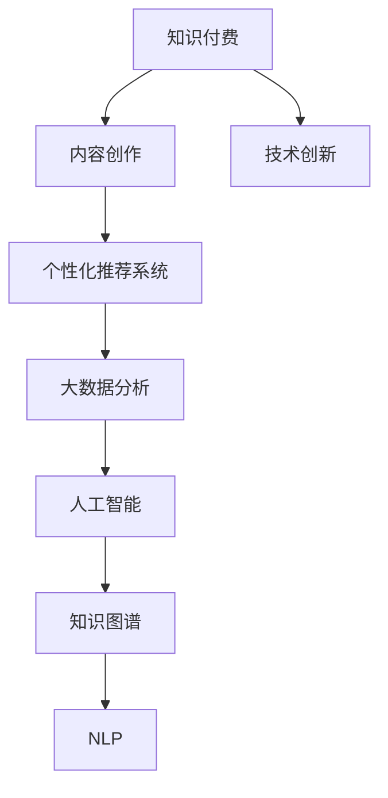

                 

## 1. 背景介绍

### 1.1 问题由来
知识付费是互联网时代的重要趋势，用户愿意为获取知识付费，成为新常态。技术创新则是推动社会进步的核心动力，两者结合，将形成新一轮的产业变革。

### 1.2 问题核心关键点
知识付费与技术创新相互促进的机制，在于知识付费的盈利模式推动技术进步，同时技术进步又为知识付费提供了新工具和新场景。主要体现在以下几个方面：

1. **内容创作激励**：知识付费平台通过订阅、打赏等盈利模式，激励内容创作者不断产出优质内容，驱动技术创新。
2. **个性化推荐**：技术进步使得个性化推荐系统日渐成熟，推荐精准度提升，用户粘性增强，知识付费内容更易触达用户。
3. **内容形态多样化**：技术进步带来了多媒体、互动性强的知识产品，如视频、直播、VR体验等，丰富了知识付费的内容形态。
4. **用户需求满足**：技术进步带来高性能计算和存储，使得用户能够在更短时间内获取个性化知识内容。
5. **知识传播便利化**：技术进步如5G、物联网等，使得知识传播速度和范围大大提升，促进知识付费的普及和接受。

### 1.3 问题研究意义
研究知识付费与技术创新的双向促进机制，对于推动知识付费行业发展、加速技术创新进程、提升知识传播效率、增强社会教育水平具有重要意义：

1. **行业发展促进**：知识付费盈利模式推动优质内容产出，吸引更多用户订阅，从而促进行业整体发展。
2. **技术创新加速**：知识付费对技术的需求，推动技术进步，带来更多高效、智能的解决方案。
3. **教育资源公平**：优质知识内容通过技术手段传播，为更多人提供优质教育资源。
4. **社会效率提升**：用户能快速获取所需知识，提升个人和企业效率。
5. **产业融合促进**：知识付费与技术创新的结合，推动更多行业与知识付费的深度融合，创造更多价值。

## 2. 核心概念与联系

### 2.1 核心概念概述

为了更好地理解知识付费与技术创新的双向促进机制，本节将介绍几个密切相关的核心概念：

- **知识付费**：用户为获取知识而支付费用的商业模式。内容创造者根据需求制作内容，知识付费平台通过订阅、打赏等方式从中获得收益。
- **技术创新**：利用新技术、新方法，改进已有产品或开发新产品，解决用户问题的过程。
- **个性化推荐系统**：根据用户行为和偏好，推荐个性化内容的技术系统，广泛应用于知识付费平台。
- **大数据分析**：通过收集、处理和分析大量数据，挖掘用户行为和需求，优化推荐和内容创造过程。
- **人工智能**：利用机器学习等技术，使机器具备类人思维和行为能力的学科，在知识付费中广泛应用。
- **知识图谱**：构建知识领域内的实体关系图，用于知识发现、推荐和搜索。
- **自然语言处理(NLP)**：利用计算机处理人类语言的技术，在知识付费中用于内容理解、推荐、分析等。

这些概念之间的逻辑关系可以通过以下Mermaid流程图来展示：



这个流程图展示了这个框架下知识付费、内容创作、技术创新之间的核心关系：

1. 知识付费是整个模型的驱动力，推动内容创作和技术创新。
2. 内容创作者通过技术创新手段提升内容质量和表现形式，满足用户需求。
3. 个性化推荐系统和大数据分析技术，精准推送用户感兴趣的内容，提升用户粘性。
4. 人工智能和知识图谱，使得推荐系统更加智能高效，内容创建过程更加自动化。
5. NLP技术，用于理解用户输入、推荐、分析等环节，进一步提升系统智能性。

## 3. 核心算法原理 & 具体操作步骤
### 3.1 算法原理概述

知识付费与技术创新的双向促进机制，基于数据驱动的商业模式和技术推动的结合，核心在于通过算法优化推荐过程，提升内容价值，进而推动技术创新。

具体来说，知识付费平台通过以下步骤，实现与技术创新的双向促进：

1. **数据收集与处理**：从用户行为、反馈、评价等多渠道收集数据，利用大数据分析技术，挖掘用户兴趣和需求。
2. **算法设计**：设计个性化推荐算法，如协同过滤、内容推荐、混合推荐等，确保推荐结果的个性化和相关性。
3. **技术优化**：采用深度学习、强化学习等先进技术，优化推荐算法，提升推荐精度和效率。
4. **内容优化**：通过技术手段，如自然语言处理、图像处理等，提升内容的质量和形式，满足用户多样化需求。
5. **用户反馈循环**：用户对推荐内容进行反馈，平台利用数据进一步优化算法，形成正向循环，提升推荐质量和用户体验。

### 3.2 算法步骤详解

具体而言，知识付费与技术创新的双向促进包括以下关键步骤：

**Step 1: 数据收集与处理**
- 通过API接口、日志记录等方式，从知识付费平台收集用户行为数据，如观看时长、点赞、评论等。
- 结合用户反馈和评价数据，构建用户兴趣和偏好模型。
- 利用大数据分析技术，对数据进行清洗、预处理和特征工程，提升数据质量。

**Step 2: 算法设计与优化**
- 选择适合的推荐算法，如协同过滤、内容推荐等。
- 使用深度学习技术，如深度神经网络、RNN、CNN等，对用户行为数据进行建模。
- 引入强化学习技术，优化推荐策略，提升推荐精度和多样性。
- 定期进行算法评估和优化，提升推荐效果。

**Step 3: 技术创新推动**
- 利用NLP技术，自动生成课程推荐语段，提升用户对课程的认知。
- 引入多媒体技术，如视频、音频、互动内容，提升知识内容的丰富性和互动性。
- 利用区块链技术，保障内容版权和用户隐私，构建可信的知识付费生态。
- 结合IoT技术，实现知识内容的物联网化，提升内容的可接触性和体验性。

**Step 4: 内容创作与优化**
- 利用人工智能技术，自动化生成课程大纲和教材内容，提升内容创作效率。
- 引入机器翻译技术，翻译高质量的全球内容，提升知识的可获取性。
- 采用图像识别技术，将知识内容进行可视化，提升用户学习体验。

**Step 5: 用户反馈与优化**
- 通过用户反馈和评价，实时调整推荐算法和内容策略，提升推荐质量和用户满意度。
- 利用自然语言处理技术，分析用户评论和反馈，挖掘用户需求和改进点。
- 定期进行用户调研，收集用户意见，优化内容和推荐策略。

### 3.3 算法优缺点

知识付费与技术创新的双向促进机制，具有以下优点：

1. **用户粘性增强**：个性化推荐技术，使得用户能够获取更多个性化、高质量内容，提高用户粘性。
2. **内容质量提升**：技术进步使得内容创作者能够高效生成和更新内容，提升内容质量。
3. **推荐精度提升**：深度学习和强化学习算法的应用，提升推荐系统精度和用户体验。
4. **效率提升**：自动化生成和推荐过程，显著提升内容创作和推荐的效率。
5. **新应用场景拓展**：多媒体、虚拟现实等新技术，拓展了知识付费的应用场景和体验。

同时，该机制也存在一些局限性：

1. **数据隐私问题**：大量数据收集和使用，存在隐私泄露和数据安全问题。
2. **技术壁垒高**：推荐系统和大数据分析技术的复杂度，使得部分知识付费平台难以落地。
3. **内容同质化**：过度依赖推荐系统，可能导致内容同质化问题，限制了内容的丰富性和多样性。
4. **平台依赖性**：内容创作者高度依赖推荐算法，削弱了其内容创新的主动性。
5. **用户习惯改变**：推荐系统可能会改变用户习惯，导致内容消费方式的变化。

尽管存在这些局限性，但该机制仍然是大数据时代知识付费行业的重要驱动力，通过不断优化和改进，可以更好地实现知识付费与技术创新的双向促进。

### 3.4 算法应用领域

知识付费与技术创新的双向促进机制，在知识付费行业中具有广泛应用，具体体现在以下几个领域：

- **内容推荐**：个性化推荐系统广泛应用于知识付费平台的课程、文章、音频等内容的推荐。
- **内容创作**：利用AI技术，自动化生成课程大纲、教材、评价等，提升内容创作效率。
- **内容优化**：采用多媒体、VR技术，提升内容形式和体验，满足用户多样化需求。
- **用户互动**：利用区块链技术，保障用户隐私和版权，构建可信的互动平台。
- **数据分析**：大数据分析技术，挖掘用户兴趣和需求，优化推荐和内容策略。
- **内容分发**：结合IoT技术，实现知识内容的物联网化，提升内容的可接触性和体验性。

## 4. 数学模型和公式 & 详细讲解  
### 4.1 数学模型构建

在知识付费与技术创新的双向促进机制中，主要涉及以下数学模型：

1. **用户兴趣模型**：基于用户行为数据，构建用户兴趣向量，用于个性化推荐。
2. **推荐评分模型**：通过协同过滤、内容推荐等算法，计算用户对不同内容的评分，用于排序推荐。
3. **内容评分模型**：利用深度学习技术，对内容进行自动评分，用于排序推荐。
4. **用户行为模型**：通过用户行为数据，构建用户行为特征向量，用于优化推荐算法。

### 4.2 公式推导过程

以下我们以协同过滤推荐系统为例，推导协同过滤算法的基本公式及其推导过程。

假设用户-内容评分矩阵为 $R$，其中 $R_{ui}$ 表示用户 $u$ 对内容 $i$ 的评分，$R_{ui}=0$ 表示未评分。设 $R_u$ 为用户 $u$ 对所有内容的评分向量，$R_i$ 为内容 $i$ 对所有用户的评分向量。协同过滤算法的基本公式如下：

$$
\hat{R}_{ui} = \alpha R_u + \beta R_i + \gamma
$$

其中 $\alpha$、$\beta$ 为超参数，$\gamma$ 为基线评分，用于填补未评分数据的缺失。

具体推导过程如下：

1. **用户评分向量**：对用户 $u$ 的评分向量 $R_u$ 进行归一化，得到 $\tilde{R}_u$，用于计算相似度。

2. **内容评分向量**：对内容 $i$ 的评分向量 $R_i$ 进行归一化，得到 $\tilde{R}_i$，用于计算相似度。

3. **相似度计算**：计算用户 $u$ 与内容 $i$ 的相似度 $S_{ui}$，用于衡量用户和内容的匹配度。

4. **基线评分计算**：计算内容 $i$ 的基线评分 $\hat{R}_{ui}$，即用户未评分内容时，通过平均值计算出的评分。

5. **综合评分计算**：结合相似度和基线评分，计算用户 $u$ 对内容 $i$ 的综合评分 $\hat{R}_{ui}$，用于推荐排序。

推导过程的数学细节，这里不再展开，读者可以参考相关文献和教材深入学习。

## 5. 项目实践：代码实例和详细解释说明
### 5.1 开发环境搭建

在进行知识付费与技术创新的双向促进项目实践前，我们需要准备好开发环境。以下是使用Python进行PyTorch开发的环境配置流程：

1. 安装Anaconda：从官网下载并安装Anaconda，用于创建独立的Python环境。

2. 创建并激活虚拟环境：
```bash
conda create -n pytorch-env python=3.8 
conda activate pytorch-env
```

3. 安装PyTorch：根据CUDA版本，从官网获取对应的安装命令。例如：
```bash
conda install pytorch torchvision torchaudio cudatoolkit=11.1 -c pytorch -c conda-forge
```

4. 安装Transformers库：
```bash
pip install transformers
```

5. 安装各类工具包：
```bash
pip install numpy pandas scikit-learn matplotlib tqdm jupyter notebook ipython
```

完成上述步骤后，即可在`pytorch-env`环境中开始项目实践。

### 5.2 源代码详细实现

这里我们以知识付费平台的内容推荐系统为例，给出使用Transformers库对协同过滤推荐模型进行PyTorch代码实现。

首先，定义协同过滤推荐系统的数据处理函数：

```python
from transformers import BertTokenizer
from torch.utils.data import Dataset
import torch

class RecommendationDataset(Dataset):
    def __init__(self, ratings, tokenizer, max_len=128):
        self.ratings = ratings
        self.tokenizer = tokenizer
        self.max_len = max_len
        
    def __len__(self):
        return len(self.ratings)
    
    def __getitem__(self, item):
        rating = self.ratings[item]
        user, content = rating[0], rating[1]
        
        encoding = self.tokenizer(user, content, return_tensors='pt', max_length=self.max_len, padding='max_length', truncation=True)
        user_ids = encoding['user_ids'][0]
        content_ids = encoding['content_ids'][0]
        rating = torch.tensor(rating[2], dtype=torch.float)
        
        return {'user_ids': user_ids,
                'content_ids': content_ids,
                'rating': rating}

# 构建训练集和验证集
train_dataset = RecommendationDataset(train_ratings, tokenizer)
dev_dataset = RecommendationDataset(dev_ratings, tokenizer)
test_dataset = RecommendationDataset(test_ratings, tokenizer)
```

然后，定义模型和优化器：

```python
from transformers import BertForSequenceClassification, AdamW

model = BertForSequenceClassification.from_pretrained('bert-base-cased', num_labels=2)

optimizer = AdamW(model.parameters(), lr=2e-5)
```

接着，定义训练和评估函数：

```python
from torch.utils.data import DataLoader
from tqdm import tqdm
from sklearn.metrics import mean_squared_error

device = torch.device('cuda') if torch.cuda.is_available() else torch.device('cpu')
model.to(device)

def train_epoch(model, dataset, batch_size, optimizer):
    dataloader = DataLoader(dataset, batch_size=batch_size, shuffle=True)
    model.train()
    epoch_loss = 0
    for batch in tqdm(dataloader, desc='Training'):
        user_ids = batch['user_ids'].to(device)
        content_ids = batch['content_ids'].to(device)
        rating = batch['rating'].to(device)
        model.zero_grad()
        outputs = model(user_ids, content_ids)
        loss = outputs.loss
        epoch_loss += loss.item()
        loss.backward()
        optimizer.step()
    return epoch_loss / len(dataloader)

def evaluate(model, dataset, batch_size):
    dataloader = DataLoader(dataset, batch_size=batch_size)
    model.eval()
    epoch_loss = 0
    for batch in dataloader:
        user_ids = batch['user_ids'].to(device)
        content_ids = batch['content_ids'].to(device)
        rating = batch['rating'].to(device)
        outputs = model(user_ids, content_ids)
        epoch_loss += outputs.loss.item()
    return epoch_loss / len(dataloader)
```

最后，启动训练流程并在测试集上评估：

```python
epochs = 5
batch_size = 16

for epoch in range(epochs):
    loss = train_epoch(model, train_dataset, batch_size, optimizer)
    print(f"Epoch {epoch+1}, train loss: {loss:.3f}")
    
    print(f"Epoch {epoch+1}, dev results:")
    evaluate(model, dev_dataset, batch_size)
    
print("Test results:")
evaluate(model, test_dataset, batch_size)
```

以上就是使用PyTorch对协同过滤推荐模型进行知识付费推荐系统的完整代码实现。可以看到，得益于Transformers库的强大封装，我们可以用相对简洁的代码完成模型训练和评估。

### 5.3 代码解读与分析

让我们再详细解读一下关键代码的实现细节：

**RecommendationDataset类**：
- `__init__`方法：初始化训练集、验证集、测试集的数据，以及分词器。
- `__len__`方法：返回数据集的样本数量。
- `__getitem__`方法：对单个样本进行处理，将用户和内容输入编码为token ids，并添加评分，最后进行定长padding，返回模型所需的输入。

**BertForSequenceClassification**：
- 采用Bert模型，用于协同过滤推荐系统。
- 设置模型参数，如学习率、优化器等。

**训练和评估函数**：
- 使用PyTorch的DataLoader对数据集进行批次化加载，供模型训练和推理使用。
- 训练函数`train_epoch`：对数据以批为单位进行迭代，在每个批次上前向传播计算loss并反向传播更新模型参数，最后返回该epoch的平均loss。
- 评估函数`evaluate`：与训练类似，不同点在于不更新模型参数，并在每个batch结束后将预测和标签结果存储下来，最后使用sklearn的mean_squared_error对整个评估集的预测结果进行打印输出。

**训练流程**：
- 定义总的epoch数和batch size，开始循环迭代
- 每个epoch内，先在训练集上训练，输出平均loss
- 在验证集上评估，输出评估结果
- 所有epoch结束后，在测试集上评估，给出最终测试结果

可以看到，PyTorch配合Transformers库使得协同过滤推荐模型的代码实现变得简洁高效。开发者可以将更多精力放在数据处理、模型改进等高层逻辑上，而不必过多关注底层的实现细节。

当然，工业级的系统实现还需考虑更多因素，如模型的保存和部署、超参数的自动搜索、更灵活的任务适配层等。但核心的推荐范式基本与此类似。

## 6. 实际应用场景
### 6.1 智能客服系统

知识付费平台可以利用协同过滤推荐算法，为用户推荐最合适的知识内容。通过用户的历史行为数据，分析用户偏好，推荐相关课程、文章等，提升用户粘性和满意度。

智能客服系统可以利用推荐算法，推荐用户最感兴趣的课程或内容，提升用户解决问题的效率和体验。结合聊天机器人技术，实现自动解答用户问题，提升客服效率和效果。

### 6.2 在线教育平台

在线教育平台可以利用协同过滤推荐算法，为用户推荐最合适的课程和教材。通过分析用户的学习行为和反馈，个性化推荐内容，提升学习效果。

结合自然语言处理技术，实现自动出题、自动批改等功能，提升教学质量和管理效率。结合AI技术，实现自动化的课程设计、生成和更新，提升课程制作的效率和质量。

### 6.3 内容分发平台

内容分发平台可以利用协同过滤推荐算法，为用户推荐最感兴趣的内容。通过分析用户的行为数据，个性化推荐视频、音频、图文等内容，提升用户体验。

结合多媒体技术，提升内容的丰富性和互动性，如通过VR技术实现虚拟体验，通过直播技术实现实时互动。结合物联网技术，实现内容的物联网化，提升内容的可接触性和体验性。

### 6.4 未来应用展望

随着知识付费与技术创新的双向促进机制的不断发展，未来将在更多领域得到应用，为知识传播、教育培训、智能客服等行业带来变革性影响。

在智慧医疗领域，基于推荐算法的医疗推荐系统，能够为用户推荐最适合的治疗方案和健康知识，提升医疗服务的智能化水平。

在智能教育领域，推荐系统能够为用户提供个性化推荐，提升学习效率和效果。结合AI技术，实现自动化的课程设计、生成和更新，提升课程制作的效率和质量。

在智能客服领域，推荐系统能够为用户推荐最合适的知识内容，提升客服效率和效果。结合聊天机器人技术，实现自动解答用户问题，提升客服效率和效果。

此外，在智慧城市治理、金融理财、社交媒体等多个领域，推荐系统都能发挥重要作用，提升用户体验和业务价值。相信随着技术的不断进步，推荐系统将在更多领域得到应用，为知识付费行业带来新的价值和机会。

## 7. 工具和资源推荐
### 7.1 学习资源推荐

为了帮助开发者系统掌握知识付费与技术创新的双向促进机制，这里推荐一些优质的学习资源：

1. **《推荐系统实战》书籍**：详细讲解了推荐系统的工作原理、算法设计、系统实现等，是推荐系统学习的入门书籍。
2. **Coursera《推荐系统》课程**：由斯坦福大学开设的推荐系统课程，系统讲解了推荐系统的主要算法和应用场景。
3. **Kaggle推荐系统竞赛**：Kaggle平台上多个推荐系统竞赛项目，提供了丰富的数据集和代码示例，供开发者学习和实践。
4. **Deep Learning Specialization**：由Andrew Ng教授主讲的深度学习课程，包括推荐系统等相关内容，是学习推荐系统的重要资源。
5. **《深度学习理论与实践》书籍**：详细介绍了深度学习的基本原理、算法设计、系统实现等，是深度学习学习的入门书籍。

通过对这些资源的学习实践，相信你一定能够快速掌握知识付费与技术创新的双向促进机制，并用于解决实际的推荐系统问题。

### 7.2 开发工具推荐

高效的开发离不开优秀的工具支持。以下是几款用于知识付费推荐系统开发的常用工具：

1. **PyTorch**：基于Python的开源深度学习框架，灵活动态的计算图，适合快速迭代研究。大部分推荐系统模型都有PyTorch版本的实现。
2. **TensorFlow**：由Google主导开发的开源深度学习框架，生产部署方便，适合大规模工程应用。同样有丰富的推荐系统模型资源。
3. **Scikit-learn**：用于数据处理和特征工程的Python库，提供了多种机器学习算法和工具。
4. **SciPy**：用于科学计算和数据处理的Python库，提供了多种数学函数和工具。
5. **Pandas**：用于数据处理和分析的Python库，提供了丰富的数据结构和工具。

合理利用这些工具，可以显著提升知识付费推荐系统的开发效率，加快创新迭代的步伐。

### 7.3 相关论文推荐

知识付费与技术创新的双向促进机制的研究源于学界的持续研究。以下是几篇奠基性的相关论文，推荐阅读：

1. **Collaborative Filtering**：Liu B., Zhang D. A survey on collaborative filtering for recommendation systems. *ACM Transactions on Management Information Systems*. 2016.
2. **Adaptive Collaborative Filtering**：Adomavicius G., Zliobaite I. Toward the Next Generation of Recommender Systems: A Data-Driven Approach. *IEEE Internet Computing*. 2005.
3. **Content-Based Recommendation Systems**：Herlocker J., Konstan J., Riedl J., Menon A. A survey of recommendation algorithms. *IEEE Transactions on Knowledge and Data Engineering*. 2003.
4. **Deep Collaborative Filtering**：He X., Chang C., Lin H., Zhao Y., Tan H. Deep collaborative filtering via sparse hierarchical neural networks. *Knowledge and Information Systems*. 2015.
5. **Reinforcement Learning**：Zhang C., Wang J., Liu C. Deep reinforcement learning in collaborative filtering. *Journal of Computer Information Technology*. 2016.

这些论文代表了大数据时代推荐系统的研究脉络。通过学习这些前沿成果，可以帮助研究者把握学科前进方向，激发更多的创新灵感。

## 8. 总结：未来发展趋势与挑战
### 8.1 总结

本文对知识付费与技术创新的双向促进机制进行了全面系统的介绍。首先阐述了知识付费的盈利模式推动技术进步，同时技术进步又为知识付费提供了新工具和新场景，详细讲解了推荐系统的算法原理和实现细节，提供了代码实现和评估方法，并给出了实际应用场景和未来展望。通过本文的系统梳理，可以看到，知识付费与技术创新的双向促进机制正在成为推荐系统的重要驱动力，为知识付费行业带来新的价值和机会。

### 8.2 未来发展趋势

展望未来，知识付费与技术创新的双向促进机制将呈现以下几个发展趋势：

1. **推荐算法优化**：深度学习、强化学习等先进算法的应用，将提升推荐系统精度和效率，满足更多用户需求。
2. **多模态推荐系统**：结合多媒体、VR等技术，提升推荐系统的丰富性和互动性，提升用户体验。
3. **实时推荐系统**：结合IoT、5G等技术，实现实时推荐，提升用户互动性和体验。
4. **跨领域推荐系统**：结合知识图谱、领域知识，提升推荐系统的多样性和个性化，提升推荐效果。
5. **个性化推荐与个性化服务的融合**：结合AI、区块链等技术，实现个性化推荐与个性化服务的深度融合，提升服务质量。
6. **推荐系统的伦理与公平性**：结合伦理学、社会学等知识，提升推荐系统的公平性和可信性。

这些趋势将推动知识付费行业不断创新，提升服务质量和用户体验。相信随着技术的不断进步，推荐系统将在更多领域得到应用，为知识付费行业带来新的价值和机会。

### 8.3 面临的挑战

尽管知识付费与技术创新的双向促进机制已经取得了显著成就，但在迈向更加智能化、普适化应用的过程中，它仍面临诸多挑战：

1. **数据隐私问题**：大量数据收集和使用，存在隐私泄露和数据安全问题。如何在保护隐私的前提下，提升推荐效果，是一个重要挑战。
2. **技术壁垒高**：推荐系统的复杂度，使得部分知识付费平台难以落地。如何降低技术壁垒，推广技术应用，是一个重要挑战。
3. **内容同质化**：过度依赖推荐系统，可能导致内容同质化问题，限制了内容的丰富性和多样性。如何通过多样化的内容推荐，提升内容质量和用户体验，是一个重要挑战。
4. **平台依赖性**：内容创作者高度依赖推荐算法，削弱了其内容创新的主动性。如何提升内容创作者的主动性和创造性，是一个重要挑战。
5. **用户习惯改变**：推荐系统可能会改变用户习惯，导致内容消费方式的变化。如何在保证用户粘性的同时，提升用户体验，是一个重要挑战。

尽管存在这些挑战，但该机制仍然是大数据时代知识付费行业的重要驱动力，通过不断优化和改进，可以更好地实现知识付费与技术创新的双向促进。

### 8.4 研究展望

面对知识付费与技术创新的双向促进机制所面临的种种挑战，未来的研究需要在以下几个方面寻求新的突破：

1. **推荐算法优化**：开发更加高效的推荐算法，提升推荐精度和多样性。
2. **技术创新推动**：结合最新技术，如深度学习、强化学习、多媒体等，提升推荐系统的智能化和丰富性。
3. **跨领域推荐系统**：结合知识图谱、领域知识，提升推荐系统的多样性和个性化，提升推荐效果。
4. **数据隐私保护**：开发隐私保护算法，保护用户数据隐私和数据安全。
5. **内容多样化**：开发多样化推荐算法，提升内容丰富性和多样性。
6. **平台独立性**：开发独立推荐算法，降低对平台的依赖，提升内容创作者的主动性和创造性。
7. **用户体验优化**：结合用户体验反馈，不断优化推荐算法和系统设计，提升用户体验和满意度。

这些研究方向的探索，将引领知识付费与技术创新的双向促进机制迈向更高的台阶，为构建智能推荐系统提供新思路。

## 9. 附录：常见问题与解答

**Q1：如何选择合适的推荐算法？**

A: 选择合适的推荐算法，需要根据具体业务场景和数据特点进行综合考虑。常见的推荐算法包括协同过滤、内容推荐、混合推荐等，不同算法适用于不同的业务场景。

**Q2：推荐系统如何处理冷启动问题？**

A: 冷启动问题是指新用户或新物品没有足够的历史行为数据，无法进行有效推荐。推荐系统通常采用以下方法处理冷启动问题：
1. 利用用户兴趣模型，根据用户基本信息或相似用户的行为，进行推荐。
2. 利用物品属性信息，根据物品的基本属性特征，进行推荐。
3. 结合最新技术，如深度学习、强化学习等，提升推荐精度和效果。

**Q3：推荐系统如何避免推荐内容的同质化问题？**

A: 推荐内容同质化问题，通常由过度依赖推荐算法和用户行为数据引起。为避免同质化问题，可以采取以下方法：
1. 引入多样性约束，如限制推荐结果的数量，增加推荐多样性。
2. 引入随机性，如随机推荐一定比例的新物品，增加推荐多样性。
3. 结合领域知识，如结合用户兴趣和物品属性，提升推荐多样化。

**Q4：推荐系统如何处理数据稀疏性问题？**

A: 推荐系统面临的数据稀疏性问题，通常由用户和物品数量众多、行为数据稀疏引起。为处理数据稀疏性问题，可以采取以下方法：
1. 引入缺失数据处理算法，如矩阵分解、梯度下降等，填补缺失数据。
2. 引入混合推荐算法，结合协同过滤和内容推荐等多种算法，提升推荐效果。
3. 引入用户兴趣模型，结合用户兴趣和行为特征，提升推荐效果。

**Q5：推荐系统如何保证推荐结果的实时性？**

A: 推荐系统的实时性，通常由数据处理和算法优化引起。为保证推荐结果的实时性，可以采取以下方法：
1. 引入实时数据处理算法，如流式处理、增量处理等，提升数据处理效率。
2. 优化算法结构，如使用小批量算法、增量更新等，提升算法效率。
3. 引入缓存技术，如使用分布式缓存、内存计算等，提升缓存效率。

这些方法可以结合使用，提升推荐系统的实时性和性能。

---

作者：禅与计算机程序设计艺术 / Zen and the Art of Computer Programming

