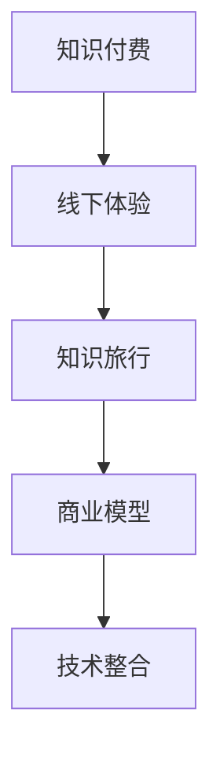

                 

# 知识付费与线下体验相结合的知识旅行模式

> 关键词：知识付费,线下体验,知识旅行,商业模式,技术整合

## 1. 背景介绍

### 1.1 问题由来
近年来，随着互联网技术的迅猛发展和教育意识的日益提升，知识付费逐渐成为信息社会的重要趋势。传统以线下课程、纸质书籍为主的教育形式正在向线上化、智能化的方向转变。但线上学习往往缺乏互动性，难以满足学生个性化学习需求，同时用户流失率高，复购率低。因此，将线上知识付费与线下体验相结合，成为提升用户体验和增强用户粘性的有效方式。

### 1.2 问题核心关键点
本文聚焦于知识付费与线下体验相结合的商业模型，具体探讨了这种模式如何通过技术手段实现，以及它在教育、旅游、零售等领域的实际应用。核心关键点如下：

- **知识付费**：用户通过在线购买或订阅获取特定知识，提供知识生产者收益，实现知识传播。
- **线下体验**：在实际场景中通过面对面的互动，加深知识理解，提升学习效果。
- **知识旅行**：将知识学习与地理旅行相结合，通过移动交互和自然环境的互动，增强记忆和理解。
- **商业模型**：将线上内容销售与线下服务提供结合，形成一套完整的商业模式。
- **技术整合**：借助AI、VR/AR、物联网等技术，实现知识内容和线下场景的有机融合。

## 2. 核心概念与联系

### 2.1 核心概念概述

为更好地理解知识付费与线下体验相结合的模式，本节将介绍几个密切相关的核心概念：

- **知识付费**：用户通过支付费用获取专业知识的传播与分享。知识付费平台有知识分享者（称为内容创作者）和知识消费者（用户）组成。
- **线下体验**：用户在实际物理空间内通过面对面的互动，获取实际体验和知识。线下体验包括各类实体课堂、研讨会、交流会等。
- **知识旅行**：将知识学习与地理旅行相结合，通过自然环境的互动，加深对知识点的记忆和理解。知识旅行通常以旅游为基础，融合教育元素。
- **商业模型**：知识付费和线下体验结合的商业模式，通过线上和线下双重渠道获取收益，实现内容与服务的双赢。
- **技术整合**：将AI、VR/AR、物联网等新技术与知识付费和线下体验模式相结合，实现知识传播和线下互动的智能化和个性化。

这些概念之间的逻辑关系可以通过以下Mermaid流程图来展示：



这个流程图展示了一系列核心概念及其之间的联系：

1. 知识付费提供知识传播的初始形式，是线下体验和知识旅行的知识来源。
2. 线下体验是知识传播的延伸，用户通过面对面的互动，深化对知识的理解。
3. 知识旅行将知识学习与地理旅行结合，提升学习体验。
4. 商业模型整合线上和线下渠道，形成完整的盈利模式。
5. 技术整合将前沿技术融入知识旅行中，增强互动和体验。

## 3. 核心算法原理 & 具体操作步骤
### 3.1 算法原理概述

知识付费与线下体验相结合的模式，本质上是一种知识服务的融合创新。其核心思想是：通过线上内容销售，获取前期资金支持，再将这些资金用于线下服务提供，形成完整的商业闭环。这种模式既保证了知识传播的质量，又提高了用户的学习体验和粘性。

形式化地，假设知识付费平台有$N$个内容创作者$C_1, C_2, \dots, C_N$，每个创作者提供$K$种课程。用户有$M$个，其中$M_1$个用户购买了$C_1$的课程，$M_2$个用户购买了$C_2$的课程，以此类推。设用户支付的平均课程价格为$P$，则平台的总收益为：

$$
\text{Total Revenue} = P \times \sum_{i=1}^N \sum_{j=1}^K M_i \times M_j
$$

平台将收益的一部分投入到线下体验的运营中，如租用场地、聘请讲师、研发智能设备等。假设线下体验的运营成本为$C$，则实际用于用户服务的费用为：

$$
\text{User Service Cost} = \text{Total Revenue} - C
$$

在线下体验中，每个用户可以获得$T$次线下互动机会。假设每次互动的效果值为$E$，则总的互动效果为：

$$
\text{Total Effect} = E \times T \times \sum_{i=1}^N \sum_{j=1}^K M_i
$$

通过线下的互动，用户对知识的理解和记忆得到提升，从而形成平台和用户的正向反馈循环。

### 3.2 算法步骤详解

基于上述原理，知识付费与线下体验相结合的模式具体操作步骤如下：

**Step 1: 线上内容发布**
- 内容创作者在平台上发布课程，设置课程价格和课时。
- 平台为用户提供内容推荐，促进用户购买。

**Step 2: 线下体验设计**
- 根据课程内容和用户需求，设计线下体验项目，如主题班、研讨沙龙、实地考察等。
- 安排合适的场地、时间、讲师等资源。

**Step 3: 技术整合**
- 引入AI技术进行课程推荐，个性化推送最适合用户的内容。
- 利用VR/AR技术进行虚拟互动，增强用户沉浸感。
- 采用物联网技术进行设备互联，提高线下体验的智能化水平。

**Step 4: 互动效果评估**
- 对线下互动的效果进行评估，收集用户反馈。
- 根据用户反馈优化课程和体验内容，迭代提升服务质量。

**Step 5: 收益分配**
- 根据线下互动效果和用户评价，分配用户的线上支付。
- 将收益的一部分用于线下服务的再投资，形成良性循环。

**Step 6: 持续优化**
- 定期收集用户数据和行为，进行数据分析。
- 根据分析结果不断优化内容和体验，提升用户体验和粘性。

### 3.3 算法优缺点

知识付费与线下体验相结合的模式具有以下优点：
1. 提供多维度学习体验：线上内容与线下互动相结合，形成更丰富全面的学习模式。
2. 提高用户粘性：线下互动增强用户参与感，减少用户流失。
3. 提升学习效果：线下体验加深用户对知识的理解和记忆。
4. 多元化收益：线上内容销售和线下服务提供形成双重收入来源。
5. 增强品牌价值：优质的线下服务提升平台品牌知名度和美誉度。

同时，该模式也存在一定的局限性：
1. 前期投入大：线下体验项目的运营需要较大的前期投入，资金压力较大。
2. 运营难度高：线下活动的组织和运营需要高度专业化和协调性，风险较高。
3. 技术依赖强：高质量的线下体验需要高度依赖技术支持，可能存在技术风险。
4. 用户需求分散：不同用户对线下体验的兴趣和需求不同，难以形成统一标准。
5. 服务质量难以控制：线下体验的质量和效果受到多种因素影响，难以完全控制。

尽管存在这些局限性，但这种模式在教育、旅游、零售等领域已展现出了巨大的潜力和实际应用价值，成为知识付费和线下体验结合的重要探索方向。

### 3.4 算法应用领域

知识付费与线下体验相结合的模式，已经在教育、旅游、零售等多个领域得到广泛应用，具体包括：

- **教育**：结合线上课程和线下沙龙、讲座、辅导班，提升学生学习效果和学校品牌影响力。
- **旅游**：开发主题旅游线路，提供文化、自然、科学等多元化学习内容。
- **零售**：通过线上介绍和线下体验，提升产品销售和品牌美誉度。
- **健康**：结合健康教育课程和线下健康检查、体验，提升健康知识和意识。
- **文化**：结合文化课程和线下文化活动，提升文化遗产保护和传播效果。

这些应用领域展示了知识付费与线下体验结合模式的广泛适用性，为不同行业的知识传播和互动提供了新的方向。

## 4. 数学模型和公式 & 详细讲解 & 举例说明
### 4.1 数学模型构建

本节将使用数学语言对知识付费与线下体验相结合的模式进行更加严格的刻画。

设平台上有$N$个内容创作者，每个创作者提供$K$种课程。设$M$个用户中，$M_1$个用户购买了$C_1$的课程，$M_2$个用户购买了$C_2$的课程，以此类推。平台每次课程的平均价格为$P$，用户购买课程后的互动效果值为$E$，每次线下互动的机会为$T$，运营成本为$C$。

平台收益的数学模型为：

$$
\text{Total Revenue} = P \times \sum_{i=1}^N \sum_{j=1}^K M_i \times M_j
$$

平台用于线下体验的资金为：

$$
\text{User Service Cost} = \text{Total Revenue} - C
$$

总的线下互动效果为：

$$
\text{Total Effect} = E \times T \times \sum_{i=1}^N \sum_{j=1}^K M_i
$$

### 4.2 公式推导过程

根据上述模型，我们推导了平台收益、线下体验成本和线下互动效果的公式。具体推导过程如下：

**平台收益模型**
$$
\text{Total Revenue} = P \times \sum_{i=1}^N \sum_{j=1}^K M_i \times M_j
$$

**线下体验成本模型**
$$
\text{User Service Cost} = \text{Total Revenue} - C
$$

**线下互动效果模型**
$$
\text{Total Effect} = E \times T \times \sum_{i=1}^N \sum_{j=1}^K M_i
$$

这些公式展示了知识付费与线下体验相结合模式的核心计算逻辑，帮助理解和优化整个流程。

### 4.3 案例分析与讲解

假设有一个线上知识付费平台，有10位创作者各提供3门课程，平台上注册了100位用户。用户平均每门课程支付10元，每次线下体验的费用为500元，用户每次体验的互动效果值为0.8。

根据公式计算，平台总收益为：

$$
\text{Total Revenue} = 10 \times (100 \times 3 \times 10) = 30000
$$

线下体验成本为：

$$
\text{User Service Cost} = 30000 - 5000 = 25000
$$

总的线下互动效果为：

$$
\text{Total Effect} = 0.8 \times 10 \times (100 \times 3) = 2400
$$

通过这些计算，平台可以了解到每次线下体验的平均成本和收益，从而更好地优化服务流程和用户体验。

## 5. 项目实践：代码实例和详细解释说明
### 5.1 开发环境搭建

在进行知识付费与线下体验结合的实践前，我们需要准备好开发环境。以下是使用Python进行Django开发的环境配置流程：

1. 安装Anaconda：从官网下载并安装Anaconda，用于创建独立的Python环境。

2. 创建并激活虚拟环境：
```bash
conda create -n pay-experience python=3.8 
conda activate pay-experience
```

3. 安装Django：
```bash
pip install django
```

4. 创建Django项目：
```bash
django-admin startproject pay_experience
cd pay_experience
```

5. 创建Django应用：
```bash
python manage.py startapp experience
```

6. 安装必要的依赖库：
```bash
pip install django-cors-headers
pip install django-models-slim
pip install django-rest-framework
```

完成上述步骤后，即可在`pay_experience`环境中开始项目开发。

### 5.2 源代码详细实现

下面是一个简单的Django项目示例，用于实现知识付费与线下体验相结合的模式。

首先，定义用户和创作者模型：

```python
from django.contrib.auth.models import AbstractUser
from django.db import models

class Creator(AbstractUser):
    pass

class User(AbstractUser):
    pass
```

然后，定义课程和体验模型：

```python
class Course(models.Model):
    title = models.CharField(max_length=100)
    description = models.TextField()
    price = models.DecimalField(max_digits=10, decimal_places=2)
    creator = models.ForeignKey(Creator, on_delete=models.CASCADE)

class Experience(models.Model):
    title = models.CharField(max_length=100)
    description = models.TextField()
    price = models.DecimalField(max_digits=10, decimal_places=2)
    creator = models.ForeignKey(Creator, on_delete=models.CASCADE)
```

接着，定义相关的视图和路由：

```python
from django.urls import path
from django.http import JsonResponse
from .models import Course, Experience

def course_list(request):
    courses = Course.objects.all()
    return JsonResponse([{'id': course.id, 'title': course.title, 'price': course.price} for course in courses])

def experience_list(request):
    experiences = Experience.objects.all()
    return JsonResponse([{'id': experience.id, 'title': experience.title, 'price': experience.price} for experience in experiences])

urlpatterns = [
    path('courses/', course_list),
    path('experiences/', experience_list),
]
```

最后，启动开发服务器：

```bash
python manage.py runserver
```

用户可以通过访问`http://localhost:8000/courses/`和`http://localhost:8000/experiences/`获取课程和体验信息。

### 5.3 代码解读与分析

让我们再详细解读一下关键代码的实现细节：

**User和Creator模型**：
- 继承自Django内置的AbstractUser模型，自定义了Creator和User的简单属性。

**Course和Experience模型**：
- 分别表示线上课程和线下体验项目，包含了必要的字段和外键关系。

**views和routes**：
- 定义了课程和体验的列表视图，通过JsonResponse将数据返回给客户端。
- 通过Django的path函数定义了API的路由，使得用户可以通过浏览器访问这些API获取数据。

**运行服务器**：
- 使用Django自带的runserver命令启动开发服务器，可以在浏览器中访问应用。

可以看到，Django提供了完整的MVC框架，使得快速开发和部署变得简单高效。通过该示例，读者可以初步了解如何使用Django构建知识付费与线下体验相结合的应用。

## 6. 实际应用场景

### 6.1 教育行业

在教育行业，知识付费与线下体验相结合的模式可以显著提升学生的学习效果和学校品牌影响力。例如，线上课程可以提供基础的知识点讲解，而线下互动项目如实验课、实践课等，则能够让学生通过实际操作加深理解。这种模式结合了线上和线下，形成了更完整、更深入的学习体验。

**具体应用**：
- 线上平台提供各学科的课程，用户可以自由选择课程进行学习。
- 线下组织主题班、实验课等，安排教师进行现场指导和互动。
- 平台可以根据用户的学习进度和反馈，提供个性化的线下体验推荐。

### 6.2 旅游行业

旅游行业同样可以采用知识付费与线下体验相结合的模式，通过结合自然和人文景观，提升旅游体验和教育效果。例如，旅游线路可以结合历史、文化、科学等多方面的知识，通过导览、讲座等形式向游客传播。

**具体应用**：
- 线上提供旅游线路介绍和规划工具，用户可以自由组合旅游路线。
- 线下提供文化导览、自然探索等活动，增加用户互动和体验。
- 平台可以与景区合作，提供定制化的旅游服务。

### 6.3 零售行业

零售行业通过这种模式可以提升产品销售和品牌美誉度。例如，线上产品介绍可以结合线下体验，通过试用、演示等形式增加用户对产品的了解和信任。

**具体应用**：
- 线上提供产品介绍和评价，用户可以自由选择购买。
- 线下提供产品试用、演示等体验活动，增加用户对产品的了解。
- 平台可以与零售商合作，提供定制化的线下体验服务。

## 7. 工具和资源推荐
### 7.1 学习资源推荐

为了帮助开发者系统掌握知识付费与线下体验相结合的技术，这里推荐一些优质的学习资源：

1. **Django官方文档**：Django是Python开发中广泛使用的框架，官方文档详细介绍了如何使用Django构建Web应用，适合初学者和高级开发者。

2. **《Python Web开发实战》**：这本书全面介绍了如何使用Django构建Web应用，从基础到高级，涵盖了丰富的实际案例。

3. **《Django框架实战》**：这本书通过实际项目演示了Django的各个组件和功能，适合有一定经验的开发者。

4. **《人工智能与大数据》**：这本书介绍了AI和数据科学的基本概念和前沿技术，适合对人工智能感兴趣的开发者。

5. **Coursera和edX**：这些在线教育平台提供大量与知识付费、线下体验、AI技术等相关的课程，适合系统学习。

通过对这些资源的学习实践，相信你一定能够快速掌握知识付费与线下体验相结合的技术，并用于解决实际的业务问题。

### 7.2 开发工具推荐

高效的开发离不开优秀的工具支持。以下是几款用于知识付费与线下体验结合开发的常用工具：

1. **Django**：Python开发中最流行的Web框架，提供了完整的MVC框架和丰富的中间件支持，适合快速开发和部署。

2. **Django REST Framework**：Django的RESTful API开发工具，方便开发API接口，支持多种数据格式和认证方式。

3. **Jupyter Notebook**：一个交互式的数据科学和机器学习环境，可以实时展示和分享数据分析和模型训练的结果。

4. **Kaggle**：一个数据科学竞赛平台，提供了大量公开数据集和社区资源，适合数据分析和机器学习实践。

5. **Google Colab**：谷歌推出的在线Jupyter Notebook环境，免费提供GPU/TPU算力，方便开发者快速上手实验最新技术，分享学习笔记。

合理利用这些工具，可以显著提升知识付费与线下体验结合模式的开发效率，加快创新迭代的步伐。

### 7.3 相关论文推荐

知识付费与线下体验相结合的模式涉及多种技术和理论，以下是几篇奠基性的相关论文，推荐阅读：

1. **《大规模在线教育系统的设计与实现》**：介绍了大规模在线教育系统的设计思路和技术实现，涵盖课程发布、互动体验等多个环节。

2. **《基于线下体验的知识付费模式研究》**：探讨了知识付费与线下体验相结合的商业模式，通过案例分析展示了其实际应用效果。

3. **《知识旅行模式的应用研究》**：介绍了知识旅行模式的基本概念和技术实现，提供了实际应用案例。

4. **《AI在教育领域的应用研究》**：探讨了AI技术在教育领域的应用，包括课程推荐、学习效果评估等多个方面。

这些论文代表了大规模在线教育和线下体验结合方向的研究脉络。通过学习这些前沿成果，可以帮助研究者把握学科前进方向，激发更多的创新灵感。

## 8. 总结：未来发展趋势与挑战
### 8.1 总结

本文对知识付费与线下体验相结合的商业模型进行了全面系统的介绍。首先阐述了这种模式的背景和意义，明确了其对用户学习体验和品牌价值提升的独特价值。其次，从原理到实践，详细讲解了该模式的数学模型和具体操作步骤，给出了Python代码实现和详细解释。同时，本文还广泛探讨了该模式在教育、旅游、零售等多个领域的实际应用，展示了其广阔的应用前景。最后，本文精选了学习资源和开发工具，力求为读者提供全方位的技术指引。

通过本文的系统梳理，可以看到，知识付费与线下体验相结合的模式正在成为在线教育的重要趋势，通过技术手段实现了知识传播和线下互动的有机融合。未来，随着技术进一步发展和应用场景的拓展，这种模式必将在更广泛的领域得到应用，推动教育和商业的智能化发展。

### 8.2 未来发展趋势

展望未来，知识付费与线下体验相结合的模式将呈现以下几个发展趋势：

1. **技术融合加深**：随着AI、VR/AR、物联网等技术的进步，线下体验将变得更加智能化和个性化，提升用户的学习效果。

2. **应用场景拓展**：除了教育、旅游、零售，这种模式将在更多行业得到应用，如健康、文化、体育等领域，形成多元化的知识传播和互动。

3. **商业模式创新**：结合线上和线下渠道，形成更灵活、更高效的商业模型，满足用户多样化的需求。

4. **平台合作增多**：平台之间通过合作，共同提供线下体验服务，形成生态效应，提升用户粘性和体验。

5. **个性化推荐提升**：利用AI技术进行精准推荐，提升用户满意度和平台收益。

6. **用户体验优化**：通过技术手段优化线下体验流程，提高用户的参与度和满意度。

以上趋势凸显了知识付费与线下体验相结合模式的广阔前景。这些方向的探索发展，必将进一步提升用户体验和粘性，推动知识传播的智能化和个性化发展。

### 8.3 面临的挑战

尽管知识付费与线下体验相结合的模式已经取得了瞩目成就，但在迈向更加智能化、普适化应用的过程中，它仍面临着诸多挑战：

1. **前期投入大**：线下体验项目的运营需要较大的前期投入，资金压力较大。

2. **运营难度高**：线下活动的组织和运营需要高度专业化和协调性，风险较高。

3. **技术依赖强**：高质量的线下体验需要高度依赖技术支持，可能存在技术风险。

4. **用户需求分散**：不同用户对线下体验的兴趣和需求不同，难以形成统一标准。

5. **服务质量难以控制**：线下体验的质量和效果受到多种因素影响，难以完全控制。

6. **竞争激烈**：随着行业的快速发展，竞争压力增大，需要不断优化和创新。

尽管存在这些挑战，但这种模式在教育、旅游、零售等领域已展现出了巨大的潜力和实际应用价值，成为知识付费和线下体验结合的重要探索方向。相信随着学界和产业界的共同努力，这些挑战终将一一被克服，知识付费与线下体验结合模式必将在构建人机协同的智能时代中扮演越来越重要的角色。

### 8.4 研究展望

面向未来，知识付费与线下体验相结合的模式需要在以下几个方面寻求新的突破：

1. **技术融合创新**：探索新的技术手段，如混合现实、增强现实等，提升线下体验的互动性和沉浸感。

2. **个性化推荐优化**：引入更多AI算法，如协同过滤、内容推荐等，提升推荐效果和用户满意度。

3. **服务质量控制**：建立全面的质量评估体系，通过用户反馈和数据分析，不断优化线下体验流程。

4. **平台生态构建**：通过合作和整合，构建平台生态，提升用户体验和平台价值。

5. **社会责任强化**：注重社会责任，避免商业化对知识传播和文化传播的负面影响。

这些研究方向将推动知识付费与线下体验结合模式向更加智能化、普适化和可持续方向发展，为不同行业的知识传播和互动提供新的方向。

## 9. 附录：常见问题与解答

**Q1：知识付费与线下体验相结合的模式如何降低前期投入？**

A: 可以通过多渠道融资和合作来实现。例如，平台可以通过引入风投、私募等方式筹集资金，或者与景区、培训机构等实体合作，共同分担线下体验项目的初期成本。

**Q2：知识付费与线下体验相结合的模式如何提升服务质量？**

A: 建立全面的质量评估体系，通过用户反馈和数据分析，不断优化线下体验流程。引入AI技术进行实时监控和分析，及时发现并解决服务中的问题。

**Q3：知识付费与线下体验相结合的模式如何应对激烈的市场竞争？**

A: 通过技术创新和差异化服务，提升平台的竞争力。例如，引入更多技术手段如混合现实、增强现实等，提升用户体验。同时，通过合作和整合，构建平台生态，提升平台的价值和影响力。

**Q4：知识付费与线下体验相结合的模式如何提升个性化推荐效果？**

A: 引入更多的AI算法，如协同过滤、内容推荐等，提升推荐效果和用户满意度。同时，通过数据挖掘和分析，了解用户需求和偏好，提供更精准的推荐服务。

**Q5：知识付费与线下体验相结合的模式如何实现可持续发展？**

A: 注重社会责任，避免商业化对知识传播和文化传播的负面影响。同时，建立平台生态，通过合作和整合，实现可持续的商业运作。

这些问题的解答，展示了知识付费与线下体验相结合模式在实际应用中的具体策略和优化方向，为读者提供实用的参考和指导。

---

作者：禅与计算机程序设计艺术 / Zen and the Art of Computer Programming

