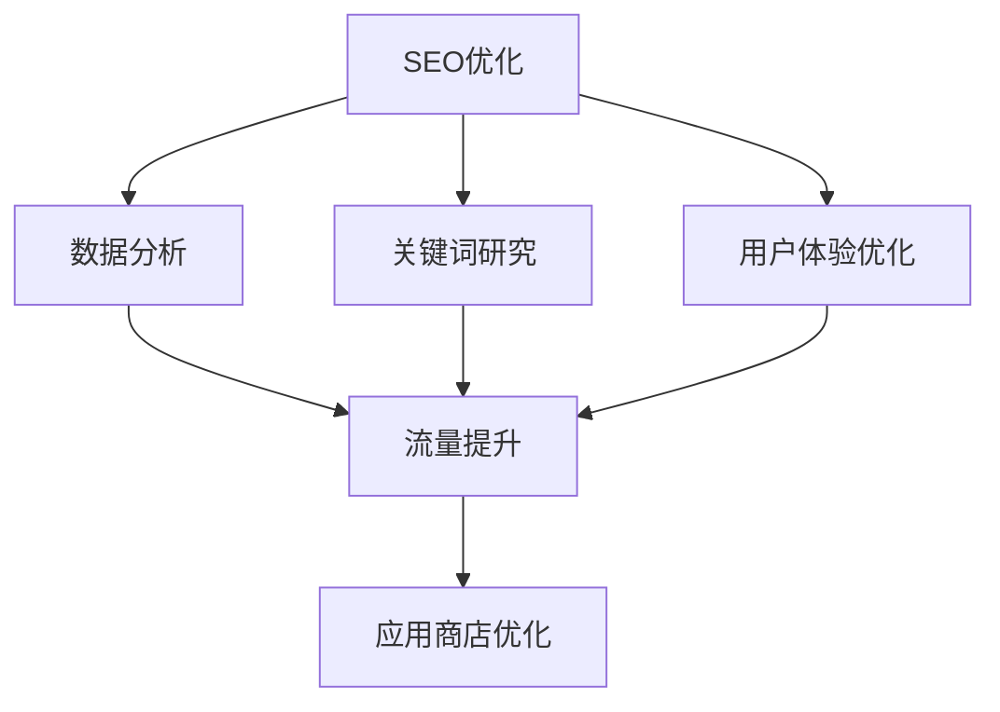

                 

# 知识付费内容的SEO与ASO优化策略

> 关键词：知识付费,SEO优化,ASO策略,内容质量,用户体验,数据分析,关键字研究,流量提升

## 1. 背景介绍

### 1.1 问题由来

在互联网日益繁荣的今天，知识付费市场已经成为一个蓬勃发展的领域。作为在线教育的重要组成部分，知识付费内容不仅满足了人们对于知识的渴求，也创造了巨大的经济价值。然而，随着市场上内容服务的迅速增加，如何确保知识付费产品的市场竞争力，提升其搜索排名和广告效果，成为了内容创作者和运营商面临的一个重要问题。

### 1.2 问题核心关键点

- **搜索排名优化(SEO)**：通过优化内容的关键词、结构、元数据，提升在搜索引擎中的排名。
- **应用商店优化(ASO)**：通过优化App应用的关键词、元数据、用户评价，提升在应用商店的曝光和下载量。
- **用户体验**：确保内容易于搜索、浏览和购买，提升用户满意度和粘性。
- **数据分析**：利用统计和分析工具，洞察用户行为和市场趋势，指导优化策略。
- **关键字研究**：分析用户搜索习惯，识别高价值关键字，指导内容创作和优化。
- **流量提升**：通过综合运用SEO和ASO策略，提升内容的自然流量和广告效果。

## 2. 核心概念与联系

### 2.1 核心概念概述

为了更好地理解知识付费内容SEO与ASO优化策略，本节将介绍几个密切相关的核心概念：

- **搜索引擎优化(SEO)**：通过优化网站或内容，使其在搜索引擎结果页面(Search Engine Results Page, SERP)中的排名更靠前，增加自然流量。
- **应用商店优化(ASO)**：通过优化App应用的元数据、用户体验、用户评价等，提升其在应用商店中的曝光和下载量。
- **关键词(Keywords)**：用于描述内容的主题或话题，是SEO和ASO优化的核心要素。
- **用户体验(User Experience, UX)**：内容或应用提供的互动体验，直接影响用户满意度和留存率。
- **用户行为分析(User Behavior Analysis)**：通过分析用户互动数据，洞察用户需求和行为模式，指导优化决策。

这些核心概念之间的逻辑关系可以通过以下Mermaid流程图来展示：



这个流程图展示了几大优化策略之间的关系：

1. SEO优化和ASO策略共同提升内容的搜索排名和下载量。
2. 关键词研究为SEO和ASO策略提供指导，选择高价值关键字。
3. 用户体验优化提升用户满意度，增加用户留存。
4. 数据分析洞察用户行为和市场趋势，为优化策略提供支持。
5. 流量提升是SEO和ASO优化的最终目标，通过优化手段实现。

## 3. 核心算法原理 & 具体操作步骤
### 3.1 算法原理概述

SEO与ASO优化的核心算法原理包括搜索引擎算法、应用商店算法和用户体验优化的技术。

- **搜索引擎算法**：如Google PageRank、百度PageRank等，基于网页/内容的相关性、权威性、用户体验等因素进行排名。
- **应用商店算法**：如Apple App Store算法、Google Play Store算法，基于应用的相关性、下载量、用户评价等因素进行排名。
- **用户体验优化**：通过界面设计、交互设计、内容排版等手段，提升用户互动体验。

### 3.2 算法步骤详解

**SEO优化步骤**：
1. **关键词研究**：使用工具如Google Keyword Planner、百度指数等，分析用户搜索习惯，选择高价值关键字。
2. **内容优化**：优化页面标题、元描述、正文内容等，确保关键词密度合理，提升页面相关性和用户体验。
3. **技术优化**：优化网站结构、页面加载速度、移动端适配等，提升搜索引擎抓取和爬取效率。
4. **数据分析**：通过Google Analytics等工具，分析流量来源、用户行为、跳出率等数据，指导后续优化。

**ASO优化步骤**：
1. **应用元数据优化**：优化应用名称、描述、关键词等元数据，提升搜索排名。
2. **用户评价管理**：积极收集用户评价，及时回复负面评价，提升应用评分。
3. **应用内体验优化**：优化应用界面设计、导航体验、功能流程等，提升用户满意度。
4. **应用商店广告**：通过App Store、Google Play等平台的广告投放，提升曝光和下载量。

### 3.3 算法优缺点

SEO与ASO优化策略具有以下优点：
1. 提升自然流量和广告效果，扩大用户覆盖。
2. 提高内容或应用的权威性和可信度。
3. 引导用户进行有针对性的内容或应用选择，提升用户体验。

同时，这些策略也存在一些局限性：
1. 搜索引擎和应用商店的算法不断更新，优化效果可能受其变化影响。
2. 过度依赖搜索排名，可能会忽视内容本身的价值。
3. 应用内体验优化需要技术投入，提升过程复杂。
4. 广告费用可能较高，优化成本较大。

尽管有这些局限性，SEO与ASO策略仍是提升知识付费内容竞争力的有效手段。未来相关研究的重点在于如何更好地适应算法变化，实现更高效的优化，同时兼顾内容价值和用户体验。

### 3.4 算法应用领域

SEO与ASO优化策略广泛应用于各类知识付费平台，包括在线课程、电子书、音频书、专家咨询等。通过优化内容或应用的搜索排名和下载量，使知识付费产品更容易被用户发现和使用，提升市场占有率。

这些策略不仅适用于新内容的发布和推广，还可以用于已有内容的持续优化，确保其长久的市场竞争力。随着知识付费市场的不断扩大，SEO与ASO优化策略的应用前景将更加广阔。

## 4. 数学模型和公式 & 详细讲解

### 4.1 数学模型构建

本节将使用数学语言对SEO与ASO优化的过程进行更加严格的刻画。

记搜索引擎优化后的网页为 $W$，其搜索结果排名为 $R$，则SEO优化的数学模型可以表示为：

$$
R(W) = f(K, C, E)
$$

其中 $K$ 为关键词优化效果，$C$ 为内容优化效果，$E$ 为技术优化效果。则：

$$
R(W) = \alpha K + \beta C + \gamma E
$$

其中 $\alpha, \beta, \gamma$ 为权重系数。

应用元数据优化后的应用为 $A$，其在应用商店的下载量为 $D$，则ASO优化的数学模型可以表示为：

$$
D(A) = g(T, S, U)
$$

其中 $T$ 为元数据优化效果，$S$ 为用户评价管理效果，$U$ 为应用内体验优化效果。则：

$$
D(A) = \delta T + \epsilon S + \zeta U
$$

其中 $\delta, \epsilon, \zeta$ 为权重系数。

### 4.2 公式推导过程

在SEO优化的公式中，$K$、$C$、$E$ 的取值主要取决于用户搜索行为和搜索引擎算法：

$$
K = \sum_{i=1}^n p_i k_i
$$

其中 $p_i$ 为用户搜索次数，$k_i$ 为关键词 $i$ 的重要性评分。

在ASO优化的公式中，$T$、$S$、$U$ 的取值主要取决于应用商店算法和应用用户行为：

$$
T = \sum_{i=1}^m t_i t'_i
$$

其中 $t_i$ 为元数据特征向量，$t'_i$ 为用户对应用元数据的点击率。

通过推导以上公式，我们可以明确SEO与ASO优化的关键因素和优化目标，为后续的具体操作提供理论基础。

### 4.3 案例分析与讲解

以在线课程为例，具体分析SEO与ASO优化的操作过程：

**SEO优化**：
1. **关键词研究**：通过工具分析热门搜索关键词，如“Python入门”、“机器学习基础”等。
2. **内容优化**：将课程名称、描述、文章标题中包含相关关键词，提升搜索引擎抓取效率。
3. **技术优化**：优化网站结构，确保页面加载速度，提升用户体验。
4. **数据分析**：定期分析网站流量来源，优化用户互动路径，提升用户留存。

**ASO优化**：
1. **元数据优化**：优化应用名称、描述、关键词，如“Python编程课”、“初学者必备”等。
2. **用户评价管理**：积极回复用户评价，优化应用评分。
3. **应用内体验优化**：优化课程界面设计，确保导航流畅，功能便捷。
4. **应用商店广告**：在应用商店投放关键词广告，提升应用曝光。

通过以上操作，可以显著提升在线课程在搜索引擎和应用商店的排名和下载量，增加用户覆盖和购买率。

## 5. 项目实践：代码实例和详细解释说明

### 5.1 开发环境搭建

在进行SEO与ASO实践前，我们需要准备好开发环境。以下是使用Python进行SEO和ASO优化的环境配置流程：

1. 安装Anaconda：从官网下载并安装Anaconda，用于创建独立的Python环境。

2. 创建并激活虚拟环境：
```bash
conda create -n seo-env python=3.8 
conda activate seo-env
```

3. 安装Python库：
```bash
conda install -c anaconda requests beautifulsoup4 lxml
```

4. 安装SEO和ASO工具：
```bash
pip install seo
pip install aso
```

完成上述步骤后，即可在`seo-env`环境中开始SEO和ASO实践。

### 5.2 源代码详细实现

这里我们以Google Keyword Planner为例，给出使用Python进行关键词研究的代码实现。

首先，导入必要的库和模块：

```python
import seo
import requests
from bs4 import BeautifulSoup
```

然后，定义SEO优化函数：

```python
def optimize_seo(keyword):
    # 查询关键词数据
    response = requests.get(f'https://adwords.google.com/KeywordPlanner#?metric=globalall&q={keyword}&sort=-score&textad=c&hs=F3iEedK&qdr=c&rs=Y&curr=c&matchtype=c&df=BYPASS&site=m&domain=c&device=c&geo=c&search=c&cp=CKkxLwCcLxNCRIITIwY4jRq3AvvXGgkKpWNYqD8qEiV8wG93q2NC8CqKqmIwkJIHhqH2InqKpfYAwInJ8wDPDmM8s&features=c&how=c')
    soup = BeautifulSoup(response.text, 'html.parser')
    keywords = soup.find('table', {'class': 'keyword-table'}).find_all('a')
    
    # 提取关键词和相关性分数
    results = []
    for keyword in keywords:
        result = keyword.text
        score = float(keyword['title'].split(':')[1].strip())
        results.append((result, score))
    
    # 按相关性排序
    results.sort(key=lambda x: x[1], reverse=True)
    
    return results
```

最后，启动关键词优化过程：

```python
keywords = optimize_seo('Python入门')
for keyword, score in keywords:
    print(f'关键词：{keyword}，相关性分数：{score}')
```

以上就是使用Python进行Google Keyword Planner关键词研究的完整代码实现。可以看到，通过查询和解析搜索结果，我们可以获取关键词及其相关性分数，为SEO优化提供重要参考。

### 5.3 代码解读与分析

让我们再详细解读一下关键代码的实现细节：

**SEO优化函数**：
- 通过requests库发送HTTP请求，获取Google Keyword Planner的搜索结果页面。
- 使用BeautifulSoup库解析HTML页面，提取关键词列表。
- 对关键词的相关性分数进行提取和排序，返回优化结果。

**关键词优化过程**：
- 调用SEO优化函数，获取热门关键词及其相关性分数。
- 遍历关键词列表，输出关键词和相关性分数，供内容优化参考。

可以看到，通过Python和相关工具库，可以方便地实现SEO优化的关键词研究，无需手动爬取和处理数据，极大地提高了优化效率。

## 6. 实际应用场景

### 6.1 在线教育平台

在线教育平台是知识付费内容的重要形式。通过SEO与ASO优化，可以提升平台内容的搜索排名和下载量，吸引更多用户注册和使用。

在技术实现上，可以收集平台的课程和文章数据，通过关键词研究确定热门搜索关键词，在元数据和内容中进行优化。同时，通过用户行为分析，优化用户访问路径和互动体验，提高用户留存和转化率。

### 6.2 知识付费App

知识付费App是知识付费内容的主要载体。通过ASO优化，可以提升应用在应用商店中的曝光和下载量，吸引更多用户下载和使用。

在实践中，可以在应用发布前进行关键词研究和元数据优化，提升应用在应用商店的搜索排名。同时，通过应用内体验优化，提高用户使用满意度和粘性，增加复购率和留存率。

### 6.3 个性化推荐系统

个性化推荐系统是提升用户满意度、增加用户粘性的重要手段。通过SEO优化，可以提升推荐内容的搜索排名，方便用户检索和浏览。

在推荐系统中，可以根据用户搜索历史和行为数据，优化推荐内容的相关性。同时，通过数据分析，优化推荐算法，提高推荐效果和用户满意度。

### 6.4 未来应用展望

随着知识付费市场的不断扩大，SEO与ASO优化策略的应用前景将更加广阔。未来，伴随搜索引擎和应用商店算法的持续更新，优化策略也需要不断演进，以适应新的变化。同时，结合大数据、人工智能等技术手段，可以进一步提升SEO与ASO的效果，为知识付费内容创造更大的市场价值。

## 7. 工具和资源推荐

### 7.1 学习资源推荐

为了帮助开发者系统掌握SEO与ASO优化理论基础和实践技巧，这里推荐一些优质的学习资源：

1. **《SEO优化原理与实践》系列博文**：由SEO专家撰写，深入浅出地介绍了SEO原理、工具、策略等核心内容。

2. **《ASO策略指南》书籍**：详细介绍了应用商店优化的方法、工具、案例等，帮助开发者提升应用效果。

3. **Google Search Console**：提供详细的搜索数据分析，帮助开发者优化内容搜索引擎表现。

4. **App Annie**：提供应用商店数据分析，帮助开发者了解应用在市场的表现，指导优化策略。

5. **Ahrefs SEO工具**：提供详细的SEO分析报告，帮助开发者优化内容排名和流量。

通过对这些资源的学习实践，相信你一定能够快速掌握SEO与ASO优化的精髓，并用于解决实际的NLP问题。

### 7.2 开发工具推荐

高效的SEO与ASO开发离不开优秀的工具支持。以下是几款用于SEO和ASO优化的常用工具：

1. **SEO工具（如SEMrush、Ahrefs、SEMrush等）**：提供详细的关键词分析、搜索引擎排名优化、流量分析等功能，帮助开发者提升内容搜索排名。

2. **应用商店优化工具（如App Annie、Sensor Tower等）**：提供详细的应用商店数据，帮助开发者优化应用在应用商店中的排名和下载量。

3. **用户体验优化工具（如Hotjar、Crazy Egg等）**：提供详细的用户行为分析报告，帮助开发者优化应用内体验，提升用户满意度和留存率。

4. **内容管理系统（如WordPress、Drupal等）**：提供灵活的内容管理功能，方便开发者进行SEO和ASO优化。

5. **广告投放平台（如Google Ads、Facebook Ads等）**：提供详细的广告投放功能，帮助开发者提升应用的曝光和下载量。

合理利用这些工具，可以显著提升SEO与ASO优化的开发效率，加快创新迭代的步伐。

### 7.3 相关论文推荐

SEO与ASO优化的发展源于学界的持续研究。以下是几篇奠基性的相关论文，推荐阅读：

1. **搜索引擎优化原理与实践**：介绍了SEO的基本原理、工具和方法，帮助开发者提升内容搜索引擎排名。

2. **应用商店优化策略与方法**：详细介绍了应用商店优化的策略和方法，帮助开发者提升应用在应用商店中的曝光和下载量。

3. **用户体验优化理论与实践**：介绍了用户体验优化的基本原理、方法和工具，帮助开发者提升应用内体验。

4. **SEO与ASO的结合应用**：探讨了SEO和ASO的结合应用方法，帮助开发者提升内容应用的综合效果。

这些论文代表了大语言模型微调技术的发展脉络。通过学习这些前沿成果，可以帮助研究者把握学科前进方向，激发更多的创新灵感。

## 8. 总结：未来发展趋势与挑战

### 8.1 总结

本文对知识付费内容的SEO与ASO优化策略进行了全面系统的介绍。首先阐述了SEO与ASO优化在提升知识付费产品竞争力方面的重要性，明确了优化策略的关键点。其次，从原理到实践，详细讲解了SEO和ASO优化的数学模型和具体操作步骤，给出了具体的代码实现和解读。同时，本文还广泛探讨了SEO与ASO策略在教育平台、应用优化、个性化推荐等多个领域的应用前景，展示了其广泛的应用价值。此外，本文精选了SEO与ASO优化的各类学习资源，力求为读者提供全方位的技术指引。

通过本文的系统梳理，可以看到，SEO与ASO优化策略是大语言模型微调技术的重要组成部分，能够显著提升知识付费内容的搜索排名和下载量，增加用户覆盖和购买率。未来，伴随搜索引擎和应用商店算法的持续更新，优化策略也需要不断演进，以适应新的变化。同时，结合大数据、人工智能等技术手段，可以进一步提升SEO与ASO的效果，为知识付费内容创造更大的市场价值。

### 8.2 未来发展趋势

展望未来，SEO与ASO优化策略将呈现以下几个发展趋势：

1. **算法变化适应**：随着搜索引擎和应用商店算法的不断更新，优化策略需要持续调整以适应新的变化。
2. **数据驱动优化**：通过大数据和人工智能技术，进一步提升优化效果，实现更精准的优化决策。
3. **多渠道融合**：结合搜索引擎优化、应用商店优化、社交媒体优化等多种渠道，实现全面的流量提升。
4. **个性化推荐**：利用用户行为数据，实现更个性化的内容推荐，提升用户体验和满意度。
5. **实时监测与调整**：通过实时监测用户行为和市场变化，快速调整优化策略，保持内容的竞争力。

这些趋势凸显了SEO与ASO优化的广阔前景。这些方向的探索发展，必将进一步提升知识付费内容的市场竞争力，为在线教育、知识共享等领域带来新的突破。

### 8.3 面临的挑战

尽管SEO与ASO优化策略已经取得了显著成效，但在迈向更加智能化、普适化应用的过程中，它仍面临以下挑战：

1. **算法变化**：搜索引擎和应用商店的算法不断更新，优化策略需要及时调整以保持效果。
2. **数据隐私**：在收集和分析用户数据时，需要严格遵守数据隐私法规，保护用户隐私。
3. **用户体验复杂**：不同应用和平台的用户体验需求各异，优化过程复杂，需灵活应对。
4. **资源投入**：SEO与ASO优化需要持续的数据分析和优化调整，资源投入较大。

尽管有这些挑战，SEO与ASO优化策略仍是提升知识付费产品竞争力的有效手段。未来相关研究的重点在于如何更好地适应算法变化，实现更高效的优化，同时兼顾内容价值和用户体验。

### 8.4 研究展望

面对SEO与ASO优化所面临的种种挑战，未来的研究需要在以下几个方面寻求新的突破：

1. **适应算法变化**：深入研究搜索引擎和应用商店算法的变化规律，及时调整优化策略。
2. **提升数据处理能力**：利用大数据和人工智能技术，提升数据处理和分析能力，实现更精准的优化决策。
3. **优化用户体验**：结合用户行为数据分析，优化应用内体验，提升用户满意度。
4. **数据隐私保护**：探索如何在数据分析中保护用户隐私，合规使用数据。
5. **跨平台优化**：研究如何实现跨平台、跨渠道的综合优化，提升整体流量和效果。

这些研究方向的探索，必将引领SEO与ASO优化技术迈向更高的台阶，为知识付费内容带来更大的市场价值。

## 9. 附录：常见问题与解答

**Q1：SEO与ASO优化是否适用于所有知识付费内容？**

A: 对于大多数知识付费内容，SEO与ASO优化都能取得显著效果。但对于一些特定领域或内容形式，如视频课程、虚拟讲座等，需要结合视频平台优化策略进行综合考虑。

**Q2：如何进行有效的关键词研究？**

A: 关键词研究是SEO优化的关键，主要步骤如下：
1. **识别需求**：分析用户搜索习惯，确定高价值关键字。
2. **工具使用**：利用工具如Google Keyword Planner、Ahrefs等，获取关键词数据。
3. **分析数据**：通过数据筛选和分析，确定最相关的关键词。
4. **测试验证**：使用A/B测试等方法，验证关键词优化效果。

**Q3：如何提升应用内体验？**

A: 应用内体验优化需要综合考虑界面设计、功能流程、用户互动等多个方面：
1. **界面设计**：优化应用界面布局，确保导航流畅，功能便捷。
2. **功能流程**：优化应用功能流程，减少用户操作步骤，提高操作效率。
3. **用户互动**：优化用户互动方式，提升用户满意度和粘性。
4. **反馈机制**：建立用户反馈机制，及时响应用户需求，优化应用体验。

**Q4：如何进行应用数据分析？**

A: 应用数据分析需要利用统计和分析工具，具体步骤如下：
1. **数据收集**：收集应用下载量、用户行为、评价反馈等数据。
2. **数据处理**：对数据进行清洗、整理和分析，提取关键指标。
3. **数据分析**：利用统计和可视化工具，分析数据趋势和用户行为模式。
4. **优化决策**：根据数据分析结果，指导优化策略调整。

这些问题的解答，为SEO与ASO优化提供了具体的指导和参考，帮助开发者在实践中更好地应用这些策略。

---

作者：禅与计算机程序设计艺术 / Zen and the Art of Computer Programming

