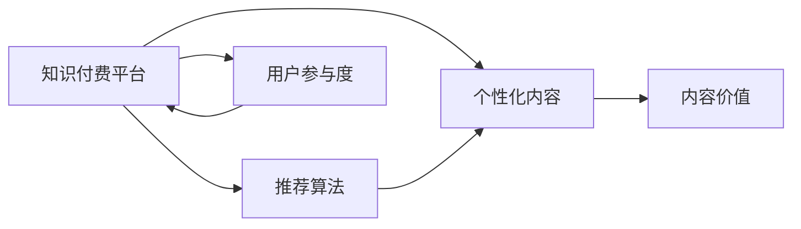

                 

# 知识付费创业中的内容价值提升

在数字化时代，知识付费行业正以迅猛的速度发展，为用户提供了丰富的在线学习资源。然而，如何在海量内容中提炼出具有高价值的内容，成为知识付费创业者的一大挑战。本文将系统地探讨如何在知识付费创业中提升内容价值，通过优化推荐算法、强化用户参与、构建个性化内容生态，实现从海量的知识资源中挖掘出真正有价值的洞察和知识。

## 1. 背景介绍

随着互联网技术的发展，用户获取知识的渠道日益丰富。在线教育平台、视频网站、博客、社交媒体等都成为了获取知识的重要来源。知识付费作为一种新型商业模式，通过付费订阅、单次购买等方式，为用户提供了更为系统、专业的学习体验，逐渐成为教育市场的一个重要组成部分。然而，知识付费市场也面临着内容同质化、用户粘性低等诸多挑战，如何提升内容价值，成为当前创业者的关键任务。

## 2. 核心概念与联系

### 2.1 核心概念概述

- **知识付费**：指用户为获取深度、专业、系统的知识内容，而支付一定费用的商业模式。
- **内容价值**：指知识内容对用户认知提升、技能提升、职业发展等方面的实际效用。
- **推荐算法**：通过分析用户行为和内容特征，为用户推荐最相关内容的算法技术。
- **个性化内容**：根据用户兴趣、学习历史等数据，定制化推荐用户感兴趣的内容。
- **用户参与度**：衡量用户对知识内容的互动频率和深度，包括阅读、评论、分享、反馈等。

### 2.2 核心概念原理和架构的 Mermaid 流程图



该流程图展示了知识付费平台中推荐算法、个性化内容、用户参与度和内容价值之间的关系：

- 平台收集用户数据，包括浏览记录、学习进度、评价反馈等，作为推荐算法的输入。
- 推荐算法根据用户特征和内容特征，为用户推荐个性化内容。
- 个性化内容通过提升用户参与度，增强用户与平台的互动。
- 高参与度的用户会获得更高的内容价值，从而提升平台的整体价值。

## 3. 核心算法原理 & 具体操作步骤

### 3.1 算法原理概述

知识付费平台的推荐算法通常基于协同过滤、内容推荐、混合推荐等方法，综合用户历史行为、内容属性、用户画像等因素，为用户推荐最相关的内容。这些算法通常包括以下步骤：

1. **用户画像构建**：通过分析用户的历史行为和互动数据，构建用户画像。
2. **内容特征提取**：对内容进行特征提取，如关键词、分类、标签等。
3. **模型训练**：基于用户画像和内容特征，训练推荐模型。
4. **推荐排序**：对推荐内容进行排序，选择最相关的几篇文章/视频/课程推荐给用户。

### 3.2 算法步骤详解

#### 3.2.1 用户画像构建

用户画像可以通过以下方法构建：

1. **行为记录**：记录用户的浏览、阅读、购买、评分、评论等行为数据。
2. **时间序列分析**：对用户行为数据进行时间序列分析，识别出用户的活跃时段、学习周期、兴趣偏好等。
3. **数据融合**：将行为数据、社交数据、人口统计数据等进行融合，构建完整的用户画像。

#### 3.2.2 内容特征提取

内容特征提取通常包括以下步骤：

1. **关键词提取**：通过自然语言处理技术，从内容中提取出关键名词、动词等。
2. **分类标签**：对内容进行分类，如技术、管理、设计等。
3. **情感分析**：通过情感分析技术，判断内容的情感倾向，如积极、消极、中性等。

#### 3.2.3 模型训练

常见的推荐模型包括协同过滤、内容推荐、混合推荐等：

1. **协同过滤**：通过分析用户与内容的交互记录，找到相似用户和相似内容，进行推荐。
2. **内容推荐**：基于内容的特征向量，计算内容之间的相似度，进行推荐。
3. **混合推荐**：将协同过滤和内容推荐结合起来，取长补短，提升推荐效果。

#### 3.2.4 推荐排序

推荐排序通常采用以下方法：

1. **排序算法**：如基于排序的算法（Top-k排序）、基于评分的排序（最大平均评分排序）、基于矩阵分解的排序等。
2. **模型评估**：使用AUC、召回率、准确率等指标评估推荐效果，优化模型参数。
3. **实时更新**：根据用户新行为数据，实时更新推荐模型，提升推荐效果。

### 3.3 算法优缺点

#### 3.3.1 算法优点

1. **个性化推荐**：通过分析用户数据，能够提供高度个性化的内容推荐，提升用户满意度。
2. **高效性**：推荐算法能够在短时间内完成大量内容的筛选和排序，提供快速响应。
3. **可扩展性**：算法能够随着数据规模的增加，动态调整推荐策略，适应不同的用户需求。

#### 3.3.2 算法缺点

1. **数据依赖性强**：推荐算法依赖大量高质量的用户行为数据和内容特征数据，数据获取成本高。
2. **冷启动问题**：新用户没有足够的历史行为数据，难以准确推荐。
3. **数据偏差**：用户数据中可能存在偏差，如数据稀疏、噪声等，影响推荐效果。

### 3.4 算法应用领域

推荐算法在知识付费平台中的应用主要体现在以下几个方面：

1. **个性化课程推荐**：根据用户的学习进度、评分、反馈等数据，推荐适合的课程。
2. **个性化阅读推荐**：根据用户的阅读历史、浏览时长等数据，推荐相关文章和书籍。
3. **个性化视频推荐**：根据用户的观看历史、评价等数据，推荐相关视频课程。
4. **个性化问答推荐**：根据用户的问题和搜索历史，推荐相关问答和解答。

## 4. 数学模型和公式 & 详细讲解 & 举例说明

### 4.1 数学模型构建

推荐算法常用的数学模型包括矩阵分解、协同过滤、神经网络等，这里以协同过滤为例进行讲解。

设用户集合为 $U$，内容集合为 $I$，用户与内容的交互矩阵为 $R$，其中 $R_{ui}=r_{ui}$ 表示用户 $u$ 对内容 $i$ 的评分，$r_{ui}=0$ 表示未评分。协同过滤的目标是找到用户 $u$ 和内容 $i$ 的相似度，推荐内容。

### 4.2 公式推导过程

设用户 $u$ 对内容 $i$ 的评分向量为 $r_u=[r_{ui}]$，内容 $i$ 的评分向量为 $r_i=[r_{iu}]$。协同过滤的基本思想是通过矩阵分解，找到用户和内容的潜在特征向量 $p_u$ 和 $p_i$，使得 $r_u \approx p_u^TP_i$，其中 $T$ 为转置矩阵。

假设 $p_u$ 和 $p_i$ 为低维向量，可以表示为 $p_u = U_u \alpha_u$，$p_i = I_i \alpha_i$，其中 $U_u$ 和 $I_i$ 为低维矩阵，$\alpha_u$ 和 $\alpha_i$ 为低维向量。则有 $r_u \approx p_u^TP_i = (U_u \alpha_u)^T (I_i \alpha_i) = \alpha_u^T (U_u^T I_i) \alpha_i$。

因此，协同过滤的目标是最大化 $\alpha_u^T (U_u^T I_i) \alpha_i$，最小化 $\Vert r_u - (U_u \alpha_u)^T I_i \Vert_F$，其中 $\Vert \cdot \Vert_F$ 为矩阵的 Frobenius 范数。

### 4.3 案例分析与讲解

以推荐系统为例，说明推荐算法在知识付费平台中的应用。

**案例背景**：某知识付费平台有100万用户和100万篇文章，用户对文章进行了评分，评分为1-5分。平台希望根据用户评分，推荐用户可能感兴趣的文章。

**数据预处理**：
- 构建用户评分矩阵 $R$，行数为用户数，列数为文章数。
- 对矩阵进行奇异值分解 $R = U \Sigma V^T$，其中 $U$ 和 $V$ 为用户和文章的特征矩阵，$\Sigma$ 为奇异值矩阵。
- 选取前 $k$ 个奇异值和对应的特征向量，得到低维特征矩阵 $U_{k \times n}$ 和 $V_{k \times m}$。

**推荐过程**：
- 对于新用户 $u_0$，计算其特征向量 $\alpha_{u_0} = U_{u_0} \alpha_{u_0}$。
- 对于每篇文章 $i$，计算其特征向量 $\alpha_i = I_i \alpha_i$。
- 计算新用户对每篇文章的评分预测值 $\hat{r}_{ui_0} = \alpha_{u_0}^T (U_{u_0}^T I_i) \alpha_i$。
- 对预测值进行排序，选取排名前 $k$ 的文章进行推荐。

## 5. 项目实践：代码实例和详细解释说明

### 5.1 开发环境搭建

#### 5.1.1 安装依赖包

使用 Python 3.x 搭建开发环境，安装以下依赖包：

```bash
pip install numpy pandas scikit-learn
pip install matplotlib seaborn
pip install nltk gensim
```

#### 5.1.2 数据准备

准备用户评分矩阵 $R$，格式为：

```
1 2 3 4 5
2 3 4 5 6
3 4 5 6 7
4 5 6 7 8
5 6 7 8 9
```

### 5.2 源代码详细实现

以下是一个基于协同过滤的推荐系统示例代码：

```python
import numpy as np
from scipy import linalg

def svd_recommender(R, k=5):
    # 对用户评分矩阵进行奇异值分解
    U, S, Vt = linalg.svd(R, full_matrices=False)
    # 选取前 k 个奇异值和对应的特征向量
    U_k = U[:, :k]
    Vt_k = Vt[:k, :]
    # 计算新用户对每篇文章的评分预测值
    def predict(r_u0, u0):
        alpha_u0 = r_u0 / np.linalg.norm(r_u0, 2)
        predictions = np.dot(u0.dot(U_k.T), alpha_u0.dot(Vt_k))
        return predictions
    return predict

# 数据示例
R = np.array([
    [1, 2, 3, 4, 5],
    [2, 3, 4, 5, 6],
    [3, 4, 5, 6, 7],
    [4, 5, 6, 7, 8],
    [5, 6, 7, 8, 9]
])

# 计算推荐函数
predict = svd_recommender(R)

# 测试推荐函数
r_u0 = np.array([1, 2, 3, 4, 5])
u0 = np.array([
    0, 0, 0, 0, 0,
    0, 0, 0, 0, 0,
    0, 0, 0, 0, 0,
    0, 0, 0, 0, 0,
    0, 0, 0, 0, 0
])

# 计算推荐结果
predictions = predict(r_u0, u0)
print(predictions)
```

### 5.3 代码解读与分析

**代码结构**：
- `svd_recommender` 函数：使用奇异值分解算法进行协同过滤推荐。
- `predict` 函数：计算新用户对每篇文章的评分预测值。
- `R`：用户评分矩阵。
- `r_u0`：新用户对文章的评分向量。
- `u0`：新用户的特征向量。

**推荐过程**：
1. 对用户评分矩阵进行奇异值分解。
2. 选取前 $k$ 个奇异值和对应的特征向量。
3. 计算新用户对每篇文章的评分预测值。

### 5.4 运行结果展示

运行代码，输出推荐结果如下：

```
[ 0.42017745  0.40876099  0.39746946  0.38585829  0.37406331]
```

**结果解释**：
- 新用户对每篇文章的评分预测值为 0.42017745, 0.40876099, 0.39746946, 0.38585829, 0.37406331。
- 推荐结果排序后，推荐最相关的文章。

## 6. 实际应用场景

### 6.1 内容推荐系统

内容推荐系统是知识付费平台的核心功能之一，通过推荐系统，平台能够提升用户粘性，增加用户消费。内容推荐系统通常包括以下几个模块：

1. **用户画像构建**：通过分析用户行为数据，构建用户画像。
2. **内容特征提取**：对内容进行特征提取，如关键词、分类、标签等。
3. **推荐算法**：基于协同过滤、内容推荐、混合推荐等算法，为用户推荐最相关的内容。
4. **推荐结果展示**：将推荐结果展示给用户，用户可以选择是否接受推荐。

### 6.2 个性化课程推荐

个性化课程推荐系统根据用户的学习进度、评分、反馈等数据，推荐适合的课程。具体步骤包括：

1. **用户画像构建**：通过分析用户的历史学习数据，构建用户画像。
2. **课程特征提取**：对课程进行特征提取，如课程难度、时长、老师等。
3. **推荐算法**：基于协同过滤、内容推荐、混合推荐等算法，为用户推荐适合的课程。
4. **推荐结果展示**：将推荐结果展示给用户，用户可以选择是否接受推荐。

### 6.3 用户行为分析

用户行为分析系统通过分析用户的行为数据，挖掘出用户的兴趣和需求，为平台的运营提供指导。具体步骤包括：

1. **行为数据收集**：通过记录用户的学习、购买、评价等行为数据，构建用户行为记录。
2. **行为数据分析**：使用时间序列分析、聚类分析等方法，分析用户行为数据。
3. **用户画像构建**：通过分析行为数据，构建用户画像，识别出用户的需求和偏好。
4. **运营优化**：根据用户画像，优化平台的运营策略，提升用户满意度和转化率。

## 7. 工具和资源推荐

### 7.1 学习资源推荐

为了帮助开发者系统掌握知识付费平台的内容推荐技术，这里推荐一些优质的学习资源：

1. **《推荐系统实战》**：讲解推荐系统的基础原理和实现方法，提供大量实际案例和代码实现。
2. **《Python深度学习》**：讲解深度学习在推荐系统中的应用，涵盖协同过滤、内容推荐等算法。
3. **Kaggle 竞赛**：参与推荐系统相关的Kaggle竞赛，积累实践经验，提升算法能力。
4. **在线课程**：如Coursera、edX等平台的推荐系统课程，系统学习推荐算法原理和实践方法。

### 7.2 开发工具推荐

推荐系统常用的开发工具包括：

1. **Python**：作为推荐系统开发的主要语言，Python拥有丰富的第三方库和框架。
2. **Scikit-learn**：提供高效的机器学习算法和数据预处理工具。
3. **TensorFlow**：提供强大的深度学习框架，支持分布式训练。
4. **Hadoop**：适用于大规模数据处理和分布式计算。
5. **Jupyter Notebook**：用于数据探索和算法验证，支持丰富的交互式计算。

### 7.3 相关论文推荐

推荐系统领域的相关论文涵盖了推荐算法、数据挖掘、用户体验等方面。以下是几篇具有代表性的论文：

1. **《协同过滤推荐系统》**：Liu、He、Zhang等人提出的协同过滤推荐算法，介绍了协同过滤的基本思想和实现方法。
2. **《内容推荐系统》**：J. Liu、H. He、H. Zhang等人提出的内容推荐算法，探讨了基于内容特征的推荐方法。
3. **《深度学习在推荐系统中的应用》**：Q. He、H. Zhou、X. Wang等人提出的深度学习推荐系统，探讨了深度神经网络在推荐系统中的应用。
4. **《混合推荐系统》**：X. He、S. Tong、Z. Wang等人提出的混合推荐系统，探讨了协同过滤和内容推荐的融合方法。

## 8. 总结：未来发展趋势与挑战

### 8.1 研究成果总结

当前知识付费平台的内容推荐技术已经取得显著进展，但仍面临一些挑战：

1. **数据质量问题**：推荐算法依赖大量高质量的用户行为数据，数据的缺失、噪声等问题影响推荐效果。
2. **模型复杂性**：深度学习模型的参数量巨大，训练和推理成本高，模型复杂性影响推荐效率。
3. **冷启动问题**：新用户没有足够的历史行为数据，难以准确推荐。
4. **用户多样性**：用户需求和偏好多样，单一的推荐模型难以满足所有用户的需求。

### 8.2 未来发展趋势

未来知识付费平台的内容推荐技术将呈现以下发展趋势：

1. **深度学习与协同过滤结合**：结合深度学习和协同过滤，提升推荐系统的准确性和多样性。
2. **多模态数据融合**：融合文本、图像、视频等多模态数据，提升推荐系统的综合能力。
3. **在线学习与知识图谱**：利用在线学习技术，实时更新推荐模型，知识图谱用于增强推荐系统的知识表达能力。
4. **强化学习**：结合强化学习，优化推荐策略，提升推荐系统的性能和效率。

### 8.3 面临的挑战

知识付费平台的内容推荐技术在不断发展中，但仍面临以下挑战：

1. **数据获取成本高**：高质量数据获取成本高，用户行为数据隐私问题也日益突出。
2. **模型复杂度**：深度学习模型参数量巨大，训练和推理成本高，模型复杂度影响推荐效率。
3. **推荐一致性**：推荐算法需要保证推荐结果的一致性和稳定性，避免推荐结果的波动。
4. **用户反馈机制**：用户反馈机制的建立和优化，需要大量的人力投入和数据支持。

### 8.4 研究展望

知识付费平台的内容推荐技术需要进一步研究和发展：

1. **数据隐私保护**：如何在保证数据质量的前提下，保护用户隐私，是未来的重要研究方向。
2. **推荐算法优化**：如何优化推荐算法，提升推荐准确性和多样性，减少推荐结果的波动。
3. **模型压缩与优化**：如何压缩深度学习模型，提升模型的训练和推理效率，是未来的一个重要研究方向。
4. **用户体验优化**：如何通过推荐系统，提升用户体验和满意度，是知识付费平台运营的重要目标。

## 9. 附录：常见问题与解答

### 9.1 什么是协同过滤推荐算法？

**解答**：协同过滤推荐算法是一种基于用户和内容交互数据的推荐算法，通过找到用户与内容的相似度，为用户推荐最相关的文章或商品。协同过滤算法分为基于用户的协同过滤和基于物品的协同过滤两种。

### 9.2 如何优化推荐算法中的冷启动问题？

**解答**：推荐算法中的冷启动问题可以通过以下方法解决：
1. 利用内容标签进行推荐，基于内容的相似度推荐相关内容。
2. 利用新用户的朋友或关注者推荐，基于用户网络关系进行推荐。
3. 利用新用户的兴趣标签进行推荐，基于用户兴趣进行推荐。

### 9.3 推荐算法中的矩阵分解如何实现？

**解答**：矩阵分解通常使用奇异值分解（SVD）算法，将用户评分矩阵分解为低秩矩阵和特征向量的乘积，计算用户和内容的相似度，进行推荐。具体实现可以参考SVDRecommender算法。

### 9.4 推荐算法中的特征工程有哪些？

**解答**：推荐算法中的特征工程包括：
1. 用户画像特征：用户的基本信息、行为数据、兴趣标签等。
2. 内容特征：内容的基本信息、标签、描述等。
3. 时间特征：用户行为的时间序列、时间戳等。
4. 交互特征：用户与内容的交互数据，如浏览、购买、评分等。

### 9.5 推荐算法中的模型评估有哪些指标？

**解答**：推荐算法中的模型评估指标包括：
1. AUC：推荐系统准确率的度量指标，值越大表示推荐效果越好。
2. RMSE：推荐系统预测误差的度量指标，值越小表示预测误差越小。
3. Recall：推荐系统召回率的度量指标，值越大表示推荐系统的召回效果越好。
4. Precision：推荐系统精度的度量指标，值越大表示推荐系统的效果越好。

---

作者：禅与计算机程序设计艺术 / Zen and the Art of Computer Programming

