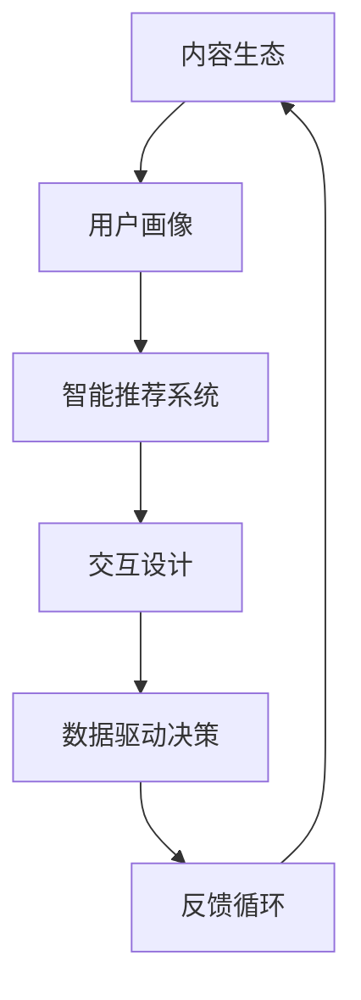

                 

# 知识付费创业中的内容价值链构建

> 关键词：知识付费,内容价值链,知识图谱,智能推荐,用户画像,交互设计

## 1. 背景介绍

### 1.1 问题由来
在互联网高速发展的时代，人们对于知识的渴望愈发强烈，特别是高价值知识的需求显著增加。同时，由于时间碎片化、信息过载等问题，人们对知识获取的质量和效率提出了更高要求。在这样的背景下，知识付费作为一种新型的信息消费方式，应运而生，成为了知识经济的重要组成部分。

然而，知识付费市场也面临着诸多挑战。如何构建高质量的知识内容体系，精准匹配用户需求，提升用户粘性，是知识付费创业成功的关键。本文将围绕“内容价值链”这一核心概念，深入探讨如何通过数据驱动，构建内容价值链，提升知识付费平台的用户价值和运营效率。

### 1.2 问题核心关键点
构建知识付费内容价值链的核心在于以下几个方面：
- **内容生态建设**：构建丰富、多样、高质量的知识内容库，包括视频课程、在线讲座、电子书等多种形式。
- **用户画像构建**：通过数据分析，精准刻画用户画像，了解用户需求和行为特征。
- **智能推荐系统**：基于用户画像和内容特征，构建智能推荐引擎，提升内容匹配精准度。
- **交互设计优化**：通过UI/UX设计，优化用户体验，提高用户满意度和转化率。
- **数据驱动决策**：利用数据洞察，进行持续的业务优化和改进，实现动态调整和个性化推荐。

## 2. 核心概念与联系

### 2.1 核心概念概述

构建知识付费内容价值链，涉及多个关键概念，包括内容生态、用户画像、智能推荐、交互设计和数据驱动决策。这些概念之间的联系和互动，构成了知识付费平台的内容价值链。

- **内容生态**：指知识付费平台提供的各种内容形式，如视频课程、在线讲座、电子书、文章、音频等。这些内容不仅需要高质量，还要具备多样性和原创性，以满足不同用户的需求。
- **用户画像**：指通过数据分析，构建的用户的兴趣、行为、偏好等信息。用户画像可以帮助平台更好地理解用户需求，提供个性化的内容推荐和服务。
- **智能推荐系统**：指基于用户画像和内容特征，构建的智能推荐引擎。其目标是通过算法优化，提升内容的精准匹配度，增加用户粘性。
- **交互设计**：指对知识付费平台的用户界面和交互流程进行优化设计，提升用户体验，降低用户流失率。
- **数据驱动决策**：指利用数据洞察，进行持续的业务优化和改进，提升平台的运营效率和用户满意度。

### 2.2 核心概念原理和架构的 Mermaid 流程图(Mermaid 流程节点中不要有括号、逗号等特殊字符)



这个流程图展示了知识付费内容价值链的核心流程：首先，平台构建内容生态；然后，通过用户画像分析用户需求；接着，基于用户画像和内容特征，构建智能推荐系统；再通过交互设计优化用户体验；最后，利用数据驱动决策进行持续改进，形成一个闭环反馈系统。

## 3. 核心算法原理 & 具体操作步骤

### 3.1 算法原理概述

构建知识付费内容价值链的核心算法原理主要包括以下几个方面：

- **协同过滤算法**：基于用户历史行为数据，通过协同过滤算法，推荐与用户兴趣相似的内容。
- **内容相似度计算**：通过计算内容特征之间的相似度，推荐与用户正在阅读或观看的相关内容。
- **深度学习推荐算法**：利用深度神经网络模型，从大规模数据中学习用户偏好，实现个性化推荐。
- **序列推荐模型**：通过序列预测模型，预测用户未来的内容需求，提供前瞻性推荐。

### 3.2 算法步骤详解

构建知识付费内容价值链的算法步骤可以分为以下几个阶段：

**Step 1: 数据收集与预处理**
- 收集用户行为数据、内容元数据、用户反馈数据等，形成数据仓库。
- 对数据进行清洗、去重、归一化等预处理，确保数据质量。

**Step 2: 用户画像构建**
- 利用用户行为数据，如浏览历史、购买记录、评分反馈等，通过机器学习算法，构建用户画像。
- 使用特征工程方法，提取和构造用户画像的特征向量。

**Step 3: 内容特征提取**
- 对内容数据进行特征提取，如关键词、标签、分类、时长等。
- 通过自然语言处理技术，提取文本内容的语义特征。

**Step 4: 相似度计算与推荐**
- 基于用户画像和内容特征，计算用户与内容的相似度。
- 利用协同过滤算法、内容相似度计算、深度学习推荐算法等，生成推荐结果。
- 对推荐结果进行排序，选取最相关的内容推荐给用户。

**Step 5: 交互设计与用户体验优化**
- 对推荐内容进行UI/UX设计，优化展示方式和交互流程。
- 利用A/B测试等方法，评估不同设计方案的用户体验效果。
- 根据用户反馈，不断迭代改进交互设计。

**Step 6: 数据驱动决策与反馈循环**
- 收集用户对推荐内容的反馈数据，进行数据分析和挖掘。
- 基于反馈数据，调整推荐算法和交互设计，提升用户满意度。
- 形成持续的反馈循环，实现动态调整和持续优化。

### 3.3 算法优缺点

构建知识付费内容价值链的算法主要优点包括：
- **个性化推荐**：通过算法优化，提供高度个性化的内容推荐，提升用户满意度和粘性。
- **数据驱动**：基于数据分析，进行持续优化和改进，提升运营效率和业务效果。
- **自适应性强**：能够根据用户行为和反馈，动态调整推荐策略，适应不同的用户需求。

主要缺点包括：
- **算法复杂度**：协同过滤、深度学习等算法的复杂度较高，需要较高的计算资源和数据量。
- **冷启动问题**：新用户或新内容缺乏历史数据，难以进行精准推荐。
- **数据隐私**：用户行为数据和内容数据需要妥善处理，确保用户隐私安全。

### 3.4 算法应用领域

构建知识付费内容价值链的算法主要应用于以下领域：
- **内容推荐系统**：基于用户画像和内容特征，推荐相关内容，提升内容匹配精准度。
- **个性化广告**：通过用户画像和行为数据，实现精准投放，提升广告效果。
- **电商推荐系统**：利用用户画像和产品特征，推荐商品，提升用户购买转化率。
- **视频推荐系统**：通过视频内容的特征分析和用户行为数据，推荐相关视频内容。
- **新闻推荐系统**：基于用户兴趣和新闻内容，推荐相关新闻，提升用户阅读体验。

## 4. 数学模型和公式 & 详细讲解 & 举例说明

### 4.1 数学模型构建

构建知识付费内容价值链的数学模型主要包括以下几个方面：

- **用户画像模型**：通过用户行为数据，构建用户画像模型，表示为：
$$
P_u = f(X_u)
$$
其中，$P_u$ 为第 $u$ 个用户画像，$X_u$ 为用户行为数据。
- **内容特征模型**：通过内容元数据，构建内容特征模型，表示为：
$$
F_c = g(X_c)
$$
其中，$F_c$ 为第 $c$ 个内容的特征向量，$X_c$ 为内容元数据。
- **相似度计算模型**：计算用户与内容的相似度，表示为：
$$
\text{similarity}(u,c) = h(P_u, F_c)
$$
其中，$h$ 为相似度计算函数，如余弦相似度、欧式距离等。
- **推荐模型**：基于相似度计算结果，构建推荐模型，表示为：
$$
R_u = \phi(\text{similarity}(u,c))
$$
其中，$R_u$ 为用户推荐内容列表，$\phi$ 为推荐函数，如Top-K推荐、序列推荐等。

### 4.2 公式推导过程

以协同过滤算法为例，推导推荐模型的公式。

**用户-物品矩阵**：
$$
R = [r_{ui}]
$$
其中，$r_{ui}$ 为第 $u$ 个用户对第 $i$ 个物品的评分。

**用户画像表示**：
$$
P_u = [p_{u1}, p_{u2}, \ldots, p_{um}]
$$
其中，$p_{uj}$ 为第 $u$ 个用户在第 $j$ 个物品上的评分权重。

**物品特征表示**：
$$
F_i = [f_{i1}, f_{i2}, \ldots, f_{in}]
$$
其中，$f_{ij}$ 为第 $i$ 个物品的第 $j$ 个特征评分权重。

**相似度计算**：
$$
\text{similarity}(u,i) = \sum_{j=1}^m p_{uj} f_{ij}
$$

**推荐模型**：
$$
R_u = \text{rank}(\text{similarity}(u,i))
$$
其中，$\text{rank}$ 为推荐函数，根据相似度计算结果，选择Top-K物品推荐给用户。

### 4.3 案例分析与讲解

**案例1：知识付费平台内容推荐**
假设某知识付费平台有10万个用户，每个用户浏览和购买过100个内容。通过协同过滤算法，计算每个用户与内容的相似度，并选择Top-5推荐内容，推荐给每个用户。

**案例2：电商平台个性化广告**
某电商平台有1000万个用户，每个用户浏览和购买过100个商品。通过协同过滤算法，计算每个用户与商品的相似度，并选择Top-3广告商品，进行个性化投放。

## 5. 项目实践：代码实例和详细解释说明

### 5.1 开发环境搭建

构建知识付费内容价值链，需要搭建一个包含数据存储、处理、计算和展示的全栈平台。以下是一个简化的开发环境搭建流程：

1. **数据存储**
   - 选择关系型数据库（如MySQL）和分布式存储（如Hadoop、Hive），存储用户行为数据和内容元数据。
   - 使用分布式文件系统（如HDFS）存储大规模数据，支持高效的读写和扩展性。

2. **数据处理**
   - 使用ETL工具（如Apache NiFi、Apache Kafka）进行数据采集、清洗和转换。
   - 利用数据仓库（如Apache Hive、Apache Spark）进行数据存储和查询，支持复杂的分析需求。

3. **计算平台**
   - 搭建基于云平台的计算集群（如AWS EMR、Azure Databricks），提供分布式计算能力。
   - 利用机器学习框架（如TensorFlow、PyTorch）进行深度学习和推荐算法建模。

4. **用户界面**
   - 选择前端框架（如React、Vue），搭建Web应用界面。
   - 利用交互设计工具（如Sketch、Adobe XD）进行UI/UX设计，优化用户体验。

5. **部署与运维**
   - 使用容器化技术（如Docker、Kubernetes）进行应用程序部署和运维管理。
   - 利用监控工具（如Grafana、Prometheus）实时监控系统性能和资源使用情况。

### 5.2 源代码详细实现

以下是一个基于Python和TensorFlow的协同过滤推荐系统的示例代码：

```python
import tensorflow as tf
import pandas as pd
import numpy as np

# 读取用户行为数据
data = pd.read_csv('user_behavior.csv')

# 特征工程
user_ids = data['user_id']
item_ids = data['item_id']
ratings = data['rating']

# 构建用户画像矩阵
user_matrix = pd.DataFrame(index=user_ids, columns=item_ids).astype(np.float32)
for u, i, r in zip(user_ids, item_ids, ratings):
    user_matrix.loc[u, i] = r

# 构建内容特征矩阵
content_ids = data['content_id']
content_features = data['content_features']
content_matrix = pd.DataFrame(index=content_ids, columns=content_features).astype(np.float32)
for i, f in zip(content_ids, content_features):
    content_matrix.loc[i, f] = 1

# 计算相似度
user_similarity = np.dot(user_matrix, content_matrix.T) / np.linalg.norm(user_matrix, axis=1) / np.linalg.norm(content_matrix, axis=0)

# 推荐模型
def recommend_top_k(u, k):
    similarity = user_similarity.loc[u].values
    sorted_idx = np.argsort(similarity)[-k:]
    recommendations = content_ids[sorted_idx]
    return recommendations

# 测试推荐模型
user_id = 'u123'
recommendations = recommend_top_k(user_id, 5)
print(recommendations)
```

### 5.3 代码解读与分析

这段代码主要实现了一个基于协同过滤算法的推荐系统，具体步骤如下：
1. **数据读取**：从CSV文件中读取用户行为数据，包含用户ID、物品ID和评分。
2. **特征工程**：构建用户画像矩阵和内容特征矩阵，每个用户对应多个物品，每个物品对应多个特征。
3. **相似度计算**：计算用户与物品之间的相似度，通过矩阵乘法和归一化得到。
4. **推荐模型**：根据相似度计算结果，选择Top-K物品推荐给用户。
5. **测试推荐模型**：通过指定用户ID，获取Top-5推荐物品。

## 6. 实际应用场景

### 6.1 智能教育平台

智能教育平台通过知识付费内容价值链，实现了个性化学习路径的设计和推荐。平台利用用户的学习记录和反馈，构建用户画像，结合深度学习推荐算法，为用户推荐个性化的课程和学习资源，帮助用户高效学习和提高学习效果。

### 6.2 在线课程市场

在线课程市场通过构建知识付费内容价值链，提升了课程推荐和推广的效果。平台利用用户浏览和购买行为数据，构建用户画像，结合内容特征和推荐算法，为用户推荐最符合其兴趣和需求的课程，同时为课程提供精准推广服务，提高用户转化率和课程销售量。

### 6.3 专业技能培训

专业技能培训平台通过构建知识付费内容价值链，实现了技能培训内容的高效匹配和推荐。平台利用专家和用户对培训内容的评分数据，构建用户画像和内容特征，结合协同过滤算法和深度学习推荐算法，为用户推荐最相关的培训课程和技能练习，帮助用户快速掌握专业技能。

### 6.4 未来应用展望

未来，知识付费内容价值链将在更多领域得到应用，为知识服务带来变革性影响。

在智慧医疗领域，通过构建医生与患者之间的知识共享和推荐系统，实现精准医疗和健康管理，提升医疗服务质量和效率。

在智能制造领域，通过构建设备维护和技能培训的知识共享平台，实现设备的智能诊断和维护，提升生产效率和设备使用寿命。

在智能家居领域，通过构建家居设备操作和维护的知识共享平台，实现智能家居设备的个性化定制和高效维护，提升用户的生活品质。

## 7. 工具和资源推荐

### 7.1 学习资源推荐

为了帮助开发者系统掌握知识付费内容价值链的构建方法，这里推荐一些优质的学习资源：

1. **Coursera《机器学习基础》课程**：由斯坦福大学教授Andrew Ng主讲，详细介绍了机器学习的基本概念和算法。
2. **Kaggle平台**：提供丰富的数据集和竞赛，是进行数据科学实践和算法优化的好地方。
3. **GitHub开源项目**：搜索并学习优秀的推荐系统开源项目，如TensorFlow推荐系统、Amazon的协同过滤推荐系统等。
4. **《深度学习》书籍**：由Ian Goodfellow等著，系统介绍了深度学习的基本原理和应用。
5. **《推荐系统》书籍**：由Wang & He等著，详细介绍了推荐系统的内容和算法。

### 7.2 开发工具推荐

构建知识付费内容价值链，需要多种工具的支持。以下是几款常用的开发工具：

1. **Python**：Python是数据科学和机器学习领域的主流语言，有丰富的库和框架支持，如NumPy、Pandas、Scikit-learn等。
2. **TensorFlow**：TensorFlow是Google开发的深度学习框架，支持分布式计算和大规模模型训练。
3. **PyTorch**：PyTorch是Facebook开发的深度学习框架，以动态计算图著称，易于实现和调试。
4. **Hadoop**：Hadoop是Apache基金会开源的分布式计算框架，支持大规模数据处理和存储。
5. **Kubernetes**：Kubernetes是Google开源的容器编排系统，支持应用的自动化部署、扩缩容和管理。
6. **Apache NiFi**：Apache NiFi是一个开源的数据集成工具，支持数据流的自动化采集、处理和路由。

### 7.3 相关论文推荐

知识付费内容价值链的构建涉及多方面的技术和理论，以下是几篇奠基性的相关论文，推荐阅读：

1. **《推荐系统》论文**：由Konstas Giotis等著，详细介绍了协同过滤算法的原理和应用。
2. **《深度学习推荐系统》论文**：由Haifeng Wang等著，介绍了深度学习在推荐系统中的应用。
3. **《知识图谱推荐系统》论文**：由Jian Liu等著，介绍了知识图谱在推荐系统中的应用。
4. **《个性化推荐系统》论文**：由Bing Liu等著，介绍了个性化推荐系统的设计和实现。

## 8. 总结：未来发展趋势与挑战

### 8.1 总结

本文对知识付费内容价值链的构建进行了全面系统的介绍。首先阐述了知识付费内容价值链的构建背景和意义，明确了数据驱动在构建高质量内容生态中的核心作用。其次，从核心算法原理和具体操作步骤，详细讲解了协同过滤、深度学习推荐算法等关键技术，提供了代码实例和详细解释说明。同时，本文还探讨了知识付费内容价值链在智能教育、在线课程市场、专业技能培训等多个领域的应用前景，展示了数据驱动技术在知识服务中的巨大潜力。

通过本文的系统梳理，可以看到，知识付费内容价值链的构建不仅需要算法优化，还需要数据驱动和用户体验优化等多方面的协同工作。只有不断迭代和优化，才能实现高质量、高效率的内容推荐，提升用户满意度和平台运营效率。

### 8.2 未来发展趋势

展望未来，知识付费内容价值链将呈现以下几个发展趋势：

1. **智能化水平提升**：未来的推荐系统将更加智能，能够根据用户的实时行为和反馈，动态调整推荐策略，实现更加个性化的内容推荐。
2. **多模态融合**：结合语音、图像、视频等多模态数据，提升推荐系统的表现力和用户体验。
3. **跨领域应用**：知识付费内容价值链将跨越更多领域，如智慧医疗、智能制造、智能家居等，为不同行业的知识服务带来新的突破。
4. **实时化应用**：通过实时计算和流式数据处理，实现实时推荐和动态调整，提升用户体验和运营效率。
5. **区块链技术应用**：利用区块链技术保障数据隐私和安全，构建可信的知识服务生态。

这些趋势预示着知识付费内容价值链将不断进化，为各行各业的知识服务提供更智能、高效、安全的技术支持。

### 8.3 面临的挑战

尽管知识付费内容价值链在构建和应用中取得了一定的成就，但仍面临着诸多挑战：

1. **数据隐私和安全**：用户行为数据和内容数据需要妥善处理，确保用户隐私和安全。如何设计有效的隐私保护策略，是未来的重要课题。
2. **算法复杂度**：协同过滤、深度学习等算法复杂度较高，需要较高的计算资源和数据量。如何降低算法复杂度，提升推荐效率，是未来的重要研究方向。
3. **冷启动问题**：新用户或新内容缺乏历史数据，难以进行精准推荐。如何解决冷启动问题，是未来的重要课题。
4. **用户多样性**：用户需求和行为特征多样，如何构建通用的推荐算法，适应不同用户需求，是未来的重要研究方向。
5. **用户体验优化**：推荐系统需要不断优化用户体验，减少用户流失，提升用户粘性。如何设计高效的交互设计，优化用户界面，是未来的重要研究方向。

### 8.4 研究展望

面对知识付费内容价值链所面临的挑战，未来的研究需要在以下几个方面寻求新的突破：

1. **跨领域知识图谱**：构建跨领域知识图谱，实现知识图谱与推荐系统的融合，提升推荐系统的表现力。
2. **强化学习推荐**：引入强化学习算法，通过试错机制，提升推荐系统的智能性和优化效率。
3. **多模态融合推荐**：结合语音、图像、视频等多模态数据，提升推荐系统的表现力和用户体验。
4. **实时化推荐**：通过实时计算和流式数据处理，实现实时推荐和动态调整，提升用户体验和运营效率。
5. **区块链技术应用**：利用区块链技术保障数据隐私和安全，构建可信的知识服务生态。

这些研究方向将推动知识付费内容价值链的不断进化，为各行各业的知识服务带来新的突破。只有勇于创新、敢于突破，才能不断拓展知识服务的边界，让智能技术更好地造福人类社会。

## 9. 附录：常见问题与解答

**Q1：知识付费创业中如何构建高质量的内容生态？**

A: 构建高质量的内容生态，需要从内容选择、内容创作、内容审核和内容推荐等多个环节进行综合考虑。具体措施包括：
- 选择权威专家和优质内容，确保内容的质量和权威性。
- 激励内容创作者，提供内容创作平台和奖励机制，吸引优质内容创作。
- 建立内容审核机制，确保内容质量和合规性。
- 利用推荐算法，提升内容匹配精准度，增加用户粘性。

**Q2：知识付费平台如何构建用户画像？**

A: 构建用户画像，需要收集和分析用户的行为数据、兴趣数据和属性数据，可以通过以下步骤实现：
- 收集用户的行为数据，如浏览历史、购买记录、评分反馈等。
- 利用机器学习算法，对行为数据进行特征提取和建模，形成用户画像。
- 根据用户画像，进行个性化推荐和定制化服务。

**Q3：知识付费平台如何优化用户体验？**

A: 优化用户体验，需要从界面设计、交互流程和推荐算法等多个环节进行综合考虑。具体措施包括：
- 界面设计：采用简洁、易用的UI/UX设计，提升用户的视觉体验。
- 交互流程：优化推荐算法和推荐流程，减少用户操作步骤。
- 反馈机制：及时收集用户反馈，进行持续优化和改进。

**Q4：知识付费平台如何实现个性化推荐？**

A: 实现个性化推荐，需要构建高质量的用户画像和内容特征，结合推荐算法进行优化：
- 利用用户行为数据，构建高质量的用户画像。
- 利用内容元数据，提取和构造内容特征。
- 利用协同过滤、深度学习等推荐算法，实现个性化推荐。

**Q5：知识付费平台如何保障数据隐私和安全？**

A: 保障数据隐私和安全，需要从数据存储、数据传输和数据处理等多个环节进行综合考虑。具体措施包括：
- 采用加密技术和数据脱敏技术，保护用户数据隐私。
- 建立数据访问和权限控制机制，限制数据访问权限。
- 利用区块链技术，保障数据传输和存储的安全性。

通过系统回答这些常见问题，可以帮助开发者更好地理解和应用知识付费内容价值链的构建方法，提升平台的运营效率和用户满意度。

---

作者：禅与计算机程序设计艺术 / Zen and the Art of Computer Programming

