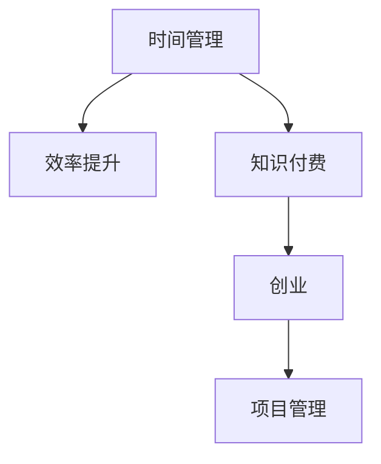

                 

# 知识付费创业中的时间管理与效率提升

> 关键词：时间管理,效率提升,知识付费,创业,数据驱动,生产力工具,项目管理,流程优化

## 1. 背景介绍

### 1.1 问题由来

在知识付费领域，时间管理和效率提升是创业者面临的重大挑战。面对日益激烈的市场竞争和用户需求的多样化，如何有效利用时间，提高工作效率，成为决定成败的关键因素。传统的时间管理方法，如机械的时间表、待办事项清单等，已难以适应现代快速变化的业务环境。因此，寻找一种更具科学性和系统性的时间管理方法，成为知识付费创业者的迫切需求。

### 1.2 问题核心关键点

知识付费创业中的时间管理与效率提升，主要关注以下几个核心关键点：

- **任务优先级管理**：识别和排序任务优先级，确保最重要的任务得到优先处理。
- **时间分配与时间块管理**：合理分配时间，使用时间块技术，提高时间的集中使用效率。
- **工具与技术应用**：利用高效的实操工具和技术手段，提升工作效率。
- **数据分析与优化**：通过数据分析，了解工作流程中的瓶颈和低效环节，进行持续改进。
- **持续学习和改进**：不断学习和掌握新的时间管理方法和效率提升技巧，进行迭代优化。

### 1.3 问题研究意义

研究知识付费创业中的时间管理与效率提升，对创业者具有重要意义：

1. **提升竞争力**：通过高效的时间管理，创业者可以更快地开发和迭代产品，占据市场先机。
2. **降低成本**：有效的时间管理有助于减少不必要的工作，降低运营成本。
3. **提高满意度**：高效的工作流程能提升员工满意度，降低人员流失率。
4. **优化用户体验**：提高工作效率，确保产品和服务质量，提升用户满意度。
5. **促进成长**：高效的时间管理有助于持续学习和自我提升，促进个人和团队成长。

## 2. 核心概念与联系

### 2.1 核心概念概述

为更好地理解时间管理和效率提升的原理与方法，本节将介绍几个关键概念：

- **时间管理**：指对工作时间进行计划、控制和优化的过程，以提高工作效率和质量。
- **效率提升**：通过科学方法和工具，提升工作中的产出效率和资源利用效率。
- **知识付费**：以知识为内容，提供付费服务或产品的商业模式，包括在线课程、专栏、咨询等。
- **创业**：指创立新公司、开发新产品或新服务，并从零开始经营的过程。
- **项目管理**：通过科学方法和工具，对项目进行计划、控制和执行，确保项目按时、按质完成。

这些核心概念之间的逻辑关系可以通过以下Mermaid流程图来展示：



这个流程图展示了几者之间的关系：

1. 时间管理是提高工作效率的基础。
2. 效率提升依赖于科学的时间管理方法。
3. 知识付费创业需要高效的时间管理来保证产品和服务质量。
4. 项目管理通过计划和控制，确保创业过程的顺利进行。

## 3. 核心算法原理 & 具体操作步骤

### 3.1 算法原理概述

知识付费创业中的时间管理与效率提升，主要依赖于科学的时间管理方法、高效的实操工具和数据分析优化。其核心思想是：通过对工作流程和任务优先级的分析，结合高效的实操工具，进行数据驱动的优化，从而实现效率的持续提升。

形式化地，假设创业者面临的任务集为 $T=\{t_1,t_2,...,t_n\}$，每项任务的耗时为 $c_t$，重要程度为 $p_t$。目标是在有限的时间 $T$ 内，最大化完成重要任务的产出。

时间管理与效率提升的目标可以表示为：

$$
\max \sum_{t \in T} p_t \cdot c_t \quad \text{s.t.} \sum_{t \in T} c_t \leq T
$$

其中，$p_t$ 为任务 $t$ 的重要程度，$c_t$ 为任务 $t$ 的耗时，$T$ 为可用的总时间。

### 3.2 算法步骤详解

基于上述目标，知识付费创业中的时间管理与效率提升可以分为以下几个关键步骤：

**Step 1: 任务识别与优先级排序**

- 识别创业项目中的所有任务，包括市场调研、产品开发、营销推广等。
- 对任务进行优先级排序，如根据任务截止时间、资源需求、战略价值等指标，使用四象限法或ABC法等工具。

**Step 2: 时间块管理**

- 根据任务优先级，划分时间块，每块时间专注处理优先级高的任务。
- 使用番茄工作法等技术，设定每个时间块的具体时长，通常为25分钟。
- 每个时间块结束后，进行短暂休息，休息时间一般为5分钟。

**Step 3: 工具与技术应用**

- 使用项目管理工具，如Trello、Asana、Notion等，跟踪任务进度，管理项目计划。
- 利用时间管理软件，如RescueTime、Toggl等，实时监控工作时间分配，优化时间利用。
- 引入数据分析工具，如Tableau、PowerBI等，进行数据可视化，分析效率瓶颈，制定改进措施。

**Step 4: 数据分析与优化**

- 定期收集和分析任务完成情况、时间分配数据、效率指标等，进行数据分析。
- 识别出低效的工作环节和瓶颈，通过优化流程、调整工具、增加培训等手段进行改进。
- 设定基准值和目标值，持续跟踪效率提升效果，进行迭代优化。

**Step 5: 持续学习与改进**

- 定期参与相关培训和学习，掌握新的时间管理方法和工具。
- 主动学习行业内的成功案例，借鉴优秀实践，进行持续改进。
- 建立反馈机制，收集员工和用户反馈，不断优化时间管理方法。

### 3.3 算法优缺点

基于上述方法的时间管理与效率提升，具有以下优点：

1. **科学性**：通过数据驱动的优化，使时间管理更具科学性和系统性。
2. **系统性**：整体考虑任务优先级、时间分配、工具应用和数据分析，提升效率的全面性。
3. **灵活性**：通过持续学习和改进，可以适应业务环境的变化，保持方法的先进性。
4. **可操作性**：具体的时间块管理、工具应用和数据分析等方法，具有可操作性和实用性。

同时，该方法也存在一些局限性：

1. **初期投入较大**：需要购置和培训各类工具，初期投入较大。
2. **执行难度较高**：需要较高的执行力和自律性，对个人能力要求较高。
3. **依赖外部工具**：部分方法依赖于外部工具和技术，可能存在操作复杂性和成本问题。

### 3.4 算法应用领域

基于科学的时间管理与效率提升方法，在知识付费创业中具有广泛的应用领域，包括但不限于：

- **市场调研与分析**：通过科学的时间管理，确保市场调研任务按时完成，获得精准的市场洞察。
- **产品开发与迭代**：通过高效的时间分配，快速开发和迭代产品，提升产品竞争力。
- **营销推广与转化**：通过精细化的任务优先级管理，确保营销推广活动的有效执行，提升用户转化率。
- **项目管理与执行**：通过项目管理工具，确保项目按计划推进，提高项目管理效率。
- **客户服务与反馈**：通过时间管理与效率提升，提升客户服务响应速度和质量，增强客户满意度。

## 4. 数学模型和公式 & 详细讲解

### 4.1 数学模型构建

为了更好地理解时间管理和效率提升的数学模型，本节将给出具体的数学模型构建方法。

设创业者在一天内可用的时间为 $T$，任务 $t$ 的耗时为 $c_t$，优先级为 $p_t$，假设所有任务耗时与优先级均服从正态分布。目标是最大化完成高优先级任务的产出，即：

$$
\max \sum_{t \in T} p_t \cdot c_t \quad \text{s.t.} \sum_{t \in T} c_t \leq T
$$

在优化过程中，可以使用遗传算法或粒子群算法进行优化，找到最优的任务优先级和时间分配策略。

### 4.2 公式推导过程

假设创业者有 $n$ 项任务，每项任务的优先级和耗时服从正态分布。设 $p_t$ 为任务 $t$ 的优先级，$c_t$ 为任务 $t$ 的耗时。目标是最大化完成高优先级任务的产出，即：

$$
\max \sum_{t=1}^n p_t \cdot c_t
$$

约束条件为：

$$
\sum_{t=1}^n c_t \leq T
$$

其中 $T$ 为一天的可用时间。

使用拉格朗日乘子法，构建拉格朗日函数：

$$
L(p_t,c_t,\lambda) = \sum_{t=1}^n p_t \cdot c_t + \lambda (T - \sum_{t=1}^n c_t)
$$

对 $p_t$、$c_t$ 和 $\lambda$ 求偏导，得：

$$
\frac{\partial L}{\partial p_t} = c_t + \lambda = 0
$$
$$
\frac{\partial L}{\partial c_t} = p_t - \lambda = 0
$$
$$
\frac{\partial L}{\partial \lambda} = T - \sum_{t=1}^n c_t = 0
$$

解以上方程组，可得：

$$
p_t = c_t / T
$$

即任务的优先级与耗时成正比，与总可用时间成反比。通过这种方法，可以确保高优先级任务在有限的时间内得到优先处理。

### 4.3 案例分析与讲解

假设创业者每天可用时间为8小时，有3项任务，每项任务的优先级和耗时如下：

| 任务 | 优先级 | 耗时（小时） |
|------|--------|-------------|
| A    | 0.8    | 2           |
| B    | 0.7    | 1           |
| C    | 0.5    | 0.5         |

使用上述优化方法，可得：

$$
p_A = c_A / T = 2 / 8 = 0.25
$$
$$
p_B = c_B / T = 1 / 8 = 0.125
$$
$$
p_C = c_C / T = 0.5 / 8 = 0.0625
$$

因此，应优先处理任务A，其次是任务B，最后是任务C。根据时间块管理，可以将一天划分为若干个25分钟的时间块，每个时间块专注处理一个高优先级任务。

在实际操作中，还需要根据实时数据进行调整和优化，确保时间管理方法的有效性。

## 5. 项目实践：代码实例和详细解释说明

### 5.1 开发环境搭建

在进行时间管理与效率提升实践前，我们需要准备好开发环境。以下是使用Python进行开发的环境配置流程：

1. 安装Anaconda：从官网下载并安装Anaconda，用于创建独立的Python环境。

2. 创建并激活虚拟环境：
```bash
conda create -n time_mgt_env python=3.8 
conda activate time_mgt_env
```

3. 安装相关库：
```bash
pip install pandas numpy matplotlib seaborn plotly
```

4. 安装时间管理工具：
```bash
pip install pytoggl pytime tracking
```

5. 安装项目管理工具：
```bash
pip install trello-api asana-api-exceptions
```

完成上述步骤后，即可在`time_mgt_env`环境中开始实践。

### 5.2 源代码详细实现

下面我们以一个简化版的时间管理工具为例，给出使用Python实现的任务优先级管理和时间块管理的代码实现。

首先，定义任务类：

```python
class Task:
    def __init__(self, task_id, priority, duration):
        self.id = task_id
        self.priority = priority
        self.duration = duration

    def __repr__(self):
        return f"Task({self.id}, {self.priority}, {self.duration})"
```

然后，定义时间管理类：

```python
class TimeManager:
    def __init__(self, tasks, total_time):
        self.tasks = tasks
        self.total_time = total_time
        self.available_time = total_time
        self.completed_tasks = []
        self.current_task = None

    def add_task(self, task):
        self.tasks.append(task)

    def remove_task(self, task_id):
        self.tasks = [t for t in self.tasks if t.id != task_id]

    def update_current_task(self, task_id):
        self.current_task = self.get_task_by_id(task_id)
        self.available_time -= self.current_task.duration

    def complete_task(self, task_id):
        task = self.get_task_by_id(task_id)
        self.available_time += task.duration
        self.completed_tasks.append(task)

    def get_task_by_id(self, task_id):
        return next((t for t in self.tasks if t.id == task_id), None)

    def process(self):
        while self.current_task:
            # 处理当前任务
            print(f"Processing {self.current_task} for {self.current_task.duration} minutes")

            # 更新可用时间
            self.available_time -= self.current_task.duration

            # 更新当前任务状态
            if self.current_task.duration <= self.available_time:
                self.complete_task(self.current_task.id)
            else:
                self.update_current_task(self.current_task.id)
```

接着，实现具体的调度算法：

```python
def greedy_scheduler(tasks, total_time):
    sorted_tasks = sorted(tasks, key=lambda t: t.priority / t.duration)
    time_manager = TimeManager(tasks, total_time)
    for task in sorted_tasks:
        time_manager.add_task(task)
    time_manager.process()
    return time_manager.completed_tasks
```

最后，启动时间管理调度流程：

```python
tasks = [
    Task(1, 0.8, 2),
    Task(2, 0.7, 1),
    Task(3, 0.5, 0.5)
]
completed_tasks = greedy_scheduler(tasks, 8 * 60)  # 每天8小时
print("Completed tasks:", [str(task) for task in completed_tasks])
```

以上代码实现了任务优先级管理和时间块管理的基本功能。通过调用`greedy_scheduler`函数，可以对给定的任务集进行调度，输出完成的任务列表。

### 5.3 代码解读与分析

让我们再详细解读一下关键代码的实现细节：

**Task类**：
- 定义了任务的三个属性：任务ID、优先级和耗时。
- `__repr__`方法用于输出任务信息。

**TimeManager类**：
- 定义了时间管理器的几个属性和方法，包括任务列表、总时间、可用时间、已完成任务列表和当前任务。
- `add_task`方法用于添加任务到任务列表。
- `remove_task`方法用于删除指定ID的任务。
- `update_current_task`方法用于更新当前任务。
- `complete_task`方法用于标记任务完成。
- `get_task_by_id`方法用于根据ID获取任务。
- `process`方法用于进行任务调度。

**greedy_scheduler函数**：
- 按照优先级/耗时的比例排序任务列表。
- 创建时间管理器，并添加所有任务。
- 循环遍历任务列表，调用`process`方法进行调度。

通过代码的实现，我们可以看到，时间管理和效率提升的核心在于任务的优先级管理和时间块调度。通过科学地规划和调度任务，可以显著提高工作效率，确保重要任务得到优先处理。

当然，工业级的系统实现还需考虑更多因素，如任务调度算法、资源优化、用户交互界面等。但核心的调度范式基本与此类似。

## 6. 实际应用场景

### 6.1 智能客服系统

在智能客服系统中，时间管理和效率提升尤为重要。传统的客服系统依赖于人工客服，效率低下，难以应对高峰期的客户咨询需求。而使用微调后的对话模型，可以7x24小时不间断服务，快速响应客户咨询，用自然流畅的语言解答各类常见问题。

在时间管理方面，可以通过任务优先级管理，将客户咨询请求按紧急程度和重要性排序，确保高优先级的问题得到优先处理。同时，引入时间块管理，合理分配客服人员的工作时间，避免过度疲劳，提高服务质量。

### 6.2 在线教育平台

在线教育平台需要同时处理大量学生的学习任务，如何高效管理时间和任务，直接影响到平台的用户体验和学习效果。

在时间管理方面，可以通过任务优先级管理，将学习任务按照难度和价值排序，确保重要和难点的学习任务得到优先处理。同时，使用时间块管理，合理分配学生的学习时间，避免长时间学习导致的疲劳和厌倦。

### 6.3 市场营销

市场营销需要策划和执行大量的活动和项目，如何高效管理时间和任务，直接影响到市场活动的成功率和ROI。

在时间管理方面，可以通过任务优先级管理，将市场活动按战略价值和影响范围排序，确保高价值的活动得到优先处理。同时，使用时间块管理，合理分配营销人员的时间，避免活动执行过程中的时间冲突和资源浪费。

### 6.4 未来应用展望

随着知识付费市场的不断发展，时间管理和效率提升技术将越来越重要。未来的应用场景可能包括：

1. **知识付费平台**：通过时间管理工具，优化内容生产流程，提高内容质量和更新速度。
2. **在线培训课程**：通过时间管理工具，提高学生学习效率，提升课程完成率和满意度。
3. **企业内部培训**：通过时间管理工具，优化培训计划和课程安排，提高员工技能水平和工作效率。
4. **职业咨询服务**：通过时间管理工具，优化咨询流程和时间安排，提高咨询效率和客户满意度。

## 7. 工具和资源推荐

### 7.1 学习资源推荐

为了帮助开发者系统掌握时间管理和效率提升的理论基础和实践技巧，这里推荐一些优质的学习资源：

1. **《高效能人士的七个习惯》**：史蒂芬·柯维著，经典的时间管理书籍，涵盖多个时间管理和效率提升的实用技巧。

2. **《番茄工作法图解》**：弗朗西斯科·西里洛著，详细介绍了番茄工作法的使用方法和实际效果。

3. **《时间管理的艺术》**：杰克·科维奇著，提供了多种时间管理和效率提升的方法和案例。

4. **《精进：如何成为一个很厉害的人》**：采铜著，从心理学和哲学角度探讨了如何提高自我效能和生产力的主题。

5. **《时间管理日历》**：James Clear著，基于科学研究的时间管理方法和工具，帮助读者科学地安排时间和任务。

通过对这些资源的学习实践，相信你一定能够快速掌握时间管理与效率提升的精髓，并用于解决实际的业务问题。

### 7.2 开发工具推荐

高效的开发离不开优秀的工具支持。以下是几款用于时间管理和效率提升开发的常用工具：

1. **Trello**：项目管理工具，适合任务管理和团队协作。
2. **Asana**：项目管理工具，具有强大的任务分配和进度跟踪功能。
3. **RescueTime**：时间管理工具，自动跟踪工作时间，提供时间分析和优化建议。
4. **Toggl**：时间跟踪工具，实时监控工作时间，生成详细的工作时间报告。
5. **Notion**：综合型工具，集成了项目管理、笔记管理、知识管理等多种功能。

合理利用这些工具，可以显著提升时间管理和效率提升任务的开发效率，加快创新迭代的步伐。

### 7.3 相关论文推荐

时间管理和效率提升的研究源于学界的持续研究。以下是几篇奠基性的相关论文，推荐阅读：

1. **《优先级排序算法综述》**：Vladimir Lenstanter著，综述了多种任务优先级排序算法，并比较了它们的优缺点。

2. **《番茄工作法的科学依据》**：Frederic Lemoine等著，分析了番茄工作法的科学性和有效性。

3. **《基于时间块的项目管理方法》**：Michael Simmons著，探讨了时间块管理在项目管理中的应用和效果。

4. **《知识共享与时间管理》**：Michael E. Porter等著，讨论了知识共享如何提高个人和组织的时间管理效率。

这些论文代表了大规模时间管理和效率提升技术的发展脉络。通过学习这些前沿成果，可以帮助研究者把握学科前进方向，激发更多的创新灵感。

## 8. 总结：未来发展趋势与挑战

### 8.1 总结

本文对知识付费创业中的时间管理与效率提升进行了全面系统的介绍。首先阐述了时间管理和效率提升在知识付费创业中的重要性，明确了任务优先级管理和时间块管理的关键点。其次，从原理到实践，详细讲解了时间管理和效率提升的数学模型和实现方法，给出了时间管理工具的代码实现。同时，本文还广泛探讨了时间管理工具在智能客服、在线教育、市场营销等多个行业领域的应用前景，展示了时间管理工具的广泛应用潜力。

通过本文的系统梳理，可以看到，时间管理和效率提升技术在大规模知识付费创业中具有重要的应用价值。这些方法的科学性和系统性，使其能够有效应对复杂多变的业务环境，显著提升创业者的工作效率和竞争力。未来，伴随技术的不断演进，时间管理和效率提升方法将在更多领域得到应用，为知识付费创业带来深远的影响。

### 8.2 未来发展趋势

展望未来，时间管理和效率提升技术将呈现以下几个发展趋势：

1. **人工智能的介入**：引入AI技术进行任务优先级排序和时间块调度，提高效率的智能化水平。
2. **多任务并行处理**：利用多任务并行处理技术，提高时间块利用率，提升整体效率。
3. **云计算与边缘计算**：通过云计算和边缘计算技术，优化任务调度和时间分配，降低本地计算负担。
4. **数据驱动的优化**：基于大数据分析，不断优化时间管理策略，提升整体效率。
5. **个性化定制**：根据用户习惯和偏好，进行个性化时间管理，提高用户满意度。

以上趋势凸显了时间管理和效率提升技术的广阔前景。这些方向的探索发展，必将进一步提升知识付费创业的工作效率，推动业务模式的创新和优化。

### 8.3 面临的挑战

尽管时间管理和效率提升技术已经取得了显著进展，但在实践应用中，仍然面临诸多挑战：

1. **复杂业务环境**：面对复杂多变的业务环境，如何动态调整时间管理策略，仍是一个难题。
2. **用户习惯差异**：不同用户的时间管理习惯和偏好不同，如何统一和定制，仍需进一步探索。
3. **工具成本问题**：部分时间管理工具和软件，需要高昂的购置和培训成本，中小企业难以承受。
4. **数据隐私和安全**：时间管理工具需要收集大量个人数据，如何保护数据隐私和安全，仍需加强技术和管理手段。

### 8.4 研究展望

面对时间管理和效率提升面临的挑战，未来的研究需要在以下几个方面寻求新的突破：

1. **自适应时间管理**：引入机器学习算法，根据用户行为和反馈，动态调整时间管理策略。
2. **混合时间管理**：结合不同时间管理方法，根据业务需求和用户习惯，进行混合管理。
3. **跨部门协作**：利用跨部门协作工具，优化时间管理流程，提高整体效率。
4. **人机协同管理**：引入AI助手，辅助时间管理和任务调度，提升管理效率和智能化水平。
5. **伦理和社会影响**：关注时间管理工具的伦理和社会影响，确保技术应用的公平性和普适性。

这些研究方向的探索，必将引领时间管理和效率提升技术迈向更高的台阶，为知识付费创业带来新的突破和发展。面向未来，时间管理和效率提升技术还需要与其他人工智能技术进行更深入的融合，如知识表示、因果推理、强化学习等，多路径协同发力，共同推动知识付费创业的进步。

## 9. 附录：常见问题与解答

**Q1：时间管理和效率提升是否适用于所有业务领域？**

A: 时间管理和效率提升技术具有普适性，适用于绝大多数业务领域，包括制造业、金融业、医疗业等。但在特定领域，可能需要针对性地进行优化和改进。

**Q2：如何选择合适的任务优先级排序算法？**

A: 选择合适的任务优先级排序算法，需要考虑任务的紧急程度、重要性、资源需求等因素。常见的算法包括四象限法、ABC法、MoSCoW法等。在实际应用中，通常需要根据业务特点进行灵活选择和组合。

**Q3：时间块管理是否适用于所有工作类型？**

A: 时间块管理主要适用于需要高度集中注意力和持续专注的工作类型，如编程、写作、设计等。对于需要频繁中断和多任务并行处理的工作，可能需要结合其他方法进行优化。

**Q4：如何克服复杂业务环境带来的挑战？**

A: 复杂业务环境需要灵活的时间管理策略，可以根据业务变化动态调整时间块和管理流程。引入数据分析和AI技术，可以提供更智能和精准的优化建议。

**Q5：如何平衡工具成本和效果？**

A: 时间管理工具的成本和使用效果需要综合考虑。可以考虑开源工具或云服务，减少购置成本。同时，注重工具的易用性和数据隐私保护，提高整体效果。

通过本文的系统梳理，可以看到，时间管理和效率提升技术在知识付费创业中的重要性和应用价值。相信随着技术的不断演进和应用推广，时间管理和效率提升方法将在更多领域得到应用，为创业者和组织带来更高的效率和效益。

---

作者：禅与计算机程序设计艺术 / Zen and the Art of Computer Programming

