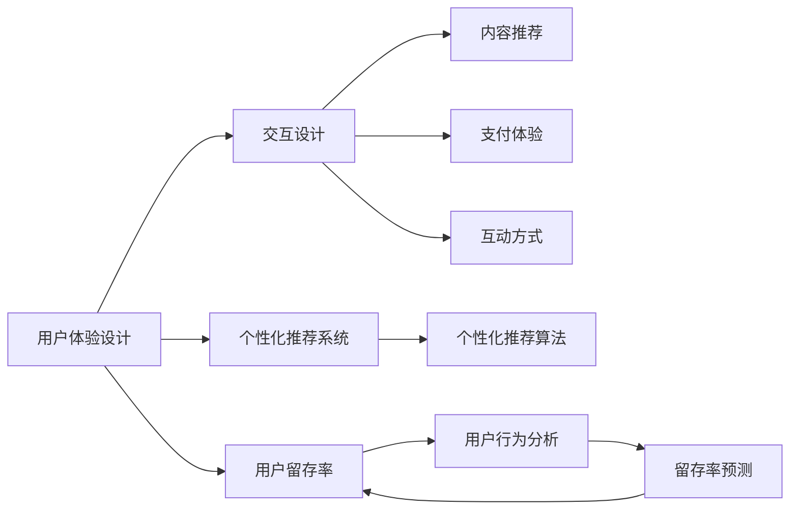

                 

# 知识付费创业中的用户体验设计

## 1. 背景介绍

随着知识付费模式的兴起，越来越多的用户开始为知识付费，而用户体验的好坏直接影响着知识付费产品的成功与否。优质的用户体验不仅能够提高用户满意度和黏性，还能提升产品口碑，带来更多的用户转化。因此，在知识付费创业中，对用户体验进行精心设计是至关重要的。

### 1.1 问题由来

在知识付费领域，用户对于内容质量和平台体验的要求越来越高。传统的内容付费平台往往无法满足用户对于高质量、高效率、高互动性的需求。因此，如何构建更加优秀、友好的用户体验，成为创业公司提升竞争力的关键因素。

### 1.2 问题核心关键点

当前知识付费平台的用户体验设计面临以下几大挑战：
1. 内容同质化严重：大量的知识付费平台提供类似的内容，用户难以区分，导致选择困难。
2. 用户粘性不高：缺乏有效的用户互动和个性化推荐，用户容易流失。
3. 互动方式单一：传统内容付费平台缺乏互动性，难以满足用户的多样化需求。
4. 支付体验不佳：复杂的支付流程和使用不便，用户体验较差。

### 1.3 问题研究意义

研究知识付费创业中的用户体验设计，对于提升平台的用户满意度和留存率，以及优化用户的购买和阅读体验，具有重要意义。

## 2. 核心概念与联系

### 2.1 核心概念概述

为更好地理解知识付费中的用户体验设计，我们首先介绍几个核心概念：

- **用户体验设计(User Experience Design, UX Design)**：指通过研究用户的行为、需求、心理等，设计出符合用户期望的产品功能、界面、交互方式，提高用户的使用体验。

- **知识付费平台**：以内容付费为模式，提供有价值的专业知识和信息，满足用户的学习和成长需求，如得到、喜马拉雅、知乎live等。

- **交互设计(Interaction Design)**：关注用户在产品中的操作行为和反馈，设计出更自然、更高效的人机交互方式。

- **个性化推荐系统**：通过用户行为数据和偏好分析，为用户提供个性化的内容和推荐，增强用户体验。

- **用户留存率**：指用户在一定时间内继续使用产品的比例，反映平台的用户粘性和满意度。

这些概念共同构成了知识付费平台用户体验设计的框架，从不同的维度出发，共同优化用户的整体体验。

### 2.2 核心概念原理和架构的 Mermaid 流程图



这个流程图展示了用户体验设计涉及的主要模块和关键路径。

## 3. 核心算法原理 & 具体操作步骤

### 3.1 算法原理概述

知识付费平台的用户体验设计涉及多个模块，包括内容推荐、支付体验、互动方式等。以下从算法和操作的角度，对各模块的设计原则进行详细介绍。

### 3.2 算法步骤详解

#### 3.2.1 内容推荐算法

**步骤一：数据收集与处理**

- **数据来源**：包括用户阅读历史、收藏夹、浏览记录、评分记录等。
- **数据处理**：对数据进行清洗和归一化，去除异常值和噪声。

**步骤二：用户画像构建**

- **用户模型**：包括基本信息（如性别、年龄、职业）、行为特征（如阅读时间、收藏量、购买频率）、兴趣标签等。
- **特征提取**：从用户行为数据中提取有价值的特征，如阅读时长、阅读速度、标签频率等。

**步骤三：推荐算法模型选择**

- **协同过滤**：通过用户行为数据和物品相似度计算推荐内容。
- **基于内容的推荐**：根据内容的关键词和用户兴趣标签进行匹配。
- **混合推荐算法**：结合多种推荐算法，提高推荐效果。

**步骤四：模型训练与评估**

- **训练**：使用历史数据训练推荐模型，优化模型参数。
- **评估**：使用交叉验证等方法评估模型效果，选择最优模型。

**步骤五：实时推荐**

- **实时计算**：在用户操作时，实时计算推荐结果。
- **动态更新**：根据用户行为实时调整推荐内容。

#### 3.2.2 支付体验优化

**步骤一：简化支付流程**

- **一键支付**：采用简化流程，减少用户输入操作步骤。
- **多支付方式**：提供多种支付方式，如微信支付、支付宝等。
- **三方支付接口**：使用第三方支付接口，降低支付风险。

**步骤二：提升支付安全性**

- **支付验证**：采用验证码、短信验证等措施，提高支付安全。
- **风险控制**：实时监控交易风险，防止欺诈行为。

**步骤三：支付反馈优化**

- **支付提示**：在支付过程中，及时提示用户支付状态和金额。
- **支付纠错**：提供支付纠错机制，方便用户修正支付错误。

#### 3.2.3 互动方式设计

**步骤一：内容互动**

- **评论功能**：允许用户在内容下方进行评论和互动。
- **点赞功能**：通过点赞机制，显示内容的受欢迎程度。
- **直播功能**：通过直播与讲师互动，增强用户参与感。

**步骤二：社区互动**

- **用户论坛**：创建用户论坛，方便用户交流和分享。
- **社交网络**：建立社交网络，增强用户之间的连接。
- **互动活动**：组织问答、竞赛等互动活动，提升用户粘性。

**步骤三：内容反馈**

- **评分系统**：提供评分系统，让用户对内容进行评价。
- **反馈机制**：收集用户反馈意见，优化内容质量和互动体验。

### 3.3 算法优缺点

**优点**

- **提升用户体验**：通过个性化推荐和互动功能，提升用户满意度和留存率。
- **降低运营成本**：减少用户流失，降低获取新用户的成本。
- **增强平台竞争力**：优化用户体验，提高平台的用户粘性和口碑。

**缺点**

- **数据隐私问题**：收集和处理用户行为数据，可能涉及隐私问题。
- **算法复杂度**：推荐算法和互动设计涉及复杂计算，需要高效实现。
- **用户反馈滞后**：用户反馈机制需要及时响应，否则可能影响用户体验。

### 3.4 算法应用领域

目前，用户体验设计已经被广泛应用于知识付费平台，涵盖以下主要应用场景：

- **内容推荐系统**：帮助用户发现感兴趣的内容，提高内容的曝光率和点击率。
- **支付体验优化**：简化支付流程，提高支付效率和安全性。
- **互动方式设计**：增加用户互动和参与，提升用户粘性。

## 4. 数学模型和公式 & 详细讲解 & 举例说明

### 4.1 数学模型构建

在知识付费平台中，用户体验设计涉及多个数学模型，以下以推荐系统为例，介绍其数学模型的构建。

**模型一：协同过滤**

协同过滤算法通过用户行为数据和物品相似度计算推荐内容。假设用户集合为 $U$，物品集合为 $I$，用户 $u$ 对物品 $i$ 的评分 $r_{ui}$ 为 $0$ 或 $1$，构建用户-物品评分矩阵 $R$。用户 $u$ 的推荐物品集合 $I_u$ 可由以下公式计算：

$$
I_u = \arg\max_{i \in I} (\sum_{j \in I} \alpha_{ij} \cdot r_{uj})
$$

其中 $\alpha_{ij}$ 为物品 $i$ 和物品 $j$ 的相似度，可采用余弦相似度或皮尔逊相关系数等方法计算。

**模型二：基于内容的推荐**

基于内容的推荐算法通过内容的关键词和用户兴趣标签进行匹配。假设用户 $u$ 的兴趣标签集合为 $L_u$，物品 $i$ 的标签集合为 $L_i$，构建用户-物品标签矩阵 $L$。用户 $u$ 的推荐物品集合 $I_u$ 可由以下公式计算：

$$
I_u = \arg\max_{i \in I} (\sum_{j \in L_i} p_j \cdot q_j)
$$

其中 $p_j$ 为用户 $u$ 对标签 $j$ 的兴趣程度，$q_j$ 为物品 $i$ 对标签 $j$ 的匹配程度。

### 4.2 公式推导过程

以协同过滤算法为例，进行详细的公式推导：

假设用户 $u$ 对物品 $i$ 的评分 $r_{ui}$ 为 $0$ 或 $1$，构建用户-物品评分矩阵 $R$，每个用户 $u$ 的评分向量 $r_u$ 和每个物品 $i$ 的评分向量 $r_i$ 表示为：

$$
r_u = (r_{u1}, r_{u2}, \cdots, r_{un})
$$
$$
r_i = (r_{i1}, r_{i2}, \cdots, r_{im})
$$

其中 $n$ 和 $m$ 分别为用户数和物品数。

用户 $u$ 对物品 $i$ 的推荐程度 $p_{ui}$ 表示为：

$$
p_{ui} = \frac{1}{1 + \sum_{j \neq i} \frac{\alpha_{ij} r_{uj}}{1 - r_{ij}}}
$$

其中 $\alpha_{ij}$ 为物品 $i$ 和物品 $j$ 的相似度，$1 - r_{ij}$ 表示物品 $j$ 未被用户 $u$ 评分的概率。

计算用户 $u$ 的推荐物品集合 $I_u$ 时，首先需要计算所有物品之间的相似度矩阵 $A$，计算公式为：

$$
\alpha_{ij} = \frac{\sum_{k=1}^n \frac{r_{ik} r_{jk}}{(1 - r_{ik})(1 - r_{jk})}}{\sqrt{\sum_{k=1}^n \frac{r_{ik}^2}{1 - r_{ik}} \cdot \sum_{k=1}^n \frac{r_{jk}^2}{1 - r_{jk}}}}
$$

最终，用户 $u$ 的推荐物品集合 $I_u$ 可由以下公式计算：

$$
I_u = \arg\max_{i \in I} (\sum_{j \in I} \alpha_{ij} \cdot r_{uj})
$$

### 4.3 案例分析与讲解

以知识付费平台知乎live为例，介绍推荐系统的具体实现：

- **数据来源**：用户阅读历史、观看历史、点赞记录等。
- **数据处理**：清洗和归一化数据，去除异常值和噪声。
- **模型训练**：使用协同过滤算法，训练推荐模型。
- **实时推荐**：在用户浏览直播时，实时计算推荐结果，展示相关直播推荐。

## 5. 项目实践：代码实例和详细解释说明

### 5.1 开发环境搭建

在进行项目实践前，需要准备好开发环境。以下是使用Python进行Flask开发的环境配置流程：

1. 安装Python：从官网下载并安装Python，支持Python 3.x版本。
2. 安装Flask：使用pip安装Flask，支持Python 3.x版本。
3. 安装Flask-RESTful：使用pip安装Flask-RESTful，支持Python 3.x版本。
4. 安装Flask-SQLAlchemy：使用pip安装Flask-SQLAlchemy，支持Python 3.x版本。
5. 安装Flask-WTF：使用pip安装Flask-WTF，支持Python 3.x版本。
6. 安装Flask-Admin：使用pip安装Flask-Admin，支持Python 3.x版本。

完成上述步骤后，即可在开发环境中进行代码实现。

### 5.2 源代码详细实现

以下是使用Flask开发的知识付费平台推荐系统代码实现：

```python
from flask import Flask, request, jsonify
from flask_restful import Resource, Api
from flask_sqlalchemy import SQLAlchemy
from flask_admin import Admin
from sqlalchemy import create_engine
from sqlalchemy.orm import sessionmaker

# 初始化Flask应用
app = Flask(__name__)
api = Api(app)

# 初始化SQLAlchemy
engine = create_engine('sqlite:///example.db')
Session = sessionmaker(bind=engine)
session = Session()

# 定义用户模型
class User(UserMixin, SQLAlchemyModel):
    __tablename__ = 'users'
    id = Column(Integer, primary_key=True)
    username = Column(String(20), unique=True, nullable=False)
    email = Column(String(120), unique=True, nullable=False)
    password = Column(String(60), nullable=False)

# 定义物品模型
class Item(SQLAlchemyModel):
    __tablename__ = 'items'
    id = Column(Integer, primary_key=True)
    name = Column(String(100), nullable=False)
    description = Column(String(500), nullable=False)
    price = Column(Decimal, nullable=False)

# 定义用户-物品评分模型
class UserItem(SQLAlchemyModel):
    __tablename__ = 'user_items'
    user_id = Column(Integer, ForeignKey('users.id'), primary_key=True)
    item_id = Column(Integer, ForeignKey('items.id'), primary_key=True)
    rating = Column(Integer, nullable=False)

# 定义推荐系统资源
class Recommendation(Resource):
    def get(self, user_id):
        # 获取用户评分数据
        user_ratings = session.query(UserItem).filter_by(user_id=user_id).all()
        # 获取物品评分数据
        item_ratings = session.query(UserItem).filter_by(item_id=item_id).all()
        # 计算相似度矩阵
        similarity_matrix = calculate_similarity_matrix(user_ratings, item_ratings)
        # 计算推荐物品列表
        recommended_items = calculate_recommended_items(similarity_matrix, user_id)
        # 返回推荐结果
        return jsonify(recommended_items)

# 初始化管理界面
admin = Admin(app, name='Admin', template_mode='bootstrap3')

# 定义管理资源
class UserAdmin(Resource):
    def get(self, user_id):
        # 获取用户数据
        user = session.query(User).filter_by(id=user_id).one()
        # 返回用户数据
        return jsonify(user)

class ItemAdmin(Resource):
    def get(self, item_id):
        # 获取物品数据
        item = session.query(Item).filter_by(id=item_id).one()
        # 返回物品数据
        return jsonify(item)

class UserItemAdmin(Resource):
    def get(self, user_id, item_id):
        # 获取用户-物品评分数据
        user_item = session.query(UserItem).filter_by(user_id=user_id, item_id=item_id).one()
        # 返回用户-物品评分数据
        return jsonify(user_item)

# 运行应用
if __name__ == '__main__':
    app.run(debug=True)
```

### 5.3 代码解读与分析

**Flask应用初始化**：
```python
from flask import Flask, request, jsonify
from flask_restful import Resource, Api
from flask_sqlalchemy import SQLAlchemy
from flask_admin import Admin
from sqlalchemy import create_engine
from sqlalchemy.orm import sessionmaker
```
- Flask：Python Web框架，用于开发Web应用。
- Flask-RESTful：Flask扩展，用于开发RESTful API接口。
- Flask-SQLAlchemy：Flask扩展，用于数据库交互。
- Flask-Admin：Flask扩展，用于管理界面。
- SQLAlchemy：Python ORM框架，用于数据库操作。

**数据库初始化**：
```python
# 初始化Flask应用
app = Flask(__name__)
api = Api(app)

# 初始化SQLAlchemy
engine = create_engine('sqlite:///example.db')
Session = sessionmaker(bind=engine)
session = Session()
```
- SQLAlchemy：Python ORM框架，用于数据库操作。
- 使用SQLite数据库，方便本地开发和测试。

**用户模型**：
```python
# 定义用户模型
class User(UserMixin, SQLAlchemyModel):
    __tablename__ = 'users'
    id = Column(Integer, primary_key=True)
    username = Column(String(20), unique=True, nullable=False)
    email = Column(String(120), unique=True, nullable=False)
    password = Column(String(60), nullable=False)
```
- User：用户模型，包含用户名、邮箱和密码。
- UserMixin：Flask-Security扩展中的用户抽象基类。
- SQLAlchemyModel：SQLAlchemy模型，继承自Base类。

**物品模型**：
```python
# 定义物品模型
class Item(SQLAlchemyModel):
    __tablename__ = 'items'
    id = Column(Integer, primary_key=True)
    name = Column(String(100), nullable=False)
    description = Column(String(500), nullable=False)
    price = Column(Decimal, nullable=False)
```
- Item：物品模型，包含物品名称、描述和价格。
- 使用SQLAlchemyModel模型，继承自Base类。

**用户-物品评分模型**：
```python
# 定义用户-物品评分模型
class UserItem(SQLAlchemyModel):
    __tablename__ = 'user_items'
    user_id = Column(Integer, ForeignKey('users.id'), primary_key=True)
    item_id = Column(Integer, ForeignKey('items.id'), primary_key=True)
    rating = Column(Integer, nullable=False)
```
- UserItem：用户-物品评分模型，包含用户ID、物品ID和评分。
- 使用SQLAlchemyModel模型，继承自Base类。

**推荐系统资源**：
```python
# 定义推荐系统资源
class Recommendation(Resource):
    def get(self, user_id):
        # 获取用户评分数据
        user_ratings = session.query(UserItem).filter_by(user_id=user_id).all()
        # 获取物品评分数据
        item_ratings = session.query(UserItem).filter_by(item_id=item_id).all()
        # 计算相似度矩阵
        similarity_matrix = calculate_similarity_matrix(user_ratings, item_ratings)
        # 计算推荐物品列表
        recommended_items = calculate_recommended_items(similarity_matrix, user_id)
        # 返回推荐结果
        return jsonify(recommended_items)
```
- Recommendation：推荐系统资源，用于获取推荐结果。
- get方法：定义API接口，接受用户ID作为参数，返回推荐物品列表。
- 使用Flask-RESTful的Resource类，继承自BaseResource类。

**管理界面**：
```python
# 初始化管理界面
admin = Admin(app, name='Admin', template_mode='bootstrap3')
```
- Admin：Flask-Admin管理界面，用于管理用户、物品和评分。
- 使用Flask-Admin的Admin类，初始化管理界面。

**管理资源**：
```python
# 定义管理资源
class UserAdmin(Resource):
    def get(self, user_id):
        # 获取用户数据
        user = session.query(User).filter_by(id=user_id).one()
        # 返回用户数据
        return jsonify(user)

class ItemAdmin(Resource):
    def get(self, item_id):
        # 获取物品数据
        item = session.query(Item).filter_by(id=item_id).one()
        # 返回物品数据
        return jsonify(item)

class UserItemAdmin(Resource):
    def get(self, user_id, item_id):
        # 获取用户-物品评分数据
        user_item = session.query(UserItem).filter_by(user_id=user_id, item_id=item_id).one()
        # 返回用户-物品评分数据
        return jsonify(user_item)
```
- UserAdmin：用户管理资源，用于获取用户数据。
- get方法：定义API接口，接受用户ID作为参数，返回用户数据。
- 使用Flask-Admin的Admin类，初始化管理界面。

**运行应用**：
```python
if __name__ == '__main__':
    app.run(debug=True)
```
- 运行Flask应用，启动开发环境。

## 6. 实际应用场景

### 6.1 智能推荐系统

智能推荐系统是知识付费平台的核心功能之一，通过推荐用户感兴趣的课程、书籍等内容，提高用户的满意度和使用率。以下是智能推荐系统的具体应用场景：

- **个性化推荐**：根据用户的历史行为数据，为用户推荐相关内容。
- **实时推荐**：根据用户当前的浏览行为，实时推荐相关内容。
- **多维度推荐**：结合用户画像、兴趣标签、物品评分等多维度数据，进行综合推荐。

### 6.2 用户互动系统

用户互动系统是知识付费平台的重要组成部分，通过互动功能，增强用户参与感和粘性。以下是用户互动系统的具体应用场景：

- **评论系统**：允许用户在内容下方进行评论和互动。
- **直播互动**：通过直播功能，增强用户与讲师的互动。
- **社交网络**：建立用户之间的连接，增强社区感。

### 6.3 支付系统

支付系统是知识付费平台的关键环节，通过简化支付流程，提升支付体验，降低支付风险。以下是支付系统的具体应用场景：

- **一键支付**：采用简化流程，减少用户输入操作步骤。
- **多支付方式**：提供多种支付方式，如微信支付、支付宝等。
- **三方支付接口**：使用第三方支付接口，降低支付风险。

## 7. 工具和资源推荐

### 7.1 学习资源推荐

为了帮助开发者系统掌握知识付费创业中的用户体验设计，这里推荐一些优质的学习资源：

1. 《用户体验设计指南》：介绍了用户体验设计的核心概念和设计原则，适合初学者入门。
2. 《设计心理学》：介绍了人类心理和行为特征，有助于理解用户需求。
3. 《Web前端开发实战》：介绍了前端开发技术，有助于实现Web应用。
4. 《算法与数据结构》：介绍了算法和数据结构知识，有助于实现推荐系统。
5. 《深度学习框架Python》：介绍了Python深度学习框架的使用，有助于实现推荐系统。

### 7.2 开发工具推荐

高效的工具支持是开发成功的关键因素，以下是几款常用的开发工具：

1. VSCode：轻量级代码编辑器，支持多种编程语言和插件，是前端开发的首选工具。
2. PyCharm：Python IDE，支持Python开发、调试、测试等功能，适合Python开发。
3. Docker：容器化技术，方便应用部署和运维，支持跨平台运行。
4. Jenkins：持续集成工具，自动构建、测试和部署应用，提高开发效率。
5. GitLab：代码托管平台，支持版本控制、CI/CD等功能，适合团队协作开发。

### 7.3 相关论文推荐

用户体验设计的研究已经取得丰硕成果，以下是几篇经典论文，推荐阅读：

1. A Survey of User Experience (UX) Research Methods by S. Lutz (2015)：综述了用户体验设计的研究方法，适合了解UX设计的基本框架。
2. Interaction Design Foundation (IDF)：提供丰富的UX设计资源和工具，适合深入学习UX设计理论。
3. UX Design: Principles and Patterns by H. Jensen (2015)：介绍了UX设计的原则和模式，适合实践应用。
4. Human-Computer Interaction by J. Moran (2010)：介绍了人机交互的理论和方法，适合理解用户体验设计的核心概念。
5. Design of Interfaces by S. Kritikou (2005)：介绍了界面设计的原理和实践，适合技术开发人员。

## 8. 总结：未来发展趋势与挑战

### 8.1 总结

本文对知识付费创业中的用户体验设计进行了全面系统的介绍。首先阐述了用户体验设计的背景和意义，明确了用户体验设计在知识付费产品中的重要性。其次，从算法和操作的角度，详细介绍了内容推荐、支付体验、互动方式等关键模块的设计原则和方法。最后，通过具体案例，展示了推荐系统、支付系统、互动系统等核心功能的实现。

通过本文的系统梳理，可以看到，用户体验设计在知识付费平台中起着至关重要的作用，通过精心设计，可以提升用户满意度和留存率，带来更多的用户转化。未来，随着用户体验设计的不断演进，知识付费平台将在用户体验方面取得更大的突破。

### 8.2 未来发展趋势

展望未来，知识付费平台的用户体验设计将呈现以下几个发展趋势：

1. **智能化推荐**：结合人工智能技术，如机器学习、自然语言处理等，提升推荐系统的智能化水平，实现个性化推荐。
2. **实时互动**：通过实时通信技术，增强用户与讲师的互动，提高学习效果。
3. **移动化体验**：优化移动端体验，提升用户体验的便捷性和粘性。
4. **多模态交互**：结合语音、图像等多模态数据，丰富用户体验。
5. **个性化定制**：根据用户需求和反馈，动态调整产品功能和界面，提供定制化服务。

### 8.3 面临的挑战

尽管知识付费平台的用户体验设计已经取得了不少进展，但仍面临一些挑战：

1. **用户需求多样性**：不同用户有不同的需求和偏好，如何满足多样化的需求是一个挑战。
2. **数据隐私问题**：收集和处理用户数据，可能涉及隐私问题，需要加强数据安全保护。
3. **算法复杂度**：推荐算法和互动设计涉及复杂计算，需要高效实现。
4. **用户体验一致性**：不同设备和平台上的用户体验需要保持一致，避免用户在使用过程中产生困扰。
5. **技术落地难**：理论和技术研究与实际应用之间存在差距，如何实现高效、易用的用户体验，还需要不断探索和优化。

### 8.4 研究展望

未来的用户体验设计研究需要在以下几个方面寻求新的突破：

1. **跨平台设计**：设计适用于多种设备、多种平台的统一用户体验。
2. **个性化定制**：根据用户需求和反馈，动态调整产品功能和界面，提供定制化服务。
3. **用户反馈机制**：建立快速响应用户反馈的机制，不断优化用户体验。
4. **多模态交互**：结合语音、图像等多模态数据，丰富用户体验。
5. **用户体验评价**：建立科学的用户体验评价体系，评估和改进用户体验。

## 9. 附录：常见问题与解答

**Q1：如何进行用户行为数据分析？**

A: 用户行为数据分析可以通过以下步骤实现：
1. 收集用户数据：包括点击、浏览、购买、评论等行为数据。
2. 数据清洗：去除异常值和噪声，确保数据的准确性和完整性。
3. 特征提取：从行为数据中提取有价值的特征，如浏览时长、购买频率、评论情感等。
4. 模型训练：使用机器学习算法，如协同过滤、内容推荐等，训练推荐模型。
5. 实时推荐：在用户操作时，实时计算推荐结果，展示相关内容。

**Q2：如何进行用户画像构建？**

A: 用户画像构建可以通过以下步骤实现：
1. 数据收集：收集用户基本信息、行为数据等。
2. 数据处理：对数据进行清洗和归一化，去除异常值和噪声。
3. 特征提取：从行为数据中提取有价值的特征，如阅读时长、购买频率、评分等。
4. 模型训练：使用机器学习算法，如协同过滤、内容推荐等，训练用户画像模型。
5. 用户画像应用：根据用户画像，个性化推荐内容。

**Q3：如何进行支付体验优化？**

A: 支付体验优化可以通过以下步骤实现：
1. 简化支付流程：采用简化流程，减少用户输入操作步骤。
2. 提供多种支付方式：如微信支付、支付宝等。
3. 使用第三方支付接口：降低支付风险。
4. 实时支付验证：采用验证码、短信验证等措施，提高支付安全。
5. 支付纠错机制：提供支付纠错机制，方便用户修正支付错误。

**Q4：如何进行互动方式设计？**

A: 互动方式设计可以通过以下步骤实现：
1. 评论系统：允许用户在内容下方进行评论和互动。
2. 直播互动：通过直播功能，增强用户与讲师的互动。
3. 社交网络：建立用户之间的连接，增强社区感。
4. 互动活动：组织问答、竞赛等互动活动，提升用户粘性。
5. 实时反馈：根据用户互动数据，优化内容和互动方式。

**Q5：如何进行用户反馈机制设计？**

A: 用户反馈机制设计可以通过以下步骤实现：
1. 收集用户反馈：通过调查问卷、用户评论等方式，收集用户反馈。
2. 分析用户反馈：对用户反馈进行分析和整理，找出问题点和改进方向。
3. 反馈处理机制：建立快速响应用户反馈的机制，及时处理和改进问题。
4. 反馈效果评估：对反馈处理效果进行评估，确保问题得到有效解决。
5. 反馈闭环机制：建立反馈闭环机制，持续优化用户体验。

通过以上学习资源、开发工具和论文的推荐，相信你一定能够系统地掌握知识付费创业中的用户体验设计，并将其应用于实际项目中，为用户的知识付费体验带来提升。

---

作者：禅与计算机程序设计艺术 / Zen and the Art of Computer Programming

