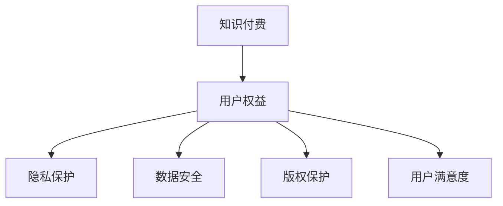

                 

# 知识付费创业中的用户权益保护

> 关键词：知识付费,用户权益,隐私保护,数据安全,版权保护

## 1. 背景介绍

### 1.1 问题由来

随着互联网的发展和知识经济的兴起，知识付费作为一种新兴的商业模式，正在全球范围内迅速崛起。各大平台如喜马拉雅、得到、知乎等纷纷推出知识付费产品，推动了知识共享与知识产权的商业模式创新。然而，知识付费业务的蓬勃发展也带来了用户权益保护的问题。如何保障用户在知识付费平台上的隐私、数据安全、版权保护等问题，已经成为各大平台需要解决的重要挑战。

### 1.2 问题核心关键点

知识付费平台用户权益保护的核心关键点主要包括以下几个方面：

1. **隐私保护**：用户在使用知识付费平台时，其个人信息、阅读行为、购买记录等都应得到妥善保护，防止信息泄露。
2. **数据安全**：平台需保护用户数据免受未授权访问和攻击，确保数据完整性和可用性。
3. **版权保护**：平台需尊重和保护内容创作者的作品版权，避免侵权和盗版行为。
4. **用户满意度**：平台需提供高质量的服务和内容，满足用户需求，提高用户满意度。

## 2. 核心概念与联系

### 2.1 核心概念概述

1. **知识付费**：用户为获取有价值的信息或知识而支付费用的商业模式。包括在线课程、电子书、音频、视频等多种形式。
2. **用户权益**：用户在使用产品或服务时，应当享有的合法权利和利益，包括隐私权、数据安全、版权保护等。
3. **隐私保护**：保护用户个人隐私不被非法收集、使用、泄露的技术和管理措施。
4. **数据安全**：保护数据免受未授权访问、修改、泄露等风险的技术和管理措施。
5. **版权保护**：保护作品原创性和权利人的利益，避免侵权和盗版行为。
6. **用户满意度**：用户对产品或服务的满意程度，通过用户反馈、评分等方式进行衡量。

### 2.2 核心概念原理和架构的 Mermaid 流程图



这个流程图展示了知识付费与用户权益保护之间的逻辑关系：

1. 知识付费业务的发展依赖于用户权益的保障。
2. 隐私保护、数据安全、版权保护和用户满意度是用户权益的四大方面。

## 3. 核心算法原理 & 具体操作步骤

### 3.1 算法原理概述

知识付费平台的用户权益保护，通常基于以下几方面的技术原理：

1. **隐私保护**：采用数据加密、访问控制、匿名化等技术，保护用户个人信息和阅读行为。
2. **数据安全**：采用数据备份、审计日志、漏洞扫描等技术，确保数据的安全性。
3. **版权保护**：采用数字水印、版权声明、反盗版技术等手段，保护内容创作者的知识产权。
4. **用户满意度**：通过推荐算法、用户反馈、评分系统等技术手段，提升用户使用体验和满意度。

### 3.2 算法步骤详解

1. **隐私保护**
   - 用户注册时，要求用户提供必要的个人信息，同时进行加密处理。
   - 用户登录时，使用多因素认证和访问控制策略。
   - 用户数据存储时，采用数据分片和加密存储技术。
   - 用户阅读行为记录时，进行匿名化处理。

2. **数据安全**
   - 定期备份用户数据，确保数据不丢失。
   - 记录和审计所有数据访问操作，防范未授权访问。
   - 使用漏洞扫描和修复工具，及时发现和修复安全漏洞。
   - 对关键数据进行加密传输，防止数据泄露。

3. **版权保护**
   - 内容发布时，加入数字水印，便于追踪和维权。
   - 对内容进行版权声明，明确版权归属。
   - 部署反盗版技术，如指纹识别、内容比对等，防止盗版行为。
   - 设立版权监控机制，实时监控侵权行为，及时采取法律措施。

4. **用户满意度**
   - 通过机器学习算法进行内容推荐，提高用户发现兴趣内容的概率。
   - 建立用户反馈和评分系统，及时收集用户意见，改进产品功能。
   - 优化用户界面和交互设计，提升用户体验。
   - 提供多种支付方式和客户服务，提升用户购买和使用体验。

### 3.3 算法优缺点

隐私保护、数据安全、版权保护和用户满意度保护都有各自的优点和缺点：

**隐私保护**
- 优点：保护用户隐私不被非法收集和利用，增加用户信任感。
- 缺点：需要投入大量资源进行加密和处理，可能影响数据处理效率。

**数据安全**
- 优点：确保数据完整性和可用性，防止数据泄露和攻击。
- 缺点：数据备份和审计增加了系统复杂度，增加了维护成本。

**版权保护**
- 优点：保护创作者知识产权，减少侵权和盗版行为。
- 缺点：数字水印和版权声明可能影响内容可读性和用户体验。

**用户满意度**
- 优点：提升用户使用体验，增加用户粘性。
- 缺点：推荐算法和反馈系统可能存在偏差，影响用户体验。

### 3.4 算法应用领域

知识付费平台用户权益保护的方法广泛应用于多个领域：

1. **在线教育**：保障学生个人信息和数据安全，防止内容盗版。
2. **数字出版**：保护作者版权，防止内容盗版和非法传播。
3. **远程办公**：保障员工隐私和数据安全，提高远程办公效率和安全性。
4. **医疗健康**：保护患者隐私和医疗数据安全，提高医疗服务质量。

## 4. 数学模型和公式 & 详细讲解 & 举例说明

### 4.1 数学模型构建

以用户隐私保护为例，建立隐私保护数学模型：

1. 定义用户隐私模型：$P(u)$，其中 $u$ 为用户信息。
2. 定义隐私保护目标：$Minimize(P(u))$，即最小化用户隐私信息泄露的风险。
3. 定义保护措施：$M(u)$，如数据加密、访问控制等。
4. 隐私保护模型：$Optimize(M(u),P(u))$，即优化隐私保护措施 $M(u)$，使得用户隐私信息泄露的风险最小化。

### 4.2 公式推导过程

假设用户隐私信息泄露的风险为 $R$，隐私保护措施为 $M(u)$，则隐私保护模型可表示为：

$$
Minimize(R) = Minimize(E[R|M(u)])
$$

其中 $E$ 表示期望，即对隐私泄露风险的期望值最小化。

### 4.3 案例分析与讲解

以数据加密为例，使用AES加密算法对用户数据进行保护。

1. 定义加密函数：$C(u)=F(u,K)$，其中 $K$ 为加密密钥。
2. 定义解密函数：$u=D(C(u),K)$。
3. 分析加密效果：加密后，即使数据泄露，攻击者也无法还原用户信息。

## 5. 项目实践：代码实例和详细解释说明

### 5.1 开发环境搭建

1. 安装Python、Pip等基础开发环境。
2. 安装必要的开发库，如Django、Flask、SQLAlchemy等。
3. 安装数据安全工具，如OpenSSL、SSH、AWS IAM等。
4. 配置数据库和应用服务器，确保数据安全和高效访问。

### 5.2 源代码详细实现

以用户注册和登录为例，展示隐私保护代码实现：

```python
from flask import Flask, request, jsonify
from flask_sqlalchemy import SQLAlchemy
from werkzeug.security import generate_password_hash, check_password_hash
from flask_login import LoginManager, UserMixin, login_user, logout_user, login_required

app = Flask(__name__)
app.config['SQLALCHEMY_DATABASE_URI'] = 'sqlite:///users.db'
db = SQLAlchemy(app)
login_manager = LoginManager(app)

class User(UserMixin, db.Model):
    id = db.Column(db.Integer, primary_key=True)
    username = db.Column(db.String(255))
    password = db.Column(db.String(255))

    def set_password(self, password):
        self.password = generate_password_hash(password)

    def check_password(self, password):
        return check_password_hash(self.password, password)

@login_manager.user_loader
def load_user(user_id):
    return User.query.get(int(user_id))

@app.route('/login', methods=['POST'])
def login():
    username = request.json.get('username')
    password = request.json.get('password')
    user = User.query.filter_by(username=username).first()
    if user and user.check_password(password):
        login_user(user)
        return jsonify({'message': 'Login successful'})
    else:
        return jsonify({'message': 'Invalid credentials'})

@app.route('/logout')
@login_required
def logout():
    logout_user()
    return jsonify({'message': 'Logout successful'})
```

### 5.3 代码解读与分析

1. **Flask框架**：用于搭建Web应用，支持用户注册、登录、退出等操作。
2. **SQLAlchemy**：用于管理数据库，存储用户信息。
3. **Flask-Login**：用于用户认证管理，保护用户信息不被未授权访问。
4. **werkzeug.security**：用于生成和验证用户密码哈希值，保障用户密码安全。

## 6. 实际应用场景

### 6.1 在线教育平台

在线教育平台通常需要处理大量的学生信息和学习行为数据，因此隐私保护和数据安全尤为重要。

1. **隐私保护**：保护学生个人信息，如姓名、年龄、学号等，防止信息泄露。
2. **数据安全**：保护学习行为数据，防止数据被非法访问和修改。
3. **版权保护**：保护课程内容和课件版权，防止盗版和侵权行为。
4. **用户满意度**：通过个性化推荐和课程评价，提高用户学习体验。

### 6.2 数字出版平台

数字出版平台需要保障作者和读者的合法权益。

1. **隐私保护**：保护读者个人信息，如阅读偏好、浏览历史等。
2. **数据安全**：保护出版内容版权，防止盗版和非法传播。
3. **版权保护**：保护作者著作权，防止内容侵权和盗版行为。
4. **用户满意度**：通过推荐算法，提高读者发现感兴趣书籍的概率。

### 6.3 远程办公平台

远程办公平台需要保障员工隐私和数据安全。

1. **隐私保护**：保护员工个人信息，如公司地址、办公时间等。
2. **数据安全**：保护办公数据，防止未授权访问和泄露。
3. **版权保护**：保护公司商业机密和知识产权。
4. **用户满意度**：通过员工反馈和满意度调查，提升远程办公体验。

### 6.4 未来应用展望

未来的知识付费平台将更加注重用户权益保护，将有以下几个发展趋势：

1. **隐私保护技术升级**：采用更先进的加密算法和匿名化技术，保障用户隐私安全。
2. **数据安全措施完善**：引入更严格的数据访问控制和审计机制，防止数据泄露。
3. **版权保护手段丰富**：引入更多版权保护技术，如区块链技术，确保内容原创性。
4. **用户满意度提升**：通过更精准的推荐算法和更及时的用户反馈机制，提升用户体验。

## 7. 工具和资源推荐

### 7.1 学习资源推荐

1. **《隐私保护技术》系列博文**：系统介绍隐私保护技术和实践，涵盖数据加密、匿名化、访问控制等内容。
2. **《数据安全管理》课程**：讲解数据安全管理的最佳实践，涵盖数据备份、审计日志、漏洞扫描等内容。
3. **《版权保护》书籍**：详细介绍版权保护的理论和实践，涵盖数字水印、版权声明、反盗版等内容。
4. **《用户满意度管理》论文**：研究用户满意度影响因素和提升策略，涵盖推荐算法、用户反馈、评分系统等内容。

### 7.2 开发工具推荐

1. **Flask**：轻量级Web框架，易于搭建和扩展。
2. **SQLAlchemy**：灵活的数据库管理工具，支持多种数据库。
3. **Flask-Login**：用户认证管理工具，提供简便的用户登录和退出功能。
4. **werkzeug.security**：安全密码处理工具，生成和验证密码哈希值。

### 7.3 相关论文推荐

1. **《隐私保护算法研究》**：研究各种隐私保护算法，如差分隐私、同态加密等。
2. **《数据安全技术综述》**：综述数据安全技术的现状和未来发展方向。
3. **《版权保护技术应用》**：探讨版权保护技术的实际应用案例，如数字水印、反盗版等。
4. **《用户满意度提升策略》**：分析用户满意度影响因素，提出提升策略。

## 8. 总结：未来发展趋势与挑战

### 8.1 研究成果总结

本文对知识付费平台用户权益保护进行了详细探讨，系统介绍了隐私保护、数据安全、版权保护和用户满意度保护的技术原理和操作步骤。

1. **隐私保护**：采用数据加密、访问控制、匿名化等技术，保护用户个人信息和阅读行为。
2. **数据安全**：采用数据备份、审计日志、漏洞扫描等技术，确保数据的安全性。
3. **版权保护**：采用数字水印、版权声明、反盗版技术等手段，保护内容创作者的知识产权。
4. **用户满意度**：通过推荐算法、用户反馈、评分系统等技术手段，提升用户使用体验和满意度。

### 8.2 未来发展趋势

知识付费平台用户权益保护的未来发展趋势如下：

1. **技术升级**：采用更先进的加密算法和匿名化技术，保障用户隐私安全。
2. **数据安全措施完善**：引入更严格的数据访问控制和审计机制，防止数据泄露。
3. **版权保护手段丰富**：引入更多版权保护技术，如区块链技术，确保内容原创性。
4. **用户满意度提升**：通过更精准的推荐算法和更及时的用户反馈机制，提升用户体验。

### 8.3 面临的挑战

1. **隐私保护**：隐私保护技术需要投入大量资源，可能影响数据处理效率。
2. **数据安全**：数据备份和审计增加了系统复杂度，增加了维护成本。
3. **版权保护**：数字水印和版权声明可能影响内容可读性和用户体验。
4. **用户满意度**：推荐算法和反馈系统可能存在偏差，影响用户体验。

### 8.4 研究展望

1. **隐私保护技术研究**：研究更高效、更安全的隐私保护技术，提升隐私保护效果。
2. **数据安全措施改进**：优化数据备份和审计机制，减少系统复杂度，降低维护成本。
3. **版权保护手段创新**：引入更多版权保护技术，如区块链技术，提高版权保护效果。
4. **用户满意度提升策略**：研究用户满意度影响因素，提出更有效的提升策略。

## 9. 附录：常见问题与解答

**Q1：知识付费平台如何保障用户隐私？**

A: 知识付费平台可以采用数据加密、访问控制、匿名化等技术保障用户隐私。

1. 用户注册时，要求用户提供必要的个人信息，同时进行加密处理。
2. 用户登录时，使用多因素认证和访问控制策略。
3. 用户数据存储时，采用数据分片和加密存储技术。
4. 用户阅读行为记录时，进行匿名化处理。

**Q2：数据安全措施有哪些？**

A: 数据安全措施包括数据备份、审计日志、漏洞扫描等技术。

1. 定期备份用户数据，确保数据不丢失。
2. 记录和审计所有数据访问操作，防范未授权访问。
3. 使用漏洞扫描和修复工具，及时发现和修复安全漏洞。
4. 对关键数据进行加密传输，防止数据泄露。

**Q3：如何保护内容版权？**

A: 内容版权保护可以采用数字水印、版权声明、反盗版技术等手段。

1. 内容发布时，加入数字水印，便于追踪和维权。
2. 对内容进行版权声明，明确版权归属。
3. 部署反盗版技术，如指纹识别、内容比对等，防止盗版行为。
4. 设立版权监控机制，实时监控侵权行为，及时采取法律措施。

**Q4：如何提升用户满意度？**

A: 提升用户满意度可以通过推荐算法、用户反馈、评分系统等技术手段。

1. 通过机器学习算法进行内容推荐，提高用户发现兴趣内容的概率。
2. 建立用户反馈和评分系统，及时收集用户意见，改进产品功能。
3. 优化用户界面和交互设计，提升用户体验。
4. 提供多种支付方式和客户服务，提升用户购买和使用体验。

---

作者：禅与计算机程序设计艺术 / Zen and the Art of Computer Programming

