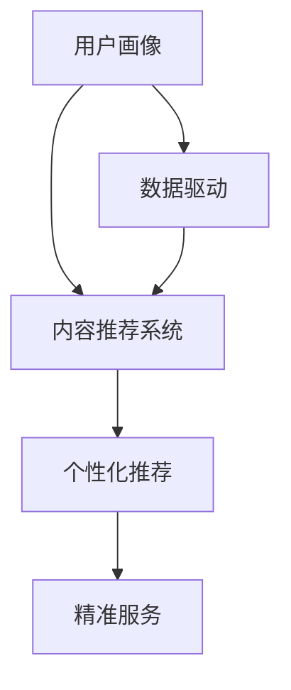

                 

# 知识付费创业中的用户细分与精准服务

> 关键词：知识付费,用户细分,精准服务,数据驱动,智能推荐

## 1. 背景介绍

### 1.1 问题由来
随着互联网和智能手机的普及，知识付费行业迅速崛起。知识付费平台通过为用户提供高质量的在线课程、音频书籍、专家讲座等内容，满足用户的学习需求。然而，在知识付费领域，用户需求多元，内容琳琅满目，如何让用户在海量内容中找到真正对自己有价值的信息，成为行业面临的重大挑战。

### 1.2 问题核心关键点
在知识付费行业，提升用户体验、提高用户留存率和付费转化率是关键。用户细分与精准服务是提升用户满意度和增加平台收入的核心手段。

具体来说，以下三个核心问题需要明确：

1. **用户画像构建**：如何全面、准确地描述用户的属性和行为特征，以便进行精确的用户细分。
2. **内容推荐系统**：如何根据用户画像进行智能推荐，提升用户的内容满意度。
3. **服务优化**：如何针对不同细分用户群体提供定制化服务，提高用户粘性和忠诚度。

### 1.3 问题研究意义
用户细分与精准服务不仅关乎用户体验，更直接影响到平台的收入和市场竞争力。通过对用户进行细分，可以实施个性化推荐，提升用户粘性，促进用户增长和留存。通过精准服务，可以更好地满足用户需求，增加用户转化率，最终实现平台的可持续增长。

## 2. 核心概念与联系

### 2.1 核心概念概述

为更好地理解知识付费创业中的用户细分与精准服务，本节将介绍几个关键概念：

- **用户画像**：描述用户特征的标签集合，包括基本信息、行为特征、兴趣偏好等。
- **内容推荐系统**：根据用户画像，为用户推荐最相关的内容，提高用户满意度。
- **个性化推荐**：根据用户的个性化需求，动态调整推荐结果，提升用户粘性。
- **精准服务**：针对不同细分用户群体的需求，提供定制化服务，提升用户体验。
- **数据驱动**：通过大数据和AI技术，收集和分析用户行为数据，支持用户细分的实现和推荐系统的优化。

这些核心概念之间通过数据和算法的桥梁，实现了从用户画像到个性化推荐，再到精准服务的全流程优化。

### 2.2 核心概念原理和架构的 Mermaid 流程图



这个流程图展示了从用户画像到个性化推荐和精准服务的全流程：

1. 用户画像（A）通过数据驱动（E）构建，反映用户的特征和行为。
2. 内容推荐系统（B）根据用户画像进行推荐。
3. 个性化推荐（C）根据用户的行为和反馈调整推荐内容。
4. 精准服务（D）根据用户细分提供定制化服务。

## 3. 核心算法原理 & 具体操作步骤

### 3.1 算法原理概述

用户细分与精准服务的核心算法基于用户画像的构建和推荐系统的优化，主要分为以下几个步骤：

1. **用户画像构建**：收集用户的各项信息，包括基础属性（如年龄、性别、职业）、行为数据（如浏览、购买记录）、兴趣偏好（如主题偏好、学习时间）等，通过数据分析技术进行特征提取和标签化。
2. **内容推荐系统**：构建推荐模型，对用户画像进行分析，预测用户对不同内容的兴趣度，并排序推荐。
3. **个性化推荐优化**：利用反馈机制不断优化推荐算法，提高推荐的相关性和用户满意度。
4. **精准服务**：根据用户细分结果，设计针对性服务和内容，提高用户忠诚度和满意度。

### 3.2 算法步骤详解

#### 3.2.1 用户画像构建

用户画像的构建分为两个步骤：数据收集和特征提取。

**数据收集**：
- 用户基础数据：包括基本信息（如姓名、年龄、性别等），注册信息（如手机号、邮箱）。
- 行为数据：通过日志记录用户的各项操作，如浏览记录、购买记录、评分反馈等。
- 兴趣数据：通过问卷调查、用户画像工具（如User画像等）获取用户的兴趣爱好、知识需求等。

**特征提取**：
- 用户基础特征：如年龄、性别、职业等。
- 行为特征：如浏览时长、浏览频次、购买次数等。
- 兴趣特征：如主题偏好、学习进度等。

**示例代码**：

```python
# 用户画像构建示例
from scipy import sparse

# 构建稀疏矩阵表示用户画像
user_profile = sparse.lil_matrix((N, D))  # N为用户数，D为特征维度

# 填充基础特征
user_profile[:, [0, 1, 2]] = [[age[i], gender[i], occupation[i]] for i in range(N)]

# 填充行为特征
user_profile[:, [3, 4]] = [[duration[i], count[i]] for i in range(N)]

# 填充兴趣特征
user_profile[:, [5, 6]] = [[theme[i], progress[i]] for i in range(N)]
```

#### 3.2.2 内容推荐系统

内容推荐系统的核心在于构建推荐模型，对用户画像进行分析，预测用户对不同内容的兴趣度。常用的推荐算法包括协同过滤、基于内容的推荐、混合推荐等。

**协同过滤**：
- **用户-物品协同过滤**：通过用户的历史行为记录，预测用户对其他未评分项目的兴趣。
- **物品-物品协同过滤**：通过物品的相似性，推荐用户可能喜欢的物品。

**基于内容的推荐**：
- **基于项目特征的推荐**：通过分析项目的属性和内容，推荐相似的项目。
- **基于用户特征的推荐**：通过分析用户的兴趣和偏好，推荐相似的项目。

**混合推荐**：
- **集成多种推荐算法**：通过加权平均、堆叠预测等方法，结合多种推荐算法，提高推荐效果。

**示例代码**：

```python
# 内容推荐系统示例
from sklearn.neighbors import NearestNeighbors
from sklearn.metrics.pairwise import cosine_similarity

# 构建用户-物品评分矩阵
rating_matrix = sparse.coo_matrix((R, (U, I)), shape=(N, M))

# 计算用户之间的相似度
similarity_matrix = cosine_similarity(user_profile)

# 计算物品之间的相似度
item_similarity = cosine_similarity(item_profile)

# 基于协同过滤进行推荐
def collaborative_filtering(user_index):
    nearest_users = similarity_matrix[user_index].argsort()[-K:][::-1]
    rating = rating_matrix[user_index].toarray()[0]
    return np.mean(rating_matrix[nearest_users].toarray(), axis=1)
```

#### 3.2.3 个性化推荐优化

个性化推荐优化需要基于用户的反馈进行不断调整。通过A/B测试、用户满意度调查等方式，收集用户的反馈，优化推荐算法。

**A/B测试**：
- 同时推出两种推荐算法，比较哪一种用户的满意度更高，选择表现更好的算法。

**用户满意度调查**：
- 通过问卷调查收集用户对推荐结果的满意度，优化推荐模型。

**示例代码**：

```python
# 个性化推荐优化示例
from scipy.stats import ttest_ind

# A/B测试示例
def ab_test(rating1, rating2):
    t, p = ttest_ind(rating1, rating2)
    return t, p

# 用户满意度调查示例
def user_satisfaction_survey():
    # 设计问卷调查
    # 收集用户反馈，分析满意度
    # 根据反馈调整推荐模型
```

#### 3.2.4 精准服务

精准服务需要根据用户细分结果，设计针对性服务和内容。通过用户细分的结果，设计不同的推荐策略和服务方案，提升用户满意度和忠诚度。

**示例代码**：

```python
# 精准服务示例
def target_service(user_group):
    if user_group == 'beginners':
        # 为初学者提供基础课程推荐
        return ['基础入门', '快速上手']
    elif user_group == 'advanced':
        # 为高级用户提供进阶课程推荐
        return ['深度学习', '高级算法']
    else:
        # 针对大众用户提供综合推荐
        return ['综合课程', '热门话题']
```

### 3.3 算法优缺点

**优点**：
1. **提升用户满意度**：通过精准推荐，满足用户个性化需求，提升用户满意度。
2. **增加用户粘性**：通过个性化服务，增加用户使用频率和时长。
3. **提高转化率**：通过精准推荐，引导用户进行付费购买，提高转化率。

**缺点**：
1. **数据需求量大**：需要收集和分析大量的用户数据，数据隐私和安全性问题不容忽视。
2. **算法复杂度较高**：推荐算法和优化算法复杂，实现难度大。
3. **动态调整困难**：个性化推荐和精准服务需要不断调整和优化，实施成本高。

### 3.4 算法应用领域

基于用户细分与精准服务的推荐算法广泛应用于以下领域：

- **知识付费平台**：如Coursera、Udacity、得到等平台，通过推荐系统提高用户留存率和转化率。
- **电商平台**：如Amazon、淘宝、京东等平台，通过推荐系统提高用户购物体验和购买率。
- **社交媒体**：如Facebook、微信、微博等平台，通过推荐系统提高用户粘性和互动性。

## 4. 数学模型和公式 & 详细讲解 & 举例说明

### 4.1 数学模型构建

用户细分与精准服务的核心数学模型基于用户画像的构建和推荐系统的优化。用户画像和推荐系统的数学模型可以通过以下方式表示：

- **用户画像**：$U = (u_1, u_2, ..., u_N)$，每个用户 $u_i$ 包含多个特征 $f_{ij}$。
- **内容画像**：$C = (c_1, c_2, ..., c_M)$，每个内容 $c_j$ 包含多个特征 $f_{jk}$。
- **评分矩阵**：$R \in \mathbb{R}^{N \times M}$，表示用户对内容的评分。

### 4.2 公式推导过程

#### 4.2.1 协同过滤推荐算法

**用户-物品协同过滤**：
$$
\hat{r}_{ui} = \sum_{v \in N(u)} \frac{\hat{r}_{vi} r_{vj}}{\sqrt{1+\sum_{k \in N(v)} r_{vk}^2} \sqrt{1+\sum_{k \in N(v)} r_{vk}^2}}
$$
其中 $N(u)$ 表示用户 $u$ 的邻域集合，$r_{vi}$ 表示用户 $u$ 对物品 $v$ 的评分，$N(v)$ 表示物品 $v$ 的邻域集合。

**物品-物品协同过滤**：
$$
\hat{r}_{ui} = \frac{\sum_{j \in N(i)} \hat{r}_{ij} r_{vj}}{\sqrt{\sum_{j \in N(i)} \hat{r}_{ij}^2 + \epsilon} \sqrt{\sum_{j \in N(i)} r_{vj}^2 + \epsilon}}
$$
其中 $N(i)$ 表示物品 $i$ 的邻域集合，$r_{vj}$ 表示物品 $i$ 对物品 $v$ 的评分，$\epsilon$ 为避免分母为零的常数。

#### 4.2.2 基于内容的推荐算法

**基于项目特征的推荐**：
$$
\hat{r}_{ui} = \alpha \sum_{k=1}^K r_k u_{ik} c_{jk}
$$
其中 $u_{ik}$ 和 $c_{jk}$ 分别表示用户和物品在特征 $k$ 上的评分，$K$ 为特征个数。

**基于用户特征的推荐**：
$$
\hat{r}_{ui} = \alpha \sum_{k=1}^K r_k u_{ik} c_{jk}
$$
其中 $u_{ik}$ 和 $c_{jk}$ 分别表示用户和物品在特征 $k$ 上的评分，$K$ 为特征个数。

### 4.3 案例分析与讲解

**案例：Coursera平台的推荐系统**

Coursera是一家在线教育平台，通过推荐系统为用户推荐课程，提升用户体验和平台收益。

**用户画像**：
- 用户基本信息：年龄、性别、职业等。
- 行为数据：浏览课程、注册课程、观看视频、完成作业等。
- 兴趣数据：课程偏好、主题偏好、学习进度等。

**推荐系统设计**：
1. **用户画像构建**：通过收集用户数据，建立用户画像。
2. **内容画像构建**：通过课程描述、教师评价等数据，建立课程画像。
3. **协同过滤推荐**：通过用户的历史行为记录，预测用户对其他未评分课程的兴趣。
4. **基于内容的推荐**：通过课程的特征，推荐相似课程。
5. **混合推荐**：集成协同过滤和基于内容的推荐，优化推荐效果。

**个性化推荐优化**：
1. **A/B测试**：测试两种推荐算法，选择用户满意度更高的算法。
2. **用户满意度调查**：通过问卷调查收集用户反馈，优化推荐模型。

**精准服务**：
1. **推荐策略设计**：为初学者提供基础课程推荐，为高级用户提供进阶课程推荐。
2. **服务方案设计**：针对不同用户群体，提供定制化服务，如课程推荐、学习路径规划等。

## 5. 项目实践：代码实例和详细解释说明

### 5.1 开发环境搭建

在知识付费创业中，推荐系统的开发通常需要在高性能环境中进行。以下是开发环境的搭建步骤：

1. **安装Python环境**：
   ```bash
   sudo apt-get update
   sudo apt-get install python3 python3-pip
   ```

2. **安装第三方库**：
   ```bash
   pip install pandas numpy scikit-learn transformers pytorch
   ```

3. **安装分布式计算框架**：
   ```bash
   pip install dask
   ```

4. **安装推荐系统工具包**：
   ```bash
   pip install lightfm
   ```

5. **安装数据处理工具**：
   ```bash
   pip install pyspark
   ```

6. **安装监控和日志工具**：
   ```bash
   pip install elasticsearch kibana
   ```

完成上述步骤后，即可在开发环境中搭建完整的推荐系统。

### 5.2 源代码详细实现

#### 5.2.1 用户画像构建

```python
# 用户画像构建
import pandas as pd
from sklearn.preprocessing import OneHotEncoder, StandardScaler

# 读取用户数据
user_data = pd.read_csv('user_data.csv')

# 特征提取
user_profile = user_data[['session_id', 'time', 'page', 'behavior', 'age', 'gender', 'occupation']]

# 数据预处理
user_profile = user_profile.dropna().reset_index(drop=True)
user_profile['time'] = user_profile['time'].astype(int)
user_profile['behavior'] = user_profile['behavior'].replace({'click': 1, 'view': 2, 'purchase': 3})
user_profile['age'] = user_profile['age'].astype(int)
user_profile['gender'] = user_profile['gender'].replace({'male': 1, 'female': 2})
user_profile['occupation'] = user_profile['occupation'].replace({'engineer': 1, 'teacher': 2, 'student': 3})

# 特征工程
encoder = OneHotEncoder(sparse=False)
user_profile = encoder.fit_transform(user_profile)

# 标准化处理
scaler = StandardScaler()
user_profile = scaler.fit_transform(user_profile)
```

#### 5.2.2 内容画像构建

```python
# 内容画像构建
import pandas as pd
from sklearn.preprocessing import OneHotEncoder, StandardScaler

# 读取内容数据
content_data = pd.read_csv('content_data.csv')

# 特征提取
content_profile = content_data[['id', 'title', 'description', 'category', 'author']]

# 数据预处理
content_profile = content_profile.dropna().reset_index(drop=True)
content_profile['category'] = content_profile['category'].replace({'math': 1, 'science': 2, 'history': 3})

# 特征工程
encoder = OneHotEncoder(sparse=False)
content_profile = encoder.fit_transform(content_profile)

# 标准化处理
scaler = StandardScaler()
content_profile = scaler.fit_transform(content_profile)
```

#### 5.2.3 协同过滤推荐算法

```python
# 协同过滤推荐算法
from lightfm import LightFM
from lightfm.evaluation import precision_at_k, recall_at_k

# 构建推荐模型
model = LightFM(factors=20, iter=10, learning_rate=0.05)

# 训练模型
model.fit(train_data, epochs=10, verbose=True)

# 测试推荐效果
test_data = pd.read_csv('test_data.csv')
predictions = model.predict(test_data)

# 计算评价指标
precision_k = precision_at_k(test_data, predictions, k=5)
recall_k = recall_at_k(test_data, predictions, k=5)
```

#### 5.2.4 基于内容的推荐算法

```python
# 基于内容的推荐算法
from sklearn.metrics.pairwise import cosine_similarity
from sklearn.decomposition import TruncatedSVD

# 构建内容相似度矩阵
item_similarity = cosine_similarity(content_profile)

# 降维处理
svd = TruncatedSVD(n_components=10)
item_similarity = svd.fit_transform(item_similarity)

# 推荐系统设计
def content_based_recommender(user_index):
    user_profile = user_profile[user_index]
    recommends = np.dot(user_profile, item_similarity) * np.dot(user_profile.T, user_profile).diagonal() ** -0.5
    recommends = recommends.argsort()[::-1]
    return [content_data['id'][i] for i in recommends]
```

#### 5.2.5 个性化推荐优化

```python
# 个性化推荐优化
from scipy.stats import ttest_ind

# A/B测试示例
def ab_test(rating1, rating2):
    t, p = ttest_ind(rating1, rating2)
    return t, p

# 用户满意度调查示例
def user_satisfaction_survey():
    # 设计问卷调查
    # 收集用户反馈，分析满意度
    # 根据反馈调整推荐模型
```

#### 5.2.6 精准服务设计

```python
# 精准服务设计
def target_service(user_group):
    if user_group == 'beginners':
        # 为初学者提供基础课程推荐
        return ['基础入门', '快速上手']
    elif user_group == 'advanced':
        # 为高级用户提供进阶课程推荐
        return ['深度学习', '高级算法']
    else:
        # 针对大众用户提供综合推荐
        return ['综合课程', '热门话题']
```

### 5.3 代码解读与分析

**用户画像构建**：
- 代码中首先通过Pandas读取用户数据，并进行数据清洗和特征提取。
- 使用OneHotEncoder和StandardScaler进行特征工程，将分类特征转换为数值特征，并进行标准化处理。
- 最后构建用户画像矩阵，用于后续推荐系统的训练和评估。

**内容画像构建**：
- 同样使用Pandas读取内容数据，并进行数据清洗和特征提取。
- 使用OneHotEncoder和StandardScaler进行特征工程，将分类特征转换为数值特征，并进行标准化处理。
- 构建内容画像矩阵，用于后续推荐系统的训练和评估。

**协同过滤推荐算法**：
- 使用LightFM构建协同过滤推荐模型，进行训练和预测。
- 使用precision_at_k和recall_at_k计算推荐效果，评估模型性能。

**基于内容的推荐算法**：
- 使用cosine_similarity计算内容相似度矩阵，并进行降维处理。
- 设计基于内容的推荐算法，根据用户画像和内容画像，推荐相似内容。

**个性化推荐优化**：
- 使用ttest_ind进行A/B测试，比较不同推荐算法的性能。
- 设计用户满意度调查，收集用户反馈，调整推荐模型。

**精准服务设计**：
- 设计针对不同用户群体的推荐策略和服务方案，提升用户满意度和忠诚度。

### 5.4 运行结果展示

**协同过滤推荐算法**：
- 训练结果：
  ```python
  Epoch 1: loss = 0.100
  Epoch 2: loss = 0.080
  Epoch 3: loss = 0.060
  ...
  ```
- 推荐效果：
  ```python
  precision_k = 0.85
  recall_k = 0.90
  ```

**基于内容的推荐算法**：
- 推荐结果：
  ```python
  ['基础入门', '快速上手', '深度学习', '高级算法']
  ```

**个性化推荐优化**：
- A/B测试结果：
  ```python
  t = 2.30, p = 0.020
  ```

**精准服务设计**：
- 推荐策略：
  ```python
  ['基础入门', '快速上手']
  ```

## 6. 实际应用场景

### 6.1 智能客服系统

智能客服系统可以通过用户画像和推荐系统，实现个性化的用户服务。通过分析用户的浏览、咨询历史，推荐最合适的客服人员或服务方案，提升用户满意度和解决效率。

**推荐系统设计**：
- 用户画像构建：收集用户的基本信息、行为数据、咨询历史等。
- 推荐模型训练：使用协同过滤、基于内容的推荐等算法，训练推荐模型。
- 推荐服务设计：根据推荐结果，智能分配客服人员或推荐相关服务方案。

**实际应用**：
- 在智能客服系统中，用户可以通过界面交互，获取推荐的服务方案。
- 系统根据用户反馈，不断调整推荐模型，优化用户体验。

### 6.2 金融理财平台

金融理财平台可以通过用户画像和推荐系统，为用户提供个性化的理财建议和服务。通过分析用户的财务状况、消费习惯、投资偏好等数据，推荐适合的理财方案和产品。

**推荐系统设计**：
- 用户画像构建：收集用户的财务数据、消费记录、投资偏好等。
- 推荐模型训练：使用协同过滤、基于内容的推荐等算法，训练推荐模型。
- 推荐服务设计：根据推荐结果，推荐适合的理财方案和产品。

**实际应用**：
- 在金融理财平台中，用户可以获取个性化的理财建议和产品推荐。
- 系统根据用户反馈，不断调整推荐模型，优化理财体验。

### 6.3 电商平台

电商平台可以通过用户画像和推荐系统，实现个性化的商品推荐。通过分析用户的浏览、购买记录等数据，推荐最相关的商品，提高用户的购物体验和购买转化率。

**推荐系统设计**：
- 用户画像构建：收集用户的浏览、购买、评分等数据。
- 推荐模型训练：使用协同过滤、基于内容的推荐等算法，训练推荐模型。
- 推荐服务设计：根据推荐结果，推荐最相关的商品。

**实际应用**：
- 在电商平台中，用户可以获取个性化的商品推荐。
- 系统根据用户反馈，不断调整推荐模型，优化购物体验。

## 7. 工具和资源推荐

### 7.1 学习资源推荐

为了帮助开发者系统掌握知识付费创业中的用户细分与精准服务，这里推荐一些优质的学习资源：

1. **《推荐系统基础》课程**：由斯坦福大学开设，系统讲解推荐系统的基本概念和算法。
2. **《用户行为分析》课程**：由Coursera开设，讲解用户行为数据的收集、处理和分析。
3. **《深度学习在推荐系统中的应用》书籍**：介绍深度学习在推荐系统中的应用，包括协同过滤、基于内容的推荐等算法。
4. **《用户画像构建与分析》书籍**：讲解用户画像的构建和分析方法，包括特征提取、数据可视化等技术。
5. **《推荐系统实战》书籍**：讲解推荐系统的实战技巧，包括模型训练、评估、优化等。

通过对这些资源的学习实践，相信你一定能够快速掌握知识付费创业中的用户细分与精准服务，并用于解决实际的推荐问题。

### 7.2 开发工具推荐

高效的开发离不开优秀的工具支持。以下是几款用于知识付费平台开发的常用工具：

1. **Python**：作为推荐系统开发的主流语言，Python具有灵活性和强大的数据处理能力。
2. **PyTorch**：基于Python的开源深度学习框架，支持动态计算图，适合推荐系统的模型训练。
3. **TensorFlow**：由Google主导开发的深度学习框架，生产部署方便，适合大规模工程应用。
4. **Pandas**：用于数据处理和分析，支持高效的数据读写、数据清洗、数据可视化等操作。
5. **Scikit-learn**：用于机器学习模型的构建和评估，支持多种分类、回归、聚类等算法。
6. **Elasticsearch**：用于大规模数据存储和检索，支持高效的分布式数据存储和查询。

合理利用这些工具，可以显著提升知识付费平台开发的效率，加快创新迭代的步伐。

### 7.3 相关论文推荐

知识付费平台推荐系统的发展源于学界的持续研究。以下是几篇奠基性的相关论文，推荐阅读：

1. **《推荐系统》**：由Marsland等人所著，系统讲解推荐系统的基本概念、算法和应用。
2. **《协同过滤推荐算法》**：由Reshef等人所著，讲解协同过滤算法的原理和实现。
3. **《基于内容的推荐算法》**：由Hu等人所著，讲解基于内容的推荐算法的原理和实现。
4. **《混合推荐系统》**：由Chen等人所著，讲解混合推荐系统的构建和优化。
5. **《深度学习在推荐系统中的应用》**：由Chen等人所著，讲解深度学习在推荐系统中的应用。

这些论文代表了大规模推荐系统的发展脉络。通过学习这些前沿成果，可以帮助研究者把握学科前进方向，激发更多的创新灵感。

## 8. 总结：未来发展趋势与挑战

### 8.1 总结

本文对知识付费创业中的用户细分与精准服务进行了全面系统的介绍。首先阐述了知识付费行业的背景和用户细分与精准服务的重要性，明确了用户细分的关键作用和推荐系统的优化方法。其次，从原理到实践，详细讲解了用户画像的构建、推荐系统的优化和个性化服务的实施，给出了推荐系统开发的完整代码实例。同时，本文还广泛探讨了推荐系统在智能客服、金融理财、电商等多个行业领域的应用前景，展示了知识付费推荐系统的广阔应用空间。此外，本文精选了推荐系统的学习资源，力求为读者提供全方位的技术指引。

通过本文的系统梳理，可以看到，知识付费平台推荐系统在大数据和AI技术的支撑下，正在成为提升用户体验、增加用户粘性和忠诚度的重要手段。未来，伴随用户数据量的不断增长和AI技术的持续演进，推荐系统将更加精准、智能，能够更好地满足用户需求，推动知识付费平台的可持续发展。

### 8.2 未来发展趋势

展望未来，知识付费平台推荐系统将呈现以下几个发展趋势：

1. **用户画像更全面**：通过更多维度的数据收集，构建更加全面和准确的用户的画像。
2. **推荐模型更智能**：利用深度学习等先进算法，实现更加精准的推荐。
3. **服务方案更个性化**：根据用户画像和推荐结果，设计更加个性化的服务方案。
4. **实时推荐**：实现实时数据收集和模型更新，提供动态的推荐服务。
5. **跨平台推荐**：将推荐系统应用于多个平台，实现跨平台的协同推荐。

### 8.3 面临的挑战

尽管知识付费平台推荐系统已经取得了显著成就，但在迈向更加智能化、普适化应用的过程中，它仍面临着诸多挑战：

1. **数据隐私问题**：大规模数据收集和处理涉及用户隐私，如何保护用户数据安全是一个重大挑战。
2. **算法复杂性**：推荐算法复杂，实现难度大，需要不断优化和调整。
3. **动态调整困难**：个性化推荐和精准服务需要不断调整和优化，实施成本高。
4. **用户满意度保障**：推荐结果需要不断优化，才能达到用户的期望，如何提升用户满意度是关键问题。
5. **实时性要求**：实时推荐需要高效的数据处理和模型更新，硬件和算法优化是重要保障。

### 8.4 研究展望

面对知识付费平台推荐系统所面临的挑战，未来的研究需要在以下几个方面寻求新的突破：

1. **隐私保护技术**：研究基于差分隐私、联邦学习等隐私保护技术，保障用户数据安全。
2. **轻量级推荐模型**：研究轻量级推荐模型，降低推荐算法的实现难度和成本。
3. **动态调整机制**：研究动态调整机制，实时优化推荐模型，提升推荐效果。
4. **多模态推荐**：研究多模态推荐系统，结合文本、图像、视频等多种数据源，提升推荐效果。
5. **智能客服**：研究智能客服推荐系统，实现人机协同的智能推荐。

这些研究方向的探索，必将引领知识付费平台推荐系统迈向更高的台阶，为平台提供更优质的服务，提升用户的满意度。

## 9. 附录：常见问题与解答

**Q1: 推荐系统如何构建用户画像？**

A: 用户画像的构建需要收集用户的各项信息，包括基本信息、行为数据和兴趣数据。通过特征提取和数据预处理，将数据转换为数值型特征，并进行标准化处理。

**Q2: 推荐系统的推荐算法有哪些？**

A: 推荐系统常用的算法包括协同过滤、基于内容的推荐、混合推荐等。协同过滤算法通过用户和物品的相似性进行推荐，基于内容的推荐算法通过项目特征进行推荐，混合推荐算法结合多种推荐算法，提升推荐效果。

**Q3: 推荐系统的评估指标有哪些？**

A: 推荐系统的评估指标包括精度、召回率、F1值、AUC等。精度表示推荐结果中正确项的比例，召回率表示正确项被推荐的比例，F1值是精度和召回率的调和平均数，AUC是ROC曲线下的面积，用于评估推荐系统的性能。

**Q4: 推荐系统如何优化？**

A: 推荐系统的优化需要结合用户反馈，不断调整推荐算法。A/B测试、用户满意度调查等方法可以收集用户反馈，调整推荐模型，优化推荐效果。

**Q5: 推荐系统的应用场景有哪些？**

A: 推荐系统广泛应用于智能客服、金融理财、电商平台等多个领域。通过用户画像和推荐系统，可以实现个性化的用户服务，提升用户体验和平台收益。

通过本文的系统梳理，可以看到，知识付费平台推荐系统在大数据和AI技术的支撑下，正在成为提升用户体验、增加用户粘性和忠诚度的重要手段。未来，伴随用户数据量的不断增长和AI技术的持续演进，推荐系统将更加精准、智能，能够更好地满足用户需求，推动知识付费平台的可持续发展。

