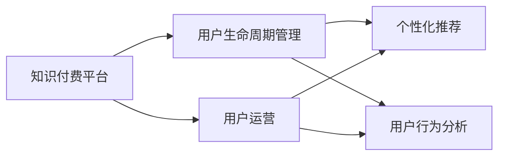

                 

# 知识付费创业中的用户运营体系

> 关键词：知识付费、用户运营、数据驱动、精细化运营、用户生命周期管理、个性化推荐

## 1. 背景介绍

### 1.1 问题由来
随着信息技术的飞速发展，知识付费已成为一种流行的内容消费模式。不同于传统的教育和培训课程，知识付费更加强调对特定知识和技能的快速获取，以满足用户对知识更新和自我提升的需求。在知识付费领域，用户运营体系的构建显得尤为重要，因为它直接关系到平台的竞争力和用户留存率。本文将详细探讨知识付费创业中的用户运营体系，包括用户生命周期管理、个性化推荐、用户行为分析等核心模块。

### 1.2 问题核心关键点
知识付费平台的用户运营体系，涉及对用户需求的深入理解、产品设计、内容生产、用户行为分析等多个环节。构建有效的用户运营体系，不仅可以提升用户体验，增加用户粘性，还能促进平台的商业化进程。

用户运营体系的核心目标包括：
1. 提升用户留存率和活跃度。
2. 增强用户粘性和忠诚度。
3. 优化用户体验，提高用户满意度。
4. 推动用户购买决策，提高商业转化率。

## 2. 核心概念与联系

### 2.1 核心概念概述

为了更好地理解知识付费创业中的用户运营体系，本节将介绍几个关键概念及其相互联系：

- **知识付费**：指用户通过付费获取特定知识、技能、信息等有价值的在线内容，以实现快速学习和自我提升。
- **用户运营**：指通过数据分析、产品设计、内容推荐等手段，提升用户体验，增加用户留存，促进用户转化。
- **用户生命周期管理**：指通过对用户行为数据进行分析和建模，识别用户的不同生命阶段，采取相应的运营策略，提升用户价值。
- **个性化推荐**：指基于用户的历史行为和兴趣偏好，推荐符合用户需求的内容，提升用户满意度。
- **用户行为分析**：指通过追踪和分析用户在平台上的行为数据，洞察用户需求和行为模式，优化产品设计和运营策略。

这些核心概念之间的关系可以通过以下Mermaid流程图来展示：



这个流程图展示的知识付费平台用户运营体系的各个模块及其联系：

1. 知识付费平台将用户引入平台，并开始用户运营。
2. 用户运营模块通过用户生命周期管理和个性化推荐等手段，提升用户体验和留存率。
3. 用户行为分析模块提供对用户行为数据的深入洞察，指导用户运营策略的优化。

## 3. 核心算法原理 & 具体操作步骤
### 3.1 算法原理概述

知识付费平台的用户运营体系，本质上是一个基于数据的精细化运营过程。其核心思想是：通过收集和分析用户行为数据，了解用户需求和行为模式，从而制定针对性的运营策略，提升用户满意度和留存率。

形式化地，假设用户运营体系由以下五个步骤组成：
1. 数据收集：收集用户在平台上的行为数据，如浏览记录、购买记录、评论反馈等。
2. 数据清洗：对原始数据进行清洗和处理，去除噪声和异常值。
3. 用户建模：通过机器学习算法对用户进行建模，识别用户在不同生命周期阶段的行为特征。
4. 运营策略制定：根据用户模型，制定相应的运营策略，如个性化推荐、内容推送等。
5. 效果评估：通过A/B测试等方法，评估运营策略的效果，不断迭代优化。

### 3.2 算法步骤详解

以下是对知识付费平台用户运营体系各步骤的详细讲解：

#### 3.2.1 数据收集

数据收集是用户运营体系的基础。知识付费平台可以通过以下几种方式收集用户行为数据：

1. **日志记录**：通过API记录用户在平台上的各项操作，如浏览、购买、评论等。
2. **交互数据**：收集用户在应用内的交互数据，如点击、滑动、停留时间等。
3. **用户反馈**：通过问卷调查、用户评论等渠道收集用户的反馈信息。
4. **第三方数据**：结合第三方数据源，如社交网络、搜索数据等，获取更多用户行为信息。

#### 3.2.2 数据清洗

数据清洗旨在提高数据质量，确保后续分析的准确性。具体步骤如下：

1. **缺失值处理**：处理数据中的缺失值，如均值填充、插值法填充等。
2. **异常值检测**：识别并处理数据中的异常值，如三倍标准差法则等。
3. **数据去重**：去除重复的数据记录，确保数据的一致性。
4. **数据归一化**：对数据进行归一化处理，使其具有可比性。

#### 3.2.3 用户建模

用户建模是用户运营体系的核心环节，通过机器学习算法对用户进行建模，识别用户的行为特征和需求。具体步骤如下：

1. **特征提取**：从原始数据中提取有意义的特征，如用户浏览时长、购买频率、评论情感等。
2. **模型选择**：选择适合的机器学习模型，如K-means聚类、协同过滤、深度学习等。
3. **模型训练**：使用历史数据训练模型，获取用户的行为特征。
4. **模型评估**：通过交叉验证等方法评估模型的性能，优化模型参数。

#### 3.2.4 运营策略制定

运营策略制定是用户运营体系的关键步骤，通过制定针对性的策略，提升用户满意度和留存率。具体步骤如下：

1. **个性化推荐**：根据用户的行为特征和兴趣偏好，推荐符合用户需求的内容，如课程、文章等。
2. **内容推送**：根据用户的行为数据，推送用户感兴趣的内容，提高用户粘性。
3. **用户互动**：通过社区、论坛等形式，增加用户互动，提升用户参与度。
4. **优惠活动**：设计多样化的优惠活动，吸引用户购买，提高商业转化率。

#### 3.2.5 效果评估

效果评估是用户运营体系的闭环环节，通过评估运营策略的效果，不断迭代优化。具体步骤如下：

1. **指标设置**：定义评估指标，如用户留存率、活跃度、转化率等。
2. **A/B测试**：设计A/B测试，对比不同策略的效果，选择最优方案。
3. **效果分析**：分析评估数据，识别改进方向，优化运营策略。
4. **持续改进**：根据效果评估结果，持续迭代优化运营策略，提升用户价值。

### 3.3 算法优缺点

知识付费平台的用户运营体系，具有以下优点：

1. 数据驱动：通过数据分析和模型优化，提升运营决策的科学性和准确性。
2. 用户定制：通过个性化推荐和内容推送，提升用户满意度和留存率。
3. 互动增强：通过社区互动和用户反馈，增加用户参与度和粘性。
4. 高效转化：通过优惠活动和运营策略，提高用户转化率。

同时，该体系也存在一些局限性：

1. 数据依赖性：用户运营体系的构建，高度依赖于用户数据的收集和处理，对数据质量要求较高。
2. 算法复杂性：用户建模和运营策略制定，需要较高的算法复杂度和技术门槛。
3. 运营成本：通过A/B测试和模型优化，需要投入较多的人力和财力资源。
4. 隐私风险：用户行为数据的收集和使用，需要遵守相关隐私法规，防止用户隐私泄露。

尽管存在这些局限性，但就目前而言，数据驱动的用户运营体系已成为知识付费平台的核心竞争力，成为推动平台发展的重要驱动力。

### 3.4 算法应用领域

知识付费平台的用户运营体系，在多个应用领域已得到广泛应用，例如：

- 内容推荐系统：根据用户行为数据，推荐用户感兴趣的内容，提升用户满意度。
- 用户忠诚计划：通过积分、奖励等手段，激励用户长期使用平台，提高用户粘性。
- 社区互动模块：通过论坛、社区等形式，增加用户互动，提升用户参与度。
- 市场推广活动：通过优惠活动和推广策略，吸引新用户，扩大市场份额。

除了上述这些核心应用领域外，用户运营体系还被创新性地应用到更多场景中，如用户行为预测、用户细分、用户流失预警等，为知识付费平台的持续发展提供了新的驱动力。

## 4. 数学模型和公式 & 详细讲解 & 举例说明

### 4.1 数学模型构建

本节将使用数学语言对知识付费平台用户运营体系的关键算法进行更加严格的刻画。

假设知识付费平台的用户集合为 $U=\{u_1, u_2, \cdots, u_N\}$，每个用户的行为数据集为 $D=\{(x_i, y_i)\}_{i=1}^N$，其中 $x_i$ 表示用户行为数据，$y_i$ 表示用户特征标签。

定义用户行为数据的特征向量 $\mathbf{x}_i \in \mathbb{R}^d$，其中 $d$ 为特征维度。用户特征标签 $y_i \in \{0, 1\}$，表示用户是否具备某一特定行为特征。

用户建模的目标是找到一组模型参数 $\theta$，使得模型 $M_{\theta}$ 能够准确预测用户行为。常见的建模方法包括：

1. **K-means聚类**：将用户分为不同的聚类，识别出不同行为特征的用户群体。
2. **协同过滤**：通过用户-物品交互矩阵，推荐用户感兴趣的内容。
3. **深度学习**：使用神经网络模型，对用户行为进行建模，识别用户的行为模式和需求。

用户运营策略制定基于用户模型，具体目标包括：

1. **个性化推荐**：通过用户行为数据，推荐用户感兴趣的内容。
2. **内容推送**：根据用户的行为数据，推送用户感兴趣的内容。
3. **优惠活动**：设计多样化的优惠活动，吸引用户购买，提高商业转化率。

效果评估通过以下指标进行衡量：

1. **用户留存率**：衡量用户在一定时间内的留存情况，计算公式为 $\text{用户留存率} = \frac{\text{留存用户数}}{\text{总用户数}}$。
2. **活跃度**：衡量用户活跃程度，计算公式为 $\text{活跃度} = \frac{\text{日活跃用户数}}{\text{总用户数}}$。
3. **转化率**：衡量用户购买行为，计算公式为 $\text{转化率} = \frac{\text{购买用户数}}{\text{访问用户数}}$。

### 4.2 公式推导过程

以个性化推荐为例，假设平台上有 $M$ 个课程，用户 $u_i$ 对课程 $j$ 的兴趣度为 $p_{ij}$。推荐模型为目标函数优化问题：

$$
\max_{p_{ij}} \sum_{i=1}^N \sum_{j=1}^M p_{ij} \log y_i
$$

其中 $y_i$ 为 $u_i$ 是否购买课程 $j$ 的二元特征标签。

通过最大化用户对课程的兴趣度与真实购买行为的对数似然，推荐模型可以学习到用户对课程的兴趣模式。具体算法流程如下：

1. **特征提取**：提取用户行为数据和课程特征，得到输入向量 $\mathbf{x}_i, \mathbf{c}_j$。
2. **模型训练**：使用交叉熵损失函数，训练模型参数 $\theta$，使得模型能够准确预测用户行为。
3. **推荐计算**：根据用户行为数据和模型预测，计算用户对每个课程的兴趣度 $p_{ij}$。
4. **推荐排序**：根据兴趣度排序，推荐给用户最感兴趣的课程。

### 4.3 案例分析与讲解

以下是一个基于深度学习的用户推荐系统的案例分析：

假设平台上有 $M=1000$ 个课程，用户 $u_i$ 对课程 $j$ 的兴趣度为 $p_{ij}$。模型使用双向LSTM网络，输入为 $x_i=\{x_{i,1}, x_{i,2}, \cdots, x_{i,t}\}$，输出为 $\hat{y}_i=\{y_{i,1}, y_{i,2}, \cdots, y_{i,t}\}$，其中 $x_{i,t}$ 和 $y_{i,t}$ 分别表示用户行为数据和课程特征。

模型训练使用交叉熵损失函数：

$$
\mathcal{L} = -\sum_{i=1}^N \sum_{t=1}^T y_{i,t} \log \hat{y}_{i,t}
$$

其中 $T$ 为用户行为数据的时间步长。模型训练过程如下：

1. **特征预处理**：将用户行为数据和课程特征进行归一化和标准化。
2. **模型搭建**：搭建双向LSTM网络，设置适当的神经元数量和层数。
3. **模型训练**：使用Adam优化器，设置合适的学习率，进行模型训练。
4. **模型评估**：使用交叉验证等方法，评估模型的性能，调整超参数。
5. **推荐计算**：将用户行为数据输入模型，计算兴趣度 $p_{ij}$。
6. **推荐排序**：根据兴趣度排序，推荐最感兴趣的课程。

## 5. 项目实践：代码实例和详细解释说明

### 5.1 开发环境搭建

在进行用户运营体系构建时，我们需要准备好开发环境。以下是使用Python进行开发的环境配置流程：

1. 安装Anaconda：从官网下载并安装Anaconda，用于创建独立的Python环境。
2. 创建并激活虚拟环境：
```bash
conda create -n user_op_env python=3.8 
conda activate user_op_env
```
3. 安装必要的库：
```bash
pip install numpy pandas scikit-learn torch transformers
```

### 5.2 源代码详细实现

以下是一个使用PyTorch实现用户推荐系统的代码实例：

```python
import torch
import torch.nn as nn
import torch.optim as optim
import pandas as pd
from sklearn.model_selection import train_test_split

# 读取用户行为数据
df = pd.read_csv('user_behavior.csv')

# 数据预处理
# 特征工程：提取用户行为数据和课程特征，并进行归一化和标准化
user_features = df[['age', 'gender', 'edu_level', 'income']]
course_features = df[['category', 'rating', 'price']]

# 标签工程：将用户行为数据转换为0-1标签
labels = df['purchased'].apply(lambda x: 1 if x else 0)

# 分割数据集
train_df, test_df = train_test_split(df, test_size=0.2, random_state=42)

# 数据处理函数
def prepare_data(df):
    user_ids = df['user_id']
    user_features = df[['age', 'gender', 'edu_level', 'income']]
    course_ids = df['course_id']
    course_features = df[['category', 'rating', 'price']]
    labels = df['purchased']
    return user_ids, user_features, course_ids, course_features, labels

# 加载数据
user_ids_train, user_features_train, course_ids_train, course_features_train, labels_train = prepare_data(train_df)
user_ids_test, user_features_test, course_ids_test, course_features_test, labels_test = prepare_data(test_df)

# 定义模型
class UserRecommender(nn.Module):
    def __init__(self):
        super(UserRecommender, self).__init__()
        self.user_encoder = nn.LSTM(input_size=4, hidden_size=64, bidirectional=True)
        self.course_encoder = nn.LSTM(input_size=3, hidden_size=64, bidirectional=True)
        self.fc = nn.Linear(128, 1)

    def forward(self, user_input, course_input):
        user_features, course_features = user_input, course_input
        user_output, _ = self.user_encoder(user_features)
        course_output, _ = self.course_encoder(course_features)
        x = torch.cat((user_output[-1], course_output[-1]), dim=1)
        output = self.fc(x)
        return output

# 定义损失函数
criterion = nn.BCELoss()

# 定义优化器
optimizer = optim.Adam(model.parameters(), lr=0.001)

# 训练模型
def train_epoch(model, optimizer, criterion, user_features_train, course_features_train, labels_train, user_features_test, course_features_test, labels_test):
    model.train()
    train_loss = 0
    test_loss = 0
    for i, (user_input, course_input, target) in enumerate(train_loader):
        optimizer.zero_grad()
        output = model(user_input, course_input)
        loss = criterion(output, target)
        loss.backward()
        optimizer.step()
        train_loss += loss.item()
    test_loss = criterion(model(user_features_test, course_features_test), labels_test)
    print(f'Epoch {epoch+1}, Train Loss: {train_loss/len(train_loader):.4f}, Test Loss: {test_loss:.4f}')
    return train_loss / len(train_loader), test_loss

# 训练过程
epochs = 10
batch_size = 128
learning_rate = 0.001

# 初始化模型和数据加载器
model = UserRecommender()
train_loader = DataLoader(train_df, batch_size=batch_size, shuffle=True)
test_loader = DataLoader(test_df, batch_size=batch_size, shuffle=False)

# 训练模型
for epoch in range(epochs):
    train_loss, test_loss = train_epoch(model, optimizer, criterion, user_features_train, course_features_train, labels_train, user_features_test, course_features_test, labels_test)
    print(f'Epoch {epoch+1}, Train Loss: {train_loss:.4f}, Test Loss: {test_loss:.4f}')
```

### 5.3 代码解读与分析

让我们再详细解读一下关键代码的实现细节：

**数据预处理**：
- 读取用户行为数据。
- 特征工程：提取用户行为数据和课程特征，并进行归一化和标准化。
- 标签工程：将用户行为数据转换为0-1标签。

**模型定义**：
- 使用PyTorch定义用户推荐模型，包括用户编码器和课程编码器，以及全连接层。
- 定义损失函数和优化器。

**训练函数**：
- 定义训练函数，使用Adam优化器进行模型训练。
- 计算模型在训练集和测试集上的损失函数。
- 输出训练和测试过程中的损失函数值。

**训练过程**：
- 初始化模型和数据加载器。
- 循环迭代多个epoch，在每个epoch内进行模型训练和测试。
- 输出每个epoch的训练和测试损失。

可以看到，使用PyTorch框架进行用户推荐系统的实现，代码简洁高效。开发者可以将更多精力放在数据预处理、模型设计等高层逻辑上，而不必过多关注底层的实现细节。

当然，工业级的系统实现还需考虑更多因素，如模型的保存和部署、超参数的自动搜索、更灵活的任务适配层等。但核心的推荐算法基本与此类似。

## 6. 实际应用场景

### 6.1 智能客服系统

智能客服系统是知识付费平台用户运营体系的重要应用场景。通过智能客服，用户可以在无需人工干预的情况下，快速获取所需服务，提高用户体验。

在技术实现上，智能客服系统可以通过用户行为数据分析，构建用户画像，并根据画像信息推荐合适的智能应答，提高客户咨询体验和问题解决效率。同时，系统还可以实时监控用户反馈，不断优化智能应答策略，提升服务质量。

### 6.2 金融理财服务

金融理财服务是知识付费平台另一个重要的应用场景。平台可以根据用户的行为数据和兴趣偏好，推荐适合用户的理财课程、投资方案等内容，提升用户理财知识和技能，促进用户购买。

通过用户行为分析和个性化推荐，金融理财服务可以实现用户精准化推荐，提高用户粘性和转化率。同时，平台还可以设计多样化的理财活动，吸引用户参与，增加用户活跃度。

### 6.3 健康医疗咨询

健康医疗咨询是知识付费平台新兴的应用场景。平台可以收集用户的健康行为数据，如饮食、运动、睡眠等，构建健康画像，并根据画像信息推荐健康课程、健康食品等，提升用户健康素养。

通过用户行为分析和个性化推荐，健康医疗咨询可以实现用户精准化推荐，提高用户粘性和转化率。同时，平台还可以设计多样化的健康活动，吸引用户参与，增加用户活跃度。

### 6.4 未来应用展望

随着知识付费平台用户运营体系的发展，未来将涌现更多创新的应用场景，如智能法律咨询、职业发展指导等。通过深度学习、自然语言处理等技术的不断进步，用户运营体系将更加智能化、个性化，为用户提供更加丰富和精准的服务。

在智慧城市治理中，智能客服、金融理财、健康医疗等应用将进一步普及，提高城市管理的智能化水平，构建更高效、更人性化的未来城市。

## 7. 工具和资源推荐

### 7.1 学习资源推荐

为了帮助开发者系统掌握知识付费平台用户运营体系的理论基础和实践技巧，这里推荐一些优质的学习资源：

1. 《深度学习与人工智能》系列书籍：深入介绍深度学习算法和应用，包括推荐系统、用户行为分析等核心内容。
2. Coursera《机器学习》课程：斯坦福大学开设的经典课程，涵盖机器学习理论、算法和应用。
3. CS231n《深度学习与计算机视觉》课程：斯坦福大学开设的计算机视觉课程，涵盖深度学习在图像处理中的应用。
4. Kaggle平台：数据科学竞赛平台，提供大量公开数据集和机器学习算法竞赛，提高数据处理和模型优化能力。
5. PyTorch官方文档：PyTorch框架的官方文档，提供丰富的学习资源和样例代码，是深入学习框架的好帮手。

通过对这些资源的学习实践，相信你一定能够快速掌握知识付费平台用户运营体系的精髓，并用于解决实际的业务问题。

### 7.2 开发工具推荐

高效的开发离不开优秀的工具支持。以下是几款用于知识付费平台用户运营体系开发的常用工具：

1. Python编程语言：语法简洁，功能强大，是数据科学和机器学习的主流开发语言。
2. PyTorch框架：开源深度学习框架，支持动态计算图，适合快速迭代研究。
3. Jupyter Notebook：交互式开发环境，支持Python代码的调试和执行，便于文档和代码的协同开发。
4. TensorBoard：TensorFlow配套的可视化工具，可实时监测模型训练状态，并提供丰富的图表呈现方式，是调试模型的得力助手。
5. Weights & Biases：模型训练的实验跟踪工具，可以记录和可视化模型训练过程中的各项指标，方便对比和调优。

合理利用这些工具，可以显著提升知识付费平台用户运营体系的开发效率，加快创新迭代的步伐。

### 7.3 相关论文推荐

知识付费平台用户运营体系的研究始于学界的持续研究。以下是几篇奠基性的相关论文，推荐阅读：

1. Adaptive Transfer Learning for Recommendation（适用性迁移学习在推荐系统中的应用）
2. Deep Collaborative Filtering Model for Recommendation System（深度协作过滤模型在推荐系统中的应用）
3. Machine Learning-Based Recommendation Systems（基于机器学习的推荐系统）
4. A Personalized Recommendation System Based on LSTM Networks（基于LSTM网络的个性化推荐系统）
5. Deep Recurrent Recommender Network（深度循环推荐网络）

这些论文代表了大数据和深度学习在推荐系统中的最新进展，为知识付费平台的用户运营体系提供了理论支撑和技术指导。

## 8. 总结：未来发展趋势与挑战

### 8.1 研究成果总结

知识付费平台用户运营体系的构建，涉及数据收集、用户建模、运营策略制定等多个环节，是提升用户体验和留存率的重要手段。通过深入挖掘用户行为数据，构建用户画像，设计个性化推荐和内容推送策略，可以有效提升用户满意度和留存率。

### 8.2 未来发展趋势

未来，知识付费平台用户运营体系将呈现以下几个发展趋势：

1. 数据驱动：通过大数据分析和机器学习，提升运营决策的科学性和准确性。
2. 用户定制：通过个性化推荐和内容推送，提升用户满意度和留存率。
3. 互动增强：通过社区互动和用户反馈，增加用户参与度和粘性。
4. 高效转化：通过多样化的优惠活动和运营策略，提高用户转化率。

### 8.3 面临的挑战

尽管知识付费平台用户运营体系已经取得了显著成效，但在迈向更加智能化、普适化应用的过程中，仍面临以下挑战：

1. 数据质量瓶颈：用户运营体系的构建高度依赖于用户数据的收集和处理，对数据质量要求较高。如何确保数据的时效性和准确性，是未来的一大挑战。
2. 模型复杂性：用户建模和运营策略制定，需要较高的算法复杂度和技术门槛。如何在保证模型精度的同时，提高模型的可解释性和可优化性，是未来需要解决的问题。
3. 隐私风险：用户行为数据的收集和使用，需要遵守相关隐私法规，防止用户隐私泄露。如何设计合理的隐私保护策略，是未来需要解决的问题。
4. 系统性能：用户运营体系的构建需要大量的计算资源，如何在保证系统性能的同时，提高资源利用率和系统可扩展性，是未来需要解决的问题。

尽管存在这些挑战，但就目前而言，数据驱动的用户运营体系已成为知识付费平台的核心竞争力，成为推动平台发展的重要驱动力。

### 8.4 研究展望

面向未来，知识付费平台用户运营体系的研究需要在以下几个方面寻求新的突破：

1. 探索无监督和半监督用户建模方法：摆脱对大规模标注数据的依赖，利用自监督学习、主动学习等无监督和半监督范式，最大限度利用非结构化数据，实现更加灵活高效的运营策略。
2. 研究参数高效和计算高效的运营策略：开发更加参数高效的推荐算法，在固定大部分预训练参数的同时，只更新极少量的任务相关参数。同时优化运营策略的计算图，减少前向传播和反向传播的资源消耗，实现更加轻量级、实时性的部署。
3. 引入更多先验知识：将符号化的先验知识，如知识图谱、逻辑规则等，与神经网络模型进行巧妙融合，引导运营策略学习更准确、合理的行为模式。同时加强不同模态数据的整合，实现视觉、语音等多模态信息与文本信息的协同建模。
4. 结合因果分析和博弈论工具：将因果分析方法引入运营策略，识别出策略决策的关键特征，增强策略的因果关系和逻辑性。借助博弈论工具刻画人机交互过程，主动探索并规避策略的脆弱点，提高系统稳定性。
5. 纳入伦理道德约束：在运营策略设计中引入伦理导向的评估指标，过滤和惩罚有害的运营行为，确保用户安全和隐私。同时加强人工干预和审核，建立策略行为的监管机制，确保运营策略符合人类价值观和伦理道德。

这些研究方向将引领知识付费平台用户运营体系迈向更高的台阶，为构建安全、可靠、可解释、可控的智能系统铺平道路。面向未来，知识付费平台用户运营体系还需要与其他人工智能技术进行更深入的融合，如知识表示、因果推理、强化学习等，多路径协同发力，共同推动知识付费平台的持续发展。只有勇于创新、敢于突破，才能不断拓展用户运营体系的边界，让智能技术更好地造福用户。

## 9. 附录：常见问题与解答

**Q1：知识付费平台的用户运营体系是否适用于所有行业？**

A: 知识付费平台的用户运营体系在多数行业都可以进行应用。例如，电商平台可以基于用户行为数据分析，推荐用户感兴趣的商品；社交平台可以基于用户兴趣标签，推荐用户感兴趣的内容；新闻媒体可以基于用户阅读偏好，推荐用户感兴趣的新闻。

**Q2：如何平衡用户隐私保护和运营策略设计？**

A: 在用户运营策略设计中，隐私保护是不可忽视的重要环节。为了平衡隐私保护和运营策略设计，可以采取以下措施：
1. 匿名化处理：对用户数据进行匿名化处理，去除敏感信息。
2. 数据脱敏：对用户数据进行脱敏处理，防止数据泄露。
3. 用户授权：在使用用户数据前，明确告知用户并获得其授权。
4. 加密存储：使用加密技术对用户数据进行存储，防止数据被未授权访问。

**Q3：如何衡量用户运营策略的效果？**

A: 用户运营策略的效果可以通过以下指标进行衡量：
1. 用户留存率：衡量用户在一定时间内的留存情况，计算公式为 $\text{用户留存率} = \frac{\text{留存用户数}}{\text{总用户数}}$。
2. 活跃度：衡量用户活跃程度，计算公式为 $\text{活跃度} = \frac{\text{日活跃用户数}}{\text{总用户数}}$。
3. 转化率：衡量用户购买行为，计算公式为 $\text{转化率} = \frac{\text{购买用户数}}{\text{访问用户数}}$。

**Q4：如何设计多样化的优惠活动？**

A: 设计多样化的优惠活动，可以通过以下步骤进行：
1. 分析用户行为数据，识别出用户的兴趣点和需求。
2. 设计合适的优惠活动，如打折、满减、赠品等。
3. 优化活动参数，如折扣力度、活动时长、推广渠道等。
4. 监测活动效果，评估用户反馈，持续优化活动策略。

**Q5：如何在知识付费平台中引入多模态数据？**

A: 在知识付费平台中引入多模态数据，可以通过以下方式进行：
1. 收集多模态数据：如音频、视频、图片等。
2. 数据融合：将多模态数据融合在一起，进行统一的分析和建模。
3. 模型优化：使用多模态深度学习模型，如卷积神经网络、循环神经网络等，对多模态数据进行建模。
4. 应用场景：将多模态数据应用于个性推荐、智能客服、健康医疗咨询等场景，提升用户体验。

总之，知识付费平台的用户运营体系需要不断迭代和优化，才能满足用户需求，提升平台竞争力。通过深入挖掘用户行为数据，设计科学合理的运营策略，知识付费平台可以更好地服务于用户，推动平台持续发展。

---

作者：禅与计算机程序设计艺术 / Zen and the Art of Computer Programming

