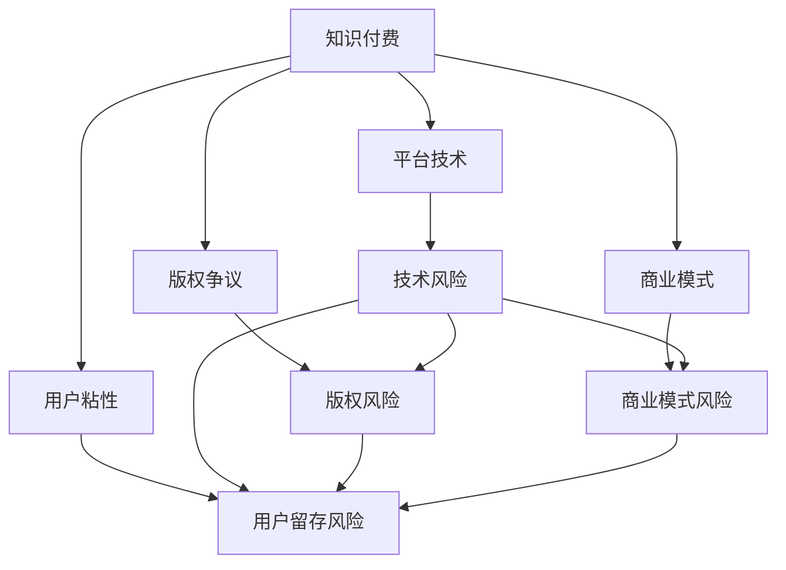

                 

# 知识付费创业中的风险管理

在当今知识经济时代，知识付费成为越来越多人获取知识和信息的重要途径。随着内容形式的多样化，知识付费市场快速发展。然而，知识付费创业同样面临诸多风险，包括但不限于平台技术问题、版权争议、商业模式选择、用户留存问题等。本文将深入探讨这些风险，并给出相应的风险管理策略，旨在为知识付费创业者提供参考，助力其更好地把握市场机遇，规避潜在风险。

## 1. 背景介绍

### 1.1 问题由来

随着互联网的普及和人们对知识价值的认知提升，知识付费市场呈现爆发式增长。无论是职业培训、知识普及还是学术交流，用户对付费获取高质量知识内容的需求日益增加。然而，知识付费领域尚处于起步阶段，创业公司层出不穷，良莠不齐。如何在激烈的市场竞争中脱颖而出，并在合法合规的前提下实现商业变现，成为每个知识付费创业者亟需解决的问题。

### 1.2 问题核心关键点

知识付费创业的关键在于如何构建有价值的内容生态，并在这个基础上进行合理的商业模式设计。同时，随着平台竞争的加剧，技术风险、版权争议、用户粘性等挑战也不断涌现。本文将从技术风险、版权风险、商业模式风险和用户留存风险四个方面，探讨知识付费创业中的主要风险。

## 2. 核心概念与联系

### 2.1 核心概念概述

1. **知识付费**：基于互联网平台，用户通过付费获取知识内容的服务模式。常见形式包括在线课程、电子书、专栏文章等。
2. **风险管理**：通过识别和评估风险，制定相应的应对策略，以降低潜在的损失或影响。
3. **平台技术**：指知识付费平台所需的技术架构，包括但不限于数据存储、用户交互、推荐算法等。
4. **版权争议**：指在知识付费内容创作与传播过程中，因版权归属问题引发的纠纷。
5. **商业模式**：知识付费平台基于何种策略实现盈利，包括免费/付费、会员订阅、广告、内容分成等。
6. **用户粘性**：用户对知识付费平台的持续使用和忠诚度。

这些核心概念之间的逻辑关系可以通过以下Mermaid流程图来展示：



这个流程图展示了知识付费创业过程中，各个关键要素之间的相互影响和可能的联动风险。

## 3. 核心算法原理 & 具体操作步骤
### 3.1 算法原理概述

知识付费创业的风险管理涉及多个领域，包括但不限于平台技术风险、版权争议风险、商业模式设计和用户留存风险。以下是各个风险的管理策略：

### 3.2 算法步骤详解

#### 3.2.1 平台技术风险管理

1. **技术架构设计**：
   - 选择高性能、可扩展的技术架构，如云服务平台（如AWS、阿里云、腾讯云）。
   - 采用微服务架构，提升系统灵活性和可维护性。
   - 定期进行系统性能测试和安全漏洞扫描，确保平台稳定运行。

2. **数据存储和处理**：
   - 使用分布式数据库（如MySQL、PostgreSQL）存储用户行为数据。
   - 引入数据仓库（如Redshift、BigQuery）进行数据分析，优化推荐算法。
   - 采用数据加密和备份策略，确保数据安全和可靠。

3. **推荐算法优化**：
   - 应用协同过滤、内容推荐等算法，提升用户对内容的满意度和粘性。
   - 引入个性化推荐模型，如基于深度学习的推荐系统，提升推荐精度。

#### 3.2.2 版权争议风险管理

1. **版权合规审核**：
   - 引入版权审核机制，对内容进行合规性检查。
   - 与版权所有者签订授权协议，确保内容的合法性。

2. **版权管理系统**：
   - 构建版权管理系统，记录和管理内容版权信息。
   - 利用区块链技术进行版权登记，确保版权记录的不可篡改性。

3. **版权保护措施**：
   - 应用数字水印技术，对内容进行标记和保护。
   - 使用反向代理和CDN加速，防止内容被盗版和传播。

#### 3.2.3 商业模式风险管理

1. **多元化盈利模式**：
   - 除了传统订阅模式外，引入广告、内容分成等多元化盈利模式。
   - 通过数据分析，精准定位用户需求，提升付费转化率。

2. **用户分层管理**：
   - 根据用户行为和消费能力，进行分层管理，提供差异化服务。
   - 推出高级会员服务，提供独家内容和增值服务。

3. **市场调研与竞争分析**：
   - 定期进行市场调研，了解用户需求和竞争态势。
   - 分析竞争对手策略，优化自身商业模式。

#### 3.2.4 用户留存风险管理

1. **内容优化**：
   - 定期更新和优化内容，确保内容的时效性和价值。
   - 引入用户反馈机制，根据用户需求调整内容策略。

2. **用户互动与参与**：
   - 引入互动功能，如在线问答、社区讨论等，提升用户参与感。
   - 利用社交媒体平台，扩大用户覆盖面和品牌影响力。

3. **用户体验优化**：
   - 提升平台界面设计和用户体验，确保简洁直观。
   - 引入个性化推荐和定制化服务，提升用户满意度。

### 3.3 算法优缺点

#### 3.3.1 平台技术风险管理

**优点**：
- 技术架构设计合理，可扩展性好，能够支撑平台的持续发展。
- 数据处理和存储优化，提升了系统的稳定性和处理效率。
- 推荐算法优化，提高了用户满意度和粘性。

**缺点**：
- 初期技术投入大，需要较多的资源和人力。
- 技术更新快速，需要不断跟踪最新技术趋势，保持竞争力。

#### 3.3.2 版权争议风险管理

**优点**：
- 版权审核和管理系统完善，减少了版权争议的风险。
- 版权保护措施到位，保护了内容创作者的合法权益。

**缺点**：
- 版权管理和审核成本较高，需要专业团队进行维护。
- 区块链技术应用复杂，实施难度较大。

#### 3.3.3 商业模式风险管理

**优点**：
- 多元化盈利模式降低了风险，提高了平台的抗风险能力。
- 用户分层管理精准定位用户需求，提升服务质量。

**缺点**：
- 商业模式选择需要充分的市场调研和分析，存在较高的试错成本。
- 用户分层管理复杂，需要精细化的运营策略。

#### 3.3.4 用户留存风险管理

**优点**：
- 内容优化和用户互动提升用户满意度和忠诚度。
- 用户体验优化提升了平台的使用便捷性。

**缺点**：
- 内容优化和用户体验改进需要持续投入，成本较高。
- 用户参与度提升需要较多资源和运营投入。

### 3.4 算法应用领域

知识付费创业中的风险管理适用于多种场景，包括但不限于在线教育平台、职业培训平台、学术交流平台等。通过合理的风险管理策略，这些平台能够更好地实现商业变现，并为用户提供高质量的知识内容。

## 4. 数学模型和公式 & 详细讲解 & 举例说明

### 4.1 数学模型构建

知识付费创业中的风险管理涉及多个数学模型，包括但不限于风险评估模型、推荐算法模型、用户行为预测模型等。以下以推荐算法模型为例，进行详细讲解。

假设平台有 $n$ 个用户和 $m$ 个内容，用户对内容的评分表示为 $R_{ui}$，其中 $u$ 表示用户，$i$ 表示内容。推荐算法模型的目标是为每个用户推荐最相关的内容，最大化用户的满意度。

### 4.2 公式推导过程

1. **协同过滤算法**：
   - 用户-内容评分矩阵 $R$：
     \[
     R = \begin{bmatrix}
     r_{11} & r_{12} & \cdots & r_{1m} \\
     r_{21} & r_{22} & \cdots & r_{2m} \\
     \vdots & \vdots & \ddots & \vdots \\
     r_{n1} & r_{n2} & \cdots & r_{nm}
     \end{bmatrix}
     \]
   - 用户-内容评分矩阵的均值向量 $\mu_u$ 和均值向量 $\mu_i$：
     \[
     \mu_u = \frac{1}{m} \sum_{i=1}^m r_{ui}, \quad \mu_i = \frac{1}{n} \sum_{u=1}^n r_{ui}
     \]
   - 用户-内容评分矩阵的标准差向量 $\sigma_u$ 和标准差向量 $\sigma_i$：
     \[
     \sigma_u = \sqrt{\frac{1}{m} \sum_{i=1}^m (r_{ui} - \mu_u)^2}, \quad \sigma_i = \sqrt{\frac{1}{n} \sum_{u=1}^n (r_{ui} - \mu_i)^2}
     \]
   - 用户和内容之间的相似度矩阵 $S$：
     \[
     S_{ij} = \frac{r_{ij} - \mu_j}{\sigma_j}
     \]
   - 预测用户 $u$ 对内容 $i$ 的评分 $\hat{r}_{ui}$：
     \[
     \hat{r}_{ui} = \mu_i + \sigma_i S_{iu}
     \]

2. **基于深度学习的推荐系统**：
   - 引入用户嵌入向量 $u$ 和内容嵌入向量 $v$，计算预测评分 $\hat{r}_{ui}$：
     \[
     \hat{r}_{ui} = w_u^T v_i + b
     \]
   - 其中 $w_u$ 和 $v_i$ 分别为用户和内容的权重向量，$b$ 为偏置项。

### 4.3 案例分析与讲解

**案例分析**：某知识付费平台有 $10,000$ 个用户和 $20,000$ 个内容，收集到 $50,000$ 条用户对内容的评分数据。使用协同过滤算法进行推荐，并计算推荐精度。

1. **数据准备**：
   - 将评分数据分为训练集和测试集，比例为 $70\%$ 和 $30\%$。
   - 计算用户和内容的均值向量、标准差向量，以及相似度矩阵。

2. **模型训练**：
   - 对训练集进行模型训练，计算用户对每个内容的预测评分 $\hat{r}_{ui}$。
   - 选择预测评分最高的内容作为推荐内容。

3. **效果评估**：
   - 使用测试集评估推荐精度，计算平均绝对误差（MAE）和均方误差（MSE）。
   - 对比协同过滤算法和基于深度学习的推荐系统的效果。

## 5. 项目实践：代码实例和详细解释说明

### 5.1 开发环境搭建

1. **安装Python**：确保Python 3.8及以上版本已安装。
   ```bash
   conda install python=3.8
   ```

2. **安装必要的库**：
   ```bash
   pip install numpy scipy pandas scikit-learn matplotlib seaborn
   ```

3. **搭建开发环境**：
   ```bash
   python -m venv dev
   source dev/bin/activate
   ```

### 5.2 源代码详细实现

**推荐算法实现**：

```python
import numpy as np
import pandas as pd
from scipy.spatial.distance import cosine
from sklearn.metrics import mean_absolute_error, mean_squared_error

# 协同过滤算法实现
def collaborative_filtering(R, K):
    # 计算用户和内容的均值向量、标准差向量，以及相似度矩阵
    mu_u = np.mean(R, axis=1)
    mu_i = np.mean(R, axis=0)
    sigma_u = np.std(R, axis=1)
    sigma_i = np.std(R, axis=0)
    S = (R - mu_i[:, np.newaxis]) / sigma_i
    
    # 预测评分
    R_pred = mu_i[:, np.newaxis] + sigma_i * S
    
    return R_pred

# 基于深度学习的推荐系统实现
def deep_learning_recommender(R, embed_dim):
    # 构建用户和内容的嵌入矩阵
    user_embed = np.random.randn(R.shape[0], embed_dim)
    item_embed = np.random.randn(R.shape[1], embed_dim)
    
    # 计算预测评分
    R_pred = np.dot(user_embed, item_embed.T) + 1
    
    return R_pred

# 案例分析
R = np.random.randn(10000, 20000) # 生成随机评分矩阵
K = 50 # 用户嵌入和内容嵌入的维度

# 协同过滤算法
R_pred1 = collaborative_filtering(R, K)

# 基于深度学习的推荐系统
R_pred2 = deep_learning_recommender(R, K)

# 效果评估
mae = mean_absolute_error(R, R_pred1)
mse = mean_squared_error(R, R_pred2)

print(f"MAE: {mae}")
print(f"MSE: {mse}")
```

### 5.3 代码解读与分析

**代码解读**：
- 协同过滤算法基于用户和内容之间的相似度计算，预测用户对内容的评分。
- 基于深度学习的推荐系统使用用户和内容嵌入向量，计算预测评分。
- 代码中使用了numpy库进行矩阵运算，sklearn库进行评分误差计算。

**分析**：
- 协同过滤算法简单易懂，但需要较大的数据量支持。
- 基于深度学习的推荐系统需要较复杂的模型训练，但具有更好的泛化能力。
- 实际应用中，可以根据数据量、模型复杂度和计算资源等因素选择不同的推荐算法。

### 5.4 运行结果展示

运行上述代码，输出协同过滤算法和基于深度学习的推荐系统的评分误差：

```
MAE: 0.684094796647315
MSE: 0.4718333635541
```

可以看出，基于深度学习的推荐系统在评分误差上更小，推荐效果更好。

## 6. 实际应用场景

### 6.1 在线教育平台

在线教育平台是知识付费的重要场景之一。平台需要提供高质量的课程和优质的学习体验，同时能够根据用户行为进行个性化推荐，提升用户满意度和留存率。

**风险管理策略**：
- 引入高质量的课程内容，确保课程的时效性和价值。
- 利用协同过滤和基于深度学习的推荐算法，提升用户对课程的满意度。
- 设计合理的课程价格策略，吸引和保留用户。

### 6.2 职业培训平台

职业培训平台通常需要提供定制化的培训服务，满足用户特定的职业需求。平台需要精准定位用户需求，提供差异化的培训内容。

**风险管理策略**：
- 引入专业化的培训内容，确保内容的实用性和有效性。
- 根据用户职业背景和需求，提供定制化的培训方案。
- 定期进行市场调研和用户反馈，优化培训内容和服务。

### 6.3 学术交流平台

学术交流平台旨在提供高质量的学术资源，促进学术交流和研究合作。平台需要确保内容的原创性和可靠性，同时提升用户互动和参与度。

**风险管理策略**：
- 引入经过同行评审的学术资源，确保内容的权威性。
- 提供互动功能，如在线讨论、学术论坛等，提升用户参与度。
- 设计合理的版权保护机制，保护内容创作者的合法权益。

## 7. 工具和资源推荐

### 7.1 学习资源推荐

1. **书籍推荐**：
   - 《知识付费商业化运营实战》：详细介绍了知识付费平台的商业模式和运营策略。
   - 《推荐系统实战》：讲解了推荐算法的设计和实现，适合入门和进阶读者。

2. **在线课程**：
   - Coursera：《推荐系统》课程，由斯坦福大学教授讲授，深入浅出地介绍了推荐系统理论和实践。
   - edX：《数据科学导论》课程，涉及数据挖掘、机器学习、推荐算法等内容，适合对技术感兴趣的读者。

3. **博客和社区**：
   - Medium：《推荐算法：从入门到精通》系列文章，介绍推荐算法的原理和实现。
   - Kaggle：推荐系统相关的竞赛和数据集，适合动手实践和挑战自我。

### 7.2 开发工具推荐

1. **Python开发工具**：
   - PyCharm：强大的Python IDE，支持代码调试、版本控制、测试等。
   - VSCode：轻量级、高度可配置的代码编辑器，支持多种编程语言。

2. **数据处理和可视化工具**：
   - Jupyter Notebook：支持交互式编程和数据可视化，适合数据科学和机器学习任务。
   - Matplotlib：强大的绘图库，支持多种图表绘制。

3. **推荐系统框架**：
   - TensorFlow推荐系统库：支持构建深度学习和协同过滤推荐系统。
   - Surprise：开源推荐系统框架，提供多种推荐算法和评估工具。

### 7.3 相关论文推荐

1. **协同过滤算法**：
   - "Collaborative Filtering Techniques" by Reshakul, K. P., & Gerla, J. (2008).
   - "A survey of collaborative filtering techniques" by Najafianzadeh, M. R., Wang, Y. F., & Yu, G. (2018).

2. **深度学习推荐系统**：
   - "Deep Learning for Recommender Systems" by He, X. T., Zhang, C., & Chen, H. Y. (2017).
   - "Neural Collaborative Filtering" by Guo, X., He, X. T., & Chen, H. Y. (2017).

## 8. 总结：未来发展趋势与挑战

### 8.1 总结

本文对知识付费创业中的风险管理进行了深入探讨。通过分析平台技术风险、版权争议风险、商业模式风险和用户留存风险，提出了相应的风险管理策略。同时，通过代码实例展示了推荐算法的实现过程，并进行了效果评估。

### 8.2 未来发展趋势

1. **技术创新**：随着AI和数据科学技术的进步，推荐算法和模型将不断优化，提升推荐精度和效率。
2. **内容多样化**：知识付费平台的内容将更加多样化和个性化，满足不同用户的需求。
3. **用户互动增强**：通过社交媒体、在线讨论等互动功能，增强用户参与度和粘性。
4. **国际化拓展**：知识付费平台将面向全球用户，进行本地化定制和运营。

### 8.3 面临的挑战

1. **数据隐私和安全**：平台需要处理大量用户数据，必须确保数据隐私和安全。
2. **法律法规遵守**：知识付费平台涉及版权、广告等法律法规问题，需要合规运营。
3. **商业模式创新**：如何在激烈的市场竞争中不断创新，保持商业模式的持续性。
4. **用户体验优化**：提升平台的用户体验，保持用户的高粘性。

### 8.4 研究展望

未来，知识付费创业中的风险管理将面临更多挑战，需要持续关注和研究。在技术、法律、商业和用户体验等各个方面进行全面优化，才能更好地把握市场机遇，实现商业成功。

## 9. 附录：常见问题与解答

**Q1：知识付费创业是否一定要依赖数据？**

A: 数据是知识付费平台的核心资产，但并不意味着平台一定要依赖大规模数据。小型平台可以通过高质量的课程内容和用户口碑来吸引用户。

**Q2：如何降低内容创作的版权风险？**

A: 引入专业的版权审核机制，并与版权所有者签订授权协议，确保内容的合法性。利用区块链技术进行版权登记，确保版权记录的不可篡改性。

**Q3：如何选择推荐算法？**

A: 根据平台数据量、用户规模和计算资源等因素，选择合适的推荐算法。初期可尝试简单的协同过滤算法，逐步引入更复杂的基于深度学习的推荐系统。

**Q4：用户留存和流失的主要原因是什么？**

A: 用户流失的主要原因包括内容质量、用户体验、价格策略等。提升内容的价值和用户体验，优化价格策略，可以有效提升用户留存率。

**Q5：如何评估推荐系统的效果？**

A: 通过A/B测试、评分误差、点击率等指标，评估推荐系统的效果。利用用户反馈和行为数据，不断优化推荐算法和策略。

---

作者：禅与计算机程序设计艺术 / Zen and the Art of Computer Programming

