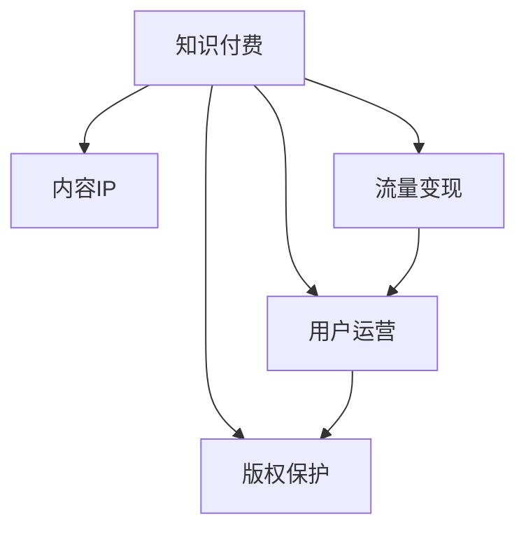

                 

# 知识付费创业的内容IP打造策略

> 关键词：知识付费, 内容IP, 流量变现, 用户运营, 版权保护

## 1. 背景介绍

随着互联网技术的不断进步，知识付费作为一种新兴的商业模式，逐渐成为内容创作者与用户之间获取知识与技能的重要桥梁。知识付费不仅为用户提供了高效、便捷的学习途径，也为内容创作者开辟了一条可持续发展的道路。然而，如何在激烈的市场竞争中打造独特、高质量的内容IP，从而实现有效的流量变现和用户运营，成为知识付费创业的关键问题。本文将系统阐述知识付费内容IP打造策略，涵盖从内容创作、运营推广到商业变现的全流程，帮助创业者和投资者制定有效的战略和运营策略。

## 2. 核心概念与联系

### 2.1 核心概念概述

- **知识付费**：基于互联网的知识共享模式，用户为获取专业知识或技能支付费用的商业模式。
- **内容IP**：指具有较高市场价值和独特品牌效应的内容产品或服务，如专栏文章、在线课程、音频节目等。
- **流量变现**：通过优化内容与运营策略，吸引和留住大量目标用户，从而实现知识付费内容的商业化变现。
- **用户运营**：通过用户调研、数据挖掘等手段，精准定位目标用户，并提供定制化服务，提升用户满意度和留存率。
- **版权保护**：为保障内容创作者合法权益，防止盗版和抄袭，采用法律和技术手段对内容进行保护。

以上概念之间的逻辑关系可以通过以下Mermaid流程图来展示：



该流程图展示了知识付费的各个核心要素及其相互关系。知识付费的成败，关键在于是否能打造出具有高市场价值的内容IP，并通过有效的流量变现和用户运营策略，最终实现内容变现，同时保障内容创作者的合法权益。

## 3. 核心算法原理 & 具体操作步骤

### 3.1 算法原理概述

内容IP打造的核心在于内容的原创性、专业性和商业价值。从算法角度来看，内容IP打造策略主要包括以下几个关键步骤：

1. **内容选题与策划**：通过数据分析和用户调研，确定内容主题和形式。
2. **内容创作与制作**：采用先进的工具和平台，高效生成高质量内容。
3. **内容分发与推广**：通过多渠道推广，最大化内容曝光度和用户吸引力。
4. **用户互动与反馈**：收集用户反馈，调整内容策略，提升用户体验。
5. **数据分析与优化**：通过数据分析工具，评估内容表现，进行持续优化。

### 3.2 算法步骤详解

#### 3.2.1 内容选题与策划

内容选题是内容IP打造的基础。选题需考虑市场趋势、用户需求、创作者特长等因素，采用科学的方法进行决策。

1. **市场调研**：通过调研报告、行业白皮书等资料，了解当前市场的热点话题和趋势。
2. **用户调研**：通过问卷调查、访谈等方式，获取目标用户的具体需求和偏好。
3. **竞争分析**：对比竞争对手的内容，找到差异化的切入点。
4. **创作计划**：制定内容创作的时间表和阶段性目标，确保内容持续输出。

#### 3.2.2 内容创作与制作

高效、高质量的内容制作是内容IP成功的关键。创作过程需结合多种工具和技术手段，以提高效率和质量。

1. **内容创作工具**：使用AI写作工具（如GPT-4）、知识图谱工具（如Neo4j）等，辅助内容生成。
2. **多媒体制作**：采用视频编辑软件（如Adobe Premiere）、音频制作工具（如Audacity）等，制作丰富多样的内容形式。
3. **内容管理平台**：利用内容管理系统（如WordPress），高效管理内容的发布和更新。

#### 3.2.3 内容分发与推广

内容分发与推广是内容IP变现的核心。有效的分发策略能大大提升内容的曝光度和用户吸引力。

1. **多渠道分发**：通过社交媒体、搜索引擎、付费平台等渠道，全方位推广内容。
2. **内容营销**：利用SEO、内容营销技巧，提升内容在搜索引擎中的排名。
3. **付费广告**：通过精准投放的广告，吸引目标用户。

#### 3.2.4 用户互动与反馈

用户互动与反馈是内容优化与改进的重要依据。及时获取用户反馈，调整内容策略，可提升用户满意度和留存率。

1. **用户评论与评分**：通过评论区、评分系统等收集用户反馈。
2. **用户问卷调查**：定期发送问卷调查，了解用户对内容的满意度与改进建议。
3. **社群运营**：建立社群平台，与用户进行深度交流和互动。

#### 3.2.5 数据分析与优化

数据分析与优化是内容IP持续改进的关键。通过数据分析工具，评估内容表现，进行持续优化，提升内容质量与用户吸引力。

1. **数据监控**：使用Google Analytics等工具，监控内容在各个渠道的表现。
2. **用户行为分析**：通过用户行为数据，分析用户兴趣和偏好。
3. **内容优化**：根据数据分析结果，不断优化内容策略。

### 3.3 算法优缺点

内容IP打造策略具有以下优点：

1. **高效性**：通过科学的数据分析与选题策划，快速定位市场热点，提升内容生产效率。
2. **市场导向**：结合市场趋势和用户需求，提升内容的市场竞争力。
3. **用户黏性**：通过优质内容和互动策略，提升用户满意度和留存率。

同时，也存在以下缺点：

1. **资源需求高**：内容创作与分发需要大量的资源投入，包括人力、时间和资金。
2. **风险高**：内容IP的成功依赖于市场定位与用户反馈，风险较高。
3. **内容版权保护难度大**：内容创作者需面对盗版和抄袭问题，保护版权成本较高。

### 3.4 算法应用领域

内容IP打造策略可以广泛应用于各类知识付费平台，包括在线教育、科技博客、财经分析等。通过科学的内容打造策略，可以在多个领域实现高质量内容IP的构建与变现。

## 4. 数学模型和公式 & 详细讲解

### 4.1 数学模型构建

为了更好地量化内容IP打造的效果，我们可以构建以下数学模型：

1. **用户留存率**：$R = \frac{N_{\text{留存}}}{N_{\text{总}}}$
   - $N_{\text{留存}}$：在指定时间内仍活跃的用户数。
   - $N_{\text{总}}$：在指定时间内新注册的用户数。

2. **内容点击率**：$C = \frac{N_{\text{点击}}}{N_{\text{曝光}}}$
   - $N_{\text{点击}}$：在指定时间内用户点击内容的次数。
   - $N_{\text{曝光}}$：在指定时间内内容被展示的次数。

3. **转化率**：$T = \frac{N_{\text{转化}}}{N_{\text{点击}}}$
   - $N_{\text{转化}}$：在指定时间内完成付费的用户数。
   - $N_{\text{点击}}$：在指定时间内用户点击内容的次数。

4. **内容价值指数**：$V = \frac{N_{\text{付费}}}{N_{\text{曝光}}}$
   - $N_{\text{付费}}$：在指定时间内付费的用户数。
   - $N_{\text{曝光}}$：在指定时间内内容被展示的次数。

### 4.2 公式推导过程

以用户留存率模型为例，进行公式推导：

设内容在时间$t$内有$N$个新用户注册，其中在时间$t_1$内有$k$个用户流失，则用户留存率为：

$$ R = \frac{N-k}{N} $$

进一步简化得到：

$$ R = 1 - \frac{k}{N} $$

用户流失主要受内容质量、用户体验、市场竞争等因素影响。通过分析这些因素，可以更好地提升用户留存率。

### 4.3 案例分析与讲解

以某在线教育平台的内容IP打造为例，分析其运营策略：

1. **市场调研**：通过问卷调查，了解用户对在线课程的兴趣与需求。
2. **内容创作**：邀请知名专家，制作高质量的在线课程，并提供丰富的课程案例。
3. **内容分发**：通过社交媒体、搜索引擎优化（SEO）等方式，推广在线课程。
4. **用户互动**：建立在线论坛和社群，与用户进行深度交流，收集反馈。
5. **数据分析**：使用Google Analytics等工具，监控课程点击率、留存率和转化率，及时调整策略。

通过以上策略，该平台成功吸引了大量目标用户，提升了用户满意度和留存率，实现了内容变现。

## 5. 项目实践：代码实例和详细解释说明

### 5.1 开发环境搭建

1. **开发环境配置**：
   - 安装Python 3.x和Anaconda。
   - 创建虚拟环境，安装必要的依赖库，如TensorFlow、Keras等。
   - 安装数据分析工具，如Pandas、Numpy、Matplotlib等。

2. **内容管理系统**：
   - 搭建WordPress等CMS系统，用于内容发布和管理。
   - 配置自动发布和备份功能，确保内容安全与高效管理。

3. **用户互动平台**：
   - 搭建Django等Web框架，实现用户注册、登录、评论等功能。
   - 集成第三方社交平台API，增强用户互动。

### 5.2 源代码详细实现

以用户评论系统为例，实现代码功能：

```python
# 用户注册和登录
from django.contrib.auth.forms import UserCreationForm, AuthenticationForm
from django.contrib.auth import login, logout

def register(request):
    if request.method == 'POST':
        form = UserCreationForm(request.POST)
        if form.is_valid():
            form.save()
            username = form.cleaned_data.get('username')
            raw_password = form.cleaned_data.get('password1')
            user = authenticate(username=username, password=raw_password)
            login(request, user)
            return redirect('home')
    else:
        form = UserCreationForm()
    return render(request, 'register.html', {'form': form})

def login_view(request):
    if request.method == 'POST':
        form = AuthenticationForm(data=request.POST)
        if form.is_valid():
            user = form.get_user()
            login(request, user)
            return redirect('home')
    else:
        form = AuthenticationForm()
    return render(request, 'login.html', {'form': form})

def logout_view(request):
    logout(request)
    return redirect('home')

# 用户评论功能
from django.contrib import messages

def comment(request, post_id):
    post = get_object_or_404(Post, pk=post_id)
    if request.method == 'POST':
        form = CommentForm(request.POST)
        if form.is_valid():
            form.save(commit=False)
            form.comment.post = post
            form.save()
            messages.success(request, 'Comment was posted successfully!')
            return redirect('post_detail', pk=post.pk)
    else:
        form = CommentForm()
    return render(request, 'post/comment.html', {'form': form})
```

### 5.3 代码解读与分析

上述代码实现了用户注册、登录、评论等基本功能。其中，用户注册和登录通过Django的内置表单验证机制，用户评论通过视图函数和表单验证实现。

1. **用户注册和登录**：
   - 使用`UserCreationForm`和`AuthenticationForm`，验证用户信息并登录。
   - 通过`authenticate`和`login`方法，完成用户认证与登录。

2. **用户评论**：
   - 通过`CommentForm`表单，接收用户评论信息。
   - 在`comment`视图函数中，验证表单并保存评论，更新`Post`对象，展示成功消息。

3. **用户互动平台**：
   - 通过`messages`模块，在视图中展示成功消息。
   - 通过`redirect`方法，实现页面跳转。

4. **数据模型**：
   - 定义`Post`和`Comment`模型，存储文章和评论信息。
   - 通过`form.cleaned_data`获取表单数据，保存到数据库。

### 5.4 运行结果展示

运行上述代码后，用户可以在注册、登录后，进行评论互动。评论信息存储在数据库中，通过前端展示在页面上，确保数据的安全性和可靠性。

## 6. 实际应用场景

### 6.1 在线教育平台

在线教育平台是知识付费创业的主要应用场景之一。通过内容IP打造策略，平台可以提供高质量的在线课程、教师讲座等，吸引目标用户，实现内容变现。

#### 6.1.1 运营策略
1. **课程策划**：根据市场需求和用户反馈，策划和制作高质量课程。
2. **内容推广**：通过搜索引擎优化、社交媒体营销等方式，推广课程。
3. **用户互动**：通过在线论坛、社群等方式，与用户互动，收集反馈。
4. **数据分析**：使用数据分析工具，评估课程表现，进行持续优化。

#### 6.1.2 案例分析
某在线教育平台通过打造高质量编程课程，吸引了大量计算机科学领域的学生和从业者，实现了内容变现。通过数据分析工具，平台不断优化课程内容和推广策略，提升用户满意度和留存率。

### 6.2 科技博客

科技博客是知识付费创业的另一重要应用场景。通过内容IP打造策略，博客可以提供深入的技术分析、行业报告等，吸引目标读者，实现内容变现。

#### 6.2.1 运营策略
1. **选题策划**：通过数据分析和用户调研，确定博客主题和形式。
2. **内容创作**：邀请知名专家，制作高质量的科技文章和报告。
3. **内容分发**：通过社交媒体、搜索引擎优化等方式，推广博客内容。
4. **用户互动**：建立在线论坛和社群，与用户进行深度交流，收集反馈。
5. **数据分析**：使用数据分析工具，评估博客点击率、留存率和转化率，及时调整策略。

#### 6.2.2 案例分析
某科技博客通过打造高质量的科技文章和报告，吸引了大量技术爱好者，实现了内容变现。通过数据分析工具，平台不断优化内容策略，提升用户满意度和留存率。

### 6.3 财经分析平台

财经分析平台是知识付费创业的又一重要应用场景。通过内容IP打造策略，平台可以提供深入的财经分析和市场报告，吸引目标用户，实现内容变现。

#### 6.3.1 运营策略
1. **市场调研**：通过调研报告、行业白皮书等资料，了解当前市场的热点话题和趋势。
2. **内容创作**：邀请知名财经专家，制作高质量的财经分析报告和市场预测。
3. **内容分发**：通过社交媒体、搜索引擎优化等方式，推广财经内容。
4. **用户互动**：建立在线论坛和社群，与用户进行深度交流，收集反馈。
5. **数据分析**：使用数据分析工具，评估财经内容表现，进行持续优化。

#### 6.3.2 案例分析
某财经分析平台通过打造高质量的财经分析报告和市场预测，吸引了大量财经领域的专业人士，实现了内容变现。通过数据分析工具，平台不断优化内容策略，提升用户满意度和留存率。

## 7. 工具和资源推荐

### 7.1 学习资源推荐

1. **《深度学习实战》系列博文**：作者通过深入浅出的语言，详细介绍了深度学习模型和算法，适合初学者入门。
2. **《Python深度学习》书籍**：由Francois Chollet所著，全面介绍了TensorFlow和Keras的使用，适合中级开发者。
3. **《内容营销》课程**：提供全面的内容营销策略和实战案例，适合内容创作者和运营人员。
4. **《数据分析与可视化》课程**：通过数据分析工具，学习数据处理和可视化技术，适合数据分析人员。
5. **《编程之美》博客**：作者通过实际案例，讲解编程技巧和算法优化，适合软件开发人员。

通过这些学习资源，可以系统掌握内容IP打造的相关知识和技能。

### 7.2 开发工具推荐

1. **Python 3.x**：免费的开源编程语言，具有强大的数据处理和分析能力，适用于多种应用场景。
2. **Anaconda**：用于创建和管理Python虚拟环境，方便多项目开发。
3. **Jupyter Notebook**：支持交互式编程和数据分析，适合深度学习模型开发。
4. **TensorFlow**：由Google开发的深度学习框架，支持GPU和TPU加速，适合大规模模型训练。
5. **Keras**：基于TensorFlow的高层API，提供便捷的深度学习模型构建工具。
6. **Django**：Python的Web开发框架，支持数据库管理和用户认证。

这些工具为内容IP打造提供了强有力的技术支持。

### 7.3 相关论文推荐

1. **《深度学习在自然语言处理中的应用》**：介绍了深度学习模型在NLP中的应用，包括RNN、LSTM、Transformer等。
2. **《知识付费市场分析报告》**：通过数据分析，了解知识付费市场的现状和趋势，为内容创作提供指导。
3. **《内容运营策略》**：介绍内容运营的策略和方法，提升内容变现效果。
4. **《用户行为分析与优化》**：通过用户行为数据分析，优化内容策略，提升用户满意度。

这些论文为内容IP打造提供了理论支持和实践指导。

## 8. 总结：未来发展趋势与挑战

### 8.1 研究成果总结

通过系统阐述知识付费内容IP打造策略，本文档提供了从内容选题、创作、分发、运营到商业变现的全流程操作指南，帮助内容创作者和投资者制定有效的战略和运营策略。

### 8.2 未来发展趋势

1. **内容形式多样化**：随着用户需求的多样化，内容形式将更加丰富，包括视频、音频、直播等。
2. **互动性增强**：用户互动将成为内容IP打造的重要环节，通过社群、直播等方式，提升用户参与度。
3. **个性化推荐**：通过数据分析，实现个性化内容推荐，提升用户体验。
4. **技术融合**：内容IP打造将融合AI、大数据等前沿技术，提升内容智能化水平。

### 8.3 面临的挑战

1. **内容版权保护**：内容创作者需面对盗版和抄袭问题，保护版权成本较高。
2. **用户获取与留存**：内容创作者需不断优化内容策略，提升用户满意度和留存率。
3. **市场竞争**：知识付费市场竞争激烈，需制定有效的运营策略，吸引目标用户。

### 8.4 研究展望

1. **内容创意自动化**：通过AI技术，自动化内容创作，提升内容生产效率。
2. **用户行为预测**：通过机器学习模型，预测用户行为，优化内容策略。
3. **数据驱动决策**：通过大数据分析，指导内容创作与运营策略。
4. **跨平台运营**：通过多平台运营，扩大内容覆盖范围，提升用户互动与转化率。

这些研究方向将推动内容IP打造向更高层次发展，提升内容质量与用户价值。

## 9. 附录：常见问题与解答

**Q1：如何评估内容IP的市场价值？**

A: 评估内容IP的市场价值主要从以下几个方面入手：
1. **用户数量**：通过统计平台的用户数量和活跃度，评估内容IP的市场影响力。
2. **用户反馈**：通过用户评价和评论，了解用户对内容IP的认可度。
3. **商业变现**：通过广告收入、订阅费用等指标，评估内容IP的商业价值。
4. **市场竞争**：通过与竞争对手的比较，评估内容IP的市场竞争力。

**Q2：如何提升内容IP的用户留存率？**

A: 提升内容IP的用户留存率主要从以下几个方面入手：
1. **内容质量**：通过提高内容的专业性和原创性，提升用户满意度。
2. **互动机制**：通过建立社群和论坛，与用户进行深度交流，提升用户参与度。
3. **用户激励**：通过积分、优惠券等激励机制，提升用户黏性。
4. **个性化推荐**：通过数据分析，实现个性化内容推荐，提升用户体验。

**Q3：内容IP打造中如何处理版权问题？**

A: 处理版权问题主要从以下几个方面入手：
1. **版权登记**：通过版权登记，保护内容创作者合法权益。
2. **数字水印**：通过数字水印技术，防止内容盗版和抄袭。
3. **法律诉讼**：通过法律手段，打击盗版和抄袭行为。
4. **合作授权**：通过与平台和第三方合作，实现内容授权和保护。

**Q4：内容IP打造中如何优化内容分发策略？**

A: 优化内容分发策略主要从以下几个方面入手：
1. **多渠道分发**：通过社交媒体、搜索引擎、付费平台等渠道，全方位推广内容。
2. **内容营销**：利用SEO、内容营销技巧，提升内容在搜索引擎中的排名。
3. **付费广告**：通过精准投放的广告，吸引目标用户。
4. **数据分析**：通过数据分析工具，监控内容分发效果，及时调整策略。

**Q5：内容IP打造中如何提升内容创作效率？**

A: 提升内容创作效率主要从以下几个方面入手：
1. **自动化工具**：使用AI写作工具、知识图谱工具等，辅助内容生成。
2. **内容管理系统**：利用内容管理系统，高效管理内容的发布和更新。
3. **协作平台**：建立协作平台，便于内容创作者之间的交流与协作。
4. **持续优化**：通过用户反馈和数据分析，持续优化内容创作策略。

通过以上方法，可以有效提升内容创作效率，保障内容IP的高质量与高效性。

---

作者：禅与计算机程序设计艺术 / Zen and the Art of Computer Programming

