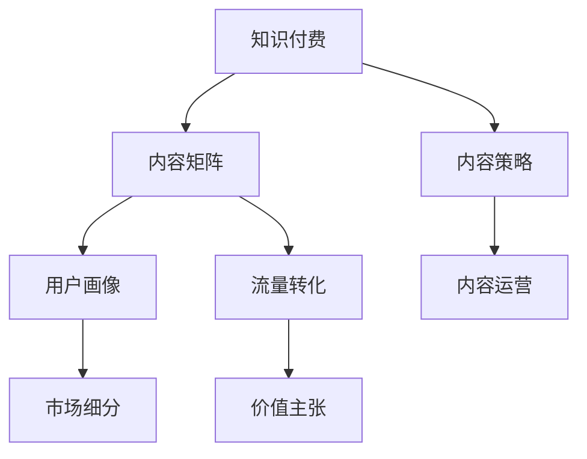

                 

# 知识付费创业的内容矩阵搭建策略

> 关键词：知识付费,内容矩阵,内容策略,用户洞察,市场细分,流量转化,内容运营,价值主张

## 1. 背景介绍

### 1.1 问题由来
知识付费行业近年来迅猛发展，为知识传播和商业变现提供了新的渠道。但随着市场竞争的加剧，内容质量的同质化、用户体验的欠缺以及流量的获取和转化问题，成为知识付费创业者面临的巨大挑战。如何搭建高效的内容矩阵，形成差异化的内容竞争优势，实现精准的用户定位和高效的流量转化，成为这一行业关注的焦点。

### 1.2 问题核心关键点
本文旨在从内容矩阵搭建的角度，全面探讨知识付费创业的策略与实践，包括内容分类、用户画像、流量转化、内容运营、市场细分等多个关键环节，力求帮助创业者构建独特的内容生态，实现商业模式的价值最大化。

### 1.3 问题研究意义
构建有效的知识付费内容矩阵，不仅能够提升平台内容质量，增强用户粘性，还能实现高效的流量转化，从而获得可持续的商业模式。具体而言，优秀的内容矩阵能够：
- 帮助平台筛选优质内容，提升整体内容质量。
- 根据用户画像和兴趣，实现精准的内容推荐，提升用户体验。
- 优化流量分发策略，最大化流量转化效率。
- 构建用户社区，实现用户粘性和商业变现。
- 分析用户行为数据，持续优化内容策略。

## 2. 核心概念与联系

### 2.1 核心概念概述

为更好地理解知识付费创业的内容矩阵搭建策略，本节将介绍几个核心概念：

- **知识付费**：指通过订阅、购买等方式，为特定知识内容付费的行为。知识付费平台的成功运营依赖于高质量、高价值的内容吸引用户。
- **内容矩阵**：指平台上的内容分类体系，通过细化内容维度，形成层次分明、相互关联的内容体系，为用户提供全方位的知识服务。
- **内容策略**：指针对特定目标用户群体，设计的内容内容形式、投放渠道及推广方式，实现内容精准覆盖用户，提升平台价值主张。
- **用户画像**：指对目标用户群体的详细描述，包括年龄、性别、职业、兴趣、行为特征等，用于实现内容定制和精准推荐。
- **流量转化**：指将潜在用户转化为付费用户的过程，依赖于内容质量、用户体验、营销策略等多方面因素。
- **内容运营**：指平台对内容的日常管理与运营，包括内容审核、用户互动、数据分析等，确保内容质量并实现用户粘性。
- **市场细分**：指将大市场细分为多个具有相似需求和特征的小市场，以便于精准营销和个性化服务。
- **价值主张**：指平台提供的核心价值，区别于竞争对手的关键卖点，吸引用户的核心因素。

这些概念之间的逻辑关系可以通过以下Mermaid流程图来展示：



这个流程图展示的知识付费创业的关键概念及其之间的关系：

1. 知识付费依赖于内容矩阵来提供高质量、高价值的内容。
2. 内容策略设计了如何通过内容实现精准用户覆盖和流量转化。
3. 用户画像和市场细分帮助内容策略实现对不同用户群体的精准定位。
4. 流量转化过程通过内容运营得以实现。
5. 最终，价值主张决定了用户选择知识付费平台的核心动力。

## 3. 核心算法原理 & 具体操作步骤
### 3.1 算法原理概述

知识付费创业中的内容矩阵搭建，本质上是一种基于用户行为数据分析的决策过程。其核心思想是通过数据挖掘和机器学习等技术，对用户的行为和偏好进行建模，进而设计出贴合用户需求的内容分类体系和推荐策略。

形式化地，假设平台用户数量为 $U$，内容数量为 $C$，将用户和内容分别表示为向量 $u$ 和 $c$。定义用户行为矩阵 $M \in \mathbb{R}^{U \times C}$，其中 $M_{iu} = 1$ 表示用户 $u$ 对内容 $i$ 进行了互动（如浏览、点赞、评论等）。

目标是构建一个内容分类体系 $\mathcal{C}$ 和一个推荐函数 $f(u)$，使得：

$$
\max_{\mathcal{C}, f} \sum_{u \in U} \sum_{i \in C} f(u,i) M_{iu}
$$

其中 $f(u,i)$ 表示用户 $u$ 对内容 $i$ 的评分，可取值 $[0,1]$，衡量用户对内容的满意程度。

内容分类体系 $\mathcal{C}$ 将内容 $C$ 划分为多个子集 $C_j \in \mathcal{C}$，即 $\bigcup_{j} C_j = C$。推荐函数 $f(u)$ 能够根据用户画像 $p(u)$，对内容进行评分，例如：

$$
f(u) = \sum_{j} \alpha_j \mathbb{1}(u \in C_j)
$$

其中 $\alpha_j$ 为内容分类系数， $\mathbb{1}(\cdot)$ 为指示函数，$\alpha_j$ 越大，用户对 $C_j$ 的偏好越高。

### 3.2 算法步骤详解

基于用户行为数据的内容矩阵搭建，一般包括以下关键步骤：

**Step 1: 数据收集与预处理**
- 收集用户互动数据，包括浏览、点赞、评论、购买等行为。
- 预处理数据，包括去重、缺失值填充、特征编码等。

**Step 2: 用户画像构建**
- 利用用户行为数据，构建用户画像，包括基本信息、兴趣偏好、行为特征等。
- 通过K-means聚类等方法，对用户进行分组，形成用户细分市场。

**Step 3: 内容分类**
- 根据用户画像和兴趣偏好，设计内容分类体系，划分为知识类、技能类、职场类、生活类等多个维度。
- 对每个分类，定义相应的内容特征，例如标题、标签、作者等。

**Step 4: 内容打分与推荐**
- 根据用户画像和内容分类，设计推荐函数 $f(u)$。
- 利用协同过滤、内容基推荐等算法，为用户推荐符合其兴趣的内容。

**Step 5: 效果评估与优化**
- 对推荐结果进行A/B测试等效果评估，确定推荐的准确性和用户满意度。
- 根据评估结果，调整推荐函数参数，优化内容分类体系。

**Step 6: 持续迭代**
- 持续收集用户反馈和互动数据，更新用户画像和内容分类。
- 定期迭代推荐算法和内容分类，提升推荐效果。

### 3.3 算法优缺点

基于用户行为数据的内容矩阵搭建方法，具有以下优点：
1. 个性化推荐：通过数据分析，实现对用户兴趣的精准把握，提升推荐准确性。
2. 动态调整：用户行为和兴趣是动态变化的，方法能够根据实时数据不断优化推荐结果。
3. 数据驱动：决策过程基于用户行为数据，科学客观。

但该方法也存在一些局限性：
1. 数据隐私：需要收集大量用户行为数据，隐私保护成为重要考量。
2. 数据偏差：用户行为数据存在偏差，可能导致推荐结果不均衡。
3. 模型复杂：内容分类和推荐算法复杂，需较深的技术积累。
4. 冷启动问题：新用户缺乏行为数据，推荐效果受限。

尽管存在这些局限性，但就目前而言，基于用户行为数据的方法仍是大规模知识付费平台的主要内容推荐方式。未来相关研究将聚焦于如何在保护用户隐私的同时，提升推荐效果，优化推荐算法，解决冷启动问题，以进一步提升用户体验和流量转化率。

### 3.4 算法应用领域

基于用户行为数据的内容矩阵搭建方法，在知识付费平台中的应用已经相当广泛，涵盖了以下多个方面：

- **内容分类**：划分知识付费平台上的内容，形成不同主题的子类，如职业技能、家庭生活、心理学、历史等。
- **推荐系统**：通过协同过滤、基于内容的推荐等算法，为用户推荐相关内容。
- **用户画像**：构建用户兴趣画像，实现个性化推荐和精准定位。
- **流量转化**：设计科学的流量分发策略，实现高效的用户转化和商业变现。
- **内容运营**：通过内容审核、用户互动等手段，保持内容质量和用户粘性。

除了上述这些核心应用，内容矩阵搭建方法还应用于广告投放、用户增长、市场分析等更多场景中，为知识付费平台的健康发展提供坚实支撑。

## 4. 数学模型和公式 & 详细讲解  
### 4.1 数学模型构建

本节将使用数学语言对知识付费创业的内容矩阵搭建策略进行更加严格的刻画。

假设平台用户数量为 $U$，内容数量为 $C$，内容分类数量为 $K$，用户行为矩阵为 $M \in \mathbb{R}^{U \times C}$。

定义用户画像向量 $p(u) \in \mathbb{R}^K$，表示用户对不同内容的偏好程度，$K$ 个分量分别对应 $K$ 个内容分类。推荐函数 $f(u)$ 的形式为：

$$
f(u) = \sum_{j=1}^K \alpha_j \mathbb{1}(u \in C_j)
$$

其中 $\alpha_j$ 为内容分类系数，$\mathbb{1}(\cdot)$ 为指示函数，表示用户 $u$ 是否属于第 $j$ 个内容分类。

推荐算法的设计目标是最大化用户行为评分和，即：

$$
\max_{\mathcal{C}, f} \sum_{u \in U} \sum_{i \in C} f(u,i) M_{iu}
$$

内容分类 $\mathcal{C}$ 的优化目标最小化内容分类数量，即：

$$
\min_{\mathcal{C}} |\mathcal{C}|
$$

因此，内容矩阵搭建问题的求解可以看作是内容分类和推荐函数的最优化问题。

### 4.2 公式推导过程

以协同过滤算法为例，进行内容矩阵搭建的详细推导：

假设用户 $u$ 对内容 $i$ 的评分 $R_{ui}$ 和用户 $v$ 对内容 $j$ 的评分 $R_{vj}$，协同过滤算法的内容基推荐公式为：

$$
f(u) = \sum_{v \in U} \frac{1}{1+\exp(-\sum_{i \in C} R_{vi} \cdot R_{ui} / \sqrt{\sum_{i \in C} R_{vi}^2 \cdot \sum_{i \in C} R_{ui}^2}}
$$

其中 $\exp(\cdot)$ 为指数函数，$1 / \sqrt{\sum_{i \in C} R_{vi}^2 \cdot \sum_{i \in C} R_{ui}^2}$ 为归一化因子，确保推荐函数的取值范围在 $[0,1]$。

将推荐函数带入目标优化问题，得：

$$
\max_{\mathcal{C}, f} \sum_{u \in U} \sum_{i \in C} \left(\sum_{v \in U} \frac{1}{1+\exp(-\sum_{i \in C} R_{vi} \cdot R_{ui} / \sqrt{\sum_{i \in C} R_{vi}^2 \cdot \sum_{i \in C} R_{ui}^2}} \right) M_{iu}
$$

通过简化和求解，可以得到推荐函数的具体形式，并确定最佳的内容分类体系。

### 4.3 案例分析与讲解

以某知识付费平台的内容矩阵搭建为例，分析其实现过程和结果：

**数据收集与预处理**
- 收集用户互动数据，包括课程浏览、购买、学习时长、课程评分等。
- 预处理数据，包括去重、缺失值填充、特征编码等。

**用户画像构建**
- 利用用户行为数据，通过K-means聚类等方法，将用户分为技术类、管理类、生活类等不同群体。
- 统计每个用户群体对不同内容分类的偏好程度，形成用户画像向量 $p(u)$。

**内容分类**
- 根据用户画像，设计内容分类体系，划分为职业技能、心理学、历史、家庭生活等多个维度。
- 对每个分类，定义相应的内容特征，例如课程标题、作者、课程难度等。

**内容打分与推荐**
- 根据用户画像和内容分类，设计推荐函数 $f(u)$。
- 利用协同过滤算法，为用户推荐相关课程，提升学习体验和转化率。

**效果评估与优化**
- 对推荐结果进行A/B测试等效果评估，确定推荐的准确性和用户满意度。
- 根据评估结果，调整推荐函数参数，优化内容分类体系。

**持续迭代**
- 持续收集用户反馈和互动数据，更新用户画像和内容分类。
- 定期迭代推荐算法和内容分类，提升推荐效果。

通过持续优化和迭代，平台能够实现更高效的内容矩阵搭建，提升用户体验和流量转化率。

## 5. 项目实践：代码实例和详细解释说明
### 5.1 开发环境搭建

在进行知识付费创业的内容矩阵搭建实践前，我们需要准备好开发环境。以下是使用Python进行PyTorch开发的环境配置流程：

1. 安装Anaconda：从官网下载并安装Anaconda，用于创建独立的Python环境。

2. 创建并激活虚拟环境：
```bash
conda create -n pytorch-env python=3.8 
conda activate pytorch-env
```

3. 安装PyTorch：根据CUDA版本，从官网获取对应的安装命令。例如：
```bash
conda install pytorch torchvision torchaudio cudatoolkit=11.1 -c pytorch -c conda-forge
```

4. 安装TensorFlow：使用pip安装TensorFlow：
```bash
pip install tensorflow
```

5. 安装各类工具包：
```bash
pip install numpy pandas scikit-learn matplotlib tqdm jupyter notebook ipython
```

完成上述步骤后，即可在`pytorch-env`环境中开始内容矩阵搭建实践。

### 5.2 源代码详细实现

下面我们以内容推荐系统为例，给出使用PyTorch实现知识付费内容矩阵搭建的完整代码实现。

首先，定义用户行为数据：

```python
import pandas as pd

# 加载用户行为数据
user_data = pd.read_csv('user_behavior.csv')

# 用户ID,内容ID,行为时间,行为类型
user_id = user_data['user_id']
content_id = user_data['content_id']
behavior_type = user_data['behavior_type']
```

接着，定义推荐函数：

```python
import torch
from sklearn.metrics.pairwise import cosine_similarity
from sklearn.decomposition import TruncatedSVD

def build_user_profile(user_ids, content_ids, behavior_types):
    user_profile = []
    for user_id, content_id, behavior_type in zip(user_ids, content_ids, behavior_types):
        user_profile.append([content_id, behavior_type])
    return user_profile

def build_content_profile(content_ids, behavior_types):
    content_profile = []
    for content_id, behavior_type in zip(content_ids, behavior_types):
        if behavior_type == '观看':
            content_profile.append(content_id)
    return content_profile

def compute_user_similarity(user_profiles, content_profiles):
    user_vectors = []
    content_vectors = []
    for user_profile, content_profile in zip(user_profiles, content_profiles):
        user_vector = torch.tensor(user_profile)
        content_vector = torch.tensor(content_profile)
        user_vectors.append(user_vector)
        content_vectors.append(content_vector)
    user_vectors = torch.stack(user_vectors)
    content_vectors = torch.stack(content_vectors)
    similarity_matrix = cosine_similarity(user_vectors, content_vectors)
    return similarity_matrix

def build_recommender(similarity_matrix, content_ids, behavior_types):
    svd = TruncatedSVD(n_components=10)
    svd.fit(similarity_matrix)
    user_embeddings = svd.transform(similarity_matrix)
    content_embeddings = svd.transform(similarity_matrix.T)
    recommender_matrix = user_embeddings.dot(content_embeddings)
    recommender_matrix = recommender_matrix / (torch.norm(user_embeddings) * torch.norm(content_embeddings))
    return recommender_matrix

# 构建用户和内容向量
user_profiles = build_user_profile(user_id, content_id, behavior_type)
content_profiles = build_content_profile(content_id, behavior_type)

# 计算用户与内容向量相似度矩阵
similarity_matrix = compute_user_similarity(user_profiles, content_profiles)

# 构建推荐矩阵
recommender_matrix = build_recommender(similarity_matrix, content_id, behavior_type)
```

最后，根据推荐矩阵，生成推荐结果：

```python
def get_top_recommendations(recommender_matrix, content_ids, user_ids):
    recommendations = []
    for user_id, content_ids in zip(user_ids, content_ids):
        recommender = recommender_matrix[user_id]
        top_content_ids = content_ids[content_ids.dot(recommender) > 0.2]
        recommendations.append(top_content_ids.tolist())
    return recommendations

# 获取用户推荐列表
top_recommendations = get_top_recommendations(recommender_matrix, content_id, user_id)
```

以上就是使用PyTorch实现知识付费内容矩阵搭建的完整代码实现。可以看到，借助TensorFlow和PyTorch，开发者可以高效实现内容推荐系统的搭建，并通过微调算法不断优化推荐效果。

### 5.3 代码解读与分析

让我们再详细解读一下关键代码的实现细节：

**用户行为数据**：
- 使用Pandas库加载用户行为数据，包括用户ID、内容ID、行为类型等关键特征。

**推荐函数定义**：
- `build_user_profile`函数：将用户行为数据转换为用户向量，存储用户对不同内容的偏好。
- `build_content_profile`函数：将用户行为数据转换为内容向量，存储内容对用户行为的影响。
- `compute_user_similarity`函数：计算用户向量与内容向量之间的相似度矩阵。
- `build_recommender`函数：构建推荐矩阵，通过相似度矩阵实现内容推荐。

**推荐结果生成**：
- `get_top_recommendations`函数：根据推荐矩阵，生成推荐列表。

**代码实现**：
- 通过定义用户和内容向量，计算相似度矩阵，并构建推荐矩阵，生成推荐结果。

可以看到，通过代码实现，知识付费平台可以高效地搭建内容矩阵，实现个性化推荐，提升用户体验和流量转化率。

## 6. 实际应用场景
### 6.1 智能客服系统

知识付费平台可以通过内容矩阵搭建，提供更加精准的用户画像和个性化推荐，提升智能客服系统的交互体验。例如，在用户选择课程时，系统可以基于其学习行为和兴趣，推荐相关课程，并提供智能问答功能，解答用户的疑问。如此构建的智能客服系统，能够显著提升用户满意度，减少人工客服的工作量。

### 6.2 金融顾问服务

金融顾问服务是知识付费平台的重要应用方向。通过内容矩阵搭建，平台可以根据用户的行为数据，提供个性化的理财建议、投资策略和风险提示。例如，通过分析用户的学习行为和偏好，平台可以推荐与其投资风格相匹配的投资课程，提升用户投资知识水平和决策能力。

### 6.3 企业培训平台

企业培训平台同样可以应用内容矩阵搭建技术，实现员工个性化学习路径的规划。平台可以根据员工的工作职责和职业发展需求，推荐相关的技能培训课程，提升员工的专业能力和工作效率。同时，平台还可以分析员工的学习进度和反馈，实时调整培训内容，提高培训效果。

### 6.4 未来应用展望

未来，知识付费平台的内容矩阵搭建将进一步发展，实现更加智能化、个性化和高效化的推荐，推动平台向更深度、更广度的场景扩展。具体而言：

1. 深度学习模型的应用：引入深度学习算法，提升推荐模型的复杂性和准确性，实现对复杂用户行为模式的学习。
2. 多模态数据的融合：结合用户的多模态数据（如文本、图像、音频等），提升推荐的多维度和精准度。
3. 实时数据分析：通过实时数据分析，动态调整推荐策略，实现更加个性化和高效的推荐。
4. 用户行为预测：通过机器学习算法，预测用户未来的行为和偏好，实现主动推荐和精准服务。
5. 推荐系统的可解释性：通过可解释性技术，提升推荐系统的透明度，让用户对推荐结果更加信任。

通过上述技术的发展，知识付费平台的内容矩阵搭建将更加精准、高效，为用户创造更多价值，实现商业变现。

## 7. 工具和资源推荐
### 7.1 学习资源推荐

为了帮助开发者系统掌握知识付费创业的内容矩阵搭建策略，这里推荐一些优质的学习资源：

1. **《推荐系统实战》**：由京东集团推荐的经典著作，详细介绍了推荐系统的发展历程和具体实现，适合技术开发者学习。

2. **Coursera《机器学习》课程**：由斯坦福大学提供的机器学习课程，涵盖数据处理、模型构建、算法优化等内容，适合初学者学习。

3. **Kaggle竞赛平台**：提供丰富的推荐系统竞赛数据集，并聚集了众多数据科学家，通过实践竞赛可提升实际应用能力。

4. **《Python机器学习》**：由机器学习专家Sebastian Raschka编写的书籍，全面介绍了机器学习算法和实践应用，适合技术开发者系统学习。

5. **Google AI博客**：Google AI团队定期发布推荐系统相关的研究和技术文章，深入了解最新动态和技术。

通过对这些资源的学习实践，相信你一定能够快速掌握知识付费创业的内容矩阵搭建策略，并用于解决实际的推荐问题。

### 7.2 开发工具推荐

高效的开发离不开优秀的工具支持。以下是几款用于知识付费内容矩阵搭建开发的常用工具：

1. **Jupyter Notebook**：功能强大的交互式编程环境，支持Python、R、Scala等多种语言，适合进行数据探索和算法开发。

2. **Scikit-learn**：开源的机器学习库，提供了丰富的算法实现，包括协同过滤、深度学习等推荐算法。

3. **TensorFlow**：谷歌开源的深度学习框架，支持高效的神经网络模型构建和训练，适合复杂推荐系统的开发。

4. **PyTorch**：由Facebook开源的深度学习框架，提供灵活的动态计算图，适合研究和快速原型开发。

5. **Tune**：Facebook开源的超参数优化工具，提供自动化调参功能，帮助快速调整模型参数，提升推荐效果。

6. **D3.js**：数据可视化工具，适合进行复杂数据展示和交互式分析，提升用户数据理解能力。

合理利用这些工具，可以显著提升知识付费内容矩阵搭建的开发效率，加快创新迭代的步伐。

### 7.3 相关论文推荐

知识付费创业中的内容矩阵搭建技术，源于学界的持续研究。以下是几篇奠基性的相关论文，推荐阅读：

1. **《推荐系统十大算法》**：张俊林等，详细介绍了推荐系统的主要算法和技术，是推荐系统领域的经典之作。

2. **《协同过滤算法综述》**：Reshmi、Chakrabarti等，介绍了协同过滤算法的理论基础和实现方法，适合深入学习。

3. **《深度学习在推荐系统中的应用》**：He等，介绍了深度学习在推荐系统中的具体应用，展示了深度学习的强大潜力。

4. **《基于用户兴趣的推荐系统》**：Wang等，介绍了基于用户兴趣的推荐系统设计和实现，适合技术开发者学习。

5. **《推荐系统的可解释性》**：Li等，介绍了推荐系统的可解释性技术和方法，适合提升推荐系统的透明度和可信度。

这些论文代表了大数据推荐系统的研究进展，通过学习这些前沿成果，可以帮助研究者把握学科前进方向，激发更多的创新灵感。

## 8. 总结：未来发展趋势与挑战

### 8.1 总结

本文对知识付费创业的内容矩阵搭建策略进行了全面系统的介绍。首先阐述了内容矩阵搭建在知识付费中的重要意义，明确了内容矩阵搭建对推荐系统、用户画像、流量转化等方面的影响。其次，从原理到实践，详细讲解了内容矩阵搭建的数学模型和具体步骤，给出了代码实例和详细解释。同时，本文还探讨了内容矩阵搭建在实际应用场景中的应用，展示了其在智能客服、金融顾问、企业培训等多个领域的广泛适用性。

通过本文的系统梳理，可以看到，内容矩阵搭建技术在知识付费平台中的应用前景广阔，能够显著提升推荐效果，优化用户体验，实现高效流量转化。未来，内容矩阵搭建技术将进一步发展，实现更加智能化、个性化和高效化的推荐，推动知识付费平台向更深度、更广度的场景扩展。

### 8.2 未来发展趋势

展望未来，知识付费平台的内容矩阵搭建技术将呈现以下几个发展趋势：

1. 深度学习模型的应用：引入深度学习算法，提升推荐模型的复杂性和准确性，实现对复杂用户行为模式的学习。
2. 多模态数据的融合：结合用户的多模态数据（如文本、图像、音频等），提升推荐的多维度和精准度。
3. 实时数据分析：通过实时数据分析，动态调整推荐策略，实现更加个性化和高效的推荐。
4. 用户行为预测：通过机器学习算法，预测用户未来的行为和偏好，实现主动推荐和精准服务。
5. 推荐系统的可解释性：通过可解释性技术，提升推荐系统的透明度，让用户对推荐结果更加信任。

这些趋势将进一步推动知识付费平台的内容矩阵搭建技术，提升推荐系统的智能化和个性化水平，实现更精准的用户覆盖和高效的流量转化。

### 8.3 面临的挑战

尽管内容矩阵搭建技术在知识付费平台中的应用已经相当广泛，但在迈向更加智能化、普适化应用的过程中，它仍面临诸多挑战：

1. 数据隐私：需要收集大量用户行为数据，隐私保护成为重要考量。如何平衡数据利用与隐私保护，是内容矩阵搭建中的重要难题。
2. 数据偏差：用户行为数据存在偏差，可能导致推荐结果不均衡。如何在数据收集和处理中避免偏差，是推荐系统建设中的关键问题。
3. 模型复杂：内容分类和推荐算法复杂，需较深的技术积累。如何简化模型结构，提升推荐效率，是内容矩阵搭建的重要方向。
4. 冷启动问题：新用户缺乏行为数据，推荐效果受限。如何提高推荐系统的冷启动能力，是推荐系统建设中的关键挑战。
5. 系统扩展性：大规模数据和模型带来的计算和存储压力，如何提高系统的扩展性和稳定性，是内容矩阵搭建的重要问题。

尽管存在这些挑战，但通过学界和产业界的持续努力，这些挑战终将逐步被克服，内容矩阵搭建技术将进一步推动知识付费平台的健康发展。

### 8.4 研究展望

面对知识付费平台内容矩阵搭建所面临的诸多挑战，未来的研究需要在以下几个方面寻求新的突破：

1. 深度学习和多模态融合：引入深度学习算法和多模态数据，提升推荐系统的复杂性和精准度。
2. 实时数据分析和行为预测：通过实时数据分析和行为预测技术，动态调整推荐策略，实现主动推荐和精准服务。
3. 推荐系统的可解释性：通过可解释性技术，提升推荐系统的透明度，让用户对推荐结果更加信任。
4. 冷启动问题解决：设计有效的冷启动策略，提高推荐系统的初始推荐效果，提升用户体验。
5. 推荐系统扩展性：优化推荐系统架构，提高系统的可扩展性和稳定性，应对大规模数据和模型带来的计算和存储压力。

这些研究方向的发展，必将推动知识付费平台的内容矩阵搭建技术迈向更高的台阶，提升推荐系统的智能化和个性化水平，实现更精准的用户覆盖和高效的流量转化。面向未来，内容矩阵搭建技术还需要与其他人工智能技术进行更深入的融合，如知识表示、因果推理、强化学习等，多路径协同发力，共同推动知识付费平台的持续发展和创新。总之，内容矩阵搭建技术将在知识付费领域带来更深远的变革，成为推动平台向智能化、普适化方向发展的关键驱动力。

## 9. 附录：常见问题与解答

**Q1：知识付费平台的内容矩阵搭建对推荐系统的性能有何影响？**

A: 内容矩阵搭建对推荐系统的性能有着显著的影响。通过细化内容分类，实现对用户行为和偏好的精确建模，推荐系统可以更准确地匹配用户需求，提升推荐准确性。同时，通过用户画像和市场细分，推荐系统可以实现对不同用户群体的精准推荐，增强用户粘性，提升流量转化率。

**Q2：如何平衡数据利用与隐私保护？**

A: 在内容矩阵搭建中，平衡数据利用与隐私保护是非常重要的。可以通过以下方式实现：
1. 匿名化处理：对用户行为数据进行去标识化处理，保护用户隐私。
2. 差分隐私：引入差分隐私技术，在数据利用中保护用户隐私。
3. 用户授权：在数据收集和处理前，明确告知用户数据使用目的，并获得用户授权。
4. 数据加密：对用户数据进行加密处理，防止数据泄露。

**Q3：内容矩阵搭建中的数据偏差如何避免？**

A: 内容矩阵搭建中的数据偏差可以通过以下方式避免：
1. 数据采集：在数据采集阶段，采用多种数据源和采集方法，减小样本偏差。
2. 数据清洗：在数据处理阶段，对数据进行清洗和预处理，去除异常数据和噪声。
3. 模型调参：在模型训练阶段，通过交叉验证和超参数调优，减小模型偏差。
4. 数据增强：在数据利用阶段，通过数据增强技术，丰富数据集，减小偏差。

**Q4：冷启动问题如何解决？**

A: 冷启动问题可以通过以下方式解决：
1. 初期推荐：通过初期推荐策略，如随机推荐、热门推荐等，为冷启动用户提供基础推荐。
2. 个性化推荐：通过初期收集用户反馈和行为数据，逐步优化个性化推荐模型，提升推荐效果。
3. 人工干预：通过人工干预和人工审核，提高初期推荐质量和用户满意度。

**Q5：推荐系统扩展性如何优化？**

A: 推荐系统扩展性可以通过以下方式优化：
1. 分布式计算：通过分布式计算技术，提高推荐系统的计算效率和可扩展性。
2. 缓存机制：引入缓存机制，提高推荐系统响应速度，减轻服务器负载。
3. 压缩算法：采用数据压缩算法，减小存储和传输数据量，提升系统扩展性。
4. 异构计算：结合异构计算技术，提升推荐系统的计算效率和性能。

这些方法可以显著提升推荐系统的扩展性，应对大规模数据和模型带来的计算和存储压力，实现高效推荐。

---

作者：禅与计算机程序设计艺术 / Zen and the Art of Computer Programming

