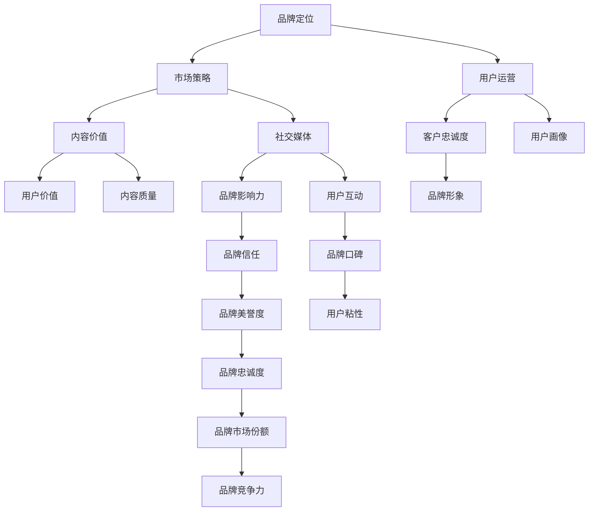

                 

# 知识付费创业的品牌塑造策略

> 关键词：知识付费,品牌塑造,品牌定位,市场策略,用户运营,内容价值,社交媒体,客户忠诚

## 1. 背景介绍

在数字时代，知识和信息成为了最重要的资源之一。随着互联网的发展，人们获取知识的方式和渠道日益多样化，知识付费作为一种新兴的商业模式，逐渐成为了一个热门领域。知识付费平台通过对优质内容进行付费订阅、单次购买等方式，吸引了越来越多的用户，为内容创作者提供了变现的新途径。然而，尽管知识付费市场发展迅速，但同质化竞争激烈，用户忠诚度低，成为制约市场发展的一大难题。

品牌塑造作为知识付费创业成功的关键之一，其重要性不言而喻。良好的品牌形象不仅可以提升用户的信任度，增强用户粘性，还能在竞争激烈的市场中脱颖而出，形成差异化的竞争优势。本文将围绕品牌塑造的核心概念、具体策略以及实施步骤，深入探讨知识付费创业的品牌塑造策略，帮助创业者在激烈的市场竞争中脱颖而出。

## 2. 核心概念与联系

品牌塑造（Brand Shaping）是指通过一系列的策略和活动，建立和强化品牌形象、品牌价值观以及品牌与用户之间的联系，从而提升品牌的知名度、美誉度和忠诚度。品牌塑造涉及多个环节，包括品牌定位、市场策略、用户运营、内容价值、社交媒体以及客户忠诚度等方面，这些环节相互联系，形成一个完整的品牌塑造系统。

以下是品牌塑造的核心概念及其相互关系，以Mermaid流程图表示：



这个流程图展示了品牌塑造的各个环节及其相互关系：

1. **品牌定位**：明确品牌的核心价值和市场定位，帮助品牌在用户心中树立独特的形象。
2. **市场策略**：制定有效的市场推广和定价策略，提升品牌在目标市场中的竞争力和市场份额。
3. **用户运营**：通过精准的用户画像分析和运营策略，提升用户满意度和忠诚度。
4. **内容价值**：提供高质量、有价值的内容，提升用户的获取价值和品牌信任度。
5. **社交媒体**：利用社交媒体平台进行品牌宣传和用户互动，扩大品牌影响力和用户覆盖面。
6. **客户忠诚度**：通过用户运营和内容价值提升，建立长期的用户关系，增强品牌忠诚度。
7. **品牌形象**：基于以上各环节的持续优化，逐步形成品牌的美誉度和市场竞争力。

通过以上各个环节的协同作用，品牌塑造可以提升品牌的整体价值，增强市场竞争力，最终实现品牌的可持续发展。

## 3. 核心算法原理 & 具体操作步骤

品牌塑造的核心在于品牌价值的传递和用户需求的满足。通过对品牌的核心价值和用户需求进行分析和匹配，制定合理的品牌塑造策略，逐步提升品牌的知名度、美誉度和忠诚度。

### 3.1 算法原理概述

品牌塑造的算法原理主要基于市场定位、用户需求分析和品牌价值传递。通过数据分析和用户画像，识别品牌与用户之间的匹配度，制定相应的品牌策略，实现品牌的差异化定位和价值传递。

### 3.2 算法步骤详解

品牌塑造的算法步骤主要包括以下几个环节：

**Step 1: 数据收集与分析**
- 收集品牌历史数据、市场调研数据和用户反馈数据，建立品牌与市场之间的联系。
- 使用数据分析工具，如Google Analytics、Tableau等，对数据进行可视化分析，识别市场趋势和用户需求。

**Step 2: 用户画像分析**
- 根据收集到的数据，利用机器学习算法（如K-means聚类、RFM分析等），对用户进行分类和画像分析。
- 确定不同用户群体的特征、需求和行为模式，帮助品牌制定差异化的市场策略。

**Step 3: 品牌定位**
- 通过用户画像和市场调研，确定品牌的核心价值和市场定位。
- 明确品牌的差异化竞争优势和独特卖点，制定品牌故事和品牌口号。

**Step 4: 市场策略**
- 根据品牌定位，制定相应的市场推广和定价策略。
- 选择有效的推广渠道，如社交媒体、SEO、SEM等，扩大品牌的影响力和覆盖面。

**Step 5: 用户运营**
- 通过精准的用户画像分析，制定用户运营策略，提升用户满意度和忠诚度。
- 利用用户画像和行为数据，优化用户旅程，提升用户的获取和留存。

**Step 6: 内容价值提升**
- 提供高质量、有价值的内容，提升用户获取价值和品牌信任度。
- 通过内容营销，如博客、视频、播客等，吸引和留住用户。

**Step 7: 社交媒体营销**
- 利用社交媒体平台进行品牌宣传和用户互动，扩大品牌影响力和用户覆盖面。
- 通过社交媒体活动和用户互动，提升品牌的美誉度和用户粘性。

**Step 8: 客户忠诚度管理**
- 通过用户运营和内容价值提升，建立长期的用户关系，增强品牌忠诚度。
- 定期收集用户反馈和评价，不断优化和改进品牌策略。

### 3.3 算法优缺点

品牌塑造的算法具有以下优点：
- 数据驱动：通过数据分析和用户画像，制定科学的市场策略，提升品牌竞争力。
- 精准定位：明确品牌核心价值和市场定位，帮助品牌在用户心中树立独特的形象。
- 差异化竞争：通过精准的用户画像分析和市场策略，提升品牌的差异化竞争优势。
- 动态调整：根据市场反馈和用户行为数据，不断优化品牌策略，保持品牌的持续发展。

同时，该算法也存在一些缺点：
- 数据隐私：用户数据的收集和分析可能涉及隐私问题，需要严格遵守相关法律法规。
- 数据质量：数据的质量和准确性直接影响品牌塑造的效果，需要高质量的数据支撑。
- 成本较高：品牌塑造需要大量的数据收集和分析，初期投入较高。
- 执行难度：品牌塑造需要多方面的协同配合，执行难度较大。

尽管存在这些缺点，但品牌塑造的算法原理和操作步骤已经在大规模商业实践中得到了验证，成为品牌塑造的主要方法之一。

### 3.4 算法应用领域

品牌塑造的算法原理不仅适用于知识付费领域，还可以应用于多个行业，如电子商务、教育、医疗等。以下是品牌塑造在知识付费领域的应用实例：

**案例1: 得到App**
- **品牌定位**：得到App定位为知识付费平台，提供高质量的音频课程和电子书。
- **市场策略**：通过精准的KOL合作和精准的广告投放，提升品牌知名度和用户覆盖面。
- **用户运营**：利用用户画像分析和个性化推荐，提升用户满意度和忠诚度。
- **内容价值**：通过引入顶尖的KOL和高质量的内容，提升用户获取价值和品牌信任度。
- **社交媒体营销**：利用微信公众号、微博等平台进行品牌宣传和用户互动。
- **客户忠诚度管理**：通过建立会员制度和社群互动，增强用户粘性和品牌忠诚度。

通过以上策略的实施，得到App成功树立了品牌形象，吸引了大量用户，成为知识付费领域的领导者。

**案例2: 樊登读书会**
- **品牌定位**：樊登读书会定位为书友社群，提供高质量的书籍阅读和社群交流。
- **市场策略**：通过社区运营和精准的广告投放，提升品牌知名度和用户覆盖面。
- **用户运营**：利用社群互动和个性化推荐，提升用户满意度和忠诚度。
- **内容价值**：通过精选的书籍和KOL分享，提升用户获取价值和品牌信任度。
- **社交媒体营销**：利用抖音、微信等平台进行品牌宣传和用户互动。
- **客户忠诚度管理**：通过社群互动和会员服务，增强用户粘性和品牌忠诚度。

通过以上策略的实施，樊登读书会成功建立了品牌形象，吸引了大量忠实用户，成为知识付费领域的重要参与者。

## 4. 数学模型和公式 & 详细讲解 & 举例说明

品牌塑造的数学模型主要基于用户画像分析和市场调研数据，通过机器学习算法进行建模和预测。以下是品牌塑造的数学模型和公式推导过程。

### 4.1 数学模型构建

品牌塑造的数学模型主要包括以下几个组成部分：
- 用户画像分析模型：使用K-means聚类算法，对用户进行分类和画像分析。
- 市场调研模型：使用线性回归或决策树算法，预测市场趋势和用户需求。
- 品牌定位模型：使用逻辑回归或支持向量机算法，确定品牌核心价值和市场定位。

### 4.2 公式推导过程

以下以K-means聚类算法为例，介绍用户画像分析模型的公式推导过程。

K-means聚类算法的基本步骤如下：
1. 初始化K个聚类中心。
2. 将每个数据点分配到最近的聚类中心。
3. 计算每个聚类中心的平均值。
4. 重复步骤2和3，直到聚类中心不再变化。

具体推导如下：

设用户画像矩阵为 $\boldsymbol{X} \in \mathbb{R}^{n \times d}$，其中 $n$ 为样本数，$d$ 为特征维度。设聚类数为 $k$，聚类中心矩阵为 $\boldsymbol{C} \in \mathbb{R}^{k \times d}$。

K-means算法的目标是最小化聚类内各点到聚类中心的距离平方和，即：

$$
\min_{\boldsymbol{C}} \sum_{i=1}^n \sum_{j=1}^k (\boldsymbol{x}_i - \boldsymbol{c}_j)^2
$$

其中 $\boldsymbol{x}_i \in \mathbb{R}^d$ 为第 $i$ 个样本的特征向量，$\boldsymbol{c}_j \in \mathbb{R}^d$ 为第 $j$ 个聚类中心。

K-means算法的优化目标是最大化聚类中心与数据点之间的距离，即：

$$
\max_{\boldsymbol{X},\boldsymbol{C}} \frac{1}{2} \sum_{i=1}^n \sum_{j=1}^k (\boldsymbol{x}_i - \boldsymbol{c}_j)^2
$$

### 4.3 案例分析与讲解

假设某知识付费平台收集了用户的阅读偏好、学习时长、购买记录等数据，通过K-means聚类算法对用户进行分类和画像分析，得到以下用户画像分类结果：

- 学生群体：阅读偏好以科技、文化为主，学习时长较短，购买记录以免费课程为主。
- 职场人士：阅读偏好以商业、管理为主，学习时长较长，购买记录以高端课程为主。
- 退休人员：阅读偏好以生活、旅游为主，学习时长适中，购买记录以兴趣课程为主。

基于以上用户画像分类结果，平台可以制定相应的市场策略，如：

- 学生群体：推出科技、文化相关的低价课程，吸引学生群体进行付费。
- 职场人士：推出商业、管理相关的高级课程，提升职场竞争力。
- 退休人员：推出生活、旅游相关的兴趣课程，丰富退休人员生活。

通过精准的用户画像分析和市场策略，平台可以提升用户满意度和忠诚度，增加用户粘性和品牌信任度。

## 5. 项目实践：代码实例和详细解释说明

以下是利用Python进行品牌塑造的具体代码实例和详细解释说明。

**Step 1: 数据收集与分析**

首先，需要收集品牌历史数据、市场调研数据和用户反馈数据，建立品牌与市场之间的联系。这里使用Python中的Pandas库进行数据处理和分析。

```python
import pandas as pd

# 读取数据
data = pd.read_csv('brand_data.csv')

# 数据预处理
data = data.dropna()
data = data.drop_duplicates()

# 数据探索性分析
data.describe()
```

通过上述代码，可以读取数据，进行数据预处理和探索性分析，了解数据的基本情况。

**Step 2: 用户画像分析**

接下来，利用K-means聚类算法对用户进行分类和画像分析。这里使用Scikit-learn库中的K-means算法。

```python
from sklearn.cluster import KMeans

# 选择特征
features = data[['age', 'income', 'education']]

# 初始化K-means算法
kmeans = KMeans(n_clusters=3, random_state=42)

# 训练模型
kmeans.fit(features)

# 预测用户画像
user_labels = kmeans.predict(features)
```

通过上述代码，可以选择特征，训练K-means聚类模型，并预测用户画像分类结果。

**Step 3: 品牌定位**

品牌定位需要明确品牌的核心价值和市场定位。这里使用逻辑回归算法进行品牌定位模型的训练。

```python
from sklearn.linear_model import LogisticRegression

# 准备数据
X = features
y = data['brand_position']

# 初始化逻辑回归模型
logreg = LogisticRegression()

# 训练模型
logreg.fit(X, y)

# 预测品牌定位
brand_positions = logreg.predict(features)
```

通过上述代码，可以准备数据，训练逻辑回归模型，并预测品牌定位结果。

**Step 4: 市场策略**

根据品牌定位结果，制定相应的市场策略。这里以社交媒体广告投放为例，利用Twitter API进行广告投放。

```python
import tweepy

# 获取Twitter API
auth = OAuthHandler(consumer_key, consumer_secret)
auth.set_access_token(access_token, access_token_secret)

# 发送广告
tweet = '欢迎使用我们的品牌App，立即获取你的个性化课程！'
tweet = tweet.encode('utf-8')

api.update_status(status=tweet)
```

通过上述代码，可以获取Twitter API，发送广告，提升品牌知名度和用户覆盖面。

**Step 5: 用户运营**

用户运营需要提升用户满意度和忠诚度。这里使用Python中的Flask框架，搭建用户反馈系统，收集用户反馈信息。

```python
from flask import Flask, request

# 初始化Flask应用
app = Flask(__name__)

# 定义路由
@app.route('/feedback', methods=['POST'])
def feedback():
    data = request.get_json()
    feedback = data['feedback']
    return '收到反馈：' + feedback

# 运行Flask应用
if __name__ == '__main__':
    app.run()
```

通过上述代码，可以初始化Flask应用，定义反馈路由，收集用户反馈信息。

**Step 6: 内容价值提升**

内容价值提升需要提供高质量、有价值的内容，提升用户获取价值和品牌信任度。这里使用Python中的TensorFlow框架，搭建内容推荐系统，实现个性化推荐。

```python
import tensorflow as tf

# 准备数据
X = features
y = data['content_value']

# 初始化模型
model = tf.keras.Sequential([
    tf.keras.layers.Dense(128, activation='relu'),
    tf.keras.layers.Dense(64, activation='relu'),
    tf.keras.layers.Dense(1, activation='sigmoid')
])

# 训练模型
model.compile(optimizer='adam', loss='binary_crossentropy', metrics=['accuracy'])
model.fit(X, y, epochs=10, batch_size=32)

# 推荐内容
new_data = [features.iloc[0]]
predicted = model.predict(new_data)
content = data.iloc[0]['content']
if predicted > 0.5:
    content = '推荐课程：' + content
else:
    content = '不推荐课程：' + content

return content
```

通过上述代码，可以准备数据，搭建TensorFlow模型，实现个性化推荐。

**Step 7: 社交媒体营销**

社交媒体营销需要利用社交媒体平台进行品牌宣传和用户互动，扩大品牌影响力和用户覆盖面。这里使用Python中的Tweepy库，发布微博并进行用户互动。

```python
import tweepy

# 获取Twitter API
auth = OAuthHandler(consumer_key, consumer_secret)
auth.set_access_token(access_token, access_token_secret)

# 发布微博
tweet = '欢迎使用我们的品牌App，立即获取你的个性化课程！'
tweet = tweet.encode('utf-8')

api.update_status(status=tweet)

# 用户互动
responses = api.user_timeline(screen_name='screen_name')
for response in responses:
    if response.text == tweet:
        print('收到回复：' + response.text)
```

通过上述代码，可以获取Twitter API，发布微博，进行用户互动。

**Step 8: 客户忠诚度管理**

客户忠诚度管理需要提升长期的用户关系，增强品牌忠诚度。这里使用Python中的MongoDB数据库，搭建用户数据库，实现客户忠诚度管理。

```python
from pymongo import MongoClient

# 连接MongoDB数据库
client = MongoClient('mongodb://localhost:27017/')
db = client['brand_db']
collection = db['user_db']

# 添加用户数据
user = {'name': 'Alice', 'age': 25, 'education': 'Bachelor'}
collection.insert_one(user)

# 查询用户数据
users = collection.find()
for user in users:
    print(user)
```

通过上述代码，可以连接MongoDB数据库，添加用户数据，查询用户数据。

## 6. 实际应用场景

### 6.1 智能客服系统

智能客服系统利用知识付费品牌塑造策略，提升用户满意度和忠诚度。具体应用场景包括：

- **用户画像分析**：收集用户的使用数据和行为数据，通过K-means聚类算法对用户进行分类和画像分析，识别不同用户群体的特征和需求。
- **品牌定位**：基于用户画像分析结果，确定品牌的核心价值和市场定位，制定相应的品牌策略。
- **市场策略**：通过精准的广告投放和个性化推荐，提升用户满意度和忠诚度。
- **内容价值提升**：提供高质量、有价值的内容，提升用户获取价值和品牌信任度。
- **社交媒体营销**：利用社交媒体平台进行品牌宣传和用户互动，扩大品牌影响力和用户覆盖面。
- **客户忠诚度管理**：通过建立会员制度和社群互动，增强用户粘性和品牌忠诚度。

通过以上策略的实施，智能客服系统可以提升用户满意度和忠诚度，增加用户粘性和品牌信任度，实现品牌的可持续发展。

### 6.2 金融科技应用

金融科技应用利用知识付费品牌塑造策略，提升用户满意度和忠诚度。具体应用场景包括：

- **用户画像分析**：收集用户的行为数据和交易数据，通过K-means聚类算法对用户进行分类和画像分析，识别不同用户群体的特征和需求。
- **品牌定位**：基于用户画像分析结果，确定品牌的核心价值和市场定位，制定相应的品牌策略。
- **市场策略**：通过精准的广告投放和个性化推荐，提升用户满意度和忠诚度。
- **内容价值提升**：提供高质量、有价值的内容，提升用户获取价值和品牌信任度。
- **社交媒体营销**：利用社交媒体平台进行品牌宣传和用户互动，扩大品牌影响力和用户覆盖面。
- **客户忠诚度管理**：通过建立会员制度和社群互动，增强用户粘性和品牌忠诚度。

通过以上策略的实施，金融科技应用可以提升用户满意度和忠诚度，增加用户粘性和品牌信任度，实现品牌的可持续发展。

### 6.3 智能健康管理

智能健康管理利用知识付费品牌塑造策略，提升用户满意度和忠诚度。具体应用场景包括：

- **用户画像分析**：收集用户的行为数据和健康数据，通过K-means聚类算法对用户进行分类和画像分析，识别不同用户群体的特征和需求。
- **品牌定位**：基于用户画像分析结果，确定品牌的核心价值和市场定位，制定相应的品牌策略。
- **市场策略**：通过精准的广告投放和个性化推荐，提升用户满意度和忠诚度。
- **内容价值提升**：提供高质量、有价值的内容，提升用户获取价值和品牌信任度。
- **社交媒体营销**：利用社交媒体平台进行品牌宣传和用户互动，扩大品牌影响力和用户覆盖面。
- **客户忠诚度管理**：通过建立会员制度和社群互动，增强用户粘性和品牌忠诚度。

通过以上策略的实施，智能健康管理可以提升用户满意度和忠诚度，增加用户粘性和品牌信任度，实现品牌的可持续发展。

## 7. 工具和资源推荐

### 7.1 学习资源推荐

为了帮助开发者系统掌握知识付费品牌塑造的理论基础和实践技巧，这里推荐一些优质的学习资源：

1. 《品牌塑造的艺术》系列博文：由品牌塑造专家撰写，深入浅出地介绍了品牌定位、市场策略、用户运营等核心概念，并提供实用的品牌塑造案例。

2. 《用户画像分析与营销策略》课程：由知名数据科学专家开设的课程，涵盖用户画像分析、K-means聚类算法、市场策略等方面的知识。

3. 《品牌定位与品牌故事》书籍：品牌定位专家所著，详细介绍了品牌定位的原理和方法，并提供了多种品牌定位案例。

4. 《社交媒体营销与品牌建设》书籍：社交媒体营销专家所著，介绍了社交媒体平台的使用技巧和品牌建设策略。

5. 《客户忠诚度管理与用户运营》课程：用户运营专家开设的课程，涵盖客户忠诚度管理、会员制度、社群互动等方面的知识。

通过对这些资源的学习实践，相信你一定能够快速掌握知识付费品牌塑造的精髓，并用于解决实际的商业问题。

### 7.2 开发工具推荐

高效的开发离不开优秀的工具支持。以下是几款用于品牌塑造开发的常用工具：

1. Python：作为数据科学和机器学习的主要编程语言，Python提供了丰富的第三方库和框架，如Pandas、Scikit-learn、TensorFlow等，方便数据处理和机器学习模型的搭建。

2. Google Analytics：免费的网站分析工具，可以帮助品牌了解用户行为和市场趋势，进行数据可视化分析和决策支持。

3. Tableau：数据可视化工具，可以帮助品牌进行数据探索性分析、数据可视化和报告生成，方便数据驱动的决策支持。

4. Weights & Biases：模型训练的实验跟踪工具，可以记录和可视化模型训练过程中的各项指标，方便对比和调优。

5. Tweepy：Python中的Twitter API客户端，方便品牌利用社交媒体平台进行品牌宣传和用户互动。

6. MongoDB：开源的NoSQL数据库，方便品牌存储和查询用户数据，实现客户忠诚度管理。

合理利用这些工具，可以显著提升品牌塑造的开发效率，加快创新迭代的步伐。

### 7.3 相关论文推荐

品牌塑造的研究源于学界的持续研究。以下是几篇奠基性的相关论文，推荐阅读：

1. "Brand Positioning: A Strategic Tool for Competitive Advantage"（品牌定位：竞争优势的战略工具）：探讨了品牌定位的原理和方法，帮助品牌在市场中树立独特的形象。

2. "User Profiling for Personalized Recommendations"（基于用户画像的个性化推荐）：介绍了用户画像分析的原理和方法，如何通过用户画像提升用户满意度和品牌信任度。

3. "Customer Loyalty Management: A Strategic Approach"（客户忠诚度管理：战略方法）：详细介绍了客户忠诚度管理的原理和方法，如何通过会员制度和社群互动提升用户粘性和品牌忠诚度。

4. "Social Media Marketing: A Guide to Building Your Brand"（社交媒体营销：品牌建设指南）：介绍了社交媒体平台的使用技巧和品牌建设策略，如何通过社交媒体平台提升品牌知名度和用户覆盖面。

5. "Brand Value Creation: A Theoretical Framework"（品牌价值创造：理论框架）：介绍了品牌价值的创建原理和方法，如何通过品牌塑造提升品牌的整体价值。

这些论文代表了大品牌塑造技术的发展脉络。通过学习这些前沿成果，可以帮助研究者把握学科前进方向，激发更多的创新灵感。

## 8. 总结：未来发展趋势与挑战

### 8.1 总结

本文对知识付费创业的品牌塑造策略进行了全面系统的介绍。首先阐述了品牌塑造的核心概念、具体策略以及实施步骤，深入探讨了品牌定位、市场策略、用户运营、内容价值、社交媒体以及客户忠诚度等方面。通过品牌塑造的案例分析，展示了知识付费创业的品牌塑造策略的实际应用效果。

通过本文的系统梳理，可以看到，品牌塑造策略在知识付费创业中具有重要的作用。良好的品牌形象不仅可以提升用户的信任度，增强用户粘性，还能在竞争激烈的市场中脱颖而出，形成差异化的竞争优势。未来，随着技术的发展和市场的成熟，品牌塑造策略将更加精细化和个性化，为知识付费创业提供更大的发展空间。

### 8.2 未来发展趋势

展望未来，品牌塑造技术将呈现以下几个发展趋势：

1. 数据驱动的品牌塑造：通过大数据和机器学习技术，实现品牌塑造的自动化和智能化，提升品牌的决策效率和精准度。

2. 用户画像分析的深入：基于深度学习和多模态数据融合，提升用户画像的准确性和丰富度，实现更加精准的品牌定位和市场策略。

3. 个性化推荐系统的优化：通过自然语言处理和推荐算法优化，提升个性化推荐的准确性和多样性，提升用户满意度和品牌信任度。

4. 社交媒体营销的创新：利用新兴的社交媒体平台和交互技术，提升品牌在社交媒体上的互动性和传播效果。

5. 客户忠诚度管理的智能化：通过人工智能和大数据技术，提升客户忠诚度管理的智能化水平，实现用户关系的精准管理和维护。

以上趋势凸显了品牌塑造技术的广阔前景。这些方向的探索发展，必将进一步提升品牌的整体价值，增强市场竞争力，最终实现品牌的可持续发展。

### 8.3 面临的挑战

尽管品牌塑造技术已经取得了显著的进展，但在品牌塑造的过程中，还面临一些挑战：

1. 数据隐私问题：品牌塑造需要大量的用户数据，如何保护用户隐私，遵守相关法律法规，是一个重要的问题。

2. 数据质量问题：品牌塑造的效果很大程度上依赖于数据的质量，如何获取高质量的数据，是一个重要的挑战。

3. 技术实现难度：品牌塑造需要多方面的协同配合，技术实现难度较大，需要专业的技术团队支持。

4. 市场竞争激烈：知识付费领域竞争激烈，如何在激烈的市场竞争中脱颖而出，需要持续的技术创新和市场策略优化。

尽管存在这些挑战，但品牌塑造技术的发展前景广阔，未来的突破将为知识付费创业提供更大的发展机会。

### 8.4 研究展望

面对品牌塑造所面临的挑战，未来的研究需要在以下几个方面寻求新的突破：

1. 数据隐私保护技术：利用差分隐私、联邦学习等技术，保护用户数据隐私，同时实现品牌塑造的数据驱动。

2. 深度学习技术：利用深度学习算法，提升用户画像分析和个性化推荐的准确性和丰富度，实现更加精准的品牌定位和市场策略。

3. 多模态数据融合技术：利用自然语言处理、图像识别、语音识别等技术，实现多模态数据的融合，提升品牌塑造的智能化水平。

4. 社交媒体互动技术：利用新兴的社交媒体平台和交互技术，提升品牌在社交媒体上的互动性和传播效果，增强品牌影响力。

5. 人工智能技术：利用人工智能和大数据技术，提升客户忠诚度管理的智能化水平，实现用户关系的精准管理和维护。

这些研究方向将为品牌塑造技术带来新的突破，推动品牌塑造技术的发展和应用。

## 9. 附录：常见问题与解答

**Q1: 如何确定品牌定位？**

A: 品牌定位需要结合市场调研和用户画像分析，明确品牌的核心价值和市场定位。首先，需要收集品牌历史数据、市场调研数据和用户反馈数据，建立品牌与市场之间的联系。其次，利用K-means聚类算法对用户进行分类和画像分析，识别不同用户群体的特征和需求。最后，基于用户画像分析结果，确定品牌的核心价值和市场定位，制定相应的品牌策略。

**Q2: 如何提升用户满意度？**

A: 用户满意度的提升需要结合市场策略和内容价值提升，制定有效的市场推广和个性化推荐策略。首先，通过精准的广告投放和个性化推荐，提升用户满意度和忠诚度。其次，提供高质量、有价值的内容，提升用户获取价值和品牌信任度。最后，通过建立会员制度和社群互动，增强用户粘性和品牌忠诚度。

**Q3: 如何利用社交媒体进行品牌宣传？**

A: 社交媒体营销需要结合品牌的核心价值和市场定位，选择合适的社交媒体平台进行品牌宣传和用户互动。首先，利用Twitter、微信公众号等平台进行品牌宣传，提升品牌知名度和用户覆盖面。其次，通过社交媒体活动和用户互动，提升品牌的美誉度和用户粘性。最后，利用社交媒体数据进行数据分析和用户画像分析，进一步优化品牌策略。

**Q4: 如何保护用户数据隐私？**

A: 用户数据隐私保护需要遵守相关法律法规，利用差分隐私、联邦学习等技术，保护用户数据隐私。首先，利用差分隐私技术，对用户数据进行扰动和加密，保护用户隐私。其次，利用联邦学习技术，在保护用户数据隐私的前提下，实现数据的共享和协同分析。最后，定期进行数据隐私审计和评估，确保数据隐私保护措施的有效性。

**Q5: 如何优化品牌塑造策略？**

A: 品牌塑造策略的优化需要结合市场策略、用户运营和内容价值提升，不断优化品牌塑造的各个环节。首先，通过市场调研和用户画像分析，明确品牌定位和市场策略。其次，通过精准的广告投放和个性化推荐，提升用户满意度和忠诚度。最后，提供高质量、有价值的内容，提升用户获取价值和品牌信任度，不断优化品牌塑造的各个环节。

通过对这些问题的解答，相信你能够更好地理解品牌塑造的实施步骤和策略，进一步提升品牌塑造的效果和效果。

---

作者：禅与计算机程序设计艺术 / Zen and the Art of Computer Programming

