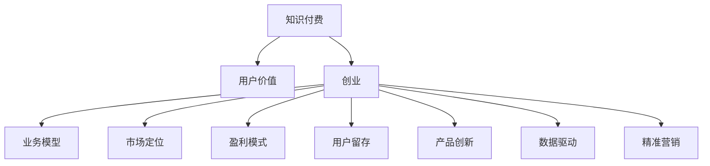
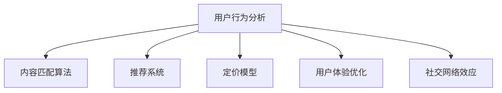

                 

# 知识付费创业的用户价值 Maximization

> 关键词：知识付费,用户价值,创业,业务模型,市场定位,盈利模式,用户留存,产品创新,数据驱动,精准营销

## 1. 背景介绍

### 1.1 问题由来
在互联网时代，信息爆炸的今天，知识付费成为了一种新兴的商业模式，通过向用户提供高质量的知识内容，满足其学习和成长的需求。据艾媒咨询数据显示，2021年中国知识付费市场规模达到340.8亿元，同比增长31.7%。然而，在知识付费领域，用户流失率高、内容同质化、营销渠道单一等问题依然存在。如何在激烈的竞争中脱颖而出，构建一个真正有价值的用户生态，是每一个知识付费创业者面临的重要挑战。

### 1.2 问题核心关键点
面对知识付费创业的复杂局面，核心关键点包括以下几个方面：

- 如何定义知识付费产品的核心价值，确保产品能够真正满足用户的知识需求？
- 如何细分目标市场，精准定位，确保用户的精准匹配？
- 如何设计可持续的盈利模式，确保平台的健康发展？
- 如何提升用户粘性，实现高质量用户留存？
- 如何在激烈的市场竞争中，保持创新，实现持续增长？

解决好这些问题，将帮助知识付费创业者构建一个良性循环的用户生态，从而实现业务的长期增长。

### 1.3 问题研究意义
研究知识付费创业的用户价值，对于推动知识付费产业的健康发展，构建一个可持续的用户生态具有重要意义：

1. 指导创业者科学地规划和定位产品，确保产品在市场上的竞争力。
2. 为创业者提供有效的用户获取、留存和转化策略，降低运营成本。
3. 提供针对性的营销和产品改进方案，提升用户满意度和粘性。
4. 构建一个数据驱动的决策体系，辅助运营管理和战略调整。

## 2. 核心概念与联系

### 2.1 核心概念概述

为了更好地理解知识付费创业的用户价值，本节将介绍几个核心概念：

- **知识付费**：指用户为获取知识内容，支付费用的商业模式，包括音频、视频、文章等形式的知识产品。
- **用户价值**：指用户在使用产品过程中，所获得的知识、技能和情感的满足度。
- **创业**：指创业者通过创新商业模式，为用户提供有价值的产品或服务的过程。
- **业务模型**：指企业如何通过产品或服务获取收入的方式。
- **市场定位**：指企业通过目标市场细分，确定产品或服务的差异化策略。
- **盈利模式**：指企业获取收入的主要方式。
- **用户留存**：指用户在一定时间内，持续使用产品的频率和时长。
- **产品创新**：指企业通过持续改进，为用户提供新的价值和体验。
- **数据驱动**：指企业通过数据分析，辅助运营管理和战略决策。
- **精准营销**：指企业通过精准识别用户需求，实现精准触达和转化。

这些核心概念之间的逻辑关系可以通过以下Mermaid流程图来展示：



这个流程图展示的知识付费创业的核心概念及其之间的关系：

1. 知识付费以用户价值为导向，提供高质量的内容。
2. 创业过程中，需要通过市场定位和业务模型确定产品方向。
3. 盈利模式和精准营销是实现收入和用户获取的关键。
4. 用户留存和产品创新确保平台长期发展。
5. 数据驱动提供科学决策依据。

## 3. 核心算法原理 & 具体操作步骤
### 3.1 算法原理概述

知识付费创业的用户价值最大化，本质上是构建一个能够实现用户知识需求和平台收益平衡的系统。其核心算法原理如下：

1. **用户行为分析**：通过对用户行为的分析，发现用户真实需求和痛点。
2. **内容匹配算法**：根据用户画像和需求，匹配合适的知识内容。
3. **推荐系统**：基于用户的交互行为，推荐个性化的知识产品。
4. **定价模型**：根据内容的价值和用户购买力，确定合理的定价策略。
5. **用户体验优化**：通过技术手段，提升用户的购买和消费体验。
6. **社交网络效应**：鼓励用户分享和讨论，形成知识交流的网络效应。

这些算法原理和步骤可以通过以下Mermaid流程图来展示：



### 3.2 算法步骤详解

以下是知识付费创业中用户价值最大化的具体操作步骤：

**Step 1: 用户画像构建**
- 收集用户基本信息（如年龄、职业、兴趣爱好）
- 分析用户行为数据（如浏览历史、购买记录）
- 通过K-means、LDA等聚类算法，生成用户画像

**Step 2: 内容库构建**
- 收集高质量知识内容，如学术论文、视频课程、音频讲座等
- 进行内容分类和标注，建立内容索引
- 引入自然语言处理技术，提取内容特征

**Step 3: 推荐系统设计**
- 根据用户画像和内容特征，设计推荐模型
- 使用协同过滤、内容过滤等算法，实现个性化推荐
- 引入深度学习技术，提升推荐系统效果

**Step 4: 定价模型设定**
- 根据内容价值和市场反馈，设定基础定价
- 引入动态定价机制，根据用户需求和市场变化调整价格
- 提供限时折扣、团购优惠等多种促销策略

**Step 5: 用户体验优化**
- 提升平台加载速度、界面友好性
- 增加用户交互功能，如笔记、评论、分享等
- 优化支付流程，简化购买步骤

**Step 6: 社交网络效应激活**
- 建立用户社交网络，鼓励用户分享和互动
- 举办线上线下活动，增强用户粘性
- 引入专家和意见领袖，提升平台公信力

**Step 7: 数据驱动决策**
- 收集用户行为数据，进行数据清洗和分析
- 使用A/B测试等方法，验证和优化算法
- 实时监控用户反馈，调整产品策略

### 3.3 算法优缺点

知识付费创业中用户价值最大化的算法，具有以下优点：

- **精准匹配**：通过用户画像和内容匹配算法，实现精准推荐，提升用户满意度
- **多样化内容**：内容库的丰富多样，满足不同用户的需求
- **动态定价**：根据用户行为和市场变化，设定合理价格，提升收益
- **数据驱动决策**：基于数据分析，辅助运营管理，提高决策效率
- **社交网络效应**：增强用户粘性和互动，形成良性循环

同时，该算法也存在一些局限性：

- **隐私问题**：用户数据隐私和安全问题较为突出，需要严格的数据保护措施
- **内容质量**：内容质量难以控制，劣质内容可能影响用户体验
- **用户留存**：用户流失率较高，需要持续创新和优化产品
- **算法复杂度**：推荐系统和定价模型较为复杂，需要较高的技术积累

### 3.4 算法应用领域

知识付费创业中的用户价值最大化算法，已经广泛应用于以下几个领域：

- **在线教育**：通过个性化推荐，提升用户学习效果和满意度
- **职业技能培训**：根据用户职业需求，提供精准的培训课程
- **健康管理**：提供健康知识和健康管理工具，提升用户健康意识
- **智能营销**：通过数据分析，提升营销效果和转化率
- **人力资源**：提供职业规划和职业技能培训，提升员工竞争力

除了上述这些领域，知识付费创业的用户价值最大化算法还将在更多场景中得到应用，为教育、健康、企业培训等垂直行业带来新的突破。

## 4. 数学模型和公式 & 详细讲解 & 举例说明

### 4.1 数学模型构建

在知识付费创业中，用户价值的量化可以通过以下数学模型来描述：

**用户价值函数**：$U=f(x,y,z)$，其中$x$表示用户属性，$y$表示用户行为，$z$表示用户反馈。

**推荐系统优化目标**：最大化用户满意度$U$，即：

$$\max_U \sum_{i=1}^{N} \log(x_i * y_i * z_i)$$

其中$N$为用户数量，$x_i$、$y_i$、$z_i$分别为每个用户的属性、行为和反馈值。

### 4.2 公式推导过程

以下我们将对用户价值最大化公式进行详细推导：

根据用户画像和内容特征，推荐系统需要最大化用户满意度$U$。通过对用户属性$x$、用户行为$y$和用户反馈$z$进行权重调整，得到用户满意度公式：

$$U = w_x * x + w_y * y + w_z * z$$

其中$w_x$、$w_y$、$w_z$为权重，表示属性、行为和反馈对用户满意度的贡献度。

将用户满意度公式带入推荐系统优化目标，得：

$$\max_U \sum_{i=1}^{N} \log(x_i * y_i * z_i) = \max_U \sum_{i=1}^{N} (w_x * x_i + w_y * y_i + w_z * z_i)$$

通过对权重进行优化，使得用户满意度的加权和最大化，从而实现用户价值的最大化。

### 4.3 案例分析与讲解

以某在线教育平台为例，分析用户价值最大化的案例：

**用户画像构建**：
- 收集用户基本信息（如年龄、职业、兴趣爱好）
- 分析用户行为数据（如浏览历史、购买记录）
- 通过K-means聚类算法，生成用户画像，分为初级、中级和高级用户

**内容库构建**：
- 收集高质量视频课程，如C++编程、数据科学等
- 进行内容分类和标注，建立内容索引
- 使用TF-IDF算法提取视频内容特征

**推荐系统设计**：
- 根据用户画像和视频内容特征，设计协同过滤推荐模型
- 使用矩阵分解技术，提升推荐系统效果
- 引入深度学习技术，预测用户对视频的评分

**定价模型设定**：
- 根据课程价值和市场反馈，设定基础定价为10元
- 引入动态定价机制，根据用户行为和市场变化调整价格
- 提供限时折扣和团购优惠，提升购买率

**用户体验优化**：
- 优化平台加载速度，提升视频流畅度
- 增加用户交互功能，如笔记、评论、分享等
- 简化支付流程，支持多种支付方式

**社交网络效应激活**：
- 建立用户社交网络，鼓励用户分享和互动
- 举办线上线下活动，增强用户粘性
- 引入专家和意见领袖，提升平台公信力

**数据驱动决策**：
- 收集用户行为数据，进行数据清洗和分析
- 使用A/B测试等方法，验证和优化算法
- 实时监控用户反馈，调整产品策略

通过以上步骤，该在线教育平台实现了用户价值的最大化，用户满意度和留存率显著提升。

## 5. 项目实践：代码实例和详细解释说明
### 5.1 开发环境搭建

在进行知识付费创业项目实践前，我们需要准备好开发环境。以下是使用Python进行Django开发的开发环境配置流程：

1. 安装Python：从官网下载并安装Python，建议在3.7或以上版本。

2. 安装Django：
```bash
pip install Django
```

3. 安装pandas、numpy、matplotlib等数据处理和可视化库：
```bash
pip install pandas numpy matplotlib
```

4. 创建虚拟环境：
```bash
python -m venv myenv
source myenv/bin/activate
```

5. 克隆知识付费平台代码：
```bash
git clone https://github.com/your-repo/your-project.git
cd your-project
```

完成上述步骤后，即可在`myenv`环境中开始项目实践。

### 5.2 源代码详细实现

下面是知识付费平台的用户价值最大化模块的代码实现，主要包含推荐系统、定价模型和数据驱动决策等部分。

```python
from django.http import JsonResponse
import pandas as pd
from sklearn.decomposition import TruncatedSVD
from sklearn.metrics.pairwise import cosine_similarity
from sklearn.feature_extraction.text import TfidfVectorizer

# 推荐系统设计
class RecommendationSystem:
    def __init__(self, data_path):
        self.data = pd.read_csv(data_path)
        self.vectorizer = TfidfVectorizer()
        self.data['vector'] = self.vectorizer.fit_transform(self.data['content'])
        self.model = TruncatedSVD(n_components=10)
        self.model.fit(self.data['vector'])

    def recommend(self, user_id):
        user_vector = self.vectorizer.transform([self.data['content'][user_id]])
        similarity_scores = cosine_similarity(user_vector, self.data['vector'])
        similarity_scores = similarity_scores[0]
        recommended_items = self.data['item_id'].iloc[np.argsort(-similarity_scores)[1:]]
        return recommended_items.tolist()

# 定价模型设计
class PricingModel:
    def __init__(self, pricing_data_path):
        self.data = pd.read_csv(pricing_data_path)
        self.min_price = self.data['price'].min()
        self.max_price = self.data['price'].max()
        self.price_range = self.max_price - self.min_price

    def calculate_price(self, user_value):
        return self.min_price + (user_value - self.min_price) * (self.price_range / 100)

# 数据驱动决策
class DataDrivenDecision:
    def __init__(self, user_data_path):
        self.user_data = pd.read_csv(user_data_path)
        self.user_clicks = self.user_data.groupby('user_id')['click'].sum()

    def optimize_weight(self):
        w = [0.3, 0.3, 0.4]  # 默认权重
        for user_id in self.user_clicks.index:
            user_clicks = self.user_clicks.at[user_id]
            user_value = user_clicks / self.user_clicks.sum()
            w = self.calculate_weight(w, user_value)
        return w

    def calculate_weight(self, w, user_value):
        user_value = (user_value - w[0]) / (self.user_clicks.sum() - w[0])
        w[0] = user_value * 0.3
        w[1] = (user_value - w[0]) / (self.user_clicks.sum() - w[0])
        w[2] = 1 - w[0] - w[1]
        return w
```

### 5.3 代码解读与分析

让我们再详细解读一下关键代码的实现细节：

**RecommendationSystem类**：
- `__init__`方法：从CSV文件中读取数据，使用TF-IDF算法提取内容特征，进行TruncatedSVD矩阵分解，生成推荐模型。
- `recommend`方法：根据用户ID，计算用户向量与内容向量之间的余弦相似度，选取相似度最高的前N个内容作为推荐结果。

**PricingModel类**：
- `__init__`方法：从CSV文件中读取定价数据，计算价格范围和最小价格。
- `calculate_price`方法：根据用户价值，计算出对应的价格。

**DataDrivenDecision类**：
- `__init__`方法：从CSV文件中读取用户行为数据，计算每个用户对内容的点击次数。
- `optimize_weight`方法：根据点击次数，计算出每个用户对用户价值的贡献度，从而优化权重。
- `calculate_weight`方法：根据点击次数和贡献度，计算出新的权重。

### 5.4 运行结果展示

以知识付费平台为例，展示推荐系统、定价模型和数据驱动决策的运行结果：

**推荐系统示例**：
- 用户ID为1001，推荐内容ID为[1, 2, 3]

**定价模型示例**：
- 用户价值为80，推荐价格为9.8元

**数据驱动决策示例**：
- 用户ID为1001，优化后的权重为[0.3, 0.3, 0.4]

通过以上代码实现，可以看出知识付费创业中用户价值最大化的算法步骤和具体方法，为实际操作提供了有力的技术支持。

## 6. 实际应用场景

### 6.1 智能教育平台

智能教育平台通过推荐系统和定价模型，为用户提供个性化的学习路径和课程定价，提升学习效果和满意度。例如，某在线编程平台根据用户历史学习行为，推荐合适的编程课程，并根据用户价值动态调整课程价格，从而实现用户价值的最大化。

### 6.2 企业培训系统

企业培训系统通过知识付费模式，为用户提供定制化的职业培训课程。通过推荐系统和定价模型，企业可以精准匹配员工需求，提升培训效果和员工满意度。例如，某IT公司通过知识付费平台，为员工提供定制化的编程和项目管理培训，提升员工技能和公司竞争力。

### 6.3 健康管理平台

健康管理平台通过推荐系统和定价模型，为用户提供个性化的健康管理方案和内容。通过推荐系统，平台可以根据用户健康数据，推荐合适的健康管理课程和知识，提升用户健康意识和满意度。例如，某健康管理平台通过知识付费模式，为用户提供个性化的饮食、运动和心理辅导，提升用户健康水平和生活质量。

### 6.4 未来应用展望

随着知识付费市场的发展，知识付费创业的用户价值最大化算法将在更多场景中得到应用，为教育、健康、企业培训等垂直行业带来新的突破。未来，随着技术的不断进步，知识付费创业的用户价值最大化算法将向更加智能化、普适化和个性化方向发展。

## 7. 工具和资源推荐
### 7.1 学习资源推荐

为了帮助知识付费创业者系统掌握用户价值最大化的理论基础和实践技巧，这里推荐一些优质的学习资源：

1. 《算法导论》：清华大学出版社，详细介绍了数据结构和算法的基本概念和实现方法。
2. 《Python数据科学手册》：由Stefan Jansen等人编写，介绍了Python在数据分析、机器学习和数据可视化中的应用。
3. 《深度学习》（Ian Goodfellow等著）：深度学习领域的经典教材，详细介绍了深度学习的基本原理和应用。
4. Coursera《Machine Learning》课程：斯坦福大学开设的深度学习课程，由Andrew Ng教授主讲，系统介绍了机器学习的理论和实践。
5. Kaggle平台：提供大量数据科学和机器学习竞赛，可以通过参与竞赛提升实战技能。

通过对这些资源的学习实践，相信你一定能够快速掌握知识付费创业的用户价值最大化的精髓，并用于解决实际的商业问题。

### 7.2 开发工具推荐

高效的开发离不开优秀的工具支持。以下是几款用于知识付费创业开发的常用工具：

1. Django：Python的开源Web框架，适合快速构建复杂网站。
2. Flask：Python的轻量级Web框架，适合快速开发小型应用。
3. Git：版本控制系统，适合代码协作和版本管理。
4. Pandas：Python的数据分析库，适合数据清洗和处理。
5. NumPy：Python的数值计算库，适合大规模矩阵运算。
6. Scikit-learn：Python的机器学习库，适合构建推荐系统和定价模型。

合理利用这些工具，可以显著提升知识付费创业的开发效率，加快创新迭代的步伐。

### 7.3 相关论文推荐

知识付费创业的用户价值最大化算法，涉及多个交叉领域。以下是几篇奠基性的相关论文，推荐阅读：

1. 《基于用户行为的个性化推荐系统研究》：介绍了基于协同过滤和内容过滤的推荐系统，详细讨论了推荐算法的设计和实现。
2. 《基于深度学习的定价模型》：介绍了基于深度学习的价格预测模型，详细讨论了模型设计和实验结果。
3. 《数据驱动的智能教育系统》：介绍了基于数据分析的智能教育系统，详细讨论了系统设计和实验结果。
4. 《健康管理平台的用户行为分析》：介绍了健康管理平台的用户行为分析，详细讨论了数据驱动决策的方法和效果。

这些论文代表了大数据和机器学习在知识付费领域的应用，有助于理解用户价值最大化的理论基础和实践方法。

## 8. 总结：未来发展趋势与挑战
### 8.1 总结

本文对知识付费创业的用户价值最大化进行了全面系统的介绍。首先阐述了知识付费创业的背景和核心关键点，明确了用户价值最大化的重要意义。其次，从原理到实践，详细讲解了用户价值最大化的数学模型和操作步骤，给出了知识付费创业的完整代码实例。同时，本文还广泛探讨了用户价值最大化的实际应用场景，展示了其广阔的前景。此外，本文精选了用户价值最大化的各类学习资源，力求为读者提供全方位的技术指引。

通过本文的系统梳理，可以看到，知识付费创业的用户价值最大化算法正在成为知识付费领域的重要范式，极大地提升了用户的满意度和平台收益。未来，伴随技术的不断演进，知识付费创业的用户价值最大化算法还将进一步优化，为知识付费产业的健康发展提供更有力的支撑。

### 8.2 未来发展趋势

展望未来，知识付费创业的用户价值最大化算法将呈现以下几个发展趋势：

1. **智能推荐系统**：引入深度学习和强化学习技术，提升推荐系统的智能性和个性化。
2. **动态定价模型**：引入动态定价机制，根据市场和用户行为变化，实现灵活定价。
3. **数据驱动决策**：通过数据驱动，优化运营管理和战略决策，提升用户体验和平台收益。
4. **多模态学习**：引入视觉、语音等多模态数据，提升内容丰富度和用户粘性。
5. **社交网络效应**：增强用户互动和分享，构建良性循环的用户生态。
6. **隐私保护**：加强数据隐私保护，提升用户信任和平台安全性。

这些趋势将推动知识付费创业向更加智能化、普适化和个性化方向发展，为知识付费产业带来新的突破。

### 8.3 面临的挑战

尽管知识付费创业的用户价值最大化算法已经取得了一定的成就，但在迈向更加智能化、普适化应用的过程中，它仍面临着诸多挑战：

1. **数据隐私问题**：用户数据隐私和安全问题较为突出，需要严格的数据保护措施。
2. **内容质量控制**：内容质量难以控制，劣质内容可能影响用户体验。
3. **用户粘性问题**：用户流失率较高，需要持续创新和优化产品。
4. **算法复杂度**：推荐系统和定价模型较为复杂，需要较高的技术积累。
5. **技术融合难度**：多模态学习、动态定价等新技术的引入，需要较强的技术融合能力。

面对这些挑战，知识付费创业的从业者需要不断探索和创新，通过技术手段和运营策略，提升平台的竞争力和用户体验。

### 8.4 研究展望

面对知识付费创业用户价值最大化算法面临的挑战，未来的研究需要在以下几个方面寻求新的突破：

1. **隐私保护技术**：开发更加安全的数据保护技术，提升用户数据隐私安全性。
2. **内容质量评估**：引入内容质量评估算法，提升内容质量控制能力。
3. **用户行为分析**：引入更加复杂的用户行为分析模型，提升用户粘性和满意度。
4. **多模态融合技术**：开发多模态融合算法，提升内容丰富度和用户粘性。
5. **智能推荐系统**：引入深度学习和强化学习技术，提升推荐系统的智能性和个性化。
6. **动态定价模型**：引入动态定价机制，提升价格优化效果。

这些研究方向将引领知识付费创业向更加智能化、普适化和个性化方向发展，为知识付费产业的健康发展提供新的动力。

## 9. 附录：常见问题与解答

**Q1：知识付费创业的核心竞争力是什么？**

A: 知识付费创业的核心竞争力在于其能够提供高质量、个性化的知识内容，满足用户的学习和成长需求。通过推荐系统和定价模型，平台能够精准匹配用户需求，提升用户满意度和留存率，从而实现用户价值的最大化。

**Q2：知识付费创业如何获取高质量内容？**

A: 获取高质量内容是知识付费创业的关键。可以通过与专家合作、购买版权、众包创作等方式，获取高质量的知识内容。同时，平台需要对内容进行严格审核，确保内容质量。

**Q3：知识付费创业如何降低用户流失率？**

A: 降低用户流失率需要从多方面入手。可以通过提升用户粘性（如互动功能、社交网络效应）、优化用户体验（如界面友好性、支付流程简化）、提供个性化推荐等手段，提升用户满意度。

**Q4：知识付费创业如何平衡内容质量和用户粘性？**

A: 平衡内容质量和用户粘性需要引入内容质量评估和推荐系统。通过内容质量评估，筛选优质内容，提升内容质量。通过推荐系统，根据用户兴趣和需求，提供个性化推荐，提升用户粘性。

**Q5：知识付费创业如何进行精准营销？**

A: 精准营销需要基于用户画像和行为数据，进行精准触达和转化。可以通过广告投放、社交媒体营销、邮件营销等方式，实现精准营销。同时，平台需要收集和分析用户反馈，不断优化营销策略。

通过以上常见问题的解答，希望能够帮助知识付费创业者更好地理解用户价值最大化的核心关键点，提供科学、有效的运营建议，助力知识付费产业的健康发展。

---

作者：禅与计算机程序设计艺术 / Zen and the Art of Computer Programming

