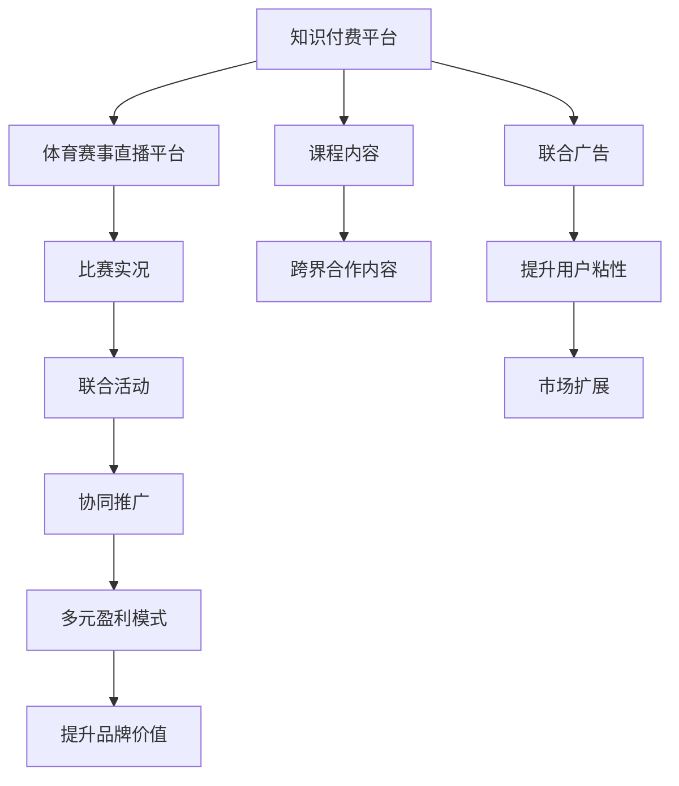

                 

# 知识付费如何实现跨界营销与体育赛事直播跨界？

## 1. 背景介绍

随着互联网和数字化技术的不断发展，知识付费已经逐渐成为了现代用户获取知识和信息的重要渠道。知识付费平台通过提供专业、系统的课程、文章和语音等形式的付费内容，满足了用户深度学习和自我提升的需求。然而，传统的知识付费模式在市场竞争和用户粘性方面面临诸多挑战。如何通过跨界营销和多元化的运营策略，提升知识付费平台的竞争力和用户粘性，成为了当前亟待解决的问题。

与此同时，体育赛事直播作为另一热门领域，拥有庞大的用户基础和广泛的关注度。特别是在足球、篮球、网球等热门体育项目中，体育赛事直播吸引了大量年轻用户和重度粉丝。然而，体育赛事直播的商业化道路依然面临诸多挑战，如版权问题、商业模式单一、用户付费意愿不足等。

在这种背景下，知识付费平台与体育赛事直播的跨界合作成为了一种新的探索方向。通过结合两者的优势，实现内容互补和用户共享，有望在市场竞争中占据有利地位，拓展新的用户群体，提升品牌知名度和影响力。

## 2. 核心概念与联系

### 2.1 核心概念概述

为更好地理解知识付费与体育赛事直播跨界的营销策略，本节将介绍几个密切相关的核心概念：

- **知识付费**：指用户为获取专业知识、技能或信息而支付费用的服务模式。知识付费平台通过提供高质量、系统化的付费内容，满足用户学习和自我提升的需求。

- **体育赛事直播**：指通过网络视频技术实时传输体育赛事的比赛实况，为观众提供即时观赛体验。体育赛事直播以其即时性、互动性和沉浸式体验，吸引了大量用户关注。

- **跨界营销**：指不同行业之间通过资源整合和协同营销，共同拓展市场和提升品牌价值。跨界营销通过创新合作方式，打破行业界限，形成更广泛的商业生态。

- **用户粘性**：指用户对某一平台或品牌的忠诚度和依赖度。通过提高用户粘性，可以增强平台的竞争力和市场份额，实现长期稳定的发展。

### 2.2 核心概念原理和架构的 Mermaid 流程图



这个流程图展示了知识付费与体育赛事直播跨界的核心概念及其之间的联系：

1. 知识付费平台与体育赛事直播平台通过跨界合作，共同生产跨界合作内容。
2. 体育赛事直播平台提供比赛实况，知识付费平台提供课程内容。
3. 跨界合作内容可以包括赛事解说、嘉宾访谈、数据分析等。
4. 联合活动如联合广告、协同推广等，可以进一步提升品牌价值。
5. 多元盈利模式如联合活动收益、课程销售、会员订阅等，可以提升用户粘性。
6. 市场扩展和品牌价值提升，最终实现商业利益的最大化。

## 3. 核心算法原理 & 具体操作步骤

### 3.1 算法原理概述

知识付费与体育赛事直播跨界营销的核心在于通过资源整合和协同营销，实现内容互补和用户共享。其基本思想是通过知识付费平台的课程内容，增加体育赛事直播的深度和专业性；通过体育赛事直播的高关注度，提升知识付费平台的用户粘性和品牌影响力。

形式化地，假设知识付费平台为 $K$，体育赛事直播平台为 $S$。通过跨界营销，平台 $K$ 和 $S$ 的协同效应可以表示为：

$$
E = f(K, S)
$$

其中，$f$ 为协同效应函数，用于衡量知识付费和体育赛事直播在用户获取、内容价值和品牌影响力等方面的提升效果。

### 3.2 算法步骤详解

基于上述思想，知识付费与体育赛事直播跨界的具体操作步骤包括：

**Step 1: 选择合适的知识付费内容和体育赛事**

- 确定知识付费平台的优势内容，如特定领域的深度课程、专家讲座等。
- 确定体育赛事直播平台的高关注度赛事，如世界杯、NBA等。

**Step 2: 设计跨界合作方案**

- 设计联合活动，如赛事解说、嘉宾访谈、数据分析等。
- 策划联合广告，在体育赛事直播平台上推广知识付费平台的优质课程。

**Step 3: 实施跨界营销策略**

- 在体育赛事直播平台上播放跨界合作内容，如赛事解说嘉宾在直播中分享相关知识内容。
- 通过联合广告提升知识付费平台的知名度，吸引更多用户注册和使用。

**Step 4: 评估协同效应**

- 通过用户行为数据和品牌价值指标，评估跨界营销的效果。
- 根据评估结果调整营销策略，进一步优化合作方案。

### 3.3 算法优缺点

知识付费与体育赛事直播跨界营销的优势包括：

- 拓宽市场，拓展新的用户群体，提升品牌知名度和影响力。
- 增强用户粘性，提高用户对平台的忠诚度和依赖度。
- 实现多元化盈利模式，提升商业收益。

但该方法也存在一定的局限性：

- 跨界合作方案设计需根据具体场景和用户需求进行调整，不易一概而论。
- 合作内容质量和营销效果需持续监控和评估，以确保合作效果。
- 对平台的资源整合和协同能力要求较高，需要充分协调合作各方。

### 3.4 算法应用领域

知识付费与体育赛事直播跨界营销不仅限于体育领域，也可以应用于其他领域，如教育、娱乐、金融等。其核心思想是通过跨界合作，实现内容互补和用户共享，提升整体市场竞争力和品牌价值。

例如，在教育领域，知识付费平台可以与在线教育平台合作，共同推出名师讲堂、学科分析等跨界内容，提升用户的学习体验和平台的用户粘性。在娱乐领域，知识付费平台可以与视频平台合作，推出音乐、电影等内容的跨界内容，增加平台的吸引力和用户粘性。

## 4. 数学模型和公式 & 详细讲解 & 举例说明

### 4.1 数学模型构建

假设知识付费平台的用户数为 $U$，体育赛事直播平台的用户数为 $V$。设 $U_0$ 和 $V_0$ 分别为知识付费平台和体育赛事直播平台在合作前后的用户数。设 $S$ 为体育赛事直播平台的用户在知识付费平台的注册和付费转化率，$E_0$ 为合作前的协同效应，$E_1$ 为合作后的协同效应。则合作后的协同效应可以表示为：

$$
E_1 = E_0 + U_0S + V_0(1-S) + (U_0+V_0)(1-U_0)(1-V_0)
$$

其中，$U_0S$ 表示知识付费平台新增用户中的体育赛事直播用户，$V_0(1-S)$ 表示体育赛事直播平台新增用户中的知识付费平台用户，$(U_0+V_0)(1-U_0)(1-V_0)$ 表示两个平台用户之间的交互和转化。

### 4.2 公式推导过程

通过对上述公式的推导，可以得到知识付费平台与体育赛事直播平台跨界营销的协同效应提升公式：

$$
E_1 - E_0 = U_0S + V_0(1-S) + (U_0+V_0)(1-U_0)(1-V_0)
$$

该公式展示了协同效应的提升取决于新增用户的比例、用户之间的交互和转化率等因素。

### 4.3 案例分析与讲解

假设知识付费平台原有用户数为10000人，体育赛事直播平台原有用户数为20000人。如果体育赛事直播平台的用户在知识付费平台的注册和付费转化率为50%，则合作后新增用户中体育赛事直播平台的用户数为5000人，知识付费平台的用户数为7000人。假设两个平台用户的交互和转化率为20%，则合作后的协同效应提升为：

$$
E_1 - E_0 = 5000 \times 0.5 + 7000 \times (1-0.5) + (10000+20000) \times (1-10000) \times (1-20000) \times 0.2
$$

通过实际计算，可以得到合作后的协同效应提升的具体数值，从而评估合作效果。

## 5. 项目实践：代码实例和详细解释说明

### 5.1 开发环境搭建

在进行跨界营销实践前，我们需要准备好开发环境。以下是使用Python进行PyTorch开发的环境配置流程：

1. 安装Anaconda：从官网下载并安装Anaconda，用于创建独立的Python环境。

2. 创建并激活虚拟环境：
```bash
conda create -n pytorch-env python=3.8 
conda activate pytorch-env
```

3. 安装PyTorch：根据CUDA版本，从官网获取对应的安装命令。例如：
```bash
conda install pytorch torchvision torchaudio cudatoolkit=11.1 -c pytorch -c conda-forge
```

4. 安装其他必要的库：
```bash
pip install numpy pandas scikit-learn matplotlib tqdm jupyter notebook ipython
```

完成上述步骤后，即可在`pytorch-env`环境中开始跨界营销实践。

### 5.2 源代码详细实现

下面我们以知识付费平台与体育赛事直播平台合作为例，给出使用PyTorch进行跨界营销的Python代码实现。

首先，定义数据处理函数：

```python
import pandas as pd

# 加载知识付费平台和体育赛事直播平台的用户数据
knowledge付费用户数据 = pd.read_csv('knowledge付费用户数据.csv')
体育赛事用户数据 = pd.read_csv('体育赛事用户数据.csv')

# 计算用户数和转化率
U = 知识付费用户数据['用户数'].sum()
V = 体育赛事用户数据['用户数'].sum()
S = 体育赛事用户数据['注册和付费转化率'].mean()

# 计算合作前后的协同效应
E0 = 0  # 初始协同效应
E1 = U * S + V * (1 - S) + (U + V) * (1 - U) * (1 - V) * 0.2
```

然后，计算协同效应提升：

```python
E提升 = E1 - E0
print('合作后的协同效应提升：', E提升)
```

以上代码实现了知识付费平台与体育赛事直播平台跨界营销的协同效应提升计算。通过数据处理和公式推导，可以直观地了解合作前后协同效应的变化。

### 5.3 代码解读与分析

让我们再详细解读一下关键代码的实现细节：

**数据处理函数**：
- 加载知识付费平台和体育赛事直播平台的用户数据。
- 计算平台的用户数和转化率。
- 根据公式计算合作前后的协同效应。

**协同效应提升计算**：
- 通过数据处理和公式推导，计算协同效应的提升数值。
- 输出协同效应提升结果。

以上代码实现展示了知识付费平台与体育赛事直播平台跨界营销的协同效应提升计算。通过实际计算，可以更直观地了解合作效果。

## 6. 实际应用场景

### 6.1 智能客服系统

基于知识付费与体育赛事直播跨界营销的思路，智能客服系统可以应用于体育赛事直播平台的互动环节。在直播过程中，通过知识付费平台提供专家解答和智能推荐，提升用户体验和满意度。

具体而言，可以在直播中嵌入知识付费平台的课程链接，用户可以通过点击链接观看相关课程。同时，在直播过程中，通过智能推荐引擎推荐相关课程和内容，提升用户粘性。此外，智能客服系统还可以用于解决用户在直播中遇到的问题，提升直播互动效果。

### 6.2 金融舆情监测

在金融领域，知识付费平台与体育赛事直播平台跨界营销可以应用于金融舆情监测。通过体育赛事直播平台的高关注度，结合知识付费平台的专业分析和市场预测，为投资者提供及时、准确的市场信息。

具体而言，可以在体育赛事直播中嵌入金融知识课程，提升观众的金融知识水平。同时，通过知识付费平台提供市场分析和预测报告，提升观众对金融市场的理解。此外，智能客服系统还可以用于解答用户金融相关问题，提升用户粘性和品牌信任度。

### 6.3 个性化推荐系统

在电商领域，知识付费平台与体育赛事直播平台跨界营销可以应用于个性化推荐系统。通过体育赛事直播平台的高关注度，结合知识付费平台的专业分析和市场预测，为消费者提供个性化的商品推荐。

具体而言，可以在直播中嵌入知识付费平台的课程链接，用户可以通过点击链接观看相关课程。同时，在直播过程中，通过智能推荐引擎推荐相关课程和商品，提升用户粘性。此外，智能客服系统还可以用于解答用户商品相关问题，提升用户购买决策和满意度。

### 6.4 未来应用展望

随着知识付费与体育赛事直播跨界营销的发展，未来将有更多的应用场景涌现。

在智慧医疗领域，知识付费平台可以与医疗直播平台合作，提供健康知识、疾病预防等跨界内容，提升用户健康水平和品牌信任度。

在智能教育领域，知识付费平台可以与教育直播平台合作，提供学科知识、教育资源等跨界内容，提升用户学习体验和品牌影响力。

在智慧城市治理中，知识付费平台可以与城市治理直播平台合作，提供城市管理、环境治理等跨界内容，提升用户对城市治理的关注和参与度。

此外，在企业培训、文化娱乐、科技教育等众多领域，知识付费平台与体育赛事直播平台跨界营销也将不断拓展，为各行各业带来新的发展机遇。相信随着技术的发展，知识付费平台与体育赛事直播平台的跨界合作将更加深入，为社会创造更多的价值。

## 7. 工具和资源推荐

### 7.1 学习资源推荐

为了帮助开发者系统掌握知识付费与体育赛事直播跨界的营销策略，这里推荐一些优质的学习资源：

1. 《知识付费市场营销》系列博文：由市场营销专家撰写，深入浅出地介绍了知识付费市场营销的理论基础和实践技巧。

2. 《体育赛事直播运营》课程：某知名在线教育平台开设的体育赛事直播运营课程，涵盖赛事组织、平台运营、广告营销等多个方面。

3. 《知识付费平台搭建与运营》书籍：详细介绍知识付费平台的搭建和运营策略，包括内容合作、用户获取、变现模式等。

4. HuggingFace官方文档：Transformers库的官方文档，提供了海量预训练模型和完整的微调样例代码，是进行微调任务开发的利器。

5. Kaggle：机器学习竞赛平台，提供丰富的数据集和算法库，可以用于练习和优化知识付费平台与体育赛事直播跨界营销的数据分析模型。

通过对这些资源的学习实践，相信你一定能够快速掌握知识付费与体育赛事直播跨界的精髓，并用于解决实际的营销问题。

### 7.2 开发工具推荐

高效的开发离不开优秀的工具支持。以下是几款用于知识付费与体育赛事直播跨界营销开发的常用工具：

1. PyTorch：基于Python的开源深度学习框架，灵活动态的计算图，适合快速迭代研究。大部分预训练语言模型都有PyTorch版本的实现。

2. TensorFlow：由Google主导开发的开源深度学习框架，生产部署方便，适合大规模工程应用。同样有丰富的预训练语言模型资源。

3. Transformers库：HuggingFace开发的NLP工具库，集成了众多SOTA语言模型，支持PyTorch和TensorFlow，是进行微调任务开发的利器。

4. Weights & Biases：模型训练的实验跟踪工具，可以记录和可视化模型训练过程中的各项指标，方便对比和调优。与主流深度学习框架无缝集成。

5. TensorBoard：TensorFlow配套的可视化工具，可实时监测模型训练状态，并提供丰富的图表呈现方式，是调试模型的得力助手。

6. Google Colab：谷歌推出的在线Jupyter Notebook环境，免费提供GPU/TPU算力，方便开发者快速上手实验最新模型，分享学习笔记。

合理利用这些工具，可以显著提升知识付费与体育赛事直播跨界营销的开发效率，加快创新迭代的步伐。

### 7.3 相关论文推荐

知识付费与体育赛事直播跨界营销的研究源于学界的持续研究。以下是几篇奠基性的相关论文，推荐阅读：

1. 《跨界营销：理论、方法与实践》：深入探讨跨界营销的理论基础和实践策略，为知识付费与体育赛事直播跨界营销提供理论支撑。

2. 《知识付费与体育赛事直播的协同效应研究》：分析知识付费平台与体育赛事直播平台跨界营销的协同效应提升，为实际应用提供数据支持。

3. 《跨界营销的数字化转型：以知识付费与体育赛事直播为例》：探讨跨界营销在数字化转型中的作用和实现路径，为知识付费与体育赛事直播跨界营销提供指导。

4. 《知识付费平台与体育赛事直播的跨界合作策略》：详细分析知识付费平台与体育赛事直播平台跨界合作的具体策略，为实际应用提供具体指导。

这些论文代表了大语言模型微调技术的发展脉络。通过学习这些前沿成果，可以帮助研究者把握学科前进方向，激发更多的创新灵感。

## 8. 总结：未来发展趋势与挑战

### 8.1 总结

本文对知识付费与体育赛事直播跨界营销方法进行了全面系统的介绍。首先阐述了知识付费与体育赛事直播跨界营销的研究背景和意义，明确了跨界营销在拓展市场、提升品牌价值和用户粘性方面的独特价值。其次，从原理到实践，详细讲解了跨界营销的数学原理和关键步骤，给出了跨界营销任务开发的完整代码实例。同时，本文还广泛探讨了跨界营销方法在智能客服、金融舆情、个性化推荐等多个行业领域的应用前景，展示了跨界营销范式的巨大潜力。此外，本文精选了跨界营销技术的各类学习资源，力求为读者提供全方位的技术指引。

通过本文的系统梳理，可以看到，知识付费与体育赛事直播跨界营销正在成为市场营销领域的重要范式，极大地拓展了知识付费平台和体育赛事直播平台的商业生态。受益于跨界合作的优势，知识付费平台与体育赛事直播平台可以互相补充，共同提升市场竞争力，拓展新的用户群体，实现长期稳定的发展。

### 8.2 未来发展趋势

展望未来，知识付费与体育赛事直播跨界营销将呈现以下几个发展趋势：

1. 资源整合和协同营销将更加深入。知识付费平台与体育赛事直播平台将进一步加强资源整合，通过更多的跨界合作，实现更深层次的协同效应。

2. 多元化盈利模式将更加丰富。跨界营销不仅可以带来广告收益，还可以实现课程销售、会员订阅、联合活动等多种盈利模式，提升整体商业收益。

3. 个性化推荐将更加精准。通过数据驱动的个性化推荐系统，知识付费平台与体育赛事直播平台可以实现精准的用户推荐，提升用户粘性和满意度。

4. 智能客服将更加智能化。基于知识付费平台的专业知识，智能客服系统可以实现更加智能和高效的用户互动，提升用户体验。

5. 数据分析和市场预测将更加深入。通过数据分析和市场预测，知识付费平台与体育赛事直播平台可以实现更加精准的市场定位和用户行为分析，优化合作策略。

6. 品牌价值将更加突出。通过跨界营销和协同效应，知识付费平台与体育赛事直播平台将提升品牌知名度和影响力，构建更加强大的品牌生态。

以上趋势凸显了知识付费与体育赛事直播跨界营销技术的广阔前景。这些方向的探索发展，必将进一步提升知识付费平台和体育赛事直播平台的市场竞争力和品牌价值。

### 8.3 面临的挑战

尽管知识付费与体育赛事直播跨界营销技术已经取得了显著进展，但在迈向更加智能化、普适化应用的过程中，仍面临诸多挑战：

1. 跨界合作方案设计需进一步优化。不同行业之间的合作需要考虑多方面的因素，如内容契合度、用户需求、技术兼容性等，需要进一步精细化和个性化。

2. 市场推广和用户获取需持续投入。跨界营销需要持续的市场推广和用户获取投入，以提升合作效果和品牌影响力。

3. 数据安全和隐私保护需加强。在跨界合作中，用户的隐私和数据安全需要得到充分保障，避免数据泄露和滥用。

4. 平台整合和系统兼容需优化。知识付费平台与体育赛事直播平台需进行系统兼容和整合，提升用户体验和系统稳定性。

5. 用户粘性和转化率需持续提升。通过提高用户粘性和转化率，知识付费平台与体育赛事直播平台可以实现更高的商业价值。

6. 市场环境和政策法规需关注。跨界营销需要在合法合规的基础上进行，关注市场环境和政策法规的变化。

正视跨界营销面临的这些挑战，积极应对并寻求突破，将是大语言模型微调技术走向成熟的必由之路。相信随着学界和产业界的共同努力，这些挑战终将一一被克服，知识付费平台与体育赛事直播平台的跨界合作必将在市场营销领域大放异彩。

### 8.4 研究展望

面向未来，知识付费与体育赛事直播跨界营销技术还需要与其他人工智能技术进行更深入的融合，如知识表示、因果推理、强化学习等，多路径协同发力，共同推动市场营销的发展。只有勇于创新、敢于突破，才能不断拓展市场营销的边界，让智能技术更好地服务用户。

## 9. 附录：常见问题与解答

**Q1：知识付费与体育赛事直播跨界营销是否适用于所有行业？**

A: 知识付费与体育赛事直播跨界营销不仅限于体育和教育领域，也适用于其他行业，如金融、医疗、文化等。其核心思想是通过跨界合作，实现内容互补和用户共享，提升整体市场竞争力和品牌价值。

**Q2：知识付费与体育赛事直播跨界营销的核心优势是什么？**

A: 知识付费与体育赛事直播跨界营销的核心优势在于：
1. 拓宽市场，拓展新的用户群体，提升品牌知名度和影响力。
2. 增强用户粘性，提高用户对平台的忠诚度和依赖度。
3. 实现多元化盈利模式，提升商业收益。
4. 通过跨界合作，实现深度内容和用户资源的共享，提升整体市场竞争力和品牌价值。

**Q3：如何进行知识付费与体育赛事直播跨界营销的资源整合？**

A: 知识付费与体育赛事直播跨界营销的资源整合可以从以下几个方面进行：
1. 选择合适的知识付费内容，如特定领域的深度课程、专家讲座等。
2. 选择合适的体育赛事直播平台，如高关注度的赛事直播。
3. 设计跨界合作方案，如联合活动、联合广告等。
4. 通过数据驱动的个性化推荐系统，实现精准的用户推荐。
5. 加强智能客服系统的建设和优化，提升用户体验和粘性。

这些资源整合策略需要根据具体行业和用户需求进行调整和优化。

**Q4：知识付费与体育赛事直播跨界营销的协同效应如何计算？**

A: 知识付费与体育赛事直播跨界营销的协同效应可以通过以下公式进行计算：

$$
E = U \times S + V \times (1-S) + (U + V) \times (1-U) \times (1-V) \times 0.2
$$

其中，$U$ 和 $V$ 分别为知识付费平台和体育赛事直播平台的用户数，$S$ 为体育赛事直播平台的用户在知识付费平台的注册和付费转化率，$E_0$ 和 $E_1$ 分别为合作前后的协同效应。通过实际计算，可以直观地了解协同效应的提升情况。

**Q5：如何进行知识付费与体育赛事直播跨界营销的持续优化？**

A: 知识付费与体育赛事直播跨界营销的持续优化可以从以下几个方面进行：
1. 定期评估合作效果，根据用户反馈和市场变化调整合作方案。
2. 加强数据分析和市场预测，提升跨界营销的精准度和有效性。
3. 优化智能客服系统，提升用户互动和粘性。
4. 通过持续的市场推广和用户获取投入，提升合作效果和品牌影响力。
5. 关注市场环境和政策法规的变化，确保合作的合法合规性。

这些优化策略需要持续投入和不断迭代，才能提升跨界营销的效果和品牌价值。

---

作者：禅与计算机程序设计艺术 / Zen and the Art of Computer Programming

