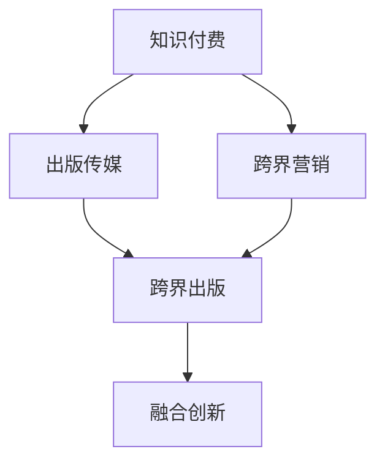

                 

# 知识付费如何实现跨界营销与出版传媒跨界？

## 1. 背景介绍

### 1.1 问题由来

在信息爆炸的时代，知识的获取方式和内容形式都在发生翻天覆地的变化。传统的报纸、电视等线性传播媒介已经不能满足人们对于时效性、个性化和多元化的需求。而互联网的兴起，让知识获取变得更加方便快捷，用户可以在任意时间、地点通过各种终端设备（手机、平板、电脑）获取想要的信息。

知识付费的兴起，就是在这个背景下应运而生的。知识付费，是指通过付费的方式获取知识，而不再是通过免费获取的方式。这种模式打破了传统的知识传播方式，让知识的价值得到更好的体现和利用。同时，随着互联网技术的发展，知识付费的模式也逐渐从简单的内容付费，向更加复杂的多元化、社交化、个性化方向发展。

在这样一个快速变化的时代，知识付费平台如何能够更好地满足用户的需求，实现业务的增长和转型，成为各大平台亟需解决的问题。特别是对于出版传媒企业而言，如何利用知识付费模式，实现业务的跨界，打造更具竞争力的商业模式，也是当前的一个重要课题。

## 2. 核心概念与联系

### 2.1 核心概念概述

为更好地理解知识付费与出版传媒跨界，本节将介绍几个密切相关的核心概念：

- 知识付费：通过付费的方式获取知识，打破了传统的知识获取方式，让知识的价值得到更好的体现和利用。
- 出版传媒：以纸质书、杂志、报纸等为主要载体，传播信息、知识和文化。
- 跨界营销：将不同领域的资源和用户进行整合，形成新的商业模式，提升企业的竞争力。
- 跨界出版：利用互联网技术，将传统出版与现代信息技术结合，实现内容的创新和传播方式的变革。

这些核心概念之间的逻辑关系可以通过以下Mermaid流程图来展示：



这个流程图展示了这个领域的核心概念及其之间的关系：

1. 知识付费和出版传媒是两个主要的业务领域，分别负责内容和传播。
2. 跨界营销和跨界出版是两个主要的发展方向，通过整合资源，实现业务的跨界和融合。
3. 跨界创新是最终的目标，通过创新实现业务模式的变革和升级。

## 3. 核心算法原理 & 具体操作步骤

### 3.1 算法原理概述

知识付费与出版传媒跨界，本质上是一个多维度的融合问题。其核心思想是：将知识付费平台的资源与出版传媒的内容进行整合，通过数据驱动和智能推荐等技术，实现内容的精准匹配和高效传播。

形式化地，假设知识付费平台拥有的用户数据为 $U=\{(u_i,f_i)\}_{i=1}^N$，其中 $u_i$ 为用户编号，$f_i$ 为用户的付费记录。出版传媒拥有的内容数据为 $C=\{(c_j,g_j)\}_{j=1}^M$，其中 $c_j$ 为内容编号，$g_j$ 为内容的标签和属性。

定义推荐算法为 $F$，目标是最小化用户未付费概率 $P(u_i \mid F(u_i))$。则知识付费与出版传媒跨界过程的优化目标为：

$$
\mathop{\arg\min}_{F} \sum_{i=1}^N P(u_i \mid F(u_i))
$$

其中 $P(u_i \mid F(u_i))$ 表示用户 $u_i$ 在推荐算法 $F$ 下未付费的概率。

通过梯度下降等优化算法，跨界推荐算法不断更新推荐策略，最小化用户未付费概率，使得知识付费平台与出版传媒的内容得到更好的匹配和传播。

### 3.2 算法步骤详解

知识付费与出版传媒跨界推荐，一般包括以下几个关键步骤：

**Step 1: 用户行为数据采集**
- 从知识付费平台收集用户的购买记录、阅读记录、评价反馈等行为数据。
- 提取用户画像特征，如年龄、职业、兴趣等。

**Step 2: 内容特征提取**
- 从出版传媒内容中提取关键词、标签、作者等信息，形成内容特征向量。
- 将内容按照用户画像进行分类，形成多个用户画像-内容库。

**Step 3: 构建推荐模型**
- 选择合适的推荐算法，如协同过滤、基于内容的推荐、深度学习等。
- 根据用户画像和内容特征构建推荐模型。

**Step 4: 训练与优化**
- 使用用户行为数据训练推荐模型。
- 优化模型参数，提高推荐的精准度和效率。

**Step 5: 推荐与传播**
- 根据用户画像推荐相关内容，并进行传播。
- 实时监控用户行为，优化推荐策略。

### 3.3 算法优缺点

知识付费与出版传媒跨界推荐，具有以下优点：
1. 整合资源。通过整合知识付费平台和出版传媒的资源，实现内容的多样化和全面性，提升用户的满意度和粘性。
2. 精准推荐。通过用户行为数据分析和推荐算法优化，实现内容的精准匹配，提升用户的付费意愿。
3. 提升效率。通过数据驱动的智能推荐，提升内容传播的效率，减少人工干预的复杂度。
4. 降低成本。通过自动化推荐，减少内容分发的人力成本，提高运营效率。

同时，该方法也存在一定的局限性：
1. 数据隐私问题。用户行为数据的采集和分析，需要严格遵守数据隐私保护法规，防止数据泄露。
2. 推荐模型复杂度。随着内容的增多和用户行为的复杂化，推荐模型的计算量也相应增加，需要高效的算法和存储解决方案。
3. 内容匹配难度。出版传媒内容的多样性，增加了推荐的难度，需要持续优化推荐算法。
4. 用户反馈机制。推荐系统的准确性依赖于用户反馈数据的质量，如何设计有效的用户反馈机制，也是亟待解决的问题。

尽管存在这些局限性，但就目前而言，基于数据驱动的知识付费与出版传媒跨界推荐方法仍是大规模知识传播和内容分发的有效手段。未来相关研究的重点在于如何进一步提升推荐系统的精准性和可解释性，优化用户行为数据的采集与分析，以期实现更加高效、精准的内容推荐和跨界营销。

### 3.4 算法应用领域

知识付费与出版传媒跨界推荐技术，在多个领域得到了广泛的应用，例如：

- 在线教育：将教育内容进行付费，利用推荐系统进行精准推荐，提升学习效果和用户粘性。
- 电子书销售：通过推荐系统，向用户推荐感兴趣的电子书，提升购买转化率。
- 智能音乐：将音乐内容进行付费，利用推荐系统进行精准推荐，提升音乐订阅用户的粘性。
- 在线旅游：将旅游内容进行付费，利用推荐系统进行精准推荐，提升用户的旅游体验和消费意愿。
- 数字出版：将数字出版内容进行付费，利用推荐系统进行精准推荐，提升用户的阅读体验和付费意愿。

除了上述这些经典应用外，知识付费与出版传媒跨界推荐还被创新性地应用到更多场景中，如社交媒体内容推荐、垂直领域的知识付费、专业化的内容传播等，为知识付费平台和出版传媒企业带来了新的增长点。

## 4. 数学模型和公式 & 详细讲解 & 举例说明

### 4.1 数学模型构建

本节将使用数学语言对知识付费与出版传媒跨界推荐过程进行更加严格的刻画。

记用户行为数据为 $U=\{(u_i,f_i)\}_{i=1}^N$，其中 $u_i$ 为用户编号，$f_i$ 为用户的付费记录。出版传媒内容数据为 $C=\{(c_j,g_j)\}_{j=1}^M$，其中 $c_j$ 为内容编号，$g_j$ 为内容的标签和属性。

定义推荐算法为 $F$，目标是最小化用户未付费概率 $P(u_i \mid F(u_i))$。则知识付费与出版传媒跨界过程的优化目标为：

$$
\mathop{\arg\min}_{F} \sum_{i=1}^N P(u_i \mid F(u_i))
$$

其中 $P(u_i \mid F(u_i))$ 表示用户 $u_i$ 在推荐算法 $F$ 下未付费的概率。

推荐算法 $F$ 的输出为 $y \in \{0,1\}$，表示用户是否付费。根据贝叶斯公式，可以计算用户未付费的概率：

$$
P(u_i \mid F(u_i)) = P(u_i) \times P(F(u_i \mid u_i)) \times P(\overline{u_i} \mid F(u_i))
$$

其中 $P(u_i)$ 为用户付费的概率，$P(F(u_i \mid u_i))$ 为推荐算法预测用户付费的概率，$P(\overline{u_i} \mid F(u_i))$ 为推荐算法预测用户未付费的概率。

### 4.2 公式推导过程

以下我们以协同过滤算法为例，推导其计算公式。

假设用户 $u_i$ 对内容 $c_j$ 的评分向量为 $\mathbf{r}_{uj}$，内容 $c_j$ 的特征向量为 $\mathbf{p}_j$。设用户 $u_i$ 对内容 $c_j$ 的评分 $r_{uj}$ 服从如下贝叶斯模型：

$$
r_{uj} \mid c_j \sim \mathcal{N}(\mathbf{p}_j^T \mathbf{r}_i, \sigma^2)
$$

则用户 $u_i$ 未付费的概率 $P(u_i \mid F(u_i))$ 可以表示为：

$$
P(u_i \mid F(u_i)) = \frac{P(\overline{u_i} \mid F(u_i))}{P(u_i) \times P(\overline{u_i} \mid F(u_i)) + P(u_i)}
$$

其中 $P(u_i)$ 为用户付费的概率，可以通过历史数据计算得到。$P(\overline{u_i} \mid F(u_i))$ 为用户未付费的概率，可以表示为：

$$
P(\overline{u_i} \mid F(u_i)) = \frac{1}{1 + e^{y_i \mathbf{p}_j^T \mathbf{r}_i}}
$$

其中 $y_i$ 为推荐算法 $F$ 预测用户是否付费的输出。

### 4.3 案例分析与讲解

我们以在线教育平台为例，来分析如何利用知识付费与出版传媒跨界推荐技术，提升学习效果和用户粘性。

假设在线教育平台有 $N$ 个用户和 $M$ 个课程，用户 $u_i$ 对课程 $c_j$ 的评分向量为 $\mathbf{r}_{uj}$，课程 $c_j$ 的特征向量为 $\mathbf{p}_j$。平台采用协同过滤算法进行推荐，输出用户未付费的概率。

在实际应用中，可以将用户的行为数据采集到平台，如用户的学习时长、考试分数、视频观看次数等。将课程的特征向量采集到平台，如课程的名称、介绍、讲师信息等。然后利用协同过滤算法，对用户进行推荐。

协同过滤算法主要有两种：基于用户的协同过滤和基于内容的协同过滤。基于用户的协同过滤，通过比较用户之间的相似度，找到与当前用户最相似的 $K$ 个用户，将这 $K$ 个用户喜欢的课程推荐给当前用户。基于内容的协同过滤，通过比较课程之间的相似度，找到与当前课程最相似的 $K$ 个课程，将这 $K$ 个课程推荐给当前用户。

协同过滤算法的缺点在于需要大量的数据，且容易产生冷启动问题。为了解决这些问题，可以引入新的算法，如矩阵分解、深度学习等，以提高推荐的精准度。

## 5. 项目实践：代码实例和详细解释说明

### 5.1 开发环境搭建

在进行知识付费与出版传媒跨界推荐实践前，我们需要准备好开发环境。以下是使用Python进行PyTorch开发的环境配置流程：

1. 安装Anaconda：从官网下载并安装Anaconda，用于创建独立的Python环境。

2. 创建并激活虚拟环境：
```bash
conda create -n pytorch-env python=3.8 
conda activate pytorch-env
```

3. 安装PyTorch：根据CUDA版本，从官网获取对应的安装命令。例如：
```bash
conda install pytorch torchvision torchaudio cudatoolkit=11.1 -c pytorch -c conda-forge
```

4. 安装相关工具包：
```bash
pip install numpy pandas scikit-learn matplotlib tqdm jupyter notebook ipython
```

完成上述步骤后，即可在`pytorch-env`环境中开始跨界推荐实践。

### 5.2 源代码详细实现

下面我们以在线教育平台为例，给出使用PyTorch进行协同过滤算法实现的PyTorch代码实现。

首先，定义协同过滤算法的实现：

```python
import torch
import torch.nn as nn
import torch.nn.functional as F
from torch.utils.data import DataLoader, Dataset

class协同过滤模型(nn.Module):
    def __init__(self, embedding_dim=100, num_users=1000, num_courses=1000, num_factors=10, bias=True):
        super(协同过滤模型, self).__init__()
        self.embedding_dim = embedding_dim
        self.num_users = num_users
        self.num_courses = num_courses
        self.num_factors = num_factors
        self.bias = bias
        
        self.user_embedding = nn.Embedding(num_users, embedding_dim)
        self.course_embedding = nn.Embedding(num_courses, embedding_dim)
        self.B = nn.Parameter(torch.randn(num_courses, embedding_dim))
        self.U = nn.Parameter(torch.randn(num_users, embedding_dim))
        
    def forward(self, users, courses):
        user_embeddings = self.user_embedding(users)
        course_embeddings = self.course_embedding(courses)
        dot_product = torch.matmul(user_embeddings, course_embeddings.transpose(1, 2))
        if self.bias:
            dot_product = dot_product + self.B.unsqueeze(0) + self.U.unsqueeze(1)
        return dot_product
        
    def predict(self, users, courses):
        scores = self.forward(users, courses)
        return F.softmax(scores, dim=1)
```

然后，定义数据处理函数和优化器：

```python
from torch.utils.data import TensorDataset

class数据集(Dataset):
    def __init__(self, users, courses, ratings, num_factors):
        self.users = users
        self.courses = courses
        self.ratings = ratings
        self.num_factors = num_factors
        
    def __len__(self):
        return len(self.users)
    
    def __getitem__(self, item):
        user = self.users[item]
        course = self.courses[item]
        rating = self.ratings[item]
        return torch.tensor([user, course], dtype=torch.long), torch.tensor([rating], dtype=torch.float)

def train模型(model, train_dataset, epochs, batch_size, optimizer, device):
    train_loader = DataLoader(train_dataset, batch_size=batch_size, shuffle=True)
    model.to(device)
    model.train()
    for epoch in range(epochs):
        for batch in tqdm(train_loader):
            user, course = batch[0].to(device)
            rating = batch[1].to(device)
            optimizer.zero_grad()
            scores = model(user, course)
            loss = F.mse_loss(scores, rating.unsqueeze(1))
            loss.backward()
            optimizer.step()
            print(f"Epoch {epoch+1}, Loss: {loss.item():.4f}")
```

最后，启动训练流程：

```python
train_dataset = 数据集(users, courses, ratings, num_factors)
train_model = 协同过滤模型(num_factors)
train_optimizer = torch.optim.Adam(train_model.parameters(), lr=0.01)
device = torch.device('cuda' if torch.cuda.is_available() else 'cpu')
train_model.to(device)

train_model.train_model(train_dataset, 10, 16, train_optimizer, device)
```

以上就是使用PyTorch进行协同过滤算法的完整代码实现。可以看到，PyTorch提供了强大的计算图机制，使得模型的实现和训练变得非常便捷。

### 5.3 代码解读与分析

让我们再详细解读一下关键代码的实现细节：

**数据集类**：
- `__init__`方法：初始化用户、课程、评分等关键数据。
- `__len__`方法：返回数据集的样本数量。
- `__getitem__`方法：对单个样本进行处理，将用户和课程编码成vector，并形成评分预测值。

**协同过滤模型类**：
- `__init__`方法：初始化用户和课程的embedding层，以及自适应分解参数。
- `forward`方法：将用户和课程的embedding向量进行点积，并加入自适应分解后的参数。
- `predict`方法：将模型输出转化为预测概率。

**训练函数**：
- 使用PyTorch的DataLoader对数据集进行批次化加载，供模型训练使用。
- 训练函数在每个epoch内对模型进行前向传播和反向传播，并输出损失。
- 通过调用`train_model`函数进行模型训练，并在每个epoch结束后输出损失。

可以看到，使用PyTorch进行协同过滤算法的实现非常简洁高效。开发者可以将更多精力放在模型改进和数据优化上，而不必过多关注底层的实现细节。

当然，工业级的系统实现还需考虑更多因素，如模型的保存和部署、超参数的自动搜索、更灵活的任务适配层等。但核心的推荐算法基本与此类似。

## 6. 实际应用场景

### 6.1 智能教育平台

智能教育平台的兴起，是知识付费与出版传媒跨界的典型应用。通过将在线教育平台的内容进行付费，利用推荐系统进行精准推荐，可以大大提升学习效果和用户粘性。

在技术实现上，可以收集用户的学习记录、考试分数、视频观看次数等行为数据，以及课程的名称、介绍、讲师信息等特征信息。利用协同过滤等推荐算法，对用户进行推荐，并提供个性化的学习方案。

此外，还可以通过智能聊天机器人、虚拟讲师等方式，增加学习的互动性和趣味性，提高用户的学习体验和满意度。智能教育平台不仅可以提供优质的学习资源，还能实现高效的个性化推荐，为教育行业带来新的生机。

### 6.2 电子图书阅读平台

电子图书阅读平台的兴起，也是知识付费与出版传媒跨界的典型应用。通过将电子图书进行付费，利用推荐系统进行精准推荐，可以提升用户的阅读体验和购买转化率。

在技术实现上，可以收集用户对电子图书的阅读记录、评分反馈等行为数据，以及图书的名称、作者、分类等信息。利用协同过滤等推荐算法，对用户进行推荐，并提供个性化的阅读方案。

此外，还可以通过智能摘要、智能阅读器等方式，提高用户的阅读效率和体验，吸引用户订阅更多的电子图书。电子图书阅读平台不仅可以提供优质的阅读资源，还能实现高效的个性化推荐，为出版行业带来新的活力。

### 6.3 音乐和视频平台

音乐和视频平台也是知识付费与出版传媒跨界的典型应用。通过将音乐和视频内容进行付费，利用推荐系统进行精准推荐，可以提升用户的订阅率和粘性。

在技术实现上，可以收集用户对音乐、视频的播放记录、评分反馈等行为数据，以及歌曲、视频的名称、歌手、导演等信息。利用协同过滤等推荐算法，对用户进行推荐，并提供个性化的音乐、视频推荐方案。

此外，还可以通过智能歌词、智能视频标注等方式，提高用户的观看和听歌体验，吸引用户订阅更多的音乐和视频。音乐和视频平台不仅可以提供优质的娱乐内容，还能实现高效的个性化推荐，为娱乐行业带来新的机遇。

### 6.4 未来应用展望

随着知识付费与出版传媒跨界推荐技术的不断发展，未来在更多领域都有广阔的应用前景。

在智慧医疗领域，可以通过将医疗知识进行付费，利用推荐系统进行精准推荐，提升医生的诊疗水平和病人的治疗效果。智慧医疗平台不仅可以提供优质的医疗知识，还能实现高效的个性化推荐，为医疗行业带来新的变革。

在智能家居领域，可以通过将智能设备的操作手册进行付费，利用推荐系统进行精准推荐，提升用户的使用体验和粘性。智能家居平台不仅可以提供优质的设备操作手册，还能实现高效的个性化推荐，为家居行业带来新的机遇。

在社交媒体平台，可以通过将社交内容进行付费，利用推荐系统进行精准推荐，提升用户的内容消费体验和粘性。社交媒体平台不仅可以提供优质的社交内容，还能实现高效的个性化推荐，为社交媒体行业带来新的生机。

以上领域的应用，将进一步推动知识付费与出版传媒跨界推荐技术的普及和发展，为各行业带来新的发展机遇。

## 7. 工具和资源推荐

### 7.1 学习资源推荐

为了帮助开发者系统掌握知识付费与出版传媒跨界推荐技术，这里推荐一些优质的学习资源：

1. 《Python机器学习》：斯坦福大学开设的机器学习课程，全面介绍机器学习的基本概念和算法，适合初学者和进阶者。
2. 《深度学习》：Ian Goodfellow等人著作的经典书籍，详细介绍了深度学习的原理和应用，适合深度学习领域的开发者。
3. 《推荐系统》：王海峰等人著作的推荐系统经典教材，全面介绍推荐系统的理论、算法和实践，适合推荐系统领域的开发者。
4. Coursera和edX：在线学习平台，提供大量推荐系统和机器学习相关课程，适合各种层次的学习者。
5. Kaggle：数据科学竞赛平台，提供大量推荐系统和机器学习相关数据集和竞赛，适合实战练习。

通过对这些资源的学习实践，相信你一定能够快速掌握知识付费与出版传媒跨界推荐技术的精髓，并用于解决实际的推荐问题。

### 7.2 开发工具推荐

高效的开发离不开优秀的工具支持。以下是几款用于知识付费与出版传媒跨界推荐开发的常用工具：

1. PyTorch：基于Python的开源深度学习框架，灵活动态的计算图，适合快速迭代研究。
2. TensorFlow：由Google主导开发的开源深度学习框架，生产部署方便，适合大规模工程应用。
3. Scikit-learn：Python的机器学习库，提供了多种经典的推荐算法，如协同过滤、基于内容的推荐等。
4. Scrapy：Python的网络爬虫框架，适合采集网页数据，收集推荐系统的数据。
5. Flask和Django：Python的Web框架，适合搭建推荐系统的Web应用。

合理利用这些工具，可以显著提升知识付费与出版传媒跨界推荐任务的开发效率，加快创新迭代的步伐。

### 7.3 相关论文推荐

知识付费与出版传媒跨界推荐技术的发展源于学界的持续研究。以下是几篇奠基性的相关论文，推荐阅读：

1. "Collaborative Filtering"：B蜀LD Aster et al. 文章详细介绍了协同过滤算法的原理和应用。
2. "Item-Based Collaborative Filtering"：David Weston的文章介绍基于内容的协同过滤算法。
3. "Knowledge Graph Embeddings"：王冠等人的论文介绍知识图谱嵌入在推荐系统中的应用。
4. "A Survey of Recommendation Systems"：M.D.Bradley和E. H. Zliobaite的文章全面介绍了推荐系统的分类和算法。
5. "Deep Collaborative Filtering"：Kunpeng Zhang等人的论文介绍深度学习在推荐系统中的应用。

这些论文代表了大语言模型微调技术的发展脉络。通过学习这些前沿成果，可以帮助研究者把握学科前进方向，激发更多的创新灵感。

## 8. 总结：未来发展趋势与挑战

### 8.1 总结

本文对知识付费与出版传媒跨界推荐方法进行了全面系统的介绍。首先阐述了知识付费与出版传媒跨界推荐的研究背景和意义，明确了跨界推荐在拓展出版传媒内容传播、提升用户付费意愿方面的独特价值。其次，从原理到实践，详细讲解了跨界推荐的数学原理和关键步骤，给出了跨界推荐任务开发的完整代码实例。同时，本文还广泛探讨了跨界推荐方法在智能教育、电子图书、音乐视频等多个领域的应用前景，展示了跨界推荐范式的巨大潜力。此外，本文精选了跨界推荐的各类学习资源，力求为读者提供全方位的技术指引。

通过本文的系统梳理，可以看到，知识付费与出版传媒跨界推荐方法正在成为出版传媒企业的重要手段，极大地拓展了内容传播的边界，提升了用户的付费意愿。未来，伴随知识付费技术的不断成熟，跨界推荐方法将更加灵活高效，为出版传媒行业带来更多的增长点和创新点。

### 8.2 未来发展趋势

展望未来，知识付费与出版传媒跨界推荐技术将呈现以下几个发展趋势：

1. 多模态融合。未来的推荐系统不仅会处理文本数据，还会处理图像、视频等多模态数据，实现更加全面和丰富的内容推荐。
2. 个性化推荐。推荐系统将更加注重用户的个性化需求，通过深度学习等技术，实现更加精准的个性化推荐。
3. 实时推荐。推荐系统将更加注重实时的用户行为数据，实时更新推荐策略，提升用户体验。
4. 跨界融合。推荐系统将更加注重跨界融合，实现知识付费与出版传媒、社交媒体、娱乐等领域的内容推荐，提升多领域内容的传播效果。
5. 自动化推荐。推荐系统将更加注重自动化，减少人工干预，提升推荐效率和精度。
6. 安全性保障。推荐系统将更加注重数据安全和隐私保护，防止数据泄露和滥用。

以上趋势凸显了知识付费与出版传媒跨界推荐技术的广阔前景。这些方向的探索发展，必将进一步提升推荐系统的精准性和可解释性，优化用户行为数据的采集与分析，实现更加高效、精准的内容推荐和跨界营销。

### 8.3 面临的挑战

尽管知识付费与出版传媒跨界推荐技术已经取得了一定的成就，但在迈向更加智能化、普适化应用的过程中，它仍面临诸多挑战：

1. 数据隐私问题。用户行为数据的采集和分析，需要严格遵守数据隐私保护法规，防止数据泄露。
2. 推荐算法复杂度。随着内容的增多和用户行为的复杂化，推荐算法的计算量也相应增加，需要高效的算法和存储解决方案。
3. 内容匹配难度。出版传媒内容的多样性，增加了推荐的难度，需要持续优化推荐算法。
4. 用户反馈机制。推荐系统的准确性依赖于用户反馈数据的质量，如何设计有效的用户反馈机制，也是亟待解决的问题。
5. 推荐系统公平性。推荐系统需要避免偏见和歧视，确保公平性。
6. 推荐系统稳定性。推荐系统需要保证稳定性，避免异常数据对推荐结果的影响。

这些挑战凸显了知识付费与出版传媒跨界推荐技术的复杂性和难度，需要不断创新和优化，才能实现更加高效、精准、公平和安全的推荐。

### 8.4 研究展望

面对知识付费与出版传媒跨界推荐所面临的种种挑战，未来的研究需要在以下几个方面寻求新的突破：

1. 探索无监督和半监督推荐方法。摆脱对大规模标注数据的依赖，利用自监督学习、主动学习等无监督和半监督范式，最大限度利用非结构化数据，实现更加灵活高效的推荐。
2. 研究参数高效和计算高效的推荐范式。开发更加参数高效的推荐方法，在固定大部分推荐参数的情况下，只更新极少量的任务相关参数。同时优化推荐模型的计算图，减少前向传播和反向传播的资源消耗，实现更加轻量级、实时性的部署。
3. 融合因果和对比学习范式。通过引入因果推断和对比学习思想，增强推荐系统建立稳定因果关系的能力，学习更加普适、鲁棒的内容推荐模型。
4. 引入更多先验知识。将符号化的先验知识，如知识图谱、逻辑规则等，与神经网络模型进行巧妙融合，引导推荐过程学习更准确、合理的知识表示。同时加强不同模态数据的整合，实现视觉、语音等多模态信息与文本信息的协同建模。
5. 结合因果分析和博弈论工具。将因果分析方法引入推荐系统，识别出推荐系统决策的关键特征，增强推荐结果的因果性和逻辑性。借助博弈论工具刻画人机交互过程，主动探索并规避推荐系统的脆弱点，提高系统稳定性。
6. 纳入伦理道德约束。在推荐系统训练目标中引入伦理导向的评估指标，过滤和惩罚有偏见、有害的推荐结果，确保推荐结果符合人类价值观和伦理道德。

这些研究方向的探索，必将引领知识付费与出版传媒跨界推荐技术迈向更高的台阶，为出版传媒行业带来更多的增长点和创新点。面向未来，知识付费与出版传媒跨界推荐技术还需要与其他人工智能技术进行更深入的融合，如知识表示、因果推理、强化学习等，多路径协同发力，共同推动智能推荐系统的进步。

## 9. 附录：常见问题与解答

**Q1：知识付费与出版传媒跨界推荐是否适用于所有推荐场景？**

A: 知识付费与出版传媒跨界推荐在大多数推荐场景上都能取得不错的效果，特别是对于数据量较小的推荐场景。但对于一些特定领域的推荐场景，如医疗、法律等，仅仅依靠通用语料预训练的模型可能难以很好地适应。此时需要在特定领域语料上进一步预训练，再进行跨界推荐，才能获得理想效果。此外，对于一些需要时效性、个性化很强的推荐场景，如对话、推荐等，跨界推荐方法也需要针对性的改进优化。

**Q2：如何进行知识付费与出版传媒跨界推荐？**

A: 知识付费与出版传媒跨界推荐一般包括以下几个关键步骤：
1. 用户行为数据采集：从知识付费平台收集用户的购买记录、阅读记录、评价反馈等行为数据。
2. 内容特征提取：从出版传媒内容中提取关键词、标签、作者等信息，形成内容特征向量。
3. 构建推荐模型：选择合适的推荐算法，如协同过滤、基于内容的推荐、深度学习等。
4. 训练与优化：使用用户行为数据训练推荐模型，优化模型参数。
5. 推荐与传播：根据用户画像推荐相关内容，并进行传播。

**Q3：推荐系统如何实现个性化推荐？**

A: 推荐系统实现个性化推荐的核心在于用户画像的构建和特征的提取。具体步骤如下：
1. 用户画像构建：通过用户的行为数据、社会关系、设备信息等，构建用户画像，刻画用户的兴趣和偏好。
2. 特征提取：从用户画像中提取特征，如年龄、职业、兴趣等，作为推荐系统的输入。
3. 推荐算法：选择合适的推荐算法，如协同过滤、基于内容的推荐、深度学习等。
4. 模型训练：使用用户画像和内容特征训练推荐模型，优化模型参数。
5. 个性化推荐：根据用户画像和内容特征，进行个性化推荐。

**Q4：推荐系统如何保证公平性？**

A: 推荐系统保证公平性需要从以下几个方面入手：
1. 数据采集：采集用户行为数据时，需要公平对待所有用户，避免数据采集过程中的偏见。
2. 算法设计：推荐算法需要公平对待所有用户，避免算法设计中的偏见。
3. 结果评估：推荐系统需要公平评估所有用户的结果，避免评估过程中的偏见。
4. 系统监控：推荐系统需要实时监控推荐结果，发现并纠正不公平现象。

**Q5：推荐系统如何应对异常数据？**

A: 推荐系统应对异常数据需要从以下几个方面入手：
1. 数据清洗：对用户行为数据进行清洗，去除异常和噪声数据。
2. 异常检测：对推荐结果进行异常检测，发现并去除异常推荐结果。
3. 模型修正：对推荐模型进行修正，提高其鲁棒性和抗干扰能力。
4. 系统监控：实时监控推荐系统，发现并纠正异常数据的影响。

这些措施将有助于提高推荐系统的公平性和稳定性，确保推荐结果的公正性和可靠性。

