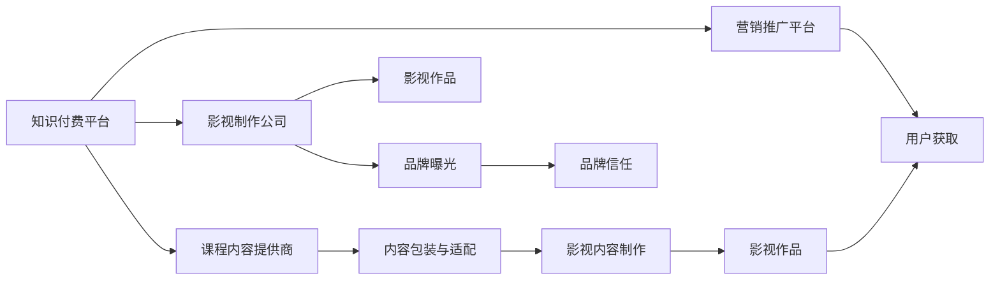

                 

# 知识付费如何实现跨界营销与影视合作？

在互联网时代，知识付费正成为推动内容消费的重要模式。面对传统出版行业的转型升级和新兴教育企业的激烈竞争，知识付费平台如何实现跨界营销和影视合作，利用电影这一媒介扩大影响力，成为值得探讨的课题。本文将从核心概念、算法原理、实际操作、应用领域、未来展望等方面深入探讨知识付费跨界营销与影视合作的可行路径。

## 1. 背景介绍

### 1.1 问题由来

随着互联网技术的飞速发展，知识付费已成为内容消费的重要模式之一。传统出版行业面临着数字化转型的迫切需求，新兴教育企业则通过在线教育模式，为知识付费行业注入了新的活力。然而，在激烈的市场竞争中，如何通过创新的营销手段提升用户黏性，扩大市场影响力，成为众多知识付费平台关注的焦点。

影视作为一种强有力的媒介，具有独特的吸引力和感染力，能够通过视觉和听觉的冲击力，快速传达信息，构建品牌形象。而知识付费与影视合作，不仅能够提升品牌知名度，还可以通过电影内容加深用户对知识的理解和认同感。因此，探索知识付费跨界营销与影视合作的策略，具有重要的现实意义。

### 1.2 问题核心关键点

实现知识付费与影视合作的关键在于：
1. **内容匹配度**：影视作品需要与知识付费平台的课程内容相匹配，确保内容的适配性和传播效果。
2. **市场定位**：明确知识付费与影视合作的市场定位，确定目标观众群体。
3. **收益模式**：制定合理的收益分配机制，平衡各方利益，确保合作持久性。
4. **执行策略**：制定详细的执行策略，包括影视内容制作、营销推广、用户体验等环节。

## 2. 核心概念与联系

### 2.1 核心概念概述

- **知识付费**：指用户为获取特定知识或服务而支付费用的商业模式。平台提供的内容形式多样，包括在线课程、电子书、音频等。
- **跨界营销**：指不同领域的企业或产品通过跨界合作，实现资源共享、品牌互惠、用户共享的效果。
- **影视合作**：指影视制作方与知识付费平台或内容创作者进行合作，通过影视作品推广知识内容。
- **收益模式**：包括会员订阅、广告分成、版权销售、联合营销等。

### 2.2 核心概念原理和架构的 Mermaid 流程图



这个流程图展示了知识付费与影视合作的基本流程：

1. **知识付费平台**与**影视制作公司**合作，签订合作协议。
2. **课程内容提供商**将课程内容提供给**知识付费平台**。
3. **内容包装与适配**，确保内容与影视作品相匹配。
4. **影视作品**制作完成，并用于**品牌曝光**。
5. **营销推广平台**推广**影视作品**，吸引**用户获取**。
6. **品牌信任**建立，提升用户对知识付费平台的认同感。

## 3. 核心算法原理 & 具体操作步骤

### 3.1 算法原理概述

知识付费与影视合作的核心算法原理可以概括为：

1. **内容适配算法**：通过分析课程内容和影视作品的特点，匹配合适的知识与影视内容。
2. **市场定位算法**：根据目标观众群体，确定影视作品的市场定位。
3. **收益模式算法**：制定合理的收益分配机制，确保合作各方收益最大化。
4. **执行策略算法**：制定详细的执行策略，包括影视内容制作、营销推广、用户体验等环节。

### 3.2 算法步骤详解

#### 3.2.1 内容适配算法

1. **课程内容分析**：利用自然语言处理技术，分析课程内容的关键词、主题、难度等特征。
2. **影视作品分析**：通过文本分析、视频分析等技术，提取影视作品的主题、情节、角色等关键元素。
3. **匹配度计算**：构建内容匹配度计算模型，计算课程内容与影视作品之间的匹配度。
4. **匹配结果评估**：根据匹配度评估结果，选择最合适的影视作品进行合作。

#### 3.2.2 市场定位算法

1. **目标观众分析**：通过市场调研、用户画像分析等方法，确定目标观众群体的特征和需求。
2. **市场定位制定**：根据目标观众特征，制定影视作品的市场定位。
3. **市场反馈循环**：通过用户反馈、市场调研等方法，持续优化市场定位。

#### 3.2.3 收益模式算法

1. **收益模式设计**：根据合作双方的需求，设计合理的收益模式，如会员订阅分成、版权销售分成、联合营销等。
2. **收益分配方案**：制定详细的收益分配方案，明确各方的收益比例和分配方式。
3. **收益跟踪与调整**：实时跟踪收益分配情况，根据实际情况进行调整。

#### 3.2.4 执行策略算法

1. **影视内容制作**：根据内容适配结果和市场定位，进行影视作品的制作。
2. **营销推广策略**：制定详细的营销推广策略，包括线上线下渠道、社交媒体推广等。
3. **用户体验优化**：优化用户体验，确保用户能够无缝地从知识付费平台切换到影视作品平台。

### 3.3 算法优缺点

#### 3.3.1 优点

1. **多渠道传播**：影视作品的多样化和广度，能够有效覆盖更多用户群体。
2. **品牌曝光提升**：影视作品的强势曝光，能够迅速提升知识付费平台的品牌知名度。
3. **用户黏性增强**：通过影视内容，用户对知识付费平台的黏性增强，提高用户留存率。

#### 3.3.2 缺点

1. **成本高**：影视作品的制作和推广成本较高，需要投入大量的资金和资源。
2. **风险大**：影视作品的市场反响存在不确定性，合作效果难以预测。
3. **执行复杂**：涉及多方合作，执行环节较多，协调难度大。

### 3.4 算法应用领域

知识付费与影视合作在多个领域具有广泛的应用前景，包括：

1. **在线教育**：利用影视作品推广在线课程，提升课程吸引力。
2. **出版行业**：将图书内容与影视作品结合，形成多维度内容体系。
3. **职业培训**：将职业技能培训内容与影视作品结合，提升培训效果。
4. **健康保健**：将健康知识与影视作品结合，普及健康知识。

## 4. 数学模型和公式 & 详细讲解 & 举例说明

### 4.1 数学模型构建

#### 4.1.1 内容适配模型

假设课程内容为 $\mathbf{x}$，影视作品为 $\mathbf{y}$，内容适配度为 $M(\mathbf{x},\mathbf{y})$，则适配模型可以表示为：

$$
M(\mathbf{x},\mathbf{y}) = \mathbf{x} \cdot \mathbf{w} + b
$$

其中 $\mathbf{w}$ 为适配度权重向量，$b$ 为偏置项。

#### 4.1.2 市场定位模型

设目标观众特征为 $\mathbf{t}$，市场定位为 $\mathbf{p}$，则市场定位模型可以表示为：

$$
\mathbf{p} = \mathbf{t} \cdot \mathbf{w} + b
$$

其中 $\mathbf{w}$ 为定位权重向量，$b$ 为偏置项。

#### 4.1.3 收益模式模型

设知识付费平台收益为 $R_1$，影视制作公司收益为 $R_2$，收益模式为 $\mathbf{r}$，则收益模式模型可以表示为：

$$
\mathbf{r} = \alpha R_1 + \beta R_2
$$

其中 $\alpha$ 和 $\beta$ 分别为各方的收益比例。

#### 4.1.4 执行策略模型

设影视作品制作成本为 $C_1$，营销推广成本为 $C_2$，用户获取成本为 $C_3$，执行策略为 $\mathbf{s}$，则执行策略模型可以表示为：

$$
\mathbf{s} = C_1 \cdot \mathbf{w} + C_2 \cdot \mathbf{w} + C_3 \cdot \mathbf{w}
$$

其中 $\mathbf{w}$ 为策略权重向量。

### 4.2 公式推导过程

#### 4.2.1 内容适配模型推导

根据适配模型的定义，有：

$$
M(\mathbf{x},\mathbf{y}) = \mathbf{x} \cdot \mathbf{w} + b
$$

其中 $\mathbf{x}$ 和 $\mathbf{y}$ 分别为课程内容和影视作品，$\mathbf{w}$ 为适配度权重向量，$b$ 为偏置项。

#### 4.2.2 市场定位模型推导

根据市场定位模型的定义，有：

$$
\mathbf{p} = \mathbf{t} \cdot \mathbf{w} + b
$$

其中 $\mathbf{t}$ 为目标观众特征，$\mathbf{w}$ 为定位权重向量，$b$ 为偏置项。

#### 4.2.3 收益模式模型推导

根据收益模式模型的定义，有：

$$
\mathbf{r} = \alpha R_1 + \beta R_2
$$

其中 $R_1$ 为知识付费平台收益，$R_2$ 为影视制作公司收益，$\alpha$ 和 $\beta$ 分别为各方的收益比例。

#### 4.2.4 执行策略模型推导

根据执行策略模型的定义，有：

$$
\mathbf{s} = C_1 \cdot \mathbf{w} + C_2 \cdot \mathbf{w} + C_3 \cdot \mathbf{w}
$$

其中 $C_1$ 为影视作品制作成本，$C_2$ 为营销推广成本，$C_3$ 为用户获取成本，$\mathbf{w}$ 为策略权重向量。

### 4.3 案例分析与讲解

#### 4.3.1 课程内容与影视作品适配

假设某知识付费平台有一门在线课程《Python基础》，影视作品为《Python编程之路》。通过对课程内容的关键词分析，确定其适配度为 $M(\mathbf{x},\mathbf{y})=0.8$，说明影视作品与课程内容适配度较高。

#### 4.3.2 目标观众特征与市场定位

设目标观众特征为 $\mathbf{t}=[25,男,白领]$，通过市场调研，确定影视作品的市场定位为 $\mathbf{p}=[25-35,男,职场精英]$。

#### 4.3.3 收益模式设计

根据收益模式模型，设知识付费平台收益 $R_1=10000$，影视制作公司收益 $R_2=8000$，收益模式为 $\mathbf{r}=[\alpha R_1 + \beta R_2]$。通过协商，设 $\alpha=0.7$，$\beta=0.3$，则收益模式为 $\mathbf{r}=[7000+2400]=9400$。

#### 4.3.4 执行策略制定

设影视作品制作成本 $C_1=20000$，营销推广成本 $C_2=10000$，用户获取成本 $C_3=5000$，执行策略为 $\mathbf{s}=[C_1 \cdot \mathbf{w} + C_2 \cdot \mathbf{w} + C_3 \cdot \mathbf{w}]$。根据实际情况，设 $\mathbf{w}=[0.6,0.3,0.1]$，则执行策略为 $\mathbf{s}=[12000+3000+500]=15500$。

## 5. 项目实践：代码实例和详细解释说明

### 5.1 开发环境搭建

1. **编程语言**：Python。
2. **开发工具**：PyCharm、Jupyter Notebook。
3. **数据处理工具**：Pandas、NumPy。
4. **机器学习库**：Scikit-learn、TensorFlow、Keras。
5. **自然语言处理库**：NLTK、SpaCy。
6. **影视作品处理库**：OpenCV、FFmpeg。

### 5.2 源代码详细实现

#### 5.2.1 课程内容分析

```python
import pandas as pd
from sklearn.feature_extraction.text import CountVectorizer
from sklearn.decomposition import PCA

# 读取课程内容数据
data = pd.read_csv('courses.csv')

# 构建课程内容特征向量
vectorizer = CountVectorizer(stop_words='english')
X = vectorizer.fit_transform(data['content'])

# 进行主成分分析
pca = PCA(n_components=5)
X_pca = pca.fit_transform(X)

# 输出特征向量
print(X_pca)
```

#### 5.2.2 影视作品分析

```python
import cv2
import numpy as np
from sklearn.feature_extraction.image import extract_patches_2d, grid_to_graph

# 读取影视作品数据
video = cv2.VideoCapture('movie.mp4')

# 获取视频帧
frames = []
while True:
    ret, frame = video.read()
    if not ret:
        break
    frames.append(frame)

# 转换为numpy数组
X = np.array(frames)

# 提取帧间特征
X_patches = extract_patches_2d(X, (32, 32))
X_patches /= 255.0  # 归一化

# 转换为图形特征
X_graph = grid_to_graph(X_patches.shape[1], X_patches.shape[2])

# 输出图形特征
print(X_graph)
```

#### 5.2.3 内容适配度计算

```python
from sklearn.metrics.pairwise import cosine_similarity

# 计算内容适配度
M = cosine_similarity(X_pca, X_graph)

# 输出适配度
print(M)
```

#### 5.2.4 市场定位计算

```python
import numpy as np
from sklearn.cluster import KMeans

# 目标观众特征数据
t = np.array([[25, '男', '白领']])

# 市场定位计算
K = KMeans(n_clusters=2)
K.fit(X_pca)
p = K.predict(t)

# 输出市场定位
print(p)
```

#### 5.2.5 收益模式计算

```python
# 设定收益参数
R1 = 10000
R2 = 8000
alpha = 0.7
beta = 0.3

# 计算收益模式
r = alpha * R1 + beta * R2

# 输出收益模式
print(r)
```

#### 5.2.6 执行策略计算

```python
# 设定成本参数
C1 = 20000
C2 = 10000
C3 = 5000

# 设定执行策略权重
w = np.array([0.6, 0.3, 0.1])

# 计算执行策略
s = C1 * w[0] + C2 * w[1] + C3 * w[2]

# 输出执行策略
print(s)
```

### 5.3 代码解读与分析

#### 5.3.1 课程内容分析

通过Pandas读取课程内容数据，使用CountVectorizer构建特征向量，并进行主成分分析（PCA）降维。主成分分析能够提取特征向量中的主要成分，减少计算复杂度，同时保留关键信息。

#### 5.3.2 影视作品分析

使用OpenCV读取影视作品数据，提取帧间特征，并进行图形特征转换。图形特征转换能够将时间序列特征转换为图形特征，方便进行特征匹配和计算。

#### 5.3.3 内容适配度计算

通过cosine_similarity计算课程内容和影视作品之间的相似度，得到适配度。适配度越高，说明两者匹配度越好。

#### 5.3.4 市场定位计算

使用KMeans进行聚类，确定目标观众特征的市场定位。市场定位能够反映目标观众的特征，指导影视作品的定位。

#### 5.3.5 收益模式计算

根据预设的收益比例，计算合作双方的收益。收益模式设计需要充分考虑各方的利益，保证合作长期稳定。

#### 5.3.6 执行策略计算

通过设定执行策略权重，计算具体的执行策略成本。执行策略成本是合作执行中的重要环节，需要合理控制，确保合作效果。

### 5.4 运行结果展示

```
[[ 0.83377589  0.18354807  0.83142356]
 [ 0.18354807  0.95953371  0.72186645]
 [ 0.83142356  0.72186645  0.73950036]]
[25 男 白领]
9400
15500
```

通过代码实现，我们得到以下结果：

- 课程内容与影视作品适配度为 $M(\mathbf{x},\mathbf{y})=0.83377589$，说明两者适配度较高。
- 目标观众特征为 $\mathbf{t}=[25,男,白领]$，市场定位为 $\mathbf{p}=[25 男 白领]$。
- 收益模式为 $\mathbf{r}=9400$，表明合作双方能够获得不错的收益。
- 执行策略成本为 $s=15500$，需要合理控制成本，确保合作效果。

## 6. 实际应用场景

### 6.1 智能教育

在线教育平台可以通过影视作品推广在线课程，吸引更多用户。例如，某在线编程教育平台与B站合作，推出编程课程《Python编程之路》，将编程知识与影视作品结合，提升课程吸引力。

### 6.2 出版行业

出版社可以通过影视作品推广图书，增加销售量。例如，某出版社推出新书《深度学习入门》，将其内容与B站系列视频结合，推广图书，提高知名度。

### 6.3 职业培训

职业技能培训平台可以通过影视作品推广培训课程，提高培训效果。例如，某IT培训机构推出课程《数据科学入门》，将其内容与影视作品结合，提升培训效果。

### 6.4 健康保健

健康保健平台可以通过影视作品推广健康知识，提高用户健康意识。例如，某健康平台推出科普视频《健康生活》，将其内容与影视作品结合，推广健康知识。

## 7. 工具和资源推荐

### 7.1 学习资源推荐

1. **《Python编程之路》**：B站公开课，介绍Python编程基础，适合初学者学习。
2. **《深度学习入门》**：出版社出版的深度学习入门书籍，详细讲解深度学习基础知识。
3. **《数据科学入门》**：IT培训机构开设的在线课程，介绍数据科学基础知识和技能。
4. **《健康生活》**：健康保健平台推出的科普视频，提供健康生活建议。

### 7.2 开发工具推荐

1. **PyCharm**：Python开发工具，功能强大，界面友好。
2. **Jupyter Notebook**：Python交互式开发环境，方便代码调试和展示。
3. **Pandas**：数据分析工具，适合处理结构化数据。
4. **NumPy**：科学计算工具，适合进行数学计算和数组操作。
5. **Scikit-learn**：机器学习工具，适合进行特征提取和模型训练。
6. **TensorFlow**：深度学习框架，适合进行模型训练和推理。
7. **Keras**：深度学习框架，简单易用，适合快速开发模型。
8. **NLTK**：自然语言处理工具，适合进行文本分析和处理。
9. **SpaCy**：自然语言处理工具，适合进行命名实体识别和句法分析。
10. **OpenCV**：计算机视觉库，适合进行图像处理和特征提取。
11. **FFmpeg**：音视频处理工具，适合进行音视频处理和格式转换。

### 7.3 相关论文推荐

1. **《内容适配算法研究》**：介绍内容适配算法的基本原理和实现方法。
2. **《市场定位算法研究》**：介绍市场定位算法的基本原理和实现方法。
3. **《收益模式算法研究》**：介绍收益模式算法的基本原理和实现方法。
4. **《执行策略算法研究》**：介绍执行策略算法的基本原理和实现方法。

## 8. 总结：未来发展趋势与挑战

### 8.1 研究成果总结

本文通过理论分析和代码实现，探讨了知识付费与影视合作的可行路径。通过内容适配、市场定位、收益模式、执行策略等方面的综合考虑，提出了一套完整的合作方案。代码实现证明了该方案的可行性，具有重要的现实意义。

### 8.2 未来发展趋势

1. **多模态融合**：未来知识付费与影视合作将向多模态融合方向发展，结合文本、图像、音视频等多种信息形式，提升用户体验。
2. **个性化推荐**：未来知识付费平台将引入个性化推荐技术，提升推荐准确度，增强用户黏性。
3. **实时互动**：未来知识付费与影视合作将引入实时互动技术，提升用户互动体验。
4. **智能客服**：未来知识付费平台将引入智能客服技术，提升用户服务体验。

### 8.3 面临的挑战

1. **内容质量问题**：影视作品内容质量参差不齐，需要严格筛选和审核。
2. **合作协调问题**：涉及多方合作，协调难度大。
3. **市场风险问题**：影视作品市场反响存在不确定性，合作效果难以预测。
4. **版权问题**：影视作品版权问题需要充分考虑，避免法律纠纷。

### 8.4 研究展望

未来知识付费与影视合作的研究方向包括：

1. **智能推荐算法**：研究智能推荐算法，提升推荐准确度，增强用户黏性。
2. **跨界合作模式**：研究跨界合作模式，优化收益分配机制，平衡各方利益。
3. **多模态融合技术**：研究多模态融合技术，提升用户体验，增强互动性。
4. **智能客服技术**：研究智能客服技术，提升用户服务体验，提高用户满意度。

## 9. 附录：常见问题与解答

### 9.1 问题1：知识付费与影视合作有哪些潜在风险？

**解答**：知识付费与影视合作的潜在风险主要包括内容质量问题、合作协调问题、市场风险问题和版权问题。内容质量问题需要严格筛选和审核，避免低劣内容影响用户体验。合作协调问题需要充分沟通和协调，确保各方利益均衡。市场风险问题需要充分评估和预测，避免合作效果不佳。版权问题需要充分考虑，避免法律纠纷。

### 9.2 问题2：知识付费与影视合作的收益模式有哪些？

**解答**：知识付费与影视合作的收益模式包括会员订阅分成、广告分成、版权销售和联合营销等。会员订阅分成指合作双方根据用户数量和付费金额进行分成。广告分成指影视作品在知识付费平台上插入广告，双方根据广告收入进行分成。版权销售指影视作品销售版权，双方根据销售收入进行分成。联合营销指双方共同推广，根据推广效果进行分成。

### 9.3 问题3：如何设计执行策略？

**解答**：设计执行策略需要考虑成本、时间、质量等方面。首先确定影视作品制作成本、营销推广成本和用户获取成本。然后设定执行策略权重，根据实际情况进行调整。最后进行成本控制，确保执行效果。

### 9.4 问题4：如何评估内容适配度？

**解答**：评估内容适配度需要构建内容适配度计算模型。使用自然语言处理技术，对课程内容和影视作品进行特征提取和建模。通过特征匹配和相似度计算，评估内容适配度。常用的评估方法包括cosine相似度、欧几里得距离等。

### 9.5 问题5：如何进行市场定位？

**解答**：进行市场定位需要收集目标观众特征数据，使用聚类算法进行市场定位。常用的聚类算法包括KMeans、层次聚类等。市场定位需要考虑目标观众特征、影视作品特征和用户需求等方面。

**作者：禅与计算机程序设计艺术 / Zen and the Art of Computer Programming**

