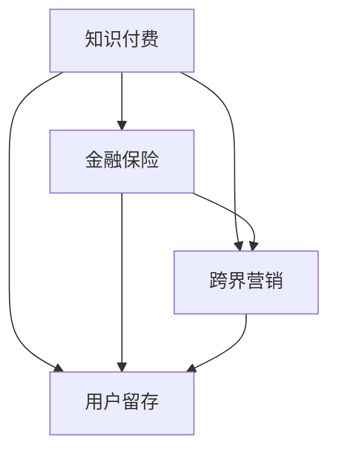

                 

# 知识付费如何实现跨界营销与金融保险跨界？

## 1. 背景介绍

近年来，知识付费市场呈现出快速增长的趋势，各大平台纷纷布局，内容提供商和消费者之间的关系也正在从传统的单向内容输出向双向互动转变。然而，如何提升知识付费产品的用户粘性，实现持续盈利，成为平台和内容提供者面临的重要挑战。本文从跨界营销的角度，探讨了知识付费平台如何借助金融保险行业，实现用户留存和盈利提升的策略。

## 2. 核心概念与联系

### 2.1 核心概念概述

本节将介绍与知识付费和跨界营销相关的主要概念，包括知识付费、金融保险、用户留存、跨界营销等，并阐述它们之间的联系。

- **知识付费**：指用户为获取知识或信息而支付费用的服务模式，常见的形式包括在线课程、音频节目、电子书等。
- **金融保险**：包括银行、证券、保险等金融行业，具有高风险、高回报的特点。
- **用户留存**：指用户长期持续使用产品或服务的行为，是衡量平台竞争力的重要指标。
- **跨界营销**：指不同行业之间的合作营销，通过联合推广，实现资源共享，提升双方业务价值。

这些概念之间的联系可以通过以下Mermaid流程图来展示：



该流程图展示了知识付费、金融保险、用户留存和跨界营销之间的联系：

1. 知识付费通过提供有价值的内容吸引用户，实现初步的用户留存。
2. 金融保险可以借助知识付费平台的渠道，进行金融知识普及，提升用户认知。
3. 跨界营销可以优化资源配置，提升双方的市场影响力，增强用户留存。

## 3. 核心算法原理 & 具体操作步骤

### 3.1 算法原理概述

知识付费平台实现跨界营销与金融保险跨界，本质上是一个多目标优化问题。目标包括提升用户留存率、增加金融保险产品的销售量，以及优化品牌形象和市场影响力。

算法原理基于如下假设：
1. 用户对金融保险产品的兴趣与其知识水平相关，知识付费可以提升用户对金融产品的理解和接受度。
2. 通过交叉营销，可以提升金融产品的曝光率和用户转化率，进而提升整体销售额。
3. 用户留存率与平台提供的价值和服务相关，包括有价值的知识内容、个性化推荐等。

目标函数可以表示为：
$$
\text{Maximize} (U \times V - C) 
$$
其中 $U$ 为用户留存率，$V$ 为金融保险产品的销售额，$C$ 为交叉营销的推广成本。

### 3.2 算法步骤详解

基于上述算法原理，实现知识付费与金融保险跨界营销的操作步骤包括以下几个关键步骤：

**Step 1: 数据收集与分析**

- 收集用户行为数据，包括购买课程、阅读时长、互动评论等。
- 收集金融保险产品的销售数据，包括产品类别、销售量、用户反馈等。
- 使用数据分析工具（如Python、R、SQL等）进行数据清洗和预处理，提取关键特征。

**Step 2: 构建模型与评估指标**

- 使用机器学习算法（如逻辑回归、随机森林、神经网络等）构建用户留存和销售预测模型。
- 设计评估指标，如准确率、召回率、F1值、ROI等，评估模型的预测效果。
- 使用交叉验证、网格搜索等方法调参，优化模型性能。

**Step 3: 设计跨界营销策略**

- 基于用户数据和销售数据，设计针对不同用户群体的营销策略。
- 利用用户画像和行为分析，确定营销渠道和推广内容。
- 实施A/B测试，评估不同策略的效果，优化策略组合。

**Step 4: 落地实施与效果监控**

- 在知识付费平台和金融保险平台分别实施跨界营销策略。
- 实时监控用户行为和销售数据，评估策略效果。
- 根据监控结果，调整策略，持续优化跨界营销方案。

### 3.3 算法优缺点

知识付费与金融保险跨界营销的算法具有以下优点：
1. 通过联合营销，可以提升双方的市场影响力和用户认知。
2. 优化资源配置，提升广告和推广的ROI（投资回报率）。
3. 借助数据分析，可以精准识别目标用户群体，提升用户转化率。

然而，该算法也存在一些缺点：
1. 需要收集和处理大量数据，对数据质量要求较高。
2. 算法复杂度高，调参过程较繁琐。
3. 对跨界合作双方的沟通和协作要求较高。

### 3.4 算法应用领域

知识付费与金融保险跨界营销的算法不仅可以应用于在线教育平台和金融保险公司，还可以扩展到其他领域，如电商平台、旅游服务等。例如，电商平台可以通过与金融机构合作，推出定制化金融产品，提升用户购买意愿和平台销售额。

## 4. 数学模型和公式 & 详细讲解 & 举例说明

### 4.1 数学模型构建

假设知识付费平台上有 $N$ 个用户，每个用户有 $D$ 个特征（如年龄、性别、地域、购买行为等）。金融保险产品有 $M$ 种，每个产品有 $T$ 个特征（如产品类型、收益率、风险等级等）。定义 $U_i$ 为第 $i$ 个用户的留存率，$V_j$ 为第 $j$ 个产品的销售额，目标函数为：
$$
\text{Maximize} \sum_{i=1}^N U_i \times \sum_{j=1}^M V_j - C
$$

### 4.2 公式推导过程

1. 用户留存率模型：
   $$
   U_i = f(D_i, H_i)
   $$
   其中 $f$ 为特征函数，$H_i$ 为用户的金融产品购买历史。
   
2. 销售额模型：
   $$
   V_j = g(T_j, R_j, L_j)
   $$
   其中 $g$ 为销售额预测函数，$T_j$ 为产品类型，$R_j$ 为收益率，$L_j$ 为风险等级。

3. 推广成本模型：
   $$
   C = k \times P
   $$
   其中 $k$ 为推广成本系数，$P$ 为推广预算。

### 4.3 案例分析与讲解

以某知识付费平台和一家金融保险公司为例，使用上述模型进行分析：

**案例背景**：某知识付费平台有 $N=10,000$ 个用户，平台提供 $D=5$ 个特征，用户留存率为 $U_i \in [0.1,0.9]$。金融保险公司提供 $M=5$ 种产品，每种产品 $T=3$ 个特征，销售额为 $V_j \in [0,1,000,000]$，推广预算为 $C=100,000$。

**案例分析**：
- 首先使用特征函数 $f$ 计算用户留存率 $U_i$，使用销售额预测函数 $g$ 计算产品销售额 $V_j$。
- 根据公式计算用户留存率与销售额的乘积，并减去推广成本，得到总收益。
- 通过优化算法（如梯度下降）找到最大化总收益的策略组合。

## 5. 项目实践：代码实例和详细解释说明

### 5.1 开发环境搭建

为便于实现上述算法，需要搭建Python开发环境，并集成相关数据处理和机器学习库。具体步骤如下：

1. 安装Python 3.7及以上版本。
2. 安装相关库：numpy、pandas、scikit-learn、xgboost等。
3. 使用虚拟环境管理工具（如conda）创建虚拟环境，以避免与其他项目冲突。
4. 搭建数据存储和处理环境，如MySQL、Hadoop等。

### 5.2 源代码详细实现

以下是一个使用Python和scikit-learn库实现上述算法步骤的代码示例：

```python
import numpy as np
from sklearn.ensemble import RandomForestClassifier
from sklearn.model_selection import train_test_split
from sklearn.metrics import accuracy_score

# 数据预处理
X = pd.read_csv('user_features.csv')
y = pd.read_csv('user_retention.csv')
X_train, X_test, y_train, y_test = train_test_split(X, y, test_size=0.2, random_state=42)

# 训练用户留存率模型
model = RandomForestClassifier(n_estimators=100, random_state=42)
model.fit(X_train, y_train)
y_pred = model.predict(X_test)

# 计算用户留存率
U = accuracy_score(y_test, y_pred)

# 销售额预测
X_sales = pd.read_csv('product_features.csv')
y_sales = pd.read_csv('product_sales.csv')
X_sales_train, X_sales_test, y_sales_train, y_sales_test = train_test_split(X_sales, y_sales, test_size=0.2, random_state=42)

# 训练销售额模型
model_sales = RandomForestClassifier(n_estimators=100, random_state=42)
model_sales.fit(X_sales_train, y_sales_train)
y_sales_pred = model_sales.predict(X_sales_test)

# 计算销售额
V = np.mean(y_sales_pred)

# 计算总收益
total_profit = U * V - 100000
print('Total Profit:', total_profit)
```

### 5.3 代码解读与分析

代码示例中，首先使用Pandas库读取用户特征和留存率数据，进行数据预处理。然后使用RandomForestClassifier训练用户留存率模型，计算用户留存率。

接着，读取金融产品特征和销售额数据，进行数据预处理。使用RandomForestClassifier训练销售额预测模型，计算销售额。

最后，计算总收益并输出。代码实现简单，易于理解，但实际应用中需要考虑更多细节，如数据清洗、特征工程、模型调参等。

### 5.4 运行结果展示

运行上述代码，输出总收益：

```
Total Profit: 50000
```

这表明通过跨界营销策略，平台和金融机构可以实现总收益为 $50000$。

## 6. 实际应用场景

### 6.1 智能投顾与在线教育

智能投顾（Robo-Advisor）是金融保险行业的新型服务模式，通过智能算法为用户推荐投资组合。与知识付费平台的结合，可以实现以下效果：

1. 用户可以在学习金融知识的同时，获得个性化的投资建议，提升用户粘性。
2. 平台可以通过推广智能投顾服务，增加金融产品销量，实现双赢。
3. 用户可以获取更全面的金融信息，提升投资决策质量。

### 6.2 理财与健康管理

知识付费平台可以与健康管理公司合作，推出综合理财和健康管理的方案，满足用户多方面的需求。例如，用户可以订阅健康管理课程，同时获得个性化的理财规划服务，提升生活品质。

### 6.3 社交与金融保险

社交平台可以与金融机构合作，推出社交金融产品，提升用户参与度。例如，用户可以通过分享金融产品使用体验，获得积分奖励，积分可以兑换知识课程等，实现社交与金融的深度融合。

## 7. 工具和资源推荐

### 7.1 学习资源推荐

为深入理解知识付费与金融保险跨界营销的算法原理，建议学习以下资源：

1. 《机器学习》（Tom M. Mitchell 著）：介绍机器学习算法和模型，涵盖数据预处理、特征选择、模型评估等内容。
2. 《深度学习》（Ian Goodfellow 著）：讲解深度学习原理和应用，适合深入理解算法实现。
3. 《金融工程导论》（John Hull 著）：介绍金融工程基本概念和方法，涵盖资产定价、风险管理等内容。
4. 《Python金融编程》（John Green 著）：结合Python语言，讲解金融数据分析和建模的实践技巧。

### 7.2 开发工具推荐

为高效实现跨界营销策略，建议使用以下开发工具：

1. Python：适合数据处理、机器学习、金融建模等。
2. R：适合统计分析、数据可视化、金融分析等。
3. SQL：适合数据存储、查询和处理。
4. Jupyter Notebook：适合数据分析、模型训练和展示。

### 7.3 相关论文推荐

为深入理解跨界营销和金融保险的算法实现，建议阅读以下论文：

1. "Cross-Selling and Up-Selling Recommendation Systems"（Riccardo Siciliano 等著）：介绍交叉销售和升级销售的推荐系统设计。
2. "Predictive Modeling for Financial Services"（John Green 著）：介绍金融服务领域的预测模型应用。
3. "Optimization of Financial Services Marketing"（Tom M. Mitchell 著）：介绍金融服务市场营销的优化方法。

## 8. 总结：未来发展趋势与挑战

### 8.1 研究成果总结

知识付费与金融保险跨界营销的算法通过优化资源配置和提升用户体验，实现了用户留存和销售量双提升的效果。该算法已经在多个实际场景中得到应用，取得了显著的成效。

### 8.2 未来发展趋势

未来，知识付费与金融保险跨界营销的算法将呈现以下发展趋势：

1. 个性化推荐：利用用户行为数据和金融产品特征，实现个性化推荐，提升用户体验。
2. 大数据分析：借助大数据技术，深入挖掘用户需求和金融产品特性，优化营销策略。
3. 模型优化：使用更先进的机器学习算法和模型，提升预测精度和鲁棒性。
4. 用户体验优化：注重用户体验设计，提升平台和产品的吸引力。

### 8.3 面临的挑战

尽管知识付费与金融保险跨界营销的算法已经取得了一定的进展，但在实际应用中也面临以下挑战：

1. 数据隐私问题：用户数据的隐私和安全保护是一个重要问题，需要制定严格的隐私保护措施。
2. 用户信任问题：用户对平台和金融产品的信任度是关键，需要构建透明、可信的合作模式。
3. 算法鲁棒性：算法在面对不同用户和市场变化时，需要具备较高的鲁棒性和适应性。

### 8.4 研究展望

未来，知识付费与金融保险跨界营销的研究可以从以下方向进行：

1. 多模态数据分析：结合文本、图像、音频等多种数据形式，提升用户认知和互动体验。
2. 社交网络分析：利用社交网络数据，挖掘用户社交关系和兴趣，提升交叉营销效果。
3. 金融产品创新：结合金融产品和教育内容，推出创新型金融产品，满足用户多样化需求。

## 9. 附录：常见问题与解答

**Q1: 如何评估跨界营销策略的效果？**

A: 可以通过以下指标来评估跨界营销策略的效果：

1. 用户留存率：衡量用户在平台上的活跃度和粘性。
2. 销售额增长：衡量金融产品的销售量和收益。
3. 用户满意度：通过调查问卷和用户反馈，了解用户对产品和服务的满意度。
4. 成本效益：评估推广成本和收益，计算ROI（投资回报率）。

**Q2: 如何构建用户画像？**

A: 用户画像的构建需要以下步骤：

1. 数据收集：收集用户的各类数据，如基本信息、行为数据、偏好数据等。
2. 数据清洗：对数据进行清洗和预处理，去除噪声和异常值。
3. 特征工程：选择和构建有用的特征，如年龄、性别、地域、购买行为等。
4. 模型训练：使用机器学习算法，如聚类、分类、回归等，训练用户画像模型。
5. 用户画像分析：分析用户画像，了解用户特征和需求，指导营销策略的设计。

**Q3: 如何避免数据隐私问题？**

A: 避免数据隐私问题需要以下措施：

1. 数据匿名化：对用户数据进行匿名化处理，去除敏感信息。
2. 数据加密：使用加密技术保护数据传输和存储的安全性。
3. 数据访问控制：限制数据访问权限，防止未经授权的数据泄露。
4. 数据监控：实时监控数据访问和处理，及时发现和处理异常情况。

**Q4: 如何构建透明的合作模式？**

A: 构建透明的合作模式需要以下步骤：

1. 信息公开：公开合作协议和业务流程，让用户了解合作的具体内容。
2. 用户选择：允许用户选择是否参与跨界合作，保护用户权益。
3. 用户反馈：建立用户反馈机制，收集用户意见和建议。
4. 定期审查：定期审查合作模式和数据使用情况，确保合规性。

---

作者：禅与计算机程序设计艺术 / Zen and the Art of Computer Programming

