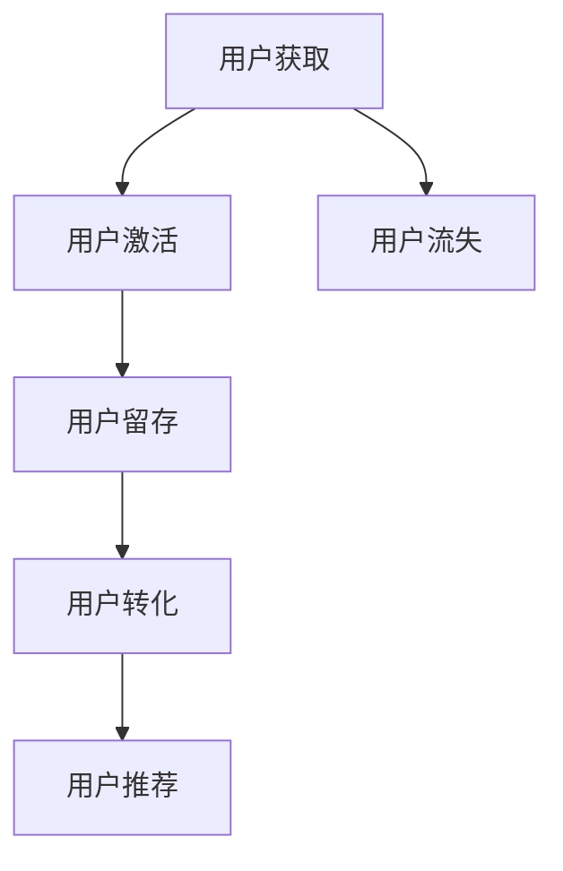

                 

# 知识付费平台的用户增长黑客策略

> 关键词：知识付费, 用户增长, 黑客增长, 用户生命周期, 用户激活, 用户留存, 用户转化

## 1. 背景介绍

### 1.1 问题由来
随着知识付费市场的兴起，越来越多的知识付费平台涌现，但多数平台面临用户增长缓慢、流失率高的挑战。为了应对这些挑战，很多平台开始探索新的增长策略，其中黑客增长（Growth Hacking）方法以其创新、高效的特点，成为平台的主要增长手段。黑客增长方法综合了数据驱动和创意驱动的策略，帮助知识付费平台快速获取用户、提高留存、增加转化，从而实现快速增长。

### 1.2 问题核心关键点
知识付费平台的用户增长黑客策略主要包括以下几个关键点：

- **用户获取**：通过创意化的营销手段吸引新用户注册。
- **用户激活**：通过初期体验优化和个性化推荐提升新用户的粘性。
- **用户留存**：通过精准的数据分析，实现用户行为的预测和干预。
- **用户转化**：通过多层次的会员分级体系，提升用户付费转化率。

本文将系统性地介绍黑客增长的核心策略，并结合实际案例，探讨如何利用数据和创意，实现知识付费平台的用户增长。

## 2. 核心概念与联系

### 2.1 核心概念概述

为更好地理解知识付费平台的用户增长黑客策略，本节将介绍几个密切相关的核心概念：

- **黑客增长（Growth Hacking）**：一种基于数据驱动和创意驱动的策略，通过创新性的手段，快速获取用户并提高用户价值。
- **用户生命周期（User Lifecycle）**：描述用户从首次接触产品到最终流失的整个过程，包括获取、激活、留存、提升和流失五个阶段。
- **用户激活（Acquisition）**：吸引新用户注册并开始使用产品。
- **用户留存（Retention）**：保持用户持续使用产品，避免流失。
- **用户转化（Conversion）**：将用户转化为付费用户，实现商业目标。
- **AARRR模型**：一种经典的增长模型，包括获取（Acquisition）、激活（Activation）、留存（Retention）、提升（Revenue）和推荐（Referral）五个阶段。
- **AIDA模型**：一种经典的营销模型，包括注意（Awareness）、兴趣（Interest）、决策（Desire）和行动（Action）四个阶段。

这些核心概念之间的逻辑关系可以通过以下Mermaid流程图来展示：



这个流程图展示了大用户生命周期管理（User Lifecycle Management）的基本过程，并强调了黑客增长策略的核心价值。

## 3. 核心算法原理 & 具体操作步骤

### 3.1 算法原理概述

黑客增长策略的核心在于利用数据和创意，持续优化用户获取、激活、留存和转化的每一个环节。这一过程包括四个主要步骤：

1. **用户获取**：通过多渠道营销和A/B测试，找出最佳的用户获取渠道和策略。
2. **用户激活**：通过个性化推荐和体验优化，提高新用户的粘性和激活率。
3. **用户留存**：通过数据分析和行为预测，实现对高价值用户的精准干预，降低流失率。
4. **用户转化**：通过多层次会员分级体系和差异化营销，提升用户付费转化率。

### 3.2 算法步骤详解

黑客增长策略的每一步都涉及具体的操作流程，下面将详细介绍每一个步骤的操作细节。

#### 3.2.1 用户获取

用户获取是黑客增长的第一步，其核心在于吸引新用户注册。常见的用户获取策略包括：

1. **内容营销**：通过发布高质量的博客、视频、课程等内容，吸引潜在用户关注。
2. **社交媒体营销**：利用Facebook、微博、微信等平台进行推广，利用病毒式传播效应吸引新用户。
3. **广告投放**：在Google、百度等搜索引擎和社交平台上投放定向广告，吸引有意向的潜在用户。
4. **合作伙伴推广**：与教育机构、企业合作伙伴合作推广，利用其用户基础吸引新用户。
5. **口碑传播**：通过用户推荐和社交分享，形成良好的口碑效应，吸引新用户。

### 3.3 用户激活

用户激活是指将新用户转化为活跃用户。常见的激活策略包括：

1. **个性化推荐**：根据用户兴趣和行为，推荐其感兴趣的内容或课程，提高用户粘性。
2. **引导引导**：通过导流页、视频介绍、引导问答等方式，引导新用户快速上手。
3. **奖励机制**：设置奖励机制，如免费试用、优惠券等，激励用户完成激活步骤。
4. **反馈收集**：通过问卷调查、用户反馈等方式，收集新用户的使用体验，优化产品。

### 3.4 用户留存

用户留存是指保持用户持续使用产品，防止流失。常见的留存策略包括：

1. **定期提醒**：通过邮件、推送等方式，定期提醒用户使用产品，保持活跃。
2. **个性化内容推送**：根据用户兴趣和行为，推送个性化的内容和课程，提升用户粘性。
3. **数据分析**：通过数据分析，预测用户流失行为，实现精准干预。
4. **忠诚计划**：设置会员等级体系，通过积分、折扣等方式激励用户持续使用。

### 3.5 用户转化

用户转化是指将用户转化为付费用户，实现商业目标。常见的转化策略包括：

1. **多层次会员体系**：设计多层次会员体系，如基础会员、高级会员、顶级会员等，根据用户价值提供不同权益。
2. **差异化营销**：根据用户行为和偏好，进行差异化营销，提升用户付费意愿。
3. **优惠券策略**：设置多样化的优惠券，如首次购买优惠、续费折扣等，促进用户付费。
4. **个性化推荐**：根据用户兴趣和行为，推荐适合的付费课程或服务，提升转化率。

### 3.6 算法优缺点

黑客增长策略的优势在于其创新性和高效性，可以快速获取用户并提高用户价值。但同时，也存在一些局限性：

**优点**：

1. **高效性**：通过数据驱动和创意驱动，可以快速实现用户增长。
2. **灵活性**：不断优化和测试新的策略，快速迭代。
3. **可量化**：通过数据分析和A/B测试，可以准确评估策略效果。

**缺点**：

1. **资源投入大**：需要大量的时间和资源进行数据收集、分析和创意设计。
2. **风险高**：创新性策略可能导致短期效果不佳，风险较高。
3. **执行难度大**：需要团队具备多方面的技能，包括数据分析、市场营销、技术开发等。

尽管存在这些局限性，但黑客增长策略已成为知识付费平台实现快速增长的主要手段。未来相关研究的重点在于如何进一步优化策略效果，提高执行效率，降低资源投入。

### 3.7 算法应用领域

黑客增长策略已经广泛应用于知识付费平台的各个环节，包括：

- **内容获取**：通过高质量内容吸引新用户注册。
- **课程推荐**：根据用户兴趣和行为，推荐适合的课程，提高用户粘性。
- **用户留存**：通过数据分析和行为预测，实现用户留存。
- **会员转化**：通过多层次会员体系和差异化营销，提升用户付费转化率。

## 4. 数学模型和公式 & 详细讲解 & 举例说明

### 4.1 数学模型构建

黑客增长策略的核心在于通过数据分析和模型预测，优化用户获取、激活、留存和转化的各个环节。这里以用户留存为例，构建数学模型。

假设用户在某段时间内的行为数据为 $X_1, X_2, ..., X_n$，则可以通过以下步骤构建用户留存模型：

1. **数据预处理**：对原始数据进行清洗和标准化，去除噪声和异常值。
2. **特征工程**：提取有用的特征，如用户活跃度、登录频率、购买行为等。
3. **模型训练**：选择合适的模型，如逻辑回归、决策树、随机森林等，训练用户留存模型。
4. **模型评估**：使用验证集评估模型效果，调整模型参数，优化模型性能。

### 4.2 公式推导过程

以逻辑回归模型为例，其公式为：

$$
P(y=1|X) = \frac{1}{1+e^{-\theta^TX}}
$$

其中，$y=1$ 表示用户会流失，$y=0$ 表示用户不会流失。$\theta$ 为模型的权重向量，$X$ 为用户行为数据。

通过最大化对数似然函数，可以得到逻辑回归模型的最优参数 $\hat{\theta}$：

$$
\hat{\theta} = \arg\max_{\theta} \sum_{i=1}^n \log P(y_i|X_i) - \frac{\lambda}{2}||\theta||^2
$$

其中，$\lambda$ 为正则化系数，$||\theta||^2$ 为权重向量 $\theta$ 的L2范数。

### 4.3 案例分析与讲解

某知识付费平台通过数据挖掘，发现用户流失主要受到以下因素的影响：

1. **用户活跃度**：活跃度低的用户更容易流失。
2. **登录频率**：连续一周内登录次数少于3次的用户更容易流失。
3. **购买行为**：三个月内没有购买的用户更容易流失。

基于以上发现，平台构建了一个逻辑回归模型，预测用户流失概率。模型训练后，平台根据预测结果，对活跃度低、登录频率少和没有购买的用户进行精准干预，提升了用户留存率。

## 5. 项目实践：代码实例和详细解释说明

### 5.1 开发环境搭建

在进行黑客增长策略的实践时，我们需要准备好开发环境。以下是使用Python进行机器学习的开发环境配置流程：

1. 安装Anaconda：从官网下载并安装Anaconda，用于创建独立的Python环境。

2. 创建并激活虚拟环境：
```bash
conda create -n pytorch-env python=3.8 
conda activate pytorch-env
```

3. 安装PyTorch：根据CUDA版本，从官网获取对应的安装命令。例如：
```bash
conda install pytorch torchvision torchaudio cudatoolkit=11.1 -c pytorch -c conda-forge
```

4. 安装Scikit-Learn、Numpy、Pandas等常用工具包：
```bash
pip install numpy pandas scikit-learn matplotlib tqdm jupyter notebook ipython
```

完成上述步骤后，即可在`pytorch-env`环境中开始黑客增长策略的实践。

### 5.2 源代码详细实现

下面以逻辑回归模型为例，给出使用Scikit-Learn库进行用户留存预测的PyTorch代码实现。

首先，定义数据处理函数：

```python
import pandas as pd
from sklearn.model_selection import train_test_split
from sklearn.preprocessing import StandardScaler

def load_data(filename):
    data = pd.read_csv(filename)
    return data.drop('流失', axis=1), data['流失']
    
X, y = load_data('user_behavior.csv')
X_train, X_test, y_train, y_test = train_test_split(X, y, test_size=0.2, random_state=42)
scaler = StandardScaler()
X_train = scaler.fit_transform(X_train)
X_test = scaler.transform(X_test)
```

然后，定义模型和训练函数：

```python
from sklearn.linear_model import LogisticRegression
from sklearn.metrics import accuracy_score

model = LogisticRegression()
model.fit(X_train, y_train)

y_pred = model.predict(X_test)
accuracy = accuracy_score(y_test, y_pred)
print(f"Accuracy: {accuracy:.2f}")
```

最后，启动训练流程并评估模型：

```python
epochs = 100
learning_rate = 0.01

for epoch in range(epochs):
    model.fit(X_train, y_train, learning_rate=learning_rate)
    y_pred = model.predict(X_test)
    accuracy = accuracy_score(y_test, y_pred)
    print(f"Epoch {epoch+1}, accuracy: {accuracy:.2f}")
```

以上即为使用PyTorch和Scikit-Learn库构建逻辑回归模型进行用户留存预测的完整代码实现。可以看到，通过简单的代码实现，我们就能快速构建并评估用户留存模型。

### 5.3 代码解读与分析

让我们再详细解读一下关键代码的实现细节：

**load_data函数**：
- 从CSV文件中读取用户行为数据，并按照流失行为进行标签处理。
- 使用train_test_split函数将数据划分为训练集和测试集，并使用StandardScaler对特征进行标准化处理。

**train_model函数**：
- 定义逻辑回归模型，并使用训练数据拟合模型。
- 使用测试数据评估模型精度，并输出结果。

**训练流程**：
- 定义总的迭代次数和初始学习率，循环迭代训练模型。
- 在每个epoch内，使用学习率更新模型参数，并使用测试集评估模型精度。
- 重复上述步骤，直至模型收敛。

通过上述代码实现，我们能够快速构建并评估用户留存模型，实现对用户流失的预测和干预。

## 6. 实际应用场景

### 6.1 智能推荐系统

知识付费平台可以利用黑客增长策略构建智能推荐系统，提高用户粘性和留存率。通过数据分析和机器学习，平台可以精准地推荐用户感兴趣的内容和课程，从而提升用户满意度和活跃度。

具体而言，平台可以收集用户的历史行为数据，包括浏览记录、购买记录、评分反馈等。通过分析这些数据，平台可以构建用户兴趣模型，实现个性化推荐。同时，平台还可以设置推荐引擎，实时生成推荐内容，提升用户的使用体验。

### 6.2 用户行为分析

黑客增长策略还可以帮助知识付费平台进行用户行为分析，优化产品设计和运营策略。通过数据分析，平台可以了解用户的使用习惯和行为模式，从而实现精准的用户干预和产品优化。

例如，平台可以分析用户流失行为，找出导致用户流失的主要因素，并制定相应的改进措施。平台还可以使用A/B测试，评估不同策略的效果，选择最优方案进行推广。

### 6.3 数据驱动的营销活动

黑客增长策略可以指导知识付费平台进行数据驱动的营销活动，提高用户获取和转化效果。通过数据分析，平台可以找出最佳的营销渠道和策略，实现高效的广告投放和用户获取。

例如，平台可以利用Facebook、微博、微信等社交媒体平台，进行定向广告投放，吸引潜在用户注册。平台还可以设计创意化的广告内容和活动，提高用户参与度和转化率。

## 7. 工具和资源推荐

### 7.1 学习资源推荐

为了帮助开发者系统掌握黑客增长策略的理论基础和实践技巧，这里推荐一些优质的学习资源：

1. **《Growth Hacking》系列博文**：由Growth Hacker专家撰写，介绍黑客增长策略的原理和实践技巧。

2. **Coursera《Growth Hacking and User Acquisition》课程**：斯坦福大学开设的Growth Hacking课程，涵盖Growth Hacking的各个方面。

3. **Google Growth Hacking Toolbox**：Google提供的黑客增长工具箱，包括各种增长工具和策略。

4. **HubSpot Academy**：HubSpot提供的Growth Hacking课程，涵盖从用户获取到留存的各个环节。

通过对这些资源的学习实践，相信你一定能够快速掌握黑客增长策略的精髓，并用于解决实际的增长问题。

### 7.2 开发工具推荐

高效的开发离不开优秀的工具支持。以下是几款用于黑客增长策略开发的常用工具：

1. **PyTorch**：基于Python的开源深度学习框架，适合快速迭代研究。

2. **Scikit-Learn**：Python的机器学习库，提供丰富的机器学习算法和工具。

3. **TensorFlow**：由Google主导开发的开源深度学习框架，适合大规模工程应用。

4. **DataRobot**：自动化机器学习平台，提供可视化的机器学习建模和评估工具。

5. **Tableau**：数据可视化工具，帮助开发者直观地理解数据和模型。

6. **Google Colab**：谷歌提供的在线Jupyter Notebook环境，免费提供GPU/TPU算力，方便开发者快速上手实验。

合理利用这些工具，可以显著提升黑客增长策略的开发效率，加快创新迭代的步伐。

### 7.3 相关论文推荐

黑客增长策略的研究源于学界的持续研究。以下是几篇奠基性的相关论文，推荐阅读：

1. **《Growth Hacking: A New Marketing Discipline》**：论述了黑客增长的概念和应用。

2. **《Growth Hacking Analytics: Measuring the Growth of Online Businesses》**：介绍黑客增长的分析和评估方法。

3. **《Data-Driven Growth Hacking》**：探讨黑客增长中数据驱动策略的应用。

4. **《Growth Hacking: A Field Guide》**：介绍黑客增长的各个环节和策略。

这些论文代表了大黑客增长策略的发展脉络。通过学习这些前沿成果，可以帮助研究者把握学科前进方向，激发更多的创新灵感。

## 8. 总结：未来发展趋势与挑战

### 8.1 总结

本文对知识付费平台的用户增长黑客策略进行了全面系统的介绍。首先阐述了黑客增长策略的研究背景和意义，明确了策略在用户获取、激活、留存和转化各个环节中的核心作用。其次，从原理到实践，详细讲解了黑客增长的核心策略，并结合实际案例，探讨了如何利用数据和创意，实现快速用户增长。

通过本文的系统梳理，可以看到，黑客增长策略在知识付费平台中的应用前景广阔，利用数据驱动和创意驱动的方法，可以快速获取用户、提高用户粘性、提升用户价值，实现平台快速增长。未来，伴随数据技术和创意策略的不断进步，黑客增长策略必将在更多行业领域得到广泛应用，成为实现快速增长的重要手段。

### 8.2 未来发展趋势

展望未来，黑客增长策略将呈现以下几个发展趋势：

1. **数据驱动的创新**：通过更精准的数据分析和机器学习，提升用户获取、激活、留存和转化的效果。
2. **创意驱动的优化**：不断探索新的创意策略和活动，提升用户参与度和满意度。
3. **跨领域的应用**：黑客增长策略将应用于更多领域，如在线教育、电子商务、金融科技等，实现更广泛的增长目标。
4. **智能化和自动化**：通过AI技术和自动化工具，实现更高效的增长管理和决策。

以上趋势凸显了黑客增长策略的强大潜力，未来必将引领知识付费平台和其他行业进入新的增长时代。

### 8.3 面临的挑战

尽管黑客增长策略已经取得了瞩目成就，但在迈向更加智能化、普适化应用的过程中，它仍面临着诸多挑战：

1. **数据隐私和伦理**：黑客增长策略需要大量的用户数据，如何在保障用户隐私的同时，获取有效数据，是重要挑战。
2. **用户体验和满意度**：创意策略需要兼顾用户满意度和体验，避免过度干扰。
3. **市场竞争**：黑客增长策略需要不断创新，以应对市场竞争和用户需求的变化。
4. **资源投入**：黑客增长策略需要大量的时间和资源进行数据收集、分析和创意设计，如何降低资源投入，提高执行效率，是未来需要解决的问题。
5. **策略执行难度**：黑客增长策略需要团队具备多方面的技能，包括数据分析、市场营销、技术开发等，如何提升团队能力，是重要挑战。

这些挑战需要我们在实践中不断探索和改进，才能让黑客增长策略更好地服务于用户增长和平台发展。

### 8.4 研究展望

面对黑客增长策略所面临的种种挑战，未来的研究需要在以下几个方面寻求新的突破：

1. **数据隐私保护**：开发数据隐私保护技术，确保用户数据的匿名化和安全性。
2. **用户体验优化**：通过用户行为分析，提升用户体验和满意度。
3. **多领域应用**：将黑客增长策略应用于更多领域，实现跨领域的增长优化。
4. **智能化决策**：利用AI技术，实现更高效的数据分析和策略决策。

这些研究方向的探索，必将引领黑客增长策略走向更高的台阶，为知识付费平台和其他行业带来更大的增长动力。面向未来，黑客增长策略还需要与其他人工智能技术进行更深入的融合，如自然语言处理、推荐系统、个性化营销等，多路径协同发力，共同推动增长目标的实现。只有勇于创新、敢于突破，才能不断拓展黑客增长策略的边界，让智能技术更好地造福人类社会。

## 9. 附录：常见问题与解答

**Q1：黑客增长策略是否适用于所有知识付费平台？**

A: 黑客增长策略适用于大多数知识付费平台，特别是那些希望快速获取用户和提升用户价值的企业。但需要注意的是，不同的平台可能需要根据自身特点进行策略优化。例如，内容付费平台可能需要更多地关注内容质量和个性化推荐，而教育培训平台可能需要更多地关注用户体验和课程设计。

**Q2：黑客增长策略是否需要大量资金投入？**

A: 黑客增长策略需要一定的资金投入，但相比于传统的广告投放和市场营销，黑客增长策略的投入产出比更高。通过数据驱动和创意驱动的方法，黑客增长策略可以实现更高效的资源利用和更快的增长效果。

**Q3：黑客增长策略是否适用于B2B企业？**

A: 黑客增长策略同样适用于B2B企业。通过数据分析和创意策略，B2B企业可以更好地了解客户需求，提升客户满意度和留存率，从而实现快速增长。例如，利用客户行为分析，B2B企业可以优化销售流程和产品设计，提升客户转化率。

**Q4：黑客增长策略是否需要持续优化？**

A: 是的，黑客增长策略需要持续优化和迭代。市场环境和用户需求是动态变化的，只有不断优化策略，才能跟上市场节奏，实现持续增长。建议定期进行策略评估和效果分析，及时调整和优化策略。

**Q5：黑客增长策略是否需要跨部门协作？**

A: 是的，黑客增长策略需要跨部门协作。数据分析、市场营销、技术开发等各个环节都需要协同工作，才能实现最优的效果。建议建立专门的增长团队，负责策略制定和执行，确保各个环节的协调一致。

这些问题的解答，希望能帮助你更好地理解黑客增长策略，并在实践中灵活运用。通过持续优化和跨部门协作，相信黑客增长策略必将成为知识付费平台实现快速增长的重要手段。

