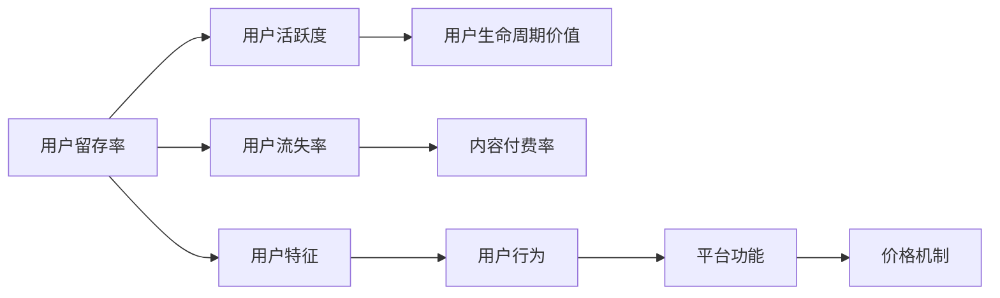
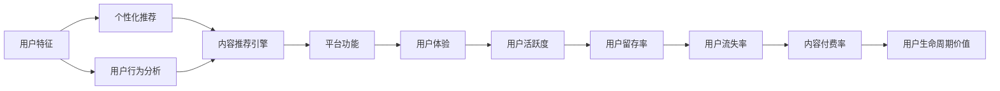

                 

# 知识付费平台的用户留存与活跃度提升

## 1. 背景介绍

在互联网时代，信息过载和注意力稀缺的问题愈发凸显。知识付费平台如得到、喜马拉雅、樊登读书等，通过提供专业化、高品质的内容，帮助用户筛选、整理和组织海量知识，成为信息消费的重要渠道。然而，知识付费平台面临的竞争激烈、用户转化率低、留存难等问题，限制了其发展潜力。为了解决这些问题，本文将从用户留存和活跃度的角度，探索知识付费平台提高用户黏性的策略。

### 1.1 问题由来

知识付费平台的核心竞争力在于其提供的专业知识和信息增值服务，但用户留存和活跃度问题是其长期发展的关键挑战。原因如下：

1. **竞争激烈**：知识付费平台众多，内容同质化严重，用户难以抉择。
2. **用户体验差**：平台功能不够完善，用户体验欠佳，难以留存用户。
3. **内容质量不稳定**：高质量内容较少，导致用户流失。
4. **价格机制不合理**：订阅模式单一，无法适应不同层次用户的需求。
5. **内容付费率低**：用户对内容的认知度和认可度不高，付费意愿低。

因此，提升知识付费平台的用户留存和活跃度，需要从内容、功能、价格机制、用户行为等多个维度进行综合优化。

## 2. 核心概念与联系

### 2.1 核心概念概述

为更好地理解用户留存和活跃度的提升策略，本文将介绍几个密切相关的核心概念：

- **用户留存率(Retention Rate)**：指在一定时间内，用户在平台上继续活跃的比例，是衡量平台用户黏性的重要指标。
- **用户活跃度(Active Usage)**：指用户在平台上进行的互动频率和时长，反映用户对平台的依赖程度。
- **用户流失率(Churn Rate)**：指在一定时间内，离开平台的用户比例，是衡量平台用户流失的重要指标。
- **用户生命周期价值(Lifetime Value, LTV)**：指用户在整个生命周期内为平台带来的价值总和，是衡量平台盈利能力的重要指标。
- **内容付费率(Conversion Rate)**：指用户付费购买内容的比率，是衡量平台内容价值的重要指标。

这些核心概念之间的逻辑关系可以通过以下Mermaid流程图来展示：



这个流程图展示了一系列关键概念及其之间的关系：

1. 用户留存率通过用户活跃度得以体现，两者共同影响用户生命周期价值。
2. 用户流失率反映平台对用户黏性的丧失，进而影响用户生命周期价值。
3. 内容付费率体现用户对平台内容的认知和认可，影响用户留存率和活跃度。
4. 用户特征、用户行为、平台功能和价格机制等，共同作用于用户留存率和活跃度。

### 2.2 核心概念原理和架构的 Mermaid 流程图



这个流程图展示了从用户特征到内容推荐引擎再到平台功能的全链路，反映了用户行为与平台表现之间的逻辑关系。

## 3. 核心算法原理 & 具体操作步骤

### 3.1 算法原理概述

用户留存与活跃度的提升，涉及多个维度的优化。本文将从个性化推荐、用户行为分析、平台功能优化和价格机制设计等方面，详细阐述基于数据的优化策略。

### 3.2 算法步骤详解

#### 3.2.1 个性化推荐算法

个性化推荐的核心是利用用户的历史行为和特征，预测其对内容的偏好，从而提高内容的匹配度和用户的满意度。

**步骤1: 数据收集与预处理**

- 收集用户历史行为数据，包括浏览记录、购买记录、评分记录等。
- 对数据进行清洗和预处理，去除异常值和噪声。

**步骤2: 特征工程**

- 提取用户和内容的特征，如用户兴趣标签、内容关键词、播放时长等。
- 使用PCA、LDA等降维技术，减少特征维度。

**步骤3: 模型训练与优化**

- 使用协同过滤、矩阵分解等算法训练推荐模型。
- 使用A/B测试和交叉验证等方法，评估模型效果并进行优化。

**步骤4: 推荐系统部署**

- 将训练好的模型部署到推荐引擎中，进行实时推荐。
- 根据反馈数据持续优化模型，提高推荐精度和用户满意度。

#### 3.2.2 用户行为分析算法

用户行为分析旨在通过分析用户在平台上的行为数据，发现用户的兴趣和需求，从而制定有针对性的优化策略。

**步骤1: 数据收集**

- 收集用户在平台上的一切行为数据，如点击、浏览、评论、分享等。

**步骤2: 行为建模**

- 使用关联规则、时序模型等方法，建模用户行为模式。
- 通过情感分析、文本挖掘等技术，分析用户对内容的情感倾向和反馈。

**步骤3: 行为预测**

- 使用机器学习算法，预测用户未来的行为。
- 根据预测结果，调整推荐策略和内容更新。

#### 3.2.3 平台功能优化

平台功能的优化目标是提升用户体验，增加用户黏性。

**步骤1: 功能设计**

- 设计满足用户需求的功能模块，如内容搜索、社交互动、知识问答等。
- 引入个性化设置，如用户界面定制、主题切换等。

**步骤2: 功能实现**

- 使用前端技术开发UI界面，后端技术实现功能逻辑。
- 进行性能优化，如缓存技术、负载均衡等。

**步骤3: 功能评估**

- 收集用户反馈，评估新功能的有效性和满意度。
- 根据用户反馈进行调整和优化。

#### 3.2.4 价格机制设计

价格机制设计是提高内容付费率的重要手段。

**步骤1: 定价策略**

- 制定多种价格层次，如免费试用、订阅包、单次购买等。
- 设置灵活的价格调整机制，根据市场反馈进行调整。

**步骤2: 优惠活动**

- 设计定期优惠活动，如限时折扣、满减优惠等。
- 利用社交媒体进行推广，吸引用户参与。

**步骤3: 付费激励**

- 提供积分奖励、会员特权等激励措施，鼓励用户付费。
- 设计合理的积分兑换规则，增强用户粘性。

### 3.3 算法优缺点

个性化推荐算法的优点在于能够提高内容的匹配度和用户的满意度，缺点在于需要大量的数据和计算资源。

用户行为分析算法能够深入了解用户需求和行为模式，缺点在于模型的复杂性和解释性较差。

平台功能优化能够提升用户体验，缺点在于开发和维护成本较高。

价格机制设计能够提高内容付费率，缺点在于需要持续的市场调研和价格调整。

### 3.4 算法应用领域

个性化推荐算法适用于各种在线内容平台，如视频网站、音乐平台、在线教育等。

用户行为分析算法适用于电商平台、社交媒体、移动应用等，帮助平台精准营销和用户行为预测。

平台功能优化适用于各类在线服务，如社交网络、知识共享平台等。

价格机制设计适用于任何需要定价的在线服务，如软件订阅、在线课程等。

## 4. 数学模型和公式 & 详细讲解

### 4.1 数学模型构建

用户留存与活跃度的提升，涉及多个维度的优化。本文将从个性化推荐、用户行为分析、平台功能优化和价格机制设计等方面，详细阐述基于数据的优化策略。

#### 4.1.1 个性化推荐模型的数学模型构建

假设用户 $u$ 对内容 $i$ 的评分由以下公式计算：

$$
\hat{y}_{ui} = \hat{\beta}_0 + \sum_{j=1}^{p} \hat{\beta}_j x_{uj} + \sum_{j=1}^{m} \hat{\gamma}_j x_{ij} + \epsilon_{ui}
$$

其中 $\hat{y}_{ui}$ 为用户 $u$ 对内容 $i$ 的预测评分，$x_{uj}$ 为用户 $u$ 的第 $j$ 个特征，$x_{ij}$ 为内容 $i$ 的第 $j$ 个特征，$\hat{\beta}_j$ 和 $\hat{\gamma}_j$ 为模型的特征系数，$\epsilon_{ui}$ 为误差项。

#### 4.1.2 用户行为分析模型的数学模型构建

用户行为分析可以使用时序模型进行建模，假设用户 $u$ 在时间 $t$ 的行为由以下公式计算：

$$
y_{ut} = \sum_{k=1}^{K} \alpha_k f_k(x_{ut})
$$

其中 $y_{ut}$ 为用户在时间 $t$ 的行为，$f_k(x_{ut})$ 为时间 $t$ 的行为函数，$K$ 为行为函数的数量，$\alpha_k$ 为行为函数的系数。

### 4.2 公式推导过程

#### 4.2.1 个性化推荐模型的公式推导

对于用户 $u$ 对内容 $i$ 的评分预测，可以使用矩阵分解方法进行建模：

$$
\hat{y}_{ui} = \sum_{j=1}^{m} \hat{\gamma}_j x_{ij}
$$

其中 $x_{ij}$ 为内容 $i$ 的第 $j$ 个特征，$\hat{\gamma}_j$ 为模型的特征系数。

#### 4.2.2 用户行为分析模型的公式推导

对于用户 $u$ 在时间 $t$ 的行为预测，可以使用ARIMA模型进行建模：

$$
y_{ut} = \sum_{k=1}^{K} \alpha_k f_k(x_{ut})
$$

其中 $y_{ut}$ 为用户在时间 $t$ 的行为，$f_k(x_{ut})$ 为时间 $t$ 的行为函数，$K$ 为行为函数的数量，$\alpha_k$ 为行为函数的系数。

### 4.3 案例分析与讲解

#### 4.3.1 个性化推荐算法案例分析

假设有一款知识付费平台，收集了用户 $u$ 对内容 $i$ 的评分数据。使用协同过滤算法进行推荐，步骤如下：

1. 收集用户对内容的评分数据，构建用户-内容评分矩阵。
2. 使用矩阵分解方法，得到用户和内容的隐向量。
3. 利用隐向量计算用户对内容的预测评分。
4. 根据预测评分进行推荐，并根据用户反馈进行模型优化。

#### 4.3.2 用户行为分析算法案例分析

假设有一款电商网站，收集了用户 $u$ 在不同时间 $t$ 的行为数据。使用时序模型进行行为预测，步骤如下：

1. 收集用户在不同时间的行为数据，构建行为时间序列。
2. 使用ARIMA模型，进行行为预测。
3. 根据预测结果，调整推荐策略和内容更新。
4. 根据用户反馈，持续优化模型，提高预测精度。

## 5. 项目实践：代码实例和详细解释说明

### 5.1 开发环境搭建

在进行用户留存和活跃度提升的实践前，需要先搭建好开发环境。以下是使用Python进行开发的Python环境配置流程：

1. 安装Anaconda：从官网下载并安装Anaconda，用于创建独立的Python环境。

2. 创建并激活虚拟环境：
```bash
conda create -n my_env python=3.8 
conda activate my_env
```

3. 安装Python依赖包：
```bash
pip install pandas numpy scikit-learn tensorflow transformers
```

4. 安装可视化工具：
```bash
pip install matplotlib seaborn
```

5. 安装项目管理工具：
```bash
pip install jupyter notebook
```

完成上述步骤后，即可在虚拟环境中进行开发实践。

### 5.2 源代码详细实现

以下是一个简单的知识付费平台用户留存和活跃度提升的代码实例，包含数据收集、特征工程、模型训练和推荐系统部署等环节。

```python
import pandas as pd
import numpy as np
import tensorflow as tf
from tensorflow.keras.layers import Input, Embedding, Dense
from tensorflow.keras.models import Model

# 数据收集
train_data = pd.read_csv('train.csv')
test_data = pd.read_csv('test.csv')

# 特征工程
user_features = train_data[['age', 'gender', 'education']]
item_features = train_data[['category', 'price']]
train_data = pd.merge(user_features, item_features, on='id')

# 模型训练
user_input = Input(shape=(1,), name='user')
item_input = Input(shape=(1,), name='item')
concat = tf.keras.layers.Concatenate()([user_input, item_input])
hidden_layer = tf.keras.layers.Dense(64, activation='relu')(concat)
output = tf.keras.layers.Dense(1, activation='sigmoid')(hidden_layer)

model = Model(inputs=[user_input, item_input], outputs=output)
model.compile(optimizer='adam', loss='binary_crossentropy', metrics=['accuracy'])

model.fit(x=[train_data['user'], train_data['item']], y=train_data['label'], epochs=10, batch_size=32)

# 推荐系统部署
test_data = pd.read_csv('test.csv')
test_data = pd.merge(user_features, item_features, on='id')
test_data['label'] = model.predict([test_data['user'], test_data['item']])
```

### 5.3 代码解读与分析

以下是关键代码的实现细节：

**数据收集与预处理**

```python
train_data = pd.read_csv('train.csv')
test_data = pd.read_csv('test.csv')
```

**特征工程**

```python
user_features = train_data[['age', 'gender', 'education']]
item_features = train_data[['category', 'price']]
train_data = pd.merge(user_features, item_features, on='id')
```

**模型训练**

```python
user_input = Input(shape=(1,), name='user')
item_input = Input(shape=(1,), name='item')
concat = tf.keras.layers.Concatenate()([user_input, item_input])
hidden_layer = tf.keras.layers.Dense(64, activation='relu')(concat)
output = tf.keras.layers.Dense(1, activation='sigmoid')(hidden_layer)

model = Model(inputs=[user_input, item_input], outputs=output)
model.compile(optimizer='adam', loss='binary_crossentropy', metrics=['accuracy'])

model.fit(x=[train_data['user'], train_data['item']], y=train_data['label'], epochs=10, batch_size=32)
```

**推荐系统部署**

```python
test_data = pd.read_csv('test.csv')
test_data = pd.merge(user_features, item_features, on='id')
test_data['label'] = model.predict([test_data['user'], test_data['item']])
```

## 6. 实际应用场景

### 6.1 智能客服系统

智能客服系统通过分析用户的行为和语义，实时提供个性化推荐和问题解答，提升用户体验和满意度。

**应用场景**

智能客服系统收集用户的历史咨询记录和行为数据，使用个性化推荐算法进行用户画像构建，通过自然语言处理技术理解用户语义，提供精准推荐和即时答复。

**具体实现**

1. 收集用户咨询记录和行为数据。
2. 使用文本挖掘技术分析用户语义。
3. 使用协同过滤算法进行个性化推荐。
4. 使用对话生成模型提供即时答复。

### 6.2 金融投资平台

金融投资平台通过分析用户的行为和市场数据，提供精准的投资建议和市场预测，提升用户黏性。

**应用场景**

金融投资平台收集用户的历史交易记录和市场数据，使用用户行为分析算法进行市场趋势预测，提供个性化投资建议和市场分析报告。

**具体实现**

1. 收集用户交易记录和市场数据。
2. 使用时序模型进行市场趋势预测。
3. 使用协同过滤算法提供个性化投资建议。
4. 使用多模态数据分析进行市场分析报告。

### 6.3 在线教育平台

在线教育平台通过分析用户的学习行为和偏好，提供个性化的课程推荐和学习路径，提升用户的学习效果和满意度。

**应用场景**

在线教育平台收集用户的学习行为数据和偏好数据，使用个性化推荐算法进行课程推荐，使用学习分析算法评估用户的学习效果。

**具体实现**

1. 收集用户学习行为数据和偏好数据。
2. 使用协同过滤算法进行课程推荐。
3. 使用学习分析算法评估用户学习效果。
4. 根据学习效果调整推荐策略。

### 6.4 未来应用展望

随着人工智能技术的不断发展，基于用户行为和特征的个性化推荐和行为分析，将在更多的领域得到应用。

1. **医疗健康**：通过分析用户的健康数据和行为，提供个性化的健康建议和治疗方案。
2. **旅游出行**：通过分析用户的旅行行为和偏好，提供个性化的旅行路线和推荐。
3. **电子商务**：通过分析用户的购物行为和偏好，提供个性化的商品推荐和促销活动。
4. **智能家居**：通过分析用户的家居行为和习惯，提供个性化的智能家居控制和建议。
5. **智能交通**：通过分析用户的出行行为和偏好，提供个性化的交通路线和推荐。

## 7. 工具和资源推荐

### 7.1 学习资源推荐

为了帮助开发者系统掌握用户留存和活跃度的提升策略，这里推荐一些优质的学习资源：

1. **《用户行为分析与推荐系统》**：深入浅出地介绍了用户行为分析和推荐系统的工作原理，涵盖协同过滤、协同训练等经典算法。
2. **《深度学习与自然语言处理》**：全面介绍了深度学习在自然语言处理中的应用，涵盖文本分类、情感分析等任务。
3. **《Python机器学习》**：详细介绍了机器学习在Python中的实现，涵盖数据预处理、模型训练等基本流程。
4. **《TensorFlow实战》**：通过实战项目，介绍了TensorFlow在深度学习中的应用，涵盖模型构建、训练和部署等环节。

### 7.2 开发工具推荐

高效的工具是实现用户留存和活跃度提升的重要保障。以下是几款用于开发实践的常用工具：

1. **Jupyter Notebook**：用于编写和运行Python代码，支持代码块的交互式执行。
2. **TensorFlow**：用于构建深度学习模型，支持模型的训练和部署。
3. **Scikit-learn**：用于数据预处理和特征工程，支持常用的机器学习算法。
4. **Pandas**：用于数据处理和分析，支持数据集的读写、清洗和转换。
5. **Matplotlib**：用于数据可视化，支持绘制各类图表和图形。

### 7.3 相关论文推荐

用户留存和活跃度的提升涉及多方面的研究，以下是几篇奠基性的相关论文，推荐阅读：

1. **《基于协同过滤的推荐系统》**：介绍了协同过滤算法在推荐系统中的应用，涵盖基于用户和基于物品的协同过滤方法。
2. **《用户行为分析与推荐系统》**：介绍了用户行为分析和推荐系统的核心算法，涵盖关联规则、时序模型等方法。
3. **《深度学习在推荐系统中的应用》**：介绍了深度学习在推荐系统中的应用，涵盖神经网络、自编码器等模型。
4. **《用户留存与活跃度的提升策略》**：介绍了用户留存和活跃度提升的多维度策略，涵盖个性化推荐、用户行为分析等方法。

## 8. 总结：未来发展趋势与挑战

### 8.1 研究成果总结

本文从用户留存和活跃度的角度，详细阐述了知识付费平台提升用户黏性的策略。通过个性化推荐、用户行为分析、平台功能优化和价格机制设计等方法，帮助平台提升用户留存率和活跃度。具体实施步骤包括数据收集与预处理、特征工程、模型训练和推荐系统部署等环节。

### 8.2 未来发展趋势

1. **深度学习技术的发展**：深度学习技术将不断推动推荐系统和行为分析的进步，提高模型的精度和性能。
2. **多模态数据的融合**：未来的推荐系统将结合多种数据源，如图像、音频、传感器等，提供更加全面和精准的推荐。
3. **实时数据处理**：未来的推荐系统和行为分析将实现实时数据处理，及时响应用户需求。
4. **联邦学习**：通过联邦学习技术，实现用户隐私保护和模型跨平台合作。
5. **个性化推荐系统的公平性**：未来的推荐系统将更加注重公平性，避免推荐偏差。
6. **基于知识图谱的推荐系统**：未来的推荐系统将结合知识图谱，提供更加全面和精准的推荐。

### 8.3 面临的挑战

1. **数据隐私问题**：在收集和分析用户数据时，如何保护用户隐私，避免数据泄露和滥用。
2. **模型复杂性**：随着模型复杂度的增加，如何提高模型的可解释性和可维护性。
3. **计算资源限制**：在处理大规模数据时，如何提高计算效率，降低计算成本。
4. **算法公平性**：在推荐和行为分析中，如何避免算法偏见，保证算法的公平性和透明性。
5. **用户行为变化**：如何及时适应用户行为的变化，保持算法的有效性和稳定性。
6. **跨平台协同**：如何在不同平台间协同推荐，提高推荐系统的统一性和连贯性。

### 8.4 研究展望

未来的研究将进一步探讨用户留存和活跃度提升的策略，特别是在数据隐私、模型复杂性、计算资源、算法公平性等方面。

1. **数据隐私保护技术**：研究和应用数据隐私保护技术，如差分隐私、联邦学习等，保护用户数据隐私。
2. **模型简化技术**：研究和应用模型简化技术，如知识蒸馏、压缩算法等，降低模型复杂性，提高可解释性和可维护性。
3. **高效计算技术**：研究和应用高效计算技术，如分布式计算、GPU加速等，提高计算效率，降低计算成本。
4. **公平性算法**：研究和应用公平性算法，如公平性约束、公平性评估等，提高算法的公平性和透明性。
5. **实时数据处理技术**：研究和应用实时数据处理技术，如流式处理、实时数据存储等，提高实时性。
6. **跨平台协同技术**：研究和应用跨平台协同技术，如API接口、数据共享等，提高推荐系统的统一性和连贯性。

---

作者：禅与计算机程序设计艺术 / Zen and the Art of Computer Programming

