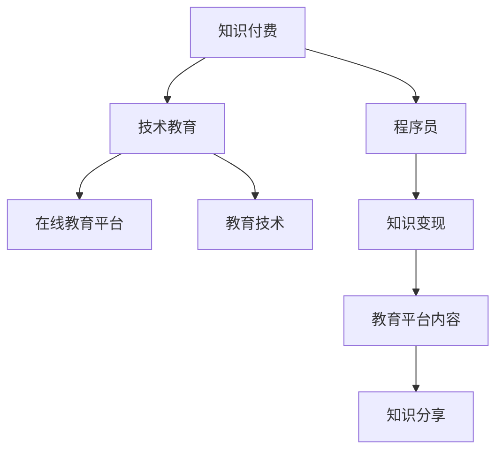

                 

# 知识付费时代程序员的机遇

## 1. 背景介绍

随着互联网技术的迅猛发展，在线教育行业日益火热。知识付费正在成为大众获取新知、提升技能的主要方式之一。作为程序员，我们正处于一个前所未有的机遇时期，无论是职业发展，还是技术突破，都充满了无限可能。

### 1.1 知识付费市场的崛起

知识付费的崛起，源于人们对终身学习的迫切需求。在快速变化的商业环境中，掌握新技能、紧跟技术前沿成为企业竞争的关键。互联网让知识和技能的获取变得前所未有的便捷和高效，人们愿意为学习付费，获取专业指导和高效资源。

### 1.2 程序员的定位与价值

程序员作为技术人才中的佼佼者，以其专业的技术知识和解决问题的能力，成为知识付费平台的重要内容来源。技术学习平台如Coursera、Udemy、Bilibili等，汇聚了大量程序员分享的优质课程，满足用户的学习需求。程序员通过分享知识，不仅能够提升个人品牌，还能直接获得物质回报，实现价值变现。

### 1.3 技术与教育的深度融合

技术改变了教育的形式，学习变得更加个性化和互动化。在线教育平台利用人工智能、大数据等技术，为学习者提供个性化推荐、实时互动、作业批改等服务，极大地提升了学习体验和效果。程序员作为技术开发者，有机会参与到教育产品的开发和优化中，为教育技术的发展做出贡献。

## 2. 核心概念与联系

### 2.1 核心概念概述

- **知识付费**：通过在线教育平台购买专业课程，获取系统化、有针对性的知识学习服务。

- **程序员**：具备计算机编程和软件开发的专门技能和知识的人才，是技术创新的主力军。

- **技术教育**：以技术知识传授和技能提升为主要内容的教育形式，包括编程、算法、人工智能等方向。

- **在线教育平台**：提供线上课程、互动社区、作业批改等服务的教育平台，如Coursera、Udemy、Bilibili等。

- **知识变现**：通过分享专业知识、技能培训、项目经验等，获得物质回报的过程。

- **教育技术**：利用AI、大数据等技术，提升教育质量和效率，改善学习体验。

这些核心概念之间的逻辑关系可以通过以下Mermaid流程图来展示：



这个流程图展示了我們研究的核心概念及其之间的关系：

1. 知识付费平台提供内容。
2. 程序员作为知识创作者。
3. 技术教育是内容的核心。
4. 在线教育平台是知识变现的平台。
5. 教育技术为知识共享提供了技术支撑。

这些概念共同构成了知识付费市场的生态系统，让程序员能够在这个系统中寻找新的机会。

## 3. 核心算法原理 & 具体操作步骤

### 3.1 算法原理概述

知识付费时代的程序员机遇，核心在于利用技术优势，提供高质量的教育内容，实现知识变现。这包括但不限于以下方面：

- 利用数据科学进行课程推荐：通过用户行为数据，推荐用户感兴趣和适合的内容，提高学习效果。
- 利用机器学习进行作业批改：利用NLP、OCR等技术，自动批改作业，提高批改效率和反馈质量。
- 利用区块链技术进行版权保护：利用区块链技术，保护程序员的知识版权，防止内容被恶意复制和传播。
- 利用人工智能进行个性化学习：利用AI技术，根据学习者的背景、需求，定制化推荐学习路径和内容，提高学习效率。

### 3.2 算法步骤详解

下面是一些常见的操作步骤：

1. **用户画像构建**：根据用户的历史行为数据，构建用户画像，包括兴趣、水平、学习目标等。
2. **课程推荐算法**：基于用户画像，使用协同过滤、内容推荐算法，推荐合适的课程。
3. **课程内容构建**：根据需求，设计课程内容，包括视频、PPT、作业等。
4. **内容发布与互动**：将课程内容发布到教育平台，与用户进行互动，解答疑问。
5. **内容评估与反馈**：根据用户反馈，评估课程效果，进行优化。
6. **知识变现**：通过付费订阅、课程销售等方式，实现知识变现。

### 3.3 算法优缺点

知识付费时代的程序员机遇，带来了许多优势：

- **收入来源多样化**：通过技术教育、咨询、项目合作等方式，实现收入多元化。
- **时间灵活性**：在线教育不受地域限制，可以灵活安排时间。
- **市场规模大**：在线教育市场庞大，需求旺盛，有机会实现更大规模的变现。

同时，也存在一些挑战：

- **内容质量要求高**：作为教育内容提供者，必须保证课程内容的专业性和实用性，否则会影响用户体验和效果。
- **竞争激烈**：教育市场中竞争激烈，需要不断创新和优化内容，才能吸引用户。
- **技术门槛高**：教育技术的开发和应用，需要较高的技术储备和创新能力。

### 3.4 算法应用领域

知识付费时代的程序员机遇，主要应用在以下几个领域：

- **编程课程开发**：基于自己的编程经验，开发和发布编程课程，如Python、Java、数据科学等。
- **技术博客和文章**：撰写技术博客和文章，分享技术知识和经验，吸引用户订阅和付费。
- **在线辅导和咨询**：通过在线平台提供一对一的技术辅导和咨询服务，帮助用户解决技术难题。
- **项目管理和部署**：利用项目管理工具和技术，为客户提供项目管理和部署服务。
- **技术培训和企业内训**：为企业提供定制化的技术培训，提升员工的技术能力。

## 4. 数学模型和公式 & 详细讲解 & 举例说明

### 4.1 数学模型构建

我们可以构建一个简单的推荐系统模型，用于在线教育平台的用户课程推荐。设 $U$ 为用户集，$C$ 为课程集，$R_{ui}$ 表示用户 $u$ 对课程 $c$ 的评分，评分为 $1$ 到 $5$ 分。我们的目标是为每个用户 $u$，推荐课程 $c$，使得 $R_{ui}$ 最大化。

### 4.2 公式推导过程

设 $\theta$ 为模型的参数，我们使用矩阵分解的方式构建推荐模型，公式如下：

$$
R_{ui} = \hat{R}_{ui} = \mathbf{x}_u \cdot \mathbf{y}_c^\top
$$

其中，$\mathbf{x}_u$ 和 $\mathbf{y}_c$ 分别表示用户 $u$ 和课程 $c$ 的潜在特征向量，$\cdot$ 表示向量点乘，$\hat{R}_{ui}$ 表示预测评分。我们的目标是最小化预测评分与实际评分之间的误差，可以使用均方误差（MSE）损失函数：

$$
L(\theta) = \frac{1}{N} \sum_{u=1}^N \sum_{c=1}^M (R_{ui} - \hat{R}_{ui})^2
$$

我们利用梯度下降算法优化模型参数，更新公式为：

$$
\theta \leftarrow \theta - \eta \nabla_{\theta} L(\theta)
$$

其中，$\eta$ 为学习率，$\nabla_{\theta} L(\theta)$ 为损失函数对参数的梯度。

### 4.3 案例分析与讲解

例如，有一个用户 $u$ ，对课程 $c_1$、$c_2$、$c_3$ 的评分分别为 $4$、$3$、$5$，我们需要为用户推荐一个评分较高的课程 $c_4$。我们可以使用协同过滤算法，找到与用户 $u$ 评分模式相似的另一个用户 $v$，然后根据 $v$ 对课程 $c_4$ 的评分 $R_{vc_4}$，预测用户 $u$ 对课程 $c_4$ 的评分 $\hat{R}_{uc_4}$，推荐 $c_4$ 作为用户 $u$ 的新课程。

## 5. 项目实践：代码实例和详细解释说明

### 5.1 开发环境搭建

在进行知识付费相关开发前，我们需要准备开发环境。以下是使用Python进行开发的环境配置流程：

1. 安装Anaconda：从官网下载并安装Anaconda，用于创建独立的Python环境。

2. 创建并激活虚拟环境：
```bash
conda create -n knowledge-dev python=3.8 
conda activate knowledge-dev
```

3. 安装PyTorch、Scikit-Learn、Pandas等库：
```bash
conda install pytorch torchvision torchaudio scikit-learn pandas
```

4. 安装Django框架，用于构建在线教育平台：
```bash
pip install django
```

### 5.2 源代码详细实现

下面是一个简单的课程推荐系统的实现示例：

1. **用户画像构建**：
```python
from sklearn.feature_extraction.text import TfidfVectorizer
from sklearn.metrics.pairwise import cosine_similarity

# 用户行为数据
user_data = [
    {'id': 'user1', 'courses': ['course1', 'course2', 'course3']},
    {'id': 'user2', 'courses': ['course2', 'course3', 'course4']},
    {'id': 'user3', 'courses': ['course1', 'course3', 'course5']},
]

# 构建用户特征向量
vectorizer = TfidfVectorizer()
user_features = vectorizer.fit_transform([','.join(user['courses']) for user in user_data])

# 计算用户间的相似度
similarity_matrix = cosine_similarity(user_features)
```

2. **课程推荐算法**：
```python
# 课程评分数据
course_data = {
    'course1': {'id': 'course1', 'score': 4.2},
    'course2': {'id': 'course2', 'score': 3.9},
    'course3': {'id': 'course3', 'score': 4.5},
    'course4': {'id': 'course4', 'score': 3.7},
    'course5': {'id': 'course5', 'score': 4.1},
}

# 构建课程特征向量
course_features = vectorizer.transform(['course1', 'course2', 'course3', 'course4', 'course5'])

# 计算课程间的相似度
course_similarity_matrix = cosine_similarity(course_features)

# 为用户推荐课程
def recommend_course(user_id):
    user_index = np.where(user_data['id'] == user_id)[0][0]
    similarity = similarity_matrix[user_index]
    rankings = (similarity * course_similarity_matrix).mean(axis=1)
    ranked_courses = course_data['id'][np.argsort(-rankings)]
    return ranked_courses

# 推荐示例
recommendations = recommend_course('user1')
print(recommendations)
```

3. **内容发布与互动**：
```python
# 课程内容发布
def publish_course(course_id, content):
    # 实现内容发布逻辑
    pass

# 用户互动
def user_interaction(course_id, user_id):
    # 实现用户互动逻辑
    pass
```

4. **内容评估与反馈**：
```python
# 内容评估
def evaluate_content(course_id):
    # 实现内容评估逻辑
    pass

# 用户反馈
def get_user_feedback(course_id, user_id):
    # 实现用户反馈逻辑
    pass
```

5. **知识变现**：
```python
# 课程销售
def sell_course(course_id):
    # 实现课程销售逻辑
    pass

# 订阅服务
def subscribe_course(course_id, user_id):
    # 实现订阅服务逻辑
    pass
```

### 5.3 代码解读与分析

让我们再详细解读一下关键代码的实现细节：

**TfidfVectorizer类**：
- `__init__`方法：初始化特征提取器，使用TF-IDF算法将文本转换为特征向量。
- `fit_transform`方法：根据训练数据，拟合特征提取器，并返回特征矩阵。

**推荐函数**：
- 利用TF-IDF算法将用户和课程的文本描述转换为特征向量。
- 计算用户和课程的相似度矩阵。
- 根据相似度矩阵为用户推荐课程。

**内容发布与互动**：
- `publish_course`函数：实现课程内容的发布功能，可以将内容保存至数据库或文件系统。
- `user_interaction`函数：实现用户与课程之间的互动功能，如评论、点赞等。

**内容评估与反馈**：
- `evaluate_content`函数：实现课程内容的评估功能，如用户评分、专家评审等。
- `get_user_feedback`函数：实现用户反馈收集功能，可用于课程优化和推荐改进。

**知识变现**：
- `sell_course`函数：实现课程的销售功能，可以是单次购买或订阅制。
- `subscribe_course`函数：实现课程的订阅功能，定期推送课程更新和资料。

这个示例展示了如何使用Python实现一个基本的知识付费平台，包括用户画像构建、课程推荐、内容发布与互动、内容评估与反馈、知识变现等功能。开发者可以根据实际需求，进一步扩展和优化系统。

## 6. 实际应用场景

### 6.1 在线编程教育

知识付费为编程教育提供了新的发展机遇。通过在线教育平台，程序员可以开发高质量的编程课程，分享编程经验和技巧，帮助初学者快速入门，提高编程技能。同时，在线教育平台也能够提供更多的互动和反馈，提升学习效果。

### 6.2 企业内训与技术咨询

企业内训是知识付费的重要应用场景之一。许多企业需要定期为员工提供技术培训，以保持技术竞争力。程序员可以开发针对性的技术课程，帮助企业提升员工的技能水平。此外，在线咨询也是知识付费的重要形式，程序员可以提供技术咨询服务，解答企业技术难题，优化企业技术架构。

### 6.3 技术博客与自媒体

程序员还可以通过技术博客和自媒体，进行技术分享和知识变现。通过撰写高质量的技术文章，吸引用户订阅和付费，实现知识变现。自媒体平台如Medium、CSDN等，为程序员提供了展示才华和变现的机会。

### 6.4 未来应用展望

未来，知识付费平台的生态将更加完善，为程序员提供更多的变现机会。在线教育平台将更加注重个性化推荐和互动，提升学习效果。教育技术也将更加智能化，利用大数据、AI等技术，实现个性化学习和智能推荐。同时，知识付费将更多地与区块链技术结合，保障程序员的知识版权，防止内容被侵权。

## 7. 工具和资源推荐

### 7.1 学习资源推荐

为了帮助程序员掌握知识付费相关技术，这里推荐一些优质的学习资源：

1. Coursera：提供在线课程、学位项目和认证课程，涵盖计算机科学、数据科学、人工智能等多个领域。
2. Udemy：提供课程、模板和视频，帮助程序员开发在线教育平台，分享技术知识和经验。
3. Bilibili：提供大量技术课程和直播，吸引大量技术爱好者。
4. Medium：提供技术博客和文章，程序员可以发布自己的技术文章，吸引订阅和付费。
5. CSDN：提供技术博客、论坛和社区，程序员可以分享技术经验和知识，进行互动交流。

通过对这些资源的学习实践，相信你一定能够掌握知识付费相关的技术，为自身职业发展和技术突破提供新的动力。

### 7.2 开发工具推荐

高效的开发离不开优秀的工具支持。以下是几款用于知识付费开发常用的工具：

1. Django：Python Web框架，用于构建在线教育平台和博客。
2. Flask：轻量级Web框架，灵活高效，适用于小型应用开发。
3. TensorFlow：开源深度学习框架，适用于开发推荐系统和内容评估系统。
4. PyTorch：开源深度学习框架，灵活便捷，适用于构建个性化推荐系统。
5. Pandas：Python数据分析库，适用于数据处理和特征工程。

合理利用这些工具，可以显著提升知识付费系统的开发效率，加快创新迭代的步伐。

### 7.3 相关论文推荐

知识付费相关技术的演进离不开学界的持续研究。以下是几篇奠基性的相关论文，推荐阅读：

1. "Deep Learning for Personalized Poetry Generation"（深度学习生成个性化诗歌）：探讨了深度学习在内容生成中的应用，为知识付费内容的自动化创作提供了新思路。
2. "A Survey on Recommendation Systems"（推荐系统综述）：全面综述了推荐系统的理论和应用，为知识付费平台的推荐系统提供了理论基础。
3. "A Survey on Knowledge Graph-Based Recommendation Systems"（知识图谱推荐系统综述）：探讨了知识图谱在推荐系统中的应用，为知识付费平台的内容推荐提供了新的技术方向。
4. "Deep Learning Approaches for Educational Content Recommendation"（教育内容推荐中的深度学习方法）：探讨了深度学习在教育内容推荐中的应用，为知识付费平台提供了推荐算法的新思路。
5. "Blockchain-Based Educational Platforms"（区块链教育平台）：探讨了区块链技术在知识付费平台中的应用，为知识版权保护和知识变现提供了新方案。

这些论文代表了大语言模型微调技术的发展脉络。通过学习这些前沿成果，可以帮助研究者把握学科前进方向，激发更多的创新灵感。

## 8. 总结：未来发展趋势与挑战

### 8.1 总结

本文对知识付费时代的程序员机遇进行了全面系统的介绍。首先阐述了知识付费市场的崛起，明确了程序员在其中的重要定位和价值。其次，从原理到实践，详细讲解了知识付费平台的算法模型和具体操作步骤，给出了知识付费平台开发的完整代码实例。同时，本文还广泛探讨了知识付费平台在编程教育、企业内训、技术博客、自媒体等多个行业领域的应用前景，展示了知识付费平台的广阔前景。最后，本文精选了知识付费技术的各类学习资源，力求为读者提供全方位的技术指引。

通过本文的系统梳理，可以看到，知识付费平台的机遇在于将技术和教育深度融合，利用技术手段提升教育质量和学习效果。程序员作为技术创作者，能够在这个过程中发挥重要作用，通过分享知识、开发课程、提供咨询服务等方式，实现自身价值的最大化。

### 8.2 未来发展趋势

展望未来，知识付费平台的机遇将更加多样化：

1. **教育技术的深度融合**：随着AI、大数据等技术的发展，知识付费平台将更加注重个性化推荐、实时互动、智能评估等技术应用，提升学习效果和用户体验。
2. **内容的多元化**：知识付费平台将不仅仅局限于编程课程，还涵盖技术博客、技术咨询、项目合作等多种形式的内容，满足用户多样化需求。
3. **知识变现的多样化**：除了课程销售和订阅，知识付费平台还将探索更多的变现方式，如内容授权、技术合作、广告收入等。
4. **全球化发展**：随着互联网的普及，知识付费平台将逐渐拓展到全球市场，吸引更多用户和创作者。
5. **区块链的应用**：知识付费平台将更多地引入区块链技术，保障内容版权和知识变现的公平性。

这些趋势将为程序员带来更多机会，同时也提出了更高的技术要求和创新挑战。

### 8.3 面临的挑战

尽管知识付费平台的机遇无穷，但仍然面临一些挑战：

1. **内容质量的要求**：知识付费平台的核心在于提供高质量的教育内容，如何保证内容的准确性和实用性，是平台发展的关键。
2. **技术的复杂性**：知识付费平台的开发和维护需要较高的技术储备和创新能力，需要不断进行技术升级和优化。
3. **竞争的激烈**：知识付费市场的竞争激烈，如何通过差异化的内容和服务，吸引用户，是平台持续发展的关键。
4. **变现模式的单一**：目前知识付费平台的变现模式较为单一，如何探索更多元化的变现方式，是平台可持续发展的挑战。
5. **法规和伦理的约束**：知识付费平台的运营需要遵守相关法规和伦理规范，如何构建健康的运营环境，是平台长期发展的重要保障。

这些挑战需要程序员不断提升自身技术水平和创新能力，同时也需要平台方和社会各界的共同努力，才能共同推动知识付费平台的健康发展。

### 8.4 研究展望

面对知识付费平台的机遇和挑战，未来的研究需要在以下几个方面寻求新的突破：

1. **个性化推荐算法**：开发更加智能和高效的个性化推荐算法，提升用户学习体验。
2. **互动和反馈机制**：设计更加互动和反馈机制，增强用户参与度。
3. **知识图谱的应用**：引入知识图谱技术，提升内容推荐和知识关联的能力。
4. **多模态内容生成**：开发多模态内容生成技术，提升内容的丰富性和表现力。
5. **知识版权保护**：引入区块链和加密技术，保障知识版权和内容安全。
6. **跨平台互通**：开发跨平台内容互通技术，提升内容传播效率和覆盖范围。

这些研究方向将为知识付费平台的未来发展提供新的方向和思路，提升平台的竞争力和用户满意度。

## 9. 附录：常见问题与解答

**Q1：知识付费平台的用户如何订阅课程？**

A: 用户可以通过平台提供的订阅功能，选择感兴趣的课程，通过支付方式进行订阅。平台可以为用户提供多种支付方式，如支付宝、微信支付、信用卡等。用户还可以选择单次购买和长期订阅两种方式，根据自身需求进行支付。

**Q2：如何提升知识付费平台的用户体验？**

A: 提升用户体验可以从以下几个方面入手：
1. 提供高质量的内容，保证课程的专业性和实用性。
2. 设计友好的用户界面，提升用户的操作体验。
3. 提供实时互动和反馈机制，增强用户参与度。
4. 开发智能推荐算法，根据用户兴趣推荐课程。
5. 提供个性化学习路径和课程推荐，提升学习效果。

**Q3：知识付费平台的收益来源有哪些？**

A: 知识付费平台的收益来源包括：
1. 课程销售和订阅收入：用户购买课程或长期订阅。
2. 广告收入：平台可以引入广告，为内容创作者和品牌提供广告展示。
3. 技术服务收入：平台可以提供技术服务，如在线编程课程、技术咨询等。
4. 内容授权收入：平台可以为优质内容提供授权服务，帮助内容创作者变现。

**Q4：知识付费平台如何保障内容版权？**

A: 知识付费平台可以通过以下方式保障内容版权：
1. 引入区块链技术，记录内容创作和交易信息，保障内容版权。
2. 利用数字指纹技术，保护内容不被恶意复制和篡改。
3. 引入版权协议，明确内容创作者和平台的版权归属关系。
4. 建立内容监管机制，打击侵权行为，保护创作者权益。

**Q5：知识付费平台如何实现内容的多元化？**

A: 实现内容多元化可以从以下几个方面入手：
1. 引入多种形式的内容，如视频、PPT、音频等。
2. 开发多种课程类型，如编程、技术博客、技术咨询等。
3. 引入国际化的内容，吸引全球用户。
4. 引入多模态内容，如视频、图像、音频等。
5. 引入专家讲座和访谈，提升内容的权威性和互动性。

这些措施将有助于提升知识付费平台的内容丰富度和多样性，满足用户的多样化需求。

---

作者：禅与计算机程序设计艺术 / Zen and the Art of Computer Programming

