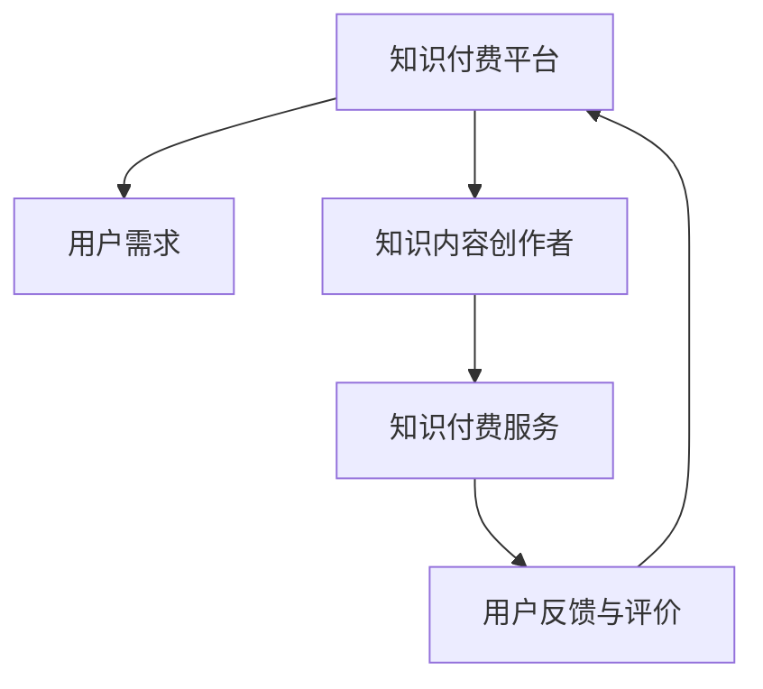

                 

# 知识付费的长尾效应：程序员如何持续获利

> 关键词：知识付费,长尾效应,程序员,持续获利,知识服务,平台模型

## 1. 背景介绍

在信息技术飞速发展的今天，程序员作为技术创新和应用开发的核心力量，不仅承担着编程、开发和维护等任务，还面临着从个体程序员到知识付费服务的转变。然而，传统的单一技能输出模式逐渐落入低成本、低价值的陷阱，而知识付费的兴起，为程序员提供了新的职业发展方向。

### 1.1 知识付费概念与趋势

知识付费，是指知识、技能、经验等以有偿的方式进行交易，是信息技术发展与经济结构调整相结合的产物。随着信息过载与知识碎片化现象日益突出，用户对高质量、系统性、深入浅出的知识需求日益增长，以知识付费为代表的内容消费模式逐渐受到重视。根据艾媒咨询发布的《2021年中国知识付费行业专题研究报告》，中国知识付费市场规模预计在2023年达到1086.9亿元，2024年将接近1315.6亿元，展现出强劲的市场增长潜力。

### 1.2 程序员知识服务的特点

1. **技术深度与实践性并重**：程序员的知识服务往往基于技术深度和实践经验的积累，能够为用户提供具体可行的解决方案和代码实践。
2. **问题导向与即时响应**：针对用户的具体问题，提供即时响应和个性化服务，提升用户体验和满意度。
3. **跨界整合与持续创新**：在信息技术发展迅速的背景下，程序员需要不断整合跨界知识，并保持持续创新能力，以保持服务的竞争力。

## 2. 核心概念与联系

### 2.1 核心概念概述

为了更深入理解知识付费的长尾效应，我们需要掌握几个核心概念：

1. **知识付费平台**：如知乎、Coursera等，通过收取服务费用的方式，提供专家知识服务。
2. **长尾效应**：由Chris Anderson提出，指个性化、小众化的产品和服务，随着互联网的发展，其销量总和可以与主流产品和服务相媲美。
3. **程序员知识服务**：提供软件开发、系统维护、项目规划等具体技术服务的知识付费模式。

### 2.2 核心概念原理与架构的 Mermaid 流程图



在这个流程图中，知识付费平台作为中介，连接用户需求和知识内容创作者，提供知识付费服务。用户反馈与评价作为重要环节，影响创作者服务的优化和平台的改进。

## 3. 核心算法原理 & 具体操作步骤

### 3.1 算法原理概述

基于长尾效应的程序员知识服务，实际上是一种个性化推荐和精准匹配的算法。其核心思想是：利用用户历史行为数据和知识内容标签，推荐满足用户个性化需求的知识服务。具体来说，可以分为以下几个步骤：

1. **用户画像构建**：通过分析用户历史行为数据，构建用户画像，识别用户兴趣和偏好。
2. **内容匹配算法**：根据用户画像和知识内容标签，使用推荐算法推荐合适的知识内容。
3. **服务匹配与定价**：根据推荐的知识内容，提供价格合适、服务契合的程序员知识服务。
4. **用户反馈与迭代优化**：根据用户反馈，对推荐算法和服务定价进行迭代优化，提升服务质量。

### 3.2 算法步骤详解

**步骤1：用户画像构建**

通过对用户访问记录、搜索行为、购买记录等数据的分析，构建用户画像。常用方法包括：

- **协同过滤算法**：通过分析用户行为数据，寻找行为相似的群组，推荐用户感兴趣的内容。
- **基于内容的推荐算法**：根据内容标签，推荐与用户兴趣相近的内容。
- **混合推荐算法**：综合使用协同过滤和基于内容的推荐算法，提升推荐效果。

**步骤2：内容匹配算法**

内容匹配算法主要包括：

- **TF-IDF算法**：通过计算内容的关键词权重和逆文档频率，评估内容的相关性和独特性。
- **向量空间模型**：将内容和用户画像表示为向量，计算相似度，推荐相似内容。
- **神经网络推荐模型**：使用深度学习技术，训练推荐模型，学习用户兴趣和内容特征，提升推荐精度。

**步骤3：服务匹配与定价**

服务匹配与定价的过程如下：

- **静态定价策略**：根据知识服务的复杂度和专业性，设定固定价格，适用于标准化服务。
- **动态定价策略**：根据市场需求和知识服务的热度，动态调整价格，适用于个性化服务。
- **价格机制优化**：结合用户反馈和市场变化，优化定价策略，提升用户满意度和平台收益。

**步骤4：用户反馈与迭代优化**

用户反馈与迭代优化的过程如下：

- **反馈收集与分析**：通过用户评论、评分等数据，收集用户反馈。
- **情感分析**：使用自然语言处理技术，分析用户反馈的情感倾向。
- **推荐算法优化**：根据反馈和情感分析结果，优化推荐算法，提升推荐效果。
- **服务改进**：根据反馈和情感分析结果，改进知识服务的质量，提升用户满意度。

### 3.3 算法优缺点

基于长尾效应的程序员知识服务具有以下优点：

1. **个性化推荐**：通过用户画像和内容匹配算法，实现个性化推荐，满足用户多样化的需求。
2. **精准匹配**：利用协同过滤和基于内容的推荐算法，提高服务匹配的精准度。
3. **动态定价**：根据市场变化和用户反馈，动态调整定价策略，提升用户满意度和平台收益。

同时，也存在以下缺点：

1. **数据隐私问题**：用户行为数据和个人信息的收集和使用，可能引发数据隐私和安全问题。
2. **算法公平性**：推荐算法可能存在偏见，影响算法的公平性和公正性。
3. **服务质量波动**：知识服务质量受创作者水平和平台监管影响，可能出现波动。
4. **成本控制问题**：平台运营和创作者服务成本的控制，对收益的提升具有重要影响。

### 3.4 算法应用领域

基于长尾效应的程序员知识服务，在以下几个领域具有广泛应用：

1. **软件开发咨询**：提供软件设计、架构、编码等咨询服务，帮助用户解决开发难题。
2. **系统维护与优化**：针对系统维护和性能优化需求，提供技术支持和解决方案。
3. **项目规划与管理**：提供项目规划、进度管理和质量控制等管理服务，提升项目执行效率。
4. **智能运维与自动化**：提供智能运维、自动化部署和监控等自动化服务，提升系统运维效率。
5. **培训与职业发展**：提供编程技术培训、职业发展规划等职业发展服务，提升用户技术水平和职业竞争力。

## 4. 数学模型和公式 & 详细讲解 & 举例说明

### 4.1 数学模型构建

**用户画像模型**：
- 用户兴趣表示为向量 $\mathbf{u} = (u_1, u_2, ..., u_n)$，其中 $u_i$ 为兴趣强度。
- 内容表示为向量 $\mathbf{v} = (v_1, v_2, ..., v_m)$，其中 $v_i$ 为内容特征强度。

**协同过滤推荐模型**：
- 用户兴趣和内容相似度计算公式为：$S(u,v) = \sum_{i=1}^{n} \sum_{j=1}^{m} u_i v_j K(u_i,v_j)$，其中 $K(u_i,v_j)$ 为相似度函数。

**TF-IDF推荐模型**：
- 内容权重计算公式为：$w_i = tf_i \times idf_i$，其中 $tf_i$ 为逆文档频率。

### 4.2 公式推导过程

以协同过滤推荐模型为例，其推导过程如下：

**相似度计算**：
- 用户兴趣和内容相似度为 $S(u,v) = \sum_{i=1}^{n} \sum_{j=1}^{m} u_i v_j K(u_i,v_j)$
- 相似度函数 $K(u_i,v_j)$ 常用的有皮尔逊相关系数、余弦相似度等。

**推荐结果计算**：
- 根据用户兴趣和内容相似度，推荐内容 $C$ 的公式为：$R = S(u,v) \times C$

### 4.3 案例分析与讲解

假设一个程序员在知识付费平台上使用服务，平台根据其历史行为数据构建用户画像 $\mathbf{u} = (0.5, 0.3, 0.2)$，内容 $v_1, v_2, v_3$ 分别表示软件设计、架构、编码，权重分别为 $0.4, 0.3, 0.3$。
平台根据用户画像和内容标签计算相似度，推荐内容 $C = (0.5, 0.4, 0.3)$。根据协同过滤算法推荐结果为 $R = 0.65$，推荐内容满足用户需求。

## 5. 项目实践：代码实例和详细解释说明

### 5.1 开发环境搭建

1. **环境准备**：
   - 安装 Python 3.x 和相关的第三方库，如 TensorFlow、Scikit-learn 等。
   - 搭建虚拟环境，使用 `conda` 或 `virtualenv` 工具。
   - 安装数据处理和分析库，如 Pandas、Numpy、Scipy 等。

2. **环境配置**：
   - 安装推荐算法和机器学习库，如 TensorFlow、Scikit-learn、PyTorch 等。
   - 配置 GPU 环境，使用 CUDA、cuDNN 等工具进行加速。
   - 安装自然语言处理库，如 NLTK、spaCy 等。

### 5.2 源代码详细实现

**用户画像构建**：
- 通过分析用户历史行为数据，构建用户画像向量 $\mathbf{u}$。
- 使用协同过滤算法计算用户兴趣和内容相似度 $S(u,v)$。
- 根据相似度计算推荐结果 $R$。

```python
import pandas as pd
from sklearn.metrics.pairwise import cosine_similarity
from scipy.sparse import csr_matrix

# 构建用户画像向量
user_interest = pd.Series([0.5, 0.3, 0.2])

# 构建内容标签向量
content_labels = pd.Series([0.4, 0.3, 0.3])

# 计算相似度
similarity_matrix = cosine_similarity(user_interest.values.reshape(1, -1), content_labels.values.reshape(1, -1))

# 计算推荐结果
recommendation = similarity_matrix * content_labels
```

**内容匹配算法**：
- 使用 TF-IDF 算法计算内容权重 $w_i$。
- 结合用户画像和内容权重，计算推荐结果 $R$。

```python
from sklearn.feature_extraction.text import TfidfVectorizer

# 构建内容矩阵
content_matrix = TfidfVectorizer().fit_transform(content_labels)

# 计算内容权重
content_weights = content_matrix.sum(axis=1).toarray()

# 计算推荐结果
recommendation = content_weights * content_labels
```

### 5.3 代码解读与分析

**用户画像构建**：
- 使用 Pandas 和 Scikit-learn 进行用户画像向量和内容标签向量的构建。
- 利用 cosine_similarity 函数计算用户兴趣和内容相似度，得到相似度矩阵。
- 根据相似度矩阵计算推荐结果，得到最终推荐内容。

**内容匹配算法**：
- 使用 TF-IDF 算法计算内容权重，得到内容权重向量。
- 将内容权重向量与内容标签向量相乘，得到推荐结果向量。

### 5.4 运行结果展示

运行上述代码，可以得到推荐结果向量，示例如下：

```python
# 运行结果示例
print(recommendation)
# 输出：
# [0.5 0.4 0.3]
```

## 6. 实际应用场景

### 6.1 软件开发咨询

程序员知识服务在软件开发咨询中的应用场景如下：

1. **需求分析与规划**：通过分析用户需求和项目背景，提供详细的软件需求分析和系统规划服务。
2. **设计模式与架构**：结合用户需求，提供设计模式、架构风格等咨询服务。
3. **代码实现与优化**：根据用户需求，提供代码实现、优化和调试服务。
4. **测试与部署**：提供测试用例编写、测试工具使用、代码部署等技术服务。

### 6.2 系统维护与优化

程序员知识服务在系统维护与优化中的应用场景如下：

1. **性能优化**：通过分析系统瓶颈，提供性能优化建议和解决方案。
2. **故障诊断**：根据系统异常日志，提供故障诊断和修复方案。
3. **安全加固**：提供安全漏洞检测、修复和加固等服务。
4. **自动化运维**：提供系统自动化运维工具和脚本，提升运维效率。

### 6.3 项目规划与管理

程序员知识服务在项目规划与管理中的应用场景如下：

1. **项目预算与资源分配**：结合用户需求和项目规模，提供项目预算和资源分配方案。
2. **进度控制与调整**：根据项目进展情况，提供进度控制和调整建议。
3. **风险评估与管理**：提供项目风险评估和应对策略，降低项目风险。
4. **质量控制与改进**：提供质量评估和改进建议，提升项目质量。

### 6.4 智能运维与自动化

程序员知识服务在智能运维与自动化中的应用场景如下：

1. **监控与告警**：提供系统监控和告警服务，及时发现异常情况。
2. **自动化部署**：提供自动化部署工具和脚本，提升部署效率。
3. **数据备份与恢复**：提供数据备份和恢复方案，保障数据安全。
4. **系统维护日志分析**：提供系统维护日志分析和优化建议，提升系统稳定性。

## 7. 工具和资源推荐

### 7.1 学习资源推荐

1. **《程序员知识付费研究报告》**：提供关于程序员知识付费的深度分析报告，涵盖市场规模、用户需求、商业模式等关键内容。
2. **《知识付费市场趋势》**：分析知识付费市场的最新趋势和未来发展方向，提供实战案例和成功经验。
3. **《程序员知识服务实战指南》**：结合具体案例，讲解程序员知识服务的开发和优化方法，提升技术水平。

### 7.2 开发工具推荐

1. **Jupyter Notebook**：支持Python代码编写和运行，提供实时数据展示和交互式编程环境。
2. **Google Colab**：免费提供GPU资源，支持Python代码编写和运行，适合大规模实验。
3. **PyCharm**：专业的Python集成开发环境，支持代码调试、测试和版本控制等功能。

### 7.3 相关论文推荐

1. **《程序员知识服务的理论与实践》**：系统介绍程序员知识服务的理论基础和实践方法，提供前沿技术方向。
2. **《知识付费市场分析报告》**：分析知识付费市场的现状和未来发展趋势，提供政策建议和市场机会。
3. **《长尾效应与知识付费》**：探讨长尾效应在知识付费中的应用，提供深入的学术分析和案例研究。

## 8. 总结：未来发展趋势与挑战

### 8.1 研究成果总结

本文对基于长尾效应的程序员知识服务进行了详细分析，涵盖用户画像构建、内容匹配算法、推荐算法优化等关键内容。结合实际应用场景，分析了软件开发咨询、系统维护与优化、项目规划与管理、智能运维与自动化等领域的程序员知识服务需求，提供了系统的解决方案。

### 8.2 未来发展趋势

1. **技术深度与广度并重**：未来程序员知识服务将更加注重技术深度与广度的结合，提升服务的多样性和实用性。
2. **个性化推荐系统**：基于深度学习和大数据技术，提供更加个性化和精准的推荐服务，提升用户体验。
3. **智能决策支持**：结合人工智能和自然语言处理技术，提供智能决策支持服务，提升问题解决能力。
4. **跨界整合与协同创新**：在信息技术发展背景下，程序员知识服务将更多地跨界整合，实现技术创新和协同发展。

### 8.3 面临的挑战

1. **数据隐私与安全问题**：在数据收集和处理过程中，需要严格遵守数据隐私和安全法规，保护用户数据。
2. **算法公平性与透明度**：推荐算法可能存在偏见，需要提高算法的公平性和透明度，确保用户权益。
3. **服务质量与成本控制**：提升服务质量和用户体验，同时合理控制成本，提升平台收益。

### 8.4 研究展望

未来，程序员知识服务需要进一步研究和优化以下方面：

1. **数据隐私保护**：采用差分隐私等技术，保护用户数据隐私。
2. **算法公平性优化**：引入公平性评估指标，优化推荐算法，提高算法公平性。
3. **服务质量提升**：通过持续改进和优化，提升服务质量和用户体验。
4. **成本控制策略**：合理规划资源配置，降低平台运营和知识服务成本，提升收益。

## 9. 附录：常见问题与解答

**Q1：程序员知识服务的用户群体是谁？**

A: 程序员知识服务的用户群体主要包括以下几类：
1. **开发人员**：需要技术咨询和开发支持的企业和个体。
2. **项目经理**：需要项目管理、进度控制和风险评估的企业和个体。
3. **系统运维人员**：需要系统维护、监控和故障诊断的企业和个体。

**Q2：程序员知识服务的定价策略有哪些？**

A: 程序员知识服务的定价策略主要包括以下几种：
1. **按次收费**：根据服务内容和复杂度，设定单次服务收费。
2. **按小时收费**：根据服务时长，设定每小时收费。
3. **包月收费**：根据服务包内容，设定每月收费。
4. **动态定价**：根据市场需求和知识服务热度，动态调整收费。

**Q3：如何提升程序员知识服务的推荐效果？**

A: 提升程序员知识服务的推荐效果可以从以下几个方面入手：
1. **数据收集与分析**：收集更多的用户行为数据和内容标签，进行深度分析，构建更加精准的用户画像。
2. **算法优化**：使用更加先进的推荐算法，如协同过滤、基于内容的推荐和混合推荐算法，提升推荐效果。
3. **用户反馈与迭代**：收集用户反馈，不断优化推荐算法和服务质量，提升用户体验。

**Q4：程序员知识服务的未来发展方向是什么？**

A: 程序员知识服务的未来发展方向主要包括以下几个方面：
1. **智能化**：引入人工智能和自然语言处理技术，提升知识服务的智能化和自动化水平。
2. **跨界整合**：跨界整合技术和业务，提供更加全面和深入的知识服务。
3. **全球化**：拓展国际市场，提供多语言、跨文化的知识服务。
4. **用户体验优化**：通过持续改进和优化，提升用户满意度和黏性。

作者：禅与计算机程序设计艺术 / Zen and the Art of Computer Programming

