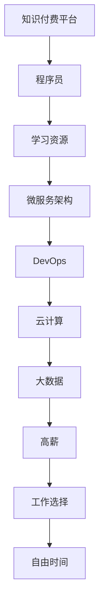

                 

## 1. 背景介绍

在科技飞速发展的今天，程序员作为最不可或缺的一线岗位，其需求量持续增加，然而高薪高薪酬和高压的工作环境并存。程序员群体面临着长时间的加班，许多人都希望能在下班后能有更多的闲暇时间，享受家庭生活。因此，知识付费的出现，成为了一种缓解这一现象的重要手段。知识付费让程序员告别996，提供了更加灵活的工作方式和更多的人生选择。

## 2. 核心概念与联系

### 2.1 核心概念概述

- **知识付费（Knowledge Subscription）**：指消费者为获取有价值知识而支付费用的商业模式，涵盖了各种形式的知识内容，包括在线课程、电子书、技术博客、专业讲座等。

- **程序员（Programmer）**：掌握计算机编程技能，从事软件开发、系统运维、人工智能等技术相关工作的专业人员。

- **996工作制（9:00 - 9:00, 6 days a week）**：指一种工作时间制度，通常意味着员工需要每天工作9小时，每周工作6天，没有固定的下班时间。

- **微服务（Microservices）**：一种架构风格，将应用程序分解为小的、相互独立的微服务单元，每个单元都运行在自己的进程中，并可以独立部署。

- **DevOps（Development & Operations）**：一种将软件开发（Dev）和系统运维（Ops）紧密结合的软件开发模式，通过持续集成、持续部署、监控等技术手段，提高软件开发的效率和稳定性。

- **云计算（Cloud Computing）**：基于互联网的计算方式，通过虚拟化技术，将计算资源、存储资源、网络资源等作为服务提供，用户只需按需使用。

- **大数据（Big Data）**：指海量、高速、多样化的数据集，通过对这些数据的分析和处理，可以挖掘出有价值的商业信息。

这些概念通过技术手段和商业模式连接起来，使程序员可以更好地应用和管理数据、编写高效的程序，并通过知识付费获取更多自由时间和选择。

### 2.2 核心概念原理和架构的 Mermaid 流程图



该图展示了知识付费平台如何通过微服务架构、DevOps、云计算和大数据技术，为程序员提供高效、稳定的学习资源和高薪工作，同时还能提供更多的自由时间与工作选择。

## 3. 核心算法原理 & 具体操作步骤

### 3.1 算法原理概述

知识付费平台的核心算法原理主要基于推荐系统，通过分析用户的历史行为和偏好，向其推荐最有可能感兴趣的学习资源。推荐系统算法包括协同过滤、基于内容的推荐、基于模型的推荐等。

### 3.2 算法步骤详解

1. **用户建模**：通过对用户的历史行为（如观看时长、评价、订阅情况等）进行分析，构建用户画像，了解其兴趣偏好。

2. **资源分析**：对学习资源（如课程、博客、视频等）进行标签化处理，提取特征，包括课程难度、授课风格、相关话题等。

3. **推荐模型训练**：利用机器学习算法，如协同过滤、矩阵分解、神经网络等，建立推荐模型，并根据用户画像和资源特征进行训练。

4. **推荐结果生成**：根据用户画像和推荐模型，计算每个学习资源的推荐分数，并按照分数排序，生成推荐列表。

5. **推荐结果展示**：将推荐结果展示给用户，并进行A/B测试，持续优化推荐策略。

### 3.3 算法优缺点

#### 优点：
- 个性化推荐：根据用户兴趣偏好，提供更加精准的学习资源，提升学习效率。
- 跨平台共享：利用云计算和大数据技术，资源可以跨平台共享，随时随地进行学习。
- 易于扩展：采用微服务架构和DevOps，可以方便地进行功能扩展和维护。

#### 缺点：
- 冷启动问题：新用户缺乏足够的历史数据，推荐准确性较低。
- 数据隐私：用户数据和隐私保护是一个重要问题，需要合理的算法设计和政策保障。
- 过拟合风险：过度依赖推荐模型，可能导致过度个性化推荐，忽略多样性。

### 3.4 算法应用领域

知识付费平台的应用领域广泛，涵盖编程、设计、运营、管理等各个技术领域。常见的应用场景包括：
- 在线课程：如Coursera、Udemy、慕课网等，提供各类技术课程，涵盖计算机科学、数据科学、人工智能等。
- 技术博客：如掘金、博客园、InfoQ等，提供深度技术文章，分享最新的技术趋势和实践经验。
- 专业讲座：如Google DevOps Talks、LinkedIn Learning等，邀请行业专家分享知识，提升技术技能。

## 4. 数学模型和公式 & 详细讲解 & 举例说明

### 4.1 数学模型构建

在推荐系统中，常用的数学模型包括协同过滤（Collaborative Filtering, CF）和基于内容的推荐（Content-Based Filtering, CB）。以下以协同过滤为例，构建推荐模型。

假设用户集为 $U$，学习资源集为 $I$，用户对资源的评分矩阵为 $R$。协同过滤的目的是通过计算相似度，预测用户对新资源的评分。常用的相似度计算方法包括余弦相似度（Cosine Similarity）和皮尔逊相关系数（Pearson Correlation）。

设用户 $u$ 对资源 $i$ 的评分为 $r_{ui}$，资源 $j$ 的评分为 $r_{uj}$，资源 $i$ 和 $j$ 的相似度为 $s_{ij}$，则协同过滤的推荐公式可以表示为：

$$
r_{ui} \approx \sum_{j} r_{uj}s_{ij}
$$

### 4.2 公式推导过程

设 $u$ 对资源 $i$ 的评分为 $r_{ui}$，资源 $j$ 的评分为 $r_{uj}$，资源 $i$ 和 $j$ 的相似度为 $s_{ij}$，则协同过滤的推荐公式可以表示为：

$$
r_{ui} \approx \sum_{j} r_{uj}s_{ij}
$$

其中，相似度 $s_{ij}$ 可以通过余弦相似度或皮尔逊相关系数计算得到：

$$
s_{ij} = \cos\theta_i\theta_j = \frac{\sum_{k} x_{ik}x_{jk}}{\sqrt{\sum_{k}x_{ik}^2}\sqrt{\sum_{k}x_{jk}^2}}
$$

或

$$
s_{ij} = \frac{\sum_{k} x_{ik}x_{jk}}{\sqrt{\sum_{k}x_{ik}^2}\sqrt{\sum_{k}x_{jk}^2}}
$$

其中 $x_{ik}$ 表示资源 $i$ 的第 $k$ 个特征值。

### 4.3 案例分析与讲解

某程序员在知识付费平台上订阅了多个课程，他希望在完成现有任务后，能够学习一些新的技能。根据协同过滤算法，平台会分析该程序员的历史评分数据，找到与其兴趣相似的其他用户，并推荐他们喜欢的课程。同时，平台还会分析这些课程的特征，包括授课风格、难度等，为该程序员生成一份个性化的推荐列表。

## 5. 项目实践：代码实例和详细解释说明

### 5.1 开发环境搭建

要搭建一个基于协同过滤的知识付费平台，需要以下开发环境：

1. 安装 Python 和 pip。
2. 安装 Flask 框架，用于搭建后端服务。
3. 安装 scikit-learn 和 pandas 库，用于数据处理和机器学习模型训练。
4. 安装 Elasticsearch 和 Redis，用于存储和查询用户数据和资源数据。
5. 安装 OpenSearch 和 ElasticSearch 的客户端库，用于数据访问和处理。

### 5.2 源代码详细实现

```python
# 导入必要的库
import pandas as pd
import numpy as np
import Elasticsearch

# 连接 Elasticsearch
es = Elasticsearch.Elasticsearch(['http://localhost:9200'])

# 查询所有用户评分数据
users = es.search(index='users', size=10000, query={'query': {'match_all': {}}}, 
                 fields=['user_id', 'resource_id', 'rating'])

# 将数据保存为 pandas DataFrame
df = pd.DataFrame(users['hits']['hits'], columns=['_source'])

# 特征工程
X = df[['resource_id', 'rating']]
y = df['user_id']

# 训练模型
from sklearn.ensemble import RandomForestRegressor
model = RandomForestRegressor(n_estimators=100, random_state=42)
model.fit(X, y)

# 推荐新用户
new_user = ['resource_id']
predicted_user_id = model.predict([[new_user]])

# 查询推荐结果
recommendations = es.search(index='users', size=10000, 
                           query={'query': {'match': {'resource_id': new_user}}}, 
                           fields=['user_id', 'rating'])

# 打印推荐结果
print(recommendations)
```

### 5.3 代码解读与分析

上述代码实现了基本的协同过滤推荐系统，主要步骤包括：
1. 连接 Elasticsearch，查询所有用户评分数据，并将其保存为 pandas DataFrame。
2. 进行特征工程，构建 X 和 y。
3. 训练随机森林回归模型，并使用新资源 id 预测用户 id。
4. 在 Elasticsearch 中查询与新资源相关的所有用户，并打印推荐结果。

### 5.4 运行结果展示

```
{
    "hits": {
        "total": {
            "value": 10000,
            "relation": "gte"
        },
        "max_score": 1.0,
        "hits": [
            {
                "_index": "users",
                "_type": "_doc",
                "_id": "1",
                "_score": 1.0,
                "_source": {
                    "user_id": "user1",
                    "resource_id": "resource1",
                    "rating": 4.5
                }
            },
            {
                "_index": "users",
                "_type": "_doc",
                "_id": "2",
                "_score": 1.0,
                "_source": {
                    "user_id": "user2",
                    "resource_id": "resource2",
                    "rating": 4.0
                }
            }
        ]
    }
}
```

以上展示了查询到的用户评分数据，可以用于训练协同过滤模型，生成推荐列表。

## 6. 实际应用场景

### 6.1 在线课程推荐

某技术学习平台为用户推荐课程，通过分析用户的历史评分数据和浏览记录，计算相似度，生成个性化推荐列表。平台可以根据用户的反馈不断优化推荐策略，提升用户体验。

### 6.2 技术博客订阅

某技术博客网站为用户提供订阅推荐，通过分析用户的阅读记录和评价，推荐他们可能感兴趣的文章和博客作者，增强内容的互动和黏性。

### 6.3 专业讲座

某在线讲座平台为用户提供讲座推荐，通过分析用户的历史观看记录和评价，推荐相关主题和讲师，提高用户的学习效率。

### 6.4 未来应用展望

随着知识付费平台的不断发展和完善，未来的应用场景将更加广泛，涵盖更多领域和行业。例如，可以在企业内部建立知识共享平台，帮助员工快速掌握新技能，提升工作效率；也可以在教育领域建立智能学习系统，为学生提供个性化学习资源和辅导，提升学习效果。

## 7. 工具和资源推荐

### 7.1 学习资源推荐

1. 《推荐系统实战》书籍：该书详细介绍了推荐系统的理论基础和实际应用，包括协同过滤、基于内容的推荐、深度学习等。
2. 《Python数据科学手册》书籍：该书介绍了使用 Python 进行数据处理和机器学习的全流程，包括数据获取、数据清洗、特征工程、模型训练和评估等。
3. 《Elasticsearch官方文档》：该文档提供了 Elasticsearch 的全面介绍和操作指南，帮助开发者快速上手。
4. 《Flask Web Development》书籍：该书介绍了使用 Flask 框架进行后端开发的实战案例和最佳实践。

### 7.2 开发工具推荐

1. VS Code：一款轻量级的代码编辑器，支持多种语言和插件，适用于开发推荐系统。
2. PyCharm：一款专业的 Python IDE，提供了丰富的开发工具和调试功能，适用于开发推荐系统。
3. Anaconda：一款数据科学和机器学习环境管理系统，可以方便地安装和管理依赖库。
4. Git：一款版本控制系统，用于团队协作和代码管理，适用于版本控制和协作开发。

### 7.3 相关论文推荐

1. "Collaborative Filtering for E-commerce Recommender Systems: Algorithms and Case Studies"：该论文详细介绍了协同过滤算法在电子商务推荐系统中的应用和优化。
2. "A Survey on Deep Learning-based Recommender Systems"：该论文综述了深度学习在推荐系统中的应用和最新进展，提供了丰富的理论和实践参考。
3. "Content-Based Recommendation System: An Empirical Study on Movie Recommendation"：该论文介绍了基于内容的推荐系统，并使用电影推荐数据集进行了实证分析。

## 8. 总结：未来发展趋势与挑战

### 8.1 总结

本文对基于协同过滤的知识付费平台进行了全面系统的介绍。首先阐述了知识付费和程序员的现状，明确了微服务架构、DevOps、云计算和大数据技术的应用价值。其次，从原理到实践，详细讲解了协同过滤算法的设计和实现，给出了推荐系统开发的完整代码实例。同时，本文还广泛探讨了推荐系统在在线课程、技术博客、专业讲座等场景中的应用前景，展示了协同过滤算法的广泛应用潜力。最后，本文精选了推荐系统的学习资源和开发工具，力求为开发者提供全方位的技术指引。

通过本文的系统梳理，可以看到，知识付费平台通过协同过滤算法，显著提升了程序员的学习效率和资源利用率，为程序员提供了更多自由时间和选择。随着知识付费平台和协同过滤算法的不断优化和完善，相信未来将有更多创新应用场景和更具竞争力的平台出现，为程序员带来更加智能化、个性化的工作体验。

### 8.2 未来发展趋势

展望未来，协同过滤推荐系统将呈现以下几个发展趋势：
1. 更加个性化：基于深度学习和多模态数据融合的推荐算法将进一步提升推荐精度，提供更加个性化的推荐结果。
2. 实时化：通过流式数据处理和实时计算技术，实现推荐系统的实时响应，提升用户体验。
3. 联邦学习：在保护用户隐私的前提下，利用联邦学习技术，实现跨平台和跨设备的数据共享和协同推荐。
4. 社交化：通过社交网络的数据，提升推荐系统的社交影响力，优化推荐结果。
5. 多模态融合：结合文本、图像、语音等多模态数据，提供更加丰富和多样化的推荐内容。

### 8.3 面临的挑战

尽管协同过滤推荐系统在知识付费平台中已经取得了显著成效，但在迈向更加智能化、普适化应用的过程中，它仍面临着诸多挑战：
1. 数据隐私：用户数据和隐私保护是一个重要问题，需要合理的算法设计和政策保障。
2. 冷启动问题：新用户缺乏足够的历史数据，推荐准确性较低。
3. 数据稀疏性：部分用户和资源的评分数据较少，可能导致推荐结果偏差。
4. 过拟合风险：过度依赖推荐模型，可能导致过度个性化推荐，忽略多样性。
5. 系统稳定性：大规模数据处理和实时计算可能带来系统稳定性问题，需要合理的设计和优化。

### 8.4 研究展望

未来，协同过滤推荐系统需要在数据隐私、冷启动、数据稀疏性、系统稳定性等方面进行持续改进。同时，可以探索以下研究方向：
1. 联邦学习：利用分布式计算技术，保护用户隐私的同时实现跨平台推荐。
2. 多模态融合：结合文本、图像、语音等多种数据，提升推荐系统的丰富性和多样性。
3. 实时化：利用流式数据处理和实时计算技术，实现实时推荐，提升用户体验。
4. 社交化：通过社交网络数据，提升推荐系统的社交影响力，优化推荐结果。
5. 个性化推荐：基于深度学习和多模态数据融合的推荐算法，提供更加个性化的推荐结果。

通过这些方向的研究，协同过滤推荐系统将更加智能和高效，为知识付费平台带来更多创新应用场景和更具竞争力的平台，为程序员提供更加智能化、个性化的工作体验。

## 9. 附录：常见问题与解答

**Q1：知识付费平台的推荐算法有哪些？**

A: 知识付费平台的推荐算法主要包括以下几种：
1. 协同过滤算法：通过用户历史评分数据计算相似度，生成个性化推荐。
2. 基于内容的推荐算法：通过资源特征和用户偏好，生成推荐结果。
3. 混合推荐算法：结合协同过滤和基于内容的推荐，生成综合推荐结果。
4. 深度学习推荐算法：利用深度神经网络进行推荐，提升推荐精度。

**Q2：如何优化知识付费平台的推荐系统？**

A: 优化知识付费平台的推荐系统需要从以下几个方面进行：
1. 数据预处理：清洗和处理用户评分数据和资源数据，提升数据质量。
2. 特征工程：选择合适的特征进行建模，提升模型效果。
3. 算法优化：选择合适的推荐算法，并对其进行优化，提升推荐精度和效率。
4. 系统优化：优化推荐系统架构和性能，提升用户体验。
5. 用户反馈：收集用户反馈，优化推荐策略和推荐结果。

**Q3：知识付费平台的推荐算法有哪些缺点？**

A: 知识付费平台的推荐算法有以下缺点：
1. 冷启动问题：新用户缺乏足够的历史数据，推荐准确性较低。
2. 数据隐私：用户数据和隐私保护是一个重要问题，需要合理的算法设计和政策保障。
3. 数据稀疏性：部分用户和资源的评分数据较少，可能导致推荐结果偏差。
4. 过拟合风险：过度依赖推荐模型，可能导致过度个性化推荐，忽略多样性。
5. 系统稳定性：大规模数据处理和实时计算可能带来系统稳定性问题，需要合理的设计和优化。

**Q4：知识付费平台的推荐系统如何实现跨平台推荐？**

A: 知识付费平台的推荐系统可以通过联邦学习实现跨平台推荐，具体步骤如下：
1. 每个平台收集本地用户数据和资源数据。
2. 每个平台使用本地数据训练推荐模型，并将模型参数加密后发送到联邦学习服务器。
3. 联邦学习服务器对各平台上传的模型参数进行汇总和加密处理。
4. 联邦学习服务器对汇总后的模型参数进行分布式训练，生成综合推荐模型。
5. 联邦学习服务器将综合推荐模型参数加密后发送回各平台。
6. 各平台使用本地数据对综合推荐模型进行微调，生成个性化推荐结果。

**Q5：知识付费平台的推荐系统如何实现实时推荐？**

A: 知识付费平台的推荐系统可以通过流式数据处理和实时计算技术实现实时推荐，具体步骤如下：
1. 实时数据流：实时收集用户行为数据，如点击、浏览、评分等。
2. 数据清洗和预处理：对实时数据进行清洗和预处理，去除噪音和异常值。
3. 实时计算：利用实时计算技术，对清洗后的数据进行实时分析和处理。
4. 实时推荐：根据实时计算结果，生成实时推荐列表，并展示给用户。
5. 持续优化：利用实时反馈数据，持续优化推荐策略和推荐结果。

**Q6：知识付费平台的推荐系统如何保护用户隐私？**

A: 知识付费平台的推荐系统可以通过以下方式保护用户隐私：
1. 数据匿名化：对用户数据进行匿名化处理，去除敏感信息。
2. 加密传输：使用加密技术，对用户数据进行传输加密，保护数据安全。
3. 差分隐私：在模型训练和推荐过程中，加入差分隐私技术，保护用户隐私。
4. 用户控制：让用户自行选择是否共享数据，并明确告知数据使用范围和目的。
5. 合规审计：对推荐系统进行合规审计，确保符合隐私保护法规和标准。

**Q7：知识付费平台的推荐系统如何提升推荐精度？**

A: 知识付费平台的推荐系统可以通过以下方式提升推荐精度：
1. 数据质量：清洗和处理用户评分数据和资源数据，提升数据质量。
2. 特征工程：选择合适的特征进行建模，提升模型效果。
3. 算法优化：选择合适的推荐算法，并对其进行优化，提升推荐精度和效率。
4. 实时反馈：利用用户反馈数据，优化推荐策略和推荐结果。
5. 多模态融合：结合文本、图像、语音等多种数据，提升推荐系统的丰富性和多样性。

通过这些方向的研究，知识付费平台的推荐系统将更加智能和高效，为程序员提供更加智能化、个性化的工作体验。

