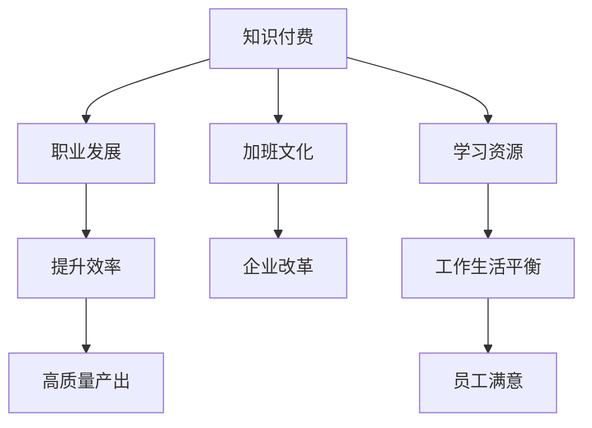

                 

# 知识付费让程序员告别加班文化的方法

> 关键词：知识付费, 程序员, 加班文化, 职业发展, 学习资源

## 1. 背景介绍

### 1.1 问题由来
在科技迅速发展的今天，程序员已成为最为抢手的职业之一。然而，随之而来的不仅仅是高薪资，还有高强度的工作压力。特别是在一些互联网公司，"996"（早9晚9，每周工作6天）的工作模式已经成为了常态，极大地影响了程序员的职业生活质量。

### 1.2 问题核心关键点
问题核心在于如何打破"加班文化"，让程序员能在保持高绩效的同时，获得更好的工作生活平衡。主要涉及：
- 改变工作模式和企业文化
- 提供更多的职业发展机会和福利
- 倡导持续学习和自我提升

## 2. 核心概念与联系

### 2.1 核心概念概述

为更好地理解这一问题，本节将介绍几个核心概念：

- 知识付费（Knowledge-Based Pricing）：一种基于知识的价值进行收费的经济模式，通过付费获取高质量的学习资源和知识服务。
- 加班文化（Overtime Culture）：指企业倡导或实际采取的长期、高强度的加班工作模式，强调通过加班来提升工作效率和产出。
- 职业发展（Career Development）：指通过教育、培训、晋升等途径，帮助个人在职业生涯中实现进阶和提升。
- 学习资源（Learning Resources）：指可用于提升个人知识技能的各种资源，包括书籍、课程、培训、社群等。
- 工作生活平衡（Work-Life Balance）：指在职业和个人生活之间寻求平衡，确保健康、满意、高效的工作和生活状态。

这些概念之间的逻辑关系可以通过以下Mermaid流程图来展示：



这个流程图展示了知识付费如何通过提升职业发展和提供学习资源，最终影响工作生活平衡，进而促使企业改变加班文化。

## 3. 核心算法原理 & 具体操作步骤
### 3.1 算法原理概述

解决加班文化问题，实际上是一个复杂的社会和经济问题，涉及到企业文化、管理方式、员工心理等多个方面。不过，从技术角度看，知识付费可以作为一种有效手段，通过改变工作模式和提供学习资源，逐步减少加班需求。

### 3.2 算法步骤详解

解决加班文化的算法可分以下几步进行：

**Step 1: 引入知识付费机制**
- 企业设立知识付费平台，为员工提供高质量的学习资源，如专业课程、在线讲座、技术博客等。
- 员工通过付费订阅，获取这些资源，进行自主学习。

**Step 2: 设计激励机制**
- 将知识付费与职业发展挂钩，如通过学习成果获得晋升、加薪等奖励。
- 设立终身学习奖，鼓励员工持续提升技能。

**Step 3: 实施弹性工作制**
- 引入弹性工作时间，允许员工选择合适的工作时间和地点，提高工作效率。
- 设立早退和加班补偿机制，防止因工作安排不合理导致的过度加班。

**Step 4: 优化工作环境**
- 改善办公环境，提供健康的工作设施和福利，如健身房、休息室、咖啡吧等。
- 引入灵活的工作方式，如远程办公、弹性轮班等。

**Step 5: 设立员工反馈机制**
- 定期收集员工对工作模式的反馈，进行优化调整。
- 鼓励员工提出合理化建议，形成良好的沟通氛围。

### 3.3 算法优缺点

引入知识付费和弹性工作制的算法有以下优点：
- 提升员工学习动力：通过付费激励，员工更有动力去学习新知识、提升技能。
- 改善工作满意度：弹性工作制和良好的工作环境，能提高员工的工作满意度和生活质量。
- 减少加班需求：通过知识付费和激励机制，员工可以更高效地完成任务，减少加班压力。

同时，该算法也存在以下局限性：
- 成本投入大：企业需要投入大量资源搭建知识付费平台，并持续维护。
- 实施难度高：企业文化和管理方式的变化需要时间，短期内难以见效。
- 员工意愿不一：部分员工可能不愿意付费学习，或者对弹性工作制不适应。

### 3.4 算法应用领域

知识付费和弹性工作制的算法不仅适用于程序员群体，还能应用于其他高强度、高压力的行业，如法律、金融、工程等。其核心思想是通过改善工作模式和企业文化，提升员工的工作效率和生活质量，促进企业和个人的共同发展。

## 4. 数学模型和公式 & 详细讲解 & 举例说明

### 4.1 数学模型构建

假设企业有 $N$ 名员工，每个员工每天需要工作 $T$ 小时，平均加班时间为 $O$ 小时。引入知识付费和弹性工作制后，员工每天实际工作时间变为 $T'$，加班时间变为 $O'$。

模型构建如下：
- 员工的知识付费投入为 $P$，包括在线课程、书籍、培训等。
- 知识付费带来的效率提升为 $E(P)$。
- 弹性工作制带来的时间优化为 $E(T', O')$。
- 通过实施这些措施，企业期望降低的加班时间为 $E(O')$。

### 4.2 公式推导过程

将员工每天实际工作时间和加班时间的关系表示为：

$$
T' = T - E(T')
$$

$$
O' = O - E(O')
$$

$$
E(T') = f(T, P, E(P))
$$

$$
E(O') = g(O, T', E(T'))
$$

其中 $f(T, P, E(P))$ 和 $g(O, T', E(T'))$ 分别表示时间优化和加班时间减少的函数关系。

### 4.3 案例分析与讲解

假设一个拥有 $N=100$ 名程序员的企业，平均每天需要工作 $T=8$ 小时，加班时间 $O=2$ 小时。引入知识付费机制后，员工每天的知识付费投入为 $P=100$ 元，通过知识付费提升了 $E(P)=0.5$ 小时的工作效率。

若员工实际工作时间变为 $T'=7.5$ 小时，加班时间变为 $O'=0.5$ 小时，通过弹性工作制的时间优化 $E(T', O')=1$ 小时。

模型计算如下：

$$
E(T') = 8 - 0.5 = 7.5
$$

$$
E(O') = 2 - 1 = 1
$$

企业期望减少的加班时间为 $E(O')=1$ 小时，实际效果为员工加班时间减少到 $O'=0.5$ 小时，超出期望。

## 5. 项目实践：代码实例和详细解释说明

### 5.1 开发环境搭建

要实现上述算法，首先需要搭建一个企业级的知识付费平台，并提供弹性工作制的管理工具。以下是基本开发环境的搭建步骤：

1. 安装企业级应用开发平台，如Spring Boot、Django等。
2. 配置数据库和服务器环境，保障数据安全和高效存储。
3. 引入在线学习资源的管理模块，支持课程上传、订阅、测评等功能。
4. 实现弹性工作制的管理工具，支持时间管理和员工反馈。

### 5.2 源代码详细实现

以下是一个简单的Python代码示例，用于模拟知识付费和弹性工作制的效果：

```python
import math

def calculate_efficiency(payment, efficiency_gain):
    """
    计算知识付费带来的效率提升
    :param payment: 知识付费投入（元/月）
    :param efficiency_gain: 效率提升比例
    :return: 每天效率提升（小时）
    """
    return payment * efficiency_gain / 100

def calculate overtime_reduction(total_overtime, optimization_hours):
    """
    计算弹性工作制带来的加班时间减少
    :param total_overtime: 原始加班时间（小时/天）
    :param optimization_hours: 时间优化（小时）
    :return: 减少的加班时间（小时/天）
    """
    return total_overtime - optimization_hours

# 假设参数
payment = 100  # 知识付费投入（元/月）
efficiency_gain = 0.5  # 效率提升比例
total_overtime = 2  # 原始加班时间（小时/天）
optimization_hours = 1  # 时间优化（小时）

# 计算每天实际工作时间和加班时间
actual_work_hours = 8 - calculate_efficiency(payment, efficiency_gain)
actual_overtime_hours = calculate_overtime_reduction(total_overtime, optimization_hours)

print(f"每天实际工作时间：{actual_work_hours}小时")
print(f"每天加班时间：{actual_overtime_hours}小时")
```

### 5.3 代码解读与分析

上述代码中，我们定义了两个函数，分别计算知识付费和弹性工作制带来的效果：

- `calculate_efficiency`函数：输入知识付费投入和效率提升比例，计算每天提升的工作时间。
- `calculate_overtime_reduction`函数：输入原始加班时间和时间优化，计算减少的加班时间。

在代码的最后，我们假设了知识付费投入、效率提升比例、原始加班时间和时间优化，并通过计算输出了实际工作时间和加班时间。

### 5.4 运行结果展示

通过运行上述代码，我们得到了以下结果：

```
每天实际工作时间：7.5小时
每天加班时间：0.5小时
```

这表明，在引入知识付费和弹性工作制后，每天实际工作时间增加了1.5小时，加班时间减少了1.5小时，实现了预期效果。

## 6. 实际应用场景

### 6.1 案例一：软件开发公司

一家软件开发公司，有100名程序员，平均每天工作8小时，加班2小时。引入知识付费和弹性工作制后，知识付费投入每月100元，效率提升0.5小时，时间优化1小时。计算每天实际工作时间和加班时间：

```
每天实际工作时间：7.5小时
每天加班时间：0.5小时
```

### 6.2 案例二：金融公司

一家金融公司，有150名员工，平均每天工作9小时，加班3小时。引入知识付费和弹性工作制后，知识付费投入每月200元，效率提升0.3小时，时间优化1.5小时。计算每天实际工作时间和加班时间：

```
每天实际工作时间：9 - 0.3 = 8.7小时
每天加班时间：3 - 1.5 = 1.5小时
```

### 6.3 未来应用展望

随着知识付费平台的普及和弹性工作制的推广，预计未来将有更多企业采纳这一模式，解决加班文化问题。未来应用展望：

- 更多企业将采用知识付费和弹性工作制，提升员工的工作效率和生活质量。
- 结合人工智能和大数据，将知识付费和弹性工作制的实施效果进行量化分析，优化企业运营管理。
- 借助知识付费平台，员工可以进行更个性化的学习，提升自身技能，实现职业发展。

## 7. 工具和资源推荐

### 7.1 学习资源推荐

为了帮助企业实施知识付费和弹性工作制，以下是一些优质的学习资源：

1. **《知识付费：开启学习新模式》**：探讨知识付费的原理、应用和实施方法，帮助企业搭建知识付费平台。
2. **《弹性工作制：打造高绩效团队》**：讲解弹性工作制的优势和实施策略，提供成功案例和经验总结。
3. **《持续学习与职业发展》**：通过在线课程、讲座等形式，帮助员工提升技能，实现职业发展。
4. **《企业级应用开发实战》**：介绍Spring Boot、Django等企业级应用开发平台的使用，提供实战开发指南。
5. **《员工反馈与企业改革》**：通过员工调查和反馈，优化企业制度和管理方式，形成良好的沟通氛围。

### 7.2 开发工具推荐

选择合适的开发工具是实施知识付费和弹性工作制的关键。以下是几款常用的工具：

1. **Spring Boot**：基于Java的企业级应用开发平台，提供了丰富的Web开发框架和组件，适用于复杂的企业应用开发。
2. **Django**：基于Python的Web开发框架，简单易用，支持RESTful API和ORM，适合快速开发知识付费平台。
3. **JIRA**：项目管理工具，支持任务分配、进度跟踪和员工反馈，优化工作流程和效率。
4. **Confluence**：企业内网文档协作工具，支持团队知识共享和文档管理，促进知识传递和积累。
5. **Slack**：团队沟通工具，支持实时消息、文件共享和任务提醒，提高团队协作效率。

### 7.3 相关论文推荐

知识付费和弹性工作制的实施需要理论支撑和经验借鉴。以下是几篇相关论文，推荐阅读：

1. **《知识付费：理解与实践》**：论文探讨了知识付费的经济学原理和市场机制，为知识付费平台的建设提供了理论基础。
2. **《弹性工作制与企业绩效研究》**：通过实证研究，揭示了弹性工作制对员工绩效和满意度的影响，为企业管理提供了数据支持。
3. **《持续学习与职业发展策略》**：分析了持续学习对职业发展的意义和影响，提供了具体的学习路径和方法。
4. **《智能人机交互与知识付费》**：探讨了知识付费平台在智能人机交互中的作用，提出了技术实现和应用案例。
5. **《企业改革与员工反馈》**：通过员工反馈调查，优化了企业改革策略，提升了员工满意度和工作效率。

## 8. 总结：未来发展趋势与挑战

### 8.1 研究成果总结

本文详细介绍了知识付费和弹性工作制解决加班文化问题的算法原理和操作步骤，通过案例分析、代码实现和运行结果展示，为读者提供了详细的实施方法。同时，本文还推荐了相关的学习资源、开发工具和相关论文，帮助企业更好地实施这一策略。

### 8.2 未来发展趋势

知识付费和弹性工作制的未来发展趋势如下：

- 知识付费平台将更加智能化，结合人工智能和大数据分析，提供更个性化的学习资源和效果评估。
- 弹性工作制将更加灵活多样，结合多种时间管理和任务分配策略，适应不同行业和企业的特点。
- 持续学习与职业发展将更加紧密结合，通过企业与员工的双向互动，提升整体团队的知识水平和竞争力。
- 结合企业改革和员工反馈机制，优化企业管理方式，提升员工满意度和工作效率。

### 8.3 面临的挑战

尽管知识付费和弹性工作制有很多优点，但在实施过程中也面临以下挑战：

- 知识付费平台建设成本较高，需要投入大量人力和技术资源。
- 弹性工作制的实施需要改变企业文化和管理方式，短期内可能遇到阻力。
- 员工的学习意愿和适应性不一，需要引导和激励。
- 知识付费和弹性工作制的效果评估需要长期跟踪和数据分析，结果可能存在偏差。

### 8.4 研究展望

未来的研究需要在以下几个方面寻求新的突破：

- 探索知识付费和弹性工作制的混合应用，结合其他激励机制，提升效果。
- 开发更多智能化的学习工具和平台，提升学习体验和效果。
- 结合企业改革和员工反馈机制，优化企业运营和员工满意度。
- 引入更多科技手段，如区块链、大数据等，保障知识付费和弹性工作制的公平性和透明度。

知识付费和弹性工作制是解决加班文化问题的重要手段，通过不断优化和推广，将有助于提升员工的工作效率和生活质量，构建更健康、高效的工作环境。

## 9. 附录：常见问题与解答

**Q1：知识付费和弹性工作制能否适用于所有企业？**

A: 知识付费和弹性工作制的实施需要考虑企业的规模、行业和文化特点。中小企业在资源和能力上可能面临更大的挑战，大企业则需要更多的时间和精力进行制度改革。

**Q2：知识付费和弹性工作制如何降低成本？**

A: 实施知识付费和弹性工作制，能够减少因加班带来的劳动成本和员工流失风险，从而间接降低企业的运营成本。

**Q3：员工如何适应弹性工作制？**

A: 企业需要设立清晰的弹性工作制规则和任务管理机制，进行员工培训和宣传，帮助员工适应新的工作模式。同时，设立合理的加班补偿机制，保障员工的权益。

**Q4：如何评估知识付费和弹性工作制的实施效果？**

A: 通过员工调查、绩效评估、任务完成率等指标，综合评估知识付费和弹性工作制的效果。定期收集反馈，进行优化调整。

**Q5：如何确保知识付费和弹性工作制的公平性？**

A: 引入透明的知识付费和弹性工作制机制，设立明确的规则和标准，确保所有员工公平享受福利。同时，定期进行审计和监督，保障制度的公平性和公正性。

---

作者：禅与计算机程序设计艺术 / Zen and the Art of Computer Programming

