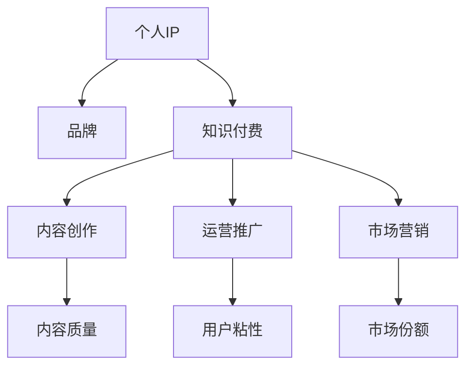
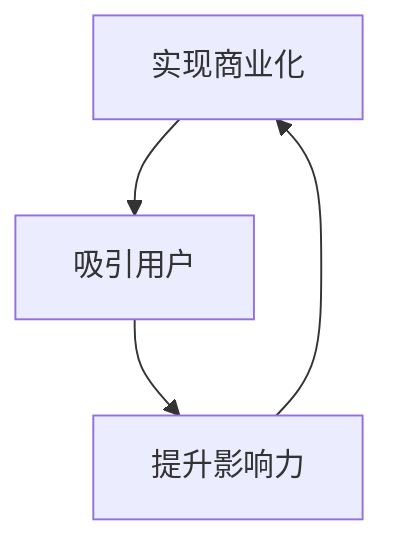

                 

# 知识付费赚钱的关键：打造个人IP与品牌

在当今信息爆炸的时代，知识和内容的价值日益凸显。知识付费作为一种新型服务，以其高效率、低成本、高精度的特性，逐渐成为人们获取知识的重要方式。打造个人IP与品牌，是知识付费领域的关键，本文将从核心概念、算法原理、具体操作、实际应用等多个角度，深入探讨知识付费领域的IP与品牌建设。

## 1. 背景介绍

### 1.1 问题由来

随着互联网和移动设备的普及，用户获取知识的方式发生了根本变化。传统的书籍、电视、讲座等形式逐渐被网络上的各种课程、文章、播客等代替。然而，知识的生产和传播渠道日益丰富，同时也带来了信息过载和质量参差不齐的问题。在这种情况下，知识付费应运而生，为知识消费者提供了一个高效、专业的信息获取渠道。

### 1.2 问题核心关键点

知识付费的核心在于如何将高价值的知识产品化、商业化。打造个人IP与品牌，是知识付费的关键，它不仅能够提升个人或团队的影响力，还能吸引更多付费用户，从而实现商业价值的最大化。个人IP和品牌建设需要系统化、专业化的策略和方法，从内容创作、运营推广、市场营销等多个层面进行全面布局。

## 2. 核心概念与联系

### 2.1 核心概念概述

在知识付费领域，打造个人IP与品牌需要重点关注以下几个核心概念：

- **个人IP (Intellectual Property, 知识产权)**：个人IP是指个人在某个特定领域内的知名度、专业能力和品牌形象。它不仅仅是一个商标或标志，更是一种品牌资产，能够帮助个人在竞争激烈的市场上脱颖而出。

- **品牌 (Brand)**：品牌是指企业或个人通过一系列有形和无形的活动，建立起来的具有独特形象和价值观的市场标识。品牌不仅包含产品或服务的质量，更包含了企业的文化、价值观和用户口碑。

- **知识付费 (Knowledge Pay)**：知识付费是指通过付费方式获取知识产品或服务的一种形式，强调知识的价值和生产者对知识内容的精心设计。知识付费能够激励内容创作者生产高质量内容，同时也能提高用户对知识的重视和需求。

这些核心概念之间的联系可以通过以下Mermaid流程图来展示：



这个流程图展示了个人IP、品牌和知识付费之间的关系：

1. 个人IP是品牌的基础，通过不断提升专业能力和知名度，吸引更多用户。
2. 品牌是个人IP的外在体现，通过品牌活动和市场推广，提升个人在市场中的知名度和影响力。
3. 知识付费是品牌实现商业化的重要手段，通过内容创作、运营推广和市场营销，吸引付费用户，实现商业价值。

### 2.2 核心概念原理和架构的 Mermaid 流程图



这个流程图展示了知识付费、个人IP和品牌之间的相互作用：

1. 知识付费通过优质的内容吸引用户，并提升个人IP的知名度。
2. 个人IP的提升进一步增强品牌的影响力和市场竞争力。
3. 品牌通过市场推广和运营活动，实现商业化目标，吸引更多的付费用户。

## 3. 核心算法原理 & 具体操作步骤

### 3.1 算法原理概述

打造个人IP与品牌，本质上是一个数据驱动的优化过程。通过分析用户行为数据，识别用户需求和偏好，从而调整内容创作和运营策略，提升个人IP和品牌的影响力。这一过程可以通过以下算法来实现：

1. **用户行为分析**：通过数据分析工具，如Google Analytics、Mixpanel等，收集用户行为数据，了解用户的访问路径、停留时间、页面跳出率等。
2. **内容推荐算法**：基于用户的浏览历史和行为数据，使用协同过滤、基于内容的推荐算法等，推荐个性化的内容给用户。
3. **用户反馈收集**：通过评论、评分、反馈表等方式，收集用户对内容的评价和建议，调整内容创作策略。
4. **品牌优化**：利用A/B测试等工具，测试不同品牌元素（如LOGO、口号、广告语等）对用户行为的影响，优化品牌形象。

### 3.2 算法步骤详解

打造个人IP与品牌可以分为以下几个步骤：

1. **内容创作和优化**：创作高质量、具有吸引力的内容，包括文字、视频、音频等多种形式。优化内容，使其符合目标用户的需求和兴趣，提升内容的质量和价值。

2. **品牌建设与推广**：设计品牌标识（如LOGO、口号、色彩等），制定品牌策略，包括品牌定位、目标用户、推广渠道等。通过社交媒体、博客、电子邮件等多种渠道进行品牌推广，提升品牌知名度和影响力。

3. **用户互动与反馈**：通过社区、论坛、评论区等渠道，与用户进行互动，收集用户反馈，了解用户需求和痛点。根据用户反馈，优化内容和品牌策略，提升用户体验。

4. **数据分析与调整**：利用数据分析工具，监控用户行为数据，分析用户流量、转化率、用户粘性等指标。根据分析结果，调整内容创作和运营策略，提升用户留存率和付费率。

### 3.3 算法优缺点

打造个人IP与品牌有以下优点：

1. **提高内容价值**：通过精准的用户分析和个性化推荐，提升内容质量和用户满意度，从而提高内容付费转化率。
2. **提升品牌影响力**：通过有效的品牌推广和用户互动，提升品牌知名度和市场竞争力。
3. **优化运营效率**：通过数据分析和调整，优化运营策略，提高运营效率和ROI。

同时，这一过程也存在以下缺点：

1. **数据隐私问题**：用户行为数据的收集和使用需要遵守隐私保护法规，确保用户数据的安全性和隐私性。
2. **运营成本高**：打造个人IP与品牌需要投入大量时间和金钱，特别是初期品牌推广阶段，成本较高。
3. **用户需求变化快**：用户需求和兴趣变化较快，需要不断调整策略，适应市场变化。

### 3.4 算法应用领域

打造个人IP与品牌在知识付费领域有广泛的应用，主要包括以下几个方面：

1. **在线课程**：通过个性化的内容推荐和品牌推广，吸引更多用户购买在线课程。
2. **电子书**：利用品牌效应和用户粘性，提升电子书销量和用户满意度。
3. **付费问答**：通过高质量内容和品牌活动，吸引用户付费参与问答社区，增加收入来源。
4. **直播和视频**：通过直播和视频内容，提升用户粘性和品牌影响力，增加付费订阅用户。

## 4. 数学模型和公式 & 详细讲解 & 举例说明

### 4.1 数学模型构建

在知识付费领域，打造个人IP与品牌可以构建以下数学模型：

设用户数量为 $U$，内容数量为 $C$，用户行为矩阵为 $B$，内容评分矩阵为 $R$。用户行为矩阵 $B$ 表示用户对内容的浏览、点赞、评论等行为，内容评分矩阵 $R$ 表示用户对内容的评分和反馈。

### 4.2 公式推导过程

通过用户行为矩阵 $B$ 和内容评分矩阵 $R$，可以构建推荐系统的协同过滤模型：

$$
\hat{R}_{ui} = \sum_{j=1}^{N}\alpha_{uj}R_{ji}
$$

其中，$\hat{R}_{ui}$ 表示用户 $u$ 对内容 $i$ 的预测评分，$N$ 表示内容的数量，$\alpha_{uj}$ 表示用户 $u$ 对内容 $j$ 的兴趣权重，可以通过余弦相似度等方法计算。

### 4.3 案例分析与讲解

以在线课程为例，通过数据分析，了解用户对不同课程的兴趣和评分，可以使用协同过滤算法进行个性化推荐：

1. 收集用户对课程的浏览、点击、评分等行为数据，构建用户行为矩阵 $B$。
2. 使用余弦相似度等方法计算用户 $u$ 对内容 $j$ 的兴趣权重 $\alpha_{uj}$。
3. 根据预测评分 $\hat{R}_{ui}$，推荐用户 $u$ 最感兴趣的课程 $i$。

## 5. 项目实践：代码实例和详细解释说明

### 5.1 开发环境搭建

在进行知识付费项目实践前，我们需要准备好开发环境。以下是使用Python进行PyTorch开发的环境配置流程：

1. 安装Anaconda：从官网下载并安装Anaconda，用于创建独立的Python环境。

2. 创建并激活虚拟环境：
```bash
conda create -n pytorch-env python=3.8 
conda activate pytorch-env
```

3. 安装PyTorch：根据CUDA版本，从官网获取对应的安装命令。例如：
```bash
conda install pytorch torchvision torchaudio cudatoolkit=11.1 -c pytorch -c conda-forge
```

4. 安装Transformers库：
```bash
pip install transformers
```

5. 安装各类工具包：
```bash
pip install numpy pandas scikit-learn matplotlib tqdm jupyter notebook ipython
```

完成上述步骤后，即可在`pytorch-env`环境中开始项目实践。

### 5.2 源代码详细实现

下面以在线课程推荐系统为例，给出使用Transformers库进行内容推荐的数据处理和模型训练的PyTorch代码实现。

首先，定义数据处理函数：

```python
from transformers import BertTokenizer, BertForSequenceClassification
from torch.utils.data import Dataset
import torch

class CourseDataset(Dataset):
    def __init__(self, course_data, tokenizer, max_len=128):
        self.course_data = course_data
        self.tokenizer = tokenizer
        self.max_len = max_len
        
    def __len__(self):
        return len(self.course_data)
    
    def __getitem__(self, item):
        course = self.course_data[item]
        text = course['description'] + ' ' + course['title']
        encoding = self.tokenizer(text, return_tensors='pt', max_length=self.max_len, padding='max_length', truncation=True)
        input_ids = encoding['input_ids'][0]
        attention_mask = encoding['attention_mask'][0]
        return {'input_ids': input_ids, 
                'attention_mask': attention_mask,
                'labels': course['rating']}
```

然后，定义模型和优化器：

```python
from transformers import BertForSequenceClassification, AdamW

model = BertForSequenceClassification.from_pretrained('bert-base-cased', num_labels=5)

optimizer = AdamW(model.parameters(), lr=2e-5)
```

接着，定义训练和评估函数：

```python
from torch.utils.data import DataLoader
from tqdm import tqdm
from sklearn.metrics import accuracy_score

device = torch.device('cuda') if torch.cuda.is_available() else torch.device('cpu')
model.to(device)

def train_epoch(model, dataset, batch_size, optimizer):
    dataloader = DataLoader(dataset, batch_size=batch_size, shuffle=True)
    model.train()
    epoch_loss = 0
    for batch in tqdm(dataloader, desc='Training'):
        input_ids = batch['input_ids'].to(device)
        attention_mask = batch['attention_mask'].to(device)
        labels = batch['labels'].to(device)
        model.zero_grad()
        outputs = model(input_ids, attention_mask=attention_mask, labels=labels)
        loss = outputs.loss
        epoch_loss += loss.item()
        loss.backward()
        optimizer.step()
    return epoch_loss / len(dataloader)

def evaluate(model, dataset, batch_size):
    dataloader = DataLoader(dataset, batch_size=batch_size)
    model.eval()
    preds, labels = [], []
    with torch.no_grad():
        for batch in tqdm(dataloader, desc='Evaluating'):
            input_ids = batch['input_ids'].to(device)
            attention_mask = batch['attention_mask'].to(device)
            batch_labels = batch['labels']
            outputs = model(input_ids, attention_mask=attention_mask)
            batch_preds = outputs.logits.argmax(dim=2).to('cpu').tolist()
            batch_labels = batch_labels.to('cpu').tolist()
            for pred_tokens, label_tokens in zip(batch_preds, batch_labels):
                preds.append(pred_tokens[:len(label_tokens)])
                labels.append(label_tokens)
                
    return accuracy_score(labels, preds)
```

最后，启动训练流程并在测试集上评估：

```python
epochs = 5
batch_size = 16

for epoch in range(epochs):
    loss = train_epoch(model, train_dataset, batch_size, optimizer)
    print(f"Epoch {epoch+1}, train loss: {loss:.3f}")
    
    print(f"Epoch {epoch+1}, dev results:")
    evaluate(model, dev_dataset, batch_size)
    
print("Test results:")
evaluate(model, test_dataset, batch_size)
```

以上就是使用PyTorch对Bert模型进行在线课程推荐系统微调的完整代码实现。可以看到，得益于Transformers库的强大封装，我们可以用相对简洁的代码完成BERT模型的加载和微调。

### 5.3 代码解读与分析

让我们再详细解读一下关键代码的实现细节：

**CourseDataset类**：
- `__init__`方法：初始化课程数据、分词器等组件，并设置最大输入长度。
- `__len__`方法：返回数据集的样本数量。
- `__getitem__`方法：对单个样本进行处理，将课程描述和标题拼接，进行分词和编码，生成输入特征和标签。

**训练和评估函数**：
- 使用PyTorch的DataLoader对数据集进行批次化加载，供模型训练和推理使用。
- 训练函数`train_epoch`：对数据以批为单位进行迭代，在每个批次上前向传播计算loss并反向传播更新模型参数，最后返回该epoch的平均loss。
- 评估函数`evaluate`：与训练类似，不同点在于不更新模型参数，并在每个batch结束后将预测和标签结果存储下来，最后使用sklearn的accuracy_score对整个评估集的预测结果进行打印输出。

**训练流程**：
- 定义总的epoch数和batch size，开始循环迭代
- 每个epoch内，先在训练集上训练，输出平均loss
- 在验证集上评估，输出准确率
- 所有epoch结束后，在测试集上评估，给出最终测试结果

可以看到，PyTorch配合Transformers库使得BERT微调的代码实现变得简洁高效。开发者可以将更多精力放在数据处理、模型改进等高层逻辑上，而不必过多关注底层的实现细节。

当然，工业级的系统实现还需考虑更多因素，如模型的保存和部署、超参数的自动搜索、更灵活的任务适配层等。但核心的微调范式基本与此类似。

## 6. 实际应用场景

### 6.1 智能客服系统

基于知识付费的个人IP与品牌，可以广泛应用于智能客服系统的构建。传统客服往往需要配备大量人力，高峰期响应缓慢，且一致性和专业性难以保证。通过打造个人IP与品牌，可以为智能客服系统注入专业知识，提高服务质量和效率。

在技术实现上，可以收集企业内部的历史客服对话记录，将问题和最佳答复构建成监督数据，在此基础上对预训练模型进行微调。微调后的模型能够自动理解用户意图，匹配最合适的答案模板进行回复。对于客户提出的新问题，还可以接入检索系统实时搜索相关内容，动态组织生成回答。如此构建的智能客服系统，能大幅提升客户咨询体验和问题解决效率。

### 6.2 金融舆情监测

金融机构需要实时监测市场舆论动向，以便及时应对负面信息传播，规避金融风险。通过打造个人IP与品牌，可以构建专业的金融舆情监测系统，提高金融舆情的分析准确性和处理效率。

具体而言，可以收集金融领域相关的新闻、报道、评论等文本数据，并对其进行主题标注和情感标注。在此基础上对预训练语言模型进行微调，使其能够自动判断文本属于何种主题，情感倾向是正面、中性还是负面。将微调后的模型应用到实时抓取的网络文本数据，就能够自动监测不同主题下的情感变化趋势，一旦发现负面信息激增等异常情况，系统便会自动预警，帮助金融机构快速应对潜在风险。

### 6.3 个性化推荐系统

当前的推荐系统往往只依赖用户的历史行为数据进行物品推荐，无法深入理解用户的真实兴趣偏好。通过打造个人IP与品牌，个性化推荐系统可以更好地挖掘用户行为背后的语义信息，从而提供更精准、多样的推荐内容。

在实践中，可以收集用户浏览、点击、评论、分享等行为数据，提取和用户交互的物品标题、描述、标签等文本内容。将文本内容作为模型输入，用户的后续行为（如是否点击、购买等）作为监督信号，在此基础上微调预训练语言模型。微调后的模型能够从文本内容中准确把握用户的兴趣点。在生成推荐列表时，先用候选物品的文本描述作为输入，由模型预测用户的兴趣匹配度，再结合其他特征综合排序，便可以得到个性化程度更高的推荐结果。

### 6.4 未来应用展望

随着知识付费和个人IP与品牌的不断发展，未来将在更多领域得到应用，为传统行业带来变革性影响。

在智慧医疗领域，基于个人IP与品牌的医疗问答、病历分析、药物研发等应用将提升医疗服务的智能化水平，辅助医生诊疗，加速新药开发进程。

在智能教育领域，个人IP与品牌可应用于作业批改、学情分析、知识推荐等方面，因材施教，促进教育公平，提高教学质量。

在智慧城市治理中，个人IP与品牌可应用于城市事件监测、舆情分析、应急指挥等环节，提高城市管理的自动化和智能化水平，构建更安全、高效的未来城市。

此外，在企业生产、社会治理、文娱传媒等众多领域，基于知识付费的个人IP与品牌的应用也将不断涌现，为经济社会发展注入新的动力。相信随着技术的日益成熟，知识付费和个人IP与品牌必将在构建人机协同的智能时代中扮演越来越重要的角色。

## 7. 工具和资源推荐

### 7.1 学习资源推荐

为了帮助开发者系统掌握知识付费的理论基础和实践技巧，这里推荐一些优质的学习资源：

1. 《知识付费的商业模式》系列博文：由知识付费领域专家撰写，深入浅出地介绍了知识付费的商业模式、用户需求、运营策略等核心话题。

2. 《知识付费的营销技巧》课程：各大知名教育平台开设的营销课程，涵盖知识付费的市场推广、用户增长、品牌打造等。

3. 《知识付费的内容创作》书籍：系统介绍了知识付费内容的创作方法、选题策略、用户体验等，助力内容创作者提升生产质量。

4. 《知识付费的技术栈》文章：介绍知识付费平台所需的关键技术栈，包括推荐系统、数据分析、用户管理等，帮助技术开发者了解知识付费的技术实现。

5. Weights & Biases：模型训练的实验跟踪工具，可以记录和可视化模型训练过程中的各项指标，方便对比和调优。

6. Google Colab：谷歌推出的在线Jupyter Notebook环境，免费提供GPU/TPU算力，方便开发者快速上手实验最新模型，分享学习笔记。

通过对这些资源的学习实践，相信你一定能够快速掌握知识付费的理论基础和实践技巧，并用于解决实际的商业问题。

### 7.2 开发工具推荐

高效的开发离不开优秀的工具支持。以下是几款用于知识付费开发的常用工具：

1. Jupyter Notebook：强大的交互式编程环境，支持Python、R等多种语言，便于代码调试和分享。

2. Git和GitHub：版本控制系统，便于团队协作和代码版本管理。

3. Docker和Kubernetes：容器化技术，便于跨环境部署和扩展。

4. Pandas和NumPy：数据处理库，支持大规模数据处理和分析。

5. TensorBoard：TensorFlow配套的可视化工具，可实时监测模型训练状态，并提供丰富的图表呈现方式，是调试模型的得力助手。

6. Airtable：协作工具，支持任务管理、团队协作、文档分享等功能，便于知识付费项目的管理和运营。

合理利用这些工具，可以显著提升知识付费项目的开发效率，加快创新迭代的步伐。

### 7.3 相关论文推荐

知识付费和个人IP与品牌的不断发展源于学界的持续研究。以下是几篇奠基性的相关论文，推荐阅读：

1. Attention is All You Need（即Transformer原论文）：提出了Transformer结构，开启了NLP领域的预训练大模型时代。

2. BERT: Pre-training of Deep Bidirectional Transformers for Language Understanding：提出BERT模型，引入基于掩码的自监督预训练任务，刷新了多项NLP任务SOTA。

3. Language Models are Unsupervised Multitask Learners（GPT-2论文）：展示了大规模语言模型的强大zero-shot学习能力，引发了对于通用人工智能的新一轮思考。

4. Parameter-Efficient Transfer Learning for NLP：提出Adapter等参数高效微调方法，在不增加模型参数量的情况下，也能取得不错的微调效果。

5. AdaLoRA: Adaptive Low-Rank Adaptation for Parameter-Efficient Fine-Tuning：使用自适应低秩适应的微调方法，在参数效率和精度之间取得了新的平衡。

这些论文代表了大语言模型微调技术的发展脉络。通过学习这些前沿成果，可以帮助研究者把握学科前进方向，激发更多的创新灵感。

## 8. 总结：未来发展趋势与挑战

### 8.1 总结

本文对打造个人IP与品牌在知识付费领域的理论和实践进行了全面系统的介绍。首先阐述了知识付费的背景和意义，明确了个人IP与品牌建设的重要性。其次，从原理到实践，详细讲解了知识付费的数学模型和具体步骤，给出了知识付费项目开发的完整代码实例。同时，本文还探讨了个人IP与品牌在多个行业领域的应用前景，展示了其广泛的应用价值。此外，本文精选了知识付费的个人IP与品牌建设的学习资源和开发工具，力求为读者提供全方位的技术指引。

通过本文的系统梳理，可以看到，打造个人IP与品牌在知识付费领域具有广阔的发展前景。在用户需求日益多样化的今天，通过高质量的内容和有效的品牌推广，可以实现知识付费的商业化运作，带来显著的经济和社会效益。

### 8.2 未来发展趋势

展望未来，知识付费的个人IP与品牌建设将呈现以下几个发展趋势：

1. **用户需求个性化**：随着用户需求的多样化和个性化，知识付费的内容将更加细分和定制化，提供更精准的服务。

2. **内容形式多样化**：除了传统的文章、视频、音频等形式，知识付费将涵盖更多元的内容形式，如图书、互动直播、线上课堂等。

3. **品牌矩阵化**：个人IP与品牌建设将从单一主题扩展到多领域、多细分市场，形成品牌矩阵，提升市场竞争力。

4. **技术手段多样化**：利用AI、大数据等先进技术手段，提升知识付费的内容质量、推荐精度和运营效率。

5. **社交互动化**：通过社区、论坛等社交平台，增强用户互动和反馈，提升用户粘性和满意度。

6. **全球化趋势**：知识付费将突破地域限制，形成全球化的内容生产和消费市场，提供跨文化的服务和产品。

以上趋势凸显了知识付费的个人IP与品牌建设的广阔前景。这些方向的探索发展，必将进一步提升知识付费系统的用户体验和商业价值，推动产业向更成熟、更全面的方向发展。

### 8.3 面临的挑战

尽管知识付费的个人IP与品牌建设已经取得了显著成效，但在迈向更加智能化、普适化应用的过程中，仍面临诸多挑战：

1. **内容质量控制**：高质量内容的生产需要投入大量时间和资源，特别是内容创作者的培训和激励机制，需要进一步完善。

2. **市场竞争激烈**：知识付费市场竞争激烈，如何保持内容质量和品牌独特性，是持续发展的关键。

3. **用户付费意愿**：提升用户付费意愿需要加强内容营销和用户体验，提供更优质的服务和价值。

4. **数据分析复杂**：用户行为数据的收集和分析需要高水平的算法和工具支持，数据隐私和安全问题也不可忽视。

5. **技术实现复杂**：知识付费系统涉及内容推荐、用户管理、支付处理等多个模块，技术实现复杂度较高。

6. **跨平台兼容性**：知识付费系统需要在多个平台和设备上运行，确保跨平台的兼容性和用户体验。

正视知识付费建设面临的这些挑战，积极应对并寻求突破，将是大语言模型微调走向成熟的必由之路。相信随着学界和产业界的共同努力，这些挑战终将一一被克服，知识付费系统必将在构建人机协同的智能时代中扮演越来越重要的角色。

### 8.4 研究展望

面对知识付费建设所面临的种种挑战，未来的研究需要在以下几个方面寻求新的突破：

1. **提升内容生产效率**：利用AI辅助写作、自动化内容生成等技术手段，提高内容生产的效率和质量。

2. **优化内容推荐算法**：引入更多先验知识，如知识图谱、逻辑规则等，优化内容推荐算法，提升推荐精度和用户满意度。

3. **增强用户互动体验**：利用社交媒体、社区平台等工具，增强用户互动，提升用户粘性和口碑传播。

4. **构建品牌矩阵**：在多个细分领域构建品牌矩阵，提升品牌的覆盖面和影响力。

5. **引入伦理道德约束**：在内容创作和品牌推广过程中，引入伦理导向的评估指标，过滤和惩罚有害内容，确保内容的健康和合规。

这些研究方向的探索，必将引领知识付费系统向更高的台阶发展，为构建安全、可靠、可解释、可控的智能系统铺平道路。面向未来，知识付费系统还需要与其他人工智能技术进行更深入的融合，如知识表示、因果推理、强化学习等，多路径协同发力，共同推动知识付费系统的进步。只有勇于创新、敢于突破，才能不断拓展知识付费的边界，让智能技术更好地造福人类社会。

## 9. 附录：常见问题与解答

**Q1：如何打造知识付费的个人IP与品牌？**

A: 打造知识付费的个人IP与品牌需要从多个方面进行系统化、持续性的建设：

1. **内容创作**：创作高质量、具有吸引力的内容，包括文字、视频、音频等多种形式。内容要具有独特性、价值性和时效性，能够满足用户需求。

2. **品牌建设**：设计品牌标识（如LOGO、口号、色彩等），制定品牌策略，包括品牌定位、目标用户、推广渠道等。通过品牌活动和市场推广，提升品牌知名度和影响力。

3. **用户互动**：通过社区、论坛、评论区等渠道，与用户进行互动，收集用户反馈，了解用户需求和痛点。根据用户反馈，优化内容和品牌策略，提升用户体验。

4. **数据分析**：利用数据分析工具，监控用户行为数据，分析用户流量、转化率、用户粘性等指标。根据分析结果，调整内容创作和运营策略，提升用户留存率和付费率。

**Q2：知识付费的个人IP与品牌建设是否需要高成本投入？**

A: 知识付费的个人IP与品牌建设需要一定的成本投入，但可以通过持续的内容创作和市场推广，逐步积累品牌价值和用户粘性，实现商业价值的最大化。高成本投入是建设初期的必要手段，但随着品牌的成熟和影响力的扩大，收益也会逐步显现。

**Q3：知识付费的市场竞争激烈，如何保持竞争力？**

A: 保持知识付费的竞争力需要不断创新和优化：

1. **内容创新**：持续创作高质量、新颖的内容，保持内容的更新速度和多样性。

2. **技术优化**：利用AI、大数据等先进技术手段，提升内容质量、推荐精度和运营效率。

3. **用户体验**：注重用户互动和反馈，优化用户体验，提升用户粘性和满意度。

4. **品牌建设**：通过品牌活动和市场推广，提升品牌知名度和影响力，构建品牌矩阵。

**Q4：知识付费系统如何实现跨平台兼容性？**

A: 实现知识付费系统的跨平台兼容性需要考虑以下几个方面：

1. **技术架构**：采用微服务架构，将系统拆分为多个模块，实现模块化和独立部署。

2. **数据同步**：使用分布式数据库和消息队列技术，确保不同平台之间的数据同步和一致性。

3. **界面适配**：针对不同平台的用户界面和设备特性，进行界面适配和优化，确保良好的用户体验。

4. **性能优化**：针对不同平台的性能特点，进行性能优化，确保系统的稳定性和响应速度。

**Q5：知识付费系统如何保障数据隐私和安全？**

A: 保障知识付费系统的数据隐私和安全需要从以下几个方面进行：

1. **数据加密**：对用户数据进行加密存储和传输，确保数据的安全性。

2. **权限控制**：通过用户身份认证和权限控制，限制敏感数据的访问权限。

3. **安全审计**：定期进行安全审计，及时发现和修复潜在的安全漏洞。

4. **合规性管理**：遵守相关法律法规和标准，如GDPR、CCPA等，确保数据处理和使用的合规性。

---

作者：禅与计算机程序设计艺术 / Zen and the Art of Computer Programming

