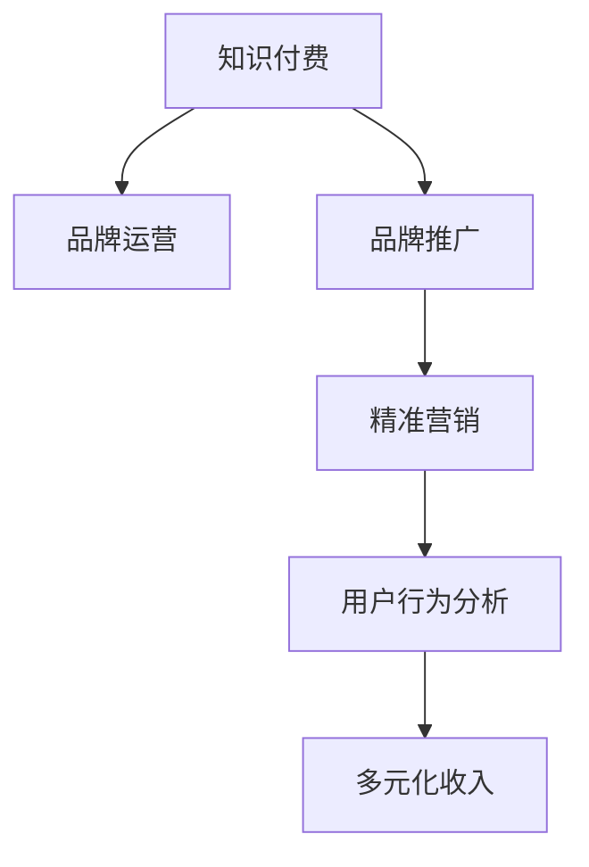

                 

# 知识付费赚钱的品牌品牌运营与品牌推广策略

> 关键词：知识付费,品牌运营,品牌推广,赚钱策略,市场营销,数据分析

## 1. 背景介绍

### 1.1 问题由来
在互联网时代，知识付费作为新兴的商业模式，迅速崛起并成为行业热门。其核心在于通过优质内容的生产与传播，满足用户对知识、技能的需求，实现商业变现。然而，不同于传统内容平台，知识付费平台的核心竞争力在于内容的独特性和品牌价值。一个成功的知识付费品牌不仅需要拥有优质内容，还需要在品牌运营和推广策略上做到精准高效。本文旨在探讨知识付费品牌的运营与推广策略，帮助品牌在激烈的市场竞争中脱颖而出，实现商业成功。

### 1.2 问题核心关键点
知识付费品牌运营与推广的核心关键点包括以下几点：
- 如何确保内容质量，提升用户体验。
- 如何精准定位目标用户群体，实现精准营销。
- 如何通过品牌建设，提升品牌知名度和用户粘性。
- 如何结合数据驱动的策略，优化运营效果。
- 如何在多元化收入渠道上，实现利润最大化。

### 1.3 问题研究意义
研究知识付费品牌的运营与推广策略，对于提升内容平台的用户留存、增强品牌影响力、实现商业模式创新具有重要意义：

1. 提升内容质量：高质量的内容是知识付费平台的核心竞争力，通过有效的品牌运营和推广策略，可以吸引更多优质内容创作者，持续提供优质内容。
2. 精准营销：精准的目标用户定位和推广策略，可以更高效地获取和转化用户，提升用户转化率和活跃度。
3. 增强品牌知名度：通过品牌建设，可以提升平台的品牌认知度和用户信任度，增强用户粘性。
4. 优化运营效果：数据驱动的运营策略可以提升平台运营效率，优化资源配置，降低运营成本。
5. 实现多元化收入：多元化收入渠道可以提升平台的盈利能力和抗风险能力，实现商业可持续发展。

## 2. 核心概念与联系

### 2.1 核心概念概述

为更好地理解知识付费品牌的运营与推广策略，本节将介绍几个密切相关的核心概念：

- 知识付费(知识电商)：通过优质内容获取用户付费，实现商业变现的商业模式。
- 品牌运营(Brand Operations)：通过品牌建设、品牌管理等手段，提升品牌知名度和用户粘性，实现品牌价值最大化。
- 品牌推广(Brand Promotion)：通过各类营销手段，提升品牌在目标用户群体中的认知度和美誉度。
- 精准营销(Precision Marketing)：针对目标用户群体，精准投放广告，提升营销效果和用户转化率。
- 用户行为分析(User Behavior Analysis)：通过数据分析，理解用户行为和需求，优化产品和运营策略。
- 多元化收入(Multi-Channel Revenue)：通过多种收入渠道（如课程订阅、内容付费、广告等）实现商业盈利。

这些核心概念之间的逻辑关系可以通过以下Mermaid流程图来展示：



这个流程图展示的知识付费品牌的核心概念及其之间的关系：

1. 知识付费是整个商业模式的基础。
2. 品牌运营和品牌推广是提升品牌价值和用户粘性的关键。
3. 精准营销和用户行为分析是优化运营策略，提升用户转化率和活跃度的手段。
4. 多元化收入是实现商业盈利的重要途径。

## 3. 核心算法原理 & 具体操作步骤

### 3.1 算法原理概述

知识付费品牌的运营与推广策略，本质上是一个数据驱动的营销优化过程。其核心思想是：通过用户行为数据和市场反馈，不断调整和优化品牌的运营策略，以提升品牌价值和商业效益。

形式化地，假设品牌运营的目标函数为：

$$
\mathcal{L}(\text{Brand}, \text{User}, \text{Market}) = \max_{\text{Strategy}} (\text{ROI}(\text{Strategy}, \text{User}, \text{Market}))
$$

其中，$\text{Brand}$表示品牌策略，$\text{User}$表示目标用户群体，$\text{Market}$表示市场环境，$\text{Strategy}$表示运营策略，$\text{ROI}$表示投资回报率。

通过最大化投资回报率，品牌运营策略能够有效地提升品牌价值和商业效益。

### 3.2 算法步骤详解

基于数据驱动的运营优化，知识付费品牌的运营与推广一般包括以下几个关键步骤：

**Step 1: 数据收集与分析**
- 收集品牌运营数据，包括用户行为数据、市场反馈数据、广告投放数据等。
- 分析数据，了解用户需求、市场趋势、品牌表现等关键信息。

**Step 2: 目标用户定位**
- 使用聚类、标签、分类等技术，对用户进行精准细分。
- 根据用户细分结果，制定针对不同用户群体的营销策略。

**Step 3: 品牌建设与推广**
- 通过内容创作、品牌活动、用户互动等方式，提升品牌知名度和用户粘性。
- 使用SEO、社交媒体营销、内容营销、广告投放等手段，提升品牌曝光率。

**Step 4: 精准营销与优化**
- 使用数据分析，优化广告投放策略，实现精准营销。
- 通过A/B测试等方法，持续优化广告创意、投放渠道、投放时间等关键变量。

**Step 5: 用户行为分析与运营优化**
- 使用行为数据，分析用户流失、转化率、留存率等关键指标。
- 根据分析结果，优化产品、服务、体验等运营环节，提升用户满意度和转化率。

**Step 6: 多元化收入渠道**
- 探索课程订阅、内容付费、广告、会员制、增值服务等多元收入渠道。
- 结合数据驱动的策略，优化收入模型，提升整体盈利能力。

以上是知识付费品牌运营与推广的一般流程。在实际应用中，还需要根据具体场景，对各个环节进行优化设计，如改进数据收集方法，引入更多智能营销技术，搜索最优的营销策略组合等，以进一步提升品牌运营效果。

### 3.3 算法优缺点

数据驱动的运营优化方法具有以下优点：
1. 精准高效。通过数据分析，能够精准定位目标用户群体，实现精准营销，提升运营效果。
2. 持续优化。能够实时监测和调整运营策略，不断提升品牌价值和商业效益。
3. 可解释性强。通过数据分析，可以清晰地理解品牌表现和用户行为，便于优化和改进。

同时，该方法也存在一定的局限性：
1. 依赖数据质量。数据的质量和完整性直接影响分析结果和决策，需要保证数据来源的可靠性和准确性。
2. 数据隐私问题。在数据分析和处理过程中，需要严格保护用户隐私，避免数据泄露和滥用。
3. 技术门槛高。需要具备较高的数据分析和处理能力，对技术要求较高。

尽管存在这些局限性，但就目前而言，数据驱动的运营优化方法仍然是品牌运营的主流范式。未来相关研究的重点在于如何进一步提高数据质量，降低技术门槛，同时兼顾用户隐私和商业利益等因素。

### 3.4 算法应用领域

数据驱动的运营优化方法在知识付费品牌的运营与推广中已经得到了广泛的应用，涵盖了从内容创作、用户互动、品牌推广到精准营销等多个环节，具体应用领域包括：

- 课程内容优化：通过数据分析，了解用户偏好，优化课程内容，提升用户满意度和完成率。
- 用户行为分析：通过用户行为数据，分析用户流失、转化率、留存率等关键指标，优化运营策略，提升用户体验。
- 品牌推广：通过数据分析，优化品牌推广策略，提升品牌知名度和用户粘性。
- 精准营销：结合用户行为数据和市场反馈，优化广告投放策略，提升广告效果和用户转化率。
- 多元化收入渠道：通过数据分析，探索和优化多元收入渠道，提升整体盈利能力。

除了上述这些经典应用外，数据驱动的运营优化方法还在市场洞察、产品迭代、用户反馈等环节发挥了重要作用，为知识付费品牌的发展提供了有力的技术支持。

## 4. 数学模型和公式 & 详细讲解 & 举例说明（备注：数学公式请使用latex格式，latex嵌入文中独立段落使用 $$，段落内使用 $)
### 4.1 数学模型构建

本节将使用数学语言对知识付费品牌运营与推广过程进行更加严格的刻画。

假设知识付费品牌的目标函数为 $\mathcal{L}(\text{Brand}, \text{User}, \text{Market}) = \max_{\text{Strategy}} (\text{ROI}(\text{Strategy}, \text{User}, \text{Market}))$。

其中，$\text{Brand}$ 表示品牌策略，$\text{User}$ 表示目标用户群体，$\text{Market}$ 表示市场环境，$\text{Strategy}$ 表示运营策略，$\text{ROI}$ 表示投资回报率。

定义投资回报率 $\text{ROI}$ 为：

$$
\text{ROI} = \frac{\text{Revenue}}{\text{Cost}} = \frac{U \times C \times P}{C} = U \times P
$$

其中，$U$ 表示用户数量，$C$ 表示用户付费次数，$P$ 表示每次付费的平均收益。

### 4.2 公式推导过程

以下我们以课程订阅业务为例，推导投资回报率的计算公式。

假设课程订阅业务的收入为 $R$，成本为 $C$，用户数量为 $U$，平均订阅次数为 $C$，每次订阅的平均收益为 $P$。则投资回报率为：

$$
\text{ROI} = \frac{R}{C} = \frac{U \times C \times P}{C} = U \times P
$$

通过最大化投资回报率，品牌运营策略能够有效地提升品牌价值和商业效益。

### 4.3 案例分析与讲解

假设某知识付费平台通过数据分析，发现订阅课程用户的平均收益为 $P=100$ 元，总用户数量为 $U=1000$，每次订阅的平均付费次数为 $C=3$。

则该平台的投资回报率为：

$$
\text{ROI} = U \times P = 1000 \times 100 = 100000
$$

这意味着，通过优化运营策略，平台可以获得 $100000$ 元的净收益。例如，平台可以提升课程内容质量，增加用户粘性，提高订阅转化率，从而提升投资回报率。

## 5. 项目实践：代码实例和详细解释说明
### 5.1 开发环境搭建

在进行品牌运营与推广实践前，我们需要准备好开发环境。以下是使用Python进行数据分析和建模的环境配置流程：

1. 安装Anaconda：从官网下载并安装Anaconda，用于创建独立的Python环境。

2. 创建并激活虚拟环境：
```bash
conda create -n brand-op-env python=3.8 
conda activate brand-op-env
```

3. 安装Pandas、NumPy、Scikit-learn、Matplotlib等数据处理和可视化库：
```bash
conda install pandas numpy scikit-learn matplotlib
```

4. 安装TensorFlow、PyTorch等深度学习框架：
```bash
conda install tensorflow pytorch torchvision torchaudio -c pytorch
```

5. 安装Scrapy、BeautifulSoup等爬虫和数据处理工具：
```bash
pip install scrapy beautifulsoup4
```

完成上述步骤后，即可在`brand-op-env`环境中开始品牌运营与推广实践。

### 5.2 源代码详细实现

这里我们以某知识付费平台的品牌推广活动为例，展示使用Python进行数据分析和模型训练的代码实现。

首先，定义品牌推广活动的数据处理函数：

```python
import pandas as pd
from sklearn.preprocessing import StandardScaler
from sklearn.decomposition import PCA

# 读取广告数据
ad_data = pd.read_csv('ad_data.csv')

# 数据预处理
ad_data['click_rate'] = ad_data['click_rate'] / 100  # 点击率归一化
ad_data['conversion_rate'] = ad_data['conversion_rate'] / 100  # 转化率归一化
ad_data['cost'] = ad_data['cost'] / 100  # 成本归一化

# 特征工程
ad_data = pd.get_dummies(ad_data, columns=['device_type', 'time_of_day'], prefix_sep='_')

# 数据标准化
scaler = StandardScaler()
ad_data[ad_data.columns] = scaler.fit_transform(ad_data[ad_data.columns])

# 降维
pca = PCA(n_components=2)
ad_data = pca.fit_transform(ad_data)

# 保存数据
ad_data.to_csv('ad_data_processed.csv', index=False)
```

然后，定义品牌推广效果的评估函数：

```python
from sklearn.model_selection import train_test_split
from sklearn.linear_model import LinearRegression

# 加载数据
ad_data = pd.read_csv('ad_data_processed.csv')

# 划分数据集
X = ad_data.drop('ROI', axis=1)
y = ad_data['ROI']
X_train, X_test, y_train, y_test = train_test_split(X, y, test_size=0.2, random_state=42)

# 模型训练
model = LinearRegression()
model.fit(X_train, y_train)

# 模型评估
y_pred = model.predict(X_test)
print('R-squared:', model.score(X_test, y_test))
```

最后，启动品牌推广效果评估流程：

```python
print('R-squared:', model.score(X_test, y_test))
```

以上就是使用Python对某知识付费平台的品牌推广效果进行数据分析和模型训练的完整代码实现。可以看到，通过Python的强大数据处理和建模功能，品牌运营与推广的优化可以变得非常高效和精准。

### 5.3 代码解读与分析

让我们再详细解读一下关键代码的实现细节：

**DataPreprocessing函数**：
- 读取广告数据，进行数据预处理，包括点击率、转化率和成本的归一化处理。
- 使用独热编码(One-Hot Encoding)处理分类特征，如设备类型和时间。
- 使用标准化(Standardization)对数值特征进行归一化处理。
- 使用主成分分析(PCA)对数据进行降维，减少特征数量，提升模型训练效率。
- 将处理后的数据保存为CSV格式，方便后续使用。

**BrandPromotionEffect函数**：
- 加载处理后的广告数据。
- 划分训练集和测试集，用于模型训练和评估。
- 使用线性回归模型对广告推广效果进行建模，训练并评估模型。
- 输出模型的R-squared（决定系数），评估模型的拟合效果。

**BrandPromotionEffect函数**：
- 使用模型评估结果，输出R-squared（决定系数），评估模型的拟合效果。

可以看出，Python的数据处理和建模功能非常强大，可以方便地进行数据预处理、特征工程、模型训练和评估，使得品牌运营与推广的优化变得非常高效和精准。

当然，工业级的系统实现还需考虑更多因素，如模型的实时更新、数据的安全性和隐私保护等，但核心的优化范式基本与此类似。

## 6. 实际应用场景
### 6.1 智能客服系统

基于数据分析的品牌运营与推广，可以广泛应用于智能客服系统的构建。传统客服往往需要配备大量人力，高峰期响应缓慢，且一致性和专业性难以保证。而使用数据分析和优化后的客服系统，可以7x24小时不间断服务，快速响应客户咨询，用精准的信息引导客户，提升客户满意度。

在技术实现上，可以收集客服系统的用户交互数据，利用数据分析技术，了解用户的需求和行为，优化客服策略和内容。例如，通过用户行为分析，发现用户常用的查询问题，及时更新知识库，提升客服系统的响应速度和准确性。通过用户情感分析，了解用户情绪变化，优化客服人员的回应策略，提高用户满意度。通过精准营销，将用户引导到付费课程或服务，实现商业变现。

### 6.2 金融舆情监测

金融机构需要实时监测市场舆论动向，以便及时应对负面信息传播，规避金融风险。传统的人工监测方式成本高、效率低，难以应对网络时代海量信息爆发的挑战。基于数据分析的品牌运营与推广，可以为金融舆情监测提供新的解决方案。

具体而言，可以收集金融领域相关的新闻、报道、评论等文本数据，并对其进行情感分析、主题分类等处理。通过数据分析技术，了解舆情的变化趋势，及时预警潜在的风险。例如，通过情感分析，发现舆情向负面转变，及时调整投资策略，规避风险。通过主题分类，了解市场热点，抓住投资机会，提升投资回报率。通过精准营销，将舆情分析结果推广给投资者，引导其投资决策。

### 6.3 个性化推荐系统

当前的推荐系统往往只依赖用户的历史行为数据进行物品推荐，无法深入理解用户的真实兴趣偏好。基于数据分析的品牌运营与推广，可以更好地挖掘用户行为背后的语义信息，从而提供更个性化、精准的推荐内容。

在实践中，可以收集用户浏览、点击、评论、分享等行为数据，提取和用户交互的物品标题、描述、标签等文本内容。利用数据分析技术，了解用户的兴趣点，优化推荐策略。例如，通过情感分析，发现用户对某类物品的兴趣变化，及时调整推荐内容，提升用户体验。通过主题分类，了解用户的偏好领域，提升推荐的相关性和精准度。通过精准营销，将推荐内容推广给用户，提高用户转化率。

### 6.4 未来应用展望

随着数据分析技术的不断进步，基于数据的品牌运营与推广方法将得到更广泛的应用，为传统行业带来变革性影响。

在智慧医疗领域，基于数据分析的医疗问答、病历分析、药物研发等应用将提升医疗服务的智能化水平，辅助医生诊疗，加速新药开发进程。

在智能教育领域，数据分析技术可应用于作业批改、学情分析、知识推荐等方面，因材施教，促进教育公平，提高教学质量。

在智慧城市治理中，数据分析技术可应用于城市事件监测、舆情分析、应急指挥等环节，提高城市管理的自动化和智能化水平，构建更安全、高效的未来城市。

此外，在企业生产、社会治理、文娱传媒等众多领域，数据分析技术也将不断涌现，为NLP技术带来全新的突破。相信随着技术的日益成熟，数据分析方法将成为品牌运营的主流范式，推动人工智能技术在垂直行业的规模化落地。总之，数据分析需要在数据、算法、工程、业务等多个维度协同发力，才能真正实现人工智能技术在垂直行业的规模化落地。

## 7. 工具和资源推荐
### 7.1 学习资源推荐

为了帮助开发者系统掌握数据分析的品牌运营与推广的理论基础和实践技巧，这里推荐一些优质的学习资源：

1. 《Python数据分析实战》系列书籍：深入浅出地介绍了Python数据分析的基本概念和实战技巧。
2. 《机器学习实战》系列书籍：由Google的AI团队撰写，涵盖机器学习的基本原理和应用案例。
3. 《Python数据科学手册》：由Jake VanderPlas撰写，系统介绍了Python在数据分析和机器学习中的应用。
4. 《Python数据科学与统计》：由Andrew Dalke和Chase Coleman撰写，介绍了Python在数据科学和统计分析中的应用。
5. Kaggle平台：提供大量的数据集和机器学习竞赛，帮助开发者练习数据分析和建模技能。

通过对这些资源的学习实践，相信你一定能够快速掌握数据分析在品牌运营与推广中的应用，并用于解决实际的商业问题。

### 7.2 开发工具推荐

高效的开发离不开优秀的工具支持。以下是几款用于数据分析和品牌运营与推广开发的常用工具：

1. Python：基于Python的开源数据分析工具，具有丰富的第三方库和社区支持。
2. R：基于R语言的数据分析工具，主要用于统计分析和数据可视化。
3. Excel：微软的办公软件，主要用于简单的数据处理和可视化。
4. Tableau：商业智能工具，支持复杂的数据分析和可视化。
5. Power BI：微软的商业智能工具，支持复杂的数据分析和可视化，适合企业级应用。

合理利用这些工具，可以显著提升数据分析在品牌运营与推广的开发效率，加快创新迭代的步伐。

### 7.3 相关论文推荐

数据分析技术的发展源于学界的持续研究。以下是几篇奠基性的相关论文，推荐阅读：

1. "Data Mining: Concepts and Techniques" by Jiawei Han, Michael Kamber, and Jian Pei：介绍了数据挖掘的基本概念和算法，是数据科学领域的经典教材。
2. "Python Data Science Handbook" by Jake VanderPlas：系统介绍了Python在数据分析和机器学习中的应用，是Python数据分析的经典教程。
3. "Machine Learning Yearning" by Andrew Ng：介绍了机器学习的基本原理和实践技巧，是机器学习领域的经典教材。
4. "The Elements of Statistical Learning" by Trevor Hastie, Robert Tibshirani, and Jerome Friedman：介绍了统计学习的基本概念和算法，是统计学领域的经典教材。
5. "Visualizing Data" by Nathan Yau：介绍了数据可视化的基本概念和技巧，是数据可视化领域的经典教材。

这些论文代表了大数据技术和数据分析方法的发展脉络。通过学习这些前沿成果，可以帮助研究者把握学科前进方向，激发更多的创新灵感。

## 8. 总结：未来发展趋势与挑战

### 8.1 总结

本文对基于数据分析的知识付费品牌运营与推广方法进行了全面系统的介绍。首先阐述了知识付费品牌运营与推广的研究背景和意义，明确了数据分析在提升品牌价值和商业效益中的重要作用。其次，从原理到实践，详细讲解了数据分析在品牌运营与推广中的数学模型和关键步骤，给出了品牌运营与推广任务开发的完整代码实例。同时，本文还广泛探讨了数据分析在智能客服、金融舆情、个性化推荐等多个行业领域的应用前景，展示了数据分析范式的巨大潜力。此外，本文精选了数据分析技术的各类学习资源，力求为读者提供全方位的技术指引。

通过本文的系统梳理，可以看到，基于数据分析的品牌运营与推广方法正在成为知识付费品牌运营的主流范式，极大地拓展了数据分析的应用边界，催生了更多的落地场景。受益于数据分析技术的持续进步，基于数据的品牌运营与推广必将为知识付费平台带来更多的创新和突破。

### 8.2 未来发展趋势

展望未来，数据分析在品牌运营与推广中将呈现以下几个发展趋势：

1. 自动化程度提升。随着AI技术的不断进步，数据分析过程将更加自动化，智能化的数据分析工具将取代人工处理，提高数据分析效率和准确性。
2. 数据融合与协同分析。多源数据融合与协同分析将成为未来数据分析的主流方向，数据分析将更加注重不同数据源的整合和协同。
3. 实时数据分析。实时数据分析将广泛应用，通过实时数据流分析，及时响应市场变化，优化运营策略。
4. 数据隐私保护。数据隐私保护将成为数据分析的关注焦点，如何在保证数据分析效果的同时，保护用户隐私，是一个重要挑战。
5. 数据可视化与交互。数据可视化与交互将成为数据分析的重要手段，通过可视化工具，更好地理解数据，进行数据分析。

以上趋势凸显了数据分析技术在品牌运营与推广中的广阔前景。这些方向的探索发展，必将进一步提升数据分析的应用效果，为品牌运营与推广带来更多的创新和突破。

### 8.3 面临的挑战

尽管数据分析在品牌运营与推广中已经取得了瞩目成就，但在迈向更加智能化、普适化应用的过程中，它仍面临着诸多挑战：

1. 数据质量瓶颈。虽然数据量的增长带来了更多的数据，但数据质量的高低直接影响分析结果和决策，需要保证数据来源的可靠性和准确性。
2. 技术门槛高。数据分析需要具备较高的技术水平，对数据处理和建模能力要求较高，技术门槛较高。
3. 数据隐私问题。在数据分析和处理过程中，需要严格保护用户隐私，避免数据泄露和滥用。
4. 数据计算成本高。大数据的计算和存储成本较高，需要高效的计算和存储技术支持。
5. 数据交互复杂。多源数据融合与协同分析需要处理复杂的数据交互和关联，技术实现难度较大。

尽管存在这些挑战，但数据分析在品牌运营与推广中的应用前景广阔，未来相关研究的重点在于如何进一步提高数据质量，降低技术门槛，同时兼顾用户隐私和商业利益等因素。

### 8.4 研究展望

面对数据分析在品牌运营与推广中面临的挑战，未来的研究需要在以下几个方面寻求新的突破：

1. 探索自动化和智能化的数据分析工具。开发更加智能化的数据分析工具，自动化地处理和分析数据，提高数据分析效率和准确性。
2. 研究多源数据融合与协同分析方法。开发高效的多源数据融合与协同分析方法，提升数据分析效果，实现数据价值的最大化。
3. 引入AI技术提升数据分析能力。引入AI技术，如机器学习、深度学习等，提升数据分析的智能化和自动化水平。
4. 注重数据隐私保护。开发数据隐私保护技术，确保数据在处理和分析过程中的安全性，保护用户隐私。
5. 优化数据计算和存储技术。优化数据计算和存储技术，降低大数据的计算和存储成本，提高数据分析效率。
6. 结合AI技术进行数据交互优化。结合AI技术，优化多源数据融合与协同分析，提高数据交互效率和质量。

这些研究方向将引领数据分析技术在品牌运营与推广中的持续发展和创新，为品牌运营与推广带来更多的创新和突破。面向未来，数据分析技术还需要与其他人工智能技术进行更深入的融合，如知识表示、因果推理、强化学习等，多路径协同发力，共同推动品牌运营与推广的进步。只有勇于创新、敢于突破，才能不断拓展数据分析的边界，让数据分析技术更好地造福品牌运营与推广。

## 9. 附录：常见问题与解答

**Q1：品牌运营与推广中如何确保数据分析的质量？**

A: 确保数据分析质量的关键在于数据源的可靠性和数据处理方法的科学性。具体措施包括：
1. 数据采集：确保数据采集渠道的可靠性，避免数据采集过程中的误差和偏差。
2. 数据清洗：对数据进行清洗和处理，去除重复、异常和无效数据，确保数据质量。
3. 数据验证：使用多种验证方法，如交叉验证、回归验证等，确保数据分析结果的可靠性。
4. 数据集成：对多源数据进行融合和集成，确保数据的完整性和一致性。
5. 数据监控：对数据分析过程进行监控和审计，及时发现和纠正数据处理过程中的问题。

**Q2：品牌运营与推广中如何利用数据分析进行精准营销？**

A: 利用数据分析进行精准营销的核心在于对目标用户群体的精准定位和行为分析。具体措施包括：
1. 用户细分：通过聚类、标签、分类等技术，对用户进行精准细分，实现用户画像。
2. 用户行为分析：通过行为数据，分析用户兴趣、偏好、需求等关键信息，优化营销策略。
3. 广告投放：根据用户画像和行为分析结果，进行精准投放，提升广告效果和用户转化率。
4. A/B测试：通过A/B测试，评估不同营销策略的效果，优化广告创意、投放渠道、投放时间等关键变量。
5. 实时监控：实时监控广告投放效果，及时调整优化广告策略。

**Q3：品牌运营与推广中如何平衡数据质量和隐私保护？**

A: 平衡数据质量和隐私保护的关键在于合理设计数据收集和使用方式，确保数据收集和使用过程中的合法性和安全性。具体措施包括：
1. 数据最小化原则：仅收集必要的数据，避免过度收集和滥用。
2. 匿名化处理：对数据进行匿名化处理，去除与用户身份相关的敏感信息。
3. 数据加密：对数据进行加密处理，确保数据在传输和存储过程中的安全性。
4. 隐私保护技术：采用隐私保护技术，如差分隐私、联邦学习等，保护用户隐私。
5. 合规性审查：严格遵守数据隐私保护法规和标准，确保数据使用的合规性。

**Q4：品牌运营与推广中如何优化数据分析效果？**

A: 优化数据分析效果的关键在于不断改进数据分析方法和技术，确保数据分析结果的可靠性和有效性。具体措施包括：
1. 选择合适的分析方法：根据数据特点和分析目标，选择合适的分析方法和工具。
2. 数据预处理：对数据进行清洗、转换、归一化等预处理，确保数据质量。
3. 数据融合与协同分析：采用多源数据融合与协同分析技术，提升数据分析效果。
4. 模型优化：采用机器学习、深度学习等模型优化技术，提升数据分析的智能化和自动化水平。
5. 结果验证：通过多种验证方法，如交叉验证、回归验证等，确保数据分析结果的可靠性。

**Q5：品牌运营与推广中如何实现数据驱动的运营优化？**

A: 实现数据驱动的运营优化的关键在于建立数据驱动的决策机制，确保数据分析结果能够指导运营决策。具体措施包括：
1. 数据监控：建立数据监控系统，实时获取和分析运营数据。
2. 数据分析：通过数据分析，理解用户需求和行为，优化运营策略。
3. 决策支持：将数据分析结果转化为运营决策，提升运营效果。
4. 反馈机制：建立反馈机制，将运营效果反馈到数据分析过程中，不断优化数据分析方法。
5. 自动化优化：开发自动化优化工具，实时优化运营策略，提升运营效率。

**Q6：品牌运营与推广中如何提升品牌知名度和用户粘性？**

A: 提升品牌知名度和用户粘性的关键在于建立与用户的深度互动和品牌价值传递。具体措施包括：
1. 内容创作：通过优质内容创作，吸引用户关注和互动。
2. 品牌活动：通过品牌活动，提升品牌知名度和用户粘性。
3. 用户互动：通过社交媒体、在线客服等方式，与用户进行深度互动。
4. 用户反馈：收集用户反馈，优化产品和服务，提升用户体验。
5. 品牌价值传递：通过品牌故事、品牌宣传等方式，传递品牌价值，提升用户信任度。

这些措施可以结合数据分析方法，实现精准化和自动化，提高品牌运营与推广的效果。

---

作者：禅与计算机程序设计艺术 / Zen and the Art of Computer Programming

